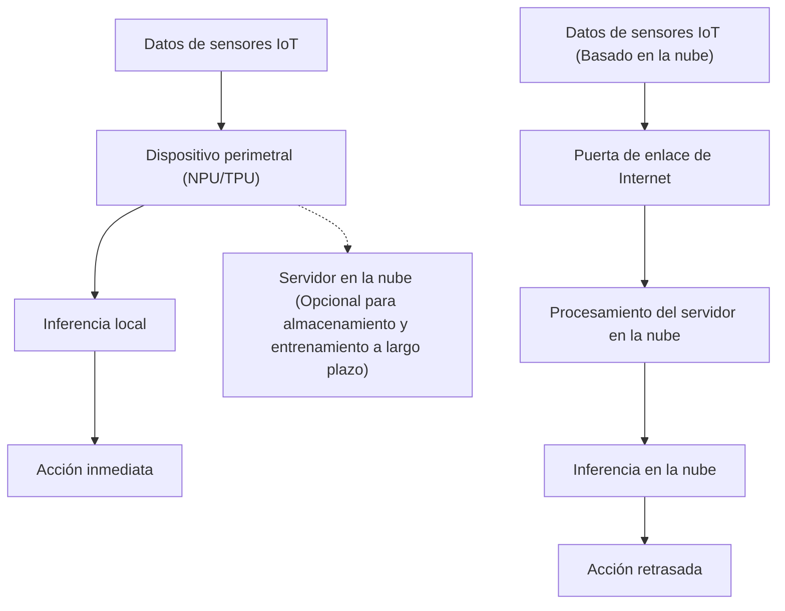
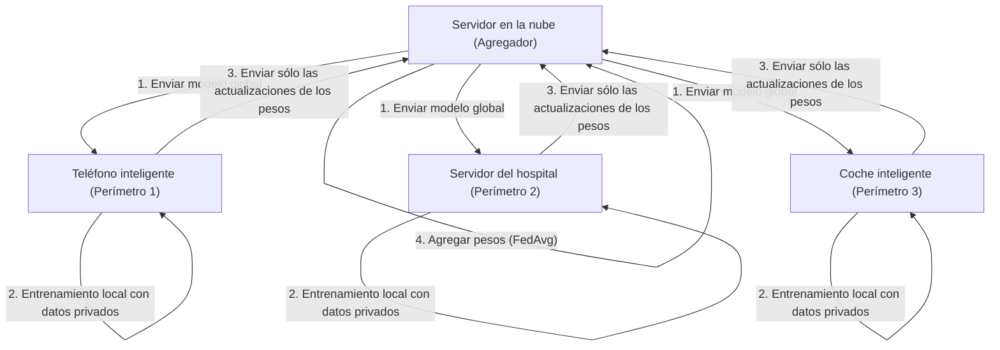

# El futuro de la IA perimetral (Edge AI) y los enfoques de implementación para dispositivos IoT

## 1. Introducción: ¿Por qué la IA perimetral (Edge AI) ahora?

Con la proliferación de los dispositivos IoT (Internet de las Cosas), hemos entrado en una era donde todo tipo de objetos físicos en todo el mundo están conectados a Internet. Junto con la evolución de la tecnología de sensores, la cantidad de datos generados por estos dispositivos ha aumentado explosivamente. Tradicionalmente, estas cantidades masivas de datos se enviaban a la nube, donde potentes recursos computacionales (como enormes clústeres de GPU) se utilizaban para realizar inferencias mediante modelos de IA. Este es el enfoque común de la "IA en la nube" (Cloud AI).

Sin embargo, la arquitectura de enviar todos los datos a la nube, procesarlos allí y devolver los resultados al dispositivo tiene varias limitaciones importantes.
1. **Problemas de latencia**: En sistemas que requieren decisiones instantáneas en milisegundos, como los coches autónomos, robots industriales y drones, el retraso en la comunicación de la red puede provocar accidentes fatales.
2. **Privacidad y seguridad**: El envío constante de información personal, datos biométricos y vídeos altamente confidenciales a la nube, como en el caso de las cámaras de vigilancia del hogar inteligente o los dispositivos médicos portátiles, conlleva el riesgo de filtraciones de información y violaciones de privacidad.
3. **Ancho de banda de la red y costes**: Si millones de cámaras IoT transmiten continuamente vídeos 4K a la nube, el ancho de banda de la red se agotará, y los costes de transferencia de datos y almacenamiento en la nube serán enormes.
4. **Estabilidad de la conexión (Entornos sin conexión)**: En entornos donde la conexión a Internet es inestable o inexistente, como en instalaciones subterráneas, en el mar o en granjas remotas, la dependencia de la nube significa la interrupción completa del funcionamiento de todo el sistema.

Para resolver estos desafíos ha surgido la **"IA perimetral" (Edge AI)**. La Edge AI es una tecnología que ejecuta algoritmos de IA directamente en los propios dispositivos IoT que generan los datos (o en el extremo de la red más cercano a ellos, es decir, el "perímetro" o "edge"). De este modo, los datos se procesan y analizan inmediatamente en la fuente, permitiendo la construcción de sistemas inteligentes rápidos, seguros y de bajo coste, minimizando la dependencia de la nube.

En este artículo, exploraremos profundamente desde una perspectiva técnica los fundamentos de la Edge AI, las últimas tendencias en hardware (como NPU/TPU), las tecnologías de compresión para adaptar los modelos a entornos perimetrales (cuantización y poda), métodos de implementación utilizando ONNX Runtime y, finalmente, el Aprendizaje Federado (Federated Learning) para lograr la protección de la privacidad y el aprendizaje distribuido.

---

## 2. Comparación de la arquitectura entre la IA en la nube y la IA perimetral

Para comprender visualmente la diferencia entre la IA en la nube y la IA perimetral, consulte el siguiente diagrama de arquitectura.



Como se puede ver en este diagrama, en la arquitectura de Edge AI, el ciclo desde la fuente de datos hasta la inferencia y la acción (control) se completa dentro del dispositivo perimetral. La nube asume únicamente un papel auxiliar no en tiempo real, como la distribución de modelos ya entrenados, la agregación de datos a largo plazo y el análisis de tendencias.

### Modelo matemático de la latencia de inferencia

Formulemos matemáticamente la diferencia de latencia entre el perímetro (edge) y la nube. El tiempo total hasta la finalización de la inferencia de todo el sistema, $T_{total}$, se expresa de la siguiente manera:

**En el caso de la IA en la nube:**
$$ T_{total} = T_{network\_up} + T_{cloud\_compute} + T_{network\_down} $$

Aquí, el tiempo de subida de la red $T_{network\_up}$ depende de la siguiente ecuación:
$$ T_{network\_up} = \frac{D}{B} + RTT $$
($D$: Tamaño de los datos a enviar, $B$: Ancho de banda de la red, $RTT$: Tiempo de ida y vuelta o Round Trip Time)

Cuando el tamaño de los datos $D$ es grande (como imágenes de alta resolución o datos de vibración continuos) o el ancho de banda $B$ es estrecho, $T_{network\_up}$ aumenta drásticamente. Por muy rápida que sea la velocidad de inferencia de la IA en sí misma ($T_{cloud\_compute}$), esto se convertirá en un cuello de botella.

**En el caso de la IA perimetral (Edge AI):**
$$ T_{total} \approx T_{edge\_compute} $$

Dado que la Edge AI no implica transferencias de red, $T_{network\_up}$ y $T_{network\_down}$ son casi cero (sólo transferencias en el bus local). Aunque la capacidad de cálculo de los dispositivos perimetrales suele ser inferior a la de la nube, resultando a menudo en $T_{edge\_compute} > T_{cloud\_compute}$, el $T_{total}$ global se mantiene consistentemente bajo porque se eliminan la latencia de la red y la incertidumbre de la comunicación.

---

## 3. Tecnologías de hardware que respaldan la IA perimetral

Para ejecutar modelos de aprendizaje profundo a alta velocidad en dispositivos perimetrales, es indispensable contar con aceleradores de hardware dedicados. Con el procesamiento basado en CPU tradicionales, la inferencia de IA en tiempo real era difícil debido al consumo de energía y la velocidad de procesamiento. A continuación, presentamos algunos de los hardwares más representativos para Edge AI.

### 3.1 NPU (Neural Processing Unit) y TPU (Tensor Processing Unit)
El proceso de inferencia en el aprendizaje profundo (especialmente en CNNs) se compone de una gran cantidad de operaciones de multiplicación y acumulación de matrices (operaciones MAC). NPU y TPU son chips dedicados (ASICs) diseñados específicamente para ejecutar estas operaciones MAC en paralelo con un consumo de energía ultrabajo.

- **Google Coral Edge TPU**:
  El Edge TPU proporcionado por Google es un coprocesador muy pequeño pero con potentes capacidades de inferencia. Con tan solo 2W de consumo de energía, ofrece un rendimiento de 4 TOPS (Tera Operations Per Second: 4 billones de operaciones por segundo). Esto permite ejecutar en tiempo real modelos optimizados de TensorFlow Lite para móviles simplemente conectándolo por USB a un SBC (ordenador de placa única) ligero como una Raspberry Pi.
- **Raspberry Pi AI Kit (equipado con Hailo-8L)**:
  El recientemente lanzado Raspberry Pi AI Kit está equipado con el acelerador de IA "Hailo-8L" de Hailo. La arquitectura de Hailo mapea la estructura de la red neuronal directamente en la estructura de hardware del chip, eliminando el cuello de botella de acceso a la memoria y logrando un rendimiento de inferencia asombroso de hasta 13 TOPS con un presupuesto de energía de pocos vatios.
- **Serie NVIDIA Jetson**:
  Las series Jetson Nano, Xavier y Orin son SoCs que integran CPUs ARM y potentes núcleos de GPU de NVIDIA. Dado que permiten aprovechar directamente el ecosistema CUDA, es sumamente fácil implementar modelos de PyTorch o TensorFlow entrenados en la nube en el perímetro a través de TensorRT.

### TOPS y Eficiencia energética (TOPS/W)
El indicador más importante al evaluar el hardware de Edge AI es "TOPS/W (TOPS por vatio)". Como los dispositivos IoT operan bajo estrictas limitaciones de energía, como el funcionamiento con batería o PoE (Power over Ethernet), la clave no es solo el rendimiento de cálculo puro (TOPS), sino cuánta inferencia de IA puede realizarse con la menor cantidad de energía posible.

---

## 4. Implementación en dispositivos perimetrales: Teoría y práctica de la compresión de modelos

Incluso con los avances en el hardware, es imposible cargar modelos masivos de aprendizaje profundo (como GPT o un ResNet grande) que ocupan desde cientos de MB hasta varios GB directamente en la memoria RAM limitada (unos pocos MB a GB) de un dispositivo perimetral. Por lo tanto, la "compresión de modelos" (Model Compression) es esencial. Aquí explicaremos en detalle dos métodos representativos: "Cuantización" (Quantization) y "Poda" (Pruning).

### 4.1 Cuantización de modelos (Quantization)

En los modelos de aprendizaje profundo, los pesos y las funciones de activación se representan normalmente con coma flotante de 32 bits (FP32). La cuantización es la tecnología para reducir esta precisión a 16 bits (FP16), enteros de 8 bits (INT8) o incluso a menos bits.

**Efecto de reducción de memoria**:
Si el número de parámetros es $N$, la cantidad de memoria necesaria se calcula de la siguiente manera:
$$ M_{FP32} = N \times 4 \text{ (Bytes)} $$
$$ M_{INT8} = N \times 1 \text{ (Bytes)} $$
Mediante la cuantización a INT8, el tamaño del modelo y el uso de la memoria pueden reducirse teóricamente a un $\frac{1}{4}$. Además, el hardware (como las NPUs) puede ejecutar operaciones MAC en INT8 varias veces a decenas de veces más rápido y con un consumo de energía mucho menor que las operaciones en FP32, lo que resulta en una reducción drástica de la latencia de inferencia y del consumo de energía.

**Modelo matemático de la cuantización**:
La ecuación básica de cuantización afín para mapear un número real $r$ (FP32) a un número entero $q$ (INT8: -128 a 127) es la siguiente:

$$ r = S \times (q - Z) $$
$$ q = \text{round}\left( \frac{r}{S} + Z \right) $$

Aquí, $S$ representa el factor de escala (Scale) y $Z$ es el punto cero (Zero-point: el valor de tipo entero al que se mapea el número real 0).

La cuantización se divide en dos enfoques: la **Post-Training Quantization (PTQ)**, que convierte el modelo después de completar el entrenamiento, y el **Quantization-Aware Training (QAT)**, que actualiza los pesos simulando el error de cuantización durante el propio proceso de entrenamiento. Se recomienda el QAT si se desea minimizar la pérdida de precisión.

### 4.2 Poda de modelos (Pruning)

Dentro de una red neuronal, existe una gran cantidad de pesos que apenas tienen impacto (de baja importancia) en el resultado de la inferencia final. La tecnología que reduce a cero estos pesos innecesarios, o los elimina por completo de la estructura de la red, se conoce como poda (Pruning).

**Definición de Sparsity (Dispersión / Esparcidad)**:
$$ \text{Sparsity} (S) = \frac{N_{zero}}{N_{total}} \times 100 \text{ (\%)} $$
Donde $N_{zero}$ es el número de pesos que se han fijado a cero, y $N_{total}$ es el número total de pesos en todo el modelo.

- **Poda no estructurada (Unstructured Pruning)**: Un método que convierte los pesos individuales a cero de forma independiente. Aunque aumenta la dispersión, la matriz de pesos simplemente se convierte en una matriz dispersa (Sparse Matrix). Como los patrones de acceso a la memoria se vuelven irregulares en CPUs y GPUs estándar, es posible que no se logre la aceleración esperada.
- **Poda estructurada (Structured Pruning / Channel Pruning)**: Un método que elimina por completo filtros o canales enteros de una capa convolucional. Debido a que las dimensiones de la red misma se reducen, se obtiene una mejora clara de la velocidad de inferencia (Speedup) y un efecto de reducción de memoria en cualquier tipo de hardware.

La tasa de mejora de la velocidad de inferencia $S_{speedup}$ es generalmente proporcional a la tasa de reducción de canales $c$ ($0 < c < 1$) de la siguiente manera (basado en la disminución del número de operaciones MAC):
$$ S_{speedup} \propto \frac{1}{(1 - c)^2} $$
(*Nota: La complejidad computacional de las operaciones convolucionales es proporcional al producto del número de canales de entrada y salida.)

---

## 5. Despliegue y motor de inferencia: Uso de ONNX Runtime

Para poder ejecutar realmente modelos comprimidos en dispositivos perimetrales, se necesita un motor de inferencia ligero que soporte múltiples plataformas. Actualmente, el estándar de la industria ampliamente utilizado es **ONNX (Open Neural Network Exchange)** y **ONNX Runtime**.

ONNX es un estándar para manejar modelos en un formato común entre diferentes marcos de trabajo como PyTorch y TensorFlow. ONNX Runtime es el motor encargado de ejecutar óptimamente estos modelos ONNX en diversos hardwares.

El punto fuerte de ONNX Runtime radica en el mecanismo de los **Execution Providers (EP)**. Sin necesidad de reescribir el código, el entorno de ejecución de fondo se puede cambiar a CPU, CUDA (GPU), TensorRT, OpenVINO, CoreML, XNNPACK, entre otros.

A continuación se muestra un ejemplo básico de código en Python para la inferencia mediante ONNX Runtime en un dispositivo perimetral:

```python
import onnxruntime as ort
import numpy as np
import time

def run_edge_inference(model_path, input_data):
    # Especificación del Execution Provider según el dispositivo perimetral
    # Ejemplo: 'CPUExecutionProvider' en el caso de la CPU
    # Especificar un EP personalizado si es compatible con Coral Edge TPU o NPU específica
    providers = ['CPUExecutionProvider']
    
    # Inicialización de la sesión (Carga del modelo y optimización del grafo)
    session = ort.InferenceSession(model_path, providers=providers)
    
    # Obtener el nombre y la forma de la entrada del modelo
    input_name = session.get_inputs()[0].name
    expected_shape = session.get_inputs()[0].shape
    print(f"Expected input shape: {expected_shape}")
    
    # Medición del tiempo de inferencia
    start_time = time.time()
    
    # Ejecución de la inferencia
    # Los datos de entrada deben pasarse como un array adecuado de Numpy (ej. np.float32 o np.int8)
    outputs = session.run(None, {input_name: input_data})
    
    latency = (time.time() - start_time) * 1000.0 # Convertir a milisegundos
    print(f"Inference Latency: {latency:.2f} ms")
    
    return outputs[0]

# Datos de entrada ficticios (Ejemplo: imagen RGB de 224x224 con tamaño de lote 1)
dummy_input = np.random.randn(1, 3, 224, 224).astype(np.float32)
# run_edge_inference("lightweight_model.onnx", dummy_input)
```

Al usar este código como base y portarlo a lenguajes de menor latencia como C++, es posible maximizar el rendimiento del hardware en el dispositivo perimetral.

---

## 6. Protección de la privacidad y aprendizaje distribuido: Aprendizaje Federado (Federated Learning)

Una de las evoluciones definitivas de la Edge AI es el **Aprendizaje Federado (Federated Learning)**, en el cual no solo la "inferencia", sino también el "entrenamiento" de modelos se distribuye en el perímetro.

En el aprendizaje automático tradicional, los datos en bruto (vídeo, audio, registros, etc.) se recolectaban de todos los dispositivos IoT en la nube y el modelo se entrenaba centralizadamente de una vez. Sin embargo, la recopilación de datos de teléfonos inteligentes personales o equipos médicos en la nube implica riesgos graves de privacidad.

El Aprendizaje Federado resuelve este problema de manera elegante.



**Proceso de Aprendizaje Federado**:
1. El servidor en la nube (agregador) distribuye a cada dispositivo perimetral el "modelo global" inicializado.
2. Cada dispositivo perimetral entrena localmente el modelo global (fine-tuning) utilizando los datos almacenados internamente, **sin enviar en ningún momento sus datos confidenciales al exterior**.
3. El dispositivo perimetral solo envía a la nube la cantidad de actualización de los pesos del modelo (gradientes) obtenida mediante el entrenamiento. Los datos crudos nunca abandonan el dispositivo.
4. La nube promedia las actualizaciones de los pesos recolectadas de una multitud de dispositivos y genera un nuevo modelo global.

**Modelo matemático del Federated Averaging (FedAvg)**:
La ecuación de actualización de FedAvg, que es el algoritmo de agregación más representativo, es la siguiente.
Supongamos que existen $K$ clientes en total, y cada cliente $k$ tiene $n_k$ muestras de datos. Si el número total de datos es $N = \sum_{k=1}^{K} n_k$, los pesos del modelo global en la próxima ronda $w_{t+1}$ se calculan así:

$$ w_{t+1} = \sum_{k=1}^{K} \frac{n_k}{N} w_{t+1}^k $$

Aquí, $w_{t+1}^k$ son los pesos actualizados después de que el cliente $k$ entrene utilizando sus datos locales. Al tomar un promedio ponderado según la cantidad de datos de esta manera, se puede construir un modelo de alto rendimiento, como si se hubieran entrenado centralmente los datos de todos los dispositivos, protegiendo al mismo tiempo la privacidad de forma absoluta.

---

## 7. Casos de uso de implementación en dispositivos IoT

La Edge AI ya se ha puesto en práctica en diversas industrias, causando un cambio drástico de paradigma.

### 7.1 Fabricación inteligente y Mantenimiento predictivo (Predictive Maintenance)
Los datos acústicos y de vibración de los motores y turbinas en las líneas de producción en fábricas son monitorizados constantemente por dispositivos perimetrales (PLCs y servidores edge). Sería imposible enviar continuamente a la nube datos de vibración muestreados en ciclos de milisegundos, pero al usar Edge AI, se pueden detectar signos de anomalías (detección de anomalías por modelos predictivos) en tiempo real, lo que permite detener la línea de emergencia justo antes de que la máquina sufra un fallo catastrófico.

### 7.2 Agricultura inteligente (Smart Agriculture)
La infraestructura de comunicaciones en grandes explotaciones agrícolas suele ser frágil, por lo que la IA perimetral es indispensable. Modelos ligeros de detección de objetos (como YOLOv8 nano) montados en drones identifican plagas u hojas enfermas en tiempo real a partir de imágenes aéreas. Al transmitir únicamente los datos de coordenadas identificados, o al permitir que drones aspersores conectados apliquen los pesticidas en los puntos exactos in situ, la cantidad de pesticidas utilizados se reduce drásticamente.

### 7.3 Dispositivos médicos portátiles
En los relojes inteligentes y los electrocardiógrafos portátiles (ECG), el dispositivo perimetral puede por sí mismo detectar signos de arritmias (como la fibrilación auricular) a partir de los datos del ritmo cardíaco del usuario. Puesto que los datos médicos son extremadamente sensibles, la Edge AI (que completa la inferencia en el dispositivo sin subirlos a la nube) es clave para cumplir normativas estrictas de privacidad médica, como HIPAA.

---

## 8. Retos de la IA perimetral y perspectivas de futuro

Aunque las tecnologías de Edge AI avanzan rápidamente, todavía existen muchos retos y perspectivas de futuro fascinantes.

**1. Ejecución de LLM (Grandes Modelos de Lenguaje) en el perímetro**:
Uno de los temas más destacados en los últimos años es el intento de ejecutar IA generativa y LLMs en el perímetro, también conocidos como "Edge LLMs". Aunque es imposible cargar modelos de decenas de miles de millones de parámetros tal cual, gracias a frameworks de optimización como llama.cpp, técnicas de cuantización extremas a 4 bits / 2 bits (AWQ, GPTQ, etc.), y la aparición de Modelos de Lenguaje Pequeños (SLMs) compactos y de alto rendimiento como Phi-3 de Microsoft, se acerca la era donde el procesamiento del lenguaje natural se podrá ejecutar completamente offline incluso en smartphones o en la Raspberry Pi.

**2. Computación neuromórfica y SNN**:
Los "chips neuromórficos" (como el Intel Loihi), que imitan físicamente el funcionamiento de los circuitos neuronales del cerebro humano, y las "Redes Neuronales de Picos" (Spiking Neural Networks o SNN) son las grandes promesas para la Edge AI de ultra bajo consumo. Puesto que las SNN operan por eventos (donde la computación se produce solo cuando cambian los datos, es decir, mediante "picos" o spikes), teóricamente pueden reducir el consumo de energía en varios órdenes de magnitud (desde decenas hasta centenas de veces menos) en comparación con los modelos de aprendizaje profundo convencionales.

**3. Establecimiento de "EdgeOps" (en lugar de MLOps)**:
El gran reto operativo es cómo entregar actualizaciones de modelo seguras (OTA: Over-The-Air) y cómo monitorear la degradación de la precisión de los modelos en producción (Data Drift) a lo largo de miles o decenas de miles de dispositivos perimetrales dispersos globalmente. La automatización del despliegue en entornos heterogéneos, donde cada dispositivo puede tener una arquitectura de hardware distinta, será el área de ingeniería con mayor demanda en el futuro.

---

## 9. Conclusión

La Edge AI ha evolucionado desde ser una simple "tecnología complementaria de la nube" hasta convertirse en una tecnología fundamental que define la arquitectura de todo el sistema IoT. Sus beneficios son incalculables, incluyendo la minimización de la latencia de inferencia, la protección absoluta de la privacidad y una reducción drástica del uso de ancho de banda y costes de la nube.

La combinación de las tecnologías de compresión por software, como la cuantización y la poda de modelos, con las extraordinarias evoluciones del hardware, como NPU, TPU y Hailo, han permitido que los modelos de aprendizaje profundo (que antes requerían supercomputadoras) funcionen hoy en día en dispositivos del tamaño de la palma de la mano con tan solo unos pocos milivatios de energía.

A esto se le suma la rápida expansión de las fronteras tecnológicas con enfoques de aprendizaje distribuido como el Aprendizaje Federado y el uso de IA generativa (SLMs) en el perímetro. Para los ingenieros y arquitectos, el reto más emocionante será no solo depender de los inmensos recursos de la nube, sino explorar "cómo desatar la máxima inteligencia en el perímetro, donde los recursos son limitados".

A medida que el mundo físico y el mundo digital convergen a la vanguardia del IoT, la IA perimetral está llamada a ser, sin duda, el sistema nervioso central que impulsará el futuro.

---
*Este artículo ha sido creado para ingenieros y arquitectos de sistemas interesados en la implementación de IA en dispositivos IoT.*
