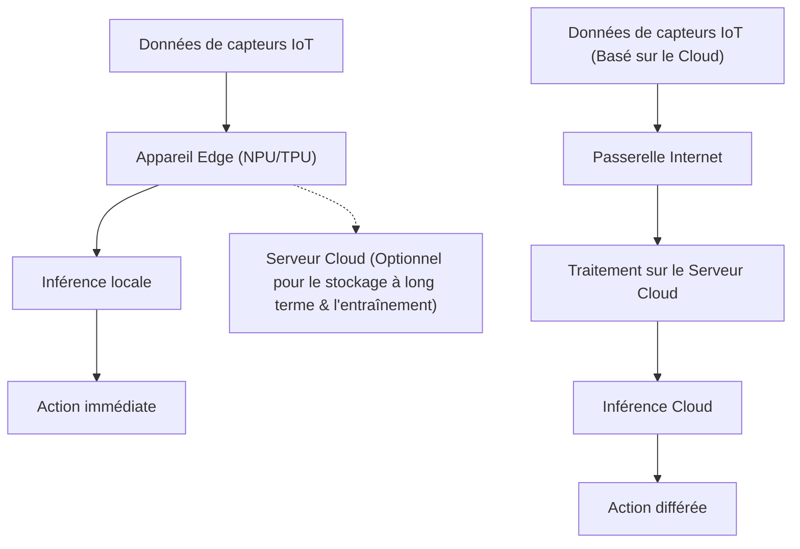
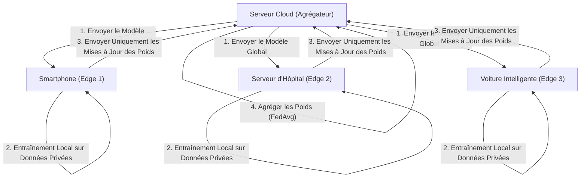

# L'avenir de l'Edge AI et les approches d'implémentation pour les appareils IoT

## 1. Introduction : Pourquoi l'Edge AI maintenant ?

Avec la démocratisation des appareils IoT (Internet of Things), nous sommes entrés dans une ère où tous les objets physiques du monde entier sont connectés à Internet. Parallèlement à l'évolution de la technologie des capteurs, la quantité de données générées par les appareils augmente de manière explosive. Traditionnellement, ces énormes quantités de données étaient envoyées vers le cloud, et les inférences par des modèles d'IA étaient réalisées à l'aide de puissantes ressources de calcul (comme de gigantesques clusters GPU) dans le cloud. C'est l'approche courante de l'"IA Cloud" (Cloud AI).

Cependant, l'architecture qui consiste à envoyer toutes les données vers le cloud, à les traiter dans le cloud, puis à renvoyer les résultats à l'appareil présente plusieurs limites majeures.
1. **Problème de latence (retard)** : Dans les systèmes nécessitant des décisions immédiates en millisecondes, comme les véhicules autonomes, les robots industriels ou les drones, les retards de communication réseau peuvent entraîner des accidents mortels.
2. **Confidentialité et sécurité** : Transmettre en permanence des données biométriques ou vidéo hautement confidentielles ou contenant des informations personnelles, comme les caméras de surveillance domestique connectées (smart home) ou les appareils médicaux portables, vers le cloud implique des risques de fuite d'informations et de violation de la vie privée.
3. **Bande passante réseau et coûts** : Si des millions de caméras IoT envoient constamment des flux vidéo 4K vers le cloud, la bande passante du réseau sera épuisée, et les coûts de transfert de données et de stockage dans le cloud deviendront énormes.
4. **Stabilité de la connexion (environnement hors ligne)** : Dans des environnements où la connexion Internet est instable ou inexistante, comme les installations souterraines, en mer, ou dans des fermes isolées, la dépendance au cloud signifie l'arrêt complet du fonctionnement de l'ensemble du système.

Pour résoudre ces problèmes, l'**"Edge AI" (IA à la périphérie)** a émergé. L'Edge AI est une technologie qui exécute les algorithmes d'IA directement sur les appareils IoT générant les données eux-mêmes (ou à l'extrémité du réseau extrêmement proche de l'appareil = l'edge). Ainsi, les données sont traitées et analysées instantanément à la source, ce qui permet de construire des systèmes intelligents rapides, sûrs, et à faible coût tout en minimisant la dépendance au cloud.

Dans cet article, nous explorerons très en profondeur, d'un point de vue technique, les bases de l'Edge AI, les dernières tendances matérielles (NPU/TPU, etc.), les techniques d'allègement (quantification, élagage) pour adapter les modèles aux environnements edge, les méthodes d'implémentation utilisant ONNX Runtime, et enfin le Federated Learning (apprentissage fédéré) qui assure la protection de la vie privée et l'apprentissage distribué.

---

## 2. Comparaison des architectures de l'IA Cloud et de l'Edge AI

Pour comprendre visuellement la différence entre l'IA Cloud et l'Edge AI, veuillez vous référer au diagramme d'architecture ci-dessous.



Comme on peut le voir sur ce diagramme, dans l'architecture de l'Edge AI, la boucle allant de la source des données à l'inférence, puis à l'action (contrôle), est complétée au sein de l'appareil edge. Le cloud joue uniquement un rôle auxiliaire non-temps réel, comme la distribution de modèles pré-entraînés, l'agrégation de données à long terme et l'analyse des tendances.

### Modèle mathématique de la latence d'inférence

Formulons la différence de latence entre l'edge et le cloud. Le temps total jusqu'à l'achèvement de l'inférence du système complet $T_{total}$ s'exprime comme suit :

**Dans le cas de l'IA Cloud :**
$$ T_{total} = T_{network\_up} + T_{cloud\_compute} + T_{network\_down} $$

Où le temps de téléchargement réseau $T_{network\_up}$ dépend de la formule suivante :
$$ T_{network\_up} = \frac{D}{B} + RTT $$
($D$ : taille des données transmises, $B$ : bande passante du réseau, $RTT$ : Round Trip Time ou temps d'aller-retour)

Lorsque la taille des données $D$ est grande (comme des images à haute résolution ou des données de vibration continues) ou que la bande passante $B$ est étroite, $T_{network\_up}$ augmente de manière drastique et devient un goulot d'étranglement, quelle que soit la vitesse de l'inférence de l'IA elle-même $T_{cloud\_compute}$.

**Dans le cas de l'Edge AI :**
$$ T_{total} \approx T_{edge\_compute} $$

Dans l'Edge AI, n'impliquant pas de transfert réseau, $T_{network\_up}$ et $T_{network\_down}$ sont presque nuls (uniquement le transfert du bus local). Étant donné que la capacité de calcul de l'appareil edge est inférieure à celle du cloud, il arrive souvent que $T_{edge\_compute} > T_{cloud\_compute}$, mais comme les retards du réseau et les incertitudes de communication peuvent être éliminés, le temps total global $T_{total}$ est maintenu de manière stable à un niveau bas.

---

## 3. Technologies matérielles soutenant l'Edge AI

Pour exécuter rapidement des modèles d'apprentissage profond sur des appareils edge, des accélérateurs matériels dédiés sont indispensables. Avec le traitement traditionnel par CPU, l'inférence d'IA en temps réel était difficile du point de vue de la consommation d'énergie et de la vitesse de traitement. Ici, nous présentons le matériel représentatif pour l'Edge AI.

### 3.1 NPU (Neural Processing Unit) et TPU (Tensor Processing Unit)
Le processus d'inférence du deep learning (en particulier l'inférence des CNN, etc.) est composé d'une quantité massive d'opérations de multiplication-accumulation (opérations MAC : Multiply-Accumulate). Les NPU et TPU sont des puces spécialisées (ASIC) conçues pour exécuter ces opérations MAC en parallèle et avec une très faible consommation d'énergie.

- **Google Coral Edge TPU** :
  Le Edge TPU fourni par Google est un coprocesseur extrêmement petit mais possédant une puissante capacité d'inférence. Avec seulement 2W de consommation d'énergie, il offre des performances de 4 TOPS (Tera Operations Per Second : 4 billions d'opérations par seconde). Cela permet d'exécuter en temps réel des modèles TensorFlow Lite optimisés pour le mobile en se connectant simplement via USB à un SBC (Single Board Computer) léger comme le Raspberry Pi.
- **Raspberry Pi AI Kit (équipé de Hailo-8L)** :
  Le Raspberry Pi AI Kit, sorti récemment, est équipé de l'accélérateur d'IA "Hailo-8L" de Hailo. L'architecture de Hailo élimine les goulots d'étranglement d'accès à la mémoire en mappant la structure du réseau neuronal sur la structure matérielle de la puce, offrant des performances d'inférence étonnantes allant jusqu'à 13 TOPS dans une limite d'énergie de quelques watts.
- **Série NVIDIA Jetson** :
  Les séries Jetson Nano, Xavier et Orin sont des SoC intégrant des processeurs ARM et de puissants cœurs de GPU NVIDIA. Comme l'écosystème CUDA peut être utilisé tel quel, il est très facile de déployer vers l'edge des modèles PyTorch ou TensorFlow entraînés dans le cloud via TensorRT.

### TOPS et efficacité énergétique (TOPS/W)
L'indicateur le plus important pour évaluer le matériel de l'Edge AI est "TOPS/W (TOPS par watt)". Les appareils IoT fonctionnant sous de strictes contraintes énergétiques, telles que l'alimentation par batterie ou le PoE (Power over Ethernet), la clé n'est pas seulement la puissance de calcul simple (TOPS), mais plutôt la capacité à effectuer l'inférence de l'IA avec le moins d'énergie possible.

---

## 4. Implémentation sur les appareils Edge : Théorie et pratique de l'allègement des modèles

Même avec l'évolution du matériel, il est impossible de charger d'énormes modèles d'apprentissage profond de plusieurs centaines de Mo à plusieurs Go (par exemple, GPT ou de grands réseaux ResNet) tels quels dans la RAM limitée (quelques Mo à quelques Go) des appareils edge. Par conséquent, la "compression de modèle" (Model Compression) est indispensable. Nous expliquerons en détail les techniques représentatives telles que la "Quantification" (Quantization) et "l'Élagage" (Pruning).

### 4.1 Quantification des modèles (Quantization)

En général, les poids et les fonctions d'activation des modèles d'apprentissage profond sont représentés en virgule flottante de 32 bits (FP32). La quantification est une technologie permettant de réduire leur précision à des entiers de 16 bits (FP16), de 8 bits (INT8) ou à un nombre de bits encore plus faible.

**Effet de réduction de la mémoire** :
Si le nombre de paramètres est $N$, la quantité de mémoire requise est calculée comme suit :
$$ M_{FP32} = N \times 4 \text{ (Octets)} $$
$$ M_{INT8} = N \times 1 \text{ (Octets)} $$
Avec la quantification INT8, la taille du modèle et l'utilisation de la mémoire peuvent théoriquement être réduite à $\frac{1}{4}$. De plus, le matériel (comme les NPU) peut exécuter des opérations MAC INT8 plusieurs fois, voire des dizaines de fois plus rapidement et avec moins d'énergie que les opérations FP32, ce qui entraîne une réduction significative de la latence d'inférence et de la consommation d'énergie.

**Modèle mathématique de la quantification** :
La formule de quantification affine de base pour mapper un nombre réel $r$ (FP32) vers un entier $q$ (INT8 : -128 à 127) est la suivante :

$$ r = S \times (q - Z) $$
$$ q = \text{round}\left( \frac{r}{S} + Z \right) $$

Ici, $S$ représente le facteur d'échelle (Scale) et $Z$ le point zéro (Zero-point : la valeur entière sur laquelle le 0 réel est mappé).

Pour la quantification, il y a la **Post-Training Quantization (PTQ)** qui convertit le modèle une fois l'entraînement terminé, et le **Quantization-Aware Training (QAT)** qui met à jour les poids tout en simulant l'erreur de quantification pendant le processus d'entraînement. Si vous souhaitez minimiser la perte de précision, le QAT est recommandé.

### 4.2 Élagage des modèles (Pruning)

Dans les réseaux de neurones, de nombreux poids n'ont presque aucun impact sur le résultat d'inférence final (importance faible). La technique consistant à mettre ces poids inutiles à zéro, ou à les supprimer carrément de la structure du réseau elle-même, est appelée élagage (Pruning).

**Définition de la parcimonie (Sparsity)** :
$$ \text{Sparsity} (S) = \frac{N_{zero}}{N_{total}} \times 100 \text{ (\%)} $$
Ici, $N_{zero}$ est le nombre de poids mis à zéro et $N_{total}$ est le nombre total de poids de l'ensemble du modèle.

- **Élagage non structuré (Unstructured Pruning)** : Une méthode qui met à zéro les poids individuels de manière indépendante. La Sparsity est élevée, mais comme la matrice des poids devient simplement une matrice creuse (Sparse Matrix), les CPU/GPU généraux peuvent avoir des schémas d'accès mémoire irréguliers, ce qui peut ne pas donner l'accélération attendue.
- **Élagage structuré (Structured Pruning / Channel Pruning)** : Une méthode qui supprime des filtres ou des canaux entiers d'une couche convolutive. Puisque la dimension du réseau elle-même est réduite, on obtient une amélioration évidente de la vitesse d'inférence (Speedup) et un effet de réduction de mémoire sur n'importe quel matériel.

Le taux d'amélioration de la vitesse d'inférence $S_{speedup}$ est à peu près proportionnel au taux de réduction des canaux $c$ ($0 < c < 1$) selon la formule suivante (basée sur la diminution du nombre d'opérations MAC).
$$ S_{speedup} \propto \frac{1}{(1 - c)^2} $$
(※La complexité de l'opération de convolution étant proportionnelle au produit du nombre de canaux d'entrée et du nombre de canaux de sortie)

---

## 5. Déploiement et moteur d'inférence : Utilisation de ONNX Runtime

Pour exécuter concrètement un modèle allégé sur un appareil edge, un moteur d'inférence léger et multiplateforme est nécessaire. Actuellement, **ONNX (Open Neural Network Exchange)** et **ONNX Runtime** sont largement utilisés comme standards de l'industrie.

ONNX est une norme permettant de traiter des modèles dans un format commun entre différents frameworks comme PyTorch et TensorFlow. ONNX Runtime est le moteur qui permet d'exécuter ces modèles ONNX de manière optimale sur divers matériels.

Le mécanisme des **Execution Providers (EP)** est le point fort d'ONNX Runtime. Sans avoir à réécrire le code, vous pouvez basculer l'environnement d'exécution backend vers le CPU, CUDA (GPU), TensorRT, OpenVINO, CoreML, XNNPACK, etc.

Voici un exemple de code de base d'inférence avec ONNX Runtime sur un appareil edge en utilisant Python.

```python
import onnxruntime as ort
import numpy as np
import time

def run_edge_inference(model_path, input_data):
    # Spécification de l'Execution Provider adapté à l'appareil edge
    # Exemple : pour le CPU, utiliser 'CPUExecutionProvider'
    # Si le Coral Edge TPU ou un NPU spécifique est pris en charge, spécifier l'EP personnalisé
    providers = ['CPUExecutionProvider']
    
    # Initialisation de la session (chargement du modèle et optimisation du graphe)
    session = ort.InferenceSession(model_path, providers=providers)
    
    # Obtention du nom et de la forme (shape) d'entrée du modèle
    input_name = session.get_inputs()[0].name
    expected_shape = session.get_inputs()[0].shape
    print(f"Forme d'entrée attendue : {expected_shape}")
    
    # Mesure du temps d'inférence
    start_time = time.time()
    
    # Exécution de l'inférence
    # Les données d'entrée sont passées sous forme de tableau Numpy approprié (par exemple : np.float32 ou np.int8)
    outputs = session.run(None, {input_name: input_data})
    
    latency = (time.time() - start_time) * 1000.0 # Conversion en millisecondes
    print(f"Latence d'inférence : {latency:.2f} ms")
    
    return outputs[0]

# Données d'entrée fictives (Exemple : image RGB 224x224, taille de lot de 1)
dummy_input = np.random.randn(1, 3, 224, 224).astype(np.float32)
# run_edge_inference("lightweight_model.onnx", dummy_input)
```

En utilisant ce code comme base et en le portant dans un langage à plus faible latence tel que C++, il est possible d'exploiter à l'extrême les performances matérielles de l'appareil edge.

---

## 6. Protection de la vie privée et apprentissage distribué : Apprentissage Fédéré (Federated Learning)

L'une des évolutions ultimes de l'Edge AI est le **Federated Learning (Apprentissage fédéré)**, où non seulement l'"inférence" mais aussi l'"apprentissage" des modèles sont distribués à l'edge.

Dans l'apprentissage automatique traditionnel, les données brutes (vidéo, audio, logs, etc.) de tous les appareils IoT étaient rassemblées dans le cloud pour y entraîner le modèle en bloc. Cependant, la centralisation des données issues de smartphones personnels ou d'appareils médicaux dans le cloud pose de sérieux risques pour la vie privée.

Le Federated Learning résout élégamment ce problème.



**Le processus du Federated Learning** :
1. Le serveur cloud (agrégateur) distribue le "modèle global" initialisé à chaque appareil edge.
2. Chaque appareil edge entraîne (fine-tuning) localement le modèle global en utilisant ses données, **sans jamais envoyer ses données confidentielles à l'extérieur**.
3. Les appareils edge envoient au cloud uniquement la "quantité de mise à jour des poids du modèle (gradients)" obtenue par l'apprentissage. Les données brutes ne quittent jamais l'appareil.
4. Le cloud calcule la moyenne des mises à jour des poids reçues des nombreux appareils et génère un nouveau modèle global.

**Modèle mathématique du Federated Averaging (FedAvg)** :
La formule de mise à jour de FedAvg, l'algorithme d'agrégation le plus représentatif, est la suivante.
Supposons qu'il y ait au total $K$ clients, et que chaque client $k$ possède $n_k$ échantillons de données. Soit le nombre total de données $N = \sum_{k=1}^{K} n_k$. Le poids du modèle global du round suivant $w_{t+1}$ est calculé comme suit :

$$ w_{t+1} = \sum_{k=1}^{K} \frac{n_k}{N} w_{t+1}^k $$

Ici, $w_{t+1}^k$ est le poids mis à jour par le client $k$ après l'apprentissage sur ses propres données locales. En prenant ainsi une moyenne pondérée en fonction de la quantité de données, on peut construire un modèle hautement performant, comme s'il avait été entraîné en regroupant les données de tous les appareils, tout en protégeant complètement la vie privée.

---

## 7. Cas d'usage d'implémentation sur les appareils IoT

L'Edge AI est déjà appliquée de manière pratique dans de nombreuses industries, provoquant des changements de paradigme spectaculaires.

### 7.1 Fabrication intelligente et maintenance prédictive (Predictive Maintenance)
Les données de vibration et acoustiques des moteurs et des turbines sur les lignes de production des usines sont constamment surveillées par des appareils edge (automates programmables ou serveurs edge). Il est impossible de continuer à envoyer vers le cloud des données de vibration échantillonnées à des intervalles de quelques millisecondes. Toutefois, grâce à l'Edge AI, on peut détecter en temps réel les signes d'anomalies (détection d'anomalies par un modèle de détection d'anomalies) et arrêter d'urgence la ligne de production juste avant que la machine ne subisse une panne fatale.

### 7.2 Agriculture intelligente (Smart Agriculture)
Dans les vastes terres agricoles, les infrastructures de communication sont souvent fragiles, ce qui rend l'Edge AI indispensable. Un modèle léger de détection d'objets (comme YOLOv8 nano) embarqué sur un drone identifie en temps réel les parasites ou les feuilles malades à partir de vidéos aériennes. En ne transmettant que les données de coordonnées identifiées, ou en s'associant à un drone pulvérisateur qui diffuse des pesticides avec précision sur les zones concernées, l'utilisation de produits phytosanitaires est drastiquement réduite.

### 7.3 Appareils portables médicaux
Sur les montres intelligentes ou les électrocardiogrammes (ECG) portables, l'appareil edge lui-même détecte de manière autonome les signes d'arythmie (comme la fibrillation auriculaire) à partir des données de fréquence cardiaque du porteur. Comme les données médicales sont extrêmement sensibles, l'Edge AI, qui réalise l'inférence au sein de l'appareil sans téléchargement dans le cloud, est la clé pour respecter les réglementations strictes en matière de confidentialité médicale telles que la HIPAA.

---

## 8. Défis de l'Edge AI et perspectives d'avenir

Bien que la technologie Edge AI se développe rapidement, de nombreux défis et des perspectives d'avenir fascinantes demeurent.

**1. Fonctionnement des LLM (Large Language Models) à l'edge** :
Le plus grand sujet de ces dernières années est la tentative de faire fonctionner l'IA générative ou les LLM sur l'edge, c'est-à-dire le "Edge LLM". Il est impossible de placer un modèle de plusieurs dizaines de milliards de paramètres tel quel sur un edge, mais avec des frameworks d'optimisation comme llama.cpp, une quantification extrême en 4 bits/2 bits (AWQ, GPTQ, etc.), ainsi que l'émergence de SLM (Small Language Models) compacts et performants comme Phi-3 de Microsoft, nous entrons dans une ère où le traitement du langage naturel peut être réalisé hors ligne, même sur un smartphone ou un Raspberry Pi.

**2. Informatique neuromorphique et SNN** :
Ce qui est attendu comme l'Edge AI à ultra-faible consommation ultime, ce sont les "puces neuromorphiques (ex : Intel Loihi)" et les "Spiking Neural Networks (SNN)", qui imitent physiquement le fonctionnement des circuits neuronaux du cerveau humain. Les SNN étant guidés par des événements où le calcul n'est effectué qu'au moment où les données changent (spikes), il est théoriquement possible de réduire la consommation d'énergie de plusieurs ordres de grandeur (d'un dixième à un centième) par rapport aux modèles de deep learning traditionnels.

**3. Établissement de l'EdgeOps plutôt que du MLOps** :
Le défi opérationnel est de savoir comment distribuer des mises à jour de modèles (OTA : Over-The-Air) en toute sécurité à des milliers, voire des dizaines de milliers d'appareils edge dispersés dans le monde entier, et de surveiller la dégradation de la précision (dérive des données) des modèles en cours d'exécution. L'automatisation du déploiement dans des environnements hétérogènes où l'architecture matérielle diffère d'un appareil à l'autre est le domaine de l'ingénierie qui sera le plus en demande à l'avenir.

---

## 9. Conclusion

L'Edge AI est passée du statut de simple "technologie complémentaire au cloud" à celui de technologie centrale qui détermine l'architecture de l'ensemble des systèmes IoT. Les avantages qu'apporte l'Edge AI sont inestimables, tels que la minimisation de la latence d'inférence, une protection rigoureuse de la vie privée, ainsi qu'une réduction drastique de la bande passante de communication et des coûts du cloud.

Les techniques d'allègement côté logiciel, telles que la quantification et l'élagage des modèles, couplées aux avancées extraordinaires du matériel telles que les NPU, les TPU et Hailo, agissent de concert. Les modèles de deep learning qui nécessitaient autrefois des supercalculateurs peuvent désormais fonctionner sur les appareils dans le creux de notre main, en ne consommant que quelques milliwatts.

De plus, grâce à des approches d'apprentissage distribué comme le Federated Learning et à l'exécution d'IA générative (SLM) à l'edge, la frontière technologique s'élargit rapidement. Pour les ingénieurs et les architectes, la recherche de "comment déployer un maximum d'intelligence à l'edge avec des ressources limitées", sans se reposer uniquement sur les énormes ressources du cloud, constituera le défi le plus exigeant et le plus passionnant de l'avenir.

À la frontière de l'IoT, où fusionnent le monde physique et le monde numérique, l'Edge AI deviendra sans aucun doute le système nerveux central qui pilotera l'avenir.

---
*Cet article a été rédigé à l'intention des ingénieurs et des architectes de systèmes intéressés par l'implémentation de l'IA sur les appareils IoT.*

