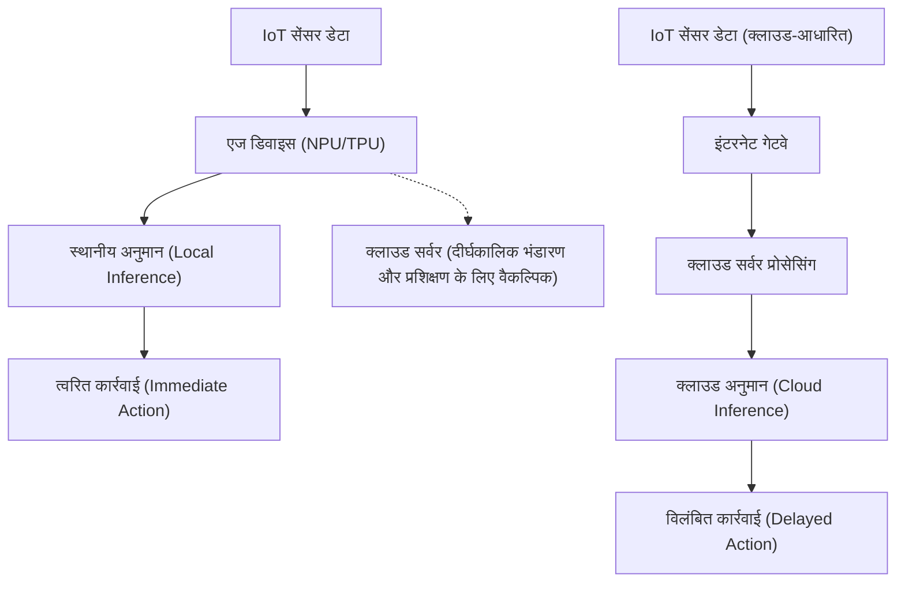
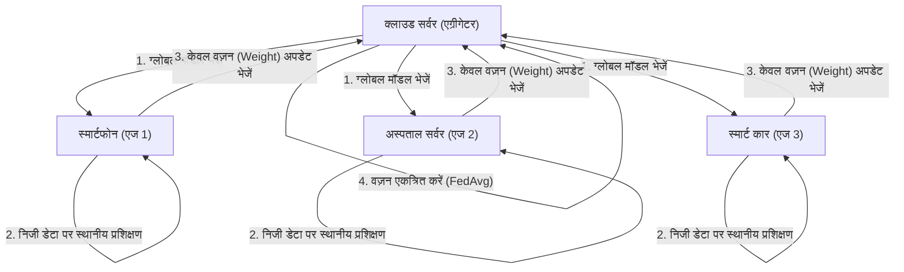

# एज AI का भविष्य और IoT उपकरणों पर कार्यान्वयन दृष्टिकोण

## 1. प्रस्तावना: अभी एज AI (Edge AI) ही क्यों?

IoT (Internet of Things) उपकरणों के प्रसार के साथ, हम एक ऐसे युग में प्रवेश कर चुके हैं जहां दुनिया की हर भौतिक वस्तु इंटरनेट से जुड़ी है। सेंसर तकनीक के विकास के साथ, उपकरणों द्वारा उत्पन्न डेटा की मात्रा में भारी वृद्धि हुई है। पारंपरिक रूप से, इस विशाल डेटा को क्लाउड पर भेजा जाता था, और शक्तिशाली क्लाउड कंप्यूटिंग संसाधनों (जैसे विशाल GPU क्लस्टर) का उपयोग करके AI मॉडल द्वारा अनुमान (inference) लगाया जाता था। यह "क्लाउड AI" का सामान्य दृष्टिकोण है।

हालाँकि, हर डेटा को क्लाउड पर भेजने, वहाँ प्रोसेस करने और फिर परिणाम को वापस डिवाइस पर भेजने के इस आर्किटेक्चर में कुछ गंभीर सीमाएँ हैं।
1. **लेटेंसी (विलंबता) की समस्या**: स्वचालित ड्राइविंग कारों, औद्योगिक रोबोटों और ड्रोन जैसे प्रणालियों में, जहाँ मिलीसेकंड स्तर के त्वरित निर्णय की आवश्यकता होती है, नेटवर्क संचार में देरी घातक दुर्घटनाओं का कारण बन सकती है।
2. **गोपनीयता और सुरक्षा**: स्मार्ट होम के निगरानी कैमरे और चिकित्सा पहनने योग्य उपकरण (wearables) जैसी व्यक्तिगत या अत्यधिक गोपनीय वीडियो और बायोमेट्रिक डेटा को लगातार क्लाउड पर भेजने से सूचना लीक होने और गोपनीयता के उल्लंघन का जोखिम रहता है।
3. **नेटवर्क बैंडविड्थ और लागत**: यदि लाखों IoT कैमरों से लगातार 4K वीडियो स्ट्रीम को क्लाउड पर भेजा जाए, तो नेटवर्क बैंडविड्थ खत्म हो जाएगी, और डेटा ट्रांसफर व क्लाउड स्टोरेज की लागत बहुत अधिक हो जाएगी।
4. **कनेक्शन की स्थिरता (ऑफ़लाइन वातावरण)**: भूमिगत सुविधाओं, समुद्र, दूरदराज के खेतों आदि जैसे वातावरण में, जहां इंटरनेट कनेक्शन अस्थिर या अनुपलब्ध है, क्लाउड पर निर्भरता का मतलब पूरी प्रणाली का ठप हो जाना है।

इन चुनौतियों का समाधान करने के लिए **"एज AI (Edge AI)"** उभरा है। एज AI एक ऐसी तकनीक है जिसमें AI एल्गोरिदम सीधे डेटा उत्पन्न करने वाले IoT डिवाइस (या डिवाइस के बहुत करीब स्थित नेटवर्क के छोर = एज) पर निष्पादित किया जाता है। इसके माध्यम से, डेटा को उसके स्रोत पर ही तुरंत संसाधित और विश्लेषित किया जाता है, जिससे क्लाउड पर निर्भरता कम से कम हो जाती है, और एक तेज़, सुरक्षित व कम लागत वाली बुद्धिमान प्रणाली (intelligent system) का निर्माण संभव हो पाता है।

इस लेख में, हम एज AI के बुनियादी सिद्धांतों से लेकर हार्डवेयर (NPU/TPU आदि) के नवीनतम रुझानों, मॉडल को एज वातावरण के अनुकूल बनाने के लिए लाइटवेटिंग (lightweighting) तकनीकों (क्वांटिज़ेशन और प्रूनिंग), ONNX रनटाइम का उपयोग करके कार्यान्वयन विधियों, और गोपनीयता की रक्षा व वितरित शिक्षा (distributed learning) को संभव बनाने वाले फेडेरेटेड लर्निंग (Federated Learning) तक तकनीकी दृष्टिकोण से बहुत गहराई तक चर्चा करेंगे।

---

## 2. क्लाउड AI और एज AI आर्किटेक्चर की तुलना

क्लाउड AI और एज AI के बीच के अंतर को दृष्टिगत रूप से समझने के लिए, कृपया निम्नलिखित आर्किटेक्चर आरेख (diagram) देखें।



इस आरेख से देखा जा सकता है कि एज AI आर्किटेक्चर में डेटा की उत्पत्ति से लेकर अनुमान लगाने और कार्रवाई (नियंत्रण) तक का लूप एज डिवाइस के भीतर ही पूरा हो जाता है। क्लाउड केवल प्रशिक्षित मॉडल (trained model) के वितरण, और दीर्घकालिक डेटा एकत्रीकरण और प्रवृत्ति विश्लेषण जैसी गैर-रीयल-टाइम सहायक भूमिकाओं तक सीमित रहता है।

### अनुमान लेटेंसी का गणितीय मॉडल

आइए एज और क्लाउड में लेटेंसी के अंतर को सूत्रबद्ध (formulate) करें। संपूर्ण प्रणाली के अनुमान (inference) के पूरा होने का समय $T_{total}$, इस प्रकार व्यक्त किया जाता है:

**क्लाउड AI के मामले में:**
$$ T_{total} = T_{network\_up} + T_{cloud\_compute} + T_{network\_down} $$

यहाँ, नेटवर्क अपलोड समय $T_{network\_up}$ निम्नलिखित समीकरण पर निर्भर करता है:
$$ T_{network\_up} = \frac{D}{B} + RTT $$
($D$: भेजा जाने वाला डेटा आकार, $B$: नेटवर्क बैंडविड्थ, $RTT$: राउंड ट्रिप टाइम)

जब डेटा आकार $D$ बड़ा हो (जैसे हाई-रिज़ॉल्यूशन छवियां या निरंतर कंपन डेटा) या बैंडविड्थ $B$ संकीर्ण हो, तो $T_{network\_up}$ नाटकीय रूप से बढ़ जाता है, और AI की अपनी अनुमान गति $T_{cloud\_compute}$ चाहे कितनी भी तेज क्यों न हो, यह एक अड़चन (bottleneck) बन जाता है।

**एज AI के मामले में:**
$$ T_{total} \approx T_{edge\_compute} $$

चूंकि एज AI में नेटवर्क ट्रांसफर शामिल नहीं होता है, इसलिए $T_{network\_up}$ और $T_{network\_down}$ लगभग शून्य (केवल लोकल बस ट्रांसफर) हो जाते हैं। यद्यपि एज उपकरणों की गणना क्षमता क्लाउड से कम होती है और अक्सर $T_{edge\_compute} > T_{cloud\_compute}$ होता है, नेटवर्क लेटेंसी और संचार अनिश्चितताओं के खत्म होने के कारण समग्र $T_{total}$ स्थिर और कम बना रहता है।

---

## 3. एज AI का समर्थन करने वाली हार्डवेयर तकनीकें

एज डिवाइस पर डीप लर्निंग मॉडल को उच्च गति से चलाने के लिए, एक समर्पित हार्डवेयर एक्सेलेरेटर (hardware accelerator) आवश्यक है। पारंपरिक CPU द्वारा की जाने वाली प्रोसेसिंग में बिजली की खपत और प्रोसेसिंग गति के दृष्टिकोण से रीयल-टाइम AI अनुमान लगाना मुश्किल था। यहाँ, हम प्रमुख एज AI हार्डवेयर का परिचय देंगे।

### 3.1 NPU (Neural Processing Unit) और TPU (Tensor Processing Unit)
डीप लर्निंग अनुमान प्रक्रिया (विशेषकर CNN आदि का अनुमान) बड़े पैमाने पर मैट्रिक्स गुणा-संचय संचालन (MAC संचालन: Multiply-Accumulate) से बनी होती है। NPU और TPU ऐसे समर्पित चिप्स (ASIC) हैं जो इन MAC संचालनों को समानांतर (parallel) रूप में और अत्यधिक कम बिजली खपत पर करने के लिए विशेषीकृत हैं।

- **Google Coral Edge TPU**:
  Google द्वारा पेश किया गया Edge TPU एक कोप्रोसेसर (coprocessor) है जो बहुत छोटा होते हुए भी शक्तिशाली अनुमान क्षमता रखता है। केवल 2W की बिजली खपत के साथ, यह 4 TOPS (Tera Operations Per Second: 1 सेकंड में 4 ट्रिलियन संचालन) का प्रदर्शन प्रदान करता है। इससे Raspberry Pi जैसे लाइटवेट SBC (सिंगल-बोर्ड कंप्यूटर) में केवल USB के माध्यम से कनेक्ट करके मोबाइल के लिए अनुकूलित TensorFlow Lite मॉडल को रीयल-टाइम में चलाना संभव हो जाता है।
- **Raspberry Pi AI Kit (Hailo-8L से लैस)**:
  हाल ही में जारी Raspberry Pi AI Kit में Hailo कंपनी का AI एक्सेलेरेटर "Hailo-8L" शामिल है। Hailo का आर्किटेक्चर न्यूरल नेटवर्क की संरचना को सीधे चिप की हार्डवेयर संरचना में मैप (map) करता है, जिससे मेमोरी एक्सेस के बॉटलनेक खत्म हो जाते हैं, और कुछ ही वॉट की बिजली सीमा के भीतर अधिकतम 13 TOPS का आश्चर्यजनक अनुमान प्रदर्शन प्राप्त होता है।
- **NVIDIA Jetson सीरीज़**:
  Jetson Nano, Xavier, और Orin सीरीज़ SoC हैं जो ARM CPU और NVIDIA के शक्तिशाली GPU कोर को एकीकृत करते हैं। चूंकि CUDA इकोसिस्टम का सीधा उपयोग किया जा सकता है, इसलिए क्लाउड में प्रशिक्षित PyTorch या TensorFlow मॉडल को TensorRT के माध्यम से एज पर तैनात (deploy) करना बेहद आसान है।

### TOPS और शक्ति दक्षता (TOPS/W)
एज AI हार्डवेयर का मूल्यांकन करने के लिए सबसे महत्वपूर्ण मीट्रिक "TOPS/W (प्रति वाट TOPS)" है। चूंकि IoT डिवाइस बैटरी पावर या PoE (Power over Ethernet) जैसी सख्त बिजली सीमाओं के तहत काम करते हैं, इसलिए केवल साधारण गणना प्रदर्शन (TOPS) ही नहीं, बल्कि यह भी महत्वपूर्ण है कि AI अनुमान कितनी कम शक्ति के साथ किया जा सकता है।

---

## 4. एज डिवाइस पर कार्यान्वयन: मॉडल लाइटवेटिंग का सिद्धांत और अभ्यास

भले ही हार्डवेयर उन्नत हो जाए, सैकड़ों MB से लेकर कई GB तक के विशाल डीप लर्निंग मॉडल (जैसे GPT या बड़े ResNet) को सीधे एज डिवाइस की सीमित RAM (कुछ MB से कुछ GB) में लोड करना असंभव है। इसलिए, "मॉडल लाइटवेटिंग (Model Compression)" अनिवार्य हो जाता है। "क्वांटिज़ेशन (Quantization)" और "प्रूनिंग (Pruning)" को मुख्य तकनीकों के रूप में विस्तार से समझाया गया है।

### 4.1 मॉडल का क्वांटिज़ेशन (Quantization)

आमतौर पर, डीप लर्निंग मॉडल के वज़न (weights) और सक्रियण कार्यों (activation functions) को 32-बिट फ्लोटिंग पॉइंट (FP32) के रूप में दर्शाया जाता है। क्वांटिज़ेशन वह तकनीक है जो इनकी सटीकता को 16-बिट (FP16), 8-बिट पूर्णांक (INT8), या उससे भी कम बिट्स तक कम कर देती है।

**मेमोरी में कमी का प्रभाव**:
मान लीजिए कि मापदंडों (parameters) की संख्या $N$ है, तो आवश्यक मेमोरी की गणना इस प्रकार की जाती है:
$$ M_{FP32} = N \times 4 \text{ (Bytes)} $$
$$ M_{INT8} = N \times 1 \text{ (Bytes)} $$
INT8 क्वांटिज़ेशन के माध्यम से, मॉडल का आकार और मेमोरी का उपयोग सैद्धांतिक रूप से $\frac{1}{4}$ तक कम किया जा सकता है। इसके अलावा, हार्डवेयर (NPU आदि) INT8 के MAC संचालन को FP32 की तुलना में कई गुना से लेकर दर्जनों गुना तेज और कम शक्ति के साथ निष्पादित कर सकते हैं, जिससे अनुमान लेटेंसी और बिजली की खपत में काफी कमी आती है।

**क्वांटिज़ेशन का गणितीय मॉडल**:
वास्तविक संख्या $r$ (FP32) को पूर्णांक $q$ (INT8: -128 से 127) में मैप करने का मूल एफ़िन क्वांटिज़ेशन (Affine Quantization) सूत्र इस प्रकार है:

$$ r = S \times (q - Z) $$
$$ q = \text{round}\left( \frac{r}{S} + Z \right) $$

यहाँ, $S$ स्केल फैक्टर (Scale) को दर्शाता है, और $Z$ ज़ीरो-पॉइंट (Zero-point: वास्तविक संख्या 0 को पूर्णांक प्रकार के किस मान पर मैप किया जाना चाहिए) को दर्शाता है।

क्वांटिज़ेशन दो प्रकार के होते हैं: **Post-Training Quantization (PTQ)**, जो प्रशिक्षण पूरा होने के बाद मॉडल को परिवर्तित करता है, और **Quantization-Aware Training (QAT)**, जो प्रशिक्षण प्रक्रिया के दौरान क्वांटिज़ेशन त्रुटियों का अनुकरण (simulate) करते हुए वज़न (weights) को अपडेट करता है। यदि सटीकता में गिरावट को कम से कम रखना हो, तो QAT की सिफारिश की जाती है।

### 4.2 मॉडल की प्रूनिंग (Pruning)

न्यूरल नेटवर्क में कई ऐसे वज़न (weights) होते हैं जो अंतिम अनुमान परिणाम पर बहुत कम या कोई प्रभाव नहीं डालते (कम महत्वपूर्ण होते हैं)। प्रूनिंग वह तकनीक है जिसमें इन अनावश्यक वज़न को शून्य कर दिया जाता है, या नेटवर्क की संरचना से ही हटा दिया जाता है।

**स्पार्सिटी (Sparsity / विरलता) की परिभाषा**:
$$ \text{Sparsity} (S) = \frac{N_{zero}}{N_{total}} \times 100 \text{ (\%)} $$
यहाँ $N_{zero}$ उन वज़न की संख्या है जिन्हें शून्य किया गया है, और $N_{total}$ पूरे मॉडल के वज़न की कुल संख्या है।

- **गैर-संरचित प्रूनिंग (Unstructured Pruning)**: व्यक्तिगत वज़न को स्वतंत्र रूप से शून्य करने की विधि। इसमें स्पार्सिटी अधिक होती है, लेकिन वज़न मैट्रिक्स (weight matrix) केवल एक स्पार्स मैट्रिक्स (Sparse Matrix) बन जाता है, और सामान्य CPU/GPU पर मेमोरी एक्सेस पैटर्न अनियमित हो जाता है, इसलिए अनुमानित गति में वृद्धि नहीं भी मिल सकती है।
- **संरचित प्रूनिंग (Structured Pruning / Channel Pruning)**: कन्वोल्यूशनल (convolutional) परत के फिल्टर या चैनलों को पूरी तरह से हटाने की विधि। चूंकि नेटवर्क के आयाम (dimensions) ही सिकुड़ जाते हैं, इसलिए किसी भी हार्डवेयर पर स्पष्ट रूप से अनुमान गति में वृद्धि (Speedup) और मेमोरी में कमी का प्रभाव देखा जा सकता है।

अनुमान गति वृद्धि दर $S_{speedup}$, चैनल में कमी दर $c$ ($0 < c < 1$) के मोटे तौर पर इस प्रकार आनुपातिक होती है (MAC संचालन की संख्या में कमी के आधार पर)।
$$ S_{speedup} \propto \frac{1}{(1 - c)^2} $$
(※ क्योंकि कन्वोल्यूशन संचालन की कम्प्यूटेशनल जटिलता इनपुट चैनलों की संख्या और आउटपुट चैनलों की संख्या के गुणनफल के आनुपातिक होती है)

---

## 5. परिनियोजन (Deployment) और अनुमान इंजन: ONNX Runtime का उपयोग

लाइटवेट (हलके) किए गए मॉडल को वास्तविक एज डिवाइस पर चलाने के लिए, एक हलके और मल्टी-प्लेटफ़ॉर्म समर्थित अनुमान इंजन (inference engine) की आवश्यकता होती है। वर्तमान में, **ONNX (Open Neural Network Exchange)** और **ONNX Runtime** उद्योग मानक (industry standard) के रूप में व्यापक रूप से उपयोग किए जा रहे हैं।

ONNX एक मानक है जो विभिन्न फ्रेमवर्क (जैसे PyTorch और TensorFlow) के बीच मॉडल को एक सामान्य प्रारूप में संभालने की अनुमति देता है। ONNX Runtime एक इंजन है जो इस ONNX मॉडल को विभिन्न हार्डवेयर पर अनुकूलित तरीके से निष्पादित करता है।

**Execution Providers (EP)** का तंत्र ONNX Runtime का सबसे शक्तिशाली पहलू है। कोड को फिर से लिखे बिना, बैकएंड के निष्पादन वातावरण (execution environment) को CPU, CUDA (GPU), TensorRT, OpenVINO, CoreML, XNNPACK आदि में बदला जा सकता है।

नीचे Python का उपयोग करके एज डिवाइस पर ONNX Runtime द्वारा अनुमान लगाने के लिए एक मूल कोड का उदाहरण दिया गया है:

```python
import onnxruntime as ort
import numpy as np
import time

def run_edge_inference(model_path, input_data):
    # एज डिवाइस के अनुरूप Execution Provider निर्दिष्ट करना
    # उदाहरण: CPU के लिए 'CPUExecutionProvider'
    # यदि Coral Edge TPU या कोई विशिष्ट NPU समर्थित है, तो कस्टम EP निर्दिष्ट करें
    providers = ['CPUExecutionProvider']
    
    # सत्र का आरंभीकरण (मॉडल लोड करना और ग्राफ अनुकूलन)
    session = ort.InferenceSession(model_path, providers=providers)
    
    # मॉडल का इनपुट नाम और इनपुट शेप प्राप्त करना
    input_name = session.get_inputs()[0].name
    expected_shape = session.get_inputs()[0].shape
    print(f"Expected input shape: {expected_shape}")
    
    # अनुमान समय (inference time) का मापन
    start_time = time.time()
    
    # अनुमान निष्पादित करना
    # इनपुट डेटा को उपयुक्त Numpy ऐरे (जैसे: np.float32 या np.int8) के रूप में पास करें
    outputs = session.run(None, {input_name: input_data})
    
    latency = (time.time() - start_time) * 1000.0 # मिलीसेकंड में परिवर्तित
    print(f"Inference Latency: {latency:.2f} ms")
    
    return outputs[0]

# डमी इनपुट डेटा (उदाहरण: 224x224 RGB छवि बैच साइज 1)
dummy_input = np.random.randn(1, 3, 224, 224).astype(np.float32)
# run_edge_inference("lightweight_model.onnx", dummy_input)
```

इस कोड को आधार बनाकर, इसे C++ जैसी अधिक लो-लेटेंसी वाली भाषा में पोर्ट करके एज डिवाइस के हार्डवेयर के प्रदर्शन को अधिकतम स्तर तक लाया जा सकता है।

---

## 6. गोपनीयता सुरक्षा और वितरित शिक्षा: फेडेरेटेड लर्निंग (Federated Learning)

Edge AI के अंतिम विकास रूपों में से एक **फेडेरेटेड लर्निंग (Federated Learning / संघीय शिक्षा)** है, जहाँ न केवल "अनुमान (inference)" बल्कि "प्रशिक्षण (training)" को भी एज पर वितरित किया जाता है।

पारंपरिक मशीन लर्निंग में, सभी IoT उपकरणों से कच्चा डेटा (वीडियो, ऑडियो, लॉग आदि) क्लाउड में एकत्र किया जाता है, और एक साथ मॉडल को प्रशिक्षित किया जाता है। हालाँकि, व्यक्तिगत स्मार्टफोन या चिकित्सा उपकरणों के डेटा को क्लाउड में इकट्ठा करने से गोपनीयता के गंभीर जोखिम होते हैं।

Federated Learning इस समस्या को बहुत ही शानदार तरीके से हल करता है।



**Federated Learning की प्रक्रिया**:
1. क्लाउड सर्वर (एग्रीगेटर) प्रत्येक एज डिवाइस को एक आरंभिक "ग्लोबल मॉडल" भेजता है।
2. प्रत्येक एज डिवाइस **बिना किसी संवेदनशील डेटा को बाहर भेजे**, अपने भीतर संग्रहीत डेटा का उपयोग करके वैश्विक मॉडल को स्थानीय रूप से प्रशिक्षित (फाइन-ट्यून) करता है।
3. एज डिवाइस केवल प्रशिक्षण द्वारा प्राप्त "मॉडल के वज़न में अद्यतन मात्रा (ग्रेडिएंट)" क्लाउड पर भेजता है। कच्चा डेटा कभी भी डिवाइस से बाहर नहीं जाता है।
4. क्लाउड कई उपकरणों से एकत्र किए गए वज़न के अपडेट का औसत निकालता है और एक नया ग्लोबल मॉडल तैयार करता है।

**Federated Averaging (FedAvg) का गणितीय मॉडल**:
सबसे आम एग्रीगेशन (एकत्रीकरण) एल्गोरिदम, FedAvg का अद्यतन समीकरण (update equation) इस प्रकार है:
मान लें कि कुल $K$ क्लाइंट हैं, और प्रत्येक क्लाइंट $k$ के पास $n_k$ डेटा नमूने (samples) हैं। यदि कुल डेटा संख्या $N = \sum_{k=1}^{K} n_k$ है, तो अगले दौर (round) के ग्लोबल मॉडल का वज़न $w_{t+1}$ इस प्रकार गिना जाता है:

$$ w_{t+1} = \sum_{k=1}^{K} \frac{n_k}{N} w_{t+1}^k $$

यहाँ $w_{t+1}^k$ वह अद्यतन वज़न है जिसे क्लाइंट $k$ ने अपने स्थानीय डेटा का उपयोग करके प्रशिक्षित किया है। इस तरह, डेटा की मात्रा के अनुसार भारित औसत (weighted average) लेने से, हम एक ऐसा उच्च प्रदर्शन वाला मॉडल बना सकते हैं जैसे कि हमने गोपनीयता की पूरी तरह से रक्षा करते हुए सभी उपकरणों के डेटा को एक साथ मिलाकर प्रशिक्षित किया हो।

---

## 7. IoT उपकरणों के लिए कार्यान्वयन के उपयोग के मामले (Use Cases)

Edge AI को पहले से ही विभिन्न उद्योगों में व्यावसायीकृत किया जा चुका है और यह बड़े पैमाने पर बदलाव (paradigm shift) ला रहा है।

### 7.1 स्मार्ट विनिर्माण और भविष्यसूचक रखरखाव (Predictive Maintenance)
कारखानों की उत्पादन लाइनों में, मोटर और टरबाइन के कंपन और ध्वनिक (acoustic) डेटा की लगातार एज डिवाइस (PLC या एज सर्वर) द्वारा निगरानी की जाती है। कुछ मिलीसेकंड के अंतराल पर नमूने (sampled) लिए गए कंपन डेटा को लगातार क्लाउड पर भेजना असंभव है, लेकिन एज AI का उपयोग करके, विसंगति (anomaly) के संकेतों (विसंगति का पता लगाने वाले मॉडल के माध्यम से एनोमली डिटेक्शन) का वास्तविक समय में पता लगाया जा सकता है, और मशीन के किसी गंभीर खराबी का शिकार होने से ठीक पहले लाइन को आपातकालीन स्थिति में रोका जा सकता है।

### 7.2 स्मार्ट कृषि (Smart Agriculture)
चूँकि विशाल खेतों में संचार बुनियादी ढाँचा (communication infrastructure) अक्सर कमज़ोर होता है, इसलिए एज AI अनिवार्य है। ड्रोन पर लगे हल्के ऑब्जेक्ट डिटेक्शन मॉडल (जैसे YOLOv8 nano) वास्तविक समय में हवाई फुटेज से कीटों और रोगग्रस्त पत्तियों की पहचान कर सकते हैं। या तो केवल पहचाने गए निर्देशांक (coordinates) डेटा को भेजा जा सकता है, या ड्रोन उसी स्थान पर कीटनाशकों का छिड़काव कर सकते हैं, जिससे कीटनाशकों का उपयोग बहुत कम हो जाता है।

### 7.3 चिकित्सा पहनने योग्य (Wearable) उपकरण
स्मार्टवॉच और पोर्टेबल इलेक्ट्रोकार्डियोग्राम (ECG) में, एरिथमिया (जैसे अलिंद विकंपन / Atrial fibrillation) के संकेतों का पता सीधे एज डिवाइस द्वारा पहनने वाले के हृदय गति डेटा से लगाया जाता है। चूंकि चिकित्सा डेटा अत्यधिक गोपनीय होता है, इसलिए Edge AI जो बिना क्लाउड पर डेटा अपलोड किए डिवाइस पर ही अपना अनुमान (inference) पूरा करता है, HIPAA जैसे कड़े चिकित्सा गोपनीयता नियमों (privacy regulations) को पूरा करने की कुंजी बन जाता है।

---

## 8. एज AI की चुनौतियां और भविष्य की संभावनाएं

हालाँकि Edge AI तकनीक तेजी से विकसित हो रही है, लेकिन अभी भी कई चुनौतियां और दिलचस्प भविष्य की संभावनाएं मौजूद हैं।

**1. एज पर LLM (Large Language Models) चलाना**:
हाल के वर्षों में सबसे बड़ा विषय जनरेटिव एआई (Generative AI) या LLM को एज पर चलाने, यानी "Edge LLM" का प्रयास है। दसियों अरबों मापदंडों (parameters) वाले मॉडल को सीधे एज पर डालना असंभव है, लेकिन llama.cpp जैसे ऑप्टिमाइज़ेशन फ्रेमवर्क, 4-बिट/2-बिट जैसे चरम क्वांटिज़ेशन (AWQ, GPTQ आदि), और माइक्रोसॉफ्ट के Phi-3 जैसे छोटे लेकिन उच्च प्रदर्शन वाले SLM (Small Language Models) के आने से, एक ऐसा युग आ रहा है जहाँ स्मार्टफोन और Raspberry Pi पर भी प्राकृतिक भाषा प्रसंस्करण (NLP) ऑफ़लाइन रूप से पूरा हो सकेगा।

**2. न्यूरोमॉर्फिक कंप्यूटिंग और SNN (Spiking Neural Networks)**:
मानव मस्तिष्क के तंत्रिका सर्किट (neural circuits) के काम करने के तरीके की भौतिक रूप से नकल करने वाले "न्यूरोमॉर्फिक चिप्स (उदा. Intel Loihi)" और "स्पाइकिंग न्यूरल नेटवर्क (SNN)" को बेहतरीन शक्ति-बचत वाले Edge AI के रूप में उम्मीद की जा रही है। चूँकि SNN इवेंट-ड्रिवेन (event-driven) होते हैं, जिनमें गणना केवल तभी की जाती है जब डेटा बदलता है (स्पाइक), इसलिए यह सैद्धांतिक रूप से पारंपरिक डीप लर्निंग मॉडल की तुलना में बिजली की खपत को बड़े पैमाने पर (दसवें से सौवें हिस्से तक) कम करने में सक्षम माना जाता है।

**3. MLOps के बजाय EdgeOps की स्थापना**:
एक परिचालन चुनौती यह है कि दुनिया भर में फैले हज़ारों-लाखों एज उपकरणों पर सुरक्षित रूप से मॉडल अपडेट (OTA: Over-The-Air अपडेट) कैसे प्रदान किए जाएं, और चल रहे मॉडल के प्रदर्शन में गिरावट (डेटा ड्रिफ्ट) की निगरानी कैसे की जाए। हेटेरोजिनस (विषम) वातावरण में, जहां हर डिवाइस का हार्डवेयर आर्किटेक्चर अलग होता है, परिनियोजन (deployment) का स्वचालन वह इंजीनियरिंग क्षेत्र है जिसकी भविष्य में सबसे अधिक मांग होगी।

---

## 9. निष्कर्ष

Edge AI "क्लाउड के पूरक तकनीक" की स्थिति से विकसित होकर एक मुख्य तकनीक (core technology) बन गया है जो पूरे IoT सिस्टम के आर्किटेक्चर को निर्धारित करता है। अनुमान लेटेंसी को कम करना, गोपनीयता की पूरी तरह से रक्षा करना, और संचार बैंडविड्थ व क्लाउड लागत में भारी कमी लाना — Edge AI द्वारा लाए जाने वाले लाभ अपार हैं।

सॉफ्टवेयर की ओर से क्वांटिज़ेशन और प्रूनिंग जैसी लाइटवेटिंग तकनीकें, और हार्डवेयर की ओर से NPU, TPU और Hailo जैसे आश्चर्यजनक विकास दोनों साथ मिलकर काम कर रहे हैं। परिणामस्वरूप, डीप लर्निंग मॉडल जिन्हें चलाने के लिए पहले सुपरकंप्यूटर की आवश्यकता होती थी, अब हमारे हाथों के उपकरणों में कुछ मिलीवाट बिजली पर चल रहे हैं।

इसके अलावा, Federated Learning जैसे वितरित शिक्षण (distributed learning) दृष्टिकोण और एज पर जनरेटिव AI (SLM) के चलने के कारण तकनीक की सीमाएं तेजी से फैल रही हैं। इंजीनियरों और आर्किटेक्ट्स के लिए, न केवल क्लाउड के विशाल संसाधनों पर निर्भर रहना, बल्कि "सीमित संसाधनों वाले एज पर अधिकतम बुद्धिमत्ता (intelligence) का लाभ कैसे उठाया जाए" इस बात को खोजना भविष्य में सबसे चुनौतीपूर्ण और रोमांचक कार्य होगा।

भौतिक और डिजिटल दुनिया का विलय करने वाले IoT के मोर्चे पर, Edge AI निश्चित रूप से भविष्य को आगे बढ़ाने वाला केंद्रीय तंत्रिका तंत्र (central nervous system) बनेगा।

---
*यह लेख उन इंजीनियरों और सिस्टम आर्किटेक्ट्स के लिए बनाया गया है जो IoT उपकरणों पर AI को लागू करने में रुचि रखते हैं।*

