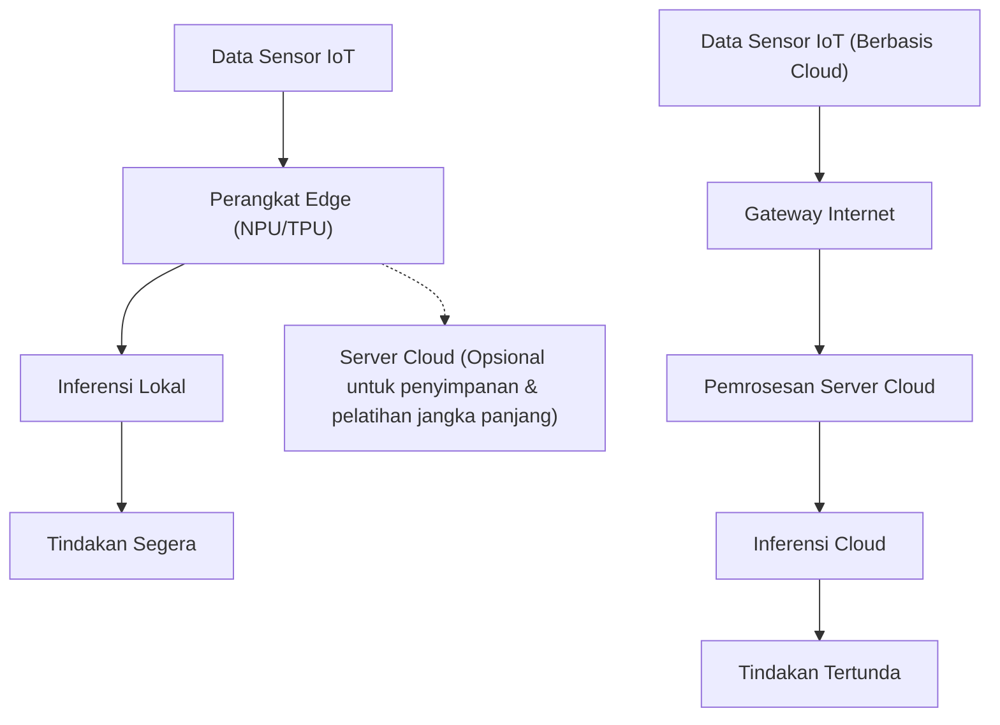
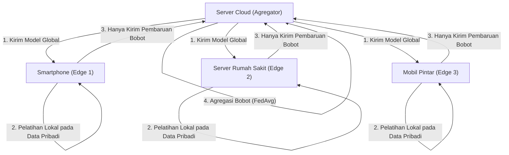

# Masa Depan Edge AI dan Pendekatan Implementasi pada Perangkat IoT

## 1. Pendahuluan: Mengapa Edge AI Saat Ini?

Dengan meluasnya penggunaan perangkat IoT (Internet of Things), kita telah memasuki era di mana semua objek fisik di seluruh dunia terhubung ke internet. Seiring dengan evolusi teknologi sensor, jumlah data yang dihasilkan dari perangkat-perangkat ini meningkat secara eksplosif. Secara tradisional, data dalam jumlah besar ini dikirim ke cloud, dan inferensi oleh model AI dilakukan menggunakan sumber daya komputasi yang kuat di cloud (seperti klaster GPU yang besar). Ini adalah pendekatan umum dari "Cloud AI".

Namun, arsitektur di mana semua data dikirim ke cloud, diproses di cloud, dan hasilnya dikirim kembali ke perangkat memiliki beberapa keterbatasan yang signifikan:
1. **Masalah Latensi (Keterlambatan)**: Dalam sistem yang memerlukan keputusan instan dalam hitungan milidetik, seperti mobil otonom, robot industri, dan drone, latensi komunikasi jaringan dapat menyebabkan kecelakaan fatal.
2. **Privasi dan Keamanan**: Terus-menerus mengirimkan video atau data biometrik yang sangat rahasia atau memuat informasi pribadi, seperti dari kamera pengawas smart home atau perangkat medis yang dapat dikenakan (wearable), ke cloud membawa risiko kebocoran informasi dan pelanggaran privasi.
3. **Bandwidth Jaringan dan Biaya**: Jika jutaan kamera IoT terus-menerus mengirimkan aliran video 4K ke cloud, bandwidth jaringan akan habis, dan biaya transfer data serta biaya penyimpanan cloud akan menjadi sangat besar.
4. **Stabilitas Koneksi (Lingkungan Offline)**: Di lingkungan di mana koneksi internet tidak stabil atau tidak ada, seperti fasilitas bawah tanah, di laut, atau pertanian terpencil, ketergantungan pada cloud berarti berhentinya fungsi seluruh sistem.

Untuk menyelesaikan tantangan-tantangan ini, **"Edge AI"** telah muncul. Edge AI adalah teknologi yang mengeksekusi algoritma AI secara langsung pada perangkat IoT yang menghasilkan data itu sendiri (atau pada ujung jaringan yang sangat dekat dengan perangkat, yaitu edge). Dengan ini, data segera diproses dan dianalisis di sumbernya, meminimalkan ketergantungan pada cloud, dan memungkinkan pembangunan sistem cerdas yang cepat, aman, dan berbiaya rendah.

Dalam artikel ini, kita akan membahas secara mendalam dari sudut pandang teknis, mulai dari dasar-dasar Edge AI, tren terbaru dalam perangkat keras (NPU/TPU, dll.), teknologi kompresi (kuantisasi dan pemangkasan) untuk mengadaptasi model ke lingkungan edge, metode implementasi menggunakan ONNX Runtime, hingga Federated Learning yang mewujudkan perlindungan privasi dan pembelajaran terdistribusi.

---

## 2. Perbandingan Arsitektur Cloud AI dan Edge AI

Untuk memahami perbedaan antara Cloud AI dan Edge AI secara visual, silakan merujuk pada diagram arsitektur berikut.



Seperti yang dapat dilihat dari diagram ini, dalam arsitektur Edge AI, putaran dari sumber data ke inferensi dan kemudian tindakan (kontrol) diselesaikan di dalam perangkat edge. Cloud hanya berperan sebagai pendukung non-real-time seperti mendistribusikan model yang sudah dilatih atau mengumpulkan dan menganalisis tren data dalam jangka panjang.

### Model Matematis Latensi Inferensi

Mari kita merumuskan perbedaan latensi antara edge dan cloud. Waktu hingga inferensi keseluruhan sistem selesai, $T_{total}$, dinyatakan sebagai berikut:

**Dalam kasus Cloud AI:**
$$ T_{total} = T_{network\_up} + T_{cloud\_compute} + T_{network\_down} $$

Di sini, waktu unggah jaringan $T_{network\_up}$ bergantung pada persamaan berikut:
$$ T_{network\_up} = \frac{D}{B} + RTT $$
($D$: Ukuran data yang dikirim, $B$: Bandwidth jaringan, $RTT$: Round Trip Time)

Ketika ukuran data $D$ besar (seperti gambar resolusi tinggi atau data getaran kontinu) atau di lingkungan di mana bandwidth $B$ sempit, $T_{network\_up}$ akan meningkat drastis, dan tidak peduli seberapa cepat kecepatan inferensi AI itu sendiri $T_{cloud\_compute}$, ia akan menjadi leher botol (bottleneck).

**Dalam kasus Edge AI:**
$$ T_{total} \approx T_{edge\_compute} $$

Dalam Edge AI, karena tidak melibatkan transfer jaringan, $T_{network\_up}$ dan $T_{network\_down}$ menjadi hampir nol (hanya transfer bus lokal). Meskipun kemampuan komputasi perangkat edge lebih rendah daripada cloud, sehingga sering kali $T_{edge\_compute} > T_{cloud\_compute}$, karena penundaan jaringan dan ketidakpastian komunikasi dapat dihilangkan, $T_{total}$ keseluruhan dapat dipertahankan stabil dan rendah.

---

## 3. Teknologi Perangkat Keras yang Mendukung Edge AI

Untuk menjalankan model deep learning dengan kecepatan tinggi di perangkat edge, akselerator perangkat keras khusus sangat penting. Dengan pemrosesan CPU tradisional, inferensi AI real-time sulit dilakukan dari sudut pandang konsumsi daya dan kecepatan pemrosesan. Di sini, kami memperkenalkan perangkat keras representatif untuk Edge AI.

### 3.1 NPU (Neural Processing Unit) dan TPU (Tensor Processing Unit)
Proses inferensi deep learning (terutama inferensi CNN dll.) terdiri dari sejumlah besar operasi perkalian dan akumulasi matriks (MAC: Multiply-Accumulate). NPU dan TPU adalah chip khusus (ASIC) yang dirancang untuk mengeksekusi operasi MAC ini secara paralel dengan konsumsi daya yang sangat rendah.

- **Google Coral Edge TPU**:
  Edge TPU dari Google adalah koprosesor yang sangat kecil namun memiliki kemampuan inferensi yang kuat. Dengan konsumsi daya hanya 2W, ia dapat mencapai kinerja 4 TOPS (Tera Operations Per Second: 4 triliun operasi per detik). Ini memungkinkan eksekusi real-time model TensorFlow Lite yang dioptimalkan untuk perangkat mobile hanya dengan menghubungkannya via USB ke SBC (Single Board Computer) ringan seperti Raspberry Pi.
- **Raspberry Pi AI Kit (dilengkapi dengan Hailo-8L)**:
  Raspberry Pi AI Kit yang baru-baru ini dirilis dilengkapi dengan akselerator AI Hailo "Hailo-8L". Arsitektur Hailo memetakan struktur jaringan saraf ke struktur perangkat keras chip, menghilangkan hambatan akses memori, dan mewujudkan kinerja inferensi luar biasa hingga 13 TOPS dalam batas daya beberapa watt.
- **NVIDIA Jetson Series**:
  Seri Jetson Nano, Xavier, dan Orin adalah SoC yang mengintegrasikan CPU ARM dan core GPU kuat dari NVIDIA. Karena ekosistem CUDA dapat digunakan apa adanya, sangat mudah untuk menerapkan model PyTorch atau TensorFlow yang dilatih di cloud ke edge melalui TensorRT.

### TOPS dan Efisiensi Daya (TOPS/W)
Indikator terpenting dalam mengevaluasi perangkat keras Edge AI adalah "TOPS/W" (TOPS per watt). Karena perangkat IoT beroperasi di bawah batasan daya yang ketat, seperti bertenaga baterai atau PoE (Power over Ethernet), kunci utamanya bukan hanya kinerja komputasi sederhana (TOPS), tetapi seberapa sedikit daya yang digunakan untuk melakukan inferensi AI.

---

## 4. Implementasi pada Perangkat Edge: Teori dan Praktik Kompresi Model

Bahkan ketika perangkat keras berkembang, tidak mungkin memuat model deep learning besar (seperti GPT atau ResNet skala besar) yang berukuran ratusan MB hingga beberapa GB langsung ke dalam RAM yang terbatas (beberapa MB hingga beberapa GB) dari perangkat edge. Oleh karena itu, "kompresi model" (Model Compression) menjadi wajib. Sebagai teknik perwakilan, kami akan menjelaskan "Kuantisasi" (Quantization) dan "Pemangkasan" (Pruning) secara rinci.

### 4.1 Kuantisasi Model (Quantization)

Model deep learning biasanya merepresentasikan bobot dan fungsi aktivasi dalam angka floating point 32-bit (FP32). Kuantisasi adalah teknik untuk mengurangi presisi ini menjadi 16-bit (FP16), bilangan bulat 8-bit (INT8), atau bahkan bit yang lebih rendah.

**Efek Pengurangan Memori**:
Jika jumlah parameter adalah $N$, jumlah memori yang dibutuhkan dihitung sebagai berikut:
$$ M_{FP32} = N \times 4 \text{ (Bytes)} $$
$$ M_{INT8} = N \times 1 \text{ (Bytes)} $$
Melalui kuantisasi INT8, ukuran model dan penggunaan memori secara teoritis dapat dikurangi menjadi $\frac{1}{4}$. Lebih jauh lagi, perangkat keras (seperti NPU) dapat mengeksekusi operasi MAC INT8 beberapa kali hingga puluhan kali lebih cepat dan dengan daya yang lebih rendah dibandingkan operasi FP32, sehingga menghasilkan pengurangan latensi inferensi dan konsumsi daya yang signifikan.

**Model Matematis Kuantisasi**:
Persamaan kuantisasi afin dasar untuk memetakan bilangan real $r$ (FP32) ke bilangan bulat $q$ (INT8: -128 hingga 127) adalah sebagai berikut:

$$ r = S \times (q - Z) $$
$$ q = \text{round}\left( \frac{r}{S} + Z \right) $$

Di sini, $S$ mewakili faktor skala (Scale) dan $Z$ mewakili zero-point (ke nilai integer mana nilai 0 dari bilangan real dipetakan).

Kuantisasi mencakup **Post-Training Quantization (PTQ)**, yang mengonversi model setelah pelatihan selesai, dan **Quantization-Aware Training (QAT)**, yang memperbarui bobot sambil menyimulasikan kesalahan kuantisasi selama proses pelatihan. QAT direkomendasikan jika ingin meminimalkan penurunan akurasi.

### 4.2 Pemangkasan Model (Pruning)

Dalam jaringan saraf, terdapat banyak bobot yang hampir tidak berdampak (memiliki kepentingan rendah) pada hasil inferensi akhir. Teknologi yang membuat bobot tidak perlu ini menjadi nol atau menghapusnya dari struktur jaringan itu sendiri disebut pemangkasan (Pruning).

**Definisi Sparsity (Keserampangan / Ketersebaran)**:
$$ \text{Sparsity} (S) = \frac{N_{zero}}{N_{total}} \times 100 \text{ (\%)} $$
Di mana $N_{zero}$ adalah jumlah bobot yang dijadikan nol, dan $N_{total}$ adalah jumlah total bobot dalam model.

- **Pemangkasan Tidak Terstruktur (Unstructured Pruning)**: Metode di mana setiap bobot secara independen dijadikan nol. Meskipun sparsity menjadi tinggi, matriks bobot hanya menjadi matriks jarang (Sparse Matrix), dan pada CPU/GPU umum, pola akses memori menjadi tidak beraturan, sehingga percepatan yang diharapkan mungkin tidak tercapai.
- **Pemangkasan Terstruktur (Structured Pruning / Channel Pruning)**: Metode yang menghapus seluruh filter atau saluran (channel) dari lapisan konvolusi. Karena dimensi jaringan itu sendiri menyusut, peningkatan kecepatan inferensi yang jelas (Speedup) dan efek pengurangan memori dapat dicapai pada perangkat keras apa pun.

Tingkat peningkatan kecepatan inferensi $S_{speedup}$ secara kasar sebanding dengan tingkat pengurangan saluran $c$ ($0 < c < 1$) sebagai berikut (berdasarkan pengurangan jumlah operasi MAC):
$$ S_{speedup} \propto \frac{1}{(1 - c)^2} $$
(*Karena kompleksitas komputasi operasi konvolusi sebanding dengan perkalian jumlah saluran input dan saluran output)

---

## 5. Deployment dan Mesin Inferensi: Memanfaatkan ONNX Runtime

Untuk benar-benar menjalankan model yang telah dikompresi di perangkat edge, diperlukan mesin inferensi yang ringan dan mendukung multi-platform. Saat ini, **ONNX (Open Neural Network Exchange)** dan **ONNX Runtime** banyak digunakan sebagai standar industri.

ONNX adalah standar untuk menangani model dari berbagai framework, seperti PyTorch dan TensorFlow, dalam format umum. ONNX Runtime adalah mesin untuk mengeksekusi model ONNX ini secara optimal pada berbagai perangkat keras.

Mekanisme **Execution Providers (EP)** adalah kekuatan ONNX Runtime. Anda dapat mengubah lingkungan eksekusi backend ke CPU, CUDA (GPU), TensorRT, OpenVINO, CoreML, XNNPACK, dll., tanpa perlu menulis ulang kode.

Berikut adalah contoh kode dasar untuk inferensi oleh ONNX Runtime pada perangkat edge menggunakan Python:

```python
import onnxruntime as ort
import numpy as np
import time

def run_edge_inference(model_path, input_data):
    # Penentuan Execution Provider sesuai dengan perangkat edge
    # Contoh: Untuk CPU gunakan 'CPUExecutionProvider'
    # Jika didukung oleh Coral Edge TPU atau NPU tertentu, tentukan EP kustom
    providers = ['CPUExecutionProvider']
    
    # Inisialisasi sesi (memuat model dan optimasi grafik)
    session = ort.InferenceSession(model_path, providers=providers)
    
    # Mendapatkan nama input dan bentuk (shape) input model
    input_name = session.get_inputs()[0].name
    expected_shape = session.get_inputs()[0].shape
    print(f"Bentuk input yang diharapkan: {expected_shape}")
    
    # Pengukuran waktu inferensi
    start_time = time.time()
    
    # Pelaksanaan inferensi
    # Data input diberikan sebagai array Numpy yang sesuai (contoh: np.float32 atau np.int8)
    outputs = session.run(None, {input_name: input_data})
    
    latency = (time.time() - start_time) * 1000.0 # Konversi ke milidetik
    print(f"Latensi Inferensi: {latency:.2f} ms")
    
    return outputs[0]

# Data input dummy (contoh: gambar RGB 224x224 ukuran batch 1)
dummy_input = np.random.randn(1, 3, 224, 224).astype(np.float32)
# run_edge_inference("lightweight_model.onnx", dummy_input)
```

Dengan mem-porting kode dasar ini ke bahasa dengan latensi lebih rendah seperti C++, dimungkinkan untuk memaksimalkan kinerja perangkat keras di perangkat edge.

---

## 6. Perlindungan Privasi dan Pembelajaran Terdistribusi: Federated Learning

Salah satu bentuk evolusi puncak dari Edge AI adalah **Federated Learning (Pembelajaran Terfederasi/Gabungan)**, di mana tidak hanya "inferensi" tetapi juga "pembelajaran" dari model didistribusikan ke edge.

Dalam machine learning tradisional, data mentah (video, audio, log, dll.) dikumpulkan dari semua perangkat IoT ke cloud, dan model dilatih sekaligus. Namun, mengumpulkan data pribadi dari smartphone atau peralatan medis ke cloud membawa risiko privasi yang serius.

Federated Learning memecahkan masalah ini dengan elegan.



**Proses Federated Learning**:
1. Server cloud (agregator) mendistribusikan "model global" yang telah diinisialisasi ke setiap perangkat edge.
2. Setiap perangkat edge melakukan pembelajaran (fine-tuning) model global secara lokal menggunakan data rahasia yang tersimpan di dalamnya **tanpa pernah mengeluarkan data tersebut**.
3. Perangkat edge hanya mengirimkan "jumlah pembaruan bobot model (gradien)" yang diperoleh dari pembelajaran kembali ke cloud. Data mentah tidak pernah meninggalkan perangkat.
4. Cloud merata-ratakan jumlah pembaruan bobot yang dikumpulkan dari banyak perangkat dan menghasilkan model global yang baru.

**Model Matematis Federated Averaging (FedAvg)**:
Persamaan pembaruan dari FedAvg, algoritma agregasi yang paling representatif, adalah sebagai berikut:
Misalkan terdapat total $K$ klien, dan setiap klien $k$ memiliki $n_k$ sampel data. Jika jumlah total data adalah $N = \sum_{k=1}^{K} n_k$, bobot model global $w_{t+1}$ untuk ronde berikutnya dihitung sebagai berikut:

$$ w_{t+1} = \sum_{k=1}^{K} \frac{n_k}{N} w_{t+1}^k $$

Di sini, $w_{t+1}^k$ adalah bobot yang diperbarui setelah klien $k$ belajar menggunakan data lokalnya. Dengan mengambil rata-rata tertimbang sesuai dengan jumlah data dengan cara ini, sangat dimungkinkan untuk membangun model dengan kinerja tinggi, seolah-olah dilatih dengan mengumpulkan data dari semua perangkat, sambil melindungi privasi sepenuhnya.

---

## 7. Kasus Penggunaan Implementasi pada Perangkat IoT

Edge AI sudah diimplementasikan di berbagai industri dan menyebabkan pergeseran paradigma (paradigm shift) yang dramatis.

### 7.1 Manufaktur Pintar dan Pemeliharaan Prediktif (Predictive Maintenance)
Data getaran dan akustik dari motor atau turbin di lini produksi pabrik terus dipantau oleh perangkat edge (PLC atau server edge). Terus-menerus mengirim data getaran yang disampel dalam siklus beberapa milidetik ke cloud adalah hal yang mustahil, tetapi dengan Edge AI, tanda-tanda ketidaknormalan (deteksi anomali menggunakan model deteksi anomali) dapat dideteksi secara real-time, memungkinkan lini produksi dihentikan secara darurat tepat sebelum mesin mengalami kerusakan fatal.

### 7.2 Pertanian Pintar (Smart Agriculture)
Infrastruktur komunikasi sering kali lemah di lahan pertanian yang luas, membuat Edge AI sangat diperlukan. Model deteksi objek yang ringan (seperti YOLOv8 nano) yang dipasang pada drone dapat mengidentifikasi hama dan daun yang sakit secara real-time dari rekaman udara. Hanya dengan mentransmisikan data koordinat yang teridentifikasi, atau dengan menggunakan drone penyemprot yang terhubung untuk menyemprotkan pestisida di titik yang tepat secara langsung, jumlah penggunaan pestisida dapat dikurangi drastis.

### 7.3 Perangkat Medis yang Dapat Dikenakan (Wearables)
Pada jam tangan pintar (smartwatch) dan elektrokardiogram (ECG) portabel, tanda-tanda aritmia (seperti fibrilasi atrium) dideteksi dari data detak jantung pemakai oleh perangkat edge itu sendiri. Karena data medis sangat rahasia, Edge AI, di mana inferensi diselesaikan di dalam perangkat tanpa mengunggah ke cloud, adalah kunci untuk memenuhi regulasi privasi medis yang ketat seperti HIPAA.

---

## 8. Tantangan dan Prospek Masa Depan Edge AI

Meskipun teknologi Edge AI berkembang pesat, masih terdapat banyak tantangan dan prospek masa depan yang menarik.

**1. Menjalankan LLM (Large Language Models) di Edge**:
Topik terbesar dalam beberapa tahun terakhir adalah upaya "Edge LLM" untuk menjalankan AI generatif dan LLM di edge. Meskipun tidak mungkin memuat model dengan puluhan miliar parameter langsung ke edge, kemunculan framework optimasi seperti llama.cpp, kuantisasi ekstrem hingga 4-bit/2-bit (AWQ, GPTQ, dll.), dan SLM (Small Language Models) berkinerja tinggi yang kecil namun kuat seperti Phi-3 dari Microsoft, membawa kita ke era di mana pemrosesan bahasa alami dapat diselesaikan secara offline bahkan di smartphone atau Raspberry Pi.

**2. Komputasi Neuromorfik dan SNN**:
Sebagai Edge AI yang sangat hemat daya, banyak harapan diletakkan pada "chip neuromorfik" (contoh: Intel Loihi) dan "Spiking Neural Networks (SNN)", yang secara fisik meniru cara kerja sirkuit saraf otak manusia. SNN digerakkan oleh peristiwa (event-driven), di mana komputasi hanya dilakukan saat data berubah (spike). Secara teori, hal ini memungkinkan konsumsi daya ditekan dengan sangat drastis (hingga puluhan atau ratusan kali lebih kecil) dibandingkan model deep learning konvensional.

**3. Pembentukan EdgeOps (Bukan MLOps)**:
Tantangan operasional ini berpusat pada bagaimana cara mengirimkan pembaruan model secara aman (OTA: Over-The-Air update) ke ribuan atau puluhan ribu perangkat edge yang tersebar di seluruh dunia, dan bagaimana memantau penurunan akurasi (data drift) dari model yang sedang berjalan. Otomatisasi deployment di lingkungan heterogen di mana arsitektur perangkat keras bervariasi dari satu perangkat ke perangkat lain adalah area rekayasa (engineering) yang akan mengalami permintaan tertinggi di masa depan.

---

## 9. Penutup

Edge AI telah berevolusi dari sekadar "teknologi pelengkap cloud" menjadi teknologi inti yang menentukan arsitektur dari seluruh sistem IoT. Manfaat yang dibawa oleh Edge AI tak ternilai harganya, termasuk meminimalkan latensi inferensi, perlindungan privasi yang ketat, dan pengurangan bandwidth komunikasi serta biaya cloud secara signifikan.

Dengan perkembangan pesat dalam teknik kompresi perangkat lunak seperti kuantisasi dan pemangkasan model, serta evolusi perangkat keras yang luar biasa seperti NPU, TPU, dan Hailo yang berjalan beriringan, model deep learning yang dulunya membutuhkan superkomputer kini berjalan di perangkat yang ada di telapak tangan kita dengan daya hanya beberapa miliwatt.

Selain itu, batas-batas teknologi berkembang dengan cepat berkat pendekatan pembelajaran terdistribusi seperti Federated Learning dan eksekusi AI generatif (SLM) di Edge. Bagi para insinyur dan arsitek, tidak hanya sekadar mengandalkan sumber daya cloud yang sangat besar, melainkan mengejar "bagaimana cara memaksimalkan kecerdasan pada edge dengan sumber daya yang terbatas" akan menjadi tantangan paling menantang dan menarik di masa depan.

Di garis depan IoT tempat dunia fisik dan dunia digital menyatu, Edge AI tidak diragukan lagi akan menjadi sistem saraf pusat yang mendorong masa depan.

---
*Artikel ini dibuat untuk para insinyur dan arsitek sistem yang tertarik dalam implementasi AI pada perangkat IoT.*
