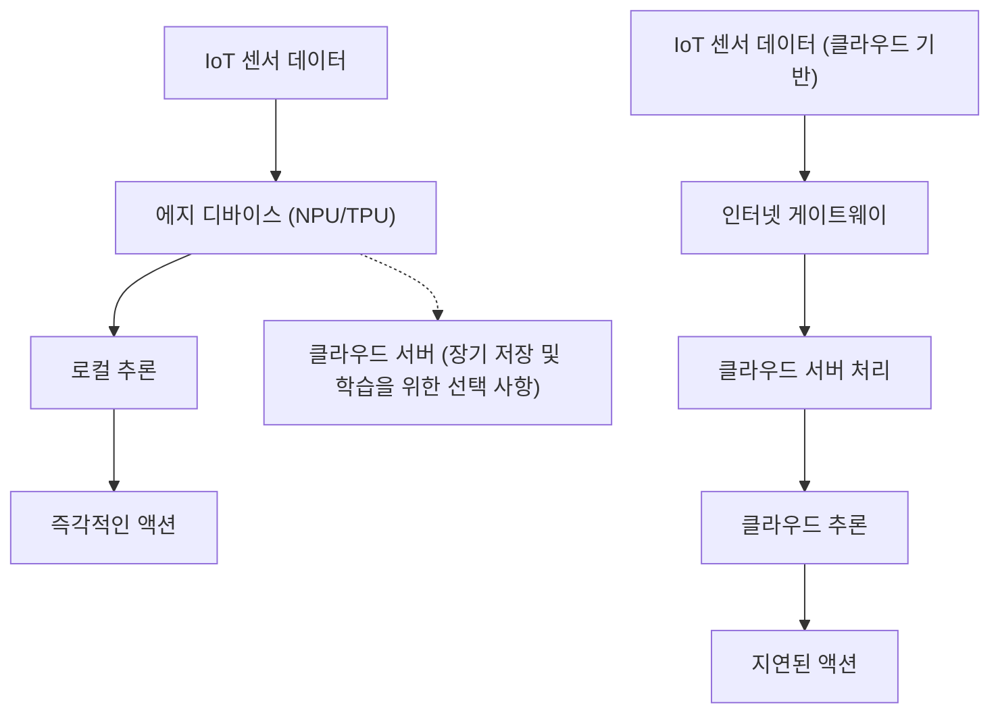
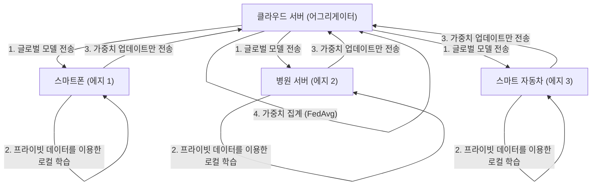

# Edge AI의 미래와 IoT 디바이스 구현 접근법

## 1. 서론: 왜 지금 에지 AI(Edge AI)인가?

IoT(Internet of Things) 디바이스의 보급으로 전 세계의 모든 물리적 사물이 인터넷에 연결되는 시대가 되었습니다. 센서 기술의 진화와 함께 기기에서 생성되는 데이터의 양은 폭발적으로 증가하고 있습니다. 기존에는 이러한 방대한 데이터가 클라우드로 전송되어, 클라우드 상의 강력한 컴퓨팅 자원(거대한 GPU 클러스터 등)을 사용해 AI 모델을 통한 추론이 이루어졌습니다. 이것이 '클라우드 AI'의 일반적인 접근 방식입니다.

하지만 모든 데이터를 클라우드로 전송하고 클라우드에서 처리한 결과를 다시 기기로 보내는 아키텍처에는 몇 가지 중대한 한계가 존재합니다.
1. **지연 시간(레이턴시) 문제**: 자율주행차, 산업용 로봇, 드론 등 밀리초 단위의 즉각적인 판단이 요구되는 시스템에서는 네트워크 통신 지연이 치명적인 사고로 이어질 수 있습니다.
2. **프라이버시와 보안**: 스마트 홈의 보안 카메라나 의료용 웨어러블 기기 등 개인정보나 기밀성이 높은 영상 및 생체 데이터를 지속적으로 클라우드에 전송하는 것은 정보 유출이나 프라이버시 침해의 위험을 수반합니다.
3. **네트워크 대역폭과 비용**: 수백만 대의 IoT 카메라에서 상시 4K 영상 스트림을 클라우드로 전송한다면, 네트워크 대역폭이 고갈되고 데이터 전송 비용과 클라우드 스토리지 비용이 막대해집니다.
4. **연결의 안정성(오프라인 환경)**: 지하시설, 해상, 원격지 농장 등 인터넷 연결이 불안정하거나 존재하지 않는 환경에서는 클라우드에 대한 의존이 시스템 전체의 기능 정지를 의미합니다.

이러한 과제를 해결하기 위해 대두된 것이 **'Edge AI(에지 AI)'**입니다. Edge AI란 데이터를 생성하는 IoT 디바이스 자체(또는 디바이스와 극히 가까운 네트워크의 말단 = 에지)에서 AI 알고리즘을 직접 실행하는 기술입니다. 이를 통해 데이터는 발생원에서 즉시 처리 및 분석되며, 클라우드에 대한 의존을 최소화하면서 빠르고 안전하며 저렴한 지능형 시스템을 구축할 수 있게 됩니다.

본 기사에서는 Edge AI의 기초부터 하드웨어(NPU/TPU 등)의 최신 동향, 모델을 에지 환경에 맞추기 위한 경량화 기술(양자화 및 가지치기), ONNX Runtime을 이용한 구현 기법, 나아가 프라이버시 보호와 분산 학습을 실현하는 Federated Learning(연합 학습)까지 기술적인 관점에서 매우 깊이 있게 파헤쳐 설명합니다.

---

## 2. 클라우드 AI와 에지 AI의 아키텍처 비교

클라우드 AI와 에지 AI의 차이를 시각적으로 이해하기 위해 아래의 아키텍처 다이어그램을 참고해 주십시오.



이 다이어그램에서 알 수 있듯이, Edge AI 아키텍처에서는 데이터의 발생원에서부터 추론, 그리고 액션(제어)까지의 루프가 에지 디바이스 내에서 완결됩니다. 클라우드는 어디까지나 학습된 모델의 배포나 장기적인 데이터 집계 및 동향 분석과 같은 비실시간적 보조 역할로 물러납니다.

### 추론 레이턴시의 수학적 모델

에지와 클라우드에서의 레이턴시 차이를 정식화해 보겠습니다. 시스템 전체의 추론 완료까지 걸리는 시간 $T_{total}$은 다음과 같이 표현됩니다.

**클라우드 AI의 경우:**
$$ T_{total} = T_{network\_up} + T_{cloud\_compute} + T_{network\_down} $$

여기서 네트워크 업로드 시간 $T_{network\_up}$은 다음 식에 의존합니다.
$$ T_{network\_up} = \frac{D}{B} + RTT $$
($D$: 전송하는 데이터 크기, $B$: 네트워크 대역폭, $RTT$: 왕복 지연 시간)

데이터 크기 $D$가 크거나(고해상도 이미지나 연속적인 진동 데이터 등) 대역폭 $B$가 좁은 환경에서는 $T_{network\_up}$이 극적으로 증가하여, AI 자체의 추론 속도 $T_{cloud\_compute}$가 아무리 빠르더라도 병목 현상이 발생합니다.

**Edge AI의 경우:**
$$ T_{total} \approx T_{edge\_compute} $$

Edge AI에서는 네트워크 전송이 수반되지 않으므로 $T_{network\_up}$과 $T_{network\_down}$은 거의 0(로컬 버스 전송만 발생)이 됩니다. 에지 디바이스의 컴퓨팅 능력은 클라우드에 비해 떨어지기 때문에 $T_{edge\_compute} > T_{cloud\_compute}$가 되는 경우가 많지만, 네트워크의 지연과 통신의 불확실성을 배제할 수 있으므로 종합적인 $T_{total}$은 안정적으로 낮게 유지됩니다.

---

## 3. 에지 AI를 뒷받침하는 하드웨어 기술

에지 디바이스 상에서 딥러닝 모델을 고속으로 실행하기 위해서는 전용 하드웨어 가속기가 필수적입니다. 기존 CPU를 통한 처리에서는 전력 소비와 처리 속도의 관점에서 실시간 AI 추론이 어려웠습니다. 여기서는 대표적인 Edge AI용 하드웨어를 소개합니다.

### 3.1 NPU (Neural Processing Unit) 와 TPU (Tensor Processing Unit)
딥러닝의 추론 프로세스(특히 CNN 등의 추론)는 대량의 행렬 곱셈-누산 연산(MAC 연산: Multiply-Accumulate)으로 구성되어 있습니다. NPU와 TPU는 이러한 MAC 연산을 병렬로 초저전력에서 실행하기 위해 특화된 전용 칩(ASIC)입니다.

- **Google Coral Edge TPU**:
  Google이 제공하는 Edge TPU는 매우 소형이면서도 강력한 추론 능력을 갖춘 보조 프로세서입니다. 불과 2W의 소비 전력으로 4 TOPS (Tera Operations Per Second: 1초당 4조 번의 연산)의 성능을 발휘합니다. 이를 통해 Raspberry Pi와 같은 경량 SBC(싱글 보드 컴퓨터)에 USB로 연결하는 것만으로, 모바일에 최적화된 TensorFlow Lite 모델을 실시간으로 실행 가능하게 합니다.
- **Raspberry Pi AI Kit (Hailo-8L 탑재)**:
  최근 출시된 Raspberry Pi AI Kit은 Hailo사의 AI 가속기 'Hailo-8L'을 탑재하고 있습니다. Hailo의 아키텍처는 신경망 구조를 칩의 하드웨어 구조에 매핑함으로써 메모리 접근 병목 현상을 해소하고, 수 와트의 전력 한도 내에서 최대 13 TOPS라는 경이로운 추론 성능을 구현합니다.
- **NVIDIA Jetson 시리즈**:
  Jetson Nano, Xavier, Orin 시리즈는 ARM CPU와 NVIDIA의 강력한 GPU 코어를 통합한 SoC입니다. CUDA 생태계를 그대로 활용할 수 있기 때문에, 클라우드에서 학습시킨 PyTorch나 TensorFlow 모델을 TensorRT를 통해 에지에 배포하는 것이 매우 쉽습니다.

### TOPS와 전력 효율 (TOPS/W)
Edge AI 하드웨어를 평가할 때 가장 중요한 지표는 'TOPS/W(1와트당 TOPS)'입니다. IoT 디바이스는 배터리 구동이나 PoE(Power over Ethernet) 등 엄격한 전력 제약 조건에서 가동되기 때문에, 단순한 연산 성능(TOPS)뿐만 아니라 얼마나 적은 전력 정력으로 AI 추론을 수행할 수 있는지가 핵심이 됩니다.

---

## 4. 에지 디바이스로의 구현: 모델 경량화 이론과 실제

하드웨어가 발전하더라도 수백 MB에서 수 GB에 달하는 거대한 딥러닝 모델(예를 들어 GPT나 대규모 ResNet 등)을 에지 디바이스의 제한된 RAM(수 MB ~ 수 GB)에 그대로 로드하는 것은 불가능합니다. 따라서 '모델 경량화(Model Compression)'가 필수적입니다. 대표적인 기법으로 '양자화(Quantization)'와 '가지치기(Pruning)'를 자세히 설명합니다.

### 4.1 모델 양자화 (Quantization)

딥러닝 모델은 일반적으로 32비트 부동소수점(FP32)으로 가중치와 활성화 함수가 표현되어 있습니다. 양자화란 이를 16비트(FP16), 8비트 정수(INT8) 또는 더 낮은 비트로 정밀도를 낮추는 기술입니다.

**메모리 절감 효과**:
파라미터 수를 $N$이라고 할 때, 필요한 메모리 양은 다음과 같이 계산됩니다.
$$ M_{FP32} = N \times 4 \text{ (Bytes)} $$
$$ M_{INT8} = N \times 1 \text{ (Bytes)} $$
INT8 양자화를 통해 모델 크기와 메모리 사용량을 이론상 $\frac{1}{4}$로 줄일 수 있습니다. 게다가 하드웨어(NPU 등)는 INT8의 MAC 연산을 FP32 연산에 비해 수 배에서 수십 배 빠르고 저전력으로 실행할 수 있어, 추론 레이턴시와 소비 전력의 대폭적인 절감으로 이어집니다.

**양자화의 수리 모델**:
실수 $r$ (FP32)을 정수 $q$ (INT8: -128 ~ 127)로 매핑하기 위한 기본적인 어핀 양자화 식은 다음과 같습니다.

$$ r = S \times (q - Z) $$
$$ q = \text{round}\left( \frac{r}{S} + Z \right) $$

여기서 $S$는 스케일 팩터(Scale), $Z$는 제로 포인트(Zero-point: 실수의 0을 정수형의 어떤 값으로 매핑할 것인가)를 나타냅니다.

양자화에는 학습 완료 후의 모델을 변환하는 **Post-Training Quantization (PTQ)**와, 학습 과정 중에 양자화 오차를 시뮬레이션하면서 가중치를 업데이트하는 **Quantization-Aware Training (QAT)**가 있습니다. 정확도 저하를 최소화하고 싶다면 QAT가 권장됩니다.

### 4.2 모델 가지치기 (Pruning)

신경망에는 최종 추론 결과에 거의 영향을 미치지 않는(중요도가 낮은) 가중치가 다수 존재합니다. 이러한 불필요한 가중치를 0으로 만들거나 신경망 구조 자체에서 삭제하는 기술이 가지치기(Pruning)입니다.

**Sparsity(희소성)의 정의**:
$$ \text{Sparsity} (S) = \frac{N_{zero}}{N_{total}} \times 100 \text{ (\%)} $$
여기서 $N_{zero}$는 0이 된 가중치의 수, $N_{total}$은 모델 전체의 가중치 총수입니다.

- **비구조화 가지치기 (Unstructured Pruning)**: 개별 가중치를 독립적으로 0으로 만드는 기법. Sparsity는 높아지지만 가중치 행렬이 희소 행렬(Sparse Matrix)이 될 뿐이므로, 일반적인 CPU/GPU에서는 메모리 접근 패턴이 불규칙해져 기대만큼의 속도 향상을 얻지 못할 수 있습니다.
- **구조화 가지치기 (Structured Pruning / Channel Pruning)**: 합성곱 층의 필터나 채널을 통째로 삭제하는 기법. 신경망의 차원 자체가 축소되기 때문에 어떤 하드웨어 상에서도 명확한 추론 속도 향상(Speedup)과 메모리 절감 효과를 얻을 수 있습니다.

추론 속도 향상률 $S_{speedup}$은 채널 축소율 $c$ ($0 < c < 1$)에 대해 대략 다음과 같이 비례합니다(MAC 연산 횟수 감소에 기반).
$$ S_{speedup} \propto \frac{1}{(1 - c)^2} $$
(※ 합성곱 연산의 계산량은 입력 채널 수와 출력 채널 수의 곱에 비례하기 때문)

---

## 5. 배포 및 추론 엔진: ONNX Runtime 활용

경량화된 모델을 실제로 에지 디바이스에서 구동하려면 가볍고 멀티 플랫폼을 지원하는 추론 엔진이 필요합니다. 현재 업계 표준으로 널리 사용되고 있는 것이 **ONNX (Open Neural Network Exchange)**와 **ONNX Runtime**입니다.

ONNX는 PyTorch나 TensorFlow 등 서로 다른 프레임워크 간에 모델을 공통 포맷으로 다루기 위한 규격입니다. ONNX Runtime은 이 ONNX 모델을 다양한 하드웨어 상에서 최적으로 실행하기 위한 엔진입니다.

**Execution Providers (EP)**라는 메커니즘이 ONNX Runtime의 강력한 점입니다. 코드를 다시 작성하지 않고도 백엔드 실행 환경을 CPU, CUDA (GPU), TensorRT, OpenVINO, CoreML, XNNPACK 등으로 전환할 수 있습니다.

다음은 Python을 이용하여 에지 디바이스 상에서 ONNX Runtime으로 추론하는 기본적인 코드 예시입니다.

```python
import onnxruntime as ort
import numpy as np
import time

def run_edge_inference(model_path, input_data):
    # 에지 디바이스에 맞춘 Execution Provider 지정
    # 예: CPU의 경우 'CPUExecutionProvider'
    # Coral Edge TPU나 특정 NPU가 지원하는 경우 커스텀 EP를 지정
    providers = ['CPUExecutionProvider']
    
    # 세션 초기화 (모델 로드 및 그래프 최적화)
    session = ort.InferenceSession(model_path, providers=providers)
    
    # 모델의 입력 이름과 입력 셰이프 가져오기
    input_name = session.get_inputs()[0].name
    expected_shape = session.get_inputs()[0].shape
    print(f"Expected input shape: {expected_shape}")
    
    # 추론 시간 측정
    start_time = time.time()
    
    # 추론 실행
    # 입력 데이터는 적절한 Numpy 배열 (예: np.float32 또는 np.int8) 로 전달
    outputs = session.run(None, {input_name: input_data})
    
    latency = (time.time() - start_time) * 1000.0 # 밀리초로 변환
    print(f"Inference Latency: {latency:.2f} ms")
    
    return outputs[0]

# 더미 입력 데이터 (예: 224x224 RGB 이미지, 배치 사이즈 1)
dummy_input = np.random.randn(1, 3, 224, 224).astype(np.float32)
# run_edge_inference("lightweight_model.onnx", dummy_input)
```

이 코드를 바탕으로 C++ 등 레이턴시가 더 낮은 언어로 포팅함으로써, 에지 디바이스 환경에서 하드웨어 성능을 극한까지 끌어올리는 것이 가능합니다.

---

## 6. 프라이버시 보호와 분산 학습: 연합 학습 (Federated Learning)

Edge AI의 궁극적인 진화 형태 중 하나가 모델의 '추론'뿐만 아니라 '학습'까지 에지에 분산시키는 **Federated Learning(연합 학습)**입니다.

기존의 머신러닝에서는 모든 IoT 디바이스로부터 원시 데이터(영상, 음성, 로그 등)를 클라우드로 모아 일괄적으로 모델을 학습시켰습니다. 그러나 개인의 스마트폰이나 의료 기기의 데이터를 클라우드에 집중시키는 것은 심각한 프라이버시 리스크를 동반합니다.

Federated Learning은 이 문제를 우아하게 해결합니다.



**Federated Learning의 프로세스**:
1. 클라우드 서버(어그리게이터)가 초기화된 '글로벌 모델'을 각 에지 디바이스로 배포합니다.
2. 각 에지 디바이스는 자신의 내부에 저장된 **기밀 데이터를 외부로 일절 유출하지 않고**, 해당 데이터를 사용하여 글로벌 모델을 로컬에서 학습(파인 튜닝)시킵니다.
3. 에지 디바이스는 학습을 통해 얻어진 '모델의 가중치 업데이트 양(기울기)'만을 클라우드에 전송합니다. 원시 데이터는 결코 기기를 벗어나지 않습니다.
4. 클라우드는 모인 다수 기기의 가중치 업데이트 양을 평균화하여 새로운 글로벌 모델을 생성합니다.

**Federated Averaging (FedAvg)의 수리 모델**:
가장 대표적인 집계 알고리즘인 FedAvg의 업데이트 식은 다음과 같습니다.
전체 $K$개의 클라이언트가 존재하고, 각 클라이언트 $k$가 $n_k$개의 데이터 샘플을 가지고 있다고 가정합니다. 전체 데이터 총수를 $N = \sum_{k=1}^{K} n_k$라고 할 때, 다음 라운드의 글로벌 모델 가중치 $w_{t+1}$은 다음과 같이 계산됩니다.

$$ w_{t+1} = \sum_{k=1}^{K} \frac{n_k}{N} w_{t+1}^k $$

여기서 $w_{t+1}^k$는 클라이언트 $k$가 자신의 로컬 데이터를 사용하여 학습한 업데이트된 가중치입니다. 이처럼 데이터 수에 따른 가중 평균을 취함으로써 프라이버시를 완벽하게 보호하면서도 모든 기기의 데이터를 모아 학습한 것과 같은 고성능 모델을 구축할 수 있습니다.

---

## 7. IoT 디바이스로의 구현 활용 사례

Edge AI는 이미 다양한 산업 분야에서 실용화되어 극적인 패러다임 전환을 일으키고 있습니다.

### 7.1 스마트 매뉴팩처링과 예지 보전 (Predictive Maintenance)
공장 생산 라인의 모터나 터빈에서 발생하는 진동 및 음향 데이터를 에지 디바이스(PLC나 에지 서버)에서 상시 모니터링합니다. 수 밀리초 주기로 샘플링되는 진동 데이터를 클라우드로 계속 전송하는 것은 불가능하지만, 에지 AI를 사용하면 이상 징후(이상 탐지 모델에 의한 어노말리 감지)를 실시간으로 파악하여 기계가 치명적인 고장을 일으키기 직전에 라인을 긴급 정지시키는 것이 가능합니다.

### 7.2 스마트 농업 (Smart Agriculture)
광활한 농지는 통신 인프라가 취약한 경우가 많기 때문에 에지 AI가 필수적입니다. 드론에 탑재된 경량 객체 탐지 모델(YOLOv8 nano 등)이 항공 촬영 영상에서 실시간으로 해충이나 병든 잎을 식별합니다. 식별된 좌표 데이터만 전송하거나, 연동된 살포 드론이 그 자리에서 핀포인트로 농약을 살포함으로써 농약 사용량을 획기적으로 줄입니다.

### 7.3 의료용 웨어러블 디바이스
스마트워치나 휴대용 심전도계(ECG)에서 착용자의 심박 데이터를 바탕으로 부정맥(심방세동 등)의 징후를 에지 디바이스 단독으로 감지합니다. 의료 데이터는 극히 기밀성이 높기 때문에 클라우드에 업로드하지 않고 기기 내에서 추론이 완료되는 Edge AI는 HIPAA 등 엄격한 의료 프라이버시 규제를 통과하기 위한 핵심이 됩니다.

---

## 8. 에지 AI의 과제와 미래 전망

Edge AI 기술은 급속도로 발전하고 있지만 여전히 많은 과제와 흥미로운 미래 전망이 존재합니다.

**1. 에지에서의 LLM(대규모 언어 모델) 구동**:
최근 가장 큰 화두는 생성형 AI나 LLM을 에지에서 구동하는 'Edge LLM' 시도입니다. 수백억 개의 파라미터를 가진 모델을 그대로 에지에 올리는 것은 불가능하지만, llama.cpp와 같은 최적화 프레임워크나 4비트/2비트의 극한 양자화(AWQ, GPTQ 등), 나아가 Microsoft의 Phi-3 같은 작고 고성능인 SLM(Small Language Models)의 등장으로 스마트폰이나 Raspberry Pi 상에서도 자연어 처리가 오프라인으로 완결되는 시대가 오고 있습니다.

**2. 뉴로모픽 컴퓨팅과 SNN**:
궁극의 저전력 Edge AI로 기대되는 것이 인간 두뇌의 신경 회로망 작동을 물리적으로 모방한 '뉴로모픽 칩(예: Intel Loihi)'과 '스파이킹 신경망(SNN: Spiking Neural Network)'입니다. SNN은 데이터가 변화한 시점(스파이크)에서만 계산이 이루어지는 이벤트 기반 방식이기 때문에 기존 딥러닝 모델과 비교해 소비 전력을 자릿수가 다르게(수십 분의 1에서 수백 분의 1까지) 줄이는 것이 이론상 가능하다고 알려져 있습니다.

**3. MLOps가 아닌 EdgeOps의 확립**:
수천에서 수만 대에 이르는 전 세계에 흩어진 에지 디바이스를 대상으로, 어떻게 안전하게 모델 업데이트(OTA: Over-The-Air 업데이트)를 배포하고 가동 중인 모델의 성능 저하(데이터 드리프트)를 모니터링할 것인가 하는 운영상의 과제입니다. 기기마다 하드웨어 아키텍처가 다른 이기종(Heterogeneous) 환경에서의 배포 자동화는 향후 가장 수요가 높아질 엔지니어링 영역입니다.

---

## 9. 맺음말

Edge AI는 단순한 '클라우드의 보완 기술'이라는 위치에서 벗어나 IoT 시스템 전체의 아키텍처를 결정짓는 핵심 기술로 진화했습니다. 추론 레이턴시의 극소화, 철저한 프라이버시 보호, 통신 대역폭과 클라우드 비용의 대폭적인 절감 등 Edge AI가 가져다주는 혜택은 헤아릴 수 없이 많습니다.

모델 양자화나 가지치기와 같은 소프트웨어 측의 경량화 기술과 NPU, TPU, Hailo 등 하드웨어 측의 경이로운 발전이 양륜이 되어, 과거 슈퍼컴퓨터가 필요했던 딥러닝 모델이 이제는 우리 손안에 있는 기기에서 불과 수 밀리와트의 전력으로 구동되고 있습니다.

나아가 Federated Learning과 같은 분산 학습 방식이나 에지에서의 생성형 AI(SLM) 구동 등 기술의 프론티어는 급속히 넓어지고 있습니다. 엔지니어와 아키텍트에게 클라우드의 거대한 자원에 의존하는 것을 넘어 '어떻게 제한된 리소스의 에지에서 최대의 지능을 발휘하게 할 것인가'를 탐구하는 것은 향후 가장 도전적이고 흥미진진한 과제가 될 것입니다.

물리적 세계와 디지털 세계가 융합되는 IoT의 최전선에서, Edge AI는 틀림없이 미래를 견인하는 중추신경계가 될 것입니다.

---
*이 기사는 IoT 디바이스의 AI 구현에 관심 있는 엔지니어 및 시스템 아키텍트를 위해 작성되었습니다.*

