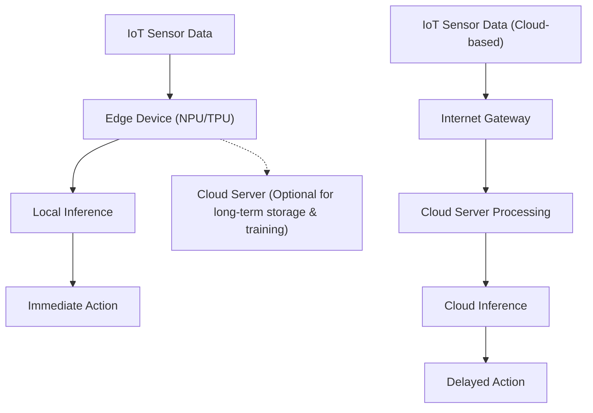
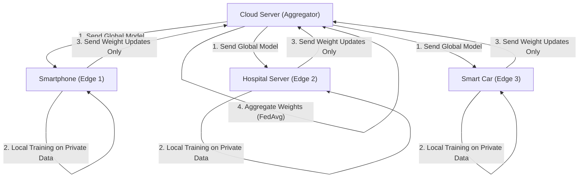

# Edge AIの未来とIoTデバイスへの実装アプローチ

## 1. はじめに：なぜ今、エッジAI（Edge AI）なのか？

IoT（Internet of Things）デバイスの普及により、世界中のあらゆる物理的なモノがインターネットに接続される時代となりました。センサー技術の進化とともに、デバイスから生成されるデータ量は爆発的に増加しています。従来、これらの膨大なデータはクラウドに送信され、クラウド上の強力な計算資源（巨大なGPUクラスターなど）を用いてAIモデルによる推論が行われてきました。これが「クラウドAI」の一般的なアプローチです。

しかし、すべてのデータをクラウドに送信し、クラウドで処理して結果をデバイスに送り返すというアーキテクチャには、いくつかの重大な限界が存在します。
1. **レイテンシ（遅延）の問題**：自動運転車や産業用ロボット、ドローンなど、ミリ秒単位の即時な判断が求められるシステムでは、ネットワークの通信遅延が致命的な事故につながる可能性があります。
2. **プライバシーとセキュリティ**：スマートホームの監視カメラや医療用ウェアラブルデバイスなど、個人情報や機密性の高い映像・生体データを常にクラウドへ送信し続けることは、情報漏洩やプライバシー侵害のリスクを伴います。
3. **ネットワーク帯域とコスト**：数百万台のIoTカメラから常時4Kの映像ストリームをクラウドへ送信すれば、ネットワーク帯域は枯渇し、データ転送コストとクラウドストレージコストが莫大なものになります。
4. **接続の安定性（オフライン環境）**：地下施設、海上、遠隔地の農場など、インターネット接続が不安定または存在しない環境では、クラウドへの依存はシステム全体の機能停止を意味します。

これらの課題を解決するために台頭してきたのが、**「Edge AI（エッジAI）」**です。Edge AIとは、データを生成するIoTデバイスそのもの（あるいはデバイスに極めて近いネットワークの末端＝エッジ）で、AIアルゴリズムを直接実行する技術です。これにより、データは発生源で即座に処理・分析され、クラウドへの依存を最小限に抑えながら、高速・安全・低コストなインテリジェントシステムを構築することが可能になります。

本記事では、Edge AIの基礎から、ハードウェア（NPU/TPU等）の最新動向、モデルをエッジ環境に適合させるための軽量化技術（量子化・枝刈り）、ONNX Runtimeを利用した実装手法、さらにプライバシー保護と分散学習を実現するFederated Learning（連合学習）まで、技術的な観点から非常に深く掘り下げて解説します。

---

## 2. クラウドAIとエッジAIのアーキテクチャ比較

クラウドAIとエッジAIの違いを視覚的に理解するために、以下のアーキテクチャ図を参照してください。



この図からわかるように、Edge AIのアーキテクチャではデータの発生源から推論、そしてアクション（制御）までのループがエッジデバイス内で完結しています。クラウドはあくまで学習済みモデルの配信や、長期的なデータの集約・傾向分析といった非リアルタイムな補助的役割に回ります。

### 推論レイテンシの数学的モデル

エッジとクラウドにおけるレイテンシの違いを定式化してみましょう。システム全体の推論完了までの時間 $T_{total}$ は、以下のように表されます。

**クラウドAIの場合:**
$$ T_{total} = T_{network\_up} + T_{cloud\_compute} + T_{network\_down} $$

ここで、ネットワークアップロード時間 $T_{network\_up}$ は以下の式に依存します。
$$ T_{network\_up} = \frac{D}{B} + RTT $$
($D$: 送信するデータサイズ, $B$: ネットワーク帯域幅, $RTT$: ラウンドトリップタイム)

データサイズ $D$ が大きい（高解像度画像や連続した振動データなど）場合、あるいは帯域幅 $B$ が狭い環境では、$T_{network\_up}$ が劇的に増加し、AI自体の推論速度 $T_{cloud\_compute}$ がいくら速くてもボトルネックとなります。

**Edge AIの場合:**
$$ T_{total} \approx T_{edge\_compute} $$

Edge AIではネットワーク転送を伴わないため、$T_{network\_up}$ と $T_{network\_down}$ はほぼゼロ（ローカルバスの転送のみ）になります。エッジデバイスの計算能力はクラウドに劣るため $T_{edge\_compute} > T_{cloud\_compute}$ となることが多いですが、ネットワークの遅延と通信の不確実性を排除できるため、総合的な $T_{total}$ は安定して低く保たれます。

---

## 3. エッジAIを支えるハードウェア技術

エッジデバイス上でディープラーニングモデルを高速に実行するためには、専用のハードウェアアクセラレータが不可欠です。従来のCPUによる処理では、電力消費と処理速度の観点からリアルタイムなAI推論は困難でした。ここでは、代表的なEdge AI向けハードウェアを紹介します。

### 3.1 NPU (Neural Processing Unit) と TPU (Tensor Processing Unit)
ディープラーニングの推論プロセス（特にCNN等の推論）は、大量の行列積和演算（MAC演算：Multiply-Accumulate）で構成されています。NPUやTPUは、このMAC演算を並列かつ超低消費電力で実行するために特化した専用チップ（ASIC）です。

- **Google Coral Edge TPU**:
  Googleが提供するEdge TPUは、非常に小型でありながら強力な推論能力を持つコプロセッサです。わずか2Wの消費電力で 4 TOPS (Tera Operations Per Second: 1秒間に4兆回の演算) の性能を発揮します。これにより、Raspberry Piのような軽量なSBC（シングルボードコンピュータ）にUSB接続するだけで、モバイル向けに最適化されたTensorFlow Liteモデルをリアルタイムに実行可能にします。
- **Raspberry Pi AI Kit (Hailo-8L搭載)**:
  近年リリースされたRaspberry Pi AI Kitは、Hailo社のAIアクセラレータ「Hailo-8L」を搭載しています。Hailoのアーキテクチャは、ニューラルネットワークの構造をチップのハードウェア構造にマッピングすることで、メモリへのアクセスボトルネックを解消し、最大13 TOPSという驚異的な推論性能を数ワットの電力枠内で実現しています。
- **NVIDIA Jetson シリーズ**:
  Jetson Nano, Xavier, Orinシリーズは、ARM CPUとNVIDIAの強力なGPUコアを統合したSoCです。CUDAエコシステムをそのまま利用できるため、クラウドで学習したPyTorchやTensorFlowのモデルを、TensorRTを通じてエッジにデプロイするのが非常に容易です。

### TOPSと電力効率（TOPS/W）
Edge AIハードウェアを評価する上で最も重要な指標は「TOPS/W（1ワットあたりのTOPS）」です。IoTデバイスはバッテリー駆動やPoE（Power over Ethernet）など、厳しい電力制約の下で稼働するため、単純な計算性能（TOPS）だけでなく、いかに少ない電力でAI推論を行えるかが鍵となります。

---

## 4. エッジデバイスへの実装：モデル軽量化の理論と実践

ハードウェアが進化しても、数百MB〜数GBにも及ぶ巨大な深層学習モデル（例えばGPTや大規模なResNetなど）をそのままエッジデバイスの限られたRAM（数MB〜数GB）にロードすることは不可能です。そのため、「モデルの軽量化（Model Compression）」が必須となります。代表的な手法として「量子化（Quantization）」と「枝刈り（Pruning）」を詳しく解説します。

### 4.1 モデルの量子化（Quantization）

深層学習モデルは通常、32ビット浮動小数点（FP32）で重みや活性化関数が表現されています。量子化とは、これらを16ビット（FP16）、8ビット整数（INT8）、あるいはさらに低ビットへと精度を落とす技術です。

**メモリ削減効果**:
パラメータ数を $N$ とすると、必要なメモリ量は以下のように計算されます。
$$ M_{FP32} = N \times 4 \text{ (Bytes)} $$
$$ M_{INT8} = N \times 1 \text{ (Bytes)} $$
INT8量子化により、モデルサイズとメモリ使用量を理論上 $\frac{1}{4}$ に削減できます。さらに、ハードウェア（NPU等）はINT8のMAC演算をFP32の演算に比べて数倍〜数十倍高速かつ低電力で実行できるため、推論レイテンシと消費電力の大幅な削減につながります。

**量子化の数理モデル**:
実数 $r$ （FP32）を、整数 $q$ （INT8: -128 〜 127）にマッピングするための基本的なアフィン量子化式は以下の通りです。

$$ r = S \times (q - Z) $$
$$ q = \text{round}\left( \frac{r}{S} + Z \right) $$

ここで、$S$ はスケールファクタ（Scale）、$Z$ はゼロポイント（Zero-point: 実数の0を整数型のどの値にマッピングするか）を表します。

量子化には、学習完了後のモデルを変換する **Post-Training Quantization (PTQ)** と、学習プロセス中に量子化の誤差をシミュレートしながら重みを更新する **Quantization-Aware Training (QAT)** があります。精度低下を最小限に抑えたい場合はQATが推奨されます。

### 4.2 モデルの枝刈り（Pruning）

ニューラルネットワークには、最終的な推論結果に対してほとんど影響を与えない（重要度の低い）重みが多数存在します。これらの不要な重みをゼロにする、あるいはネットワークの構造自体から削除する技術が枝刈り（Pruning）です。

**Sparsity（スパース性 / 疎性）の定義**:
$$ \text{Sparsity} (S) = \frac{N_{zero}}{N_{total}} \times 100 \text{ (\%)} $$
ここで $N_{zero}$ はゼロにされた重みの数、$N_{total}$ はモデル全体の重みの総数です。

- **非構造化枝刈り（Unstructured Pruning）**: 個々の重みを独立してゼロにする手法。Sparsityは高くなりますが、重み行列が疎行列（Sparse Matrix）になるだけであり、一般的なCPU/GPUではメモリアクセスパターンが不規則になるため、期待したほどの高速化が得られない場合があります。
- **構造化枝刈り（Structured Pruning / Channel Pruning）**: 畳み込み層のフィルタやチャネルを丸ごと削除する手法。ネットワークの次元そのものが縮小されるため、どのようなハードウェア上でも明確な推論速度の向上（Speedup）とメモリ削減効果が得られます。

推論速度の向上率 $S_{speedup}$ は、チャネル削減率 $c$ （$0 < c < 1$）に対して概ね以下のように比例します（MAC演算回数の減少に基づく）。
$$ S_{speedup} \propto \frac{1}{(1 - c)^2} $$
（※畳み込み演算の計算量は入力チャネル数と出力チャネル数の積に比例するため）

---

## 5. デプロイメントと推論エンジン：ONNX Runtimeの活用

軽量化されたモデルを実際にエッジデバイスで動かすためには、軽量かつマルチプラットフォームに対応した推論エンジンが必要です。現在、業界標準として広く使われているのが **ONNX (Open Neural Network Exchange)** と **ONNX Runtime** です。

ONNXは、PyTorchやTensorFlowなど異なるフレームワーク間でモデルを共通フォーマットで扱うための規格です。ONNX Runtimeは、このONNXモデルを様々なハードウェア上で最適に実行するためのエンジンです。

**Execution Providers (EP)** の仕組みがONNX Runtimeの強力な点です。コードを書き換えることなく、バックエンドの実行環境をCPU, CUDA (GPU), TensorRT, OpenVINO, CoreML, XNNPACKなどに切り替えることができます。

以下は、Pythonを用いたエッジデバイス上でのONNX Runtimeによる推論の基本的なコード例です。

```python
import onnxruntime as ort
import numpy as np
import time

def run_edge_inference(model_path, input_data):
    # エッジデバイスに合わせたExecution Providerの指定
    # 例: CPUの場合は 'CPUExecutionProvider'
    # Coral Edge TPUや特定のNPUが対応している場合はカスタムEPを指定
    providers = ['CPUExecutionProvider']
    
    # セッションの初期化 (モデルのロードとグラフ最適化)
    session = ort.InferenceSession(model_path, providers=providers)
    
    # モデルの入力名と入力シェイプの取得
    input_name = session.get_inputs()[0].name
    expected_shape = session.get_inputs()[0].shape
    print(f"Expected input shape: {expected_shape}")
    
    # 推論時間の計測
    start_time = time.time()
    
    # 推論の実行
    # 入力データは適切なNumpy配列 (例: np.float32 または np.int8) として渡す
    outputs = session.run(None, {input_name: input_data})
    
    latency = (time.time() - start_time) * 1000.0 # ミリ秒に変換
    print(f"Inference Latency: {latency:.2f} ms")
    
    return outputs[0]

# ダミー入力データ (例: 224x224のRGB画像バッチサイズ1)
dummy_input = np.random.randn(1, 3, 224, 224).astype(np.float32)
# run_edge_inference("lightweight_model.onnx", dummy_input)
```

このコードをベースに、C++等のより低レイテンシな言語に移植することで、エッジデバイスにおけるハードウェアの性能を極限まで引き出すことが可能です。

---

## 6. プライバシー保護と分散学習：フェデレーテッド・ラーニング（Federated Learning）

Edge AIの究極の進化形の一つが、モデルの「推論」だけでなく「学習」までもエッジに分散させる **Federated Learning（連合学習）** です。

従来の機械学習では、すべてのIoTデバイスから生データ（映像、音声、ログなど）をクラウドに集約し、一括でモデルを学習させていました。しかし、個人のスマートフォンや医療機器のデータをクラウドに集約することは、深刻なプライバシーリスクを伴います。

Federated Learningはこの問題をエレガントに解決します。



**Federated Learningのプロセス**:
1. クラウドサーバー（アグリゲーター）が、初期化された「グローバルモデル」を各エッジデバイスに配信します。
2. 各エッジデバイスは、自身の内部に保存されている**機密データを外部に一切出さずに**、そのデータを用いてグローバルモデルをローカルで学習（ファインチューニング）します。
3. エッジデバイスは、学習によって得られた「モデルの重みの更新量（勾配）」のみをクラウドに送信します。生データは決してデバイスから離れません。
4. クラウドは集まった多数のデバイスからの重みの更新量を平均化し、新たなグローバルモデルを生成します。

**Federated Averaging (FedAvg) の数理モデル**:
最も代表的な集約アルゴリズムであるFedAvgの更新式は以下のようになります。
全体で $K$ 個のクライアントが存在し、各クライアント $k$ が $n_k$ 個のデータサンプルを持っているとします。全体のデータ総数を $N = \sum_{k=1}^{K} n_k$ としたとき、次ラウンドのグローバルモデルの重み $w_{t+1}$ は次のように計算されます。

$$ w_{t+1} = \sum_{k=1}^{K} \frac{n_k}{N} w_{t+1}^k $$

ここで $w_{t+1}^k$ は、クライアント $k$ が自身のローカルデータを用いて学習した更新後の重みです。このようにデータ数に応じた加重平均をとることで、プライバシーを完全に保護しつつ、全デバイスのデータを集約して学習したかのような高性能なモデルを構築できます。

---

## 7. IoTデバイスへの実装ユースケース

Edge AIはすでに様々な産業で実用化され、劇的なパラダイムシフトを引き起こしています。

### 7.1 スマートマニュファクチャリングと予知保全 (Predictive Maintenance)
工場の生産ラインにおけるモーターやタービンの振動・音響データを常にエッジデバイス（PLCやエッジサーバー）で監視します。数ミリ秒の周期でサンプリングされる振動データをクラウドに送り続けることは不可能ですが、エッジAIを用いれば、異常の兆候（異常検知モデルによるアノマリー検出）をリアルタイムに検知し、機械が致命的な故障を起こす直前にラインを緊急停止させることが可能です。

### 7.2 スマート農業 (Smart Agriculture)
広大な農地では通信インフラが脆弱であることが多いため、エッジAIが不可欠です。ドローンに搭載された軽量な物体検出モデル（YOLOv8 nanoなど）が、空撮映像からリアルタイムに害虫や病気の葉を特定します。特定された座標データのみを送信するか、連動した散布ドローンがその場でピンポイントに農薬を散布することで、農薬の使用量を劇的に削減します。

### 7.3 医療用ウェアラブルデバイス
スマートウォッチやポータブル心電計（ECG）において、着用者の心拍データから不整脈（心房細動など）の兆候をエッジデバイス単体で検出します。医療データは極めて機密性が高いため、クラウドにアップロードすることなくデバイス内で推論が完結するEdge AIは、HIPAA等の厳しい医療プライバシー規制をクリアするための鍵となります。

---

## 8. エッジAIの課題と未来の展望

Edge AIの技術は急速に発展していますが、まだ多くの課題と興味深い未来の展望が存在します。

**1. エッジでのLLM（大規模言語モデル）の稼働**:
近年最大のトピックは、生成AIやLLMをエッジで動かす「Edge LLM」の試みです。数百億パラメータのモデルをそのままエッジに乗せることは不可能ですが、llama.cppのような最適化フレームワークや、4ビット/2ビットの極限までの量子化（AWQ, GPTQ等）、さらにはMicrosoftのPhi-3などの小型で高性能なSLM（Small Language Models）の登場により、スマートフォンやRaspberry Pi上でも自然言語処理がオフラインで完結する時代が到来しつつあります。

**2. ニューロモルフィック・コンピューティングとSNN**:
究極の省電力Edge AIとして期待されているのが、人間の脳の神経回路の働きを物理的に模倣した「ニューロモルフィックチップ（例: Intel Loihi）」と「スパイキング・ニューラル・ネットワーク（SNN）」です。SNNは、データが変化したタイミング（スパイク）でのみ計算が行われるイベント駆動型であるため、従来のディープラーニングモデルと比較して消費電力を桁違いに（数十分の1から数百分の一まで）抑えることが理論上可能とされています。

**3. MLOpsならぬEdgeOpsの確立**:
数千〜数万台に及ぶ世界中に散らばったエッジデバイスに対し、どのように安全にモデルのアップデート（OTA: Over-The-Airアップデート）を配信し、稼働中のモデルの精度劣化（データドリフト）を監視するかという運用の課題です。デバイスごとにハードウェアアーキテクチャが異なるヘテロジニアスな環境におけるデプロイメントの自動化は、今後最も需要が高まるエンジニアリング領域です。

---

## 9. おわりに

Edge AIは、単なる「クラウドの補完技術」という位置づけから、IoTシステム全体のアーキテクチャを決定づける中核技術へと進化しました。推論レイテンシの極小化、プライバシー保護の徹底、通信帯域とクラウドコストの大幅な削減など、Edge AIがもたらす恩恵は計り知れません。

モデルの量子化や枝刈りといったソフトウェア側の軽量化技術と、NPUやTPU、Hailoといったハードウェア側の驚異的な進化が両輪となって、かつてはスーパーコンピュータが必要だったディープラーニングモデルが、今や私たちの手のひらにあるデバイスで数ミリワットの電力で動くようになっています。

さらに、Federated Learningのような分散学習アプローチや、Edgeでの生成AI（SLM）の稼働など、技術のフロンティアは急速に広がっています。エンジニアやアーキテクトにとって、クラウドの巨大なリソースに頼るだけでなく、「いかに限られたリソースのエッジで最大のインテリジェンスを発揮させるか」を追求することは、今後最も挑戦的でエキサイティングな課題となるでしょう。

物理世界とデジタル世界が融合するIoTの最前線において、Edge AIは間違いなく未来を牽引する中枢神経系となるはずです。

---
*この記事は、IoTデバイスへのAI実装に関心を持つエンジニアおよびシステムアーキテクト向けに作成されました。*

