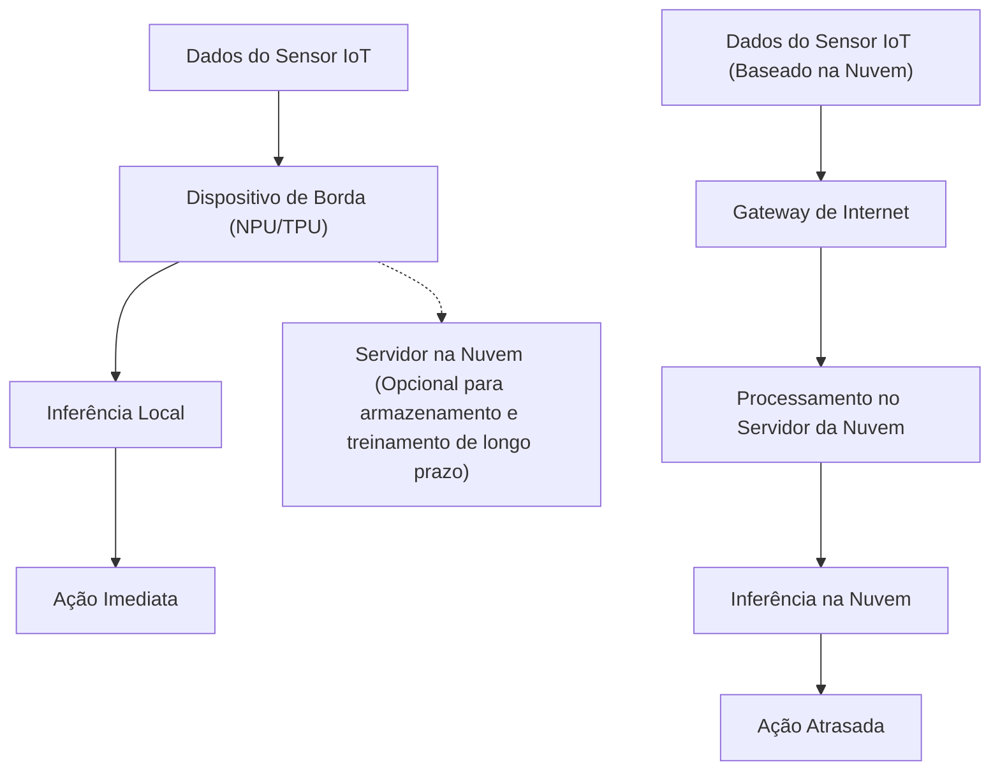
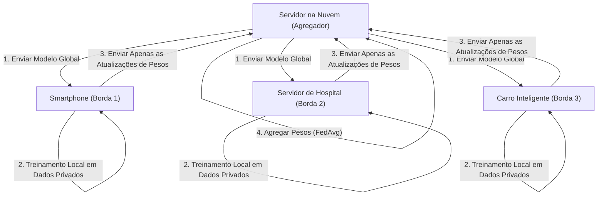

# O Futuro da Edge AI e Abordagens de Implementação para Dispositivos IoT

## 1. Introdução: Por que Edge AI (Inteligência Artificial na Borda) agora?

Com a disseminação dos dispositivos IoT (Internet of Things - Internet das Coisas), entramos em uma era onde todos os objetos físicos ao redor do mundo estão conectados à internet. Junto com a evolução da tecnologia de sensores, o volume de dados gerado por dispositivos aumentou de forma explosiva. Tradicionalmente, esses vastos dados eram enviados para a nuvem, e a inferência por modelos de IA era realizada usando os poderosos recursos computacionais da nuvem (como enormes clusters de GPU). Essa é a abordagem comum da "Cloud AI" (IA na Nuvem).

No entanto, a arquitetura de enviar todos os dados para a nuvem, processá-los na nuvem e enviar os resultados de volta para o dispositivo apresenta algumas limitações críticas:
1. **Problemas de Latência**: Em sistemas que exigem decisões instantâneas em milissegundos, como carros autônomos, robôs industriais e drones, a latência de comunicação da rede pode levar a acidentes fatais.
2. **Privacidade e Segurança**: Enviar continuamente dados pessoais ou informações altamente sensíveis, como vídeos de câmeras de segurança de casas inteligentes ou dados biométricos de dispositivos vestíveis médicos, para a nuvem traz riscos de vazamento de informações e violação de privacidade.
3. **Largura de Banda da Rede e Custos**: Se milhões de câmeras IoT enviarem continuamente streams de vídeo em 4K para a nuvem, a largura de banda da rede se esgotará e os custos de transferência de dados e armazenamento na nuvem serão enormes.
4. **Estabilidade da Conexão (Ambientes Offline)**: Em ambientes onde a conexão com a internet é instável ou inexistente, como instalações subterrâneas, no mar ou em fazendas remotas, a dependência da nuvem significa uma paralisação de todo o sistema.

Para resolver esses desafios, a **"Edge AI" (IA na Borda)** ganhou destaque. Edge AI é a tecnologia que executa algoritmos de IA diretamente nos próprios dispositivos IoT que geram os dados (ou no extremo da rede, muito próximo ao dispositivo, ou seja, na borda). Com isso, os dados são processados e analisados instantaneamente na fonte, minimizando a dependência da nuvem, e tornando possível construir sistemas inteligentes rápidos, seguros e de baixo custo.

Neste artigo, aprofundaremos muito do ponto de vista técnico, desde os fundamentos da Edge AI, as últimas tendências em hardware (NPU/TPU, etc.), técnicas de otimização (quantização, poda) para adaptar modelos a ambientes de borda, métodos de implementação usando o ONNX Runtime, até o Federated Learning (Aprendizado Federado), que possibilita a proteção da privacidade e o aprendizado distribuído.

---

## 2. Comparação de Arquitetura: Cloud AI vs Edge AI

Para entender visualmente a diferença entre Cloud AI e Edge AI, consulte o diagrama de arquitetura abaixo.



Como pode ser visto neste diagrama, na arquitetura da Edge AI, o loop desde a fonte de dados até a inferência e a ação (controle) é concluído dentro do dispositivo de borda. A nuvem serve apenas para um papel auxiliar não em tempo real, como a distribuição de modelos já treinados ou a agregação de dados e análise de tendências de longo prazo.

### Modelo Matemático da Latência de Inferência

Vamos formular a diferença de latência entre a borda e a nuvem. O tempo até a conclusão da inferência de todo o sistema, $T_{total}$, é expresso da seguinte forma.

**No caso da Cloud AI:**
$$ T_{total} = T_{network\_up} + T_{cloud\_compute} + T_{network\_down} $$

Aqui, o tempo de upload na rede $T_{network\_up}$ depende da seguinte fórmula:
$$ T_{network\_up} = \frac{D}{B} + RTT $$
($D$: Tamanho dos dados enviados, $B$: Largura de banda da rede, $RTT$: Tempo de ida e volta)

Quando o tamanho dos dados $D$ é grande (como imagens de alta resolução ou dados de vibração contínuos) ou em ambientes onde a largura de banda $B$ é estreita, o $T_{network\_up}$ aumenta dramaticamente e se torna o gargalo, não importa o quão rápida seja a velocidade de inferência da própria IA, $T_{cloud\_compute}$.

**No caso da Edge AI:**
$$ T_{total} \approx T_{edge\_compute} $$

Como a Edge AI não envolve transferência pela rede, $T_{network\_up}$ e $T_{network\_down}$ tornam-se quase zero (apenas transferência do barramento local). Como a capacidade de computação dos dispositivos de borda é inferior à da nuvem, muitas vezes temos $T_{edge\_compute} > T_{cloud\_compute}$, mas como a latência da rede e a incerteza da comunicação podem ser eliminadas, o $T_{total}$ geral é mantido estavelmente baixo.

---

## 3. Tecnologias de Hardware que Suportam a Edge AI

Para executar modelos de aprendizado profundo (deep learning) em alta velocidade em dispositivos de borda, aceleradores de hardware dedicados são indispensáveis. Com o processamento convencional via CPU, a inferência de IA em tempo real era difícil do ponto de vista do consumo de energia e da velocidade de processamento. Aqui, apresentamos hardware representativo para Edge AI.

### 3.1 NPU (Unidade de Processamento Neural) e TPU (Unidade de Processamento de Tensor)
O processo de inferência do aprendizado profundo (especialmente a inferência de CNNs, etc.) é composto por uma quantidade massiva de operações de multiplicação-acumulação de matrizes (MAC: Multiply-Accumulate). As NPUs e TPUs são chips dedicados (ASICs) especializados em executar essas operações MAC em paralelo e com consumo de energia ultrabaixo.

- **Google Coral Edge TPU**:
  A Edge TPU oferecida pelo Google é um coprocessador muito compacto, porém com forte capacidade de inferência. Com apenas 2W de consumo de energia, ele oferece um desempenho de 4 TOPS (Tera Operations Per Second: 4 trilhões de operações por segundo). Isso permite que modelos do TensorFlow Lite otimizados para dispositivos móveis sejam executados em tempo real simplesmente conectando-os via USB a SBCs (Computadores de Placa Única) leves, como o Raspberry Pi.
- **Raspberry Pi AI Kit (equipado com Hailo-8L)**:
  O recentemente lançado Raspberry Pi AI Kit é equipado com o acelerador de IA "Hailo-8L" da Hailo. A arquitetura da Hailo elimina gargalos de acesso à memória mapeando a estrutura da rede neural para a estrutura de hardware do chip, alcançando um incrível desempenho de inferência de até 13 TOPS dentro de um limite de energia de alguns watts.
- **Série NVIDIA Jetson**:
  As séries Jetson Nano, Xavier e Orin são SoCs que integram CPUs ARM e os poderosos núcleos de GPU da NVIDIA. Como o ecossistema CUDA pode ser usado como está, é muito fácil implantar na borda modelos PyTorch ou TensorFlow treinados na nuvem através do TensorRT.

### TOPS e Eficiência Energética (TOPS/W)
A métrica mais importante ao avaliar hardwares de Edge AI é "TOPS/W (TOPS por watt)". Como os dispositivos IoT operam sob restrições estritas de energia, como alimentação por bateria ou PoE (Power over Ethernet), a chave não é apenas o desempenho computacional simples (TOPS), mas o quão pouca energia é usada para realizar a inferência de IA.

---

## 4. Implementação em Dispositivos de Borda: Teoria e Prática da Otimização de Modelos

Mesmo com a evolução do hardware, é impossível carregar modelos enormes de aprendizado profundo (por exemplo, GPT ou ResNet de grande escala) que variam de centenas de MB a vários GB diretamente na memória RAM limitada (alguns MB a alguns GB) dos dispositivos de borda. Portanto, a "Otimização de Modelos" (Model Compression) é essencial. Explicaremos detalhadamente as "Quantização" (Quantization) e a "Poda" (Pruning) como métodos representativos.

### 4.1 Quantização de Modelos (Quantization)

Os modelos de aprendizado profundo geralmente têm seus pesos e funções de ativação representados em ponto flutuante de 32 bits (FP32). A quantização é a tecnologia que reduz a precisão desses valores para 16 bits (FP16), inteiros de 8 bits (INT8) ou bits ainda mais baixos.

**Efeito de Redução de Memória**:
Se o número de parâmetros for $N$, a quantidade de memória necessária é calculada da seguinte forma.
$$ M_{FP32} = N \times 4 \text{ (Bytes)} $$
$$ M_{INT8} = N \times 1 \text{ (Bytes)} $$
A quantização INT8 pode teoricamente reduzir o tamanho do modelo e o uso de memória para $\frac{1}{4}$. Além disso, como o hardware (como as NPUs) pode executar operações MAC INT8 várias vezes a dezenas de vezes mais rápido e com menos energia em comparação com operações FP32, isso leva a uma redução significativa na latência de inferência e no consumo de energia.

**Modelo Matemático de Quantização**:
A fórmula básica de quantização afim para mapear o número real $r$ (FP32) para o inteiro $q$ (INT8: -128 a 127) é a seguinte.

$$ r = S \times (q - Z) $$
$$ q = \text{round}\left( \frac{r}{S} + Z \right) $$

Aqui, $S$ representa o fator de escala (Scale) e $Z$ é o ponto zero (Zero-point: para qual valor inteiro o 0 dos números reais é mapeado).

Para quantização, há o **Post-Training Quantization (PTQ)**, que converte o modelo após a conclusão do treinamento, e o **Quantization-Aware Training (QAT)**, que atualiza os pesos enquanto simula o erro de quantização durante o processo de treinamento. O QAT é recomendado caso queira minimizar a queda na precisão.

### 4.2 Poda de Modelos (Pruning)

As redes neurais possuem muitos pesos que quase não têm efeito sobre o resultado final da inferência (pesos de baixa importância). A poda (Pruning) é a tecnologia que zera esses pesos desnecessários ou os remove da própria estrutura da rede.

**Definição de Sparsity (Esparsidade)**:
$$ \text{Sparsity} (S) = \frac{N_{zero}}{N_{total}} \times 100 \text{ (\%)} $$
Onde $N_{zero}$ é o número de pesos zerados e $N_{total}$ é o número total de pesos em todo o modelo.

- **Poda Não Estruturada (Unstructured Pruning)**: Método que zera pesos individuais de forma independente. A esparsidade torna-se alta, mas a matriz de pesos apenas se torna uma matriz esparsa (Sparse Matrix), e em CPUs/GPUs comuns o padrão de acesso à memória torna-se irregular, portanto a aceleração esperada pode não ser obtida.
- **Poda Estruturada (Structured Pruning / Channel Pruning)**: Método que remove inteiramente filtros ou canais das camadas convolucionais. Como a própria dimensão da rede é reduzida, melhorias claras na velocidade de inferência (Speedup) e na redução de memória são obtidas em qualquer hardware.

A taxa de melhoria na velocidade de inferência, $S_{speedup}$, é aproximadamente proporcional à taxa de redução de canal $c$ ($0 < c < 1$) da seguinte maneira (com base na redução do número de operações MAC).
$$ S_{speedup} \propto \frac{1}{(1 - c)^2} $$
(*Como o custo computacional das operações de convolução é proporcional ao produto do número de canais de entrada e de saída*)

---

## 5. Implantação e Motor de Inferência: Utilização do ONNX Runtime

Para executar de fato os modelos otimizados em dispositivos de borda, é necessário um motor de inferência leve que suporte múltiplas plataformas. Atualmente, os padrões amplamente utilizados na indústria são o **ONNX (Open Neural Network Exchange)** e o **ONNX Runtime**.

O ONNX é um padrão para lidar com modelos em um formato comum entre diferentes frameworks, como PyTorch e TensorFlow. O ONNX Runtime é o motor para executar esses modelos ONNX de forma ideal em vários hardwares.

O mecanismo de **Execution Providers (EP)** é a força do ONNX Runtime. Sem reescrever o código, você pode alternar o ambiente de execução do backend para CPU, CUDA (GPU), TensorRT, OpenVINO, CoreML, XNNPACK, etc.

Abaixo está um exemplo básico de código para inferência pelo ONNX Runtime em um dispositivo de borda usando Python.

```python
import onnxruntime as ort
import numpy as np
import time

def run_edge_inference(model_path, input_data):
    # Especificação do Execution Provider adequado ao dispositivo de borda
    # Ex: Para CPU é 'CPUExecutionProvider'
    # Se o Coral Edge TPU ou uma NPU específica for compatível, especifique um EP personalizado
    providers = ['CPUExecutionProvider']
    
    # Inicialização da sessão (carregamento do modelo e otimização de grafo)
    session = ort.InferenceSession(model_path, providers=providers)
    
    # Obtenção do nome e forma da entrada do modelo
    input_name = session.get_inputs()[0].name
    expected_shape = session.get_inputs()[0].shape
    print(f"Formato de entrada esperado: {expected_shape}")
    
    # Medição do tempo de inferência
    start_time = time.time()
    
    # Execução da inferência
    # Os dados de entrada são passados como um array Numpy adequado (ex: np.float32 ou np.int8)
    outputs = session.run(None, {input_name: input_data})
    
    latency = (time.time() - start_time) * 1000.0 # Converter para milissegundos
    print(f"Latência da inferência: {latency:.2f} ms")
    
    return outputs[0]

# Dados de entrada simulados (ex: Imagem RGB 224x224, batch size 1)
dummy_input = np.random.randn(1, 3, 224, 224).astype(np.float32)
# run_edge_inference("lightweight_model.onnx", dummy_input)
```

Ao portar este código para linguagens de latência mais baixa, como C++, é possível extrair ao máximo o desempenho do hardware no dispositivo de borda.

---

## 6. Proteção de Privacidade e Aprendizado Distribuído: Federated Learning (Aprendizado Federado)

Uma das formas definitivas de evolução da Edge AI é o **Federated Learning (Aprendizado Federado)**, que distribui não apenas a "inferência", mas também o "treinamento" do modelo para a borda.

No aprendizado de máquina convencional, os dados brutos (vídeo, áudio, logs, etc.) de todos os dispositivos IoT eram agregados na nuvem e o modelo era treinado de uma só vez. No entanto, agregar os dados de smartphones pessoais e equipamentos médicos na nuvem envolve sérios riscos de privacidade.

O Federated Learning resolve esse problema de forma elegante.



**Processo do Federated Learning**:
1. O servidor na nuvem (agregador) distribui o "modelo global" inicializado para cada dispositivo de borda.
2. Cada dispositivo de borda treina localmente (fine-tuning) o modelo global usando os dados confidenciais armazenados em si, **sem expor nenhum desses dados para o exterior**.
3. O dispositivo de borda envia apenas as "quantidades de atualização dos pesos (gradientes)" do modelo obtidas pelo aprendizado para a nuvem. Os dados brutos nunca saem do dispositivo.
4. A nuvem calcula a média das atualizações de pesos vindas de vários dispositivos e gera um novo modelo global.

**Modelo Matemático do Federated Averaging (FedAvg)**:
A fórmula de atualização do FedAvg, o algoritmo de agregação mais representativo, é a seguinte.
Supondo que existam $K$ clientes no total, e cada cliente $k$ tenha $n_k$ amostras de dados. Assumindo que o número total de dados seja $N = \sum_{k=1}^{K} n_k$, o peso do modelo global para a próxima rodada, $w_{t+1}$, é calculado da seguinte forma:

$$ w_{t+1} = \sum_{k=1}^{K} \frac{n_k}{N} w_{t+1}^k $$

Aqui, $w_{t+1}^k$ é o peso atualizado pelo aprendizado do cliente $k$ usando seus dados locais. Calculando a média ponderada com base na quantidade de dados desta forma, é possível construir um modelo de alto desempenho, como se tivesse sido treinado agregando os dados de todos os dispositivos, enquanto protege completamente a privacidade.

---

## 7. Casos de Uso de Implementação em Dispositivos IoT

A Edge AI já foi colocada em uso prático em várias indústrias e causou mudanças drásticas de paradigma.

### 7.1 Manufatura Inteligente e Manutenção Preditiva (Predictive Maintenance)
Os dados de vibração e acústica de motores e turbinas nas linhas de produção de fábricas são monitorados constantemente por dispositivos de borda (CLPs ou servidores de borda). É impossível continuar enviando dados de vibração amostrados a cada poucos milissegundos para a nuvem, mas usando Edge AI, é possível detectar sinais de anomalias em tempo real (detecção de anomalias usando modelos apropriados) e fazer uma parada de emergência na linha pouco antes de a máquina sofrer uma falha fatal.

### 7.2 Agricultura Inteligente (Smart Agriculture)
Como as infraestruturas de comunicação costumam ser frágeis em vastas terras agrícolas, a Edge AI é indispensável. Modelos leves de detecção de objetos (como o YOLOv8 nano) montados em drones identificam pragas e folhas doentes em tempo real a partir de imagens aéreas. Apenas os dados de coordenadas identificadas são transmitidos ou drones de pulverização sincronizados aplicam pesticidas diretamente no local, reduzindo drasticamente a quantidade de agrotóxicos usada.

### 7.3 Dispositivos Vestíveis Médicos
Em smartwatches e eletrocardiogramas (ECG) portáteis, os sinais de arritmias (como fibrilação atrial) são detectados a partir dos dados de frequência cardíaca do usuário apenas pelo dispositivo de borda. Como os dados médicos são altamente confidenciais, a Edge AI, onde a inferência é concluída dentro do dispositivo sem o upload para a nuvem, é essencial para atender a rígidas regulamentações de privacidade médica, como a HIPAA.

---

## 8. Desafios e Perspectivas Futuras da Edge AI

A tecnologia de Edge AI está evoluindo rapidamente, mas ainda existem muitos desafios e perspectivas futuras interessantes.

**1. Operação de LLMs (Grandes Modelos de Linguagem) na Borda**:
O maior tópico dos últimos anos é a tentativa da "Edge LLM", de rodar IAs generativas e LLMs na borda. Embora seja impossível colocar modelos com dezenas de bilhões de parâmetros na borda como estão, com a chegada de frameworks de otimização como o llama.cpp, a quantização extrema para 4 bits/2 bits (AWQ, GPTQ, etc.) e o surgimento de SLMs (Pequenos Modelos de Linguagem) compactos e de alto desempenho como o Phi-3 da Microsoft, está chegando a era em que o processamento de linguagem natural também será realizado offline em smartphones e Raspberry Pis.

**2. Computação Neuromórfica e SNNs**:
A expectativa como a Edge AI definitiva em economia de energia recai sobre o "chip neuromórfico (ex: Intel Loihi)" e as "Redes Neurais de Disparo (Spiking Neural Networks - SNN)", que imitam fisicamente as funções dos circuitos neurais do cérebro humano. Como as SNNs são orientadas a eventos, onde a computação é realizada apenas quando os dados mudam (disparos/spikes), teoricamente é possível reduzir drasticamente o consumo de energia em comparação com modelos convencionais de aprendizado profundo (variando de dezenas a centenas de vezes menos).

**3. Estabelecimento do EdgeOps em vez de MLOps**:
Trata-se de um desafio operacional: como distribuir atualizações de modelos de forma segura (OTA: Over-The-Air) para milhares a dezenas de milhares de dispositivos de borda espalhados pelo mundo e como monitorar a degradação de precisão (data drift) dos modelos em operação. A automação da implantação em um ambiente heterogêneo, onde cada dispositivo tem uma arquitetura de hardware diferente, é a área de engenharia que experimentará a maior demanda no futuro.

---

## 9. Conclusão

A Edge AI evoluiu da sua posição de uma mera "tecnologia complementar à nuvem" para a tecnologia central que determina toda a arquitetura dos sistemas IoT. Os benefícios que a Edge AI traz, como minimização da latência de inferência, forte proteção de privacidade e grandes reduções na largura de banda de comunicação e custos da nuvem, são imensuráveis.

As tecnologias de otimização no lado do software, como a quantização e a poda de modelos, e as espantosas evoluções do lado do hardware, como NPUs, TPUs e Hailo, tornaram-se as duas engrenagens dessa engrenagem principal. Modelos de deep learning que antes exigiam supercomputadores agora funcionam em dispositivos que cabem na palma das nossas mãos, usando apenas alguns miliwatts de energia.

Além disso, a fronteira tecnológica está se expandindo rapidamente, com abordagens de aprendizado distribuído como o Federated Learning e a operação de IAs generativas (SLMs) na borda. Para engenheiros e arquitetos, além de depender dos vastos recursos da nuvem, buscar "como extrair o máximo de inteligência na borda com recursos limitados" será o desafio mais desafiador e empolgante no futuro.

Na linha de frente da IoT, onde o mundo físico se funde com o mundo digital, a Edge AI será sem dúvida o sistema nervoso central conduzindo o futuro.

---
*Este artigo foi criado para engenheiros e arquitetos de sistemas interessados na implementação de IA em dispositivos IoT.*

