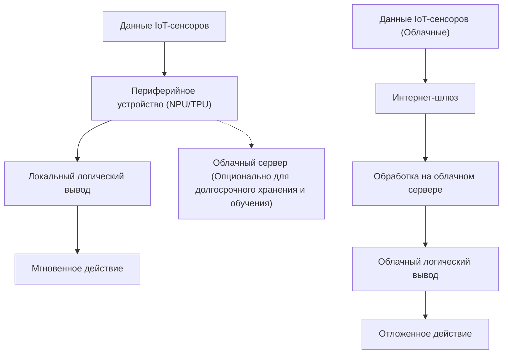
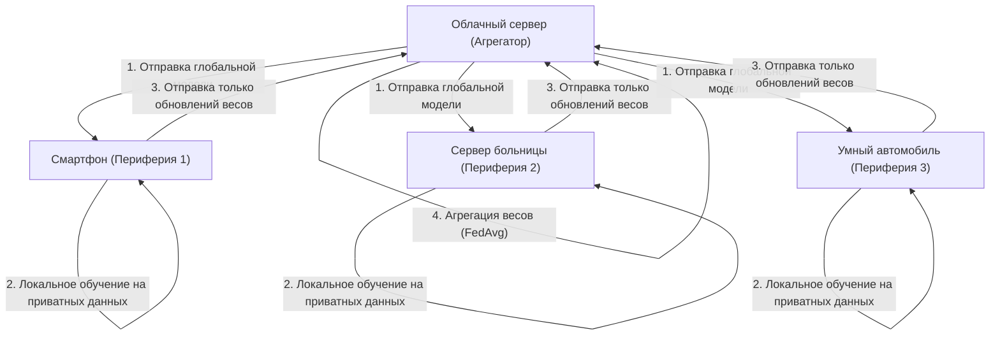

# Будущее Edge AI и подходы к внедрению в устройства IoT

## 1. Введение: Почему именно сейчас Edge AI (периферийный ИИ)?

С распространением устройств IoT (интернета вещей) наступила эпоха, когда любые физические объекты по всему миру подключены к интернету. Вместе с развитием сенсорных технологий объем данных, генерируемых устройствами, стремительно возрастает. Традиционно эти огромные массивы данных отправляются в облако, где с использованием мощных вычислительных ресурсов (например, огромных кластеров GPU) выполняется логический вывод (инференс) с помощью ИИ-моделей. Это стандартный подход «облачного ИИ».

Однако архитектура, при которой все данные отправляются в облако, обрабатываются там, а результаты возвращаются на устройство, имеет ряд серьезных ограничений.
1. **Проблема задержки (Latency)**: В системах, где требуются мгновенные решения за миллисекунды, таких как беспилотные автомобили, промышленные роботы или дроны, задержки связи в сети могут привести к фатальным авариям.
2. **Конфиденциальность и безопасность**: Постоянная отправка в облако личной информации и конфиденциальных видео- и биометрических данных (например, с камер наблюдения умного дома или медицинских носимых устройств) сопряжена с рисками утечки информации и нарушения конфиденциальности.
3. **Пропускная способность сети и затраты**: Если миллионы IoT-камер будут постоянно передавать 4K-видеопотоки в облако, пропускная способность сети исчерпается, а затраты на передачу данных и облачное хранение станут колоссальными.
4. **Стабильность соединения (работа офлайн)**: В средах, где подключение к интернету нестабильно или отсутствует (например, подземные сооружения, море, отдаленные фермы), зависимость от облака означает остановку работы всей системы.

Для решения этих проблем и появился **«Edge AI» (периферийный ИИ)**. Edge AI — это технология, при которой алгоритмы ИИ выполняются непосредственно на самих IoT-устройствах, генерирующих данные (или на самых краях сети, предельно близких к устройствам — edge). Благодаря этому данные мгновенно обрабатываются и анализируются в месте их возникновения, что позволяет создавать высокоскоростные, безопасные и недорогие интеллектуальные системы, сводя к минимуму зависимость от облака.

В этой статье мы глубоко и с технической точки зрения рассмотрим основы Edge AI, последние тенденции в области аппаратного обеспечения (NPU/TPU и т.д.), методы сжатия моделей (квантование и прунинг) для их адаптации к периферийной среде, подходы к внедрению с использованием ONNX Runtime, а также федеративное обучение (Federated Learning), обеспечивающее защиту конфиденциальности и распределенное обучение.

---

## 2. Сравнение архитектур облачного и периферийного ИИ

Чтобы визуально понять разницу между облачным и периферийным ИИ, обратите внимание на следующую архитектурную схему.



Как видно из этой схемы, в архитектуре Edge AI цикл от источника данных до логического вывода и действия (управления) замыкается внутри периферийного устройства. Облаку отводится лишь вспомогательная не в реальном времени роль: доставка обученных моделей и долгосрочный сбор и анализ трендов данных.

### Математическая модель задержки логического вывода

Давайте формализуем разницу в задержках между периферией и облаком. Время до завершения логического вывода всей системы $T_{total}$ выражается следующим образом.

**В случае облачного ИИ:**
$$ T_{total} = T_{network\_up} + T_{cloud\_compute} + T_{network\_down} $$

Здесь время загрузки по сети $T_{network\_up}$ зависит от следующей формулы:
$$ T_{network\_up} = \frac{D}{B} + RTT $$
($D$: размер отправляемых данных, $B$: пропускная способность сети, $RTT$: время приема-передачи)

Если размер данных $D$ велик (например, изображения высокого разрешения или непрерывные данные вибрации) или в среде с узкой пропускной способностью $B$, $T_{network\_up}$ резко возрастает и становится узким местом, независимо от того, насколько высока скорость самого логического вывода ИИ $T_{cloud\_compute}$.

**В случае Edge AI:**
$$ T_{total} \approx T_{edge\_compute} $$

Поскольку Edge AI не предполагает передачу по сети, $T_{network\_up}$ и $T_{network\_down}$ становятся почти равными нулю (только передача по локальной шине). Хотя вычислительная мощность периферийных устройств уступает облачной, из-за чего $T_{edge\_compute} > T_{cloud\_compute}$, полное устранение сетевых задержек и неопределенностей связи позволяет стабильно поддерживать общий показатель $T_{total}$ на низком уровне.

---

## 3. Аппаратные технологии, лежащие в основе Edge AI

Для быстрого выполнения моделей глубокого обучения на периферийных устройствах необходимы специализированные аппаратные ускорители. Традиционная обработка на базе CPU не позволяет осуществлять логический вывод ИИ в реальном времени с точки зрения энергопотребления и скорости. Здесь мы представим типичное аппаратное обеспечение для Edge AI.

### 3.1 NPU (Neural Processing Unit) и TPU (Tensor Processing Unit)
Процесс логического вывода в глубоком обучении (особенно для сверточных нейросетей) состоит из огромного количества операций умножения с накоплением (MAC-операции: Multiply-Accumulate). NPU и TPU — это специализированные чипы (ASIC), предназначенные для параллельного выполнения этих MAC-операций со сверхнизким энергопотреблением.

- **Google Coral Edge TPU**:
  Edge TPU от Google — это сопроцессор, который, несмотря на свои крошечные размеры, обладает мощными возможностями инференса. При потребляемой мощности всего 2 Вт он обеспечивает производительность 4 TOPS (Тера-операций в секунду: 4 триллиона операций в секунду). Это позволяет в реальном времени выполнять модели TensorFlow Lite, оптимизированные для мобильных устройств, просто подключив его по USB к легкому одноплатному компьютеру (SBC), такому как Raspberry Pi.
- **Raspberry Pi AI Kit (с Hailo-8L)**:
  Недавно выпущенный Raspberry Pi AI Kit оснащен ИИ-ускорителем «Hailo-8L» от компании Hailo. Архитектура Hailo устраняет узкое место доступа к памяти путем отображения структуры нейронной сети на аппаратную структуру чипа, достигая поразительной производительности логического вывода до 13 TOPS в рамках энергопотребления в несколько ватт.
- **Серия NVIDIA Jetson**:
  Серии Jetson Nano, Xavier, и Orin — это системы на кристалле (SoC), объединяющие CPU ARM и мощные ядра GPU NVIDIA. Поскольку можно использовать экосистему CUDA "как есть", развертывание на периферии моделей PyTorch или TensorFlow, обученных в облаке, через TensorRT становится чрезвычайно простым.

### TOPS и энергоэффективность (TOPS/W)
Самым важным показателем при оценке аппаратного обеспечения Edge AI является «TOPS/W» (TOPS на один ватт). Поскольку устройства IoT работают в условиях жестких ограничений по питанию (работа от батарей или PoE - Power over Ethernet), ключом является не только чистая вычислительная производительность (TOPS), но и то, с насколько низким энергопотреблением может выполняться логический вывод ИИ.

---

## 4. Внедрение на периферийных устройствах: теория и практика облегчения моделей

Даже при развитии аппаратного обеспечения загрузка гигантских моделей глубокого обучения размером от сотен мегабайт до нескольких гигабайт (например, GPT или крупномасштабных ResNet) в ограниченную оперативную память периферийного устройства (от нескольких мегабайт до нескольких гигабайт) в первозданном виде невозможна. Поэтому «сжатие моделей» (Model Compression) является обязательным. В качестве типичных методов мы подробно рассмотрим «квантование» (Quantization) и «прунинг / обрезку» (Pruning).

### 4.1 Квантование модели (Quantization)

Модели глубокого обучения обычно представляют веса и функции активации в 32-битных числах с плавающей запятой (FP32). Квантование — это технология снижения их точности до 16 бит (FP16), 8-битных целых чисел (INT8) или даже более низкой разрядности.

**Эффект сокращения памяти**:
Если количество параметров равно $N$, то требуемый объем памяти рассчитывается следующим образом:
$$ M_{FP32} = N \times 4 \text{ (Bytes)} $$
$$ M_{INT8} = N \times 1 \text{ (Bytes)} $$
Благодаря квантованию INT8 размер модели и потребление памяти теоретически можно уменьшить в $\frac{1}{4}$ раза. Кроме того, аппаратное обеспечение (NPU и др.) может выполнять MAC-операции INT8 в несколько или даже в десятки раз быстрее и с меньшим энергопотреблением по сравнению с операциями FP32, что ведет к значительному снижению задержки логического вывода и энергопотребления.

**Математическая модель квантования**:
Базовое уравнение аффинного квантования для отображения вещественного числа $r$ (FP32) в целое число $q$ (INT8: от -128 до 127) выглядит следующим образом:

$$ r = S \times (q - Z) $$
$$ q = \text{round}\left( \frac{r}{S} + Z \right) $$

Здесь $S$ — масштабный коэффициент (Scale), а $Z$ — нулевая точка (Zero-point: значение целочисленного типа, на которое отображается вещественный ноль).

Существуют **Post-Training Quantization (PTQ)** (пост-тренировочное квантование), конвертирующее модель после завершения обучения, и **Quantization-Aware Training (QAT)** (квантование в процессе обучения), которое обновляет веса, имитируя ошибку квантования в процессе обучения. Если необходимо минимизировать потерю точности, рекомендуется использовать QAT.

### 4.2 Прунинг модели (Pruning)

В нейронных сетях существует множество весов, которые практически не влияют на итоговый результат логического вывода (имеют низкую важность). Технология обнуления этих ненужных весов или их полного удаления из структуры сети называется прунингом (обрезкой).

**Определение разреженности (Sparsity)**:
$$ \text{Sparsity} (S) = \frac{N_{zero}}{N_{total}} \times 100 \text{ (\%)} $$
Где $N_{zero}$ — количество обнуленных весов, а $N_{total}$ — общее количество весов всей модели.

- **Неструктурированный прунинг (Unstructured Pruning)**: Метод независимого обнуления отдельных весов. Разреженность повышается, но матрица весов просто становится разреженной матрицей (Sparse Matrix), и из-за нерегулярности паттернов доступа к памяти на обычных CPU/GPU не всегда удается достичь ожидаемого ускорения.
- **Структурированный прунинг (Structured Pruning / Channel Pruning)**: Метод удаления фильтров или каналов сверточных слоев целиком. Поскольку уменьшается сама размерность сети, четкое улучшение скорости логического вывода (Speedup) и эффект экономии памяти достигаются на любом аппаратном обеспечении.

Коэффициент повышения скорости инференса $S_{speedup}$ приблизительно пропорционален коэффициенту сокращения каналов $c$ ($0 < c < 1$) следующим образом (на основе уменьшения количества MAC-операций).
$$ S_{speedup} \propto \frac{1}{(1 - c)^2} $$
(*Поскольку вычислительная сложность операции свертки пропорциональна произведению количества входных и выходных каналов)

---

## 5. Развертывание и движок логического вывода: Использование ONNX Runtime

Для фактического запуска облегченной модели на периферийном устройстве требуется легкий кроссплатформенный движок логического вывода. В настоящее время в качестве отраслевого стандарта широко используются **ONNX (Open Neural Network Exchange)** и **ONNX Runtime**.

ONNX — это стандарт для работы с моделями в общем формате между различными фреймворками, такими как PyTorch и TensorFlow. ONNX Runtime — это движок для оптимального выполнения этой ONNX-модели на различном аппаратном обеспечении.

Мощь ONNX Runtime заключается в механизме **Execution Providers (EP)**. Без переписывания кода можно переключать среду выполнения бэкенда на CPU, CUDA (GPU), TensorRT, OpenVINO, CoreML, XNNPACK и другие.

Ниже приведен базовый пример кода на Python для логического вывода с использованием ONNX Runtime на периферийном устройстве.

```python
import onnxruntime as ort
import numpy as np
import time

def run_edge_inference(model_path, input_data):
    # Указание Execution Provider, соответствующего периферийному устройству
    # Пример: для CPU 'CPUExecutionProvider'
    # Если поддерживается Coral Edge TPU или определенный NPU, укажите кастомный EP
    providers = ['CPUExecutionProvider']
    
    # Инициализация сессии (загрузка модели и оптимизация графа)
    session = ort.InferenceSession(model_path, providers=providers)
    
    # Получение имени и формы входа модели
    input_name = session.get_inputs()[0].name
    expected_shape = session.get_inputs()[0].shape
    print(f"Expected input shape: {expected_shape}")
    
    # Измерение времени логического вывода
    start_time = time.time()
    
    # Выполнение логического вывода
    # Входные данные передаются как подходящий массив Numpy (например, np.float32 или np.int8)
    outputs = session.run(None, {input_name: input_data})
    
    latency = (time.time() - start_time) * 1000.0 # Преобразование в миллисекунды
    print(f"Inference Latency: {latency:.2f} ms")
    
    return outputs[0]

# Фиктивные входные данные (например, RGB изображение 224x224 с размером батча 1)
dummy_input = np.random.randn(1, 3, 224, 224).astype(np.float32)
# run_edge_inference("lightweight_model.onnx", dummy_input)
```

Взяв этот код за основу и перенеся его на языки с более низкой задержкой, такие как C++, можно выжать максимум из аппаратной производительности на периферийных устройствах.

---

## 6. Защита конфиденциальности и распределенное обучение: Федеративное обучение (Federated Learning)

Одной из высших форм эволюции Edge AI является **Federated Learning (Федеративное обучение)**, при котором на периферию распределяется не только «логический вывод», но и «обучение» модели.

В традиционном машинном обучении сырые данные (видео, аудио, логи и т.д.) со всех IoT-устройств собирались в облаке, и модель обучалась на них пакетом. Однако консолидация данных с персональных смартфонов или медицинских приборов в облаке влечет за собой серьезные риски для конфиденциальности.

Federated Learning элегантно решает эту проблему.



**Процесс федеративного обучения (Federated Learning)**:
1. Облачный сервер (агрегатор) рассылает инициализированную «глобальную модель» на все периферийные устройства.
2. Каждое периферийное устройство **без малейшего вывода конфиденциальных данных наружу** локально обучает (дообучает) глобальную модель, используя хранящиеся в нем данные.
3. Периферийное устройство отправляет в облако только «объем обновления весов модели (градиенты)», полученный в результате обучения. Сырые данные никогда не покидают устройство.
4. Облако усредняет объемы обновлений весов от множества устройств и генерирует новую глобальную модель.

**Математическая модель Federated Averaging (FedAvg)**:
Уравнение обновления для FedAvg, самого репрезентативного алгоритма агрегации, выглядит следующим образом.
Предположим, что всего существует $K$ клиентов, и каждый клиент $k$ имеет $n_k$ образцов данных. Если общее количество данных равно $N = \sum_{k=1}^{K} n_k$, то вес глобальной модели $w_{t+1}$ в следующем раунде вычисляется следующим образом:

$$ w_{t+1} = \sum_{k=1}^{K} \frac{n_k}{N} w_{t+1}^k $$

Здесь $w_{t+1}^k$ — это обновленные веса, обученные клиентом $k$ с использованием его собственных локальных данных. Таким образом, принимая средневзвешенное значение в зависимости от объема данных, можно построить высокопроизводительную модель, как если бы обучение проводилось на совокупности данных со всех устройств, при этом полностью защищая конфиденциальность.

---

## 7. Практические примеры внедрения в устройства IoT

Edge AI уже внедрен в различных отраслях и вызывает кардинальный сдвиг парадигмы.

### 7.1 Умное производство и предиктивное обслуживание (Predictive Maintenance)
Данные о вибрации и акустике двигателей и турбин на производственных линиях заводов постоянно отслеживаются периферийными устройствами (ПЛК или периферийными серверами). Невозможно непрерывно отправлять данные о вибрации, собираемые с интервалом в несколько миллисекунд, в облако. Но использование Edge AI позволяет в реальном времени обнаруживать признаки аномалий (выявление аномалий с помощью моделей обнаружения аномалий) и производить экстренную остановку линии за мгновение до того, как в машине произойдет критический сбой.

### 7.2 Умное сельское хозяйство (Smart Agriculture)
Поскольку на обширных сельскохозяйственных угодьях инфраструктура связи часто бывает уязвимой, Edge AI здесь жизненно необходим. Легковесные модели обнаружения объектов (например, YOLOv8 nano), установленные на дронах, в реальном времени идентифицируют вредителей или больные листья на аэрофотоснимках. Отправка только данных об определенных координатах или использование взаимосвязанных сельскохозяйственных дронов для точечного распыления пестицидов на месте резко сокращает количество используемых химикатов.

### 7.3 Медицинские носимые устройства
В смарт-часах или портативных электрокардиографах (ЭКГ) признаки аритмии (например, фибрилляции предсердий) выявляются из данных сердечного ритма владельца исключительно силами самого периферийного устройства. Поскольку медицинские данные крайне конфиденциальны, Edge AI, при котором логический вывод завершается внутри устройства без загрузки в облако, является ключом к соблюдению строгих норм конфиденциальности в медицине, таких как HIPAA.

---

## 8. Проблемы Edge AI и перспективы на будущее

Технологии Edge AI стремительно развиваются, однако всё еще существует множество проблем и интересных перспектив на будущее.

**1. Работа LLM (больших языковых моделей) на периферии**:
Главной темой последних лет являются попытки запустить генеративный ИИ и LLM на периферии — «Edge LLM». Загрузить модель с десятками миллиардов параметров на периферию как есть невозможно. Однако с появлением фреймворков оптимизации, таких как llama.cpp, экстремального 4-битного/2-битного квантования (AWQ, GPTQ и др.), а также небольших высокопроизводительных SLM (Small Language Models), таких как Phi-3 от Microsoft, наступает эпоха, когда обработка естественного языка полностью завершается офлайн даже на смартфонах или Raspberry Pi.

**2. Нейроморфные вычисления и SNN**:
В качестве предельно энергоэффективного Edge AI большие надежды возлагаются на «нейроморфные чипы» (например, Intel Loihi) и «импульсные нейронные сети (Spiking Neural Networks, SNN)», которые физически имитируют работу нейронных цепей человеческого мозга. Поскольку SNN работают по событийно-ориентированному принципу, выполняя вычисления только в момент изменения данных (всплеск/спайк), теоретически считается возможным снизить энергопотребление на несколько порядков (в десятки и сотни раз) по сравнению с традиционными моделями глубокого обучения.

**3. Утверждение EdgeOps (вместо MLOps)**:
Это эксплуатационная задача: как безопасно доставлять обновления моделей (OTA: Over-The-Air) на тысячи и десятки тысяч периферийных устройств, разбросанных по всему миру, и как отслеживать деградацию точности (дрейф данных) работающих моделей. Автоматизация развертывания в гетерогенной среде, где аппаратная архитектура отличается от устройства к устройству, станет наиболее востребованной инженерной областью в будущем.

---

## 9. Заключение

Edge AI эволюционировал из простой «технологии, дополняющей облако» в ключевую технологию, определяющую архитектуру систем IoT в целом. Минимизация задержек при логическом выводе, обеспечение строгой защиты конфиденциальности, значительное сокращение пропускной способности сети и затрат на облако — преимущества, которые несет Edge AI, поистине безграничны.

Технологии программного облегчения, такие как квантование и прунинг моделей, вкупе с поразительной эволюцией аппаратного обеспечения, такого как NPU, TPU и Hailo, привели к тому, что модели глубокого обучения, для которых раньше требовались суперкомпьютеры, теперь работают на устройствах, умещающихся у нас на ладони, потребляя при этом всего несколько милливатт электроэнергии.

Более того, технологические рубежи стремительно расширяются за счет подходов распределенного обучения, таких как Federated Learning, и работы генеративного ИИ (SLM) на периферии. Для инженеров и архитекторов поиск ответа на вопрос: «Как добиться максимального интеллекта на периферии с ограниченными ресурсами», не полагаясь исключительно на гигантские ресурсы облака, станет самой сложной и захватывающей задачей будущего.

На переднем крае интернета вещей, где сливаются физический и цифровой миры, Edge AI, несомненно, станет центральной нервной системой, которая будет двигать нас в будущее.

---
*Эта статья создана для инженеров и системных архитекторов, интересующихся внедрением ИИ в устройства IoT.*
