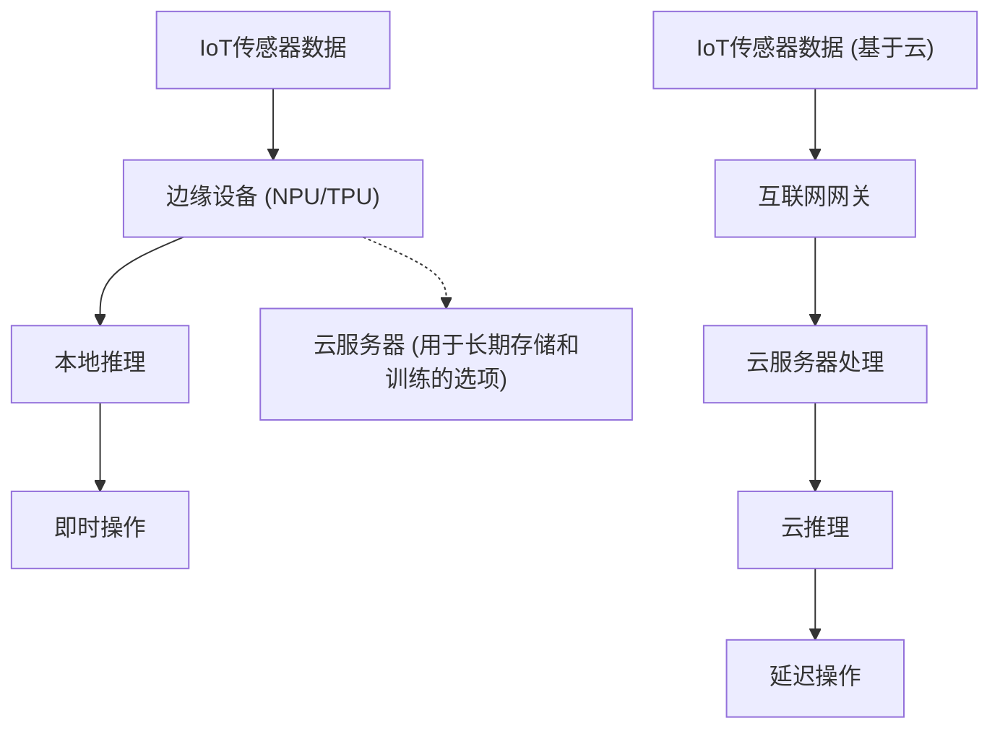
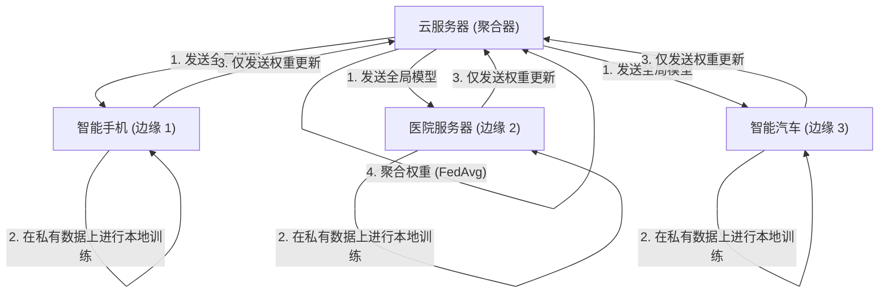

# 边缘AI的未来与IoT设备的实现方法

## 1. 引言：为什么现在是边缘AI（Edge AI）？

随着IoT（物联网）设备的普及，我们进入了世界上所有物理对象都连接到互联网的时代。伴随着传感器技术的进步，设备产生的数据量呈爆炸式增长。过去，这些海量数据被发送到云端，利用云端强大的计算资源（如巨大的GPU集群）通过AI模型进行推理。这就是“云AI”的常规方法。

然而，将所有数据发送到云端，在云端处理后再将结果发送回设备的架构，存在几个重大局限性：
1. **延迟（Latency）问题**：在要求毫秒级即时判断的系统中，如自动驾驶汽车、工业机器人和无人机，网络通信延迟可能会导致致命事故。
2. **隐私与安全**：智能家居的监控摄像头、医疗可穿戴设备等，若将个人信息及高度机密的视频或生物特征数据持续发送至云端，将伴随信息泄露和侵犯隐私的风险。
3. **网络带宽与成本**：如果数以百万计的IoT摄像头将持续的4K视频流发送到云端，网络带宽将被耗尽，数据传输成本和云存储成本将变得极其庞大。
4. **连接的稳定性（离线环境）**：在地下设施、海上、偏远农场等互联网连接不稳定或不存在的环境中，依赖云端意味着整个系统可能会停止运作。

为了解决这些挑战，**“边缘AI（Edge AI）”**应运而生。边缘AI是一种在生成数据的IoT设备本身（或极其靠近设备的网络末端 = 边缘）直接执行AI算法的技术。这样，数据在其源头被即时处理和分析，能在最大限度地减少对云的依赖的同时，构建高速、安全、低成本的智能系统。

本文将从技术角度深入探讨边缘AI，从边缘AI的基础、硬件（如NPU/TPU）的最新动态、使模型适应边缘环境的轻量化技术（量化、剪枝）、利用ONNX Runtime的实现方法，以及实现隐私保护和分布式学习的联邦学习（Federated Learning）。

---

## 2. 云AI与边缘AI的架构比较

为了直观地理解云AI和边缘AI的区别，请参考以下架构图。



从这张图可以看出，在边缘AI的架构中，从数据源头到推理，再到操作（控制）的循环均在边缘设备内完成。云端仅扮演非实时的辅助角色，例如分发已训练好的模型、进行长期数据的汇总和趋势分析。

### 推理延迟的数学模型

让我们来公式化边缘与云端在延迟上的差异。整个系统完成推理所需的时间 $T_{total}$ 可表示如下：

**在云AI的情况下:**
$$ T_{total} = T_{network\_up} + T_{cloud\_compute} + T_{network\_down} $$

其中，网络上传时间 $T_{network\_up}$ 取决于以下公式：
$$ T_{network\_up} = \frac{D}{B} + RTT $$
（$D$: 发送的数据大小, $B$: 网络带宽, $RTT$: 往返时间）

当数据大小 $D$ 较大（如高分辨率图像或连续的振动数据）或在带宽 $B$ 较窄的环境中，$T_{network\_up}$ 会急剧增加，此时无论AI本身的推理速度 $T_{cloud\_compute}$ 有多快，网络都会成为瓶颈。

**在边缘AI的情况下:**
$$ T_{total} \approx T_{edge\_compute} $$

由于边缘AI不涉及网络传输，$T_{network\_up}$ 和 $T_{network\_down}$ 几乎为零（仅限本地总线传输）。虽然边缘设备的计算能力逊色于云端，常常导致 $T_{edge\_compute} > T_{cloud\_compute}$，但由于排除了网络延迟和通信的不确定性，综合的 $T_{total}$ 能够稳定保持在较低水平。

---

## 3. 支撑边缘AI的硬件技术

为了在边缘设备上高速执行深度学习模型，专用的硬件加速器是必不可少的。在传统的CPU处理中，从功耗和处理速度的角度来看，实时AI推理是困难的。这里将介绍几种具有代表性的边缘AI专用硬件。

### 3.1 NPU (Neural Processing Unit) 与 TPU (Tensor Processing Unit)
深度学习的推理过程（特别是CNN等推理）由大量的乘加运算（MAC运算：Multiply-Accumulate）构成。NPU和TPU是专门为了并行且以超低功耗执行这些MAC运算而设计的专用芯片（ASIC）。

- **Google Coral Edge TPU**:
  Google提供的Edge TPU是一款体积非常小巧但拥有强大推理能力的协处理器。它在仅2W的功耗下能够发挥 4 TOPS（Tera Operations Per Second：每秒4万亿次运算）的性能。只需将其通过USB连接到像Raspberry Pi这样的轻量级SBC（单板计算机）上，即可实时运行针对移动端优化的TensorFlow Lite模型。
- **Raspberry Pi AI Kit (搭载Hailo-8L)**:
  近年来发布的Raspberry Pi AI Kit搭载了Hailo公司的AI加速器“Hailo-8L”。Hailo的架构通过将神经网络的结构映射到芯片的硬件结构上，消除了内存访问瓶颈，并在几瓦的功耗范围内实现了高达13 TOPS的惊人推理性能。
- **NVIDIA Jetson 系列**:
  Jetson Nano、Xavier、Orin系列是将ARM CPU和NVIDIA强大的GPU核心集成在一起的SoC。因为可以直接利用CUDA生态系统，所以将在云端训练好的PyTorch或TensorFlow模型通过TensorRT部署到边缘设备变得非常容易。

### TOPS与能效（TOPS/W）
评估边缘AI硬件最重要的指标是“TOPS/W（每瓦特的TOPS）”。由于IoT设备在电池供电或PoE（Power over Ethernet）等严苛的功耗限制下运行，因此不仅要看单纯的计算性能（TOPS），关键在于如何以更少的电力进行AI推理。

---

## 4. 边缘设备部署：模型轻量化的理论与实践

即使硬件不断演进，将高达数百MB到数GB的庞大深度学习模型（如GPT或大型ResNet等）直接加载到边缘设备有限的RAM（几MB到几GB）中也是不可能的。因此，“模型轻量化（Model Compression）”是必不可少的。这里将详细介绍代表性的技术：“量化（Quantization）”和“剪枝（Pruning）”。

### 4.1 模型的量化（Quantization）

深度学习模型通常使用32位浮点数（FP32）来表示权重和激活函数。量化是一种将这些精度降低到16位（FP16）、8位整数（INT8）甚至更低位数的技术。

**减少内存的效果**:
假设参数数量为 $N$，则所需的内存量计算如下：
$$ M_{FP32} = N \times 4 \text{ (Bytes)} $$
$$ M_{INT8} = N \times 1 \text{ (Bytes)} $$
通过INT8量化，理论上可以将模型大小和内存使用量减少至 $\frac{1}{4}$。此外，与FP32运算相比，硬件（如NPU）执行INT8的MAC运算速度可快数倍至数十倍，且功耗更低，从而大幅降低推理延迟和功耗。

**量化的数学模型**:
将实数 $r$（FP32）映射到整数 $q$（INT8: -128 到 127）的基本仿射量化公式如下：

$$ r = S \times (q - Z) $$
$$ q = \text{round}\left( \frac{r}{S} + Z \right) $$

其中，$S$ 表示缩放因子（Scale），$Z$ 表示零点（Zero-point：即将实数的0映射到整数类型的哪个值）。

量化分为在训练完成后对模型进行转换的 **训练后量化 (Post-Training Quantization, PTQ)**，以及在训练过程中模拟量化误差并更新权重的 **量化感知训练 (Quantization-Aware Training, QAT)**。如果希望将精度损失降至最低，推荐使用QAT。

### 4.2 模型的剪枝（Pruning）

在神经网络中，存在大量对最终推理结果几乎没有影响（重要度低）的权重。将这些不必要的权重设为零，或者从网络结构本身中删除的技术称为剪枝（Pruning）。

**稀疏度（Sparsity）的定义**:
$$ \text{Sparsity} (S) = \frac{N_{zero}}{N_{total}} \times 100 \text{ (\%)} $$
其中 $N_{zero}$ 是被设为零的权重数量，$N_{total}$ 是模型整体权重的总数。

- **非结构化剪枝（Unstructured Pruning）**: 独立地将单个权重设为零的方法。虽然稀疏度会变高，但权重矩阵只是变成稀疏矩阵（Sparse Matrix），在普通CPU/GPU上内存访问模式会变得不规则，可能无法获得预期的加速效果。
- **结构化剪枝（Structured Pruning / Channel Pruning）**: 将整个卷积层的滤波器或通道删除的方法。由于网络维度本身被缩小，因此在任何硬件上都能获得明确的推理速度提升（Speedup）和内存减少效果。

推理速度的提升率 $S_{speedup}$ 大致与通道缩减率 $c$（$0 < c < 1$）成以下比例关系（基于MAC运算次数的减少）：
$$ S_{speedup} \propto \frac{1}{(1 - c)^2} $$
（※因为卷积运算的计算量与输入通道数和输出通道数的乘积成正比）

---

## 5. 部署与推理引擎：活用ONNX Runtime

为了在边缘设备上实际运行轻量化后的模型，需要一个轻量且支持多平台的推理引擎。目前，作为行业标准被广泛使用的是 **ONNX (Open Neural Network Exchange)** 和 **ONNX Runtime**。

ONNX是一种用于在PyTorch、TensorFlow等不同框架之间以通用格式处理模型的规范。ONNX Runtime则是用于在各种硬件上最优地执行这些ONNX模型的引擎。

**Execution Providers (EP)** 机制是ONNX Runtime的强大之处。无需重写代码，即可将后端的执行环境切换为CPU、CUDA (GPU)、TensorRT、OpenVINO、CoreML、XNNPACK等。

以下是使用Python在边缘设备上通过ONNX Runtime进行推理的基本代码示例：

```python
import onnxruntime as ort
import numpy as np
import time

def run_edge_inference(model_path, input_data):
    # 指定适合边缘设备的Execution Provider
    # 例：如果是CPU则使用 'CPUExecutionProvider'
    # 如果支持Coral Edge TPU或特定的NPU，则指定自定义EP
    providers = ['CPUExecutionProvider']
    
    # 初始化会话 (加载模型和图优化)
    session = ort.InferenceSession(model_path, providers=providers)
    
    # 获取模型的输入名称和输入形状
    input_name = session.get_inputs()[0].name
    expected_shape = session.get_inputs()[0].shape
    print(f"Expected input shape: {expected_shape}")
    
    # 测量推理时间
    start_time = time.time()
    
    # 执行推理
    # 输入数据应作为合适的Numpy数组 (例: np.float32 或 np.int8) 传入
    outputs = session.run(None, {input_name: input_data})
    
    latency = (time.time() - start_time) * 1000.0 # 转换为毫秒
    print(f"Inference Latency: {latency:.2f} ms")
    
    return outputs[0]

# 虚拟输入数据 (例: 224x224的RGB图像，批量大小为1)
dummy_input = np.random.randn(1, 3, 224, 224).astype(np.float32)
# run_edge_inference("lightweight_model.onnx", dummy_input)
```

以这段代码为基础，通过将其移植到如C++等延迟更低的语言中，可以将边缘设备上的硬件性能发挥到极致。

---

## 6. 隐私保护与分布式学习：联邦学习（Federated Learning）

边缘AI的终极进化形态之一，是不仅将模型的“推理”，甚至连“训练”也分散到边缘设备的 **联邦学习（Federated Learning）**。

在传统的机器学习中，来自所有IoT设备的原始数据（视频、音频、日志等）都被汇总到云端，集中训练模型。然而，将个人智能手机或医疗设备的数据集中到云端，伴随着严重的隐私风险。

联邦学习优雅地解决了这个问题。



**联邦学习的流程**:
1. 云服务器（聚合器）将初始化的“全局模型”分发给各个边缘设备。
2. 每个边缘设备**完全不将内部保存的机密数据泄露到外部**，而是使用该数据在本地训练（微调）全局模型。
3. 边缘设备仅将通过训练获得的“模型权重更新量（梯度）”发送至云端。原始数据绝不离开设备。
4. 云端将收集到的众多设备传来的权重更新量进行平均，生成新的全局模型。

**Federated Averaging (FedAvg) 的数学模型**:
作为最具代表性的聚合算法，FedAvg的更新公式如下。
假设共有 $K$ 个客户端，每个客户端 $k$ 拥有 $n_k$ 个数据样本。设数据总数为 $N = \sum_{k=1}^{K} n_k$，则下一轮的全局模型权重 $w_{t+1}$ 计算如下：

$$ w_{t+1} = \sum_{k=1}^{K} \frac{n_k}{N} w_{t+1}^k $$

其中 $w_{t+1}^k$ 是客户端 $k$ 使用其本地数据训练后更新的权重。通过这样根据数据量进行加权平均，能够在完全保护隐私的同时，构建出一个仿佛汇集了所有设备数据进行训练的高性能模型。

---

## 7. IoT设备的实现用例

边缘AI已经在各个行业投入实际使用，并引发了戏剧性的范式转变。

### 7.1 智能制造与预测性维护 (Predictive Maintenance)
工厂生产线上电机和涡轮机的振动及声学数据，会由边缘设备（PLC或边缘服务器）持续监控。虽然不可能将每几毫秒采样一次的振动数据持续发送到云端，但如果使用边缘AI，就可以实时检测到异常的征兆（通过异常检测模型进行异常发现），并在机器发生致命故障之前紧急停止生产线。

### 7.2 智能农业 (Smart Agriculture)
广阔的农田通常通信基础设施薄弱，因此边缘AI不可或缺。搭载在无人机上的轻量级目标检测模型（如YOLOv8 nano等）可以从航拍图像中实时识别害虫和生病的叶片。仅发送特定坐标数据，或者让联动的喷洒无人机当场进行精准的农药喷洒，从而大幅减少农药的使用量。

### 7.3 医疗可穿戴设备
在智能手表和便携式心电图机（ECG）中，佩戴者的心率数据中的心律失常（如心房颤动等）征兆，可由边缘设备单体检测出来。由于医疗数据具有极高的机密性，推理过程在设备内部完成且无需上传至云端的边缘AI，成为通过HIPAA等严格医疗隐私法规的关键。

---

## 8. 边缘AI的挑战与未来展望

边缘AI技术正在迅速发展，但仍面临许多挑战和令人期待的未来前景。

**1. 在边缘运行LLM（大型语言模型）**:
近年来最大的话题是试图在边缘运行生成式AI和LLM的“Edge LLM”。虽然不可能将数百亿参数的模型直接放置到边缘设备中，但随着llama.cpp等优化框架、4位/2位极限缩放量化（AWQ、GPTQ等）以及诸如微软Phi-3等小型高性能SLM（Small Language Models）的出现，在智能手机或Raspberry Pi上也能离线完成自然语言处理的时代正在到来。

**2. 神经形态计算与SNN**:
被寄予厚望的终极节能边缘AI，是物理上模仿人类大脑神经网络运作的“神经形态芯片（例如：Intel Loihi）”和“脉冲神经网络（Spiking Neural Network, SNN）”。由于SNN是一种仅在数据发生变化时（脉冲）才进行计算的事件驱动型模型，与传统深度学习模型相比，理论上能够将功耗降低几个数量级（从几十分之一到数百分之一）。

**3. 建立EdgeOps（而非MLOps）**:
面临分散在世界各地数千到数万台边缘设备，如何安全地分发模型更新（OTA：空中下载更新），以及如何监控运行中模型的精度下降（数据漂移），是运维中的一大挑战。在各个设备硬件架构不同的异构环境中实现部署自动化，是未来需求最大的工程领域。

---

## 9. 结语

边缘AI已经从单纯的“云端补充技术”演变为决定整个IoT系统架构的核心技术。边缘AI带来的好处是不可估量的，包括将推理延迟降至最低、彻底保护隐私以及大幅降低通信带宽和云成本。

模型量化、剪枝等软件层面的轻量化技术，与NPU、TPU、Hailo等硬件层面的惊人进化双管齐下，使得过去需要超级计算机才能运行的深度学习模型，如今可以在我们手掌中的设备上以几毫瓦的电力运行。

此外，诸如联邦学习这样的分布式训练方法，以及在边缘端运行生成式AI（SLM）等技术的边界正在迅速扩大。对于工程师和架构师而言，未来最具挑战性且激动人心的课题，将不再是仅仅依赖云端的庞大资源，而是追求“如何在有限的边缘资源中发挥出最大的智能”。

在物理世界与数字世界相融合的IoT最前沿，边缘AI无疑将成为引领未来的中枢神经系统。

---
*本文专为对将AI部署到IoT设备感兴趣的工程师和系统架构师编写。*

