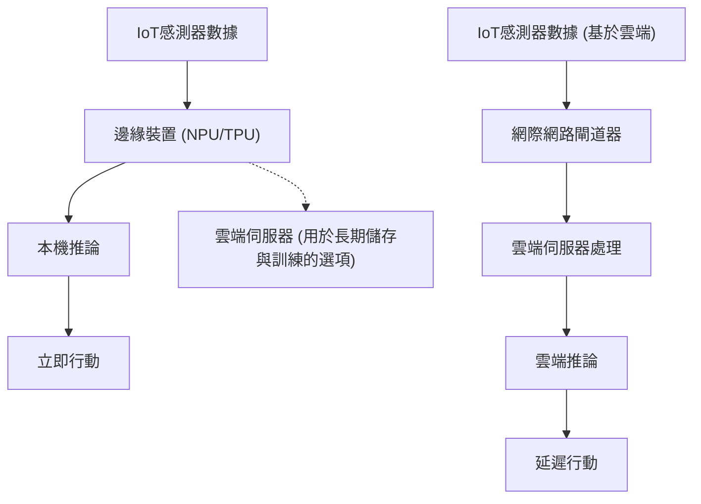
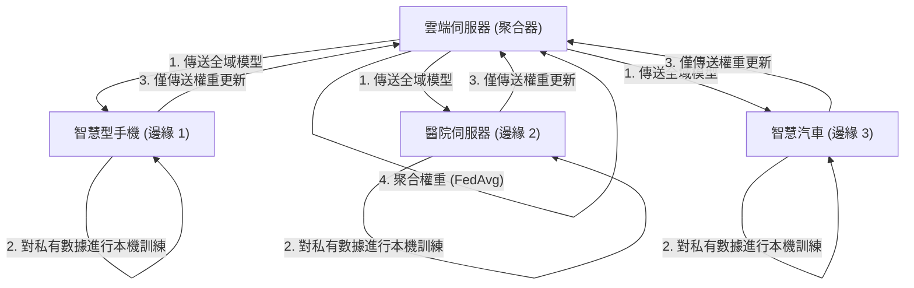

# Edge AI的未來與IoT裝置的實作方法

## 1. 前言：為什麼現在需要邊緣AI（Edge AI）？

隨著物聯網（IoT，Internet of Things）裝置的普及，我們進入了一個世界上所有實體物品都連接到網際網路的時代。伴隨著感測器技術的進步，裝置產生的數據量正呈現爆炸性的成長。過去，這些龐大的數據會被傳送到雲端，並使用雲端上強大的運算資源（如巨大的GPU叢集）透過AI模型進行推論。這就是一般的「雲端AI」方法。

然而，將所有數據傳送到雲端，在雲端處理後再將結果傳回裝置的架構，存在一些重大的限制。
1. **延遲（Latency）問題**：在自動駕駛車、工業機器人、無人機等需要毫秒級即時判斷的系統中，網路的通訊延遲可能會導致致命的事故。
2. **隱私與安全**：智慧家庭的監視攝影機或醫療用穿戴式裝置等，若持續將個人資訊或高度機密的影像、生理數據傳送到雲端，將伴隨著資訊外洩或侵犯隱私的風險。
3. **網路頻寬與成本**：如果數百萬台IoT攝影機持續將4K影像串流傳送到雲端，網路頻寬將會耗盡，數據傳輸成本和雲端儲存成本也會變得非常龐大。
4. **連線穩定性（離線環境）**：在地下設施、海上、偏遠農場等網際網路連線不穩定或不存在的環境中，依賴雲端意味著整個系統的停擺。

為了解決這些問題而崛起的就是**「Edge AI（邊緣AI）」**。Edge AI是一種在產生數據的IoT裝置本身（或是極度靠近裝置的網路末端＝邊緣），直接執行AI演算法的技術。如此一來，數據就能在資料源頭立即被處理與分析，在將對雲端的依賴降至最低的同時，建立一個高速、安全、低成本的智慧系統。

本文將從Edge AI的基礎開始，深入探討硬體（NPU/TPU等）的最新動態、為了讓模型適應邊緣環境的輕量化技術（量化、剪枝）、使用ONNX Runtime的實作手法，以及實現隱私保護與分散式學習的聯邦學習（Federated Learning），從技術的角度進行非常深入的解說。

---

## 2. 雲端AI與邊緣AI的架構比較

為了視覺化地理解雲端AI與邊緣AI的差異，請參考以下的架構圖。



從這張圖可以得知，Edge AI的架構中，從數據產生源頭到推論，再到行動（控制）的循環，都在邊緣裝置內完成。雲端僅扮演發布已訓練模型，或是長期的數據彙整、趨勢分析等非即時性的輔助角色。

### 推論延遲的數學模型

讓我們將邊緣與雲端在延遲上的差異公式化。整個系統完成推論所需的時間 $T_{total}$ 可以表示如下。

**雲端AI的情況:**
$$ T_{total} = T_{network\_up} + T_{cloud\_compute} + T_{network\_down} $$

這裡的網路上傳時間 $T_{network\_up}$ 依賴於以下公式。
$$ T_{network\_up} = \frac{D}{B} + RTT $$
($D$: 傳送的數據大小, $B$: 網路頻寬, $RTT$: 往返時間)

當數據大小 $D$ 很大（如高解析度影像或連續的震動數據等），或者在頻寬 $B$ 較窄的環境中，$T_{network\_up}$ 會急遽增加，此時無論AI本身的推論速度 $T_{cloud\_compute}$ 有多快，都會成為瓶頸。

**Edge AI的情況:**
$$ T_{total} \approx T_{edge\_compute} $$

因為Edge AI不涉及網路傳輸，所以 $T_{network\_up}$ 和 $T_{network\_down}$ 幾乎為零（僅有本機匯流排的傳輸）。雖然邊緣裝置的運算能力不如雲端，使得 $T_{edge\_compute} > T_{cloud\_compute}$ 的情況很常見，但因為排除了網路延遲和通訊的不確定性，整體的 $T_{total}$ 能穩定保持在較低的水準。

---

## 3. 支撐邊緣AI的硬體技術

為了在邊緣裝置上高速執行深度學習模型，專用的硬體加速器是不可或缺的。在過去由CPU處理的情況下，從功耗和處理速度的角度來看，要進行即時的AI推論是非常困難的。在此介紹具代表性的Edge AI專用硬體。

### 3.1 NPU (神經處理單元) 與 TPU (張量處理單元)
深度學習的推論過程（特別是CNN等的推論），是由大量的矩陣乘加運算（MAC運算：Multiply-Accumulate）所組成。NPU和TPU是專門為了平行且以超低功耗執行這種MAC運算而特化的專用晶片（ASIC）。

- **Google Coral Edge TPU**:
  Google提供的Edge TPU是一款非常小巧卻擁有強大推論能力的協同處理器。僅需2W的功耗就能發揮 4 TOPS（Tera Operations Per Second：每秒4兆次運算）的效能。這使得像Raspberry Pi這樣輕量級的SBC（單板電腦），只要透過USB連接，就能即時執行針對行動裝置最佳化的TensorFlow Lite模型。
- **Raspberry Pi AI Kit (搭載Hailo-8L)**:
  近年推出的Raspberry Pi AI Kit搭載了Hailo公司的AI加速器「Hailo-8L」。Hailo的架構是將神經網路的結構映射到晶片的硬體結構上，藉此消除記憶體存取的瓶頸，在數瓦的功耗範圍內實現了最高13 TOPS的驚人推論效能。
- **NVIDIA Jetson 系列**:
  Jetson Nano、Xavier、Orin系列是整合了ARM CPU與NVIDIA強大GPU核心的SoC。因為可以直接使用CUDA生態系統，所以非常容易將在雲端訓練好的PyTorch或TensorFlow模型，透過TensorRT部署到邊緣裝置上。

### TOPS與能源效率（TOPS/W）
評估Edge AI硬體最重要的指標是「TOPS/W（每瓦的TOPS）」。因為IoT裝置是在電池供電或PoE（Power over Ethernet）等嚴格的電力限制下運作，所以不僅僅是單純的運算效能（TOPS），如何以更少的電力進行AI推論才是關鍵。

---

## 4. 部署到邊緣裝置：模型輕量化的理論與實踐

即使硬體進步，要把動輒數百MB到數GB的巨大深度學習模型（例如GPT或大型ResNet等）直接載入邊緣裝置有限的RAM（數MB到數GB）中是不可能的。因此，「模型輕量化（Model Compression）」是必須的。我們將詳細解說作為代表性手法的「量化（Quantization）」與「剪枝（Pruning）」。

### 4.1 模型的量化（Quantization）

深度學習模型通常以32位元浮點數（FP32）來表示權重與活化函數。量化是指將這些精度降低到16位元（FP16）、8位元整數（INT8），甚至是更低位元的技術。

**記憶體縮減效果**:
假設參數數量為 $N$，所需的記憶體量可以計算如下。
$$ M_{FP32} = N \times 4 \text{ (Bytes)} $$
$$ M_{INT8} = N \times 1 \text{ (Bytes)} $$
透過INT8量化，模型大小和記憶體使用量在理論上可以縮減為 $\frac{1}{4}$。此外，硬體（如NPU等）執行INT8的MAC運算，比起FP32的運算速度快上數倍到數十倍，且功耗更低，因此能大幅降低推論延遲與功耗。

**量化的數學模型**:
將實數 $r$（FP32）映射到整數 $q$（INT8: -128 ～ 127）的基本仿射量化公式如下。

$$ r = S \times (q - Z) $$
$$ q = \text{round}\left( \frac{r}{S} + Z \right) $$

這裡的 $S$ 代表縮放因子（Scale），$Z$ 代表零點（Zero-point：將實數的0映射到整數型別的哪個值）。

量化方法包含：在訓練完成後對模型進行轉換的 **訓練後量化 (PTQ, Post-Training Quantization)**，以及在訓練過程中模擬量化誤差並更新權重的 **量化感知訓練 (QAT, Quantization-Aware Training)**。如果希望將精度下降降至最低，建議使用QAT。

### 4.2 模型的剪枝（Pruning）

神經網路中存在著許多對最終推論結果幾乎沒有影響（重要度較低）的權重。將這些不必要的權重歸零，或是從網路結構本身刪除的技術就是剪枝（Pruning）。

**稀疏性 (Sparsity) 的定義**:
$$ \text{Sparsity} (S) = \frac{N_{zero}}{N_{total}} \times 100 \text{ (\%)} $$
這裡的 $N_{zero}$ 是被歸零的權重數量，$N_{total}$ 是模型整體的權重總數。

- **非結構化剪枝 (Unstructured Pruning)**: 獨立將個別權重歸零的手法。雖然Sparsity會變高，但權重矩陣只是變成稀疏矩陣（Sparse Matrix），在一般的CPU/GPU上由於記憶體存取模式變得不規則，有時無法獲得預期的加速效果。
- **結構化剪枝 (Structured Pruning / Channel Pruning)**: 將卷積層的濾波器或通道整個刪除的手法。因為網路的維度本身被縮小了，所以在任何硬體上都能獲得明確的推論速度提升（Speedup）與記憶體縮減效果。

推論速度的提升率 $S_{speedup}$，相對於通道縮減率 $c$（$0 < c < 1$），大致成以下比例（基於MAC運算次數的減少）。
$$ S_{speedup} \propto \frac{1}{(1 - c)^2} $$
（※因為卷積運算的計算量與輸入通道數和輸出通道數的乘積成正比）

---

## 5. 部署與推論引擎：ONNX Runtime的應用

為了讓輕量化後的模型實際在邊緣裝置上運作，我們需要輕量且支援多平台的推論引擎。目前在業界作為標準被廣泛使用的是 **ONNX (Open Neural Network Exchange)** 和 **ONNX Runtime**。

ONNX是為了在PyTorch或TensorFlow等不同框架之間，以通用格式處理模型的標準。ONNX Runtime則是為了在各種硬體上最佳化執行這個ONNX模型的引擎。

**執行供應者 (Execution Providers, EP)** 的機制是ONNX Runtime強大的地方。不需要改寫程式碼，就能將後端的執行環境切換為CPU、CUDA (GPU)、TensorRT、OpenVINO、CoreML、XNNPACK等。

以下是使用Python在邊緣裝置上透過ONNX Runtime進行推論的基本程式碼範例。

```python
import onnxruntime as ort
import numpy as np
import time

def run_edge_inference(model_path, input_data):
    # 指定適合邊緣裝置的Execution Provider
    # 例如: CPU的情況使用 'CPUExecutionProvider'
    # 如果Coral Edge TPU或特定NPU有支援，則指定自訂的EP
    providers = ['CPUExecutionProvider']
    
    # 初始化工作階段 (載入模型與圖形最佳化)
    session = ort.InferenceSession(model_path, providers=providers)
    
    # 取得模型的輸入名稱與輸入形狀
    input_name = session.get_inputs()[0].name
    expected_shape = session.get_inputs()[0].shape
    print(f"Expected input shape: {expected_shape}")
    
    # 測量推論時間
    start_time = time.time()
    
    # 執行推論
    # 輸入數據應作為適當的Numpy陣列傳入 (例如: np.float32 或 np.int8)
    outputs = session.run(None, {input_name: input_data})
    
    latency = (time.time() - start_time) * 1000.0 # 轉換為毫秒
    print(f"Inference Latency: {latency:.2f} ms")
    
    return outputs[0]

# 模擬輸入數據 (例如: 224x224的RGB影像批次大小1)
dummy_input = np.random.randn(1, 3, 224, 224).astype(np.float32)
# run_edge_inference("lightweight_model.onnx", dummy_input)
```

以這段程式碼為基礎，將其移植到C++等擁有更低延遲的語言，就能將邊緣裝置上的硬體效能發揮到極致。

---

## 6. 隱私保護與分散式學習：聯邦學習 (Federated Learning)

Edge AI的終極進化型態之一，就是不僅將模型的「推論」，連同「學習」也分散到邊緣的 **聯邦學習 (Federated Learning)**。

在傳統的機器學習中，會將所有IoT裝置的原始數據（影像、聲音、日誌等）集中到雲端，並一次性進行模型的訓練。然而，將個人的智慧型手機或醫療設備的數據集中到雲端，伴隨著嚴重的隱私風險。

聯邦學習優雅地解決了這個問題。



**聯邦學習的流程**:
1. 雲端伺服器（聚合器）將初始化後的「全域模型」發布給各個邊緣裝置。
2. 各個邊緣裝置**完全不將儲存於其內部的機密數據外流**，而是使用該數據在本機上對全域模型進行學習（微調）。
3. 邊緣裝置僅將透過學習得到的「模型權重更新量（梯度）」傳送到雲端。原始數據絕對不會離開裝置。
4. 雲端將收集自眾多裝置的權重更新量進行平均化，並產生新的全域模型。

**Federated Averaging (FedAvg) 的數學模型**:
作為最具代表性的聚合演算法，FedAvg的更新公式如下。
假設整體有 $K$ 個客戶端，每個客戶端 $k$ 擁有 $n_k$ 個數據樣本。當整體的數據總數為 $N = \sum_{k=1}^{K} n_k$ 時，下一輪全域模型的權重 $w_{t+1}$ 計算如下。

$$ w_{t+1} = \sum_{k=1}^{K} \frac{n_k}{N} w_{t+1}^k $$

這裡的 $w_{t+1}^k$ 是客戶端 $k$ 使用其本機數據進行學習後更新的權重。像這樣根據數據數量進行加權平均，就能在完全保護隱私的同時，建構出彷彿集中了所有裝置數據進行學習般的高效能模型。

---

## 7. IoT裝置上的實作使用案例

Edge AI已經在各種產業中實用化，並引起了劇烈的典範轉移。

### 7.1 智慧製造與預測性維護 (Predictive Maintenance)
工廠生產線上的馬達或渦輪的震動、聲學數據，都會持續由邊緣裝置（PLC或邊緣伺服器）進行監控。要把以數毫秒為週期進行採樣的震動數據不斷送到雲端是不可能的，但如果使用邊緣AI，就能即時偵測異常的徵兆（透過異常檢測模型進行異常偵測），在機器發生致命故障之前緊急停止生產線。

### 7.2 智慧農業 (Smart Agriculture)
由於廣闊的農地通常通訊基礎設施較為脆弱，因此邊緣AI是不可或缺的。搭載於無人機上的輕量化物件偵測模型（如YOLOv8 nano等），能從空拍影像中即時找出害蟲或生病的葉片。透過僅傳送特定座標數據，或者讓連動的噴灑無人機在原地進行精準的農藥噴灑，將能大幅減少農藥的使用量。

### 7.3 醫療用穿戴式裝置
在智慧手錶或可攜式心電圖儀（ECG）中，單靠邊緣裝置就能從配戴者的心率數據中偵測出心律不整（如心房顫動等）的徵兆。由於醫療數據具有極高的機密性，不需上傳到雲端、推論能在裝置內完成的Edge AI，成為通過HIPAA等嚴格醫療隱私法規的關鍵。

---

## 8. 邊緣AI的挑戰與未來的展望

儘管Edge AI的技術正在快速發展，但仍然存在許多挑戰與令人期待的未來展望。

**1. 在邊緣執行LLM（大型語言模型）**:
近年來最熱門的話題，就是嘗試在邊緣裝置上運行生成式AI或LLM的「Edge LLM」。要把數百億參數的模型直接放上邊緣裝置是不可能的，但隨著llama.cpp等最佳化框架、達到極限的4位元/2位元量化（AWQ、GPTQ等），甚至是微軟的Phi-3等小型且高效能的SLM（小型語言模型, Small Language Models）的出現，在智慧型手機或Raspberry Pi上也能離線完成自然語言處理的時代即將到來。

**2. 神經形態運算與SNN**:
被期待作為終極省電Edge AI的，是物理性模仿人類大腦神經迴路運作的「神經形態晶片（例如：Intel Loihi）」與「脈衝神經網路（SNN, Spiking Neural Network）」。SNN屬於事件驅動型，只有在數據發生變化時（產生脈衝時）才會進行計算，因此與傳統的深度學習模型相比，理論上能將功耗降低數個數量級（從幾十分之一到幾百分之一）。

**3. 不只是MLOps，而是EdgeOps的確立**:
這是一個營運上的挑戰：如何對散佈在世界各地多達數千至數萬台的邊緣裝置，安全地進行模型更新發布（OTA：Over-The-Air 更新），以及監控運行中模型的精度退化（數據漂移）。在每台裝置硬體架構都不同的異質（Heterogeneous）環境中實現部署自動化，將是未來需求最高的工程領域。

---

## 9. 結語

Edge AI已經從單純的「雲端輔助技術」，進化成為決定IoT系統整體架構的核心技術。無論是推論延遲的極小化、隱私保護的徹底落實，還是通訊頻寬與雲端成本的大幅縮減，Edge AI帶來的恩惠是不可估量的。

模型量化與剪枝等軟體端的輕量化技術，與NPU、TPU、Hailo等硬體端的驚人進化相輔相成，過去需要超級電腦才能運行的深度學習模型，現在只需幾毫瓦的電力就能在我們手掌中的裝置上運行。

此外，像是聯邦學習等分散式學習方法，以及在邊緣執行生成式AI（SLM）等，技術的前沿正在快速擴展。對於工程師與架構師來說，不只是依賴雲端龐大的資源，探究「如何在資源有限的邊緣發揮最大的智慧」，將會是未來最具挑戰性也最令人興奮的課題。

在實體世界與數位世界交融的IoT最前線，Edge AI無疑將成為牽引未來的中樞神經系統。

---
*本文是為對將AI部署至IoT裝置感興趣的工程師及系統架構師所撰寫。*

