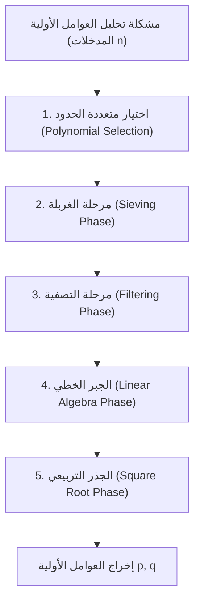
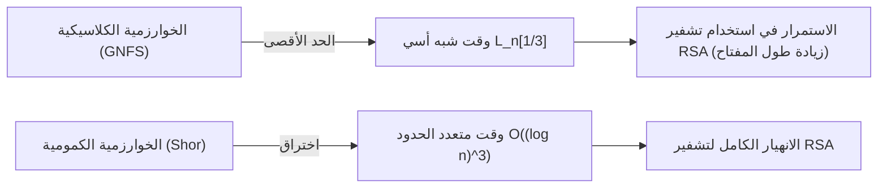

## 1. مقدمة: تحليل العوامل الأولية وأساس التشفير الحديث

تعتمد أمان اتصالات الإنترنت في المجتمع الحديث بشكل كبير على أمان تشفير RSA، وهو تشفير بالمفتاح العام. ويعتمد أمان تشفير RSA على افتراض رياضي وهو "صعوبة تحليل الأعداد المركبة الضخمة إلى عواملها الأولية". إذا تم اكتشاف خوارزمية تحليل عوامل أولية عالية الكفاءة، فإن البنية التحتية للاتصالات في جميع أنحاء العالم ستنهار من جذورها.

حاليًا، تعتبر خوارزمية **غربال حقل الأعداد العام (GNFS: General Number Field Sieve)** هي الخوارزمية الأسرع والأقوى في تحليل الأعداد الصحيحة الضخمة باستخدام أجهزة الكمبيوتر الكلاسيكية. ولدت GNFS كتوسيع لغربال حقل الأعداد الخاص (SNFS) المقترح في أواخر الثمانينيات، وحتى يومنا هذا سجلت أرقامًا قياسية في تحليل الأعداد المركبة الضخمة مثل RSA-768 و RSA-250.

ومع ذلك، يطرح علماء التشفير وعلماء الرياضيات دائمًا الأسئلة التالية: "هل توجد خوارزمية كلاسيكية تتجاوز GNFS؟" "أين تكمن حدود أجهزة الكمبيوتر الكلاسيكية؟" و"كيف ستكسر أجهزة الكمبيوتر الكمومية هذا الوضع؟"

في هذه المقالة، سنقوم بتشريح البنية الرياضية العميقة وراء GNFS بدقة، وإجراء تحليل تقني مفصل لخطوات مثل اختيار متعددة الحدود، ومرحلة الغربلة، وخطوة الجبر الخطي باستخدام طريقة Block Wiedemann. علاوة على ذلك، سنناقش طرق توسيع GNFS مثل تحسينات Coppersmith، ونقارن ونشرح الاختلافات الحاسمة بين الخوارزميات الكلاسيكية ذات الوقت شبه الأسي (Sub-exponential time) والخوارزميات الكمومية ذات الوقت متعدد الحدود من منظور رياضي.

---

## 2. التعقيد الحسابي المقارب وتدوين L (L-notation)

عند تقييم التعقيد الحسابي لخوارزميات تحليل العوامل الأولية، بدلاً من استخدام تدوين الوقت متعدد الحدود القياسي (مثل $O(n^k)$)، يتم استخدام **تدوين L (L-notation)** للتعبير عن الوقت شبه الأسي بالنسبة لعدد أرقام المدخل $n$. يتم تعريف تدوين L على النحو التالي:

$$
L_n[\alpha, c] = \exp \left( (c + o(1)) (\ln n)^\alpha (\ln \ln n)^{1-\alpha} \right)
$$

هنا، $n$ هو العدد الصحيح المراد تحليله، و $\ln n$ هو اللوغاريتم الطبيعي ويتناسب مع طول البت لـ $n$.
- في حالة $\alpha = 0$: تصبح $L_n[0, c] = \exp(c \ln \ln n) = (\ln n)^c$، وتمثل **الوقت متعدد الحدود (Polynomial time)** بالنسبة لطول البت.
- في حالة $\alpha = 1$: تصبح $L_n[1, c] = \exp(c \ln n) = n^c$، وتمثل **الوقت الأسي (Exponential time)** بالنسبة لطول البت.
- في حالة $0 < \alpha < 1$: يمثل هذا **وقتًا شبه أسي (Sub-exponential time)** يقع بين الوقت متعدد الحدود والوقت الأسي.

كان تطور خوارزميات تحليل العوامل الأولية في الماضي تاريخًا لتقليل قيمة $\alpha$ هذه تدريجيًا.
- **طريقة الكسور المستمرة (CFRAC) وغربال التربيع متعدد الحدود المتعدد (MPQS)**: تنتمي إلى فئة $\alpha = 1/2$، وتعقيدها الحسابي حوالي $L_n[1/2, 1]$.
- **غربال حقل الأعداد العام (GNFS)**: حقق $\alpha = 1/3$، ويتميز بأسرع تعقيد حسابي معروف بين الخوارزميات الكلاسيكية الحالية وهو $L_n[1/3, (64/9)^{1/3}]$.

---

## 3. النظرة الشاملة لخوارزمية GNFS والبنية الرياضية

تمتلك خوارزمية GNFS أساسًا رياضيًا معقدًا ومتقدمًا للغاية. تقع الفكرة الأساسية كامتداد لمبرهنة فيرما الصغرى وطريقة الغربال التربيعي (QS)، وتتمثل في إيجاد زوج غير بديهي $(X, Y)$ يحقق التطابق $X^2 \equiv Y^2 \pmod n$ بحيث أن $X \not\equiv \pm Y \pmod n$، ومن ثم استنتاج العامل $\gcd(X-Y, n)$ للعدد $n$.

ومع ذلك، يكمن جوهر GNFS في عدم القيام بذلك فقط في حقل الأعداد الكسرية $\mathbb{Q}$، ولكن من خلال البحث في وقت واحد عن "الأعداد الملساء (Smooth numbers)" في كل من امتداد الحقل المسمى حقل الأعداد الجبرية (Algebraic Number Field) $\mathbb{Q}(\alpha)$ وحقل الأعداد الكسرية، وبناء علاقة تطابق من خلال التشاكل (Homomorphism).

تنقسم عملية GNFS بشكل رئيسي إلى 5 مراحل.

### 3.1 المرحلة 1: اختيار متعددة الحدود (Polynomial Selection)

يعتمد نجاح GNFS بشكل كبير على اختيار متعددة الحدود المناسبة. الهدف هو إيجاد اثنتين من متعددات الحدود غير القابلة للاختزال $f_1(x)$ (الجانب الكسري) و $f_2(x)$ (الجانب الجبري) تشتركان في الجذر $m$. أي أنهما تحققان:
$f_1(m) \equiv f_2(m) \equiv 0 \pmod n$

عادة، نختار لمتعددة الحدود في الجانب الكسري معادلة خطية $f_1(x) = x - m$، ونختار لمتعددة الحدود في الجانب الجبري $f_2(x)$ متعددة حدود أحادية (Monic polynomial) من الدرجة $d$ (عادة 5 أو 6). النهج الكلاسيكي الأكثر شيوعًا هو **طريقة الأساس-$m$ (Base-$m$ method)**.
نختار عددًا صحيحًا $m = \lfloor n^{1/(d+1)} \rfloor$ قريبًا من القوة $1/(d+1)$ للعدد $n$، ونقوم بتوسيع $n$ في الأساس $m$.
$n = c_d m^d + c_{d-1} m^{d-1} + \dots + c_1 m + c_0$
وبهذا نحصل على متعددة الحدود $f_2(x) = c_d x^d + c_{d-1} x^{d-1} + \dots + c_0$. ومن الواضح أن $f_2(m) = n \equiv 0 \pmod n$.

ومع ذلك، في التطبيقات الحديثة يتم استخدام **خوارزمية Kleinjung**. هذه الخوارزمية تبحث عن متعددة حدود من المرجح أن تولد أعدادًا ملساء في مرحلة الغربلة، مع تحسين الخصائص الجبرية (قيمة Murphy's $E$ وقيمة $\alpha$) ومنع معاملات متعددة الحدود من أن تصبح كبيرة جدًا (تحسين الانحراف Skewness). يتم استثمار قدر كبير من الموارد الحسابية في هذه الخطوة وحدها.

### 3.2 المرحلة 2: مرحلة الغربلة (Sieving Phase)

بمجرد تحديد متعددة الحدود، تدخل الخوارزمية في مرحلة "الغربلة (Sieving)" وهي المرحلة الأكثر عبئًا من الناحية الحسابية. هنا، نبحث عن أزواج $(a, b)$. يجب أن يكون هذا الزوج أوليًا فيما بينه (Coprime)، ويُطلب أن تكون القيمتان التاليتان "ملساء (Smooth)" في نفس الوقت.

1. **معيار الجانب الكسري (Norm)**: $F_1(a, b) = b \cdot f_1(a/b) = a - bm$
2. **معيار الجانب الجبري (Norm)**: $F_2(a, b) = b^d \cdot f_2(a/b)$

تعني كلمة "ملساء" أنه يمكن تحليل العدد إلى عوامل أولية باستخدام أعداد أولية فقط أقل من أو تساوي حدًا أعلى محددًا (Sieve bound). يتم إعداد قاعدة عوامل (Factor base) للجانب الكسري وقاعدة عوامل للجانب الجبري، ويتم اكتشاف الأعداد الملساء بكفاءة في مساحة بحث ضخمة بطريقة مشابهة لغربال إراتوستينس.
حاليًا، تعتبر التقنية المسماة **غربلة الشبكة (Lattice Sieving)** هي السائدة، حيث يتم تثبيت عدد أولي معين $q$، وتقتصر الغربلة على أزواج $(a, b)$ على شبكة جزئية (Sub-lattice) حيث يكون كلا الجانبين الكسري والجبري من مضاعفات $q$، مما يحقق كفاءة عالية جدًا.

### 3.3 المرحلة 3: مرحلة التصفية (Filtering Phase)

يصل عدد العلاقات (Relations) الملساء الموجودة في مرحلة الغربلة إلى مئات الملايين أو المليارات. ومع ذلك، فإنها تحتوي أيضًا على الكثير من المعلومات غير المجدية.
الهدف من التصفية هو بناء مصفوفة متناثرة ضخمة (Sparse Matrix) مع تقليل أبعادها قدر الإمكان.

بشكل ملموس، نقوم بالعمليات التالية:
- **إزالة المفردات (Singleton removal)**: إزالة العلاقات التي تحتوي على عوامل أولية تظهر مرة واحدة فقط.
- **إزالة الزمر / الدمج (Clique removal / Merging)**: ضرب العلاقات التي تحتوي على عوامل أولية تظهر مرتين أو أكثر معًا للقضاء على المتغيرات، وتقليلها إلى نظام معادلات أكثر كثافة ولكن بأبعاد أصغر.

وبهذا، يتم ضغط مصفوفة مكونة من مليارات الصفوف إلى مصفوفة متناثرة ضخمة $\mathbf{A}$ في مستوى عشرات الملايين من الصفوف (عناصرها هي 0 و 1 على الحقل $\mathbb{F}_2$).

### 3.4 المرحلة 4: الجبر الخطي (Linear Algebra Phase)

هنا، نجد متجه حل غير بديهي $\mathbf{x}$ للمعادلة $\mathbf{A} \mathbf{x} \equiv \mathbf{0} \pmod 2$. بعبارة أخرى، إنها مشكلة إيجاد الفضاء الفارغ الأيسر (Left Nullspace) للمصفوفة المتناثرة الضخمة.

نظرًا لأن حجم المصفوفة كبير للغاية، فمن المستحيل تمامًا حسابها باستخدام طريقة الحذف الغاوسي العادية ($O(N^3)$). لذلك، يتم استخدام طريقة تكرارية وهي نوع من طريقة فضاء كريلوف الفرعي (Krylov subspace method). تاريخيًا، تم استخدام **طريقة بلوك لانشوس (Block Lanczos)**، ولكن في بيئة الحوسبة الموزعة الحالية، تعتبر **خوارزمية بلوك فيدمان (Block Wiedemann Algorithm)** هي السائدة لأنها يمكن أن تقلل بشكل كبير من أعباء الاتصال.

تحسب خوارزمية بلوك فيدمان متعددة الحدود الدنيا من المصفوفة $\mathbf{A}$ وسلسلة من المتجهات، وتبني أساسًا للفضاء الفارغ باستخدام خوارزمية بيرليكامب-ماسي (Berlekamp-Massey). تعد هذه الخطوة صعبة للغاية في التوازي، وتتطلب شبكات اتصال محكمة الاقتران للحواسيب العملاقة أو المجموعات الكبيرة، وهي واحدة من أكبر عنق الزجاجة في GNFS.

### 3.5 المرحلة 5: الجذر التربيعي (Square Root Phase)

من خلال حل الجبر الخطي، يتم بناء جداء يصبح "مربعًا كاملاً" في كل من الجانب الكسري والجانب الجبري.
في الجانب الكسري، يصبح الجداء $\prod (a-bm)$ مربعًا $X^2$ لعدد صحيح $X$، وفي الجانب الجبري، يصبح جداء المثاليات المقابلة مربعًا كاملاً $\gamma^2$ على حقل الأعداد الجبرية.
عن طريق حساب $\gamma$ هذا على حقل الأعداد الجبرية، وتطبيق تشاكل على حلقة الأعداد الصحيحة الكسرية $\phi: \alpha \mapsto m \pmod n$، نحصل على التطابق:
$X^2 \equiv \phi(\gamma)^2 \equiv Y^2 \pmod n$

لحساب الجذر التربيعي على حقل الأعداد الجبرية، يتم استخدام خوارزميات معقدة مثل **طريقة مونتغومري (Montgomery's Method)**، وتتطلب معرفة عميقة بنظرية الأعداد الجبرية. أخيرًا، من خلال حساب $\gcd(X-Y, n)$، إذا تم الحصول على عامل غير بديهي، يكتمل تحليل العوامل الأولية.

---

## 4. هل توجد خوارزمية كلاسيكية تتجاوز GNFS؟

حتى الآن، لم يتم اكتشاف أي خوارزمية كلاسيكية لتحليل العوامل الأولية للأعداد الصحيحة العامة يقل تعقيدها الحسابي المقارب عن $L_n[1/3, c]$. ومع ذلك، هناك بعض المحاولات والخوارزميات المشتقة لاختراق الحدود النظرية والعملية.

### 4.1 غربال حقول الأعداد المتعددة (MNFS: Multiple Number Field Sieve)

كنهج موسع لـ GNFS، هناك **غربال حقول الأعداد المتعددة (MNFS)** الذي قدمه D. Coppersmith. تستخدم GNFS اثنتين من متعددات الحدود (الجانب الكسري والجانب الجبري)، بينما تستخدم MNFS متعددات حدود جبرية مختلفة متعددة في وقت واحد لمتعددة حدود كسرية واحدة.

$$ f_1(x), f_{2,1}(x), f_{2,2}(x), \dots, f_{2,V}(x) $$

باستخدام حقول جبرية متعددة، يمكن زيادة احتمالية أن يصبح العدد "أملسًا في أحد الحقول الجبرية" بشكل كبير في كل خطوة غربلة. نجح Coppersmith في تقليل الثابت $c$ في التعقيد الحسابي $L_n[1/3, c]$ قليلاً من خلال هذا النهج.
على وجه التحديد، تم إثبات نظريًا أنه بينما الثابت في GNFS هو $c = (64/9)^{1/3} \approx 1.923$، يمكن تقليل التعقيد الحسابي إلى حوالي $c \approx 1.902$ من خلال تحسين MNFS.
ومع ذلك، من الناحية العملية، فإن العبء الإضافي (Overhead) الناتج عن إدارة حقول متعددة كبير، ولم يؤد ذلك إلى اختراق حاسم لمعاملات RSA على نطاق عملي.

### 4.2 هل من الممكن إيجاد خوارزمية من فئة $L_n[1/4]$؟

السؤال الذي نوقش لفترة طويلة بين علماء الرياضيات حول حدود الخوارزميات الكلاسيكية لتحليل العوامل الأولية هو "هل توجد خوارزمية ذات أس $\alpha = 1/4$؟".
ترتبط GNFS الحالية ومشتقاتها بقوة بإطار "البحث عن السلاسة" من خلال الغربلة، ويُعتقد على نطاق واسع أن $\alpha = 1/3$ هو الحد الأقصى ضمن هذا النموذج. من خلال تحليل احتمالية توزيع الأعداد الصحيحة الملساء باستخدام دالة ديكمان (Dickman function)، يُعتقد أنه لا يمكن تجاوز حاجز $O(L_n[1/3])$ مهما تم التحسين في المزيج الحالي لطريقة بناء حقل الأعداد الجبرية والغربال.

إذا كانت خوارزمية من فئة $L_n[1/4]$ أو حتى خوارزمية كلاسيكية بوقت متعدد الحدود موجودة، فيجب أن تعتمد على بنية رياضية جديدة تمامًا لا يمكن للبشرية تصورها حاليًا ومختلفة كليًا عن النهج "المبني على السلاسة" مثل GNFS (على سبيل المثال، نهج الهندسة الجبرية المتقدم مثل خوارزمية Schoof لتشفير المنحنى الإهليلجي). ومع ذلك، لا توجد حاليًا مثل هذه العلامات.

---

## 5. اختراق بواسطة أجهزة الكمبيوتر الكمومية: خوارزمية شور (Shor's Algorithm)

بينما تواجه أجهزة الكمبيوتر الكلاسيكية حاجز $L_n[1/3]$، فإن الخوارزمية التي حطمت هذا الحاجز عن طريق تغيير نموذج الحوسبة نفسه بشكل جذري هي **خوارزمية شور (Shor's Algorithm)** التي نشرها بيتر شور في عام 1994.

### 5.1 تأثير الوقت متعدد الحدود الكمومي

تُرجع خوارزمية شور مشكلة تحليل العوامل الأولية إلى "مشكلة إيجاد الرتبة (Order Finding Problem)". إنها مشكلة العثور على الدورة (الرتبة) $r$ للدالة $f(x) = a^x \pmod n$ لعدد صحيح $a$.
يتطلب الأمر وقتًا أسيًا على أجهزة الكمبيوتر الكلاسيكية للعثور على هذه الدورة، ولكن باستخدام **تقدير الطور الكمومي (QPE: Quantum Phase Estimation)** و **تحويل فورييه الكمومي (QFT: Quantum Fourier Transform)** على أجهزة الكمبيوتر الكمومية، من الممكن إجراء تقييم متوازٍ لجميع تراكبات الحالات (Superposition) واستخراج الدورة $r$ باحتمالية عالية.

من حيث التعقيد الحسابي، فإن وقت تنفيذ خوارزمية شور هو **وقت متعدد الحدود كمومي**، وعلى وجه التحديد على النحو التالي:
$$ O((\log n)^3) $$
بالنظر إلى تطبيقات الدوائر المحسنة في السنوات الأخيرة، يقال إنه يمكن تقليله إلى $O((\log n)^2 \log \log n)$.

### 5.2 الوقت شبه الأسي الكلاسيكي مقابل الوقت متعدد الحدود الكمومي

الفرق بين فئتي التعقيد الحسابي هاتين له معنى حاسم في أمان التشفير في العالم الحقيقي.

على سبيل المثال، لنفكر في حالة تحليل RSA-2048 (رقم مركب مكون من 2048 بت).
- **GNFS (كلاسيكي)**: بالتعويض بـ $n \approx 2^{2048}$ في $L_n[1/3, 1.923]$، سيستغرق الأمر حوالي $2^{112}$ عملية. هذا تعقيد حسابي فلكي سيستغرق وقتًا أطول من عمر الكون حتى لو تم حشد جميع الموارد الحسابية الحالية على الأرض.
- **خوارزمية شور (كمومي)**: باستخدام خوارزمية $O((\log n)^3)$، يتطلب الأمر فقط حوالي $2048^3 \approx 8.5 \times 10^9$ عملية بوابة منطقية. هذا يعني أنه إذا توفرت الأجهزة المناسبة (جهاز كمبيوتر كمومي عالمي مزود بملايين الكيوبتات المادية وقدرات تصحيح الأخطاء)، فسيتم إكمال الحساب في غضون بضع ساعات إلى بضعة أيام فقط.

يؤدي التحول النموذجي من الدالة شبه الأسية بـ "الأس $\alpha=1/3$" إلى "الوقت متعدد الحدود" إلى إبطال استراتيجية التشفير التقليدية المتمثلة في ضمان الأمان عن طريق زيادة طول المفتاح.

---

## 6. الخلاصة: نظرة نحو الجيل القادم

الإجماع الحالي في المجتمع العلمي حول سؤال "هل توجد خوارزمية كلاسيكية تتجاوز GNFS؟" هو كما يلي:

1. **التحسينات العملية مستمرة، لكن لا توجد قفزة مقاربة**: تستمر المحاولات لتحسين الحد الثابت $c$ في GNFS، مثل MNFS، وتحسين اختيار متعددة الحدود، وموازاة خوارزمية بلوك فيدمان. ومع ذلك، يُعتقد أن احتمالية اكتشاف خوارزمية كلاسيكية تقل عن $\alpha = 1/3$ منخفضة للغاية.
2. **لا يزال أمان RSA على أجهزة الكمبيوتر الكلاسيكية قويًا**: لا يزال التعقيد الحسابي لـ GNFS هائلاً، وستظل RSA-2048 و RSA-4096 آمنة لعقود قادمة ضد الهجمات من أجهزة الكمبيوتر الكلاسيكية.
3. **التهديد الحقيقي هو الخوارزميات الكمومية**: إن خوارزمية شور، القائمة على مبادئ ميكانيكا الكم، هي التي تجاوزت حاجز التعقيد الحسابي. ونتيجة لذلك، يضطر العالم إلى الانتقال إلى التشفير ما بعد الكمومي (PQC: Post-Quantum Cryptography). يمثل الانتقال إلى المسائل الرياضية الجديدة التي يصعب حلها حتى باستخدام أجهزة الكمبيوتر الكمومية (لا يمكن حلها في وقت متعدد الحدود)، مثل التشفير القائم على الشبكة (Lattice-based cryptography) والتشفير القائم على التجزئة (Hash-based cryptography)، طليعة علم التشفير الحالي.

تعتبر خوارزمية غربال حقل الأعداد العام (GNFS) واحدة من "القمم العليا" التي بلغتها البشرية من خلال تحدي حدود الرياضيات الكلاسيكية وتصميم الخوارزميات. إن فهم البنية الرياضية العميقة لـ GNFS ليس مجرد دراسة لتاريخ فك التشفير، بل هو أيضًا رحلة استكشاف فكري تلمس جمال نظرية التعقيد الحسابي ونظرية الأعداد الجبرية. حتى اليوم الذي يتم فيه استخدام أجهزة الكمبيوتر الكمومية بشكل عملي، ستحتفظ GNFS بعرشها كأقوى خوارزمية لتحليل العوامل الأولية.

