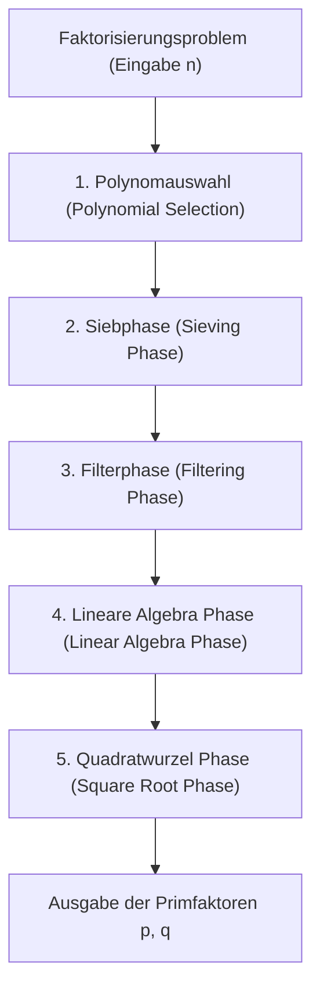
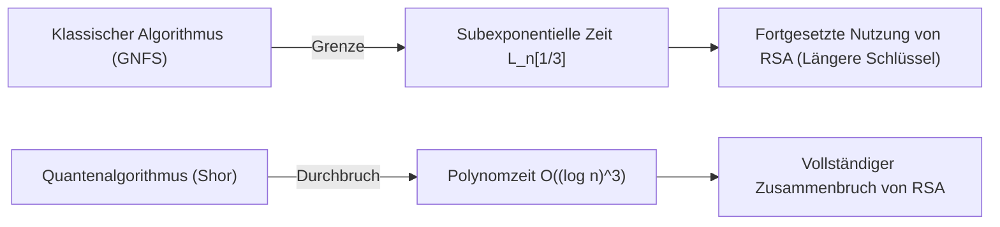

## 1. Einführung: Primfaktorzerlegung und die Grundlage der modernen Kryptographie

Die Sicherheit der Internetkommunikation in der modernen Gesellschaft hängt stark von der Sicherheit der RSA-Kryptographie ab, einem Public-Key-Kryptosystem. Die Sicherheit des RSA-Verfahrens basiert auf der mathematischen Annahme, dass es schwierig ist, riesige zusammengesetzte Zahlen in ihre Primfaktoren zu zerlegen. Wenn ein extrem effizienter Algorithmus zur Primfaktorzerlegung entdeckt würde, würde die Kommunikationsinfrastruktur der ganzen Welt von Grund auf zusammenbrechen.

Derzeit ist das **Allgemeine Zahlkörpersieb (GNFS: General Number Field Sieve)** der schnellste und stärkste Algorithmus zur Primfaktorzerlegung riesiger ganzen Zahlen auf klassischen Computern. Das GNFS entstand als Erweiterung des Speziellen Zahlkörpersiebs (SNFS), das Ende der 1980er Jahre vorgeschlagen wurde. Bis heute hat es Rekorde bei der Faktorisierung riesiger zusammengesetzter Zahlen wie RSA-768 und RSA-250 aufgestellt.

Kryptographen und Mathematiker stellen sich jedoch stets folgende Fragen: "Gibt es einen klassischen Algorithmus, der das GNFS übertrifft?", "Wo liegen die Grenzen klassischer Computer?" und "Wie werden Quantencomputer diese Situation überwinden?".

In diesem Artikel analysieren wir gründlich die tiefgründige mathematische Struktur hinter dem GNFS und führen detaillierte technische Analysen der Polynomauswahl, des Siebprozesses und des linearen Algebraschritts mithilfe der Block-Wiedemann-Methode durch. Darüber hinaus betrachten wir GNFS-Erweiterungsmethoden, wie die Coppersmith-Modifikation, und vergleichen sowie erklären wir die entscheidenden Unterschiede zwischen klassischen Algorithmen in subexponentieller Zeit (Sub-exponential time) und Quantenalgorithmen in polynomieller Zeit aus einer mathematischen Perspektive.

---

## 2. Asymptotische Komplexität und L-Notation (L-notation)

Bei der Bewertung der Komplexität von Faktorisierungsalgorithmen wird anstelle der Standard-Polynomzeit-Notation (wie $O(n^k)$) die **L-Notation (L-notation)** verwendet, um die subexponentielle Zeit relativ zur Anzahl der Stellen der Eingabe $n$ auszudrücken. Die L-Notation ist wie folgt definiert:

$$
L_n[\alpha, c] = \exp \left( (c + o(1)) (\ln n)^\alpha (\ln \ln n)^{1-\alpha} \right)
$$

Hierbei ist $n$ die zu faktorisierende ganze Zahl und $\ln n$ der natürliche Logarithmus, der proportional zur Bitlänge von $n$ ist.
- Wenn $\alpha = 0$: $L_n[0, c] = \exp(c \ln \ln n) = (\ln n)^c$, was die **Polynomzeit (Polynomial time)** bezogen auf die Bitlänge darstellt.
- Wenn $\alpha = 1$: $L_n[1, c] = \exp(c \ln n) = n^c$, was die **Exponentialzeit (Exponential time)** bezogen auf die Bitlänge darstellt.
- Wenn $0 < \alpha < 1$: Es handelt sich um eine **subexponentielle Zeit (Sub-exponential time)**, die zwischen der Polynomzeit und der Exponentialzeit liegt.

Die Geschichte der Entwicklung vergangener Faktorisierungsalgorithmen war auch eine Geschichte der allmählichen Verringerung dieses $\alpha$-Wertes.
- **Kettenbruchmethode (CFRAC) und Quadratisches Sieb mit mehreren Polynomen (MPQS)**: Sie gehören zur Klasse $\alpha = 1/2$ und haben eine Komplexität von etwa $L_n[1/2, 1]$.
- **Allgemeines Zahlkörpersieb (GNFS)**: Es erreicht $\alpha = 1/3$ und rühmt sich der Komplexität von $L_n[1/3, (64/9)^{1/3}]$, womit es der schnellste bekannte klassische Algorithmus ist.

---

## 3. Der gesamte GNFS-Algorithmus und seine mathematische Struktur

Das GNFS besitzt eine äußerst komplexe und fortschrittliche mathematische Grundlage. Die grundlegende Idee ist eine Erweiterung des kleinen Fermatschen Satzes und des Quadratischen Siebs (QS): Durch das Finden eines nicht-trivialen Paares $(X, Y)$, das die Kongruenz $X^2 \equiv Y^2 \pmod n$ und $X \not\equiv \pm Y \pmod n$ erfüllt, leitet man den Faktor $\gcd(X-Y, n)$ von $n$ ab.

Der Kern des GNFS liegt jedoch darin, dies nicht nur im Körper der rationalen Zahlen $\mathbb{Q}$ zu tun, sondern gleichzeitig "glatte Zahlen (Smooth numbers)" in einem Erweiterungskörper $\mathbb{Q}(\alpha)$, der als algebraischer Zahlkörper (Algebraic Number Field) bezeichnet wird, und im Körper der rationalen Zahlen zu suchen und durch einen Homomorphismus eine Kongruenzbeziehung herzustellen.

Der GNFS-Prozess ist grob in fünf Phasen unterteilt.

### 3.1 Phase 1: Polynomauswahl (Polynomial Selection)

Der Erfolg des GNFS hängt stark von der Auswahl geeigneter Polynome ab. Das Ziel ist es, zwei irreduzible Polynome, $f_1(x)$ (rationale Seite) und $f_2(x)$ (algebraische Seite), zu finden, die eine gemeinsame Wurzel $m$ haben. Das heißt, sie erfüllen:
$f_1(m) \equiv f_2(m) \equiv 0 \pmod n$

Normalerweise wird für die rationale Seite ein lineares Polynom $f_1(x) = x - m$ gewählt, und für das Polynom der algebraischen Seite $f_2(x)$ wird ein normiertes Polynom vom Grad $d$ (typischerweise 5 oder 6) gewählt. Der klassischste Ansatz ist die **Base-$m$-Methode**.
Man wählt eine ganze Zahl $m = \lfloor n^{1/(d+1)} \rfloor$, die nahe an der $1/(d+1)$-ten Potenz von $n$ liegt, und entwickelt $n$ im $m$-adischen System.
$n = c_d m^d + c_{d-1} m^{d-1} + \dots + c_1 m + c_0$
Dadurch erhält man das Polynom $f_2(x) = c_d x^d + c_{d-1} x^{d-1} + \dots + c_0$. Offensichtlich gilt $f_2(m) = n \equiv 0 \pmod n$.

In modernen Implementierungen wird jedoch der **Kleinjung-Algorithmus** verwendet. Dieser optimiert algebraische Eigenschaften (wie Murphys $E$-Wert und $\alpha$-Wert), während er verhindert, dass die Koeffizienten der Polynome extrem groß werden (Optimierung der Skewness), und sucht nach Polynomen, die bei der Siebverarbeitung leicht glatte Zahlen erzeugen. Allein in diesen Schritt werden enorme Rechenressourcen investiert.

### 3.2 Phase 2: Siebphase (Sieving Phase)

Sobald die Polynome bestimmt sind, tritt der Algorithmus in die "Sieb"-Phase (Sieving) ein, die den höchsten Rechenaufwand aufweist. Hier suchen wir nach Paaren $(a, b)$. Dieses Paar ist teilerfremd, und es wird gefordert, dass die folgenden zwei Werte gleichzeitig "glatt" (Smooth) sind:

1. **Norm auf der rationalen Seite**: $F_1(a, b) = b \cdot f_1(a/b) = a - bm$
2. **Norm auf der algebraischen Seite**: $F_2(a, b) = b^d \cdot f_2(a/b)$

"Glatt" bedeutet, dass die Zahl nur in Primfaktoren zerlegbar ist, die unter einer angegebenen Schranke (Sieve bound) liegen. Man bereitet eine Primzahlenbasis (Factor base) für die rationale Seite und eine Primzahlenbasis für die algebraische Seite vor und findet glatte Zahlen effizient in einem riesigen Suchraum, ähnlich wie beim Sieb des Eratosthenes.
Heutzutage ist eine Methode namens **Gittersieb (Lattice Sieving)** der Mainstream. Indem eine bestimmte Primzahl $q$ fixiert wird und nur $(a, b)$-Paare auf einem Teilgitter gesiebt werden, bei denen sowohl die rationale als auch die algebraische Seite ein Vielfaches von $q$ sind, wird eine extrem hohe Effizienz erreicht.

### 3.3 Phase 3: Filterphase (Filtering Phase)

Die Anzahl der glatten Relationen (Gleichungen), die bei der Siebverarbeitung gefunden werden, geht in die Hunderte von Millionen oder Milliarden. Diese enthalten jedoch auch viele nutzlose Informationen.
Das Ziel der Filterung ist es, eine riesige dünnbesetzte Matrix (Sparse Matrix) zu konstruieren und gleichzeitig deren Dimension so gering wie möglich zu halten.

Konkret werden die folgenden Operationen durchgeführt:
- **Singleton removal**: Entfernen von Relationen, die einen Primfaktor enthalten, der nur einmal vorkommt.
- **Clique removal / Merging**: Multiplizieren von Relationen, die Primfaktoren haben, die zweimal oder öfter vorkommen, um Variablen zu eliminieren und sie auf ein Gleichungssystem mit höherer Dichte, aber kleinerer Dimension zu reduzieren.

Dadurch wird eine Matrix mit Milliarden von Zeilen zu einer riesigen dünnbesetzten Matrix $\mathbf{A}$ (mit Elementen 0 und 1 über dem Körper $\mathbb{F}_2$) auf dem Niveau von zig Millionen Zeilen komprimiert.

### 3.4 Phase 4: Lineare Algebra Phase (Linear Algebra Phase)

Hier finden wir einen nicht-trivialen Lösungsvektor $\mathbf{x}$ der Gleichung $\mathbf{A} \mathbf{x} \equiv \mathbf{0} \pmod 2$. Das bedeutet, es handelt sich um das Problem, den linken Nullraum (Left Nullspace) einer riesigen dünnbesetzten Matrix zu finden.

Da die Größe der Matrix extrem groß ist, ist sie mit der normalen Gaußschen Elimination ($O(N^3)$) unmöglich zu berechnen. Daher wird eine iterative Methode verwendet, die eine Art von Krylov-Unterraum-Verfahren ist. Historisch gesehen wurde die **Block-Lanczos-Methode (Block Lanczos)** verwendet, aber in der heutigen verteilten Computerumgebung ist der **Block-Wiedemann-Algorithmus (Block Wiedemann Algorithm)**, der den Kommunikations-Overhead drastisch reduzieren kann, der Mainstream.

Die Block-Wiedemann-Methode berechnet das Minimalpolynom aus der Matrix $\mathbf{A}$ und Vektorfolgen und konstruiert die Basis des Nullraums mithilfe des Berlekamp-Massey-Algorithmus. Dieser Schritt ist sehr schwer zu parallelisieren und erfordert stark gekoppelte Kommunikationsnetzwerke von Supercomputern oder großen Clustern, was ihn zu einem der größten Engpässe des GNFS macht.

### 3.5 Phase 5: Quadratwurzel Phase (Square Root Phase)

Aus der Lösung der linearen Algebra werden Produkte konstruiert, die auf der rationalen bzw. der algebraischen Seite zu "vollständigen Quadraten" werden.
Auf der rationalen Seite wird $\prod (a-bm)$ zum Quadrat $X^2$ einer ganzen Zahl $X$, und auf der algebraischen Seite wird das Produkt der entsprechenden Ideale zu einem vollständigen Quadrat $\gamma^2$ über dem algebraischen Zahlkörper.
Indem man dieses $\gamma$ über dem algebraischen Zahlkörper berechnet und den Homomorphismus zum Ring der rationalen ganzen Zahlen $\phi: \alpha \mapsto m \pmod n$ anwendet, erhält man die Kongruenz:
$X^2 \equiv \phi(\gamma)^2 \equiv Y^2 \pmod n$

Für die Berechnung der Quadratwurzel über dem algebraischen Zahlkörper werden komplexe Algorithmen wie die **Montgomery-Methode (Montgomery's Method)** verwendet, was tiefe Kenntnisse der algebraischen Zahlentheorie erfordert. Schließlich wird $\gcd(X-Y, n)$ berechnet, und wenn ein nicht-trivialer Faktor erhalten wird, ist die Primfaktorzerlegung abgeschlossen.

---

## 4. Gibt es einen klassischen Algorithmus, der das GNFS übertrifft?

Bisher wurde für die Primfaktorzerlegung allgemeiner ganzer Zahlen kein klassischer Algorithmus entdeckt, dessen asymptotische Komplexität unter $L_n[1/3, c]$ fällt. Es gibt jedoch einige Versuche und abgeleitete Algorithmen, um theoretische und praktische Grenzen zu durchbrechen.

### 4.1 Vielfaches Zahlkörpersieb (MNFS: Multiple Number Field Sieve)

Als Ansatz zur Erweiterung des GNFS gibt es das **Vielfache Zahlkörpersieb (MNFS)** von D. Coppersmith. Während das GNFS zwei Polynome (rationale und algebraische Seite) verwendet, verwendet das MNFS gleichzeitig mehrere verschiedene algebraische Polynome für ein einzelnes Polynom auf der rationalen Seite.

$$ f_1(x), f_{2,1}(x), f_{2,2}(x), \dots, f_{2,V}(x) $$

Durch die Verwendung mehrerer algebraischer Körper kann die Wahrscheinlichkeit, dass die Zahl in jedem Siebschritt "in einem der algebraischen Körper glatt wird", drastisch erhöht werden. Mit diesem Ansatz ist es Coppersmith gelungen, die Konstante $c$ in der Komplexität $L_n[1/3, c]$ leicht zu reduzieren.
Konkret wurde theoretisch gezeigt, dass, während die Konstante des GNFS $c = (64/9)^{1/3} \approx 1,923$ ist, die Optimierung des MNFS den Rechenaufwand auf etwa $c \approx 1,902$ reduzieren kann.
In der Praxis ist jedoch der Overhead durch die Verwaltung mehrerer Körper groß, und es hat nicht zu einem entscheidenden Durchbruch bei RSA-Modulen in praktischer Größe geführt.

### 4.2 Sind Algorithmen der Klasse $L_n[1/4]$ möglich?

Ein Thema, das unter Mathematikern seit vielen Jahren hinsichtlich der Grenzen klassischer Algorithmen zur Primfaktorzerlegung diskutiert wird, ist die Frage: "Gibt es einen Algorithmus mit dem Exponenten $\alpha = 1/4$?".
Das derzeitige GNFS und seine Ableitungen sind stark an den Rahmen der "Suche nach Glätte" durch Sieben gebunden, und es wird weithin angenommen, dass $\alpha = 1/3$ die Grenze innerhalb dieses Paradigmas ist. Auch aus der Analyse der Verteilungswahrscheinlichkeit glatter ganzer Zahlen unter Verwendung der Dickman-Funktion (Dickman function) geht man davon aus, dass die Wand von $O(L_n[1/3])$ mit der aktuellen Kombination aus algebraischer Körperkonstruktion und Sieben durch keine Optimierung überwunden werden kann.

Sollte es $L_n[1/4]$ oder gar einen klassischen Polynomzeitalgorithmus geben, müsste dieser auf einer völlig neuen mathematischen Struktur beruhen, die derzeit niemand vorhersehen kann und die sich vom "glattheitsbasierten" Ansatz wie dem GNFS völlig unterscheidet (zum Beispiel ein fortgeschrittenerer algebraisch-geometrischer Ansatz wie der Schoof-Algorithmus für elliptische Kurvenkryptographie). Derzeit gibt es jedoch keine derartigen Anzeichen.

---

## 5. Durchbruch durch Quantencomputer: Shors Algorithmus

Während klassische Computer an der $L_n[1/3]$-Wand stehen, zerschmetterte der 1994 von Peter Shor vorgestellte **Shor-Algorithmus (Shor's Algorithm)** diese Wand, indem er das Berechnungsmodell grundlegend veränderte.

### 5.1 Der Schock der quantenmechanischen Polynomzeit

Shors Algorithmus reduziert das Faktorisierungsproblem auf ein "Ordnungsfindungsproblem (Order Finding Problem)". Es geht darum, die Periode (Ordnung) $r$ der Funktion $f(x) = a^x \pmod n$ für eine bestimmte ganze Zahl $a$ zu finden.
Während ein klassischer Computer exponentielle Zeit benötigt, um diese Periode zu finden, können durch die Verwendung der **Quanten-Phasenschätzung (QPE: Quantum Phase Estimation)** und der **Quanten-Fourier-Transformation (QFT: Quantum Fourier Transform)** auf einem Quantencomputer alle Zustände in Überlagerung (Superposition) parallel bewertet und die Periode $r$ mit hoher Wahrscheinlichkeit extrahiert werden.

In Bezug auf die Komplexität ist die Ausführungszeit von Shors Algorithmus eine **quantenmechanische Polynomzeit**, konkret:
$$ O((\log n)^3) $$
Unter Berücksichtigung kürzlich optimierter Schaltungsimplementierungen kann dies auf $O((\log n)^2 \log \log n)$ reduziert werden.

### 5.2 Klassische subexponentielle Zeit vs Quantenmechanische Polynomzeit

Der Unterschied zwischen diesen beiden Komplexitätsklassen hat entscheidende Auswirkungen auf die reale kryptographische Sicherheit.

Betrachten wir beispielsweise den Fall der Faktorisierung von RSA-2048 (eine zusammengesetzte Zahl mit 2048 Bit).
- **GNFS (Klassisch)**: Setzt man $n \approx 2^{2048}$ in $L_n[1/3, 1.923]$ ein, so benötigt man etwa $2^{112}$ Operationen. Dies ist eine astronomische Rechenmenge, die länger als die Lebensdauer des Universums dauern würde, selbst wenn man alle aktuellen Rechenressourcen der Erde bündeln würde.
- **Shor-Algorithmus (Quanten)**: Bei einem $O((\log n)^3)$-Algorithmus sind nur etwa $2048^3 \approx 8,5 \times 10^9$ logische Gatteroperationen erforderlich. Dies bedeutet, dass die Berechnung in nur wenigen Stunden bis Tagen abgeschlossen sein könnte, sofern die entsprechende Hardware (ein universeller Quantencomputer mit Millionen von physischen Qubits und Fehlerkorrekturfähigkeiten) vorhanden ist.

Der Paradigmenwechsel von einer subexponentiellen Funktion mit einem "Exponenten $\alpha=1/3$" zur "Polynomzeit" macht die traditionelle kryptographische Strategie, die Sicherheit durch Erhöhung der Schlüssellänge zu gewährleisten, völlig wirkungslos.

---

## 6. Zusammenfassung: Ausblick auf die nächste Generation

Der aktuelle Konsens der wissenschaftlichen Gemeinschaft zur Frage "Gibt es einen klassischen Algorithmus, der das GNFS übertrifft?" lautet wie folgt:

1. **Praktische Verbesserungen werden fortgesetzt, aber es gibt keinen asymptotischen Sprung**: Versuche, den konstanten Term $c$ des GNFS zu verbessern, wie MNFS, Optimierung der Polynomauswahl und Parallelisierung der Block-Wiedemann-Methode, werden fortgesetzt. Es gilt jedoch als äußerst unwahrscheinlich, dass ein klassischer Algorithmus entdeckt wird, der $\alpha = 1/3$ unterschreitet.
2. **Die Sicherheit von RSA auf klassischen Computern bleibt stark**: Der Rechenaufwand für das GNFS bleibt enorm, und RSA-2048 und RSA-4096 werden auf Jahrzehnte hinaus sicher gegen Angriffe klassischer Computer bleiben.
3. **Die wahre Bedrohung ist der Quantenalgorithmus**: Die Wand der Berechnungskomplexität wurde durch Shors Algorithmus überwunden, der auf den Prinzipien der Quantenmechanik beruht. Infolgedessen ist die Welt gezwungen, auf Post-Quanten-Kryptographie (PQC: Post-Quantum Cryptography) umzusteigen. Der Übergang zu neuen mathematischen Problemen wie gitterbasierter Kryptographie und Hash-basierter Kryptographie, die auch für Quantencomputer als schwer zu knacken (nicht in Polynomzeit lösbar) gelten, ist die aktuelle Spitze der Kryptographie.

Das Allgemeine Zahlkörpersieb (GNFS) ist einer der "höchsten Punkte", den die Menschheit erreicht hat, indem sie die Grenzen der klassischen Mathematik und des Algorithmus-Designs herausgefordert hat. Das Verständnis der tiefgreifenden mathematischen Struktur des GNFS ist nicht nur das Erlernen der Geschichte der Kryptoanalyse, sondern auch eine intellektuelle Reise, um die Schönheit der Berechnungskomplexitätstheorie und der algebraischen Zahlentheorie zu erfahren. Bis zu dem Tag, an dem Quantencomputer in die Praxis umgesetzt werden, wird das GNFS seinen Thron als stärkster Algorithmus zur Primfaktorzerlegung behalten.
