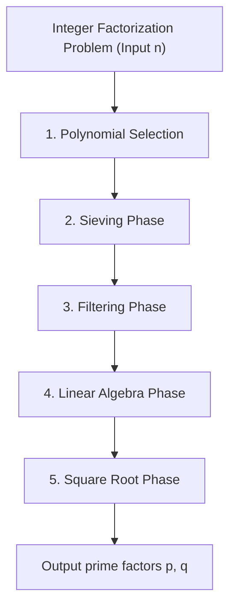
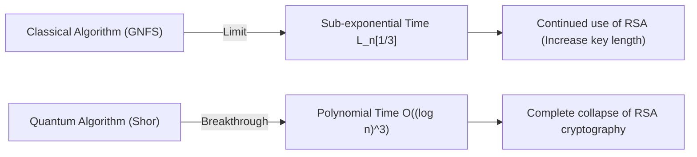

## 1. Introduction: Integer Factorization and the Foundation of Modern Cryptography

The security of internet communication in modern society heavily relies on the security of the RSA cryptosystem, a public-key encryption. And the security of RSA is based on the mathematical assumption of "the difficulty of factoring huge composite numbers". If an extremely efficient integer factorization algorithm were discovered, the world's communication infrastructure would collapse from its foundation.

Currently, the **General Number Field Sieve (GNFS)** reigns as the fastest and strongest algorithm for factoring huge integers using classical computers. GNFS was born as an extension of the Special Number Field Sieve (SNFS) proposed in the late 1980s, and to this day, it has established factorization records for huge composite numbers such as RSA-768 and RSA-250.

However, cryptographers and mathematicians always harbor the following questions: "Is there a classical algorithm that surpasses GNFS?" "Where are the limits of classical computers?" And, "How will quantum computers break through this situation?"

In this article, we thoroughly dissect the profound mathematical structures behind GNFS and conduct a detailed technical analysis of polynomial selection, the sieving phase, and the linear algebra step using the block Wiedemann method. Furthermore, we consider extension methods of GNFS such as Coppersmith's improvements, and compare and explain the decisive differences between classical sub-exponential time algorithms and quantum polynomial time algorithms from a mathematical perspective.

---

## 2. Asymptotic Complexity and L-notation

When evaluating the computational complexity of integer factorization algorithms, instead of standard polynomial time notation (such as $O(n^k)$), **L-notation** is used to express the sub-exponential time relative to the number of digits of the input $n$. L-notation is defined as follows:

$$
L_n[\alpha, c] = \exp \left( (c + o(1)) (\ln n)^\alpha (\ln \ln n)^{1-\alpha} \right)
$$

Here, $n$ is the integer to be factored, and $\ln n$ is the natural logarithm, which is proportional to the bit length of $n$.
- When $\alpha = 0$: $L_n[0, c] = \exp(c \ln \ln n) = (\ln n)^c$, representing **polynomial time** relative to the bit length.
- When $\alpha = 1$: $L_n[1, c] = \exp(c \ln n) = n^c$, representing **exponential time** relative to the bit length.
- When $0 < \alpha < 1$: It becomes **sub-exponential time**, positioned between polynomial time and exponential time.

The history of the evolution of past integer factorization algorithms has also been a history of gradually reducing this value of $\alpha$.
- **Continued Fraction Factorization (CFRAC) and Multiple Polynomial Quadratic Sieve (MPQS)**: Belong to the class of $\alpha = 1/2$, with a complexity of around $L_n[1/2, 1]$.
- **General Number Field Sieve (GNFS)**: Achieved $\alpha = 1/3$, boasting a complexity of $L_n[1/3, (64/9)^{1/3}]$, the fastest among currently known classical algorithms.

---

## 3. The Full Picture and Mathematical Structure of the GNFS Algorithm

GNFS has a very complex and advanced mathematical foundation. The basic idea is an extension of Fermat's Little Theorem and the Quadratic Sieve (QS), finding a non-trivial pair $(X, Y)$ that satisfies the congruence $X^2 \equiv Y^2 \pmod n$ and $X \not\equiv \pm Y \pmod n$, thereby deriving the factor $\gcd(X-Y, n)$ of $n$.

However, the essence of GNFS is that it does not do this only in the rational number field $\mathbb{Q}$, but simultaneously searches for "smooth numbers" in both an extension field called an Algebraic Number Field $\mathbb{Q}(\alpha)$ and the rational number field, building congruence relations through homomorphisms.

The GNFS process is broadly divided into five phases.

### 3.1 Phase 1: Polynomial Selection

The success of GNFS heavily depends on the selection of appropriate polynomials. The goal is to find two irreducible polynomials $f_1(x)$ (rational side) and $f_2(x)$ (algebraic side) that share a common root $m$. That is, it satisfies:
$f_1(m) \equiv f_2(m) \equiv 0 \pmod n$

Usually, a polynomial of degree 1 is chosen for the rational side, $f_1(x) = x - m$, and a monic polynomial of degree $d$ (typically 5 or 6) is chosen for the algebraic side, $f_2(x)$. The most classical approach is the **Base-$m$ method**.
Choose an integer $m = \lfloor n^{1/(d+1)} \rfloor$ close to the $1/(d+1)$ power of $n$, and expand $n$ in base $m$.
$n = c_d m^d + c_{d-1} m^{d-1} + \dots + c_1 m + c_0$
This gives the polynomial $f_2(x) = c_d x^d + c_{d-1} x^{d-1} + \dots + c_0$. Obviously, $f_2(m) = n \equiv 0 \pmod n$.

However, in modern implementations, **Kleinjung's algorithm** is used. This optimizes algebraic properties (Murphy's $E$ value and $\alpha$-value) while preventing the coefficients of the polynomial from becoming extremely large (optimizing skewness), exploring polynomials that are likely to generate smooth numbers during the sieving phase. A massive amount of computational resources is invested in this step alone.

### 3.2 Phase 2: Sieving Phase

Once the polynomials are determined, the algorithm enters the "Sieving" phase, which has the highest computational load. Here, we search for pairs $(a, b)$. This pair is coprime, and the following two values are simultaneously required to be "smooth".

1. **Norm on the rational side**: $F_1(a, b) = b \cdot f_1(a/b) = a - bm$
2. **Norm on the algebraic side**: $F_2(a, b) = b^d \cdot f_2(a/b)$

"Smooth" means that it can be factored only by primes up to a specified limit (Sieve bound). A prime base (Factor base) for the rational side and a prime base for the algebraic side are prepared, and smooth numbers are efficiently found over a huge search space using an approach similar to the Sieve of Eratosthenes.
Currently, a method called **Lattice Sieving** is mainstream. By fixing a specific prime $q$ and sieving only the $(a, b)$ pairs on a sublattice where both the rational side and the algebraic side become multiples of $q$, extremely high efficiency is realized.

### 3.3 Phase 3: Filtering Phase

The number of smooth relations found in the sieving phase reaches hundreds of millions to billions. However, these also contain a lot of useless information.
The purpose of filtering is to construct a huge sparse matrix while reducing its dimensions as much as possible.

Specifically, operations such as the following are performed.
- **Singleton removal**: Remove relations that contain a prime factor that appears only once.
- **Clique removal / Merging**: Multiply relations that share prime factors appearing two or more times, eliminating variables and reducing to a denser but smaller-dimensional system of equations.

As a result, a matrix with billions of rows is compressed into a huge sparse matrix $\mathbf{A}$ with tens of millions of rows (elements are 0 and 1 over the field $\mathbb{F}_2$).

### 3.4 Phase 4: Linear Algebra Phase

Here, we find a non-trivial solution vector $\mathbf{x}$ for the equation $\mathbf{A} \mathbf{x} \equiv \mathbf{0} \pmod 2$. In other words, this is the problem of finding the left nullspace of a huge sparse matrix.

Because the matrix size is extremely large, normal Gaussian elimination ($O(N^3)$) is completely impossible to compute. Therefore, an iterative method, a type of Krylov subspace method, is used. Historically, the **Block Lanczos method** has been used, but in modern distributed computing environments, the **Block Wiedemann Algorithm**, which can dramatically reduce communication overhead, is mainstream.

The Block Wiedemann method calculates the minimal polynomial from the matrix $\mathbf{A}$ and a sequence of vectors, and constructs the basis of the nullspace using the Berlekamp-Massey algorithm. This step is extremely difficult to parallelize, and is one of the biggest bottlenecks of GNFS, requiring a tightly coupled communication network of supercomputers or large-scale clusters.

### 3.5 Phase 5: Square Root Phase

From the solution of linear algebra, a product that becomes a "perfect square" is constructed on each of the rational and algebraic sides.
On the rational side, $\prod (a-bm)$ becomes the square $X^2$ of some integer $X$, and on the algebraic side, the corresponding product of ideals becomes a perfect square $\gamma^2$ over the algebraic field.
By computing this $\gamma$ over the algebraic field and applying the homomorphism $\phi: \alpha \mapsto m \pmod n$ to the ring of rational integers, the congruence:
$X^2 \equiv \phi(\gamma)^2 \equiv Y^2 \pmod n$
is obtained.

Computing the square root over the algebraic field requires deep knowledge of algebraic number theory, using complex algorithms such as **Montgomery's Method**. Finally, $\gcd(X-Y, n)$ is calculated, and if a non-trivial factor is obtained, the factorization is complete.

---

## 4. Are There Classical Algorithms Beyond GNFS?

To date, no classical algorithm has been discovered whose asymptotic complexity falls below $L_n[1/3, c]$ for the factorization of general integers. However, there are some attempts and derivative algorithms to break through theoretical and practical limits.

### 4.1 Multiple Number Field Sieve (MNFS)

As an approach extending GNFS, there is the **Multiple Number Field Sieve (MNFS)** by D. Coppersmith. While GNFS uses two polynomials (rational side and algebraic side), MNFS uses multiple different algebraic side polynomials simultaneously for a single rational side polynomial.

$$ f_1(x), f_{2,1}(x), f_{2,2}(x), \dots, f_{2,V}(x) $$

By utilizing multiple algebraic fields, the probability of "becoming smooth in any of the algebraic fields" can be dramatically increased in each sieving step. Coppersmith succeeded in slightly reducing the constant $c$ in the complexity $L_n[1/3, c]$ through this approach.
Specifically, while the constant of GNFS is $c = (64/9)^{1/3} \approx 1.923$, it has been theoretically shown that optimizing MNFS can reduce the complexity to about $c \approx 1.902$.
However, in practice, the overhead of managing multiple fields is large, and it has not yet led to a decisive breakthrough for RSA moduli on a practical scale.

### 4.2 Is an $L_n[1/4]$ Class Algorithm Possible?

Regarding the limits of classical integer factorization algorithms, a theme that has been debated among mathematicians for many years is the question, "Does an algorithm with an exponent $\alpha = 1/4$ exist?"
Current GNFS and its derivatives are strongly bound to the framework of "searching for smoothness" by sieving, and within this paradigm, it is widely believed that $\alpha = 1/3$ is the limit. Even from the analysis of the distribution probability of smooth integers using the Dickman function, it is thought that with the current combination of algebraic field construction methods and sieves, the barrier of $O(L_n[1/3])$ cannot be crossed no matter how much it is optimized.

If an $L_n[1/4]$ or even a classical polynomial-time algorithm were to exist, it would have to rely on entirely new mathematical structures that humanity currently cannot conceive of (for example, a more advanced algebraic geometry approach like Schoof's algorithm for elliptic curve cryptography), completely different from the "smoothness-based" approach like GNFS. However, there are no signs of such at present.

---

## 5. Breakthrough by Quantum Computers: Shor's Algorithm

While classical computers face the barrier of $L_n[1/3]$, **Shor's Algorithm**, published by Peter Shor in 1994, smashed this barrier by fundamentally changing the computation model itself.

### 5.1 The Impact of Quantum Polynomial Time

Shor's algorithm reduces the integer factorization problem to the "Order Finding Problem". For a certain integer $a$, it is the problem of finding the period (order) $r$ of the function $f(x) = a^x \pmod n$.
While classical computers require exponential time to find this period, by using **Quantum Phase Estimation (QPE)** and the **Quantum Fourier Transform (QFT)** on a quantum computer, it is possible to evaluate all superpositions of states in parallel and extract the period $r$ with high probability.

In terms of computational complexity, the execution time of Shor's algorithm is **quantum polynomial time**, specifically as follows:
$$ O((\log n)^3) $$
Considering recent optimized circuit implementations, it is said that it can be reduced to $O((\log n)^2 \log \log n)$.

### 5.2 Classical Sub-exponential Time vs. Quantum Polynomial Time

The difference between these two complexity classes holds decisive meaning in real-world cryptographic security.

For example, consider the case of factoring RSA-2048 (a 2048-bit composite number).
- **GNFS (Classical)**: Substituting $n \approx 2^{2048}$ into $L_n[1/3, 1.923]$, about $2^{112}$ operations are required. This is an astronomical amount of computation that would take longer than the lifespan of the universe even if all the computing resources on Earth today were mobilized.
- **Shor's Algorithm (Quantum)**: With an $O((\log n)^3)$ algorithm, about $2048^3 \approx 8.5 \times 10^9$ logical gate operations are sufficient. This means that if appropriate hardware (a universal quantum computer with millions of physical qubits and error correction capabilities) exists, the calculation could be completed in just a few hours to a few days.

The paradigm shift from the sub-exponential function of "exponent $\alpha=1/3$" to "polynomial time" neutralizes the traditional cryptographic strategy of ensuring security by increasing the key length.

---

## 6. Conclusion: Outlook for the Next Generation

The current scientific consensus on the question "Are there classical algorithms beyond GNFS?" is as follows:

1. **Practical improvements continue, but there are no asymptotic leaps**: Attempts to improve the constant term $c$ of GNFS, such as MNFS, optimization of polynomial selection, and parallelization of the Block Wiedemann method, are ongoing. However, the possibility of discovering a classical algorithm with $\alpha$ falling below $1/3$ is considered extremely low.
2. **The security of RSA on classical computers remains strong**: The computational complexity of GNFS remains enormous, and RSA-2048 and RSA-4096 will continue to maintain their security against attacks by classical computers for decades to come.
3. **The true threat is quantum algorithms**: What crossed the barrier of computational complexity was Shor's algorithm, based on the principles of quantum mechanics. As a result, the world is forced to transition to Post-Quantum Cryptography (PQC). The transition to new mathematical problems that are considered difficult to solve even for quantum computers (cannot be solved in polynomial time), such as lattice-based cryptography and hash-based cryptography, is currently at the forefront of cryptography.

The General Number Field Sieve (GNFS) is one of the "highest peaks" humanity has reached by challenging the limits of classical mathematics and algorithm design. Understanding the profound mathematical structure of GNFS is not merely learning the history of cryptanalysis, but also an intellectual journey of exploration that touches upon the beauty of computational complexity theory and algebraic number theory. Until the day quantum computers are put into practical use, GNFS will likely continue to defend its throne as the strongest integer factorization algorithm.
