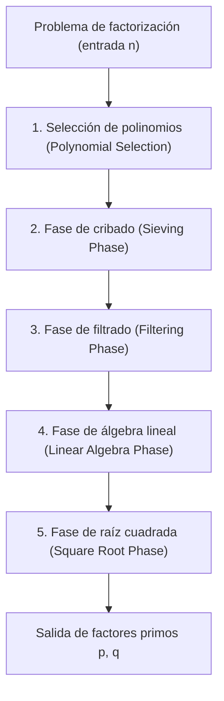
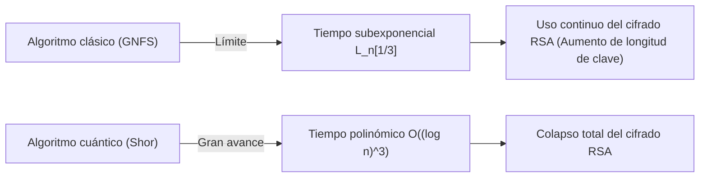

## 1. Introducción: La factorización de enteros y la base de la criptografía moderna

La seguridad de las comunicaciones por internet en la sociedad moderna depende en gran medida de la seguridad del cifrado RSA, que es un sistema de cifrado de clave pública. Y la seguridad del cifrado RSA se basa en la suposición matemática de la "dificultad de factorizar enormes números compuestos". Si se descubriera un algoritmo de factorización de enteros extremadamente eficiente, la infraestructura de comunicaciones de todo el mundo se derrumbaría desde sus cimientos.

Actualmente, en la factorización de enteros enormes utilizando ordenadores clásicos, el algoritmo más rápido y poderoso que reina es la **Criba General del Cuerpo de Números (GNFS: General Number Field Sieve)**. GNFS nació como una extensión de la Criba Especial del Cuerpo de Números (SNFS) propuesta a finales de la década de 1980, y hasta el día de hoy ha establecido récords de factorización de enormes números compuestos como RSA-768 y RSA-250.

Sin embargo, los criptógrafos y matemáticos siempre se han planteado las siguientes preguntas: "¿Existe algún algoritmo clásico que supere a GNFS?", "¿Dónde están los límites de los ordenadores clásicos?" y "¿Cómo cambiarán los ordenadores cuánticos esta situación?".

En este artículo, analizaremos en profundidad la profunda estructura matemática detrás de GNFS y realizaremos un análisis técnico detallado de la selección de polinomios, el proceso de cribado y los pasos de álgebra lineal utilizando el algoritmo de Wiedemann por bloques. Además, consideraremos los métodos de extensión de GNFS a través de las mejoras de Coppersmith y otros, y compararemos y explicaremos las diferencias decisivas entre los algoritmos clásicos de tiempo subexponencial (Sub-exponential time) y los algoritmos cuánticos de tiempo polinómico desde una perspectiva matemática.

---

## 2. Complejidad asintótica y notación L (L-notation)

Al evaluar la complejidad de los algoritmos de factorización de enteros, en lugar de utilizar la notación estándar de tiempo polinómico (como $O(n^k)$), se utiliza la **notación L (L-notation)** para expresar el tiempo subexponencial con respecto al número de dígitos de la entrada $n$. La notación L se define de la siguiente manera:

$$
L_n[\alpha, c] = \exp \left( (c + o(1)) (\ln n)^\alpha (\ln \ln n)^{1-\alpha} \right)
$$

Aquí, $n$ es el número entero a factorizar, y $\ln n$ es el logaritmo natural, el cual es proporcional a la longitud de bits de $n$.
- Caso $\alpha = 0$: $L_n[0, c] = \exp(c \ln \ln n) = (\ln n)^c$, lo que representa un **tiempo polinómico (Polynomial time)** con respecto a la longitud de bits.
- Caso $\alpha = 1$: $L_n[1, c] = \exp(c \ln n) = n^c$, lo que representa un **tiempo exponencial (Exponential time)** con respecto a la longitud de bits.
- Caso $0 < \alpha < 1$: Se sitúa entre el tiempo polinómico y el tiempo exponencial, lo que resulta en un **tiempo subexponencial (Sub-exponential time)**.

La historia de la evolución de los algoritmos de factorización de enteros ha sido también la historia de la reducción gradual de este valor $\alpha$.
- **Método de Fracciones Continuas (CFRAC) y Criba Cuadrática de Polinomios Múltiples (MPQS)**: Pertenecen a la clase de $\alpha = 1/2$, y su complejidad es de alrededor de $L_n[1/2, 1]$.
- **Criba General del Cuerpo de Números (GNFS)**: Alcanzó $\alpha = 1/3$, y cuenta con la complejidad de $L_n[1/3, (64/9)^{1/3}]$, la más rápida entre los algoritmos clásicos conocidos actualmente.

---

## 3. Visión general del algoritmo GNFS (Criba General del Cuerpo de Números) y su estructura matemática

GNFS tiene una base matemática sumamente compleja y avanzada. La idea básica se encuentra en la extensión del pequeño teorema de Fermat y la criba cuadrática (QS), y consiste en encontrar un par no trivial $(X, Y)$ que satisfaga la congruencia $X^2 \equiv Y^2 \pmod n$ y que $X \not\equiv \pm Y \pmod n$, para luego derivar un factor $\gcd(X-Y, n)$ de $n$.

Sin embargo, la esencia de GNFS es que no realiza esto solo en el cuerpo de los números racionales $\mathbb{Q}$, sino que busca simultáneamente "números suaves (Smooth numbers)" tanto en un cuerpo de extensión llamado cuerpo de números algebraicos (Algebraic Number Field) $\mathbb{Q}(\alpha)$ como en el cuerpo de los números racionales, y construye la relación de congruencia a través de un homomorfismo.

El proceso de GNFS se divide principalmente en 5 fases.

### 3.1 Fase 1: Selección de polinomios (Polynomial Selection)

El éxito de GNFS depende en gran medida de la elección adecuada de los polinomios. El objetivo es encontrar dos polinomios irreducibles, $f_1(x)$ (lado racional) y $f_2(x)$ (lado algebraico), que compartan una raíz común $m$. Es decir, satisfacen:
$f_1(m) \equiv f_2(m) \equiv 0 \pmod n$

Generalmente, para el polinomio del lado racional se elige una expresión lineal $f_1(x) = x - m$, y para el polinomio del lado algebraico $f_2(x)$ se elige un polinomio mónico de grado $d$ (típicamente 5 o 6). El enfoque más clásico es el **método de base $m$ (Base-$m$ method)**.
Se elige un entero $m = \lfloor n^{1/(d+1)} \rfloor$ que se aproxima a $n$ elevado a $1/(d+1)$, y se expande $n$ en base $m$.
$n = c_d m^d + c_{d-1} m^{d-1} + \dots + c_1 m + c_0$
De este modo, se obtiene el polinomio $f_2(x) = c_d x^d + c_{d-1} x^{d-1} + \dots + c_0$. Obviamente, $f_2(m) = n \equiv 0 \pmod n$.

Sin embargo, en las implementaciones modernas se utiliza el **algoritmo de Kleinjung**. Éste optimiza las propiedades algebraicas (como el valor $E$ de Murphy o el valor $\alpha$) evitando que los coeficientes del polinomio se vuelvan extremadamente grandes (optimización de asimetría o Skewness), y busca polinomios que faciliten la generación de números suaves en el proceso de cribado. Solamente en este paso se invierten enormes recursos computacionales.

### 3.2 Fase 2: Fase de cribado (Sieving Phase)

Una vez que se deciden los polinomios, se entra en la fase de "cribado (Sieving)", que es la que soporta la mayor carga computacional del algoritmo. Aquí se busca un par $(a, b)$. Se requiere que este par sea coprimo, y que los dos valores siguientes sean simultáneamente "suaves (Smooth)".

1. **Norma en el lado racional**: $F_1(a, b) = b \cdot f_1(a/b) = a - bm$
2. **Norma en el lado algebraico**: $F_2(a, b) = b^d \cdot f_2(a/b)$

"Suave" significa que puede ser factorizado únicamente por números primos que se encuentren por debajo de un límite especificado (Sieve bound). Se preparan una base de factores (Factor base) para el lado racional y otra para el lado algebraico, y sobre un enorme espacio de búsqueda, se descubren eficientemente los números suaves utilizando un enfoque similar a la Criba de Eratóstenes.
En la actualidad, la técnica principal es el método conocido como **criba de retículos (Lattice Sieving)**, en la cual, al fijar un número primo específico $q$, se criban únicamente los pares $(a, b)$ de una subred que hacen que tanto el lado racional como el algebraico sean múltiplos de $q$, logrando así una eficiencia extremadamente alta.

### 3.3 Fase 3: Fase de filtrado (Filtering Phase)

El número de relaciones suaves encontradas en el proceso de cribado puede alcanzar cientos o miles de millones. Sin embargo, estas también incluyen mucha información inútil.
El objetivo del filtrado es construir una enorme matriz dispersa (Sparse Matrix) y, al mismo tiempo, reducir su dimensión lo máximo posible.

Específicamente se realizan las siguientes operaciones:
- **Eliminación de relaciones únicas (Singleton removal)**: Se eliminan las relaciones que contienen factores primos que aparecen solo una vez.
- **Eliminación y fusión de clanes (Clique removal / Merging)**: Las relaciones con factores primos que aparecen dos o más veces se multiplican entre sí para eliminar variables, contrayéndolas en un sistema de ecuaciones más denso, pero de menor dimensión.

Como resultado, una matriz de miles de millones de filas se comprime a una enorme matriz dispersa $\mathbf{A}$ de unos pocos millones de filas (cuyos elementos son 0 y 1 sobre el cuerpo $\mathbb{F}_2$).

### 3.4 Fase 4: Fase de álgebra lineal (Linear Algebra Phase)

Aquí se busca un vector solución no trivial $\mathbf{x}$ de la ecuación $\mathbf{A} \mathbf{x} \equiv \mathbf{0} \pmod 2$. En otras palabras, se trata del problema de encontrar el espacio nulo izquierdo (Left Nullspace) de la enorme matriz dispersa.

Debido a que el tamaño de la matriz es extremadamente grande, es absolutamente imposible calcularlo con la eliminación Gaussiana habitual ($O(N^3)$). En su lugar, se emplean métodos iterativos que son un tipo de método de subespacio de Krylov. Históricamente, se ha utilizado el **método de Lanczos por bloques (Block Lanczos)**, pero en el entorno de computación distribuida actual, el **algoritmo de Wiedemann por bloques (Block Wiedemann Algorithm)**, que puede reducir drásticamente los cuellos de botella de la comunicación, es el predominante.

El método de Wiedemann por bloques calcula el polinomio mínimo a partir de la matriz $\mathbf{A}$ y una secuencia de vectores, y utiliza el algoritmo de Berlekamp-Massey para construir la base del espacio nulo. Este paso es sumamente difícil de paralelizar y es uno de los mayores cuellos de botella de GNFS, ya que requiere redes de comunicación estrechamente acopladas de supercomputadoras o clústeres a gran escala.

### 3.5 Fase 5: Fase de raíz cuadrada (Square Root Phase)

A partir de la solución del álgebra lineal, se construye un producto que será un "cuadrado perfecto" tanto en el lado racional como en el algebraico.
En el lado racional, el producto $\prod (a-bm)$ se convierte en el cuadrado $X^2$ de algún entero $X$, y en el lado algebraico, el producto de los ideales correspondientes se convierte en un cuadrado perfecto $\gamma^2$ sobre el cuerpo de los números algebraicos.
Al calcular este $\gamma$ en el cuerpo de los números algebraicos y aplicar el homomorfismo $\phi: \alpha \mapsto m \pmod n$ hacia el anillo de los enteros racionales, se obtiene la congruencia:
$X^2 \equiv \phi(\gamma)^2 \equiv Y^2 \pmod n$

Para el cálculo de la raíz cuadrada en el cuerpo de los números algebraicos se utilizan algoritmos complejos como el **método de Montgomery (Montgomery's Method)**, lo cual exige un profundo conocimiento de la teoría de números algebraicos. Finalmente, se calcula $\gcd(X-Y, n)$ y, si se obtiene un factor no trivial, la factorización de enteros estará completada.

---

## 4. ¿Existe un algoritmo clásico que supere a GNFS?

Hasta la fecha, no se ha descubierto ningún algoritmo clásico para la factorización de enteros generales cuya complejidad asintótica caiga por debajo de $L_n[1/3, c]$. Sin embargo, existen varios algoritmos derivados e intentos de superar los límites teóricos y prácticos.

### 4.1 Criba Múltiple del Cuerpo de Números (MNFS: Multiple Number Field Sieve)

Como un enfoque extendido de GNFS, existe la **Criba Múltiple del Cuerpo de Números (MNFS)** de D. Coppersmith. En GNFS se utilizan 2 polinomios (lado racional y lado algebraico), pero en MNFS se utilizan varios polinomios algebraicos diferentes simultáneamente contra un solo polinomio racional.

$$ f_1(x), f_{2,1}(x), f_{2,2}(x), \dots, f_{2,V}(x) $$

Al utilizar múltiples cuerpos algebraicos, se puede aumentar drásticamente la probabilidad de que "sea suave en alguno de los cuerpos algebraicos" en cada paso del cribado. Coppersmith logró reducir ligeramente la constante $c$ de la complejidad computacional $L_n[1/3, c]$ mediante este enfoque.
Específicamente, se ha demostrado teóricamente que mientras la constante de GNFS es $c = (64/9)^{1/3} \approx 1.923$, al optimizar MNFS, el costo computacional puede reducirse hasta un valor cercano a $c \approx 1.902$.
Sin embargo, en la práctica, la carga adicional (overhead) de gestionar múltiples cuerpos es enorme y no se ha logrado un avance decisivo frente al módulo RSA a una escala de aplicación práctica.

### 4.2 ¿Es posible un algoritmo de la clase $L_n[1/4]$?

Con respecto a los límites de los algoritmos clásicos de factorización de enteros, un tema largamente debatido entre los matemáticos es la pregunta: "¿Existe un algoritmo con exponente $\alpha = 1/4$?".
El actual GNFS y sus derivados están fuertemente condicionados por el marco de "búsqueda de suavidad" a través de cribas, y se cree ampliamente que dentro de este paradigma, $\alpha = 1/3$ es el límite. A partir del análisis de la probabilidad de distribución de los enteros suaves usando la función de Dickman (Dickman function), se cree que con la actual combinación de construcción de cuerpos algebraicos y cribas, sin importar cómo se optimice, no se puede superar la barrera de $O(L_n[1/3])$.

Si existiera un algoritmo de $L_n[1/4]$, o incluso un algoritmo clásico de tiempo polinómico, tendría que depender de una nueva estructura matemática completamente diferente del enfoque "basado en suavidad" como GNFS, que en la actualidad la humanidad no puede ni siquiera imaginar (por ejemplo, un enfoque geométrico-algebraico más avanzado, como el algoritmo de Schoof para la criptografía de curva elíptica). Sin embargo, por el momento, no hay indicios de ello.

---

## 5. El gran avance gracias a la computación cuántica: El algoritmo de Shor

Mientras que los ordenadores clásicos se enfrentan a la barrera de $L_n[1/3]$, el **algoritmo de Shor (Shor's Algorithm)**, presentado por Peter Shor en 1994, destruyó esta barrera al cambiar fundamentalmente el propio modelo de cálculo.

### 5.1 El impacto del tiempo polinómico cuántico

El algoritmo de Shor reduce el problema de factorización de enteros al "Problema de encontrar el orden (Order Finding Problem)". Dado cierto entero $a$, es el problema de encontrar el período (orden) $r$ de la función $f(x) = a^x \pmod n$.
Un ordenador clásico requiere un tiempo exponencial para encontrar este período, pero usando la **Estimación Cuántica de Fase (QPE: Quantum Phase Estimation)** y la **Transformada Cuántica de Fourier (QFT: Quantum Fourier Transform)** en un ordenador cuántico, se puede evaluar de forma paralela en la superposición (Superposition) de todos los estados y extraer el período $r$ con alta probabilidad.

Desde el punto de vista de la complejidad computacional, el tiempo de ejecución del algoritmo de Shor es de **tiempo polinómico cuántico**, concretamente de la siguiente manera:
$$ O((\log n)^3) $$
Teniendo en cuenta las implementaciones de circuitos optimizadas recientemente, se dice que es posible reducirlo hasta $O((\log n)^2 \log \log n)$.

### 5.2 Tiempo subexponencial clásico vs Tiempo polinómico cuántico

La diferencia entre estas dos clases de complejidad computacional tiene un significado crucial en la seguridad de la criptografía del mundo real.

Por ejemplo, considere el caso de factorizar RSA-2048 (un número compuesto de 2048 bits).
- **GNFS (Clásico)**: Al sustituir $n \approx 2^{2048}$ en $L_n[1/3, 1.923]$, se requieren aproximadamente $2^{112}$ operaciones. Esta es una cantidad astronómica de cálculos que tomaría más del tiempo de vida del universo, incluso combinando todos los recursos de computación de la Tierra en la actualidad.
- **Algoritmo de Shor (Cuántico)**: Con el algoritmo de $O((\log n)^3)$, tomaría aproximadamente $2048^3 \approx 8.5 \times 10^9$ operaciones de puertas lógicas. Esto significa que si existiera el hardware adecuado (un ordenador cuántico universal con millones de cúbits físicos y capacidad de corrección de errores), el cálculo se completaría en tan solo unas horas o unos días.

El cambio de paradigma del tiempo subexponencial de "exponente $\alpha=1/3$" al "tiempo polinómico" neutraliza la estrategia tradicional de la criptografía de garantizar la seguridad extendiendo la longitud de la clave.

---

## 6. Conclusión: Perspectivas hacia la próxima generación

El consenso actual en la comunidad científica frente a la pregunta "¿Existe algún algoritmo clásico que supere a GNFS?" es el siguiente:

1. **Las mejoras prácticas continúan, pero no hay un salto asintótico**: Los intentos de mejorar el término constante $c$ de GNFS continúan, como en el caso de MNFS, la optimización de la selección de polinomios y la paralelización del algoritmo de Wiedemann por bloques. Sin embargo, se considera que la posibilidad de descubrir un algoritmo clásico que caiga por debajo de $\alpha = 1/3$ es extremadamente baja.
2. **La seguridad de RSA en ordenadores clásicos sigue siendo robusta**: La complejidad computacional de GNFS sigue siendo inmensa, y RSA-2048 y RSA-4096 seguirán siendo seguros frente a ataques a través de ordenadores clásicos durante las próximas décadas.
3. **La verdadera amenaza es el algoritmo cuántico**: El que ha cruzado la barrera de la complejidad computacional es el algoritmo de Shor, basado en los principios de la mecánica cuántica. Debido a esto, el mundo se está viendo obligado a migrar hacia la criptografía poscuántica (PQC: Post-Quantum Cryptography). La vanguardia de la criptografía actual consiste en la transición a nuevos problemas matemáticos, como la criptografía basada en retículos y la criptografía basada en hash, que se consideran difíciles de descifrar (imposibles de resolver en tiempo polinómico) incluso para los ordenadores cuánticos.

La Criba General del Cuerpo de Números (GNFS) es uno de los "mayores logros" alcanzados por la humanidad al desafiar los límites de las matemáticas clásicas y el diseño de algoritmos. Comprender la profunda estructura matemática de GNFS no es solo aprender sobre la historia del criptoanálisis, sino que también es un viaje de exploración intelectual para entrar en contacto con la belleza de la teoría de la complejidad computacional y la teoría de los números algebraicos. Hasta el día en que los ordenadores cuánticos se implementen de forma práctica, GNFS seguramente seguirá defendiendo su trono como el algoritmo de factorización de enteros más poderoso.

