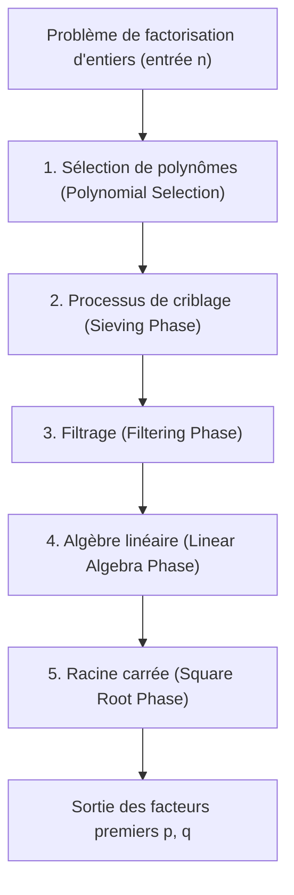
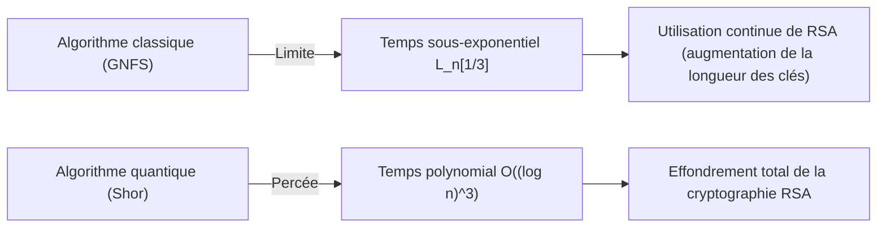

## 1. Introduction : La factorisation d'entiers et le fondement de la cryptographie moderne

La sécurité des communications sur Internet dans la société moderne dépend fortement de la sécurité de la cryptographie à clé publique RSA. La sécurité de RSA repose sur l'hypothèse mathématique de la « difficulté de factoriser d'énormes nombres composés ». Si un algorithme de factorisation extrêmement efficace était découvert, l'infrastructure de communication mondiale s'effondrerait depuis ses fondations.

Actuellement, dans la factorisation d'entiers gigantesques à l'aide d'ordinateurs classiques, l'algorithme qui règne en tant que plus rapide et plus puissant est le **Crible général du corps de nombres (GNFS : General Number Field Sieve)**. GNFS est né en tant qu'extension du crible spécial du corps de nombres (SNFS) proposé à la fin des années 1980, et jusqu'à aujourd'hui, il a établi des records de factorisation pour des nombres composés énormes tels que RSA-768 et RSA-250.

Cependant, les cryptographes et les mathématiciens se posent constamment les questions suivantes : « Existe-t-il un algorithme classique surpassant GNFS ? », « Où se situent les limites des ordinateurs classiques ? » et « Comment les ordinateurs quantiques vont-ils surmonter cette situation ? »

Cet article dissèque de manière approfondie la structure mathématique profonde derrière GNFS, et fournit une analyse technique détaillée de la sélection de polynômes, du processus de criblage et de l'étape d'algèbre linéaire via la méthode par blocs de Wiedemann. En outre, il examine les méthodes d'extension de GNFS, comme l'amélioration de Coppersmith, et compare et explique les différences cruciales entre les algorithmes classiques en temps sous-exponentiel (Sub-exponential time) et les algorithmes quantiques en temps polynomial d'un point de vue mathématique.

---

## 2. Complexité asymptotique et notation L (L-notation)

Lors de l'évaluation de la complexité des algorithmes de factorisation, au lieu de la notation standard en temps polynomial (comme $O(n^k)$), on utilise la **notation L (L-notation)** pour exprimer le temps sous-exponentiel par rapport au nombre de chiffres de l'entrée $n$. La notation L est définie comme suit :

$$
L_n[\alpha, c] = \exp \left( (c + o(1)) (\ln n)^\alpha (\ln \ln n)^{1-\alpha} \right)
$$

Où $n$ est l'entier à factoriser, et $\ln n$ est le logarithme népérien, qui est proportionnel à la longueur en bits de $n$.
- Lorsque $\alpha = 0$ : $L_n[0, c] = \exp(c \ln \ln n) = (\ln n)^c$, ce qui représente un **temps polynomial (Polynomial time)** par rapport à la longueur en bits.
- Lorsque $\alpha = 1$ : $L_n[1, c] = \exp(c \ln n) = n^c$, ce qui représente un **temps exponentiel (Exponential time)** par rapport à la longueur en bits.
- Lorsque $0 < \alpha < 1$ : Cela devient un **temps sous-exponentiel (Sub-exponential time)**, situé entre le temps polynomial et le temps exponentiel.

L'histoire de l'évolution des algorithmes de factorisation du passé a également été l'histoire de la réduction progressive de la valeur de cet $\alpha$.
- **Méthode des fractions continues (CFRAC) et crible quadratique à polynômes multiples (MPQS)** : Appartiennent à la classe $\alpha = 1/2$, avec une complexité d'environ $L_n[1/2, 1]$.
- **Crible général du corps de nombres (GNFS)** : Atteint $\alpha = 1/3$, et s'enorgueillit de la complexité la plus rapide parmi les algorithmes classiques connus à ce jour, qui est de $L_n[1/3, (64/9)^{1/3}]$.

---

## 3. L'algorithme complet et la structure mathématique de GNFS

GNFS possède des fondations mathématiques extrêmement complexes et avancées. L'idée de base s'inscrit dans la continuité du petit théorème de Fermat et du crible quadratique (QS), qui consiste à trouver des paires non triviales $(X, Y)$ satisfaisant la congruence $X^2 \equiv Y^2 \pmod n$ et $X \not\equiv \pm Y \pmod n$, pour en déduire un facteur de $n$, $\gcd(X-Y, n)$.

Cependant, l'essence de GNFS réside dans le fait qu'il n'effectue pas cela uniquement dans le corps des nombres rationnels $\mathbb{Q}$, mais qu'il recherche simultanément des « nombres friables (Smooth numbers) » à la fois dans un corps d'extension $\mathbb{Q}(\alpha)$ appelé corps de nombres algébriques (Algebraic Number Field) et dans le corps des rationnels, et construit des relations de congruence par le biais d'homomorphismes.

Le processus de GNFS est divisé en 5 phases principales.

### 3.1 Phase 1 : Sélection de polynômes (Polynomial Selection)

Le succès de GNFS dépend fortement de la sélection de polynômes appropriés. L'objectif est de trouver deux polynômes irréductibles ayant une racine commune $m$ : $f_1(x)$ (côté rationnel) et $f_2(x)$ (côté algébrique). C'est-à-dire qu'ils satisfont :
$f_1(m) \equiv f_2(m) \equiv 0 \pmod n$

Généralement, on choisit un polynôme de degré 1, $f_1(x) = x - m$, pour le côté rationnel, et un polynôme unitaire de degré $d$ (typiquement 5 ou 6) pour le polynôme côté algébrique $f_2(x)$. L'approche la plus classique est la **méthode de la Base-$m$**.
On choisit un entier $m = \lfloor n^{1/(d+1)} \rfloor$ proche de la puissance $1/(d+1)$ de $n$, et on développe $n$ en base $m$.
$n = c_d m^d + c_{d-1} m^{d-1} + \dots + c_1 m + c_0$
On obtient ainsi le polynôme $f_2(x) = c_d x^d + c_{d-1} x^{d-1} + \dots + c_0$. Évidemment, on a $f_2(m) = n \equiv 0 \pmod n$.

Cependant, dans les implémentations modernes, on utilise l'**algorithme de Kleinjung**. Celui-ci évite que les coefficients des polynômes ne deviennent trop grands (optimisation du Skewness) tout en optimisant les propriétés algébriques (valeur $E$ de Murphy et valeur $\alpha$), cherchant ainsi des polynômes susceptibles de générer facilement des nombres friables lors de la phase de criblage. Rien que pour cette étape, d'importantes ressources de calcul sont mobilisées.

### 3.2 Phase 2 : Processus de criblage (Sieving Phase)

Une fois les polynômes déterminés, l'algorithme entre dans la phase de « criblage (Sieving) », qui est la plus gourmande en calculs. Ici, on recherche des paires $(a, b)$. Ces paires doivent être premières entre elles, et il est requis que les deux valeurs suivantes soient simultanément « friables (Smooth) » :

1. **Norme du côté rationnel** : $F_1(a, b) = b \cdot f_1(a/b) = a - bm$
2. **Norme du côté algébrique** : $F_2(a, b) = b^d \cdot f_2(a/b)$

« Friable » signifie qu'elles ne peuvent être factorisées qu'avec des nombres premiers inférieurs ou égaux à une limite spécifiée (Sieve bound). On prépare une base de facteurs (Factor base) pour le côté rationnel et une autre pour le côté algébrique, et on trouve efficacement les nombres friables sur un vaste espace de recherche à la manière du crible d'Ératosthène.
Aujourd'hui, une méthode appelée **crible par réseaux (Lattice Sieving)** est dominante. En fixant un certain nombre premier $q$, et en ne criblant que les paires $(a, b)$ sur un sous-réseau où les côtés rationnel et algébrique sont tous deux des multiples de $q$, on atteint une efficacité extrêmement élevée.

### 3.3 Phase 3 : Filtrage (Filtering Phase)

Le nombre de relations (relations) friables trouvées lors du processus de criblage s'élève à des centaines de millions, voire des milliards. Cependant, celles-ci contiennent également beaucoup d'informations inutiles.
Le but du filtrage est de construire une énorme matrice creuse (Sparse Matrix) tout en réduisant ses dimensions autant que possible.

Plus précisément, les opérations suivantes sont effectuées :
- **Suppression des singletons (Singleton removal)** : Suppression des relations contenant un facteur premier qui n'apparaît qu'une seule fois.
- **Suppression/Fusion de cliques (Clique removal / Merging)** : Multiplication entre elles de relations ayant des facteurs premiers apparaissant deux fois ou plus, afin d'éliminer des variables et de réduire à un système d'équations plus dense, mais de dimension plus petite.

Grâce à cela, une matrice de milliards de lignes est compressée en une énorme matrice creuse $\mathbf{A}$ de dizaines de millions de lignes (dont les éléments sont des 0 et des 1 sur le corps $\mathbb{F}_2$).

### 3.4 Phase 4 : Algèbre linéaire (Linear Algebra Phase)

Ici, on trouve un vecteur solution non trivial $\mathbf{x}$ de l'équation $\mathbf{A} \mathbf{x} \equiv \mathbf{0} \pmod 2$. Autrement dit, c'est le problème de trouver l'espace nul à gauche (Left Nullspace) d'une énorme matrice creuse.

Étant donné que la taille de la matrice est extrêmement grande, il est absolument impossible de la calculer avec l'élimination de Gauss habituelle ($O(N^3)$). Par conséquent, des méthodes itératives, qui sont un type de méthode de sous-espace de Krylov, sont utilisées. Historiquement, la **méthode par blocs de Lanczos (Block Lanczos)** était utilisée, mais dans les environnements informatiques distribués actuels, la **méthode par blocs de Wiedemann (Block Wiedemann Algorithm)**, qui permet de réduire considérablement la surcharge de communication, prédomine.

La méthode par blocs de Wiedemann calcule un polynôme minimal à partir de la matrice $\mathbf{A}$ et d'une séquence de vecteurs, et utilise l'algorithme de Berlekamp-Massey pour construire une base de l'espace nul. Cette étape est très difficile à paralléliser et constitue l'un des plus plus grands goulots d'étranglement de GNFS, exigeant des superordinateurs ou des réseaux de communication étroitement couplés de grands clusters.

### 3.5 Phase 5 : Racine carrée (Square Root Phase)

À partir des solutions de l'algèbre linéaire, on construit des produits qui sont des « carrés parfaits » pour chacun des côtés rationnel et algébrique.
Du côté rationnel, $\prod (a-bm)$ devient le carré $X^2$ d'un certain entier $X$, et du côté algébrique, le produit des idéaux correspondants devient un carré parfait $\gamma^2$ sur le corps de nombres algébriques.
En calculant ce $\gamma$ sur le corps de nombres algébriques et en appliquant l'homomorphisme $\phi: \alpha \mapsto m \pmod n$ vers l'anneau des entiers rationnels, on obtient la congruence :
$X^2 \equiv \phi(\gamma)^2 \equiv Y^2 \pmod n$

Pour calculer la racine carrée sur le corps de nombres algébriques, des algorithmes complexes tels que la **méthode de Montgomery (Montgomery's Method)** sont utilisés, ce qui nécessite des connaissances approfondies en théorie algébrique des nombres. Enfin, en calculant $\gcd(X-Y, n)$, et si un facteur non trivial est obtenu, la factorisation est terminée.

---

## 4. Existe-t-il un algorithme classique surpassant GNFS ?

À ce jour, aucun algorithme classique avec une complexité asymptotique inférieure à $L_n[1/3, c]$ pour la factorisation d'entiers généraux n'a été découvert. Cependant, il existe plusieurs tentatives et algorithmes dérivés pour franchir les limites théoriques et pratiques.

### 4.1 Crible multiple du corps de nombres (MNFS: Multiple Number Field Sieve)

Comme approche étendant GNFS, on trouve le **crible multiple du corps de nombres (MNFS)** par D. Coppersmith. Alors que GNFS utilise deux polynômes (côté rationnel et côté algébrique), MNFS utilise simultanément plusieurs polynômes différents du côté algébrique pour un seul polynôme du côté rationnel.

$$ f_1(x), f_{2,1}(x), f_{2,2}(x), \dots, f_{2,V}(x) $$

En utilisant plusieurs corps algébriques, la probabilité de devenir « friable dans l'un des corps algébriques » à chaque étape de criblage peut être considérablement augmentée. Avec cette approche, Coppersmith a réussi à réduire légèrement la constante $c$ de la complexité $L_n[1/3, c]$.
Concrètement, alors que la constante de GNFS est $c = (64/9)^{1/3} \approx 1.923$, il a été théoriquement démontré qu'en optimisant MNFS, la complexité pouvait être réduite à environ $c \approx 1.902$.
Cependant, dans la pratique, la surcharge due à la gestion de corps multiples est importante, et cela n'a pas conduit à une percée décisive pour les modules RSA à l'échelle pratique.

### 4.2 Des algorithmes de la classe $L_n[1/4]$ sont-ils possibles ?

Concernant les limites des algorithmes classiques de factorisation d'entiers, un thème longuement débattu parmi les mathématiciens est la question : « Existe-t-il un algorithme d'exposant $\alpha = 1/4$ ? ».
Le GNFS actuel et ses dérivés sont fortement liés au cadre de « recherche de friabilité » par le criblage, et il est largement admis qu'au sein de ce paradigme, $\alpha = 1/3$ est la limite. D'après l'analyse de la probabilité de distribution des entiers friables à l'aide de la fonction de Dickman, on pense qu'il est impossible de franchir le mur de $O(L_n[1/3])$, quelle que soit l'optimisation, avec la combinaison actuelle de construction de corps algébriques et de criblage.

S'il existait un algorithme en $L_n[1/4]$, ou même un algorithme classique en temps polynomial, il devrait dépendre d'une nouvelle structure mathématique totalement différente des approches basées sur la « friabilité » comme GNFS, et actuellement impensable pour l'humanité (par exemple, une approche de géométrie algébrique plus avancée comme l'algorithme de Schoof pour la cryptographie sur les courbes elliptiques). Cependant, il n'y a pour le moment aucun signe de cela.

---

## 5. La percée par les ordinateurs quantiques : l'algorithme de Shor

Alors que les ordinateurs classiques font face au mur du $L_n[1/3]$, c'est l'**algorithme de Shor (Shor's Algorithm)**, publié en 1994 par Peter Shor, qui a brisé ce mur en changeant fondamentalement le modèle de calcul lui-même.

### 5.1 Le choc du temps quantique polynomial

L'algorithme de Shor réduit le problème de la factorisation d'entiers au « problème de la recherche de l'ordre (Order Finding Problem) ». Pour un entier donné $a$, il s'agit de trouver la période (ordre) $r$ de la fonction $f(x) = a^x \pmod n$.
Bien qu'un ordinateur classique nécessite un temps exponentiel pour trouver cette période, en utilisant l'**estimation de phase quantique (QPE : Quantum Phase Estimation)** et la **transformée de Fourier quantique (QFT : Quantum Fourier Transform)** sur un ordinateur quantique, il est possible d'évaluer en parallèle une superposition de tous les états (Superposition) et d'extraire la période $r$ avec une forte probabilité.

En termes de complexité, le temps d'exécution de l'algorithme de Shor est un **temps quantique polynomial**, plus précisément comme suit :
$$ O((\log n)^3) $$
Compte tenu des implémentations de circuits optimisées récentes, on considère que cela peut être réduit à $O((\log n)^2 \log \log n)$.

### 5.2 Temps sous-exponentiel classique vs Temps polynomial quantique

La différence entre ces deux classes de complexité a une signification décisive pour la sécurité cryptographique dans le monde réel.

Prenons l'exemple de la factorisation de RSA-2048 (un nombre composé de 2048 bits).
- **GNFS (Classique)** : En substituant $n \approx 2^{2048}$ dans $L_n[1/3, 1.923]$, il faut environ $2^{112}$ opérations. Il s'agit d'une quantité astronomique de calculs qui prendrait plus de temps que l'âge de l'univers, même en rassemblant toutes les ressources informatiques actuelles sur Terre.
- **Algorithme de Shor (Quantique)** : Avec un algorithme en $O((\log n)^3)$, il suffit d'environ $2048^3 \approx 8.5 \times 10^9$ opérations de portes logiques. Cela signifie que si le matériel approprié (un ordinateur quantique universel avec des millions de qubits physiques et des capacités de correction d'erreurs) existait, le calcul serait terminé en quelques heures à quelques jours seulement.

Le changement de paradigme passant d'une fonction sous-exponentielle avec un « exposant $\alpha=1/3$ » à un « temps polynomial » neutralise la stratégie traditionnelle de la cryptographie qui consiste à garantir la sécurité en augmentant la longueur de la clé.

---

## 6. Conclusion : Perspectives pour la prochaine génération

Le consensus actuel de la communauté scientifique concernant la question « Existe-t-il un algorithme classique surpassant GNFS ? » est le suivant :

1. **Les améliorations pratiques se poursuivront, mais il n'y a pas de saut asymptotique** : Les tentatives pour améliorer le terme constant $c$ de GNFS, telles que le MNFS, l'optimisation de la sélection de polynômes, ou la parallélisation de la méthode par blocs de Wiedemann, se poursuivent. Cependant, la probabilité de découvrir un algorithme classique descendant en dessous de $\alpha = 1/3$ est considérée comme extrêmement faible.
2. **La sécurité de RSA sur les ordinateurs classiques reste forte** : La complexité de GNFS reste énorme, et RSA-2048 ainsi que RSA-4096 continueront de maintenir leur sécurité contre les attaques par des ordinateurs classiques pour les décennies à venir.
3. **La véritable menace vient des algorithmes quantiques** : C'est l'algorithme de Shor, basé sur les principes de la mécanique quantique, qui a franchi le mur de la complexité computationnelle. De ce fait, le monde est contraint de faire la transition vers la cryptographie post-quantique (PQC : Post-Quantum Cryptography). La transition vers de nouveaux problèmes mathématiques considérés comme difficiles à résoudre (impossibles à résoudre en temps polynomial) même pour les ordinateurs quantiques, tels que la cryptographie sur les réseaux euclidiens ou la cryptographie basée sur les hachages, constitue la frontière actuelle de la cryptographie.

Le crible général du corps de nombres (GNFS) est l'un des « points culminants » atteints par l'humanité après avoir défié les limites des mathématiques classiques et de la conception d'algorithmes. Comprendre la structure mathématique profonde de GNFS n'est pas seulement apprendre l'histoire de la cryptanalyse, mais c'est aussi un voyage d'exploration intellectuelle touchant à la beauté de la théorie de la complexité algorithmique et de la théorie algébrique des nombres. Jusqu'au jour où les ordinateurs quantiques seront mis en pratique, GNFS continuera très probablement de défendre son trône de plus puissant algorithme de factorisation d'entiers.
