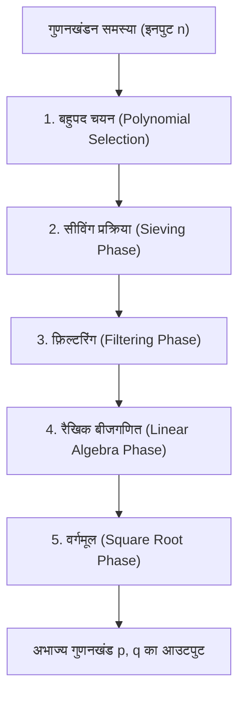
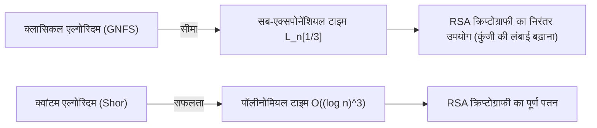

## 1. परिचय: पूर्णांक गुणनखंडन और आधुनिक क्रिप्टोग्राफी का आधार

आधुनिक समाज में इंटरनेट संचार की सुरक्षा काफी हद तक सार्वजनिक-कुंजी क्रिप्टोग्राफी, RSA के सुरक्षित होने पर निर्भर करती है। और RSA क्रिप्टोग्राफी की सुरक्षा "विशाल भाज्य संख्याओं के गुणनखंडन की कठिनाई" की गणितीय धारणा पर आधारित है। यदि एक अत्यंत कुशल गुणनखंडन एल्गोरिदम खोजा जाता है, तो दुनिया भर का संचार बुनियादी ढांचा मूल रूप से ढह जाएगा।

वर्तमान में, क्लासिकल कंप्यूटर का उपयोग करके बड़े पूर्णांकों के गुणनखंडन के लिए सबसे तेज़ और सबसे शक्तिशाली एल्गोरिदम **जनरल नंबर फील्ड सीव (GNFS: General Number Field Sieve)** है। GNFS का जन्म 1980 के दशक के अंत में प्रस्तावित स्पेशल नंबर फील्ड सीव (SNFS) के विस्तार के रूप में हुआ था, और आज तक इसने RSA-768 और RSA-250 जैसी विशाल भाज्य संख्याओं के गुणनखंडन के रिकॉर्ड बनाए हैं।

हालाँकि, क्रिप्टोग्राफ़र और गणितज्ञ हमेशा निम्नलिखित प्रश्न पूछते हैं: "क्या GNFS से परे कोई क्लासिकल एल्गोरिदम मौजूद है?", "क्लासिकल कंप्यूटर की सीमाएँ कहाँ हैं?", और "क्वांटम कंप्यूटर इस स्थिति को कैसे तोड़ेंगे?"

इस लेख में, हम GNFS के पीछे की गहरी गणितीय संरचना का पूरी तरह से विश्लेषण करेंगे और बहुपद चयन (polynomial selection), सीविंग प्रक्रिया (sieving processing), और ब्लॉक वीडमैन (Block Wiedemann) विधि का उपयोग करके रैखिक बीजगणित (linear algebra) चरणों जैसे विस्तृत तकनीकी विश्लेषण करेंगे। इसके अलावा, हम कॉपरस्मिथ (Coppersmith) के सुधारों के माध्यम से GNFS की विस्तार विधियों पर विचार करेंगे, और गणितीय दृष्टिकोण से क्लासिकल सब-एक्सपोनेंशियल टाइम (Sub-exponential time) एल्गोरिदम और क्वांटम पॉलीनोमियल टाइम (Polynomial time) एल्गोरिदम के बीच महत्वपूर्ण अंतर की तुलना और व्याख्या करेंगे।

---

## 2. एसिम्प्टोटिक कॉम्प्लेक्सिटी और L-नोटेशन (L-notation)

गुणनखंडन एल्गोरिदम की जटिलता का मूल्यांकन करते समय, मानक पॉलीनोमियल टाइम नोटेशन ($O(n^k)$ आदि) के बजाय इनपुट $n$ के अंकों की संख्या के सापेक्ष सब-एक्सपोनेंशियल समय को व्यक्त करने के लिए **L-नोटेशन (L-notation)** का उपयोग किया जाता है। L-नोटेशन को इस प्रकार परिभाषित किया गया है:

$$
L_n[\alpha, c] = \exp \left( (c + o(1)) (\ln n)^\alpha (\ln \ln n)^{1-\alpha} \right)
$$

जहाँ, $n$ वह पूर्णांक है जिसका गुणनखंड किया जाना है, और $\ln n$ प्राकृतिक लघुगणक (natural logarithm) है जो $n$ की बिट लंबाई के आनुपातिक है।
- $\alpha = 0$ के मामले में: $L_n[0, c] = \exp(c \ln \ln n) = (\ln n)^c$ होता है, जो बिट लंबाई के सापेक्ष **पॉलीनोमियल टाइम (Polynomial time)** को दर्शाता है।
- $\alpha = 1$ के मामले में: $L_n[1, c] = \exp(c \ln n) = n^c$ होता है, जो बिट लंबाई के सापेक्ष **एक्सपोनेंशियल टाइम (Exponential time)** को दर्शाता है।
- $0 < \alpha < 1$ के मामले में: यह पॉलीनोमियल टाइम और एक्सपोनेंशियल टाइम के बीच स्थित **सब-एक्सपोनेंशियल टाइम (Sub-exponential time)** है।

अतीत में गुणनखंडन एल्गोरिदम का विकास धीरे-धीरे इस $\alpha$ के मान को कम करने का इतिहास रहा है।
- **कंटीन्यूड फ्रैक्शन मेथड (CFRAC) और मल्टीपल पॉलीनोमियल क्वाड्रेटिक सीव (MPQS)**: ये $\alpha = 1/2$ वर्ग से संबंधित हैं, और जटिलता लगभग $L_n[1/2, 1]$ है।
- **जनरल नंबर फील्ड सीव (GNFS)**: इसने $\alpha = 1/3$ हासिल किया, और वर्तमान में ज्ञात क्लासिकल एल्गोरिदम में सबसे तेज़ $L_n[1/3, (64/9)^{1/3}]$ की जटिलता का दावा करता है।

---

## 3. GNFS (जनरल नंबर फील्ड सीव) का संपूर्ण एल्गोरिदम और गणितीय संरचना

GNFS का गणितीय आधार बहुत ही जटिल और उन्नत है। मूल विचार फर्मेट के लिटिल थ्योरम (Fermat's Little Theorem) और क्वाड्रेटिक सीव (QS) का विस्तार है, और सर्वांगसमता (congruence) $X^2 \equiv Y^2 \pmod n$ को संतुष्ट करने वाले और $X \not\equiv \pm Y \pmod n$ होने वाले गैर-तुच्छ (non-trivial) जोड़े $(X, Y)$ को खोजकर $n$ का गुणनखंड $\gcd(X-Y, n)$ प्राप्त करना है।

हालाँकि, GNFS का सार यह है कि यह केवल परिमेय संख्या क्षेत्र (rational number field) $\mathbb{Q}$ में ऐसा नहीं करता है, बल्कि एक साथ परिमेय संख्या क्षेत्र और बीजगणितीय संख्या क्षेत्र (Algebraic Number Field) नामक विस्तार क्षेत्र $\mathbb{Q}(\alpha)$ दोनों में "स्मूद नंबर्स (Smooth numbers)" की खोज करता है, और होमोमोर्फिज्म (homomorphism) के माध्यम से सर्वांगसम संबंध बनाता है।

GNFS की प्रक्रिया मोटे तौर पर 5 चरणों में विभाजित है।

### 3.1 चरण 1: बहुपद चयन (Polynomial Selection)

GNFS की सफलता बहुत हद तक उपयुक्त बहुपदों के चयन पर निर्भर करती है। लक्ष्य दो इरेड्यूसिबल बहुपदों (irreducible polynomials) $f_1(x)$ (परिमेय पक्ष) और $f_2(x)$ (बीजगणितीय पक्ष) को खोजना है जिनका एक उभयनिष्ठ मूल $m$ हो। अर्थात,
$f_1(m) \equiv f_2(m) \equiv 0 \pmod n$
को संतुष्ट करता हो।

आमतौर पर, परिमेय पक्ष के बहुपद के लिए 1-डिग्री व्यंजक $f_1(x) = x - m$ चुना जाता है, और बीजगणितीय पक्ष के बहुपद $f_2(x)$ के लिए डिग्री $d$ (आमतौर কাহিনী 5 या 6) का एक मोनिक बहुपद चुना जाता है। सबसे क्लासिकल दृष्टिकोण **Base-$m$ विधि** है।
$n$ की घात $1/(d+1)$ के करीब एक पूर्णांक $m = \lfloor n^{1/(d+1)} \rfloor$ चुना जाता है, और $n$ का बेस-$m$ विस्तार किया जाता है।
$n = c_d m^d + c_{d-1} m^{d-1} + \dots + c_1 m + c_0$
इससे, हमें बहुपद $f_2(x) = c_d x^d + c_{d-1} x^{d-1} + \dots + c_0$ प्राप्त होता है। स्पष्ट रूप से $f_2(m) = n \equiv 0 \pmod n$ होता है।

हालाँकि, आधुनिक कार्यान्वयन में **Kleinjung का एल्गोरिदम** उपयोग किया जाता है। यह बहुपदों के गुणांकों (coefficients) को अत्यधिक बड़ा होने से रोकता है (Skewness का अनुकूलन), बीजगणितीय गुणों (Murphy's $E$ value और $\alpha$-value) को अनुकूलित करता है, और ऐसे बहुपदों की खोज करता है जो सीविंग प्रक्रिया में आसानी से स्मूद नंबर उत्पन्न करते हैं। अकेले इस चरण में बहुत सारे कम्प्यूटेशनल संसाधन लगाए जाते हैं।

### 3.2 चरण 2: सीविंग प्रक्रिया (Sieving Phase)

बहुपद निर्धारित होने के बाद, यह एल्गोरिदम के सबसे अधिक कम्प्यूटेशनल रूप से भारी "सीव (Sieving)" चरण में प्रवेश करता है। यहाँ, युग्म $(a, b)$ खोजा जाता है। यह युग्म को-प्राइम (coprime) होना चाहिए, और निम्नलिखित दो मानों का एक साथ "स्मूद (Smooth)" होना आवश्यक है:

1. **परिमेय पक्ष का मानदंड (Norm on rational side)**: $F_1(a, b) = b \cdot f_1(a/b) = a - bm$
2. **बीजगणितीय पक्ष का मानदंड (Norm on algebraic side)**: $F_2(a, b) = b^d \cdot f_2(a/b)$

"स्मूद" होने का अर्थ है कि इसे केवल एक निर्दिष्ट ऊपरी सीमा (Sieve bound) या उससे छोटे अभाज्य संख्याओं द्वारा ही गुणनखंडित किया जा सकता है। परिमेय पक्ष के लिए एक फैक्टर बेस (Factor base) और बीजगणितीय पक्ष के लिए एक फैक्टर बेस तैयार किया जाता है, और इरेटोस्थनीज की छलनी (Sieve of Eratosthenes) की तरह एक विशाल खोज स्थान पर कुशलता से स्मूद नंबर खोजे जाते हैं।
वर्तमान में, **लैटिस सीविंग (Lattice Sieving)** नामक तकनीक मुख्यधारा है, जहाँ एक विशिष्ट अभाज्य संख्या $q$ को तय किया जाता है, और केवल उस सब-लैटिस (sub-lattice) पर $(a, b)$ युग्मों को सीव किया जाता है जहाँ परिमेय और बीजगणितीय दोनों पक्ष $q$ के गुणज हों, जिससे अत्यधिक उच्च दक्षता प्राप्त होती है।

### 3.3 चरण 3: फ़िल्टरिंग (Filtering Phase)

सीविंग प्रक्रिया में पाए गए स्मूद संबंधों (रिलेशन) की संख्या करोड़ों या अरबों में होती है। हालाँकि, इनमें बहुत सारी बेकार जानकारी भी शामिल होती है।
फ़िल्टरिंग का उद्देश्य एक विशाल विरल मैट्रिक्स (Sparse Matrix) का निर्माण करना है और साथ ही इसके आयाम (dimension) को जितना संभव हो उतना छोटा करना है।

विशेष रूप से, निम्नलिखित ऑपरेशन किए जाते हैं:
- **Singleton removal**: उन रिलेशन को हटा दें जिनमें केवल एक बार आने वाला अभाज्य गुणनखंड शामिल हो।
- **Clique removal / Merging**: दो या अधिक बार आने वाले अभाज्य गुणनखंडों वाले रिलेशन को एक साथ गुणा करें, चरों (variables) को समाप्त करें, और उन्हें एक उच्च घनत्व वाले लेकिन छोटे आयाम के समीकरण प्रणाली में कम करें।

इसके परिणामस्वरूप, अरबों पंक्तियों का मैट्रिक्स कुछ करोड़ पंक्तियों के एक विशाल विरल मैट्रिक्स $\mathbf{A}$ (जिसके तत्व फील्ड $\mathbb{F}_2$ पर 0 और 1 हैं) में संकुचित हो जाता है।

### 3.4 चरण 4: रैखिक बीजगणित (Linear Algebra Phase)

यहाँ, हम समीकरण $\mathbf{A} \mathbf{x} \equiv \mathbf{0} \pmod 2$ का एक गैर-तुच्छ (non-trivial) समाधान वेक्टर $\mathbf{x}$ खोजते हैं। दूसरे शब्दों में, यह विशाल विरल मैट्रिक्स के लेफ्ट नलस्पेस (Left Nullspace) को खोजने की समस्या है।

चूँकि मैट्रिक्स का आकार अत्यंत बड़ा है, सामान्य गाऊसीयन एलिमिनेशन (Gaussian elimination) ($O(N^3)$) के साथ इसकी गणना करना असंभव है। इसलिए, क्रिलोव सबस्पेस विधि (Krylov subspace method) का एक प्रकार, पुनरावृत्तीय विधि (iterative method) का उपयोग किया जाता है। ऐतिहासिक रूप से, **ब्लॉक लैंक्ज़ोस विधि (Block Lanczos)** का उपयोग किया गया है, लेकिन वर्तमान वितरित कंप्यूटिंग (distributed computing) वातावरण में, **ब्लॉक वीडमैन विधि (Block Wiedemann Algorithm)** मुख्यधारा है, जो संचार ओवरहेड को नाटकीय रूप से कम कर सकती है।

ब्लॉक वीडमैन विधि मैट्रिक्स $\mathbf{A}$ और वेक्टर अनुक्रम से न्यूनतम बहुपद की गणना करती है, और नलस्पेस के आधार (basis) के निर्माण के लिए बर्लेकैम्प-मैसी (Berlekamp-Massey) एल्गोरिदम का उपयोग करती है। इस चरण को समानांतर (parallelize) करना बहुत मुश्किल है, और यह GNFS की सबसे बड़ी अड़चनों (bottlenecks) में से एक है, जिसके लिए सुपर कंप्यूटर या बड़े क्लस्टर के कसकर युग्मित (tightly coupled) संचार नेटवर्क की आवश्यकता होती है।

### 3.5 चरण 5: वर्गमूल (Square Root Phase)

रैखिक बीजगणित के समाधान से, परिमेय पक्ष और बीजगणितीय पक्ष दोनों पर "पूर्ण वर्ग (perfect square)" बनने वाले गुणनफल (products) का निर्माण किया जाता है।
परिमेय पक्ष पर, $\prod (a-bm)$ एक पूर्णांक $X$ का वर्ग $X^2$ बन जाता है, और बीजगणितीय पक्ष पर, संबंधित आदर्शों (ideals) का गुणनफल बीजगणितीय क्षेत्र (algebraic field) पर पूर्ण वर्ग $\gamma^2$ बन जाता है।
बीजगणितीय क्षेत्र पर इस $\gamma$ की गणना करके और परिमेय पूर्णांक वलय (rational integer ring) में होमोमोर्फिज्म $\phi: \alpha \mapsto m \pmod n$ को लागू करके, सर्वांगसमता:
$X^2 \equiv \phi(\gamma)^2 \equiv Y^2 \pmod n$
प्राप्त होती है।

बीजगणितीय क्षेत्र पर वर्गमूल की गणना करने के लिए **मोंटगोमरी की विधि (Montgomery's Method)** जैसे जटिल एल्गोरिदम का उपयोग किया जाता है, जिसके लिए बीजगणितीय संख्या सिद्धांत (algebraic number theory) के गहन ज्ञान की आवश्यकता होती है। अंत में, $\gcd(X-Y, n)$ की गणना की जाती है, और यदि एक गैर-तुच्छ गुणनखंड प्राप्त होता है, तो गुणनखंडन पूरा हो जाता है।

---

## 4. क्या GNFS से परे कोई क्लासिकल एल्गोरिदम मौजूद है?

अब तक, सामान्य पूर्णांकों के गुणनखंडन के लिए कोई ऐसा क्लासिकल एल्गोरिदम नहीं खोजा गया है जिसकी एसिम्प्टोटिक कॉम्प्लेक्सिटी $L_n[1/3, c]$ से कम हो। हालाँकि, सैद्धांतिक और व्यावहारिक सीमाओं को तोड़ने के लिए कई प्रयास और व्युत्पन्न (derivative) एल्गोरिदम मौजूद हैं।

### 4.1 मल्टीपल नंबर फील्ड सीव (MNFS: Multiple Number Field Sieve)

GNFS का विस्तार करने वाले एक दृष्टिकोण के रूप में, D. Coppersmith द्वारा **मल्टीपल नंबर फील्ड सीव (MNFS)** है। जबकि GNFS दो बहुपदों (परिमेय पक्ष और बीजगणितीय पक्ष) का उपयोग करता है, MNFS एक परिमेय पक्ष बहुपद के विरुद्ध एक साथ कई अलग-अलग बीजगणितीय पक्ष बहुपदों का उपयोग करता है।

$$ f_1(x), f_{2,1}(x), f_{2,2}(x), \dots, f_{2,V}(x) $$

कई बीजगणितीय क्षेत्रों का उपयोग करके, प्रत्येक सीविंग चरण में "किसी भी बीजगणितीय क्षेत्र में स्मूद होने" की संभावना को नाटकीय रूप से बढ़ाया जा सकता है। Coppersmith ने इस दृष्टिकोण के साथ जटिलता $L_n[1/3, c]$ के स्थिरांक (constant) $c$ को थोड़ा कम करने में सफलता प्राप्त की।
विशेष रूप से, जबकि GNFS के लिए स्थिरांक $c = (64/9)^{1/3} \approx 1.923$ है, यह सैद्धांतिक रूप से दिखाया गया है कि MNFS को अनुकूलित करके जटिलता को $c \approx 1.902$ तक कम किया जा सकता है।
हालाँकि, व्यवहार में, कई क्षेत्रों के प्रबंधन के कारण ओवरहेड बड़ा है, और व्यावहारिक पैमाने पर RSA मॉड्यूलस के लिए कोई निर्णायक सफलता नहीं मिली है।

### 4.2 क्या $L_n[1/4]$ वर्ग का एल्गोरिदम संभव है?

गणितज्ञों के बीच गुणनखंडन के क्लासिकल एल्गोरिदम की सीमा के बारे में लंबे समय से बहस का विषय रहा है: "क्या घातांक $\alpha = 1/4$ वाला कोई एल्गोरिदम मौजूद है?"
वर्तमान GNFS और इसके डेरिवेटिव्स सीविंग के माध्यम से "स्मूदनेस की खोज" के ढांचे से मजबूती से बंधे हैं, और व्यापक रूप से यह माना जाता है कि इस प्रतिमान (paradigm) के भीतर $\alpha = 1/3$ ही सीमा है। डिकमैन फ़ंक्शन (Dickman function) का उपयोग करके स्मूद पूर्णांकों की वितरण संभावना के विश्लेषण से भी यह माना जाता है कि वर्तमान बीजगणितीय क्षेत्र निर्माण विधियों और सीविंग के संयोजन को चाहे जितना भी अनुकूलित किया जाए, $O(L_n[1/3])$ की बाधा को पार नहीं किया जा सकता है।

यदि $L_n[1/4]$, या कोई क्लासिकल पॉलीनोमियल टाइम एल्गोरिदम मौजूद है, तो इसे GNFS जैसे "स्मूदनेस-आधारित" दृष्टिकोण से पूरी तरह से अलग होना चाहिए, और ऐसी नई गणितीय संरचनाओं पर निर्भर होना चाहिए जिनकी मानवता वर्तमान में कल्पना नहीं कर सकती (उदाहरण के लिए, अण्डाकार वक्र क्रिप्टोग्राफी (Elliptic Curve Cryptography) के लिए Schoof के एल्गोरिदम की तरह अधिक उन्नत बीजगणितीय ज्यामितीय दृष्टिकोण)। हालाँकि, वर्तमान में ऐसे कोई संकेत नहीं हैं।

---

## 5. क्वांटम कंप्यूटर के साथ सफलता: शोर का एल्गोरिदम (Shor's Algorithm)

जबकि क्लासिकल कंप्यूटर $L_n[1/3]$ की बाधा का सामना कर रहे हैं, कंप्यूटिंग मॉडल को मूल रूप से बदलकर इस बाधा को तोड़ने वाला एल्गोरिदम 1994 में पीटर शोर (Peter Shor) द्वारा प्रकाशित **शोर का एल्गोरिदम (Shor's Algorithm)** था।

### 5.1 क्वांटम पॉलीनोमियल टाइम का प्रभाव

शोर का एल्गोरिदम गुणनखंडन समस्या को "ऑर्डर फाइंडिंग प्रॉब्लम (Order Finding Problem)" में बदल देता है। यह किसी पूर्णांक $a$ के लिए फ़ंक्शन $f(x) = a^x \pmod n$ की अवधि (period) $r$ खोजने की समस्या है।
क्लासिकल कंप्यूटर पर इस अवधि को खोजने में घातीय (exponential) समय लगता है, लेकिन क्वांटम कंप्यूटर पर **क्वांटम फेज़ एस्टिमेशन (QPE: Quantum Phase Estimation)** और **क्वांटम फूरियर ट्रांसफॉर्म (QFT: Quantum Fourier Transform)** का उपयोग करके, सभी अवस्थाओं के सुपरपोज़िशन (Superposition) का समानांतर मूल्यांकन किया जा सकता है और उच्च संभावना के साथ अवधि $r$ को निकाला जा सकता है।

कम्प्यूटेशनल जटिलता के दृष्टिकोण से, शोर के एल्गोरिदम का निष्पादन समय **क्वांटम पॉलीनोमियल टाइम** है, विशेष रूप से यह इस प्रकार है:
$$ O((\log n)^3) $$
हाल के वर्षों में अनुकूलित सर्किट कार्यान्वयन पर विचार ঘনত্ব करते हुए, इसे $O((\log n)^2 \log \log n)$ तक कम किया जा सकता है।

### 5.2 क्लासिकल सब-एक्सपोनेंशियल टाइम बनाम क्वांटम पॉलीनोमियल टाइम

इन दो जटिलता वर्गों के बीच का अंतर वास्तविक दुनिया की क्रिप्टोग्राफ़िक सुरक्षा में निर्णायक अर्थ रखता है।

उदाहरण के लिए, RSA-2048 (2048-बिट भाज्य संख्या) के गुणनखंडन के मामले पर विचार करें।
- **GNFS (क्लासिकल)**: $n \approx 2^{2048}$ को $L_n[1/3, 1.923]$ में प्रतिस्थापित करने पर, लगभग $2^{112}$ ऑपरेशनों की आवश्यकता होगी। यह एक खगोलीय गणना राशि है जिसे ब्रह्मांड के जीवनकाल से अधिक समय लगेगा, भले ही वर्तमान में पृथ्वी पर सभी कम्प्यूटेशनल संसाधनों को जोड़ दिया जाए।
- **Shor's Algorithm (क्वांटम)**: $O((\log n)^3)$ एल्गोरिदम के साथ, केवल लगभग $2048^3 \approx 8.5 \times 10^9$ लॉजिक गेट ऑपरेशनों की आवश्यकता होगी। इसका मतलब यह है कि यदि उचित हार्डवेयर (लाखों भौतिक क्विबिट और त्रुटि सुधार क्षमताओं के साथ एक यूनिवर्सल क्वांटम कंप्यूटर) मौजूद है, तो गणना केवल कुछ घंटों से लेकर कुछ दिनों में पूरी की जा सकती है।

"घातांक $\alpha=1/3$" सब-एक्सपोनेंशियल से "पॉलीनोमियल टाइम" में प्रतिमान बदलाव (paradigm shift) पारंपरिक क्रिप्टोग्राफी की उस रणनीति को शक्तिहीन कर देता है जो कुंजी की लंबाई बढ़ाकर सुरक्षा सुनिश्चित करती है।

---

## 6. निष्कर्ष: अगली पीढ़ी के लिए दृष्टिकोण

"क्या GNFS से परे कोई क्लासिकल एल्गोरिदम मौजूद है?" प्रश्न के लिए वैज्ञानिक समुदाय की वर्तमान आम सहमति इस प्रकार है:

1. **व्यावहारिक सुधार जारी रहेंगे, लेकिन एसिम्प्टोटिक छलांग नहीं लगेगी**: MNFS, बहुपद चयन का अनुकूलन, ब्लॉक वीडमैन विधि का समानांतरकरण आदि जैसे GNFS के स्थिरांक पद $c$ को सुधारने के प्रयास जारी हैं। हालाँकि, इसकी बहुत कम संभावना है कि $\alpha = 1/3$ से कम वाला कोई क्लासिकल एल्गोरिदम खोजा जाएगा।
2. **क्लासिकल कंप्यूटरों पर RSA की सुरक्षा मजबूत बनी हुई है**: GNFS की कम्प्यूटेशनल जटिलता अभी भी बहुत बड़ी है, और RSA-2048 और RSA-4096 क्लासिकल कंप्यूटरों के हमलों के खिलाफ आने वाले कई दशकों तक सुरक्षित रहेंगे।
3. **असली खतरा क्वांटम एल्गोरिदम है**: क्वांटम यांत्रिकी के सिद्धांतों पर आधारित शोर का एल्गोरिदम कम्प्यूटेशनल जटिलता की बाधा को तोड़ता है। इसके कारण, दुनिया को पोस्ट-क्वांटम क्रिप्टोग्राफी (PQC: Post-Quantum Cryptography) में स्थानांतरित होने के लिए मजबूर होना पड़ रहा है। क्वांटम कंप्यूटरों (जो पॉलीनोमियल टाइम में हल नहीं किए जा सकते) के लिए भी कठिन मानी जाने वाली नई गणितीय समस्याओं, जैसे लैटिस-आधारित क्रिप्टोग्राफी और हैश-आधारित क्रिप्टोग्राफी में संक्रमण, वर्तमान क्रिप्टोग्राफी में सबसे आगे है।

जनरल नंबर फील्ड सीव (GNFS) "सर्वोच्च उपलब्धियों" में से एक है जिसे मानवता क्लासिकल गणित और एल्गोरिदम डिजाइन की सीमा तक पहुंचकर हासिल कर पाई है। GNFS की गहरी गणितीय संरचना को समझना न केवल क्रिप्टैनालिसिस (cryptanalysis) का इतिहास सीखना है, बल्कि यह कम्प्यूटेशनल कॉम्प्लेक्सिटी थ्योरी और बीजीय संख्या सिद्धांत (algebraic number theory) की सुंदरता का अनुभव करने के लिए एक बौद्धिक खोज की यात्रा भी है। उस दिन तक जब क्वांटम कंप्यूटर व्यावहारिक हो जाएंगे, GNFS संभवतः सबसे शक्तिशाली गुणनखंडन एल्गोरिदम के रूप में अपना सिंहासन बनाए रखेगा।
