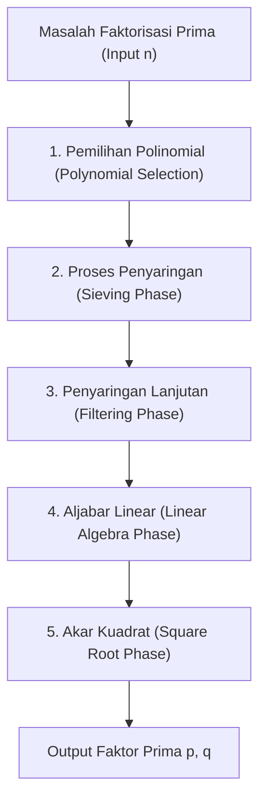
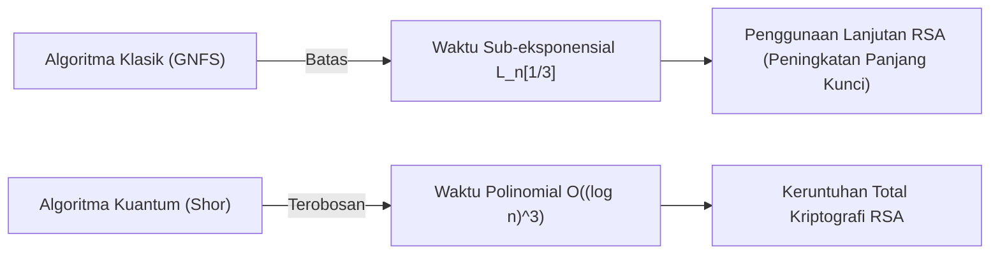

## 1. Pendahuluan: Faktorisasi Bilangan Prima dan Fondasi Kriptografi Modern

Keamanan komunikasi internet dalam masyarakat modern sangat bergantung pada keamanan kriptografi RSA, yang merupakan kriptografi kunci publik. Keamanan kriptografi RSA sendiri didasarkan pada asumsi matematis tentang "kesulitan memfaktorkan bilangan komposit raksasa menjadi bilangan prima". Jika algoritma faktorisasi bilangan prima yang sangat efisien ditemukan, infrastruktur komunikasi di seluruh dunia akan runtuh dari dasarnya.

Saat ini, dalam hal faktorisasi bilangan bulat raksasa menggunakan komputer klasik, algoritma tercepat dan terkuat yang mendominasi adalah **General Number Field Sieve (GNFS)**. GNFS lahir sebagai bentuk perluasan dari Special Number Field Sieve (SNFS) yang diusulkan pada akhir tahun 1980-an, dan hingga hari ini telah mencetak rekor faktorisasi bilangan komposit raksasa seperti RSA-768 dan RSA-250.

Namun, para kriptografer dan matematikawan selalu memiliki pertanyaan berikut: "Apakah terdapat algoritma klasik yang melampaui GNFS?" "Di mana batas kemampuan komputer klasik?" dan, "Bagaimana komputer kuantum akan mendobrak situasi ini?"

Dalam artikel ini, kita akan membedah secara mendalam struktur matematis yang mendasari GNFS, dan melakukan analisis teknis terperinci mengenai pemilihan polinomial, proses penyaringan (sieving), dan langkah aljabar linear menggunakan metode Block Wiedemann. Selanjutnya, kita akan mengkaji metode perluasan GNFS seperti peningkatan Coppersmith, dan membandingkan serta menjelaskan perbedaan krusial antara algoritma waktu sub-eksponensial (Sub-exponential time) klasik dan algoritma waktu polinomial kuantum dari sudut pandang matematis.

---

## 2. Kompleksitas Waktu Asimtotik dan Notasi L (L-notation)

Dalam mengevaluasi kompleksitas waktu algoritma faktorisasi prima, alih-alih menggunakan notasi waktu polinomial standar (seperti $O(n^k)$), **Notasi L (L-notation)** digunakan untuk menyatakan waktu sub-eksponensial terhadap jumlah digit input $n$. Notasi L didefinisikan sebagai berikut:

$$
L_n[\alpha, c] = \exp \left( (c + o(1)) (\ln n)^\alpha (\ln \ln n)^{1-\alpha} \right)
$$

Di sini, $n$ adalah bilangan bulat yang akan difaktorkan, $\ln n$ adalah logaritma natural dan sebanding dengan panjang bit dari $n$.
- Kasus $\alpha = 0$: $L_n[0, c] = \exp(c \ln \ln n) = (\ln n)^c$, yang merepresentasikan **waktu polinomial (Polynomial time)** terhadap panjang bit.
- Kasus $\alpha = 1$: $L_n[1, c] = \exp(c \ln n) = n^c$, yang merepresentasikan **waktu eksponensial (Exponential time)** terhadap panjang bit.
- Kasus $0 < \alpha < 1$: Berada di antara waktu polinomial dan waktu eksponensial, yang merepresentasikan **waktu sub-eksponensial (Sub-exponential time)**.

Evolusi algoritma faktorisasi prima di masa lalu juga merupakan sejarah dalam mengurangi nilai $\alpha$ ini secara bertahap.
- **Metode Pecahan Berlanjut (CFRAC) dan Multiple Polynomial Quadratic Sieve (MPQS)**: Termasuk dalam kelas $\alpha = 1/2$, dengan kompleksitas waktu sekitar $L_n[1/2, 1]$.
- **General Number Field Sieve (GNFS)**: Mencapai $\alpha = 1/3$, dan membanggakan kompleksitas waktu $L_n[1/3, (64/9)^{1/3}]$ yang tercepat di antara algoritma klasik yang dikenal saat ini.

---

## 3. Gambaran Keseluruhan Algoritma dan Struktur Matematis GNFS (General Number Field Sieve)

GNFS memiliki fondasi matematis yang sangat kompleks dan canggih. Ide dasarnya merupakan perpanjangan dari Teorema Kecil Fermat dan Quadratic Sieve (QS), yaitu menemukan pasangan non-trivial $(X, Y)$ yang memenuhi kongruensi $X^2 \equiv Y^2 \pmod n$ dan $X \not\equiv \pm Y \pmod n$, untuk kemudian menurunkan faktor dari $n$ melalui $\gcd(X-Y, n)$.

Namun, esensi sejati dari GNFS adalah bahwa ini tidak hanya dilakukan pada lapangan bilangan rasional $\mathbb{Q}$, tetapi mencari "bilangan halus (Smooth numbers)" secara bersamaan baik pada lapangan perluasan yang disebut lapangan bilangan aljabar (Algebraic Number Field) $\mathbb{Q}(\alpha)$ dan lapangan bilangan rasional, serta membangun hubungan kongruensi melalui homomorfisma.

Proses GNFS pada dasarnya dibagi menjadi 5 fase utama.

### 3.1 Fase 1: Pemilihan Polinomial (Polynomial Selection)

Keberhasilan GNFS sangat bergantung pada pemilihan polinomial yang tepat. Tujuannya adalah untuk menemukan dua polinomial tak tereduksi $f_1(x)$ (sisi rasional) dan $f_2(x)$ (sisi aljabar) yang memiliki akar persekutuan $m$. Dengan kata lain, memenuhi:
$f_1(m) \equiv f_2(m) \equiv 0 \pmod n$

Biasanya, untuk sisi rasional dipilih polinomial derajat 1 $f_1(x) = x - m$, dan untuk sisi aljabar $f_2(x)$ dipilih polinomial monik berderajat $d$ (biasanya 5 atau 6). Pendekatan paling klasik adalah **Metode Base-$m$**.
Kita memilih bilangan bulat $m = \lfloor n^{1/(d+1)} \rfloor$ yang mendekati akar ke-$(d+1)$ dari $n$, lalu mengekspansi $n$ ke dalam basis $m$.
$n = c_d m^d + c_{d-1} m^{d-1} + \dots + c_1 m + c_0$
Dari sini, kita memperoleh polinomial $f_2(x) = c_d x^d + c_{d-1} x^{d-1} + \dots + c_0$. Jelas bahwa $f_2(m) = n \equiv 0 \pmod n$.

Namun, pada implementasi modern, **Algoritma Kleinjung** digunakan. Algoritma ini mencari polinomial yang tidak memiliki koefisien yang terlalu ekstrem (optimasi Skewness), mengoptimalkan properti aljabar (seperti Murphy's $E$ value atau $\alpha$-value), dan memudahkan probabilitas dihasilkannya bilangan yang halus (smooth numbers) pada saat proses penyaringan. Langkah ini saja memerlukan sumber daya komputasi yang sangat besar.

### 3.2 Fase 2: Proses Penyaringan (Sieving Phase)

Setelah polinomial ditentukan, kita masuk ke fase "Penyaringan (Sieving)", yang merupakan fase dengan beban komputasi paling tinggi dari algoritma ini. Di sini, kita mencari pasangan $(a, b)$. Pasangan ini saling prima (coprime), dan diwajibkan agar dua nilai berikut ini "halus (Smooth)" secara bersamaan:

1. **Norm sisi rasional**: $F_1(a, b) = b \cdot f_1(a/b) = a - bm$
2. **Norm sisi aljabar**: $F_2(a, b) = b^d \cdot f_2(a/b)$

"Halus" berarti dapat difaktorkan hanya dengan bilangan prima yang berada di bawah batas tertentu yang ditentukan (Sieve bound). Basis faktor (Factor base) sisi rasional dan basis faktor sisi aljabar disiapkan, dan pada ruang pencarian raksasa, bilangan halus ditemukan dengan efisien seperti cara penyaringan Eratosthenes (Sieve of Eratosthenes).
Saat ini, metode yang disebut **Lattice Sieving (Penyaringan Kisi)** telah menjadi metode utama, di mana bilangan prima tertentu $q$ difiksasi, dan hanya menyaring pasangan $(a, b)$ pada sub-kisi sehingga baik sisi rasional maupun sisi aljabar merupakan kelipatan dari $q$, sehingga mewujudkan efisiensi yang sangat tinggi.

### 3.3 Fase 3: Penyaringan Lanjutan (Filtering Phase)

Jumlah relasi (relations) halus yang ditemukan dalam proses penyaringan bisa mencapai ratusan juta hingga miliaran. Namun, ini juga mengandung banyak informasi yang tidak perlu.
Tujuan penyaringan lanjutan (filtering) adalah untuk membangun matriks jarang (Sparse Matrix) berukuran raksasa sambil mengurangi dimensinya sekecil mungkin.

Secara khusus, operasi berikut dilakukan:
- **Singleton removal**: Menghapus relasi yang memuat faktor prima yang hanya muncul satu kali.
- **Clique removal / Merging**: Mengalikan relasi satu sama lain yang memiliki faktor prima yang muncul dua kali atau lebih, mengeliminasi variabel, dan mereduksinya menjadi sistem persamaan yang lebih padat namun dengan dimensi yang lebih kecil.

Melalui hal ini, matriks dengan miliaran baris dikompresi menjadi matriks jarang raksasa $\mathbf{A}$ (elemen berupa 0 dan 1 pada lapangan $\mathbb{F}_2$) setingkat puluhan juta baris.

### 3.4 Fase 4: Aljabar Linear (Linear Algebra Phase)

Di sini, kita menemukan vektor solusi non-trivial $\mathbf{x}$ untuk persamaan $\mathbf{A} \mathbf{x} \equiv \mathbf{0} \pmod 2$. Dengan kata lain, ini adalah masalah mencari ruang nol kiri (Left Nullspace) dari matriks jarang yang raksasa.

Karena ukuran matriksnya sangat besar, mustahil untuk menghitungnya dengan metode eliminasi Gauss biasa ($O(N^3)$). Oleh karena itu, metode iteratif yang merupakan salah satu metode subruang Krylov digunakan. Secara historis, **Metode Block Lanczos** digunakan, namun dalam lingkungan komputasi terdistribusi saat ini, **Metode Block Wiedemann (Block Wiedemann Algorithm)**, yang secara drastis dapat mengurangi *overhead* komunikasi, menjadi metode utama.

Metode Block Wiedemann menghitung polinomial minimal dari deretan matriks $\mathbf{A}$ dan vektor, lalu membangun basis dari ruang nol menggunakan algoritma Berlekamp-Massey. Langkah ini sangat sulit untuk diparalelkan dan merupakan salah satu *bottleneck* (hambatan) terbesar GNFS, yang membutuhkan jaringan komunikasi yang terikat erat dari superkomputer atau *cluster* berskala besar.

### 3.5 Fase 5: Akar Kuadrat (Square Root Phase)

Dari solusi aljabar linear, produk yang merupakan "kuadrat sempurna" dibangun baik untuk sisi rasional maupun sisi aljabar.
Pada sisi rasional, $\prod (a-bm)$ menjadi kuadrat $X^2$ dari suatu bilangan bulat $X$, sementara pada sisi aljabar, produk ideal yang berkorespondensi menjadi kuadrat sempurna $\gamma^2$ di atas lapangan aljabar.
Dengan menghitung $\gamma$ pada lapangan aljabar ini, dan menerapkan pemetaan homomorfisma $\phi: \alpha \mapsto m \pmod n$ ke dalam gelanggang bilangan bulat rasional, kita memperoleh kongruensi:
$X^2 \equiv \phi(\gamma)^2 \equiv Y^2 \pmod n$

Untuk perhitungan akar kuadrat pada lapangan aljabar, algoritma yang kompleks seperti **Metode Montgomery (Montgomery's Method)** digunakan, dan diperlukan pengetahuan mendalam tentang teori bilangan aljabar. Terakhir, dengan menghitung $\gcd(X-Y, n)$, jika faktor non-trivial diperoleh, maka faktorisasi prima telah selesai.

---

## 4. Apakah Terdapat Algoritma Klasik yang Melampaui GNFS?

Hingga saat ini, belum ada algoritma klasik yang ditemukan yang kompleksitas asimtotiknya lebih rendah dari $L_n[1/3, c]$ untuk faktorisasi prima dari bilangan bulat umum. Namun, ada beberapa percobaan dan algoritma turunan untuk menembus batas-batas teoritis maupun praktis.

### 4.1 Multiple Number Field Sieve (MNFS)

Sebagai pendekatan yang memperluas GNFS, terdapat **Multiple Number Field Sieve (MNFS)** yang diusulkan oleh D. Coppersmith. Sementara GNFS menggunakan 2 polinomial (sisi rasional dan sisi aljabar), MNFS menggunakan beberapa polinomial sisi aljabar yang berbeda secara bersamaan terhadap satu polinomial sisi rasional.

$$ f_1(x), f_{2,1}(x), f_{2,2}(x), \dots, f_{2,V}(x) $$

Dengan menggunakan beberapa lapangan aljabar, probabilitas untuk "menjadi halus pada salah satu lapangan aljabar" pada setiap langkah penyaringan dapat ditingkatkan secara drastis. Melalui pendekatan ini, Coppersmith berhasil sedikit mengurangi konstanta $c$ dari kompleksitas $L_n[1/3, c]$.
Secara khusus, secara teoritis telah ditunjukkan bahwa sementara konstanta GNFS adalah $c = (64/9)^{1/3} \approx 1.923$, dengan mengoptimalkan MNFS, kompleksitas waktu dapat direduksi hingga sekitar $c \approx 1.902$.
Namun dalam praktiknya, *overhead* pengelolaan berbagai lapangan aljabar sangatlah besar, dan hal ini belum mencapai terobosan yang menentukan untuk modulus RSA dalam skala praktis.

### 4.2 Apakah Algoritma Kelas $L_n[1/4]$ Mungkin?

Mengenai batasan algoritma klasik dari faktorisasi prima, sebuah tema yang telah diperdebatkan di antara para matematikawan selama bertahun-tahun adalah pertanyaan "Apakah ada algoritma dengan pangkat $\alpha = 1/4$?".
GNFS saat ini dan turunannya terikat kuat pada kerangka kerja "pencarian kehalusan" menggunakan saringan, dan diyakini secara luas bahwa $\alpha = 1/3$ adalah batas dalam paradigma ini. Dari analisis probabilitas distribusi bilangan bulat halus yang menggunakan fungsi Dickman (Dickman function), diyakini bahwa dengan kombinasi konstruksi lapangan aljabar dan saringan saat ini, seoptimal apa pun dioptimalkan, tembok $O(L_n[1/3])$ tidak dapat dilewati.

Jika algoritma $L_n[1/4]$, atau algoritma waktu polinomial klasik ada, itu pasti akan bergantung pada struktur matematis baru yang benar-benar berbeda dari pendekatan "berbasis kehalusan" seperti GNFS, yang saat ini tidak dapat dibayangkan oleh manusia (sebagai contoh, pendekatan geometri aljabar yang lebih tingkat tinggi seperti algoritma Schoof untuk kriptografi kurva eliptik, dll.). Namun, saat ini belum ada tanda-tanda hal semacam itu akan muncul.

---

## 5. Terobosan Melalui Komputer Kuantum: Algoritma Shor

Sementara komputer klasik sedang berhadapan dengan tembok $L_n[1/3]$, tembok ini telah dihancurkan dengan secara radikal mengubah model komputasinya itu sendiri, melalui **Algoritma Shor (Shor's Algorithm)** yang diterbitkan oleh Peter Shor pada tahun 1994.

### 5.1 Dampak Waktu Polinomial Kuantum

Algoritma Shor mereduksi masalah faktorisasi prima menjadi "Masalah Pencarian Orde (Order Finding Problem)". Ini adalah masalah untuk menemukan periode (orde) $r$ dari fungsi $f(x) = a^x \pmod n$ untuk bilangan bulat $a$ tertentu.
Komputer klasik membutuhkan waktu eksponensial untuk menemukan periode ini, tetapi dengan menggunakan **Estimasi Fase Kuantum (QPE: Quantum Phase Estimation)** dan **Transformasi Fourier Kuantum (QFT: Quantum Fourier Transform)** pada komputer kuantum, evaluasi paralel pada superposisi (Superposition) semua status/keadaan dilakukan, sehingga sangat memungkinkan untuk mengekstraksi periode $r$ dengan probabilitas yang tinggi.

Dari sudut pandang kompleksitas, waktu eksekusi algoritma Shor adalah **waktu polinomial kuantum**, yang secara khusus direpresentasikan sebagai berikut:
$$ O((\log n)^3) $$
Dengan mempertimbangkan implementasi sirkuit yang dioptimalkan dalam beberapa tahun terakhir, hal ini dapat direduksi lebih lanjut menjadi $O((\log n)^2 \log \log n)$.

### 5.2 Waktu Sub-eksponensial Klasik vs Waktu Polinomial Kuantum

Perbedaan antara dua kelas kompleksitas komputasi ini memiliki makna yang sangat krusial (menentukan) dalam keamanan kriptografi dunia nyata.

Sebagai contoh, perhatikan kasus pemfaktoran RSA-2048 (bilangan komposit 2048-bit).
- **GNFS (Klasik)**: Mensubstitusikan $n \approx 2^{2048}$ ke dalam $L_n[1/3, 1.923]$, diperlukan sekitar $2^{112}$ operasi. Ini adalah jumlah perhitungan astronomis yang akan membutuhkan waktu lebih lama daripada umur alam semesta, bahkan jika semua sumber daya komputasi di Bumi saat ini digabungkan.
- **Algoritma Shor (Kuantum)**: Dengan algoritma $O((\log n)^3)$, hanya diperlukan sekitar $2048^3 \approx 8.5 \times 10^9$ operasi gerbang logika. Hal ini berarti, jika perangkat keras yang tepat (komputer kuantum universal dengan jutaan qubit fisik dan kemampuan koreksi kesalahan) tersedia, perhitungan dapat diselesaikan hanya dalam beberapa jam atau beberapa hari saja.

Pergeseran paradigma dari waktu sub-eksponensial dengan "pangkat $\alpha=1/3$" menuju "waktu polinomial" meniadakan strategi kriptografi tradisional yang menjamin keamanan dengan memperpanjang panjang kunci.

---

## 6. Kesimpulan: Prospek Menuju Generasi Mendatang

Konsensus komunitas ilmiah saat ini atas pertanyaan "Apakah ada algoritma klasik yang melampaui GNFS?" adalah sebagai berikut:

1. **Peningkatan praktis terus berlanjut, tetapi tidak ada lompatan asimtotik**: Berbagai upaya terus dilakukan untuk meningkatkan bagian konstanta $c$ pada GNFS, seperti MNFS, optimasi pemilihan polinomial, paralelisasi Metode Block Wiedemann, dsb. Namun, kemungkinan ditemukannya algoritma klasik di bawah $\alpha = 1/3$ dianggap sangatlah rendah.
2. **Keamanan RSA pada komputer klasik masih tetap kuat**: Kompleksitas perhitungan GNFS masih sangat masif, dan RSA-2048 atau RSA-4096 akan tetap aman terhadap serangan komputer klasik untuk beberapa dekade mendatang.
3. **Ancaman sebenarnya adalah algoritma kuantum**: Algoritma Shor-lah, yang didasarkan pada prinsip-prinsip mekanika kuantum, yang mendobrak tembok kompleksitas komputasi. Oleh karena itu, dunia dipaksa untuk beralih ke Post-Quantum Cryptography (PQC). Garis terdepan kriptografi saat ini adalah transisi ke masalah matematis baru yang dianggap sulit untuk dipecahkan (tidak dapat dipecahkan dalam waktu polinomial) bahkan oleh komputer kuantum, seperti kriptografi kisi (lattice-based cryptography) dan kriptografi berbasis hash (hash-based cryptography).

General Number Field Sieve (GNFS) adalah salah satu "puncak pencapaian tertinggi" umat manusia dalam menantang batas maksimal matematika klasik dan desain algoritma. Memahami struktur matematis yang mendalam dari GNFS bukan hanya mempelajari sejarah kriptanalisis, namun juga merupakan perjalanan pencarian intelektual untuk bersentuhan langsung dengan keindahan teori kompleksitas komputasi dan teori bilangan aljabar. Sampai hari di mana komputer kuantum direalisasikan, GNFS nampaknya akan terus mempertahankan takhtanya sebagai algoritma faktorisasi prima terkuat.

