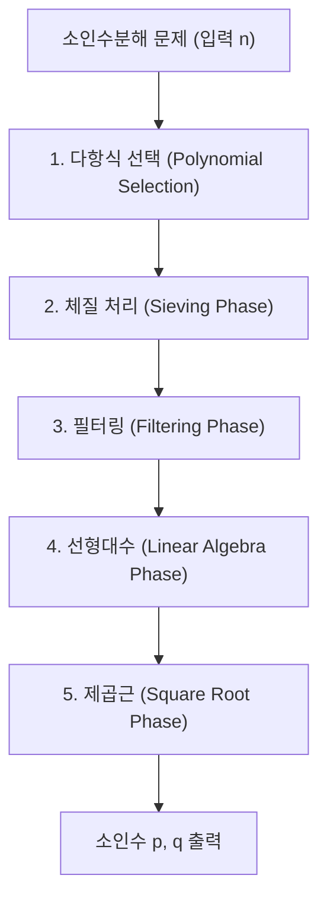
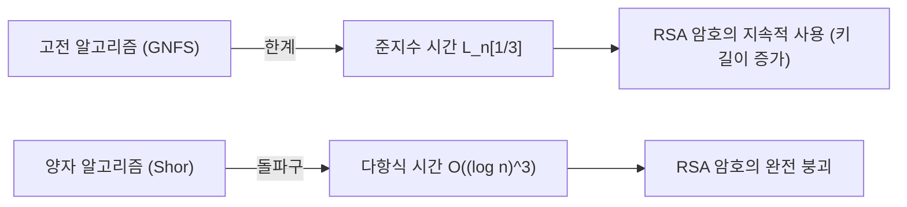

## 1. 서론: 소인수분해와 현대 암호의 근간

현대 사회에서 인터넷 통신의 안전성은 공개키 암호인 RSA 암호의 안전성에 크게 의존하고 있습니다. 그리고 RSA 암호의 안전성은 '거대한 합성수의 소인수분해의 어려움'이라는 수학적 가정에 기반을 두고 있습니다. 만약 극도로 효율적인 소인수분해 알고리즘이 발견된다면, 전 세계의 통신 인프라는 뿌리째 흔들리게 될 것입니다.

현재 고전 컴퓨터를 이용한 거대 정수의 소인수분해에서 가장 빠르고 강력한 알고리즘으로 군림하고 있는 것이 **일반 수체 체(GNFS: General Number Field Sieve)**입니다. GNFS는 1980년대 후반에 제안된 특수 수체 체(SNFS)를 확장하는 형태로 탄생했으며, 오늘날까지 RSA-768이나 RSA-250과 같은 거대한 합성수의 소인수분해 기록을 수립해 왔습니다.

그러나 암호학자들과 수학자들은 항상 다음과 같은 의문을 품고 있습니다. "GNFS를 뛰어넘는 고전적 알고리즘은 존재하는가?", "고전 컴퓨터의 한계는 어디까지인가?", 그리고 "양자 컴퓨터는 어떻게 이 상황을 타파할 것인가?"

본 기사에서는 GNFS 이면에 있는 심연의 수학적 구조를 철저하게 해부하고, 다항식 선택, 체질(Sieving) 처리, 블록 위더만(Block-Wiedemann) 방법을 통한 선형대수 단계 등 상세한 기술적 분석을 수행합니다. 나아가 Coppersmith의 개선 등을 통한 GNFS의 확장 기법에 대해 고찰하고, 고전적인 준지수 시간(Sub-exponential time) 알고리즘과 양자 다항식 시간 알고리즘의 결정적인 차이를 수리적 관점에서 비교 및 해설합니다.

---

## 2. 점근적 시간 복잡도와 L 표기법(L-notation)

소인수분해 알고리즘의 계산 복잡도를 평가할 때, 표준적인 다항식 시간 표기($O(n^k)$ 등)가 아니라 입력 $n$의 자릿수에 대한 준지수 시간을 표현하기 위해 **L 표기법(L-notation)**이 사용됩니다. L 표기법은 다음과 같이 정의됩니다.

$$
L_n[\alpha, c] = \exp \left( (c + o(1)) (\ln n)^\alpha (\ln \ln n)^{1-\alpha} \right)
$$

여기서 $n$은 소인수분해의 대상이 되는 정수, $\ln n$은 자연로그이며 $n$의 비트 길이에 비례합니다.
- $\alpha = 0$인 경우: $L_n[0, c] = \exp(c \ln \ln n) = (\ln n)^c$가 되어, 비트 길이에 대한 **다항식 시간(Polynomial time)**을 나타냅니다.
- $\alpha = 1$인 경우: $L_n[1, c] = \exp(c \ln n) = n^c$가 되어, 비트 길이에 대한 **지수 시간(Exponential time)**을 나타냅니다.
- $0 < \alpha < 1$인 경우: 다항식 시간과 지수 시간의 중간에 위치하는 **준지수 시간(Sub-exponential time)**이 됩니다.

과거 소인수분해 알고리즘의 진화는 이 $\alpha$ 값을 서서히 줄여온 역사이기도 했습니다.
- **연분수법(CFRAC)이나 다중 다항식 이차 체(MPQS)**: $\alpha = 1/2$ 클래스에 속하며, 계산 복잡도는 $L_n[1/2, 1]$ 정도입니다.
- **일반 수체 체(GNFS)**: $\alpha = 1/3$을 달성하여, 현재 알려진 고전 알고리즘 중 가장 빠른 $L_n[1/3, (64/9)^{1/3}]$이라는 계산 복잡도를 자랑합니다.

---

## 3. GNFS(일반 수체 체)의 알고리즘 전모와 수학적 구조

GNFS는 매우 복잡하고 고도화된 수학적 기반을 가지고 있습니다. 기본 아이디어는 페르마의 소정리나 이차 체(QS)의 연장선에 있으며, 합동식 $X^2 \equiv Y^2 \pmod n$을 만족하면서 $X \not\equiv \pm Y \pmod n$이 되는 자명하지 않은 쌍 $(X, Y)$를 찾음으로써 $n$의 인수 $\gcd(X-Y, n)$을 도출해내는 것입니다.

하지만 GNFS의 진수는 이를 유리수체 $\mathbb{Q}$에서만 수행하는 것이 아니라, 대수체(Algebraic Number Field)라 불리는 확대체 $\mathbb{Q}(\alpha)$와 유리수체 양쪽에서 동시에 '매끄러운 수(Smooth numbers)'를 탐색하고, 준동형 사상을 통해 합동 관계를 구축한다는 점에 있습니다.

GNFS의 과정은 크게 5개의 단계로 나뉩니다.

### 3.1 1단계: 다항식 선택 (Polynomial Selection)

GNFS의 성공은 적절한 다항식의 선택에 크게 의존합니다. 목표는 공통 근 $m$을 가지는 두 개의 기약다항식 $f_1(x)$(유리수 측)와 $f_2(x)$(대수 측)를 찾는 것입니다. 즉,
$f_1(m) \equiv f_2(m) \equiv 0 \pmod n$
을 만족합니다.

통상적으로 유리수 측의 다항식은 1차식 $f_1(x) = x - m$을 선택하고, 대수 측의 다항식 $f_2(x)$는 차수 $d$(일반적으로 5나 6)의 모닉(monic) 다항식을 선택합니다. 가장 고전적인 접근법은 **Base-$m$ 메서드**입니다.
$n$의 $1/(d+1)$ 제곱에 가까운 정수 $m = \lfloor n^{1/(d+1)} \rfloor$을 선택하고, $n$을 $m$진수로 전개합니다.
$n = c_d m^d + c_{d-1} m^{d-1} + \dots + c_1 m + c_0$
이를 통해 다항식 $f_2(x) = c_d x^d + c_{d-1} x^{d-1} + \dots + c_0$을 얻습니다. 명백하게 $f_2(m) = n \equiv 0 \pmod n$이 됩니다.

그러나 현대의 구현에서는 **Kleinjung의 알고리즘**이 사용됩니다. 이는 다항식의 계수가 극단적으로 커지지 않게 하면서(Skewness 최적화), 대수적 성질(Murphy's $E$ value나 $\alpha$-value)을 최적화하고, 체질(Sieving) 처리에서 매끄러운 수가 쉽게 생성될 수 있는 다항식을 탐색합니다. 이 단계에만 막대한 계산 자원이 투입됩니다.

### 3.2 2단계: 체질 처리 (Sieving Phase)

다항식이 결정되면 알고리즘에서 가장 계산 부하가 큰 '체(Sieving)' 단계에 진입합니다. 여기서는 쌍 $(a, b)$를 탐색합니다. 이 쌍은 서로소이며, 다음 두 값이 동시에 '매끄러울(Smooth)' 것이 요구됩니다.

1. **유리수 측의 노름(Norm)**: $F_1(a, b) = b \cdot f_1(a/b) = a - bm$
2. **대수 측의 노름(Norm)**: $F_2(a, b) = b^d \cdot f_2(a/b)$

'매끄럽다'는 것은 지정된 상한(Sieve bound) 이하의 소수로만 소인수분해 가능하다는 것을 의미합니다. 유리수 측의 소수 기반(Factor base)과 대수 측의 소수 기반을 준비하여, 거대한 탐색 공간 위에서 에라토스테네스의 체와 같은 요령으로 매끄러운 수를 효율적으로 찾아냅니다.
현재는 **격자 체(Lattice Sieving)**라 불리는 기법이 주류를 이루고 있으며, 특정 소수 $q$를 고정하여 유리수 측과 대수 측 모두가 $q$의 배수가 되는 부분 격자 상의 $(a, b)$ 쌍만을 체로 걸러냄으로써 극도로 높은 효율을 실현하고 있습니다.

### 3.3 3단계: 필터링 (Filtering Phase)

체질 처리에서 발견된 매끄러운 관계식(Relation)의 수는 수억, 수십억 개에 달합니다. 하지만 이들은 쓸모없는 정보도 많이 포함하고 있습니다.
필터링의 목적은 거대한 희소 행렬(Sparse Matrix)을 구축하면서 그 차원을 가능한 한 작게 만드는 것입니다.

구체적으로 다음과 같은 조작을 수행합니다.
- **Singleton removal**: 1번만 나타나는 소인수를 포함하는 관계식을 삭제합니다.
- **Clique removal / Merging**: 2번 이상 나타나는 소인수를 가진 관계식끼리 곱하여 변수를 소거하고, 밀도는 더 높으면서도 차원이 작은 방정식계로 축약합니다.

이를 통해 수십억 행의 행렬이 수천만 행 수준의 거대한 희소 행렬 $\mathbf{A}$(원소는 체 $\mathbb{F}_2$ 위의 0과 1)로 압축됩니다.

### 3.4 4단계: 선형대수 (Linear Algebra Phase)

여기서는 방정식 $\mathbf{A} \mathbf{x} \equiv \mathbf{0} \pmod 2$의 자명하지 않은 해 벡터 $\mathbf{x}$를 찾습니다. 즉, 거대한 희소 행렬의 좌측 영공간(Left Nullspace)을 구하는 문제입니다.

행렬의 크기가 극단적으로 크기 때문에 통상적인 가우스 소거법($O(N^3)$)으로는 도저히 계산이 불가능합니다. 그래서 크릴로프 부분공간법(Krylov subspace method)의 일종인 반복법이 사용됩니다. 역사적으로는 **블록 란초스법(Block Lanczos)**이 사용되어 왔지만, 현재의 분산 컴퓨팅 환경에서는 통신 오버헤드를 극적으로 줄일 수 있는 **블록 위더만법(Block Wiedemann Algorithm)**이 주류입니다.

블록 위더만법은 행렬 $\mathbf{A}$와 벡터 수열로부터 최소 다항식을 계산하고, 벌리캠프-매시(Berlekamp-Massey) 알고리즘을 이용하여 영공간의 기저를 구성합니다. 이 단계는 병렬화가 매우 어려워 슈퍼컴퓨터나 대규모 클러스터의 밀결합 통신 네트워크를 요구하는, GNFS 최대의 병목 현상 중 하나입니다.

### 3.5 5단계: 제곱근 (Square Root Phase)

선형대수의 해로부터 유리수 측과 대수 측 각각에서 '완전제곱'이 되는 곱을 구성합니다.
유리수 측에서는 $\prod (a-bm)$이 어떤 정수 $X$의 제곱 $X^2$이 되고, 대수 측에서는 대응하는 이디얼(ideal)의 곱이 대수체 상에서 완전제곱 $\gamma^2$이 됩니다.
이 $\gamma$를 대수체 위에서 계산하고, 유리정수환으로의 준동형 사상 $\phi: \alpha \mapsto m \pmod n$을 적용함으로써 합동식:
$X^2 \equiv \phi(\gamma)^2 \equiv Y^2 \pmod n$
을 얻게 됩니다.

대수체 상의 제곱근 계산에는 **몽고메리의 방법(Montgomery's Method)** 등의 복잡한 알고리즘이 사용되며, 대수적 정수론의 깊은 지식이 요구됩니다. 최종적으로 $\gcd(X-Y, n)$을 계산하여 자명하지 않은 인수를 얻게 되면 소인수분해가 완료됩니다.

---

## 4. GNFS를 뛰어넘는 고전 알고리즘은 존재하는가?

현재까지 일반 정수에 대한 소인수분해에서 점근적 계산 복잡도가 $L_n[1/3, c]$를 밑도는 고전 알고리즘은 발견되지 않았습니다. 그러나 이론적, 실천적 한계를 돌파하기 위한 몇 가지 시도나 파생 알고리즘이 존재합니다.

### 4.1 다중 수체 체 (MNFS: Multiple Number Field Sieve)

GNFS를 확장한 접근법으로 D. Coppersmith에 의한 **다중 수체 체(MNFS)**가 있습니다. GNFS에서는 2개의 다항식(유리수 측과 대수 측)을 사용하지만, MNFS에서는 1개의 유리수 측 다항식에 대해 여러 개의 다른 대수 측 다항식을 동시에 사용합니다.

$$ f_1(x), f_{2,1}(x), f_{2,2}(x), \dots, f_{2,V}(x) $$

여러 개의 대수체를 이용함으로써 각 체질 단계에서 '어느 한 대수체에서 매끄러워질' 확률을 비약적으로 높일 수 있습니다. Coppersmith는 이 접근법을 통해 계산 복잡도 $L_n[1/3, c]$의 상수 $c$를 약간 감소시키는 데 성공했습니다.
구체적으로, GNFS의 상수가 $c = (64/9)^{1/3} \approx 1.923$인 반면, MNFS를 최적화하면 $c \approx 1.902$ 정도까지 계산량을 줄일 수 있음이 이론적으로 증명되었습니다.
그러나 실제 적용에 있어서는 여러 체를 관리하는 오버헤드가 크기 때문에, 실용적 규모의 RSA 모듈러스에 대한 결정적인 돌파구에는 이르지 못했습니다.

### 4.2 $L_n[1/4]$ 클래스의 알고리즘은 가능한가?

소인수분해의 고전적 알고리즘의 한계에 대해 수학자들 사이에서 오랜 세월 논의되어 온 주제가 "지수 $\alpha = 1/4$인 알고리즘은 존재하는가?"라는 질문입니다.
현재의 GNFS나 그 파생형은 체를 통한 '매끄러움의 탐색'이라는 틀에 강하게 얽매여 있으며, 이 패러다임 안에서는 $\alpha = 1/3$이 한계라고 널리 믿어지고 있습니다. 딕만 함수(Dickman function)를 이용한 매끄러운 정수의 분포 확률 해석에서도, 현재의 대수체 구성법과 체의 조합으로는 아무리 최적화해도 $O(L_n[1/3])$의 벽을 넘을 수 없다고 여겨집니다.

만약 $L_n[1/4]$ 혹은 고전적인 다항식 시간 알고리즘이 존재한다고 가정한다면, 그것은 GNFS와 같은 '매끄러움 기반'의 접근법과는 전혀 다른, 현재 인류가 생각지도 못한 새로운 수학적 구조(예를 들어, 타원곡선 암호에 대한 Schoof의 알고리즘과 같은 더 고차원적인 대수기하학적 접근 등)에 의존해야 할 것입니다. 그러나 현재로서는 그러한 징후가 보이지 않습니다.

---

## 5. 양자 컴퓨터에 의한 돌파구: 쇼어의 알고리즘

고전 컴퓨터가 $L_n[1/3]$의 벽에 직면해 있는 반면, 계산 모델 자체를 근본적으로 바꿈으로써 이 벽을 산산조각 낸 것이 1994년 Peter Shor가 발표한 **쇼어의 알고리즘(Shor's Algorithm)**입니다.

### 5.1 양자 다항식 시간의 충격

쇼어의 알고리즘은 소인수분해 문제를 '위수 발견 문제(Order Finding Problem)'로 귀결시킵니다. 어떤 정수 $a$에 대해, 함수 $f(x) = a^x \pmod n$의 주기(위수) $r$을 찾는 문제입니다.
고전 컴퓨터에서는 이 주기를 찾기 위해 지수 함수적인 시간을 요구하지만, 양자 컴퓨터 상의 **양자 위상 추정(QPE: Quantum Phase Estimation)**과 **양자 푸리에 변환(QFT: Quantum Fourier Transform)**을 이용하면 모든 상태의 중첩(Superposition)에 대해 병렬로 평가를 수행하여 높은 확률로 주기 $r$을 추출할 수 있습니다.

계산 복잡도 측면에서 볼 때, 쇼어의 알고리즘의 실행 시간은 **양자 다항식 시간**, 구체적으로 다음과 같습니다.
$$ O((\log n)^3) $$
최근의 최적화된 회로 구현을 고려하면 $O((\log n)^2 \log \log n)$까지 단축 가능하다고 알려져 있습니다.

### 5.2 고전적 준지수 시간 vs 양자 다항식 시간

이 두 계산 복잡도 클래스의 차이는 현실 세계의 암호 보안에서 결정적인 의미를 갖습니다.

예를 들어 RSA-2048(2048비트의 합성수)을 소인수분해하는 경우를 생각해 봅시다.
- **GNFS (고전)**: $n \approx 2^{2048}$을 $L_n[1/3, 1.923]$에 대입하면 약 $2^{112}$번의 연산이 필요합니다. 이는 현재 지구상의 모든 계산 자원을 결집하더라도 우주의 수명 이상의 시간이 걸리는 천문학적인 계산량입니다.
- **Shor's Algorithm (양자)**: $O((\log n)^3)$ 알고리즘에서는 $2048^3 \approx 8.5 \times 10^9$번 정도의 논리 게이트 조작으로 끝납니다. 이는 적절한 하드웨어(수백만 개의 물리 양자 비트와 오류 정정 능력을 갖춘 범용 양자 컴퓨터)가 존재한다면 단 몇 시간에서 며칠 만에 계산이 완료됨을 의미합니다.

'지수 $\alpha=1/3$'의 준지수 시간에서 '다항식 시간'으로의 패러다임 전환은, 키 길이를 늘려 안전성을 담보한다는 기존 암호학의 전략을 무력화시킵니다.

---

## 6. 결론: 차세대에 대한 전망

"GNFS를 뛰어넘는 고전 알고리즘은 존재하는가?"라는 질문에 대한 현재 과학계의 합의는 다음과 같습니다.

1. **실용적인 개선은 계속되나 점근적인 비약은 없다**: MNFS나 다항식 선택의 최적화, 블록 위더만법의 병렬화 등 GNFS의 상수항 $c$를 개선하려는 시도는 계속되고 있습니다. 그러나 $\alpha = 1/3$을 밑도는 고전적 알고리즘이 발견될 가능성은 극히 낮다고 여겨집니다.
2. **고전 컴퓨터 상에서의 RSA 안전성은 여전히 견고하다**: GNFS의 계산량은 여전히 막대하며, RSA-2048이나 RSA-4096은 고전 컴퓨터의 공격에 대해 앞으로 수십 년간 안전성을 유지할 것입니다.
3. **진정한 위협은 양자 알고리즘이다**: 계산 복잡도의 벽을 넘은 것은 양자역학의 원리에 기반한 쇼어의 알고리즘입니다. 이로 인해 세계는 양자 내성 암호(PQC: Post-Quantum Cryptography)로의 전환을 강요받고 있습니다. 격자 기반 암호나 해시 기반 암호 등 양자 컴퓨터로도 해독이 어려운(다항식 시간으로 풀 수 없는) 새로운 수학적 문제로의 전환이 현재 암호학의 최전선이 되고 있습니다.

일반 수체 체(GNFS)는 인류가 고전 수학과 알고리즘 설계의 극한까지 도전하여 도달한 '최고 도달점' 중 하나입니다. GNFS의 심오한 수학적 구조를 이해하는 것은 단순히 암호 해독의 역사를 배우는 것을 넘어, 계산 복잡도 이론이나 대수적 정수론의 아름다움을 접하는 지적 탐구의 여정이기도 합니다. 양자 컴퓨터가 실용화되는 그날까지 GNFS는 최강의 소인수분해 알고리즘으로서의 왕좌를 계속 지킬 것입니다.

