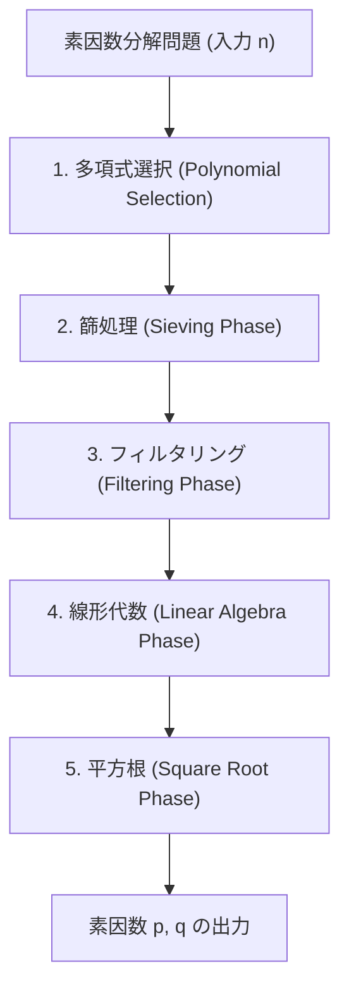
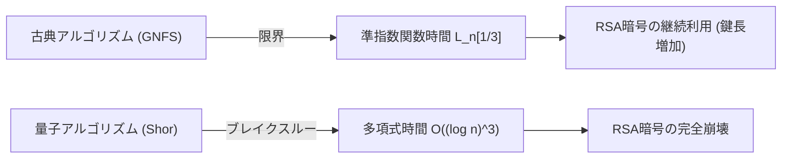

## 1. はじめに：素因数分解と現代暗号の根幹

現代社会におけるインターネット通信の安全性は、公開鍵暗号であるRSA暗号の安全性に大きく依存しています。そしてRSA暗号の安全性は「巨大な合成数の素因数分解の困難さ」という数学的仮定に基づいています。もし、極めて効率的な素因数分解アルゴリズムが発見されれば、世界中の通信インフラは根底から崩れ去ることになります。

現在、古典コンピュータを用いた巨大整数の素因数分解において、最も高速かつ最強のアルゴリズムとして君臨しているのが**一般数体篩法（GNFS: General Number Field Sieve）**です。GNFSは、1980年代後半に提唱された特殊数体篩法（SNFS）を拡張する形で誕生し、今日に至るまでRSA-768やRSA-250といった巨大な合成数の素因数分解記録を打ち立ててきました。

しかし、暗号学者や数学者たちは常に次のような疑問を抱いています。「GNFSを超える古典的アルゴリズムは存在するのか？」「古典コンピュータの限界はどこにあるのか？」そして、「量子コンピュータはどのようにこの状況を打破するのか？」

本記事では、GNFSの背後にある深淵なる数学的構造を徹底的に解剖し、多項式選択、篩処理、ブロック・ヴィーデマン法による線形代数ステップなどの詳細な技術的分析を行います。さらに、Coppersmithの改良などによるGNFSの拡張手法について考察し、古典的な準指数関数時間（Sub-exponential time）アルゴリズムと量子的多項式時間アルゴリズムの決定的な違いを数理的な観点から比較・解説します。

---

## 2. 漸近的計算量とL記法（L-notation）

素因数分解アルゴリズムの計算量を評価する際、標準的な多項式時間表記（$O(n^k)$など）ではなく、入力 $n$ の桁数に対する準指数関数時間を表現するために**L記法（L-notation）**が用いられます。L記法は次のように定義されます。

$$
L_n[\alpha, c] = \exp \left( (c + o(1)) (\ln n)^\alpha (\ln \ln n)^{1-\alpha} \right)
$$

ここで、$n$ は素因数分解の対象となる整数、$\ln n$ は自然対数であり $n$ のビット長に比例します。
- $\alpha = 0$ の場合：$L_n[0, c] = \exp(c \ln \ln n) = (\ln n)^c$ となり、ビット長に対する**多項式時間（Polynomial time）**を表します。
- $\alpha = 1$ の場合：$L_n[1, c] = \exp(c \ln n) = n^c$ となり、ビット長に対する**指数関数時間（Exponential time）**を表します。
- $0 < \alpha < 1$ の場合：多項式時間と指数関数時間の中間に位置する**準指数関数時間（Sub-exponential time）**となります。

過去の素因数分解アルゴリズムの進化は、この $\alpha$ の値を徐々に小さくする歴史でもありました。
- **連分数法（CFRAC）や複数多項式二次篩法（MPQS）**：$\alpha = 1/2$ のクラスに属し、計算量は $L_n[1/2, 1]$ 程度です。
- **一般数体篩法（GNFS）**：$\alpha = 1/3$ を達成し、現在知られている古典アルゴリズムの中で最速の $L_n[1/3, (64/9)^{1/3}]$ という計算量を誇ります。

---

## 3. GNFS（一般数体篩法）のアルゴリズム全容と数学的構造

GNFSは非常に複雑で高度な数学的基盤を持っています。基本的なアイデアは、フェルマーの小定理や二次篩法（QS）の延長線上にあり、合同式 $X^2 \equiv Y^2 \pmod n$ を満たし、かつ $X \not\equiv \pm Y \pmod n$ となる非自明な組 $(X, Y)$ を見つけることで、$n$ の因数 $\gcd(X-Y, n)$ を導出するというものです。

しかし、GNFSの真髄は、これを有理数体 $\mathbb{Q}$ のみで行うのではなく、代数体（Algebraic Number Field）と呼ばれる拡大体 $\mathbb{Q}(\alpha)$ と有理数体の両方で同時に「滑らかな数（Smooth numbers）」を探索し、準同型写像を通じて合同関係を構築する点にあります。

GNFSのプロセスは大きく5つのフェーズに分かれます。

### 3.1 フェーズ1：多項式選択 (Polynomial Selection)

GNFSの成功は、適切な多項式の選択に大きく依存します。目標は、共通の根 $m$ を持つ2つの既約多項式 $f_1(x)$（有理側）と $f_2(x)$（代数側）を見つけることです。つまり、
$f_1(m) \equiv f_2(m) \equiv 0 \pmod n$
を満たします。

通常、有理側の多項式は1次式 $f_1(x) = x - m$ を選び、代数側の多項式 $f_2(x)$ は次数 $d$（典型的には5や6）のモニック多項式を選びます。最も古典的なアプローチは**Base-$m$ メソッド**です。
$n$ の $1/(d+1)$ 乗に近い整数 $m = \lfloor n^{1/(d+1)} \rfloor$ を選び、$n$ を $m$ 進数展開します。
$n = c_d m^d + c_{d-1} m^{d-1} + \dots + c_1 m + c_0$
これにより、多項式 $f_2(x) = c_d x^d + c_{d-1} x^{d-1} + \dots + c_0$ を得ます。明らかに $f_2(m) = n \equiv 0 \pmod n$ となります。

しかし、現代の実装では **Kleinjungのアルゴリズム** が用いられます。これは、多項式の係数が極端に大きくならないようにしつつ（Skewnessの最適化）、代数的な性質（Murphy's $E$ value や $\alpha$-value）を最適化し、篩処理で滑らかな数が生成されやすい多項式を探索します。このステップだけでも多大な計算資源が投入されます。

### 3.2 フェーズ2：篩処理 (Sieving Phase)

多項式が決定すると、アルゴリズムの最も計算負荷が高い「篩（Sieving）」フェーズに入ります。ここでは、ペア $(a, b)$ を探索します。このペアは互いに素であり、以下の2つの値が同時に「滑らか（Smooth）」であることを求められます。

1. **有理側のノルム**: $F_1(a, b) = b \cdot f_1(a/b) = a - bm$
2. **代数側のノルム**: $F_2(a, b) = b^d \cdot f_2(a/b)$

「滑らか」とは、指定された上限（Sieve bound）以下の素数のみで素因数分解可能であることを意味します。有理側の素数ベース（Factor base）と代数側の素数ベースを用意し、巨大な探索空間上でエラトステネスの篩の要領で滑らかな数を効率的に見つけ出します。
現在では**格子篩（Lattice Sieving）**と呼ばれる手法が主流であり、特定の素数 $q$ を固定して、有理側・代数側の両方が $q$ の倍数となるような部分格子上の $(a, b)$ ペアのみを篩にかけることで、極めて高い効率を実現しています。

### 3.3 フェーズ3：フィルタリング (Filtering Phase)

篩処理で見つかった滑らかな関係式（リレーション）の数は数億、数十億に上ります。しかし、これらは無駄な情報も多く含んでいます。
フィルタリングの目的は、巨大な疎行列（Sparse Matrix）を構築しつつ、その次元を可能な限り小さくすることです。

具体的には以下のような操作を行います。
- **Singleton removal**: 1回しか現れない素因数を含むリレーションを削除する。
- **Clique removal / Merging**: 2回以上現れる素因数を持つリレーション同士を掛け合わせて、変数を消去し、より密度の高い、しかし次元の小さい方程式系へと縮約する。

これにより、数十億行の行列が、数千万行レベルの巨大な疎行列 $\mathbf{A}$（要素は体 $\mathbb{F}_2$ 上の0と1）へと圧縮されます。

### 3.4 フェーズ4：線形代数 (Linear Algebra Phase)

ここでは、方程式 $\mathbf{A} \mathbf{x} \equiv \mathbf{0} \pmod 2$ の非自明な解ベクトル $\mathbf{x}$ を見つけます。つまり、巨大な疎行列の左零空間（Left Nullspace）を求める問題です。

行列のサイズが極端に大きいため、通常のガウスの消去法（$O(N^3)$）では到底計算不可能です。そこで、クリロフ部分空間法の一種である反復法が用いられます。歴史的には**ブロック・ランチョス法（Block Lanczos）**が使われてきましたが、現在の分散コンピューティング環境においては、通信オーバーヘッドを劇的に削減できる**ブロック・ヴィーデマン法（Block Wiedemann Algorithm）**が主流です。

ブロック・ヴィーデマン法は、行列 $\mathbf{A}$ とベクトル系列から最小多項式を計算し、ベルカンプ・マッシー（Berlekamp-Massey）アルゴリズムを用いて零空間の基底を構成します。このステップは並列化が非常に困難であり、スーパーコンピュータや大規模クラスターの密結合な通信ネットワークを要求する、GNFS最大のボトルネックの1つです。

### 3.5 フェーズ5：平方根 (Square Root Phase)

線形代数の解から、有理側と代数側のそれぞれで「完全平方」となる積が構築されます。
有理側では $\prod (a-bm)$ がある整数 $X$ の平方 $X^2$ となり、代数側では対応するイデアルの積が代数体上で完全平方 $\gamma^2$ となります。
この $\gamma$ を代数体上で計算し、有理整数環への準同型写像 $\phi: \alpha \mapsto m \pmod n$ を適用することで、合同式：
$X^2 \equiv \phi(\gamma)^2 \equiv Y^2 \pmod n$
が得られます。

代数体上の平方根の計算には、**Montgomeryの手法（Montgomery's Method）**などの複雑なアルゴリズムが用いられ、代数的整数論の深い知識が要求されます。最終的に $\gcd(X-Y, n)$ を計算し、非自明な因数が得られれば素因数分解完了です。

---

## 4. GNFSを超える古典アルゴリズムは存在するのか？

現在までのところ、一般の整数に対する素因数分解において、漸近的計算量が $L_n[1/3, c]$ を下回る古典アルゴリズムは発見されていません。しかし、理論的・実践的な限界を突破するためのいくつかの試みや派生アルゴリズムが存在します。

### 4.1 複数数体篩法 (MNFS: Multiple Number Field Sieve)

GNFSを拡張したアプローチとして、D. Coppersmithによる**複数数体篩法（MNFS）**があります。GNFSでは2つの多項式（有理側と代数側）を用いますが、MNFSでは1つの有理側多項式に対して、複数の異なる代数側多項式を同時に使用します。

$$ f_1(x), f_{2,1}(x), f_{2,2}(x), \dots, f_{2,V}(x) $$

複数の代数体を利用することで、各篩のステップにおいて「いずれかの代数体で滑らかになる」確率を飛躍的に高めることができます。Coppersmithは、このアプローチにより計算量 $L_n[1/3, c]$ の定数 $c$ をわずかに減少させることに成功しました。
具体的には、GNFSの定数が $c = (64/9)^{1/3} \approx 1.923$ であるのに対し、MNFSを最適化することで $c \approx 1.902$ 程度まで計算量を削減できることが理論的に示されています。
しかし、実践においては複数体の管理によるオーバーヘッドが大きく、実用規模でのRSAモジュラスに対する決定的なブレイクスルーには至っていません。

### 4.2 $L_n[1/4]$ クラスのアルゴリズムは可能か？

素因数分解の古典的アルゴリズムの限界について、数学者たちの間で長年議論されてきたテーマが「指数 $\alpha = 1/4$ のアルゴリズムは存在するのか？」という問いです。
現在のGNFSやその派生は、篩による「滑らかさの探索」という枠組みに強く縛られており、このパラダイムの中では $\alpha = 1/3$ が限界であると広く信じられています。ディクマン関数（Dickman function）を用いた滑らかな整数の分布確率の解析からも、現在の代数体構築法と篩の組み合わせでは、どう最適化しても $O(L_n[1/3])$ の壁を越えることはできないと考えられています。

もし $L_n[1/4]$ や、あるいは古典的な多項式時間アルゴリズムが存在するとすれば、それはGNFSのような「滑らかさベース」のアプローチとは全く異なる、現在人類が思いもよらない新しい数学的構造（例えば、楕円曲線暗号に対するSchoofのアルゴリズムのような、より高度な代数幾何学的アプローチなど）に依存するはずです。しかし、現状そのような兆候は見られません。

---

## 5. 量子計算機によるブレイクスルー：ショアのアルゴリズム

古典コンピュータが $L_n[1/3]$ の壁に直面している一方で、計算モデル自体を根本から変えることでこの壁を粉砕したのが、1994年にPeter Shorによって発表された**ショアのアルゴリズム（Shor's Algorithm）**です。

### 5.1 量子的多項式時間の衝撃

ショアのアルゴリズムは、素因数分解問題を「位数発見問題（Order Finding Problem）」に帰着させます。ある整数 $a$ に対して、関数 $f(x) = a^x \pmod n$ の周期（位数） $r$ を見つける問題です。
古典コンピュータではこの周期を見つけるために指数関数的な時間を要しますが、量子コンピュータ上の**量子位相推定（QPE: Quantum Phase Estimation）**と**量子フーリエ変換（QFT: Quantum Fourier Transform）**を用いることで、全ての状態の重ね合わせ（Superposition）に対して並列に評価を行い、高い確率で周期 $r$ を抽出することが可能です。

計算量的に見ると、ショアのアルゴリズムの実行時間は**量子的多項式時間**、具体的には以下のようになります。
$$ O((\log n)^3) $$
近年の最適化された回路実装を考慮すると、$O((\log n)^2 \log \log n)$ にまで削減可能とされています。

### 5.2 古典的準指数関数時間 vs 量子的多項式時間

これら2つの計算量クラスの差は、現実世界の暗号セキュリティにおいて決定的な意味を持ちます。

たとえば、RSA-2048（2048ビットの合成数）を因数分解する場合を考えます。
- **GNFS (古典)**: $n \approx 2^{2048}$ を $L_n[1/3, 1.923]$ に代入すると、およそ $2^{112}$ 回の演算が必要となります。これは現在の地球上の全計算資源を結集しても宇宙の寿命以上の時間を要する天文学的な計算量です。
- **Shor's Algorithm (量子)**: $O((\log n)^3)$ のアルゴリズムでは、$2048^3 \approx 8.5 \times 10^9$ 回程度の論理ゲート操作で済みます。これは適切なハードウェア（数百万の物理量子ビットと誤り訂正能力を備えた万能量子コンピュータ）が存在すれば、わずか数時間から数日で計算が完了することを意味します。

「指数 $\alpha=1/3$」の準指数関数から「多項式時間」へのパラダイムシフトは、鍵長を伸ばすことで安全性を担保するという従来の暗号学の戦略を無力化します。

---

## 6. まとめ：次世代への展望

「GNFSを超える古典アルゴリズムは存在するのか？」という問いに対する現在の科学界のコンセンサスは以下の通りです。

1. **実践的な改良は続くが、漸近的な飛躍は無い**: MNFSや多項式選択の最適化、ブロック・ヴィーデマン法の並列化など、GNFSの定数項 $c$ を改善する試みは続いています。しかし、$\alpha = 1/3$ を下回る古典的アルゴリズムが発見される可能性は極めて低いと考えられています。
2. **古典計算機上でのRSAの安全性は依然として強固**: GNFSの計算量は依然として莫大であり、RSA-2048やRSA-4096は古典コンピュータに対する攻撃に対しては今後数十年にわたり安全性を保ち続けます。
3. **真の脅威は量子アルゴリズムである**: 計算複雑性の壁を越えたのは量子力学の原理に基づくショアのアルゴリズムです。これにより、世界は耐量子計算機暗号（PQC: Post-Quantum Cryptography）への移行を余儀なくされています。格子暗号やハッシュベース暗号など、量子コンピュータでも解読が困難（多項式時間で解けない）とされる新しい数学的問題への移行が、現在の暗号学の最前線となっています。

一般数体篩法（GNFS）は、人類が古典数学とアルゴリズム設計の極限まで挑み、到達した「最高到達点」の一つです。GNFSの奥深い数学的構造を理解することは、単に暗号解読の歴史を学ぶだけでなく、計算複雑性理論や代数的整数論の美しさに触れる知的探求の旅でもあります。量子コンピュータが実用化されるその日まで、GNFSは最強の素因数分解アルゴリズムとしての王座を守り続けることでしょう。

