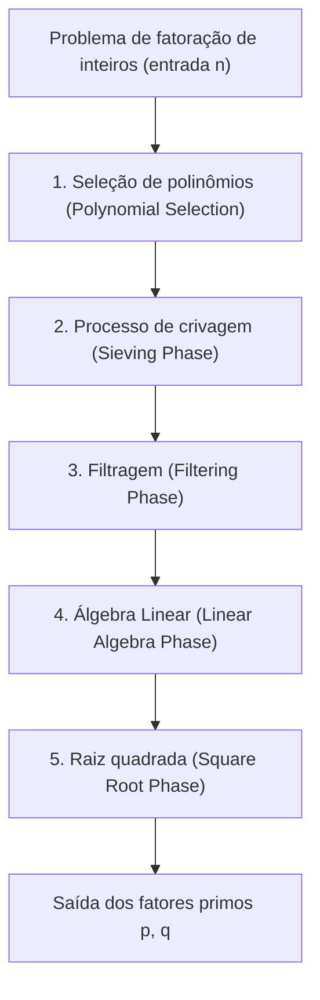
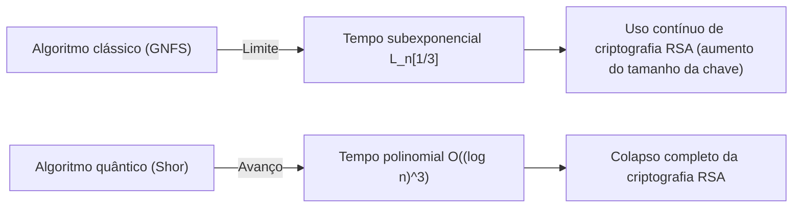

## 1. Introdução: A Fatoração de Inteiros e a Base da Criptografia Moderna

A segurança das comunicações na Internet na sociedade moderna depende fortemente da segurança da criptografia de chave pública RSA. A segurança do RSA baseia-se na suposição matemática da "dificuldade de fatorar números compostos gigantes". Se um algoritmo de fatoração extremamente eficiente for descoberto, a infraestrutura de comunicação em todo o mundo desmoronaria desde a sua base.

Atualmente, o **Crivo Geral dos Campos de Números (GNFS - General Number Field Sieve)** reina como o algoritmo mais rápido e poderoso para a fatoração de números inteiros gigantes utilizando computadores clássicos. O GNFS nasceu como uma extensão do Crivo Especial dos Campos de Números (SNFS), proposto no final da década de 1980, e estabeleceu recordes de fatoração para números compostos enormes como o RSA-768 e RSA-250 até os dias de hoje.

No entanto, criptógrafos e matemáticos sempre se fazem as seguintes perguntas: "Existe algum algoritmo clássico que supere o GNFS?" "Onde está o limite dos computadores clássicos?" e "Como os computadores quânticos irão contornar essa situação?"

Neste artigo, dissecaremos exaustivamente as profundas estruturas matemáticas por trás do GNFS e conduziremos uma análise técnica detalhada da seleção de polinômios, processo de crivagem e etapas de álgebra linear usando o método de Block Wiedemann. Além disso, consideraremos métodos de extensão para GNFS, como as melhorias de Coppersmith, e compararemos e explicaremos as diferenças cruciais entre os algoritmos clássicos de tempo subexponencial (Sub-exponential time) e os algoritmos quânticos de tempo polinomial a partir de uma perspectiva matemática.

---

## 2. Complexidade Assintótica e Notação L (L-notation)

Ao avaliar a complexidade de algoritmos de fatoração, a **Notação L (L-notation)** é usada para expressar o tempo subexponencial relativo ao número de dígitos da entrada $n$, ao invés da notação padrão de tempo polinomial (como $O(n^k)$). A notação L é definida da seguinte forma:

$$
L_n[\alpha, c] = \exp \left( (c + o(1)) (\ln n)^\alpha (\ln \ln n)^{1-\alpha} \right)
$$

Aqui, $n$ é o número inteiro a ser fatorado e $\ln n$ é o logaritmo natural, o qual é proporcional ao comprimento em bits de $n$.
- Quando $\alpha = 0$: $L_n[0, c] = \exp(c \ln \ln n) = (\ln n)^c$, representando um **tempo polinomial (Polynomial time)** em relação ao comprimento em bits.
- Quando $\alpha = 1$: $L_n[1, c] = \exp(c \ln n) = n^c$, representando um **tempo exponencial (Exponential time)** em relação ao comprimento em bits.
- Quando $0 < \alpha < 1$: Representa um **tempo subexponencial (Sub-exponential time)** localizado entre o tempo polinomial e o tempo exponencial.

A evolução dos algoritmos de fatoração no passado tem sido a história de reduzir gradualmente o valor desse $\alpha$.
- **Fração Contínua (CFRAC) e Crivo Quadrático de Múltiplos Polinômios (MPQS)**: Pertencem à classe $\alpha = 1/2$ e a complexidade de cálculo é de cerca de $L_n[1/2, 1]$.
- **Crivo Geral dos Campos de Números (GNFS)**: Alcançou $\alpha = 1/3$ e ostenta a complexidade computacional mais rápida de $L_n[1/3, (64/9)^{1/3}]$ entre os algoritmos clássicos conhecidos atualmente.

---

## 3. Visão Geral do Algoritmo GNFS e Estrutura Matemática

O GNFS possui uma base matemática muito complexa e avançada. A ideia básica é uma extensão do Pequeno Teorema de Fermat e do Crivo Quadrático (QS), consistindo em encontrar um par não-trivial $(X, Y)$ que satisfaça a congruência $X^2 \equiv Y^2 \pmod n$ e $X \not\equiv \pm Y \pmod n$, para assim derivar um fator $\gcd(X-Y, n)$ de $n$.

No entanto, a verdadeira essência do GNFS não é fazer isso apenas no corpo dos números racionais $\mathbb{Q}$, mas sim buscar simultaneamente por "números suaves (Smooth numbers)" tanto em uma extensão de corpo chamada Corpo de Números Algébricos (Algebraic Number Field) $\mathbb{Q}(\alpha)$ quanto no corpo dos números racionais, e construir uma relação de congruência por meio de um homomorfismo.

O processo do GNFS é amplamente dividido em 5 fases.

### 3.1 Fase 1: Seleção de polinômios (Polynomial Selection)

O sucesso do GNFS depende fortemente da seleção adequada dos polinômios. O objetivo é encontrar dois polinômios irredutíveis $f_1(x)$ (lado racional) e $f_2(x)$ (lado algébrico) que compartilham uma raiz comum $m$. Ou seja,
$f_1(m) \equiv f_2(m) \equiv 0 \pmod n$
satisfazendo.

Normalmente, um polinômio linear $f_1(x) = x - m$ é escolhido para o lado racional, e um polinômio mônico $f_2(x)$ de grau $d$ (tipicamente 5 ou 6) é escolhido para o lado algébrico. A abordagem mais clássica é o **Método de base $m$ (Base-$m$ method)**.
Escolhe-se um inteiro $m = \lfloor n^{1/(d+1)} \rfloor$ próximo à raiz $1/(d+1)$ de $n$ e expande-se $n$ na base $m$.
$n = c_d m^d + c_{d-1} m^{d-1} + \dots + c_1 m + c_0$
Com isso, obtemos o polinômio $f_2(x) = c_d x^d + c_{d-1} x^{d-1} + \dots + c_0$. Claramente, $f_2(m) = n \equiv 0 \pmod n$.

Entretanto, em implementações modernas o **Algoritmo de Kleinjung** é utilizado. Ele busca polinômios cujos coeficientes não se tornem extremamente grandes (otimização de Skewness) enquanto otimiza propriedades algébricas (valor $E$ de Murphy e valor $\alpha$), facilitando a geração de números suaves durante o processo de crivagem. Esta etapa por si só requer uma enorme quantidade de recursos computacionais.

### 3.2 Fase 2: Processo de crivagem (Sieving Phase)

Uma vez que os polinômios são determinados, entra-se na fase de "Crivagem (Sieving)", que é a fase mais exigente do ponto de vista computacional do algoritmo. Aqui, buscamos pares $(a, b)$. Este par deve ser coprimo entre si e é requerido que os dois valores seguintes sejam simultaneamente "suaves (Smooth)".

1. **Norma do lado racional**: $F_1(a, b) = b \cdot f_1(a/b) = a - bm$
2. **Norma do lado algébrico**: $F_2(a, b) = b^d \cdot f_2(a/b)$

"Suave" significa que o valor pode ser fatorado apenas por números primos menores ou iguais a um limite especificado (Sieve bound). Uma base de fatores (Factor base) para o lado racional e outra para o lado algébrico são preparadas, e números suaves são encontrados eficientemente em um enorme espaço de busca utilizando uma técnica semelhante ao Crivo de Eratóstenes.
Hoje, uma técnica chamada **Crivo em Reticulado (Lattice Sieving)** é dominante, onde se fixa um número primo específico $q$ e realiza-se a crivagem apenas em pares $(a, b)$ em um sub-reticulado no qual tanto o lado racional quanto o algébrico são múltiplos de $q$, alcançando assim uma eficiência extremamente alta.

### 3.3 Fase 3: Filtragem (Filtering Phase)

O número de relações suaves (relations) encontradas no processo de crivagem chega a centenas de milhões, ou até bilhões. No entanto, muitas destas contêm informações inúteis.
O objetivo da filtragem é construir uma enorme matriz esparsa (Sparse Matrix) ao mesmo tempo que reduz a sua dimensionalidade ao máximo possível.

Especificamente, realizam-se as seguintes operações:
- **Remoção de singletons (Singleton removal)**: Excluir as relações que contêm fatores primos que aparecem apenas uma vez.
- **Remoção de cliques / Mesclagem (Clique removal / Merging)**: Multiplicar relações que possuem fatores primos que aparecem duas ou mais vezes, eliminando variáveis para reduzir para um sistema de equações de maior densidade, porém menor dimensionalidade.

Com isso, uma matriz com bilhões de linhas é comprimida em uma enorme matriz esparsa $\mathbf{A}$ (com elementos 0 e 1 sobre o corpo $\mathbb{F}_2$) de nível de dezenas de milhões de linhas.

### 3.4 Fase 4: Álgebra Linear (Linear Algebra Phase)

Aqui, buscamos um vetor de solução não trivial $\mathbf{x}$ para a equação $\mathbf{A} \mathbf{x} \equiv \mathbf{0} \pmod 2$. Ou seja, é o problema de encontrar o espaço nulo à esquerda (Left Nullspace) de uma enorme matriz esparsa.

Devido ao tamanho extremo da matriz, é totalmente inviável calcular com a eliminação gaussiana padrão ($O(N^3)$). Portanto, utilizam-se métodos iterativos, que são um tipo de método de subespaço de Krylov. Historicamente, o **Método Block Lanczos** tem sido utilizado, mas em ambientes modernos de computação distribuída o **Algoritmo de Block Wiedemann**, que pode reduzir drasticamente a sobrecarga de comunicação, é o dominante.

O método Block Wiedemann calcula o polinômio mínimo a partir da matriz $\mathbf{A}$ e de sequências de vetores e constrói a base do espaço nulo utilizando o algoritmo de Berlekamp-Massey. Esse passo é extremamente difícil de paralelizar, o que exige redes de comunicação estreitamente acopladas em supercomputadores ou grandes clusters, sendo um dos maiores gargalos do GNFS.

### 3.5 Fase 5: Raiz quadrada (Square Root Phase)

A partir das soluções da álgebra linear, constrói-se um produto que é um "quadrado perfeito" em ambos os lados, o racional e o algébrico.
No lado racional, $\prod (a-bm)$ torna-se o quadrado $X^2$ de um determinado inteiro $X$, enquanto no lado algébrico o produto dos ideais correspondentes torna-se um quadrado perfeito $\gamma^2$ no corpo de números algébricos.
Ao calcular esse $\gamma$ no corpo de números algébricos e aplicar o homomorfismo ao anel dos inteiros racionais $\phi: \alpha \mapsto m \pmod n$, obtemos a congruência:
$X^2 \equiv \phi(\gamma)^2 \equiv Y^2 \pmod n$
obtém-se.

O cálculo da raiz quadrada no corpo de números algébricos utiliza algoritmos complexos, como o **Método de Montgomery**, exigindo um profundo conhecimento em teoria algébrica dos números. Finalmente, $\gcd(X-Y, n)$ é calculado, e se um fator não trivial for obtido, a fatoração estará concluída.

---

## 4. Existe algum algoritmo clássico que supere o GNFS?

Até o momento, não foi descoberto nenhum algoritmo clássico que seja capaz de atingir uma complexidade assintótica abaixo de $L_n[1/3, c]$ para a fatoração de números inteiros gerais. No entanto, existem algumas tentativas e algoritmos derivados voltados a romper esses limites teóricos e práticos.

### 4.1 Crivo de Múltiplos Campos de Números (MNFS: Multiple Number Field Sieve)

Como uma abordagem estendida do GNFS, existe o **Crivo de Múltiplos Campos de Números (MNFS)** de D. Coppersmith. Enquanto o GNFS utiliza 2 polinômios (um lado racional e um algébrico), o MNFS utiliza múltiplos polinômios algébricos diferentes em conjunto com um único polinômio racional.

$$ f_1(x), f_{2,1}(x), f_{2,2}(x), \dots, f_{2,V}(x) $$

Ao usar múltiplos corpos algébricos, a probabilidade de "ser suave em qualquer um dos corpos algébricos" em cada etapa da crivagem aumenta drasticamente. Com essa abordagem, Coppersmith conseguiu reduzir ligeiramente a constante $c$ da complexidade $L_n[1/3, c]$.
Especificamente, enquanto a constante no GNFS é $c = (64/9)^{1/3} \approx 1.923$, mostrou-se teoricamente que a complexidade pode ser reduzida até $c \approx 1.902$ ao otimizar o MNFS.
No entanto, na prática, a sobrecarga de gerenciar múltiplos corpos é grande, e não houve grandes avanços definitivos em módulos RSA em escalas de uso no mundo real.

### 4.2 Algoritmos de classe $L_n[1/4]$ são possíveis?

O tema sobre "se um algoritmo com expoente $\alpha = 1/4$ existe", quanto ao limite dos algoritmos clássicos de fatoração, tem sido debatido há muito tempo entre os matemáticos.
O GNFS atual e suas derivações estão fortemente atrelados ao modelo de "busca por suavidade" usando crivos, e é amplamente acreditado que $\alpha = 1/3$ é o limite desse paradigma. Com base na análise das probabilidades de distribuição de números inteiros suaves utilizando a função de Dickman, acredita-se que não é possível superar a barreira de $O(L_n[1/3])$ com a combinação dos métodos de construção de campos algébricos e de crivos atuais, não importa o quanto se otimize.

Se um algoritmo $L_n[1/4]$ ou mesmo um algoritmo polinomial clássico existisse, dependeria de uma estrutura matemática inteiramente nova e inimaginável pela humanidade até então (como, por exemplo, a abordagem muito mais avançada de geometria algébrica, semelhante ao Algoritmo de Schoof para a criptografia de curvas elípticas), e não na abordagem de "base em suavidade" como no GNFS. No entanto, atualmente não há sinal disso.

---

## 5. O Grande Avanço da Computação Quântica: Algoritmo de Shor

Enquanto os computadores clássicos enfrentam a barreira de $L_n[1/3]$, o **Algoritmo de Shor (Shor's Algorithm)**, introduzido por Peter Shor em 1994, destruiu esta parede mudando fundamentalmente o modelo de computação em si.

### 5.1 O impacto do tempo polinomial quântico

O Algoritmo de Shor reduz o problema da fatoração a um "Problema de Busca de Ordem (Order Finding Problem)". Dado um inteiro $a$, é o problema de encontrar o período (ordem) $r$ da função $f(x) = a^x \pmod n$.
Um computador clássico leva um tempo exponencial para encontrar esse período, mas usando a **Estimação de Fase Quântica (QPE: Quantum Phase Estimation)** e a **Transformada de Fourier Quântica (QFT: Quantum Fourier Transform)** em um computador quântico, todas as superposições de estado (Superposition) podem ser avaliadas em paralelo, o que permite extrair o período $r$ com alta probabilidade.

Em termos de complexidade computacional, o tempo de execução do Algoritmo de Shor é de **tempo polinomial quântico**, especificamente o seguinte:
$$ O((\log n)^3) $$
Tendo em vista as implementações de circuitos otimizadas nos últimos anos, afirma-se que o tempo pode ser reduzido até $O((\log n)^2 \log \log n)$.

### 5.2 Tempo subexponencial clássico vs Tempo polinomial quântico

A diferença entre essas duas classes de complexidade tem um significado decisivo na segurança de criptografias no mundo real.

Por exemplo, considere a fatoração do RSA-2048 (um número composto de 2048 bits).
- **GNFS (Clássico)**: Substituindo $n \approx 2^{2048}$ em $L_n[1/3, 1.923]$, serão necessárias cerca de $2^{112}$ operações. Essa é uma quantidade de cálculos astronômica que demoraria mais que a idade do universo, mesmo se reuníssemos todos os recursos de computação do planeta.
- **Algoritmo de Shor (Quântico)**: No algoritmo $O((\log n)^3)$, seriam necessárias apenas cerca de $2048^3 \approx 8.5 \times 10^9$ operações em portas lógicas. Isso significa que a computação poderia ser concluída de apenas algumas horas a alguns dias se houvesse o hardware adequado (um computador quântico universal capaz de corrigir erros com alguns milhões de qubits físicos).

A mudança de paradigma da complexidade subexponencial com "expoente $\alpha=1/3$" para "tempo polinomial" anula a estratégia tradicional de criptografia que consiste em garantir a segurança por meio do alongamento do comprimento da chave.

---

## 6. Conclusão: Perspectivas para a próxima geração

O consenso atual na comunidade científica em relação à pergunta "Existe algum algoritmo clássico que supere o GNFS?" é o seguinte:

1. **Aprimoramentos práticos continuam, mas não há um grande salto assintótico**: As tentativas de melhorar o fator $c$ do GNFS através do MNFS, da otimização na seleção de polinômios, da paralelização do Método de Block Wiedemann, etc., seguem ocorrendo. Contudo, considera-se extremamente improvável que seja descoberto um algoritmo clássico abaixo de $\alpha = 1/3$.
2. **A segurança do RSA em computadores clássicos permanece forte**: A complexidade computacional do GNFS continua enorme, e os RSA-2048 e RSA-4096 permanecerão protegidos contra ataques vindos de computadores clássicos durante as próximas décadas.
3. **A verdadeira ameaça é o algoritmo quântico**: O Algoritmo de Shor, baseado nos princípios da mecânica quântica, ultrapassou os limites da complexidade computacional. Como resultado, o mundo é obrigado a realizar a transição para a Criptografia Pós-Quântica (PQC). A fronteira da criptografia de hoje encontra-se em novos problemas matemáticos, como a criptografia baseada em reticulados e a criptografia baseada em hashes, as quais são consideradas difíceis de se decifrar até para computadores quânticos (ou seja, não possuem resolução no tempo polinomial).

O Crivo Geral dos Campos de Números (GNFS) é uma das maiores conquistas matemáticas alcançadas pela humanidade ao desafiar os limites do design de algoritmos e matemática clássica. Compreender a profunda estrutura matemática do GNFS não é apenas aprender sobre a história da criptanálise, é também uma jornada de exploração intelectual que nos permite tocar na beleza da teoria da complexidade computacional e da teoria algébrica dos números. Até ao dia em que os computadores quânticos se tornarem práticos, o GNFS deverá manter a sua coroa como o algoritmo de fatoração de inteiros mais poderoso.

