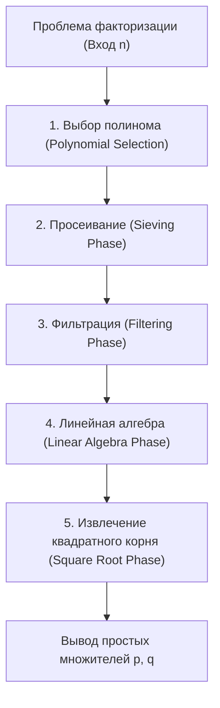
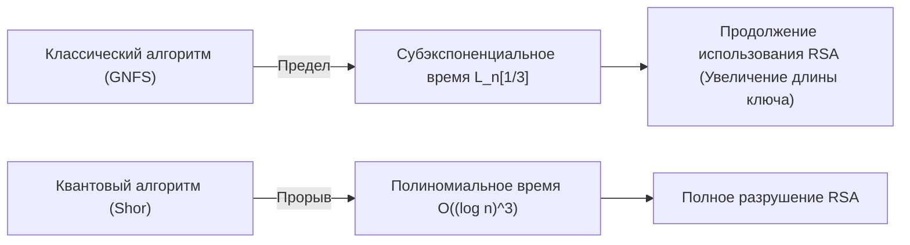

## 1. Введение: Факторизация целых чисел и основа современной криптографии

Безопасность интернет-коммуникаций в современном обществе во многом зависит от безопасности криптографии с открытым ключом, в частности алгоритма RSA. А безопасность RSA основана на математическом предположении о "сложности факторизации огромных составных чисел". Если будет найден чрезвычайно эффективный алгоритм факторизации целых чисел, глобальная коммуникационная инфраструктура будет разрушена до основания.

В настоящее время **общий метод решета числового поля (GNFS: General Number Field Sieve)** является самым быстрым и мощным алгоритмом факторизации огромных целых чисел на классических компьютерах. GNFS появился как расширение специального метода решета числового поля (SNFS), предложенного в конце 1980-х годов, и до сих пор удерживает рекорды по факторизации таких огромных составных чисел, как RSA-768 и RSA-250.

Однако криптографы и математики постоянно задаются следующими вопросами: "Существует ли классический алгоритм, превосходящий GNFS?", "Где лежат границы возможностей классических компьютеров?" и "Как квантовые компьютеры смогут преодолеть этот барьер?".

В этой статье мы подробно разберем глубокую математическую структуру, лежащую в основе GNFS, и проведем детальный технический анализ выбора полиномов, процесса просеивания и этапа линейной алгебры с использованием метода Блока-Видемана. Кроме того, мы рассмотрим методы расширения GNFS, такие как улучшения Копперсмита, и сравним фундаментальные различия между классическими алгоритмами субэкспоненциального времени (Sub-exponential time) и квантовыми алгоритмами полиномиального времени с математической точки зрения.

---

## 2. Асимптотическая сложность и L-нотация (L-notation)

При оценке сложности алгоритмов факторизации целых чисел для выражения субэкспоненциального времени относительно количества цифр входного числа $n$ используется **L-нотация (L-notation)**, а не стандартная запись полиномиального времени (например, $O(n^k)$). L-нотация определяется следующим образом:

$$
L_n[\alpha, c] = \exp \left( (c + o(1)) (\ln n)^\alpha (\ln \ln n)^{1-\alpha} \right)
$$

Где $n$ — целое число, которое необходимо факторизовать, а $\ln n$ — натуральный логарифм, пропорциональный битовой длине $n$.
- Если $\alpha = 0$: $L_n[0, c] = \exp(c \ln \ln n) = (\ln n)^c$, что представляет **полиномиальное время (Polynomial time)** относительно битовой длины.
- Если $\alpha = 1$: $L_n[1, c] = \exp(c \ln n) = n^c$, что представляет **экспоненциальное время (Exponential time)** относительно битовой длины.
- Если $0 < \alpha < 1$: сложность находится между полиномиальным и экспоненциальным временем, образуя класс **субэкспоненциального времени (Sub-exponential time)**.

Эволюция алгоритмов факторизации в прошлом по сути была историей постепенного уменьшения этого значения $\alpha$.
- **Метод цепных дробей (CFRAC) и метод множественного полиномиального квадратичного решета (MPQS)**: относятся к классу $\alpha = 1/2$, их сложность составляет примерно $L_n[1/2, 1]$.
- **Общий метод решета числового поля (GNFS)**: достигает $\alpha = 1/3$ и обладает невероятной сложностью $L_n[1/3, (64/9)^{1/3}]$, являясь самым быстрым среди известных классических алгоритмов в настоящее время.

---

## 3. Общая картина алгоритма и математическая структура GNFS (Общий метод решета числового поля)

GNFS имеет очень сложную и глубокую математическую базу. Основная идея является продолжением Малой теоремы Ферма и метода квадратичного решета (QS): она заключается в нахождении нетривиальной пары $(X, Y)$, удовлетворяющей сравнению $X^2 \equiv Y^2 \pmod n$ и при этом $X \not\equiv \pm Y \pmod n$, что позволяет вывести множитель числа $n$ как $\gcd(X-Y, n)$.

Однако суть GNFS состоит в том, что это делается не только в поле рациональных чисел $\mathbb{Q}$, но и путем одновременного поиска "гладких чисел (Smooth numbers)" как в поле расширения $\mathbb{Q}(\alpha)$, называемом алгебраическим числовым полем (Algebraic Number Field), так и в поле рациональных чисел, выстраивая отношения конгруэнтности через гомоморфизмы.

Процесс GNFS в основном делится на 5 этапов.

### 3.1 Этап 1: Выбор полинома (Polynomial Selection)

Успех GNFS во многом зависит от выбора подходящих полиномов. Цель — найти два неприводимых полинома $f_1(x)$ (на рациональной стороне) и $f_2(x)$ (на алгебраической стороне), имеющих общий корень $m$. То есть, они должны удовлетворять условию:
$f_1(m) \equiv f_2(m) \equiv 0 \pmod n$

Обычно для рациональной стороны выбирают линейный полином $f_1(x) = x - m$, а для алгебраической стороны $f_2(x)$ выбирают унитарный полином степени $d$ (чаще всего 5 или 6). Наиболее классическим подходом является **метод Base-$m$**.
Выбирается целое число $m = \lfloor n^{1/(d+1)} \rfloor$, близкое к $1/(d+1)$-й степени $n$, и $n$ раскладывается по основанию $m$:
$n = c_d m^d + c_{d-1} m^{d-1} + \dots + c_1 m + c_0$
Таким образом мы получаем полином $f_2(x) = c_d x^d + c_{d-1} x^{d-1} + \dots + c_0$. Очевидно, что $f_2(m) = n \equiv 0 \pmod n$.

Однако в современных реализациях используется **алгоритм Кляйньюнга (Kleinjung's algorithm)**. Он находит полиномы, оптимизирующие алгебраические свойства (значение Murphy's $E$ или $\alpha$-value) и увеличивающие вероятность генерации гладких чисел на этапе просеивания, при этом не допуская чрезмерного увеличения коэффициентов полинома (оптимизация Skewness). В один только этот шаг вкладываются огромные вычислительные ресурсы.

### 3.2 Этап 2: Просеивание (Sieving Phase)

После того как полиномы определены, алгоритм переходит к этапу "просеивания (Sieving)", который является самым вычислительно ресурсоемким. Здесь осуществляется поиск пар $(a, b)$. Эта пара взаимно проста, и требуется, чтобы следующие два значения одновременно были "гладкими (Smooth)":

1. **Норма на рациональной стороне**: $F_1(a, b) = b \cdot f_1(a/b) = a - bm$
2. **Норма на алгебраической стороне**: $F_2(a, b) = b^d \cdot f_2(a/b)$

"Гладкий" означает, что число можно факторизовать, используя только простые числа, не превышающие заданного предела (Sieve bound). Подготавливаются базы простых чисел (Factor base) для рациональной и алгебраической сторон, и гладкие числа эффективно находятся в огромном пространстве поиска по принципу решета Эратосфена.
В настоящее время основным методом является так называемое **просеивание по решетке (Lattice Sieving)**, при котором фиксируется определенное простое число $q$, и просеиваются только те пары $(a, b)$ на подрешетке, для которых и рациональная, и алгебраическая стороны кратны $q$, что позволяет достичь крайне высокой эффективности.

### 3.3 Этап 3: Фильтрация (Filtering Phase)

Количество гладких соотношений (relations), найденных в процессе просеивания, достигает сотен миллионов или миллиардов. Однако многие из них содержат бесполезную информацию.
Цель фильтрации — построить гигантскую разреженную матрицу (Sparse Matrix), одновременно минимизировав её размерность.

В частности, выполняются следующие операции:
- **Singleton removal**: Удаление соотношений, содержащих простые множители, которые встречаются только один раз.
- **Clique removal / Merging**: Перемножение соотношений, имеющих общие простые множители (встречающиеся 2 и более раз), для исключения переменных и сокращения в систему уравнений с более высокой плотностью, но меньшей размерности.

Благодаря этому матрица из миллиардов строк сжимается до гигантской разреженной матрицы $\mathbf{A}$ (элементы которой — 0 и 1 над полем $\mathbb{F}_2$) размером в десятки миллионов строк.

### 3.4 Этап 4: Линейная алгебра (Linear Algebra Phase)

Здесь мы находим нетривиальный вектор решений $\mathbf{x}$ уравнения $\mathbf{A} \mathbf{x} \equiv \mathbf{0} \pmod 2$. Иными словами, это задача нахождения левого нуль-пространства (Left Nullspace) гигантской разреженной матрицы.

Поскольку размер матрицы экстремально велик, вычисления обычным методом Гаусса ($O(N^3)$) абсолютно невозможны. Поэтому используются итерационные методы, относящиеся к методам подпространства Крылова. Исторически использовался **блочный метод Ланцоша (Block Lanczos)**, но в современных распределенных вычислительных средах доминирует **блочный метод Видемана (Block Wiedemann Algorithm)**, способный радикально снизить накладные расходы на обмен данными.

Блочный метод Видемана вычисляет минимальный полином на основе матрицы $\mathbf{A}$ и последовательности векторов, а затем использует алгоритм Берлекэмпа-Мэсси (Berlekamp-Massey) для построения базиса нуль-пространства. Этот шаг крайне трудно поддается распараллеливанию и требует наличия суперкомпьютеров или тесно связанных коммуникационных сетей крупномасштабных кластеров, что является одним из главных узких мест GNFS.

### 3.5 Этап 5: Извлечение квадратного корня (Square Root Phase)

Из решений линейной алгебры конструируются произведения, которые образуют "полные квадраты" на рациональной и алгебраической сторонах.
На рациональной стороне $\prod (a-bm)$ становится квадратом $X^2$ некоего целого числа $X$, а на алгебраической стороне произведение соответствующих идеалов образует полный квадрат $\gamma^2$ над алгебраическим полем.
Вычисляя этот $\gamma$ в алгебраическом поле и применяя гомоморфизм $\phi: \alpha \mapsto m \pmod n$ в кольцо рациональных целых чисел, получаем сравнение:
$X^2 \equiv \phi(\gamma)^2 \equiv Y^2 \pmod n$

Для изчисления квадратного корня над алгебраическим полем используются сложные алгоритмы, такие как **метод Монтгомери (Montgomery's Method)**, требующие глубоких знаний алгебраической теории чисел. В итоге вычисляется $\gcd(X-Y, n)$, и если найден нетривиальный множитель, факторизация завершена.

---

## 4. Существуют ли классические алгоритмы, превосходящие GNFS?

На сегодняшний день не обнаружено классического алгоритма факторизации произвольных целых чисел, асимптотическая сложность которого была бы ниже $L_n[1/3, c]$. Тем не менее, существуют некоторые попытки и производные алгоритмы, стремящиеся преодолеть теоретические и практические пределы.

### 4.1 Метод решета множественного числового поля (MNFS: Multiple Number Field Sieve)

В качестве расширения GNFS существует **метод решета множественного числового поля (MNFS)**, предложенный Д. Копперсмитом. В то время как GNFS использует 2 полинома (рациональный и алгебраический), MNFS одновременно применяет несколько различных алгебраических полиномов для одного рационального полинома:

$$ f_1(x), f_{2,1}(x), f_{2,2}(x), \dots, f_{2,V}(x) $$

Использование нескольких алгебраических полей позволяет резко повысить вероятность того, что число окажется "гладким в каком-либо из алгебраических полей" на каждом этапе просеивания. Благодаря этому подходу Копперсмиту удалось незначительно уменьшить константу $c$ в сложности $L_n[1/3, c]$.
В частности, теоретически доказано, что константа GNFS $c = (64/9)^{1/3} \approx 1.923$ при оптимизации с помощью MNFS может быть снижена примерно до $c \approx 1.902$.
Однако на практике накладные расходы на управление множественными полями огромны, и это не привело к решающему прорыву для модулей RSA практических размеров.

### 4.2 Возможны ли алгоритмы класса $L_n[1/4]$?

Тема "Существуют ли алгоритмы с показателем $\alpha = 1/4$?" на протяжении многих лет остается предметом дебатов среди математиков, обсуждающих пределы классических алгоритмов факторизации.
Текущий GNFS и его производные сильно привязаны к концепции "поиска гладкости" с помощью решета, и в рамках этой парадигмы широко распространено мнение, что $\alpha = 1/3$ является пределом. Анализ вероятности распределения гладких целых чисел с использованием функции Дикмана (Dickman function) также показывает, что при нынешних методах построения алгебраических полей в сочетании с решетом невозможно преодолеть барьер $O(L_n[1/3])$, как бы ни проводилась оптимизация.

Если алгоритм $L_n[1/4]$ или же классический алгоритм полиномиального времени действительно существует, он должен опираться на совершенно иную математическую структуру, не основанную на "поиске гладкости", как GNFS (например, на более продвинутые подходы из алгебраической геометрии, подобные алгоритму Схофа (Schoof's algorithm) для эллиптической криптографии), которую человечество пока не может себе представить. Однако в настоящее время предпосылок для этого не наблюдается.

---

## 5. Прорыв квантовых компьютеров: алгоритм Шора

В то время как классические компьютеры столкнулись с барьером $L_n[1/3]$, этот барьер был разрушен **алгоритмом Шора (Shor's Algorithm)**, опубликованным Питером Шором в 1994 году, который в корне изменил саму модель вычислений.

### 5.1 Шок квантового полиномиального времени

Алгоритм Шора сводит задачу факторизации к "задаче нахождения порядка (Order Finding Problem)". Для заданного целого числа $a$ это задача нахождения периода (порядка) $r$ функции $f(x) = a^x \pmod n$.
Классическому компьютеру требуется экспоненциальное время, чтобы найти этот период, но, используя **квантовую оценку фазы (QPE: Quantum Phase Estimation)** и **квантовое преобразование Фурье (QFT: Quantum Fourier Transform)** на квантовом компьютере, можно параллельно оценить суперпозицию всех состояний и с высокой вероятностью извлечь период $r$.

С точки зрения сложности, время выполнения алгоритма Шора относится к **квантовому полиномиальному времени**, а именно:
$$ O((\log n)^3) $$
С учетом последних оптимизаций схем считается, что эту величину можно сократить до $O((\log n)^2 \log \log n)$.

### 5.2 Классическое субэкспоненциальное время против квантового полиномиального времени

Разница между этими двумя классами сложности имеет решающее значение для безопасности криптографии в реальном мире.

Например, рассмотрим случай факторизации RSA-2048 (составное число из 2048 бит).
- **GNFS (классический)**: при подстановке $n \approx 2^{2048}$ в $L_n[1/3, 1.923]$ потребуется примерно $2^{112}$ операций. Это астрономический объем вычислений, который займет время, превышающее возраст Вселенной, даже если объединить все вычислительные ресурсы, существующие сейчас на Земле.
- **Алгоритм Шора (квантовый)**: алгоритму $O((\log n)^3)$ потребуется около $2048^3 \approx 8.5 \times 10^9$ операций с логическими вентилями. Это означает, что при наличии подходящего оборудования (универсального квантового компьютера с миллионами физических кубитов и возможностью исправления ошибок) вычисления могут быть завершены всего за несколько часов или дней.

Смена парадигмы с субэкспоненциальной сложности с "показателем $\alpha=1/3$" на "полиномиальное время" делает традиционную криптографическую стратегию обеспечения безопасности за счет увеличения длины ключа неэффективной.

---

## 6. Заключение: Перспективы для следующего поколения

Текущий консенсус в научном сообществе по вопросу "Существуют ли классические алгоритмы, превосходящие GNFS?" таков:

1. **Практические улучшения продолжаются, но асимптотических скачков не предвидится**: Попытки улучшить константу $c$ в GNFS продолжаются, включая MNFS, оптимизацию выбора полиномов и распараллеливание метода Блока-Видемана. Однако вероятность открытия классического алгоритма со сложностью ниже $\alpha = 1/3$ считается крайне низкой.
2. **Безопасность RSA на классических компьютерах остается надежной**: Вычислительная сложность GNFS по-прежнему огромна, и RSA-2048 или RSA-4096 будут оставаться безопасными от атак на классических компьютерах в течение многих последующих десятилетий.
3. **Истинная угроза исходит от квантовых алгоритмов**: Барьер вычислительной сложности был преодолен алгоритмом Шора, основанным на принципах квантовой механики. Из-за этого мир вынужден переходить на постквантовую криптографию (PQC: Post-Quantum Cryptography). Переход к новым математическим проблемам, которые считаются сложными для решения (не могут быть решены за полиномиальное время) даже на квантовых компьютерах, таким как криптография на решетках и криптография на основе хешей, сегодня является передним краем криптографии.

Общий метод решета числового поля (GNFS) — это одна из "высших точек", достигнутых человечеством в своем стремлении дойти до пределов классической математики и проектирования алгоритмов. Понимание глубокой математической структуры GNFS — это не просто изучение истории криптоанализа, но и путешествие в мир интеллектуальных исследований, позволяющее прикоснуться к красоте теории вычислительной сложности и алгебраической теории чисел. До того дня, когда квантовые компьютеры найдут практическое применение, GNFS, вероятно, будет продолжать удерживать трон как самый мощный алгоритм факторизации простых чисел.

