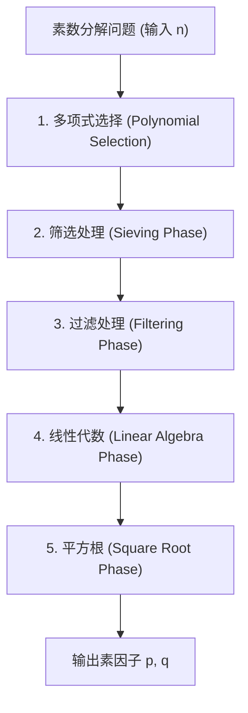
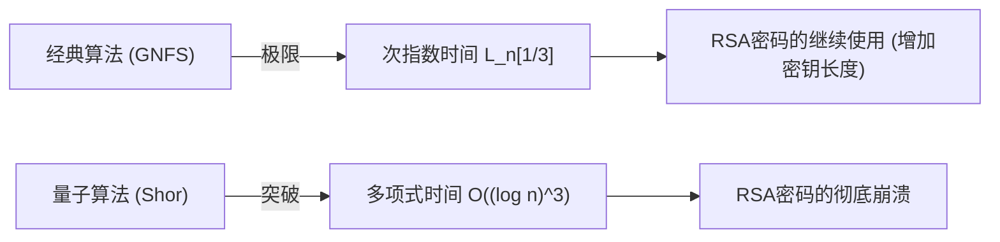

## 1. 引言：整数分解与现代密码学的根基

现代社会中互联网通信的安全性在很大程度上依赖于公开密钥密码体制RSA的安全性。而RSA密码的安全性是基于“大合数分解难度”这一数学假设。如果发现了极其高效的整数分解算法，全球的通信基础设施将从根本上崩溃。

目前，在使用经典计算机分解大整数时，**普通数域筛选法（GNFS: General Number Field Sieve）**作为最快、最强的算法占据着统治地位。GNFS是在1980年代后期提出的特殊数域筛选法（SNFS）的扩展基础上诞生的，直到今天，它依然保持着分解RSA-768和RSA-250等巨大合数的记录。

然而，密码学家和数学家们始终抱有如下疑问：“是否存在超越GNFS的经典算法？”“经典计算机的极限在哪里？”以及，“量子计算机将如何打破这一僵局？”

本文将深入剖析GNFS背后的深邃数学结构，并对多项式选择、筛选处理、以及利用Block Wiedemann方法的线性代数步骤等进行详细的技术分析。此外，还将探讨通过Coppersmith改进等方法对GNFS进行扩展的技术，并从数学角度比较和解释经典次指数时间（Sub-exponential time）算法与量子多项式时间算法之间的决定性差异。

---

## 2. 渐进复杂度与L记号（L-notation）

在评估整数分解算法的计算复杂度时，标准的多项式时间表示（如 $O(n^k)$ 等）不再适用，为了表示相对于输入 $n$ 的位数的次指数时间，我们使用**L记号（L-notation）**。L记号的定义如下：

$$
L_n[\alpha, c] = \exp \left( (c + o(1)) (\ln n)^\alpha (\ln \ln n)^{1-\alpha} \right)
$$

在这里，$n$ 是待分解的整数，$\ln n$ 是自然对数，与 $n$ 的位长成正比。
- 当 $\alpha = 0$ 时：$L_n[0, c] = \exp(c \ln \ln n) = (\ln n)^c$，表示相对于位长的**多项式时间（Polynomial time）**。
- 当 $\alpha = 1$ 时：$L_n[1, c] = \exp(c \ln n) = n^c$，表示相对于位长的**指数时间（Exponential time）**。
- 当 $0 < \alpha < 1$ 时：介于多项式时间和指数时间之间，称为**次指数时间（Sub-exponential time）**。

过去整数分解算法的进化史，同时也是这个 $\alpha$ 值逐渐减小的历史。
- **连分数法（CFRAC）与多重多项式二次筛选法（MPQS）**：属于 $\alpha = 1/2$ 的类别，计算复杂度约为 $L_n[1/2, 1]$。
- **普通数域筛选法（GNFS）**：实现了 $\alpha = 1/3$，在目前已知的经典算法中，它拥有最快的 $L_n[1/3, (64/9)^{1/3}]$ 计算复杂度。

---

## 3. GNFS（普通数域筛选法）算法全貌与数学结构

GNFS拥有非常复杂且高级的数学基础。其基本思想是费马小定理和二次筛选法（QS）的延伸，即寻找满足同余式 $X^2 \equiv Y^2 \pmod n$ 且 $X \not\equiv \pm Y \pmod n$ 的非平凡组合 $(X, Y)$，从而推导出 $n$ 的因子 $\gcd(X-Y, n)$。

然而，GNFS的精髓在于，它不仅仅在有理数域 $\mathbb{Q}$ 中进行计算，而是同时在称为代数数域（Algebraic Number Field）的扩域 $\mathbb{Q}(\alpha)$ 和有理数域中寻找“光滑数（Smooth numbers）”，并通过同态映射构建同余关系。

GNFS的过程大致分为5个阶段。

### 3.1 阶段1：多项式选择 (Polynomial Selection)

GNFS的成功在很大程度上取决于如何选择合适的多项式。目标是找到具有公共根 $m$ 的两个不可约多项式 $f_1(x)$（有理侧）和 $f_2(x)$（代数侧）。也就是说，满足：
$f_1(m) \equiv f_2(m) \equiv 0 \pmod n$

通常，有理侧的多项式选择一次方程 $f_1(x) = x - m$，而代数侧的多项式 $f_2(x)$ 选择一个次数为 $d$（通常为5或6）的首一多项式。最经典的方法是**Base-$m$ 方法**。
选择一个接近 $n$ 的 $1/(d+1)$ 次方的整数 $m = \lfloor n^{1/(d+1)} \rfloor$，并将 $n$ 展开为 $m$ 进制形式：
$n = c_d m^d + c_{d-1} m^{d-1} + \dots + c_1 m + c_0$
由此可以得到多项式 $f_2(x) = c_d x^d + c_{d-1} x^{d-1} + \dots + c_0$。显然 $f_2(m) = n \equiv 0 \pmod n$。

但是在现代实现中，使用的是 **Kleinjung算法**。这是一种在避免多项式系数过大（优化偏度，Skewness）的同时，优化代数性质（Murphy's $E$ value 或 $\alpha$-value），寻找能在筛选阶段更容易生成光滑数的多项式的算法。仅仅是这一步骤就会投入大量的计算资源。

### 3.2 阶段2：筛选处理 (Sieving Phase)

多项式确定后，算法进入计算负载最高的“筛选（Sieving）”阶段。在这里，我们需要寻找数据对 $(a, b)$。这个数据对必须是互素的，并且要求以下两个值同时为“光滑（Smooth）”：

1. **有理侧的范数**: $F_1(a, b) = b \cdot f_1(a/b) = a - bm$
2. **代数侧的范数**: $F_2(a, b) = b^d \cdot f_2(a/b)$

“光滑”意味着该数只能被指定的上限（Sieve bound）以下的素数分解。我们会准备一个有理侧的素数基（Factor base）和一个代数侧的素数基，并在巨大的搜索空间内，像埃拉托斯特尼筛法一样高效地找出光滑数。
目前的主流方法被称为**格筛选（Lattice Sieving）**。通过固定某个特定的素数 $q$，仅对使有理侧和代数侧同时为 $q$ 的倍数的子格上的 $(a, b)$ 对进行筛选，从而实现了极高的效率。

### 3.3 阶段3：过滤处理 (Filtering Phase)

在筛选阶段找到的光滑关系式（Relations）数量将高达数亿甚至数十亿。但其中也包含了大量无用的信息。
过滤的目的是在构建巨大的稀疏矩阵（Sparse Matrix）的同时，尽可能地缩小其维度。

具体进行如下操作：
- **Singleton removal（单例移除）**: 删除包含只出现过一次的素因子的关系式。
- **Clique removal / Merging（团移除/合并）**: 将包含出现两次以上素因子的关系式相互相乘，消去变量，将其压缩为密度更高但维度更小的方程组。

通过这一过程，数十亿行的矩阵被压缩为数千万行级别的巨大稀疏矩阵 $\mathbf{A}$（元素为域 $\mathbb{F}_2$ 上的0和1）。

### 3.4 阶段4：线性代数 (Linear Algebra Phase)

在这一步中，我们需要找到方程 $\mathbf{A} \mathbf{x} \equiv \mathbf{0} \pmod 2$ 的非平凡解向量 $\mathbf{x}$。也就是求解该巨大稀疏矩阵的左零空间（Left Nullspace）的问题。

由于矩阵规模过大，使用常规的高斯消元法（$O(N^3)$）根本无法进行计算。因此，这里使用了属于克雷洛夫子空间法（Krylov subspace method）的一种迭代法。历史上曾使用**Block Lanczos方法（块兰佐斯法）**，而在现代的分布式计算环境中，能够大幅减少通信开销的**Block Wiedemann方法（块维德曼法）**成为了主流。

Block Wiedemann方法通过计算矩阵 $\mathbf{A}$ 与向量序列的最小多项式，并使用Berlekamp-Massey算法构造零空间的基。这一步极难实现并行化，需要超级计算机或大规模集群的紧耦合通信网络，是GNFS中最大的瓶颈之一。

### 3.5 阶段5：平方根 (Square Root Phase)

利用线性代数求得的解，我们可以在有理侧和代数侧分别构造出“完全平方”的乘积。
在有理侧，$\prod (a-bm)$ 会成为某个整数 $X$ 的平方 $X^2$；在代数侧，对应的理想（Ideal）的乘积在代数数域上成为完全平方 $\gamma^2$。
在代数数域上计算出这个 $\gamma$，并通过映射到有理整数环的同态映射 $\phi: \alpha \mapsto m \pmod n$，我们可以得到同余式：
$X^2 \equiv \phi(\gamma)^2 \equiv Y^2 \pmod n$

计算代数数域上的平方根时，使用了**Montgomery方法（Montgomery's Method）**等复杂算法，这需要代数数论的深厚知识。最终，通过计算 $\gcd(X-Y, n)$，如果能得到非平凡的因子，因数分解即告完成。

---

## 4. 是否存在超越GNFS的经典算法？

迄今为止，对于一般整数的因数分解，尚未发现渐进复杂度低于 $L_n[1/3, c]$ 的经典算法。不过，为了突破理论与实践的局限，存在一些尝试与衍生算法。

### 4.1 多重数域筛选法 (MNFS: Multiple Number Field Sieve)

作为对GNFS的扩展，D. Coppersmith提出了**多重数域筛选法（MNFS）**。GNFS使用了两个多项式（有理侧和代数侧），而MNFS则对一个有理侧多项式同时使用多个不同的代数侧多项式。

$$ f_1(x), f_{2,1}(x), f_{2,2}(x), \dots, f_{2,V}(x) $$

通过利用多个代数数域，可以在每次筛选步骤中极大地提高“在任一代数数域中变光滑”的概率。Coppersmith通过这种方法成功地稍微减小了计算复杂度 $L_n[1/3, c]$ 中的常数 $c$。
具体而言，GNFS的常数为 $c = (64/9)^{1/3} \approx 1.923$，而通过优化MNFS，理论上可以将其计算复杂度缩减至 $c \approx 1.902$ 左右。
然而，在实际应用中，管理多个数域带来的开销很大，因此尚未在实际规模的RSA模数上取得决定性的突破。

### 4.2 $L_n[1/4]$ 级别的算法可能存在吗？

关于整数分解经典算法的极限，数学家们长年探讨的一个课题是：“是否存在指数 $\alpha = 1/4$ 的算法？”
目前的GNFS及其衍生算法强烈受限于基于筛选“寻找光滑数”的框架，在这个范式内，人们普遍认为 $\alpha = 1/3$ 就是极限。从使用Dickman函数（Dickman function）分析光滑整数分布概率的结果来看，结合目前的代数数域构造方法与筛选，无论怎么优化都不可能突破 $O(L_n[1/3])$ 的壁垒。

如果真的存在 $L_n[1/4]$ 或经典的纯多项式时间算法，那它必然依赖于与GNFS这种“基于光滑数”的方法截然不同、且目前人类难以想象的全新数学结构（例如，类似于针对椭圆曲线密码学的Schoof算法那样更高阶的代数几何方法等）。然而，目前还没有出现这种迹象。

---

## 5. 量子计算机的突破：Shor算法

虽然经典计算机面临着 $L_n[1/3]$ 的壁垒，但通过彻底改变计算模型本身而粉碎这一壁垒的，正是Peter Shor于1994年发表的**Shor算法（Shor's Algorithm）**。

### 5.1 量子多项式时间的冲击

Shor算法将素数分解问题归约为“求阶问题（Order Finding Problem）”。即对于某个整数 $a$，寻找函数 $f(x) = a^x \pmod n$ 的周期（阶） $r$ 的问题。
在经典计算机上找到这个周期需要指数级的时间，但在量子计算机上使用**量子相位估计（QPE: Quantum Phase Estimation）**和**量子傅里叶变换（QFT: Quantum Fourier Transform）**，可以对所有状态的叠加态（Superposition）进行并行评估，从而以很高的概率提取出周期 $r$。

从计算复杂度的角度来看，Shor算法的执行时间属于**量子多项式时间**，具体如下：
$$ O((\log n)^3) $$
考虑到近年来优化的电路实现，据说可以将其缩减至 $O((\log n)^2 \log \log n)$。

### 5.2 经典次指数时间 vs 量子多项式时间

这两个复杂度类别之间的差距，在现实世界的密码安全中具有决定性的意义。

例如，考虑分解RSA-2048（2048位的合数）的情况。
- **GNFS (经典)**: 将 $n \approx 2^{2048}$ 代入 $L_n[1/3, 1.923]$，大约需要 $2^{112}$ 次运算。这是一个即使集合目前地球上所有计算资源，也需要超过宇宙寿命时间的天文学计算量。
- **Shor's Algorithm (量子)**: 对于 $O((\log n)^3)$ 的算法，仅需大约 $2048^3 \approx 8.5 \times 10^9$ 次逻辑门操作。这意味着如果存在合适的硬件（具备数百万物理量子比特和纠错能力的通用量子计算机），只需数小时到数天即可完成计算。

从“指数 $\alpha=1/3$”的次指数时间向“多项式时间”的范式转移，使得传统密码学中通过延长密钥长度来保证安全性的策略完全失效。

---

## 6. 总结：下一代展望

关于“是否存在超越GNFS的经典算法？”这一问题，目前科学界的共识如下：

1. **实际的改进仍在继续，但不会有渐进意义上的飞跃**: 虽然对优化多项式选择、并行化Block Wiedemann方法以及MNFS等尝试仍在继续（试图改善GNFS的常数项 $c$），但人们认为发现 $\alpha = 1/3$ 以下的经典算法的可能性微乎其微。
2. **在经典计算机上，RSA的安全性依然非常坚固**: GNFS的计算量依然是极其庞大的，RSA-2048和RSA-4096在面对经典计算机的攻击时，未来几十年内仍将保持安全。
3. **真正的威胁是量子算法**: 跨越计算复杂度壁垒的是基于量子力学原理的Shor算法。这也迫使世界开始向抗量子计算机密码学（PQC: Post-Quantum Cryptography）过渡。转向即使是量子计算机也难以破解（无法在多项式时间内求解）的全新数学问题，如格密码（Lattice-based cryptography）和基于哈希的密码（Hash-based cryptography），已成为当前密码学的最前沿。

普通数域筛选法（GNFS）是人类挑战经典数学和算法设计极限所达到的“最高境界”之一。理解GNFS深邃的数学结构，不仅是为了学习密码破译的历史，更是一段触及计算复杂性理论和代数数论之美的知识探索之旅。在量子计算机真正实现实用化之前，GNFS无疑将继续捍卫其作为最强整数分解算法的王座。
