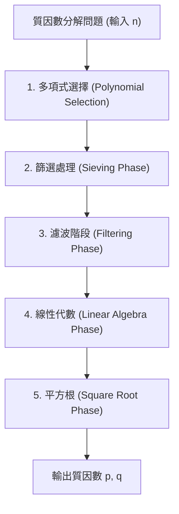
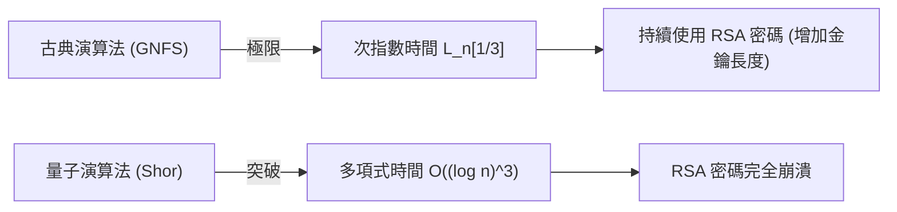

## 1. 簡介：質因數分解與現代密碼學的基礎

現代社會中網際網路通訊的安全性，很大程度上仰賴於公開金鑰密碼系統（即 RSA 密碼）的安全性。而 RSA 密碼的安全性則是基於「巨大合成數質因數分解的困難度」這項數學假設。如果發現了極高效率的質因數分解演算法，全球的通訊基礎設施將會從根本上崩潰。

目前，在使用古典電腦進行巨大整數質因數分解的領域中，最快速且最強大的演算法為**一般數體篩法（GNFS: General Number Field Sieve）**。GNFS 是擴充了 1980 年代後半所提出的特殊數體篩法（SNFS）而誕生的，時至今日，它已經創下了 RSA-768 和 RSA-250 等巨大合成數質因數分解的紀錄。

然而，密碼學家與數學家們始終抱持著以下疑問：「超越 GNFS 的古典演算法存在嗎？」「古典電腦的極限在哪裡？」以及「量子電腦將如何打破這個局面？」

本文將徹底解剖 GNFS 背後深奧的數學結構，並針對多項式選擇、篩選處理、基於區塊魏德曼（Block Wiedemann）法的線性代數步驟等進行詳細的技術分析。此外，我們將探討藉由 Coppersmith 改良等對 GNFS 的擴充方法，並從數學的觀點比較與解說古典的次指數時間（Sub-exponential time）演算法與量子多項式時間演算法的決定性差異。

---

## 2. 漸近複雜度與 L 符號（L-notation）

在評估質因數分解演算法的計算複雜度時，通常不使用標準的多項式時間表示法（如 $O(n^k)$ 等），而是使用**L 符號（L-notation）**來表達相對於輸入 $n$ 之位數的次指數時間。L 符號定義如下：

$$
L_n[\alpha, c] = \exp \left( (c + o(1)) (\ln n)^\alpha (\ln \ln n)^{1-\alpha} \right)
$$

這裡，$n$ 是質因數分解的目標整數，$\ln n$ 是自然對數，且與 $n$ 的位元長度成正比。
- 當 $\alpha = 0$ 時：$L_n[0, c] = \exp(c \ln \ln n) = (\ln n)^c$，這表示相對於位元長度的**多項式時間（Polynomial time）**。
- 當 $\alpha = 1$ 時：$L_n[1, c] = \exp(c \ln n) = n^c$，這表示相對於位元長度的**指數時間（Exponential time）**。
- 當 $0 < \alpha < 1$ 時：這介於多項式時間與指數時間之間，稱為**次指數時間（Sub-exponential time）**。

過去質因數分解演算法的演進，其實就是逐漸縮小這個 $\alpha$ 值的歷史。
- **連分數法（CFRAC）或多重多項式二次篩法（MPQS）**：屬於 $\alpha = 1/2$ 的類別，複雜度大約為 $L_n[1/2, 1]$。
- **一般數體篩法（GNFS）**：達到了 $\alpha = 1/3$，這在目前已知的古典演算法中擁有最快的 $L_n[1/3, (64/9)^{1/3}]$ 複雜度。

---

## 3. GNFS（一般數體篩法）的演算法全貌與數學結構

GNFS 擁有非常複雜且高度的數學基礎。其基本概念是費馬小定理和二次篩法（QS）的延伸，透過找到滿足同餘式 $X^2 \equiv Y^2 \pmod n$ 且 $X \not\equiv \pm Y \pmod n$ 的非平凡解 $(X, Y)$，進而導出 $n$ 的因數 $\gcd(X-Y, n)$。

然而，GNFS 的精髓在於，它並非僅在有理數體 $\mathbb{Q}$ 上進行，而是同時在稱為代數數體（Algebraic Number Field）的擴充體 $\mathbb{Q}(\alpha)$ 及有理數體兩端探索「平滑數（Smooth numbers）」，並透過同態映射來建構同餘關係。

GNFS 的過程大致可以分為 5 個階段。

### 3.1 階段 1：多項式選擇 (Polynomial Selection)

GNFS 的成功很大程度上取決於選擇適當的多項式。目標是找到擁有共同根 $m$ 的兩個不可約多項式 $f_1(x)$（有理數側）與 $f_2(x)$（代數數側）。也就是說，
必須滿足 $f_1(m) \equiv f_2(m) \equiv 0 \pmod n$。

通常，有理數側的多項式選擇一次式 $f_1(x) = x - m$，而代數數側的多項式 $f_2(x)$ 則選擇次數為 $d$（典型為 5 或 6）的首一多項式。最經典的方法是 **Base-$m$ 方法**。
選擇接近 $n$ 的 $1/(d+1)$ 次方的整數 $m = \lfloor n^{1/(d+1)} \rfloor$，並將 $n$ 展開為 $m$ 進位。
$n = c_d m^d + c_{d-1} m^{d-1} + \dots + c_1 m + c_0$
藉此，可以獲得多項式 $f_2(x) = c_d x^d + c_{d-1} x^{d-1} + \dots + c_0$。很明顯地，$f_2(m) = n \equiv 0 \pmod n$。

然而，現代的實作中會使用 **Kleinjung 的演算法**。此方法在確保多項式係數不會變得極端巨大的同時（偏態/Skewness 的最佳化），還會最佳化代數性質（Murphy 的 $E$ 值或 $\alpha$ 值），以尋找容易在篩選處理中產生平滑數的多項式。僅僅是這個步驟就會投入龐大的運算資源。

### 3.2 階段 2：篩選處理 (Sieving Phase)

當多項式決定後，就會進入演算法中運算負載最重的「篩選（Sieving）」階段。在這裡，我們要探索一對互質的數組 $(a, b)$，這對數組必須滿足以下兩個值同時為「平滑（Smooth）」：

1. **有理數側的範數**: $F_1(a, b) = b \cdot f_1(a/b) = a - bm$
2. **代數數側的範數**: $F_2(a, b) = b^d \cdot f_2(a/b)$

「平滑」意味著該數字僅能被小於或等於指定上限（Sieve bound）的質數進行因數分解。準備好有理數側的質數基底（Factor base）與代數數側的質數基底，並在龐大的探索空間上，利用類似埃拉托斯特尼篩法的方式，高效率地找出平滑數。
目前主流是稱為**晶格篩法（Lattice Sieving）**的技術，藉由固定特定的質數 $q$，僅對有理數側與代數數側皆為 $q$ 的倍數的部分晶格上的 $(a, b)$ 數組進行篩選，從而實現了極高的效率。

### 3.3 階段 3：濾波階段 (Filtering Phase)

在篩選處理中找到的平滑關係式（Relations）數量高達數億、甚至數十億。然而，這些也包含了許多無用的資訊。
濾波的目的，是在建構龐大的稀疏矩陣（Sparse Matrix）時，盡可能縮小其維度。

具體來說，會進行以下操作：
- **Singleton removal**: 刪除包含只出現 1 次質因數的關係式。
- **Clique removal / Merging**: 將擁有出現 2 次以上質因數的關係式互相相乘，以消去變數，從而縮減成密度較高、但維度較小的方程式系統。

透過這個過程，數十億行的矩陣將會被壓縮成擁有數千萬行規模的巨大稀疏矩陣 $\mathbf{A}$（元素為體 $\mathbb{F}_2$ 上的 0 與 1）。

### 3.4 階段 4：線性代數 (Linear Algebra Phase)

在這個階段中，要找到方程式 $\mathbf{A} \mathbf{x} \equiv \mathbf{0} \pmod 2$ 的非平凡解向量 $\mathbf{x}$。換句話說，這是一個求取巨大稀疏矩陣之左零空間（Left Nullspace）的問題。

由於矩陣尺寸極端巨大，使用一般的高斯消去法（$O(N^3)$）根本無法計算。因此，會採用克雷洛夫子空間（Krylov subspace）方法的一種迭代法。歷史上曾使用過**區塊蘭佐斯法（Block Lanczos）**，但在當前的分散式運算環境中，能大幅減少通訊額外開銷的**區塊魏德曼法（Block Wiedemann Algorithm）**才是主流。

區塊魏德曼法會從矩陣 $\mathbf{A}$ 和向量序列中計算最小多項式，並利用貝利坎普-馬西（Berlekamp-Massey）演算法來建構零空間的基底。這個步驟非常難以平行化，且需要超級電腦或大規模叢集的緊密耦合通訊網路，是 GNFS 最大的瓶頸之一。

### 3.5 階段 5：平方根 (Square Root Phase)

從線性代數的解中，將在有理數側與代數數側各自建構出成為「完全平方」的乘積。
在有理數側，$\prod (a-bm)$ 會成為某個整數 $X$ 的平方 $X^2$；而在代數數側，對應的理想的乘積會在代數數體上成為完全平方 $\gamma^2$。
藉由在代數數體上計算出這個 $\gamma$，並套用映射到有理整數環的同態映射 $\phi: \alpha \mapsto m \pmod n$，便可得到同餘式：
$X^2 \equiv \phi(\gamma)^2 \equiv Y^2 \pmod n$

計算代數數體上的平方根需要使用如 **Montgomery 方法（Montgomery's Method）**等複雜演算法，且需要深厚的代數數論知識。最後只要計算出 $\gcd(X-Y, n)$，若獲得非平凡的因數，便完成了質因數分解。

---

## 4. 超越 GNFS 的古典演算法存在嗎？

截至目前為止，在一般整數的質因數分解中，尚未發現漸近複雜度低於 $L_n[1/3, c]$ 的古典演算法。然而，為了突破理論上與實務上的極限，存在著一些嘗試與衍生的演算法。

### 4.1 多重數體篩法 (MNFS: Multiple Number Field Sieve)

作為 GNFS 的擴充方法，有 D. Coppersmith 所提出的**多重數體篩法（MNFS）**。GNFS 使用了 2 個多項式（有理數側與代數數側），而 MNFS 則是對 1 個有理數側多項式，同時使用多個不同的代數數側多項式。

$$ f_1(x), f_{2,1}(x), f_{2,2}(x), \dots, f_{2,V}(x) $$

透過利用多個代數數體，可以在每個篩選步驟中，飛躍性地提高「在其中一個代數數體中變得平滑」的機率。Coppersmith 成功地藉由這種方法讓複雜度 $L_n[1/3, c]$ 中的常數 $c$ 些微減少。
具體來說，GNFS 的常數為 $c = (64/9)^{1/3} \approx 1.923$，而理論上已經證明透過最佳化 MNFS，可以將計算複雜度降低到 $c \approx 1.902$ 左右。
但在實務上，管理多個數體會帶來巨大的額外開銷，因此並未在實用規模的 RSA 模數分解上達到決定性的突破。

### 4.2 $L_n[1/4]$ 類別的演算法有可能嗎？

關於質因數分解古典演算法的極限，數學家們長年討論的一個主題就是「指數 $\alpha = 1/4$ 的演算法存在嗎？」這個問題。
目前的 GNFS 及其衍伸演算法，受到透過篩法進行「尋找平滑數」這種框架的強烈限制，而在這種典範中，人們普遍相信 $\alpha = 1/3$ 就是極限。從使用迪克曼函數（Dickman function）來分析平滑整數的分佈機率也可以看出，目前的代數數體建構法與篩法的結合，無論如何最佳化，都被認為無法跨越 $O(L_n[1/3])$ 的障礙。

如果存在 $L_n[1/4]$ 或是古典的多項式時間演算法，那它必定依賴於一種與 GNFS 這類「基於平滑數」的方法完全不同、目前人類意想不到的全新數學結構（例如，針對橢圓曲線密碼學的 Schoof 演算法這種更為進階的代數幾何學方法）。然而，目前尚未看到這樣的跡象。

---

## 5. 量子運算的突破：Shor 演算法

在古典電腦面臨 $L_n[1/3]$ 障礙的同時，Peter Shor 於 1994 年發表的 **Shor 演算法（Shor's Algorithm）** 透過從根本上改變運算模型，粉碎了這個障礙。

### 5.1 量子多項式時間的衝擊

Shor 演算法將質因數分解問題化約為「求階問題（Order Finding Problem）」。對於某個整數 $a$，這是一個找出函數 $f(x) = a^x \pmod n$ 之週期（階數）$r$ 的問題。
古典電腦在尋找這個週期時需要耗費指數時間，但透過在量子電腦上使用**量子相位估計（QPE: Quantum Phase Estimation）**與**量子傅立葉轉換（QFT: Quantum Fourier Transform）**，可以對所有狀態的疊加態（Superposition）進行平行的評估，並以極高的機率萃取出週期 $r$。

從計算複雜度的角度來看，Shor 演算法的執行時間屬於**量子多項式時間**，具體如下所示：
$$ O((\log n)^3) $$
若考慮到近年來經過最佳化的電路實作，被認為可進一步縮減至 $O((\log n)^2 \log \log n)$。

### 5.2 古典次指數時間 vs 量子多項式時間

這兩個複雜度類別的差異，在現實世界的密碼安全上具有決定性的意義。

舉例來說，考慮將 RSA-2048（2048 位元的合成數）進行因數分解的情況。
- **GNFS (古典)**: 將 $n \approx 2^{2048}$ 代入 $L_n[1/3, 1.923]$ 中，大約需要進行 $2^{112}$ 次運算。這是即使集結目前地球上所有運算資源，也需要超過宇宙壽命才能完成的天文數字般的運算量。
- **Shor's Algorithm (量子)**: 在 $O((\log n)^3)$ 的演算法中，大約只需要進行 $2048^3 \approx 8.5 \times 10^9$ 次的邏輯閘操作。這意味著只要有適當的硬體（具備數百萬物理量子位元與錯誤更正能力的通用量子電腦）存在，計算便能在短短數小時到數天內完成。

從「指數 $\alpha=1/3$」的次指數時間到「多項式時間」的典範轉移，將使藉由增加金鑰長度來確保安全性的傳統密碼學策略變得毫無招架之力。

---

## 6. 總結：對次世代的展望

對於「超越 GNFS 的古典演算法存在嗎？」這個問題，目前科學界的共識如下：

1. **實務上的改良仍會持續，但不會有漸進複雜度上的飛躍**: 像是 MNFS、多項式選擇的最佳化、區塊魏德曼法的平行化等，改善 GNFS 常數項 $c$ 的嘗試仍持續進行中。然而，一般認為發現低於 $\alpha = 1/3$ 古典演算法的可能性極低。
2. **在古典電腦上的 RSA 安全性依然堅固**: GNFS 的運算量依然非常龐大，RSA-2048 或 RSA-4096 應對古典電腦攻擊的安全性，在未來的數十年間仍會保持穩固。
3. **真正的威脅是量子演算法**: 跨越計算複雜度障礙的是基於量子力學原理的 Shor 演算法。這也迫使世界必須向後量子密碼學（PQC: Post-Quantum Cryptography）過渡。轉向即使是量子電腦也難以破解（無法在多項式時間內解開）的全新數學問題，例如晶格密碼學或基於雜湊的密碼學等，已成為當前密碼學的最前線。

一般數體篩法（GNFS）是人類挑戰古典數學與演算法設計極限所達到的「最高成就」之一。了解 GNFS 深奧的數學結構，不僅僅是學習密碼破解的歷史，更是一趟接觸計算複雜度理論與代數數論之美的知識探索之旅。在量子電腦真正普及的那一天到來之前，GNFS 將會持續穩坐最強質因數分解演算法的寶座。
