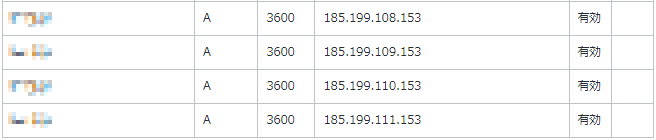

Para configurar um domínio personalizado em um repositório Github, você precisa alterar as configurações de DNS do seu domínio.
Aqui, explicaremos assumindo que você gerencia seu domínio com <a href="https://px.a8.net/svt/ejp?a8mat=3TJBXA+BKRHS2+50+2HHVNM" rel="nofollow">Onamae.com</a>.

Você pode fazer configurações semelhantes reescrevendo os registros A com outros registradores.

## Alterar as configurações de DNS no Onamae.com
Para alterar as configurações de DNS do seu domínio, faça login na tela de gerenciamento do <a href="https://px.a8.net/svt/ejp?a8mat=3TJBXA+BKRHS2+50+2HHVNM" rel="nofollow">Onamae.com</a>.

Após o login, vá para a tela de gerenciamento de domínio.
Quando estiver na tela de gerenciamento de domínio, altere as configurações de DNS.
Para alterar as configurações de DNS, configure da seguinte forma:
1. Acesse https://www.onamae.com/ e clique em "Login Onamae.com Navi"
2. Insira sua "ID Onamae (ID de membro)" e "Senha" e clique no botão de login
3. Clique em "Configurações do servidor de nomes"
4. Clique em "Configurações de DNS do domínio"
5. Selecione o domínio que deseja configurar e clique em "Avançar"
6. Clique em "Configurar" à direita de "Usar configuração de registro DNS"
7. Selecione A para TYPE, insira 3600 para TTL e "185.199.108.153" para VALUE e clique em "Adicionar"
8. Semelhante a 7., adicione também para "185.199.109.153", "185.199.110.153" e "185.199.111.153"
9. Certifique-se de que a caixa de seleção está marcada em "Confirmação de alteração do servidor de nomes para configuração de registro DNS" e clique em "Ir para a tela de configuração"
10. Se for exibida uma tela dizendo "Para evitar alterações não intencionais nas configurações de DNS", clique em "Não configurar" (selecione conforme necessário)
11. Verifique os detalhes da configuração e clique em "Configurar"

12. Isso conclui as configurações de DNS. Pode levar até cerca de 72 horas para que a reflexão seja concluída.
13. Se não for refletido após 72 horas, tente entrar em contato com o suporte do Onamae.com.

Para verificar se as configurações estão refletidas no seu ambiente local, tente executar o seguinte comando.
Substitua a parte `example.com` pelo domínio que você deseja verificar.

### Para Linux, Mac
```bash
dig example.com +noall +answer -t A
```
Se o resultado for o seguinte, a configuração foi refletida.
```bash
example.com.              0       IN      A       185.199.108.153
example.com.              0       IN      A       185.199.109.153
example.com.              0       IN      A       185.199.110.153
example.com.              0       IN      A       185.199.111.153
```

### Para Windows
```bash
nslookup -q=a example.com 8.8.8.8
```
Se o resultado for o seguinte, a configuração foi refletida.
```bash
Servidor:  dns.google
Address:  8.8.8.8

Resposta não autoritativa:
Nome:    example.com
Addresses:  185.199.108.153
          185.199.109.153
          185.199.110.153
          185.199.111.153
```

## Configurar um domínio personalizado em um repositório Github
1. Abra a página do repositório e clique em Settings
2. Clique em Pages
3. Se você estiver publicando o código-fonte do repositório como está, selecione "Deploy from a branch" em Source. Se você estiver compilando o código-fonte, como HUGO, selecione "GitHub Actions".
4. Selecione a branch a publicar em Branch e clique em Save
5. Insira o domínio que você obteve em Custom domain e clique em Save.
6. Se necessário, marque a caixa "Enforce HTTPS" para ativar o suporte HTTPS


[PR]
<a href="https://px.a8.net/svt/ejp?a8mat=3TJBXA+BKRHS2+50+2HQGAP" rel="nofollow">
</a>

