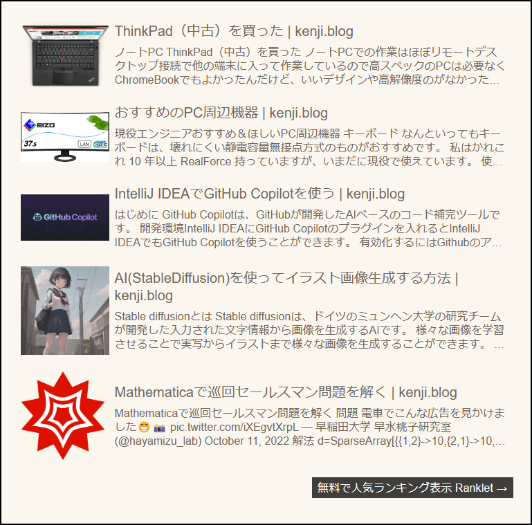
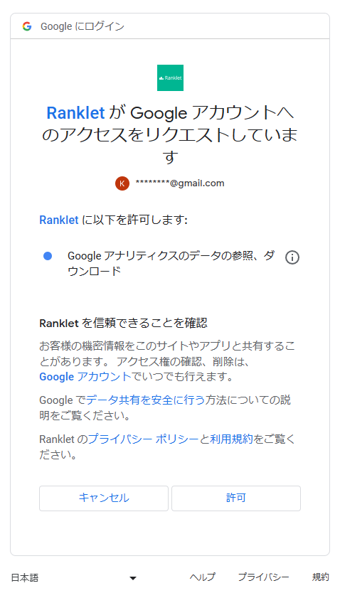
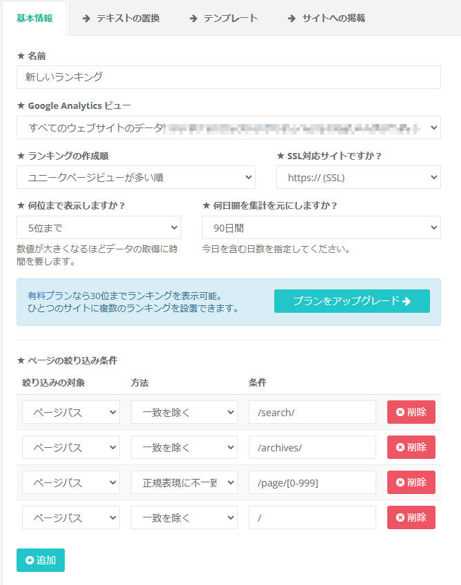
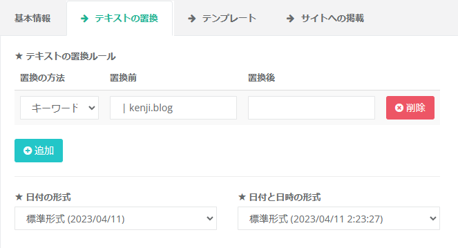
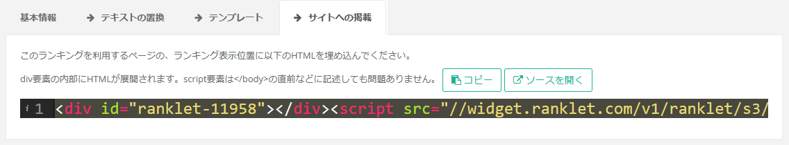

## Introduction

En utilisant un service appelé `Ranklet`, vous pouvez facilement récupérer le classement des pages populaires depuis Google Analytics et l'intégrer sur votre site.

Dans cet article, nous allons vous présenter comment l'intégrer sur un blog HUGO.

## Aperçu du fonctionnement



## Préparation
- Avoir configuré Google Analytics sur votre site

## Étapes

1. Accédez à `Ranklet`
2. Cliquez sur `Sign in with Google` pour vous connecter avec votre compte Google (celui-ci doit être associé à votre compte Google Analytics)


Cliquez sur `Autoriser` (`許可`)

3. Configurez les informations de base


La configuration a été effectuée comme indiqué ci-dessus.

- Dans `Vue Google Analytics` (`Google Analytics ビュー`), sélectionnez la vue dont vous souhaitez obtenir le classement.

4. Configurez le remplacement de texte


La configuration a été effectuée comme indiqué ci-dessus.
Ce paramètre est défini pour supprimer ` | kenji.blog` du titre de la page.

5. Configurez le modèle

- HTML (les numéros de classement ont été masqués)

```html
<div class="ranklet ranklet-reset">
    <table class="ranklet-table">
        <tbody class="ranklet-pages">
            {{#context.pages}}
            <tr class="ranklet-page">
                <td class="ranklet-image">
                    {{#image}}
                    <a href="{{url}}" class="ranklet-link">
                        
                    </a>
                    {{/image}}
                </td>
                <td class="ranklet-meta">
                    <div class="ranklet-title">
                        <a href="{{url}}" class="ranklet-link">
                            {{title}}
                        </a>
                    </div>
                    {{#description}}
                    <div class="ranklet-description">
                        <a href="{{url}}" class="ranklet-link">
                            {{description}}
                        </a>
                    </div>
                    {{/description}}
                </td>
            </tr>
            {{/context.pages}}
        </tbody>
    </table>
</div>
```

- CSS (la taille de police a été modifiée et la description s'affiche sur 3 lignes)

```css
#ranklet-{{context.id}} {
    .ranklet-reset { // Réinitialisation
        table, tr, td, div, span {
            margin: 0;
            padding: 0;
            border: 0;
            font-size: 100%;
            font: inherit;
            vertical-align: baseline;
            line-height: 1;
            box-sizing: border-box;
        }
    }

    .ranklet-table {
        border-collapse: separate;
        border-spacing: 8px 24px;
        width: 100%;
        word-break: break-all;

        td {
            vertical-align: middle;
        }

        .ranklet-rank {
            text-align: center;
            font-size: 120%;
        }

        .ranklet-image {
            text-align: center;
            img {
                max-width: 128px;
                max-height: 128px;
            }
        }

        .ranklet-meta {
            .ranklet-title {
                font-size: 20px;
                line-height: 125%;
            }

            .ranklet-description {
                font-size: 16px;
                margin-top: 8px;
                line-height: 125%;
                display: -webkit-box;
                overflow: hidden;
                -webkit-box-orient: vertical;
                -webkit-line-clamp: 3; /* Nombre de lignes */
            }
        }
    }
}
```

- Aucun changement pour JavaScript

6. Copiez le code HTML depuis « Publier sur le site »



Copiez le code HTML affiché

7. Collez-le dans le modèle HUGO

- Créez `layouts/partials/ranklet.html` et collez-y le code HTML copié
```html
<div id="ranklet-11958"></div><script src="//widget.ranklet.com/v1/ranklet/s3/widgets/11958/widget.js"></script>
```

- Collez le code suivant sur la ligne précédant `</footer>` dans `layouts/_default/single.html`
```html
{{- partial "ranklet.html" . }}
```

C'est tout. Le classement s'affichera désormais comme au bas de cette page.
