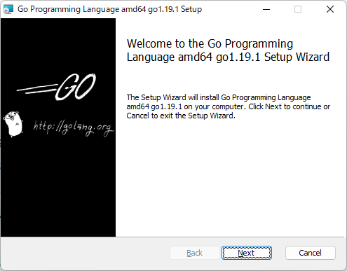
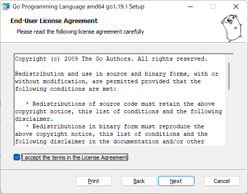
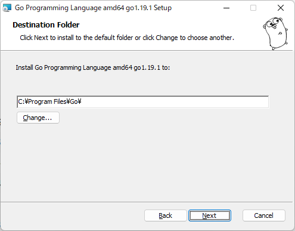
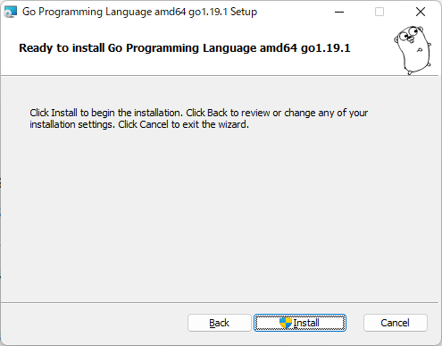
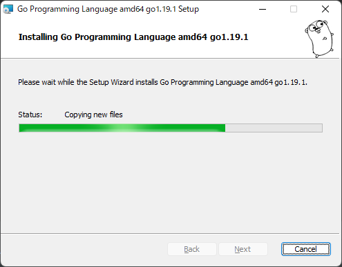
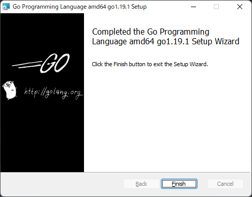
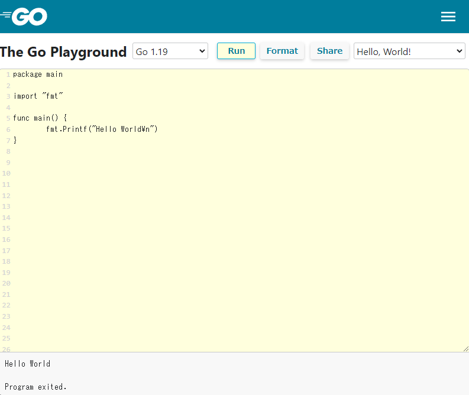

# Introduction
Go is a relatively new programming language released by Google in 2009.
The Go compiler, tools, and libraries are released as open source.
Also, Go is a statically typed language like C and Java, but it does not use pointers in the same way C does.

# How to Install

[Install Go](https://go.dev/dl/)

Installers for each platform are available from the site above.

Follow the instructions on the screen to proceed with the installation.












Installation is complete. It's easy, isn't it?

# First Program

Save the following program as `hello.go`.

```go
package main

import "fmt"

func main() {
  fmt.Printf("Hello World\n")
}
```

If you execute `go run hello.go` from the command prompt or terminal, `Hello, world!` will be output.

If you want to compile, executing `go build hello.go` will generate `hello.exe`.
Executing `hello.exe` will output `Hello, world!`.

# You can also execute code on a web page

[https://go.dev/play/](https://go.dev/play/)



# Japanese Documentation

[http://go.shibu.jp/](http://go.shibu.jp/)

The explanations necessary for learning Go are consolidated in the link above (Japanese translated version).
Since technologies related to Go are open, the resources are rich enough that you don't even need to buy a physical textbook.

Enjoy your Go life!
