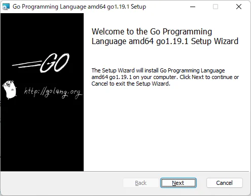
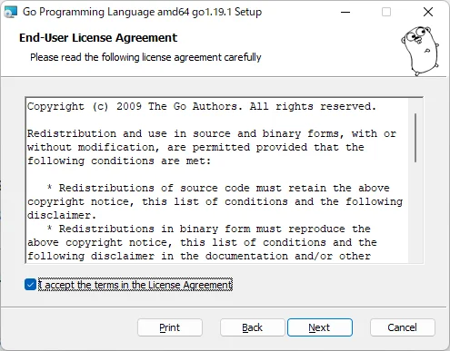
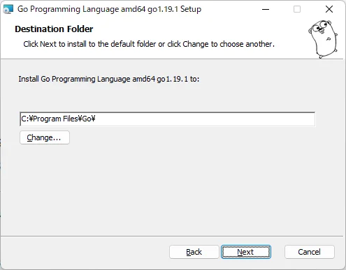
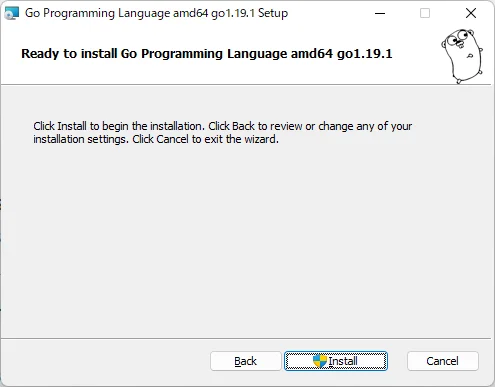
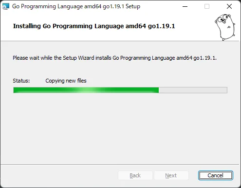
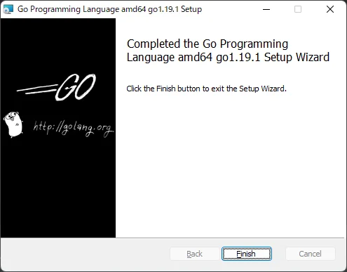
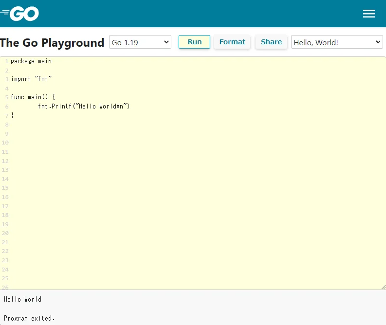

# Introdução
Go é uma linguagem de programação relativamente nova lançada pelo Google em 2009.
O compilador, ferramentas e bibliotecas do Go são de código aberto.
Além disso, Go é uma linguagem estaticamente tipada como C e Java, mas não usa ponteiros da mesma forma que a linguagem C.

# Método de instalação

[Instalar o Go](https://go.dev/dl/)

Instaladores para cada plataforma estão publicados no site acima.

Siga as telas para prosseguir com a instalação.












Instalação concluída. É simples, não é?

# Primeiro programa

Salve o seguinte programa como `hello.go`.

```go
package main

import "fmt"

func main() {
  fmt.Printf("Hello World\n")
}
```

Ao executar `go run hello.go` no prompt de comando ou terminal, será exibido `Hello, world!`.

Ao compilar, executar `go build hello.go` irá gerar `hello.exe`.
Executar `hello.exe` exibirá `Hello, world!`.

# Você também pode executar código na página da Web

[https://go.dev/play/](https://go.dev/play/)



# Documentação Japonesa

[http://go.shibu.jp/](http://go.shibu.jp/)

As explicações necessárias para aprender Go estão reunidas no link acima (versão traduzida em japonês).
A tecnologia relacionada ao Go é tão aberta e rica que quase não há necessidade de comprar textos em papel.

Então, aproveite sua vida com Go!
