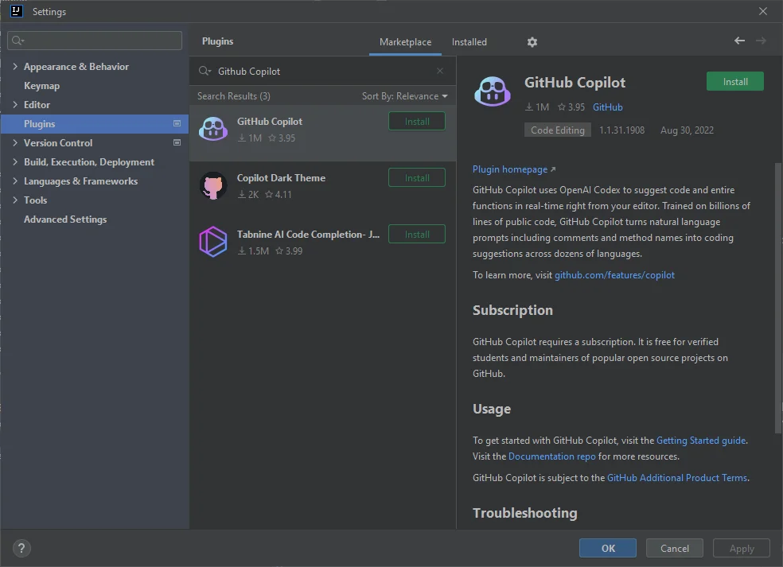
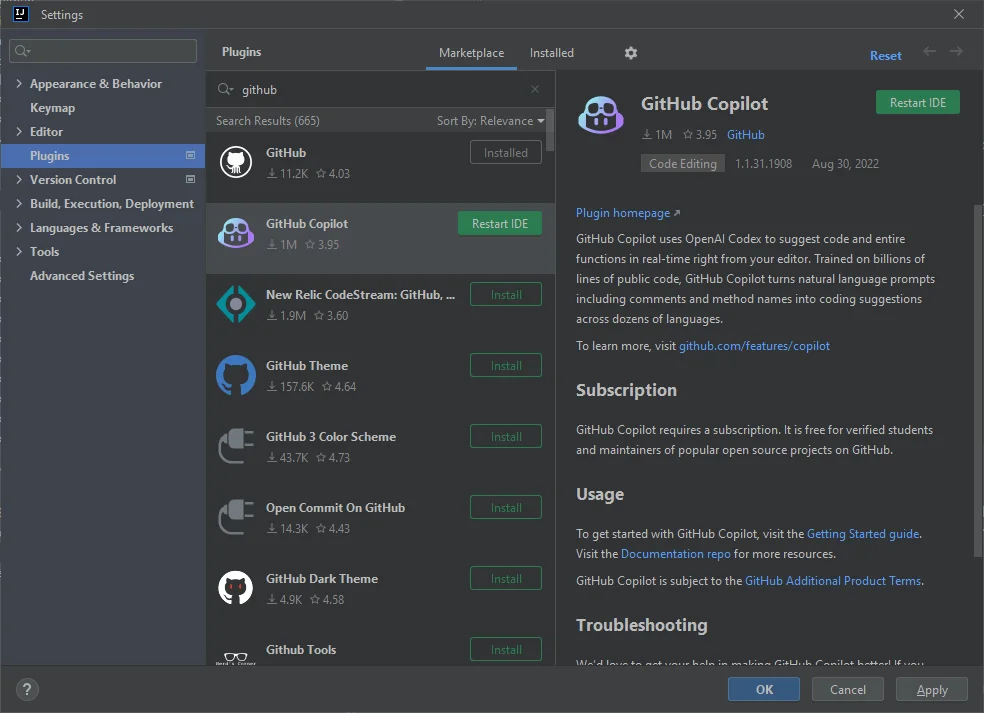
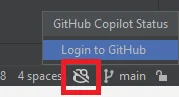
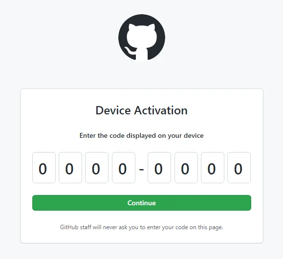
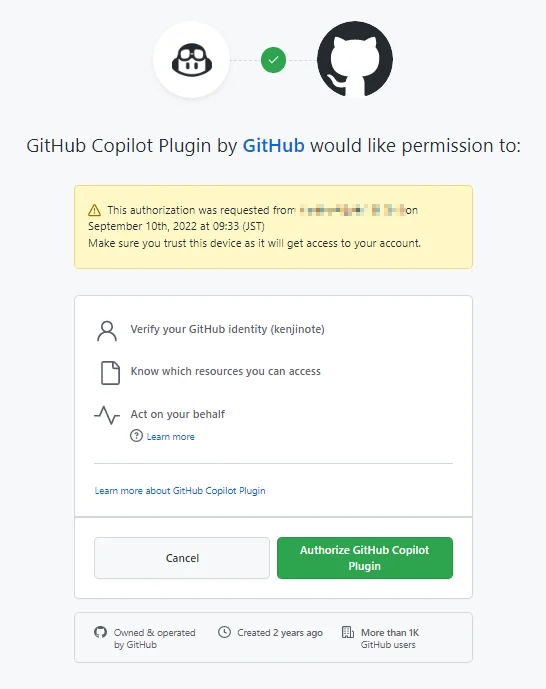
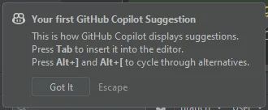

# Introduction
GitHub Copilot is an AI-based code completion tool developed by GitHub.
By installing the GitHub Copilot plugin in the IntelliJ IDEA development environment, you can also use GitHub Copilot in IntelliJ IDEA.
A Github account is required for activation.

# How to Install
1. Select Settings from the File menu in IntelliJ IDEA
2. Select Plugins, and search for "GitHub Copilot"

3. Install via the Install button

4. Click the Restart IDE button to restart IntelliJ IDEA

The installation is complete once IntelliJ IDEA restarts.

# Activation
1. Click the icon at the bottom right
2. Click Login to Github

3. Click the Copy and Open button

4. A browser will open. If you are not logged into Github, log in, paste the code using Ctrl+V, and click the Continue button

5. Click the Authorize GitHub Copilot Plugin button

Activation is complete when the screen above is displayed.

# Try it out

When you type a few characters in the IntelliJ IDEA editor, GitHub Copilot will start suggesting code completions.
Enjoy the powerful code completion features provided by AI!
