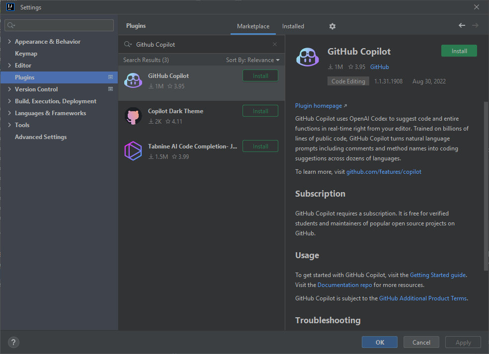
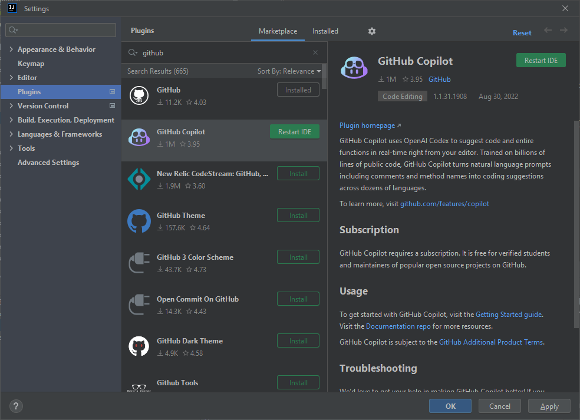
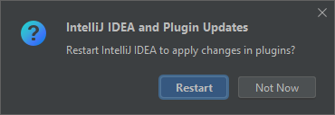
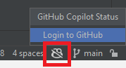
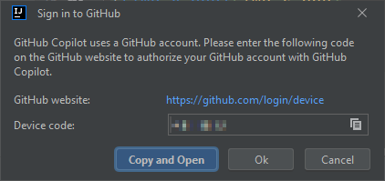
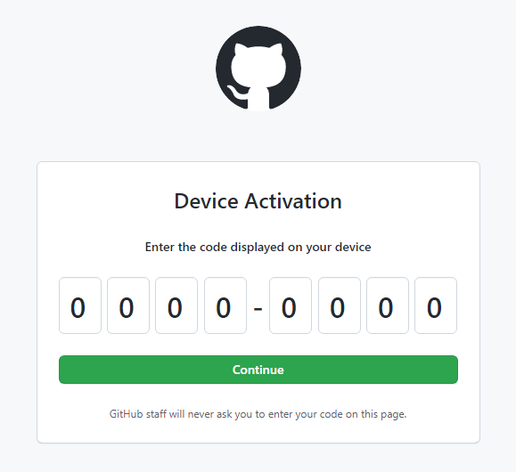
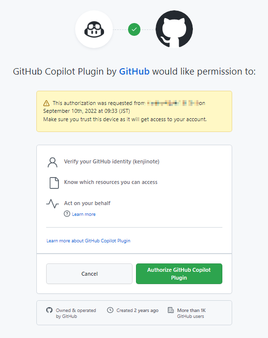
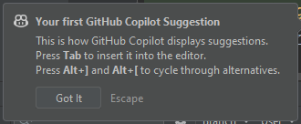

---

title: "IntelliJ IDEA에서 GitHub Copilot 사용하기"
date: 2022-09-10T09:44:55+09:00
tags: ["IntelliJ IDEA","GitHub Copilot"]
draft: false
image: "images/img.png"
categories: ["도구 및 개발 환경"]
---

# 소개
GitHub Copilot은 GitHub가 개발한 AI 기반 코드 자동 완성 도구입니다.
개발 환경인 IntelliJ IDEA에 GitHub Copilot 플러그인을 설치하면 IntelliJ IDEA에서도 GitHub Copilot을 사용할 수 있습니다.
활성화하려면 GitHub 계정이 필요합니다.

# 설치 방법
1. IntelliJ IDEA의 메뉴에서 File을 클릭하고 Settings를 선택합니다.
2. Plugins를 선택하고 검색창에서 'GitHub Copilot'을 검색합니다.

3. Install 버튼을 눌러 설치합니다.

4. Restart IDE 버튼을 눌러 IntelliJ IDEA를 재시작합니다.

IntelliJ IDEA를 재시작하면 설치가 완료됩니다.

# 활성화
1. 우측 하단의 아이콘을 클릭합니다.
2. Login to Github을 클릭합니다.

3. Copy and Open 버튼을 클릭합니다.

4. 브라우저가 열립니다. GitHub에 로그인되어 있지 않다면 로그인한 후, Ctrl+V로 코드를 붙여넣고 Continue 버튼을 클릭합니다.

5. Authorize GitHub Copilot Plugin 버튼을 클릭합니다.

위 화면이 표시되면 활성화가 완료된 것입니다.

# 사용해보기

IntelliJ IDEA의 에디터에서 문자 몇 개를 입력하면 GitHub Copilot이 코드의 다음 부분을 제안해 줍니다.
그럼 AI의 강력한 자동 완성 기능을 즐겨보세요!
