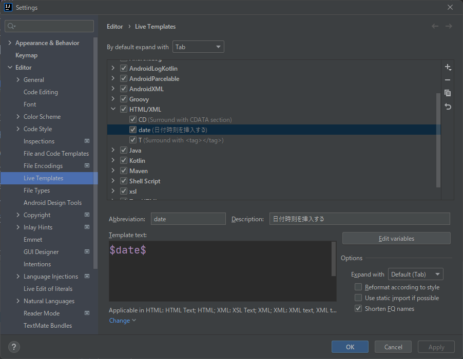
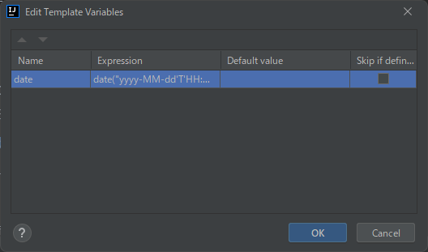

# Pendahuluan
Saat menulis blog ini, saya menggunakan IntelliJ IDEA. Sangat nyaman karena memiliki kompatibilitas yang baik dengan Git dan dapat menampilkan pratinjau Markdown.
Setiap kali menulis blog, saya harus menuliskan tanggal di header file md, namun sepertinya tidak ada pintasan (shortcut) bawaan untuk menyisipkan tanggal, jadi saya membuat perintah untuk menyisipkan tanggal berdasarkan referensi dari situs berikut. Semoga bermanfaat.

[Is there a shortcut for inserting date/time in IntelliJ IDEA?](https://stackoverflow.com/questions/8714779/is-there-a-shortcut-for-inserting-date-time-in-intellij-idea)

# Langkah-langkah Pengaturan
1. Buka menu "File" > "Settings..."  
   
2. Pilih "Editor" > "Live Template" > "HTML/XML", lalu klik tombol "+"
3. Pilih Live Template
4. Masukkan "date" pada Abbreviation
5. Masukkan "Menyisipkan tanggal dan waktu" pada Description
6. Masukkan "$date$" pada Template Text
7. Klik tombol Edit Variables  
   
8. Masukkan "date" pada Name
9. Masukkan ``date("yyyy-MM-dd'T'HH:mm:ss'+09:00'")`` pada Expression
10. Tutup dialog dengan menekan OK
11. Klik Define atau Change, lalu centang "Everywhere"
12. Tutup dialog dengan menekan OK
13. Di editor kode, ketik "date" dan tekan Enter. Jika tanggal "2022-09-04T05:59:04+09:00" disisipkan, pengaturan selesai!

Demikian.

# Penutup
Saya akan membagikannya lagi jika saya menemukan trik-trik kecil lain untuk IntelliJ IDEA!
