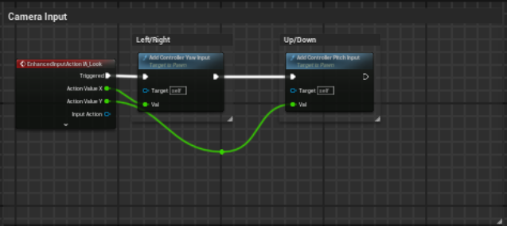

# Tools for those who "have logic but can't write code." Why I created LogicPad

Hello, I'm kenji. I'm the creator of the low-code tool "[LogicPad](https://logicpad.org)".
This time, rather than introducing the product, I'd like to write about the behind-the-scenes of the development—"Why did I decide to make this?"—and my own thoughts from a slightly personal perspective.

To be honest, this was not just another tool development.
My past, frustrations at the workplace, skill set, and the smoldering desire to "create my own product someday"—
LogicPad was born as a result of all these things overlapping.

In other words, **this is my "life's culmination project."**
I'll write about this background as honestly and passionately as possible.

---

## I wanted a product I could proudly say, "I made this."

To be frank, this was my very first motivation.

Since a long time ago, I loved writing code for both work and hobbies. I've been involved in various developments.
But one day, I suddenly realized.
**"I have no product released into the world under my own name, with my own responsibility."**

Of course, there is value in what you make as a team, and there was plenty of work I could be proud of.
But somewhere in my mind, there was a sense of emptiness, wondering, "Am I going to finish my career under someone else's name like this?"

Just once is enough.
**I want to leave something behind that I can proudly say, "I made this."**
With that thought, I started conceptualizing LogicPad. This was about 6 years ago (around 2019).
(The original idea itself came about 10 years ago in 2015 when I learned about Blueprint, the visual programming language of Unreal Engine.)

---

## It's a waste to hold back just because you can't write code, isn't it?

There were many excellent people at my workplace.

They could build logic. They mastered Excel functions freely and could see through to the essence of a problem.
But—when it came to the stage of "writing code," their hands would stop.

"I'm doing this task while looking at a manual every time, but couldn't it be automated?"
"Yeah, it can. But... you'd have to write code for that..."

Conversations like that happened countless times.

Every time, I thought:
**"It's such a waste that people who understand the logic get stopped by the wall of code."**

---

## The Choice of a Low-Code Editor

Actually, in my previous job, I was developing a 2D CAD operated by GUI.
With CAD, you assemble shapes using a mouse, right?
In other words, it's a world where you **"build logic through operations."**

I thought, "This is incredibly compatible with low-code."

Going back even further, since my student days, I was mass-producing small programs—image processing, numerical processing, Windows tools, automatic SNS posting tools, etc.—by writing code as soon as I thought of them.
I think there are over 600 of them. They are still on GitHub today.

Back then, I didn't think about the meaning.
I just "made things because I wanted to make them." That was it.

But now, while making LogicPad...

**I felt like the dots were finally connected into a line.**

---

## Easy to Use, Yet Powerful. The Difficulty of Balance

While proceeding with development, what I constantly thought about was
**"Making a tool that is intuitively usable and genuinely powerful."**

If you add features, you can do more. But it becomes harder to use.
If you make it simple, anyone can touch it. But then some people will find it lacking.

So that people won't say, "Low-code tools are just toys, right?"
But also so they won't say, "You have to write code in the end anyway."

**I fought continuously on that fine line between intuition and expressiveness.**

I rebuilt the UI many times, threw it away many times,
and when I finally got closer to a form where I thought, "This can work," I was truly happy.

---

## Saved by the Very First "User's" Words

The first person I handed LogicPad to was a former colleague.
They weren't good at IT, and code was scary. But they were good at logic.

After I explained a bit and had them try it out... the single phrase they said a few minutes later, I still can't forget.

> **"With this, I think even I could do it!"**

I almost cried.
This was exactly what I wanted to give them.

Not just a working tool, but **the feeling of "I made it myself!"**.
I was convinced that this is the true value of LogicPad.

---

## When More People Can Create, Society Becomes More Interesting

I genuinely believe that the "democratization of technology" is crucial.

Technology has the power to change the world.
But the people who can handle it are limited.

What if you could build apps just by "understanding the logic"?

**More people will be able to join the "creating side."**
And I believe that what gets born from there will exceed our current imagination.

If LogicPad could become that gateway.
I want it to be a tool that turns "I want to try making it" into "I can make it."

That is my wish.

---

## In Conclusion

LogicPad is still in beta and not finished yet.
There are a mountain of improvements and things I want to do.

But I've poured **all the "dots" of my life into this tool.**
Now, I can say with pride:

**"This is a product that I made."**

---

### 👇 Bonus: What You Can Do with LogicPad

* Build processes with drag-and-drop
* Handle conditional branching and variables in the GUI
* Features diverse AI integration nodes
* Expandable for advanced users by inserting scripts
* High-precision mathematical functions and data processing (such as infinite-precision numerical calculations)
* Rich shortcut keys for advanced users
* Supports over 90 languages

---

### What I Want to Do Moving Forward

* Generate logic from natural language in collaboration with AI
* A system where users can create custom nodes
* Build a platform to share created nodes and logic

---

## ✍️ Afterword

Thank you so much for reading this far.
This wasn't just a tool development; it was a challenge into which I poured my own experiences, passion, and fragments of my life.

"I can't write code, but I have logic."
A future where such people become **able to "create" with their own power**.
I want to continue aiming for that through LogicPad.

If this made you feel even a little bit like "I want to try using it," that alone makes me very happy.
If you're interested, please definitely try out [LogicPad](https://logicpad.org).

And if you have any thoughts or things you noticed after using it, no matter how small, please let me know.
Your voice will be a great power in creating the next step for this product.

Thank you for your continued support.
