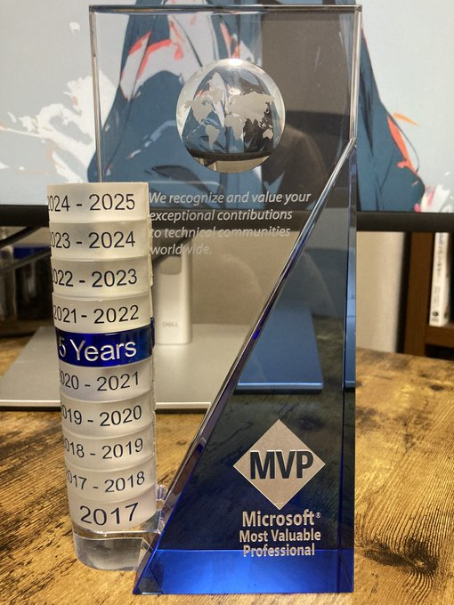

---

title: "He vuelto a recibir el premio Microsoft MVP (2024-2025)"
date: 2024-09-03T21:25:20+09:00
tags: ["Microsoft MVP"]
draft: false
image: "img.png"
categories: ["Herramientas y Entornos de Desarrollo"]
---

# He vuelto a recibir el premio Microsoft MVP (2024-2025)

Hola, soy kenji.
Les informo que este año también he sido galardonado con el premio **Microsoft MVP (Most Valuable Professional)**. Esta es la octava vez que recibo este premio.

Ya que estamos, me gustaría escribir un poco sobre qué es exactamente el premio MVP.

---

## ¿Qué es el Microsoft MVP?

Aunque se llame MVP, no estamos hablando del jugador más valioso en los deportes (aunque a veces me lo preguntan...).
**Microsoft MVP (Most Valuable Professional)** es un título que se otorga a aquellas personas que comparten y difunden activamente sus conocimientos y experiencias sobre las tecnologías de Microsoft con la comunidad.

Escribir en blogs técnicos, responder preguntas en sitios de Q&A,
publicar código de ejemplo, o dar charlas en eventos.
"Compartir lo que sabes de una manera que sea útil para alguien más" — ese tipo de esfuerzo constante es lo que se valora.

Hay premiados en todo el mundo, pero el número es limitado cada año, y volver a ganarlo no es fácil.
En este contexto, estoy realmente agradecido de haber sido reconocido nuevamente.

---

## Razones del premio

Esta vez he vuelto a ser premiado en la categoría de "Developer Technologies" (Tecnologías para Desarrolladores).
Durante el último año, he estado realizando las siguientes actividades:

* Escribir en el blog sobre tecnologías relacionadas con Microsoft
* Responder en sitios de Q&A técnicos
* Publicar código de ejemplo en GitHub
* Dar charlas en grupos de estudio y eventos técnicos, etc.

Ninguna de estas cosas es extraordinaria, pero
siempre he intentado compartir "cosas que probé y funcionaron" o "problemas con los que tropecé pero pude resolver"
de manera que puedan ser útiles aunque sea un poco.

Estoy sinceramente feliz de que esto se haya materializado de esta manera.

---

## Sobre el futuro

El mundo de la tecnología avanza muy rápido y solo mantenerse al día ya es difícil.
Pero precisamente por eso, creo que tiene sentido compartir "información de primera mano", como qué tal fue al usar algo realmente, o qué partes fueron difíciles de entender.

A partir de ahora, espero seguir haciéndolo a mi propio ritmo y sin presiones.
Me haría feliz si, de alguna forma, puedo proporcionar información que haga que alguien piense: "Ah, eso me ayudó".

Espero contar con su apoyo en el futuro.
