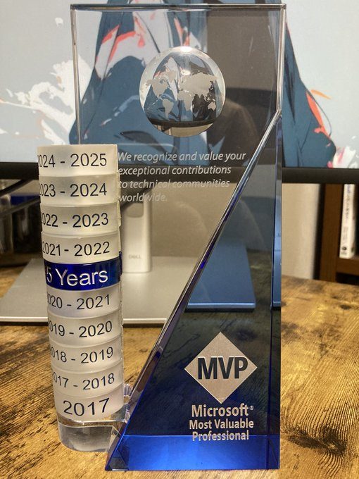

# Microsoft MVP（2024-2025）を再受賞しました

こんにちは、kenjiです。
ご報告になりますが、今年も **Microsoft MVP（Most Valuable Professional）** を受賞しました。今回で８回目の受賞になります。

せっかくなので、MVPって何？というところから、少し書いてみようと思います。

---

## Microsoft MVPとは？

MVPといっても、スポーツの最優秀選手の話ではありません（たまに聞かれますが…）。
**Microsoft MVP（Most Valuable Professional）** は、Microsoftの技術に関する知識や経験を、
コミュニティに向けて積極的に発信・共有している人に贈られる称号です。

技術ブログを書いたり、Q\&Aサイトで質問に答えたり、
サンプルコードを公開したり、イベントで登壇したり。
「自分の知っていることを、誰かの役に立つ形でシェアする」――そんな地道な活動が評価されます。

受賞者は世界中にいますが、人数は毎年限られていて、再受賞も簡単ではありません。
そんな中で、また認定していただけたのは本当にありがたいことだなと思っています。

---

## 受賞理由について

今回の受賞は、「Developer Technologies」というカテゴリーでの再受賞です。
ここ1年は、こんな感じの活動をしてきました：

* Microsoft関連技術についてのブログ執筆
* 技術系Q\&Aサイトでの回答投稿
* GitHubでのサンプルコードの公開
* 勉強会や技術イベントでの登壇 など

どれも特別なことではありませんが、
「自分が試してうまくいったこと」や「つまずいたけど解決できたこと」を
少しでも役立つ形にして発信することを意識してやってきました。

それがこうして形になったことは、素直にうれしいです。

---

## これからについて

技術の世界はとにかくスピードが速くて、追いかけるだけでも大変です。
でもだからこそ、実際に使ってみてどうだったか、どこがわかりづらかったか、
といった「生の情報」を共有することには、意味があると感じています。

これからも、肩ひじ張らず、自分のペースで続けていけたらと思っています。
何かしらの形で、「あ、それ助かった」と誰かに思ってもらえるような情報を届けていければ幸いです。

今後とも、どうぞよろしくお願いいたします。