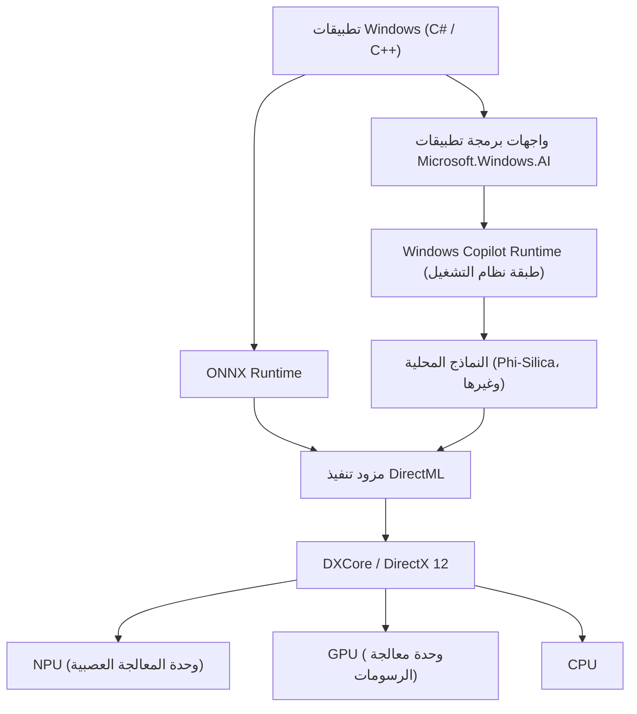
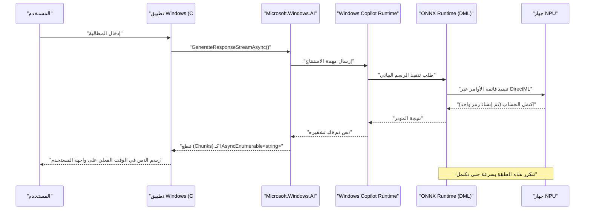

# أمثلة تطبيقية وأكواد برمجية لأحدث واجهات برمجة تطبيقات Microsoft.Windows.AI: استكشاف أعماق Windows Copilot Runtime

## 1. مقدمة: عصر جديد لـ Windows يتم فيه دمج الذكاء الاصطناعي أصلياً

في السنوات الأخيرة، كان تطور تقنية الذكاء الاصطناعي ملحوظًا، وهناك تحول سريع في النموذج من استخدام النماذج اللغوية الكبيرة (LLMs) في السحابة إلى استنتاج الذكاء الاصطناعي على الأجهزة الطرفية (الحواسيب المحلية). في قلب هذا التحول يوجد "Windows Copilot Runtime" الذي توفره Microsoft لنظام التشغيل Windows 11، وواجهة برمجة تطبيقات "Microsoft.Windows.AI" للتحكم فيه.

تطوير التطبيقات باستخدام واجهات برمجة التطبيقات السحابية (مثل OpenAI وAzure OpenAI) سهل، ولكنه يأتي بتحديات مثل زمن الوصول، الخصوصية، والتكاليف المستمرة. من ناحية أخرى، من خلال تشغيل نماذج الذكاء الاصطناعي محليًا، من الممكن تحقيق تطبيقات ذات زمن وصول منخفض للغاية تعمل حتى دون اتصال بالإنترنت، دون السماح للبيانات السرية بمغادرة الجهاز.

في هذه المقالة، سنشرح بالتفصيل كيفية تنفيذ ميزات الذكاء الاصطناعي المحلي، والتي ستصبح ضرورية في تطوير تطبيقات Windows في المستقبل، بدءًا من البنية وصولاً إلى ضبط الأداء، مع أمثلة عملية بأكواد C# وC++. لن نكتفي باستدعاء واجهة برمجة التطبيقات فحسب، بل سنتعمق في التفاصيل التقنية المتقدمة مثل الاستفادة من الأجهزة الأساسية (NPU وGPU) والتكامل مع DirectML.

## 2. النظرة العامة على بنية Windows Copilot Runtime

Windows Copilot Runtime عبارة عن حزمة ذكاء اصطناعي مصممة للسماح للمطورين بدمج نماذج الذكاء الاصطناعي بسهولة في Windows وتحقيق أقصى قدر من الأداء. يعمل هذا وقت التشغيل (Runtime) على تجريد تسريع الأجهزة على مستوى نظام التشغيل (OS) ويوفر واجهة موحدة للمطورين.



كما يوضح مخطط البنية أعلاه، يمكن للتطبيقات الوصول مباشرة إلى النماذج اللغوية الصغيرة (SLM: مثل Phi-Silica) المدمجة في نظام التشغيل باستخدام واجهة برمجة التطبيقات `Microsoft.Windows.AI` عالية المستوى. أيضًا، عند استخدام نماذج مخصصة، يمكن استخدام تسريع الأجهزة صراحةً من خلال ONNX Runtime وDirectML. نظرًا لأن طبقة نظام التشغيل تعمل على تحسين توزيع أعباء العمل على وحدة المعالجة المركزية (CPU) ووحدة معالجة الرسومات (GPU) ووحدة المعالجة العصبية (NPU)، يمكن للمطورين بناء تطبيقات ذكاء اصطناعي عالية الأداء دون الحاجة إلى القلق العميق بشأن اختلافات الأجهزة.

## 3. تسريع الأجهزة والالتقييم الرياضي لـ NPU

تم تجهيز أحدث أجهزة Copilot+ PC بـ NPU (وحدة المعالجة العصبية)، وهي معالجات متخصصة في معالجة الذكاء الاصطناعي. يتم تقييم أداء NPU عمومًا بـ TOPS (تريليون عملية في الثانية).

في استنتاج نماذج الذكاء الاصطناعي، وخاصة قدرة حساب ضرب المصفوفات (GEMM: General Matrix Multiply)، هي التي تحدد الإنتاجية. يُقدر الحد الأقصى للأداء النظري $P_{\text{peak}}$ للأجهزة بالصيغة التالية.

$$
P_{\text{peak}} = f \times N_{\text{cores}} \times N_{\text{MACs/core}} \times 2
$$

حيث:
- $f$ هو تردد ساعة NPU (بهرتز)
- $N_{\text{cores}}$ هو عدد النوى في NPU
- $N_{\text{MACs/core}}$ هو عدد وحدات MAC (الضرب والتراكم) لكل نواة
- الـ $2$ الأخير يرجع إلى أن عملية MAC واحدة تُحسب كعمليتين (الضرب والجمع) (FLOPs/OPs).

على سبيل المثال، بالنسبة لـ NPU بتردد 1.5 جيجاهرتز و4 نوى، وكل نواة تحتوي على 4096 وحدة MAC،
$$
P_{\text{peak}} = 1.5 \times 10^9 \times 4 \times 4096 \times 2 \approx 49.15 \text{ TOPS}
$$
كما يظهر رياضيًا، هذا الأداء يتجاوز متطلبات 40 TOPS لأجهزة Copilot+ PC في Windows 11.

بالإضافة إلى ذلك، فإن استنتاج نماذج الذكاء الاصطناعي، وخاصة نماذج LLM (مرحلة فك التشفير)، يميل إلى أن يكون **مقيدًا بالذاكرة (Memory-Bound)**. يُحسب عرض النطاق الترددي النظري $BW$ لذاكرة النظام على النحو التالي.

$$
BW = f_{\text{mem}} \times W_{\text{bus}} \times \frac{2}{8}
$$

في حالة ذاكرة LPDDR5x-8533 ($f_{\text{mem}} = 8533 \text{ MT/s}$) وناقل 128 بت ($W_{\text{bus}} = 128$)، سيكون عرض النطاق الترددي حوالي $136 \text{ GB/s}$. في تحسين تطبيقات الذكاء الاصطناعي، من المهم كيفية الحفاظ على عرض النطاق الترددي هذا، وتصبح عملية تكميم النموذج (Quantization)، التي سيتم وصفها لاحقًا، ضرورية.

## 4. إعداد بيئة التطوير

لاستخدام أحدث واجهات برمجة تطبيقات الذكاء الاصطناعي لـ Windows، تحتاج إلى إعداد البيئة وسلسلة الأدوات التالية.

1. **نظام التشغيل**: Windows 11 الإصدار 24H2 أو أحدث (يُوصى بشدة بالأجهزة المزودة بـ NPU والتي تلبي متطلبات Copilot+ PC)
2. **حزمة تطوير البرامج (SDK)**: Windows App SDK (إصدار يدعم امتداد الذكاء الاصطناعي v1.5 أو أحدث)
3. **بيئة التطوير**: Visual Studio 2022 (v17.10 أو أحدث)، مع أعباء عمل التطوير الأصلي باستخدام C++ وتطوير سطح مكتب .NET
4. **الحزم**: قم بتثبيت `Microsoft.Windows.AI` و `Microsoft.ML.OnnxRuntime.DirectML` عبر NuGet

```xml
<!-- مثال على إعداد .csproj -->
<ItemGroup>
  <PackageReference Include="Microsoft.Windows.AI" Version="1.0.0-preview1" />
  <PackageReference Include="Microsoft.WindowsAppSDK" Version="1.5.240311000" />
  <PackageReference Include="Microsoft.ML.OnnxRuntime.DirectML" Version="1.17.1" />
</ItemGroup>
```

## 5. [التعمق 1] استخدام النماذج اللغوية المحلية (Phi-Silica) باستخدام C#

يتضمن Windows Copilot Runtime نموذج لغوي صغير عالي الكفاءة يُسمى "Phi-Silica" طورته Microsoft كمكون قياسي في نظام التشغيل. يتيح ذلك معالجة متقدمة للغة الطبيعية (تلخيص النصوص، إنشاء الأكواد، روبوتات الدردشة) في بيئة غير متصلة بالإنترنت، دون الحاجة إلى تنزيل نماذج بحجم جيجابايت من الشبكة.

فيما يلي نموذج كود متقدم لإنشاء روبوت دردشة ذكاء اصطناعي باستخدام C# ومساحة الأسماء `Microsoft.Windows.AI.Generative`. وهو يدعم استجابات البث المتدفق ويقوم بإنشاء نصوص في الوقت الفعلي دون حظر خيط واجهة المستخدم (UI thread).

```csharp
using System;
using System.Text;
using System.Threading;
using System.Threading.Tasks;
using Microsoft.Windows.AI.Generative;

namespace WindowsAI.Sample
{
    public class LocalLanguageModelService
    {
        private LanguageModel _languageModel;
        private bool _isInitialized = false;

        /// <summary>
        /// يقوم بتهيئة النموذج اللغوي. يتحقق من توفر NPU ويحمل النموذج على أفضل جهاز.
        /// </summary>
        public async Task InitializeAsync()
        {
            if (_isInitialized) return;

            Console.WriteLine("التحقق من متطلبات النظام وتوافر نموذج الذكاء الاصطناعي المحلي (Phi-Silica)...");
            
            // التحقق مما إذا كان النموذج متاحًا في النظام (قد يُطلب التنزيل إذا لم يكن مدعومًا)
            var availability = await LanguageModel.CheckAvailabilityAsync();
            if (availability != LanguageModelAvailability.Available)
            {
                throw new InvalidOperationException($"نموذج الذكاء الاصطناعي المحلي غير متاح حاليًا. الحالة: {availability}");
            }

            // إنشاء مثيل النموذج (في هذا الوقت يتم التعيين إلى مساحة الذاكرة وتهيئة NPU)
            _languageModel = await LanguageModel.CreateAsync();
            _isInitialized = true;
            
            Console.WriteLine("تمت تهيئة النموذج اللغوي. تسريع الأجهزة عبر DirectML نشط.");
        }

        /// <summary>
        /// يستقبل مطالبة المستخدم ويولد استجابة عبر البث المتدفق.
        /// </summary>
        public async Task GenerateResponseStreamAsync(string prompt, CancellationToken cancellationToken)
        {
            if (!_isInitialized) await InitializeAsync();

            Console.WriteLine($"\n[إدخال المستخدم]: {prompt}\n[مساعد الذكاء الاصطناعي]: ");

            // إعداد المعلمات الفائقة (Hyperparameters) للإنشاء
            var options = new LanguageModelOptions
            {
                Temperature = 0.7f,
                TopP = 0.9f,
                MaxTokens = 2048,
                RepetitionPenalty = 1.1f
            };

            // بناء سياق المحادثة
            var context = new LanguageModelContext();
            context.AddSystemMessage("أنت مساعد ذكاء اصطناعي متقدم تعمل مباشرة على وحدة NPU المحلية لنظام Windows. يرجى التفكير منطقياً خطوة بخطوة والإجابة بإيجاز.");
            context.AddUserMessage(prompt);

            try
            {
                // استدعاء واجهة برمجة تطبيقات الاستنتاج عبر البث
                var responseStream = _languageModel.GenerateResponseStreamAsync(context, options);

                // التكرار غير المتزامن للقطع (chunks) التي يتم إرجاعها كـ IAsyncEnumerable
                await foreach (var chunk in responseStream.WithCancellation(cancellationToken))
                {
                    // إخراج الرموز (القطع) المُنشأة إلى وحدة التحكم في الوقت الفعلي
                    // بالنسبة لتطبيقات واجهة المستخدم (UI)، استخدم DispatcherQueue هنا لعكسها في TextBox وما إلى ذلك
                    Console.Write(chunk.Text);
                }
                Console.WriteLine();
            }
            catch (OperationCanceledException)
            {
                Console.WriteLine("\n[تم إلغاء الإنشاء بواسطة المستخدم أو النظام]");
            }
            catch (Exception ex)
            {
                Console.WriteLine($"\n[حدث خطأ فادح: {ex.Message}]");
            }
        }
    }
}
```

### 5.1 شرح البنية في تنفيذ C#
يكمن جوهر هذا الكود في التحقق قبل التنفيذ باستخدام `LanguageModel.CheckAvailabilityAsync()` والبث غير المتزامن باستخدام `GenerateResponseStreamAsync`. عندما يتلقى Copilot Runtime الذي يعمل في خلفية نظام التشغيل استدعاء واجهة برمجة التطبيقات هذا، فإنه يبدأ تشغيل ONNX Runtime داخليًا ويختار أفضل موفر تنفيذ (Execution Provider) (DirectML + NPU في العديد من أجهزة الكمبيوتر الحديثة) وفقًا لتكوين النظام.

يمكن للمطورين دمج أحدث خطوط أنابيب استنتاج الذكاء الاصطناعي في تطبيقاتهم ببضعة أسطر من كود C# دون الحاجة إلى القلق بشأن شكل موتر النموذج (Tensor Shape)، أو تنفيذ المُرمِّز (Tokenizer)، أو إدارة ذاكرة التخزين المؤقت KV (KV Cache).

## 6. [التعمق 2] الاستنتاج عالي السرعة للنماذج المخصصة باستخدام C++ و DirectML

عند التعامل مع مجالات معينة (تجزئة الصور الخاصة، التعرف على الصوت، نماذج اكتشاف الكائنات المخصصة، إلخ) التي لا يمكن تغطيتها بواسطة النماذج اللغوية القياسية لنظام التشغيل فقط، يحتاج المطورون إلى معالجة ONNX Runtime وDirectML مباشرة، والتي تقع في الطبقات الدنيا من `Microsoft.Windows.AI`.

باستخدام C++، يمكنك تحسين تخصيص الذاكرة إلى أقصى حد واستخراج أقصى أداء من NPU/GPU. فيما يلي تنفيذ أساسي لخط أنابيب التهيئة والاستنتاج المتقدم لتشغيل النماذج المخصصة بصيغة ONNX (مثل YOLOv8) في C++ باستخدام DirectML.

```cpp
#include <iostream>
#include <vector>
#include <string>
#include <stdexcept>
#include <onnxruntime_cxx_api.h>
#include <dml_provider_factory.h>

class CustomVisionAIProcessor {
private:
    Ort::Env env;
    Ort::Session session{nullptr};
    Ort::AllocatorWithDefaultOptions allocator;
    
public:
    CustomVisionAIProcessor(const std::wstring& modelPath) 
        : env(ORT_LOGGING_LEVEL_WARNING, "VisionAIProcessor") {
        
        Ort::SessionOptions sessionOptions;
        // تحسين عدد الخيوط (Threads)
        sessionOptions.SetIntraOpNumThreads(1);
        // تعيين مستوى تحسين الرسم البياني (Graph Optimization Level) إلى الحد الأقصى
        sessionOptions.SetGraphOptimizationLevel(GraphOptimizationLevel::ORT_ENABLE_ALL);

        // 1. إضافة مزود تنفيذ DirectML (DML EP)
        // device_id = 0 هو المحول الافتراضي الموصى به للنظام (NPU أو GPU عالي الأداء)
        const OrtApi& ortApi = Ort::GetApi();
        OrtDmlApi* dmlApi = nullptr;
        OrtStatus* status = ortApi.GetExecutionProviderApi("DML", ORT_API_VERSION, reinterpret_cast<void**>(&dmlApi));
        
        if (status == nullptr && dmlApi != nullptr) {
            Ort::ThrowOnError(dmlApi->SessionOptionsAppendExecutionProvider_DML(sessionOptions, 0));
            std::cout << "[معلومات] تم إرفاق مزود تنفيذ DirectML بنجاح." << std::endl;
        } else {
            std::cerr << "[تحذير] فشل الحصول على واجهة برمجة تطبيقات DirectML. سيتم التشغيل في وضع التراجع إلى وحدة المعالجة المركزية (CPU Fallback Mode)." << std::endl;
            if (status != nullptr) ortApi.ReleaseStatus(status);
        }

        // 2. تحميل النموذج وإنشاء الجلسة
        try {
            session = Ort::Session(env, modelPath.c_str(), sessionOptions);
            std::cout << "[معلومات] تم تحميل نموذج ONNX بنجاح، وتم تجميع الرسم البياني الحسابي." << std::endl;
        } catch (const Ort::Exception& e) {
            std::cerr << "[خطأ] فشل تحميل النموذج: " << e.what() << std::endl;
            throw;
        }
    }

    void RunInference(const std::vector<float>& imageTensor, const std::vector<int64_t>& inputShape) {
        // 3. إنشاء مخزن مؤقت (Buffer) لموتر الإدخال (Input Tensor)
        Ort::MemoryInfo memoryInfo = Ort::MemoryInfo::CreateCpu(OrtArenaAllocator, OrtMemTypeDefault);
        Ort::Value inputTensor = Ort::Value::CreateTensor<float>(
            memoryInfo, 
            const_cast<float*>(imageTensor.data()), 
            imageTensor.size(), 
            inputShape.data(), 
            inputShape.size()
        );

        // 4. الحصول ديناميكيًا على أسماء عقد الإدخال والإخراج
        auto inputNamePtr = session.GetInputNameAllocated(0, allocator);
        auto outputNamePtr = session.GetOutputNameAllocated(0, allocator);
        const char* inputNames[] = { inputNamePtr.get() };
        const char* outputNames[] = { outputNamePtr.get() };

        // 5. تنفيذ الاستنتاج (يتم تفريغه (offloaded) إلى NPU/GPU عبر DirectML)
        std::cout << "[معلومات] بدء تنفيذ محرك الاستنتاج..." << std::endl;
        auto startTime = std::chrono::high_resolution_clock::now();

        auto outputTensors = session.Run(Ort::RunOptions{nullptr}, inputNames, &inputTensor, 1, outputNames, 1);

        auto endTime = std::chrono::high_resolution_clock::now();
        auto duration = std::chrono::duration_cast<std::chrono::milliseconds>(endTime - startTime);

        // 6. استرداد موتر النتيجة وتحليله
        float* outputData = outputTensors.front().GetTensorMutableData<float>();
        size_t outputSize = outputTensors.front().GetTensorTypeAndShapeInfo().GetElementCount();
        
        std::cout << "[النتيجة] اكتمل الاستنتاج: " << duration.count() << " مللي ثانية" << std::endl;
        std::cout << "[النتيجة] عدد عناصر موتر الإخراج: " << outputSize << std::endl;
        // * بعد ذلك، يتم تنفيذ القمع غير الأقصى (NMS) وعمليات رسم الصناديق المحيطة (Bounding Boxes) على موتر الإخراج
    }
};

int main() {
    try {
        // مسار نموذج ONNX المراد تنفيذه
        CustomVisionAIProcessor processor(L"models/yolov8n_quantized.onnx");
        
        // بيانات صورة وهمية للاستنتاج (حجم الدُفعة (Batch Size) 1 × 3 قنوات × 640 × 640)
        std::vector<int64_t> inputShape = {1, 3, 640, 640};
        std::vector<float> dummyImage(1 * 3 * 640 * 640, 0.5f);
        
        processor.RunInference(dummyImage, inputShape);
    } catch (const std::exception& e) {
        std::cerr << "انتهى البرنامج بشكل غير طبيعي: " << e.what() << std::endl;
        return -1;
    }
    return 0;
}
```

### 6.1 أهمية إدارة الذاكرة والاستنتاج الخالي من النسخ (Zero-Copy) في C++
أكبر ميزة لاستخدام DirectML في C++ هي التكامل الوثيق الممكن مع DirectX 12 (DX12). يتضمن الكود أعلاه نسخة قياسية من بيانات ذاكرة وحدة المعالجة المركزية للأغراض التعليمية، ولكن في محركات الألعاب الفعلية أو تطبيقات معالجة الفيديو، غالبًا ما يتم الاحتفاظ بالصور (الأنسجة (Textures)) بالفعل في مساحة ذاكرة وحدة معالجة الرسومات (GPU) أو وحدة المعالجة العصبية (NPU) باستخدام DX12.

في هذه الحالة، من خلال الاستفادة من ميزات الربط المتقدمة لـ `OrtDmlApi`، من الممكن تحقيق "**الاستنتاج الخالي من النسخ (Zero-Copy Inference)**"، والذي يعين موارد DX12 مباشرة كموترات (Tensors) لـ ONNX Runtime. نتيجة لذلك، يختفي تمامًا العبء الإضافي لنقل البيانات عبر ناقل PCIe (استهلاك النطاق الترددي $BW$ المذكور أعلاه)، ويتحسن معدل الإطارات في معالجة الفيديو في الوقت الفعلي بشكل كبير.

## 7. تحسين الأداء وأفضل الممارسات

فيما يلي استراتيجيات التحسين الأساسية عند تطوير تطبيقات الذكاء الاصطناعي من الدرجة الأولى باستخدام واجهات برمجة تطبيقات Windows AI و DirectML.

### 7.1 تكميم النموذج (Quantization) ومجموعة أدوات Olive
لإطلاق العنان للقوة الحقيقية لـ NPU، فإن الشرط المطلق هو **تكميم (Quantization)** أوزان وتنشيطات نموذج الذكاء الاصطناعي من FP32 (الفاصلة العائمة أحادية الدقة) إلى INT8 أو INT4. تم تحسين بنية NPU لعمليات الأعداد الصحيحة، ويوفر INT8 إنتاجية أعلى من الناحية النظرية بـ 4 أضعاف وتوفيرًا كبيرًا في الطاقة مقارنة بـ FP32.

باستخدام سلسلة أدوات `Olive (ONNX Live)` التي توفرها Microsoft، يمكن تحسين نماذج مثل PyTorch تلقائيًا لبيئات Windows. يوفر Olive دعمًا قويًا لتحسينات الانتباه (Attention) الخاصة لنماذج المحولات (Transformer models) وتجميع الرسوم البيانية (Graph compilation) الخاصة بالأجهزة.

### 7.2 مقايضة بين معالجة الدفعات (Batch Processing) والبث التفاعلي
في استدعاءات واجهة برمجة التطبيقات، يمكن أن تؤدي معالجة الدفعات لطلبات استنتاج متعددة إلى زيادة كفاءة استخدام NPU (Compute Utilization). ومع ذلك، بالنسبة لواجهات المستخدم التفاعلية مثل روبوتات الدردشة، فإن الوقت المستغرق لعرض الرمز الأول (TTFT: Time To First Token) يحدد تجربة المستخدم (UX) أكثر من الإنتاجية.
لذلك، بالنسبة لواجهات المستخدم التفاعلية، فإن أفضل ممارسة هي تعيين حجم الدفعة إلى 1 وتحديد أولوية الإنشاء المتدفق.

### 7.3 مهام الخلفية والتكامل مع نظام التشغيل
يستهلك استنتاج الذكاء الاصطناعي كمية كبيرة من الطاقة المحلية وموارد النظام. بالاشتراك مع واجهة برمجة تطبيقات `App Lifecycle API` في Windows، عندما يعمل التطبيق في الخلفية، يُطلب تعليق (Suspend) مهام الاستنتاج ذات الأولوية المنخفضة أو تقييد استهلاك الموارد.



يوضح مخطط التسلسل هذا جمال المعالجة غير المتزامنة حيث تتدفق البيانات بسلاسة من الأجهزة الأساسية (NPU) في أدنى مستوى إلى طبقة العرض الخاصة بالتطبيق دون حظر خيط واجهة المستخدم (UI thread) على الإطلاق.

## 8. الآفاق المستقبلية وتطور Windows AI

تتطور واجهة برمجة تطبيقات `Microsoft.Windows.AI` و Copilot Runtime بسرعة في الوقت الحاضر. من المتوقع حدوث التحولات التالية في التحديثات المستقبلية للمطورين:

- **تكامل أصلي لواجهة برمجة تطبيقات متعددة الوسائط (Multimodal API) في نظام التشغيل**: المعالجة المتزامنة السلسة ليس فقط للنصوص ولكن أيضًا للصوت، الصور، وحتى خلاصات الفيديو الحية، مما يوفر استنتاج ذكاء اصطناعي متعدد الوسائط كمعيار قياسي على مستوى نظام التشغيل.
- **دعم على مستوى النظام لـ RAG (الجيل المعزز بالاسترجاع)**: بناء مساعد ذكاء اصطناعي شخصي متقدم للغاية عن طريق ربط مجموعة المستندات الشخصية في جهاز الكمبيوتر المحلي أو فهرس Windows Search بنموذج الذكاء الاصطناعي في بيئة (Sandbox) آمنة داخل نظام التشغيل، مع حماية خصوصية المستخدم بشكل كامل.
- **توسيع النطاق الديناميكي لموارد NPU**: عندما تعمل تطبيقات ذكاء اصطناعي متعددة في نفس الوقت (على سبيل المثال، إلغاء الضوضاء في الخلفية وإنشاء الأكواد في المقدمة)، يقوم مجدول النواة (Kernel Scheduler) في Windows بتبديل سياق تنفيذ NPU ديناميكيًا لضمان جودة الخدمة (QoS).

## 9. الخلاصة: مستقبل التطبيقات التي يغيرها الذكاء الاصطناعي المحلي

جلب Copilot Runtime و واجهة برمجة التطبيقات `Microsoft.Windows.AI` في Windows 11 سلاحًا قويًا للغاية يُسمى "الذكاء الاصطناعي المحلي" لجميع مطوري Windows. لم يعد من الضروري الاعتماد بالكامل على واجهات برمجة التطبيقات السحابية. من الممكن تزويد المستخدمين بتجربة ذكاء اصطناعي من الجيل التالي تقضي على زمن الوصول، وتحمي الخصوصية، وتعمل بشكل كامل حتى في وضع عدم الاتصال.

استخدم المعرفة بدمج النماذج اللغوية القياسية للنظام باستخدام C#، والتقييم الرياضي للأداء، وتحسين الأجهزة المتقدم باستخدام C++ و DirectML المشروح في هذه المقالة لإنشاء تطبيقات Windows من الجيل التالي "الأصلية للذكاء الاصطناعي" بيديك. الاحتمالات اللانهائية التي يوفرها الذكاء الاصطناعي تكمن مباشرة وراء الكود الذي تكتبه.

---
*ملاحظة: تمت كتابة هذه المقالة بناءً على واجهات برمجة التطبيقات للمعاينة وأحدث المواصفات اعتبارًا من سبتمبر 2026. نظرًا لأن مواصفات واجهة برمجة التطبيقات ومتطلبات الأجهزة قد تتغير مع تحديثات Windows، فتأكد من الرجوع إلى الوثائق الرسمية لـ Microsoft Learn عند التنفيذ.*
