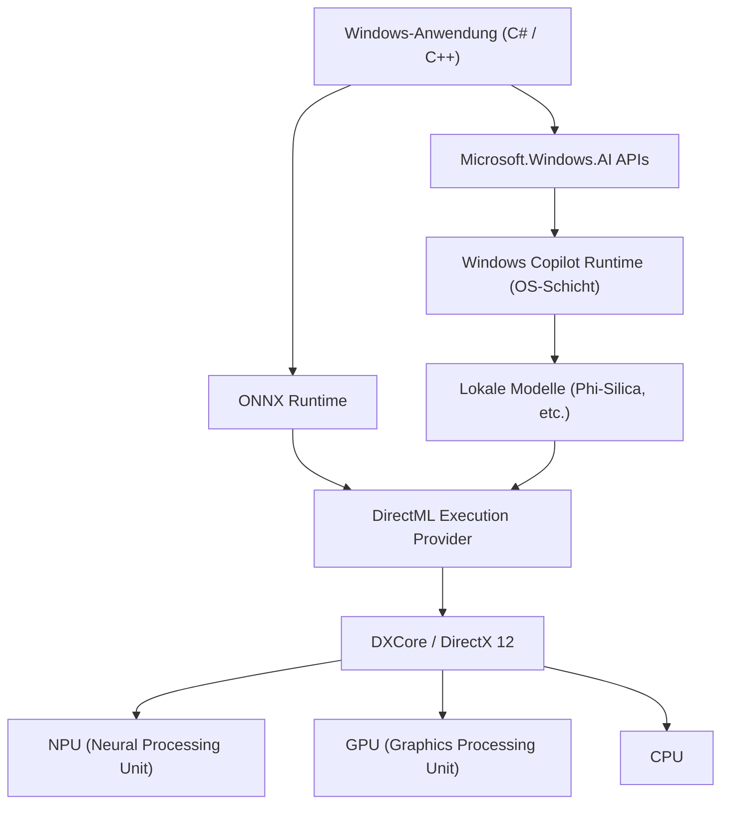
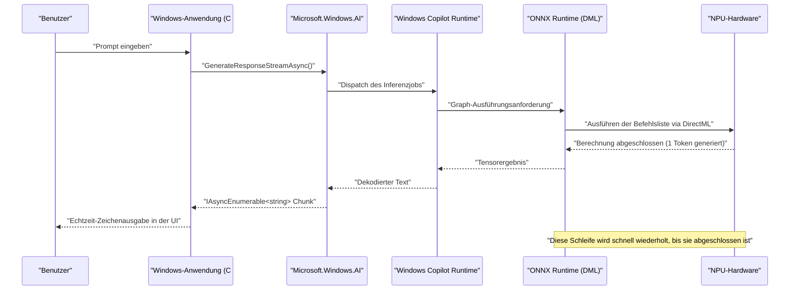

# Microsoft.Windows.AI: Neueste API-Anwendungsfälle und Beispielcode – Die Tiefen der Windows Copilot Runtime erkunden

## 1. Einführung: Eine neue Ära für Windows mit nativer KI-Integration

In den letzten Jahren hat sich die KI-Technologie bemerkenswert weiterentwickelt, was zu einem schnellen Paradigmenwechsel von der Nutzung großer Sprachmodelle (LLMs) in der Cloud hin zu KI-Inferenzen auf Edge-Geräten (lokalen PCs) geführt hat. Das Herzstück dieser Entwicklung sind die von Microsoft für Windows 11 bereitgestellte "Windows Copilot Runtime" und die "Microsoft.Windows.AI"-API zu deren Steuerung.

Die Entwicklung von Anwendungen mithilfe von Cloud-APIs (wie OpenAI oder Azure OpenAI) ist zwar einfach, bringt jedoch Herausforderungen in Bezug auf Latenz, Datenschutz und laufende Kosten mit sich. Durch die lokale Ausführung von KI-Modellen können hingegen extrem latenzarme Anwendungen realisiert werden, die auch offline funktionieren, ohne dass sensible Daten das Gerät verlassen.

Dieser Artikel bietet eine äußerst detaillierte Erklärung zur Implementierung lokaler KI-Funktionen, die für die zukünftige Entwicklung von Windows-Anwendungen unerlässlich sind. Anhand praktischer Beispielcodes in C# und C++ werden Aspekte von der Architektur bis hin zum Performance-Tuning umfassend behandelt. Wir gehen dabei tief auf technische Details ein, wie die Nutzung der zugrunde liegenden Hardware (NPU und GPU) und die Integration mit DirectML, anstatt nur API-Aufrufe zu demonstrieren.

## 2. Windows Copilot Runtime und der Architekturüberblick

Die Windows Copilot Runtime ist ein KI-Stack, der so konzipiert ist, dass Entwickler KI-Modelle problemlos in Windows integrieren und gleichzeitig die beste Leistung erzielen können. Diese Laufzeitumgebung abstrahiert die Hardwarebeschleunigung auf Betriebssystemebene und bietet Entwicklern eine einheitliche Schnittstelle.



Wie das obige Architekturdiagramm zeigt, können Anwendungen über die High-Level-API `Microsoft.Windows.AI` direkt auf Small Language Models (SLMs wie Phi-Silica) zugreifen, die im Betriebssystem integriert sind. Bei der Verwendung benutzerdefinierter Modelle ist es zudem möglich, die Hardwarebeschleunigung explizit über die ONNX Runtime und DirectML zu nutzen. Da die Betriebssystemschicht die Verteilung der Arbeitslast auf CPU, GPU und NPU optimiert, können Entwickler hochleistungsfähige KI-Anwendungen erstellen, ohne sich tiefgreifend um Hardwareunterschiede kümmern zu müssen.

## 3. Hardwarebeschleunigung und mathematische Bewertung der NPU

Die neuesten Copilot+ PCs sind mit NPUs (Neural Processing Units) ausgestattet, Prozessoren, die speziell auf KI-Verarbeitung zugeschnitten sind. Die Leistung von NPUs wird im Allgemeinen in TOPS (Tera Operations Per Second) gemessen.

Bei der Inferenz von KI-Modellen bestimmt insbesondere die Rechenleistung bei der Matrixmultiplikation (GEMM: General Matrix Multiply) den Durchsatz. Die theoretische maximale Leistung der Hardware $P_{\text{peak}}$ kann mit der folgenden Formel geschätzt werden:

$$
P_{\text{peak}} = f \times N_{\text{cores}} \times N_{\text{MACs/core}} \times 2
$$

Hierbei ist:
- $f$ die Taktfrequenz der NPU (Hz)
- $N_{\text{cores}}$ die Anzahl der Kerne in der NPU
- $N_{\text{MACs/core}}$ die Anzahl der MAC-Einheiten (Multiply-Accumulate) pro Kern
- Die abschließende $2$ steht dafür, dass eine MAC-Operation als zwei Operationen (Multiplikation und Addition, FLOPs/OPs) gezählt wird.

Für eine NPU mit einer Frequenz von 1,5 GHz, 4 Kernen und 4096 MACs pro Kern ergibt sich beispielsweise:
$$
P_{\text{peak}} = 1.5 \times 10^9 \times 4 \times 4096 \times 2 \approx 49.15 \text{ TOPS}
$$
Dies zeigt mathematisch, dass die Leistung die Anforderung von 40 TOPS für Copilot+ PCs in Windows 11 erfüllt.

Darüber hinaus ist die Inferenz von KI-Modellen, insbesondere von LLMs (Dekodierungsphase), oft **speichergebunden (Memory-Bound)**. Die theoretische Bandbreite des Systemspeichers $BW$ wird wie folgt berechnet:

$$
BW = f_{\text{mem}} \times W_{\text{bus}} \times \frac{2}{8}
$$

Bei LPDDR5x-8533-Speicher ($f_{\text{mem}} = 8533 \text{ MT/s}$) und einem 128-Bit-Bus ($W_{\text{bus}} = 128$) beträgt die Bandbreite etwa $136 \text{ GB/s}$. Bei der Optimierung von KI-Anwendungen ist es entscheidend, wie diese Bandbreite eingespart werden kann, weshalb die später erläuterte Modellquantisierung (Quantization) unerlässlich ist.

## 4. Einrichtung der Entwicklungsumgebung

Um die neuesten Windows AI APIs zu nutzen, müssen folgende Umgebung und Toolchains eingerichtet werden:

1. **OS**: Windows 11 Version 24H2 oder neuer (Geräte mit NPU, die die Anforderungen für Copilot+ PCs erfüllen, werden dringend empfohlen)
2. **SDK**: Windows App SDK (Version 1.5 oder neuer mit KI-Erweiterungsunterstützung)
3. **Entwicklungsumgebung**: Visual Studio 2022 (v17.10 oder neuer), Workloads für native C++-Entwicklung und .NET-Desktopentwicklung
4. **Pakete**: Installation von `Microsoft.Windows.AI` und `Microsoft.ML.OnnxRuntime.DirectML` über NuGet

```xml
<!-- Beispiel für die .csproj-Konfiguration -->
<ItemGroup>
  <PackageReference Include="Microsoft.Windows.AI" Version="1.0.0-preview1" />
  <PackageReference Include="Microsoft.WindowsAppSDK" Version="1.5.240311000" />
  <PackageReference Include="Microsoft.ML.OnnxRuntime.DirectML" Version="1.17.1" />
</ItemGroup>
```

## 5. 【Deep Dive 1】Nutzung lokaler Sprachmodelle (Phi-Silica) mit C#

Die Windows Copilot Runtime enthält als standardmäßige Betriebssystemkomponente das von Microsoft entwickelte, hocheffiziente kleine Sprachmodell "Phi-Silica". Dadurch wird eine fortschrittliche Verarbeitung natürlicher Sprache (Zusammenfassung von Texten, Codegenerierung, Chatbots) in Offline-Umgebungen ermöglicht, ohne dass gigabytegroße Modelle aus dem Netzwerk heruntergeladen werden müssen.

Im Folgenden finden Sie einen fortgeschrittenen Beispielcode in C#, der den Namensraum `Microsoft.Windows.AI.Generative` verwendet, um eine Chat-KI zu erstellen. Er unterstützt Streaming-Antworten und generiert Text in Echtzeit, ohne den UI-Thread zu blockieren.

```csharp
using System;
using System.Text;
using System.Threading;
using System.Threading.Tasks;
using Microsoft.Windows.AI.Generative;

namespace WindowsAI.Sample
{
    public class LocalLanguageModelService
    {
        private LanguageModel _languageModel;
        private bool _isInitialized = false;

        /// <summary>
        /// Initialisiert das Sprachmodell. Überprüft die Verfügbarkeit der NPU und lädt das Modell auf das optimale Gerät.
        /// </summary>
        public async Task InitializeAsync()
        {
            if (_isInitialized) return;

            Console.WriteLine("Systemanforderungen und Verfügbarkeit des lokalen KI-Modells (Phi-Silica) werden überprüft...");
            
            // Überprüfen, ob das Modell auf dem System verfügbar ist (falls nicht unterstützt, kann ein Download angefordert werden)
            var availability = await LanguageModel.CheckAvailabilityAsync();
            if (availability != LanguageModelAvailability.Available)
            {
                throw new InvalidOperationException($"Das lokale KI-Modell ist derzeit nicht verfügbar. Status: {availability}");
            }

            // Erstellen der Modellinstanz (Zu diesem Zeitpunkt erfolgen das Mapping in den Speicher und die NPU-Initialisierung)
            _languageModel = await LanguageModel.CreateAsync();
            _isInitialized = true;
            
            Console.WriteLine("Initialisierung des Sprachmodells abgeschlossen. Hardwarebeschleunigung über DirectML ist aktiv.");
        }

        /// <summary>
        /// Nimmt die Benutzereingabe (Prompt) entgegen und generiert die Antwort als Stream.
        /// </summary>
        public async Task GenerateResponseStreamAsync(string prompt, CancellationToken cancellationToken)
        {
            if (!_isInitialized) await InitializeAsync();

            Console.WriteLine($"\n[Benutzereingabe]: {prompt}\n[KI-Assistent]: ");

            // Hyperparameter für die Generierung festlegen
            var options = new LanguageModelOptions
            {
                Temperature = 0.7f,
                TopP = 0.9f,
                MaxTokens = 2048,
                RepetitionPenalty = 1.1f
            };

            // Aufbau des Konversationskontexts
            var context = new LanguageModelContext();
            context.AddSystemMessage("Du bist ein hochentwickelter KI-Assistent, der direkt auf der lokalen NPU von Windows läuft. Denke logisch Schritt für Schritt und antworte prägnant.");
            context.AddUserMessage(prompt);

            try
            {
                // Aufruf der Streaming-Inferenz-API
                var responseStream = _languageModel.GenerateResponseStreamAsync(context, options);

                // Asynchrones Iterieren über die Chunks, die als IAsyncEnumerable zurückgegeben werden
                await foreach (var chunk in responseStream.WithCancellation(cancellationToken))
                {
                    // Generierte Token (Chunks) in Echtzeit in der Konsole ausgeben
                    // In einer UI-Anwendung würde hier der DispatcherQueue verwendet werden, um z. B. eine TextBox zu aktualisieren
                    Console.Write(chunk.Text);
                }
                Console.WriteLine();
            }
            catch (OperationCanceledException)
            {
                Console.WriteLine("\n[Generierung wurde vom Benutzer oder System abgebrochen]");
            }
            catch (Exception ex)
            {
                Console.WriteLine($"\n[Ein schwerwiegender Fehler ist aufgetreten: {ex.Message}]");
            }
        }
    }
}
```

### 5.1 Architektur-Erklärung der C#-Implementierung
Der Kern dieses Codes liegt in der Vorabprüfung durch `LanguageModel.CheckAvailabilityAsync()` und dem asynchronen Streaming durch `GenerateResponseStreamAsync`. Wenn die im Hintergrund des Betriebssystems laufende Copilot Runtime diesen API-Aufruf empfängt, startet sie intern die ONNX Runtime und wählt den optimalen Execution Provider (bei vielen modernen PCs DirectML + NPU) basierend auf der Systemkonfiguration aus.

Entwickler können modernste KI-Inferenzpipelines mit nur wenigen Zeilen C#-Code in ihre Anwendungen integrieren, ohne sich um die Tensorform des Modells, die Implementierung des Tokenizers oder die Speicherverwaltung des KV-Caches kümmern zu müssen.

## 6. 【Deep Dive 2】Schnelle Inferenz benutzerdefinierter Modelle mit C++ und DirectML

Bei der Arbeit mit spezifischen Domänen (wie etwa eigene Bildsegmentierung, Spracherkennung oder benutzerdefinierte Objekterkennungsmodelle), die von den standardmäßigen Sprachmodellen des Betriebssystems nicht abgedeckt werden, müssen Entwickler direkt mit der ONNX Runtime und DirectML interagieren, die in den unteren Schichten von `Microsoft.Windows.AI` angesiedelt sind.

Durch die Verwendung von C++ kann die Speicherzuweisung extrem optimiert werden, um die Spitzenleistung der NPU/GPU abzurufen. Im Folgenden sehen Sie eine Kernimplementierung einer fortschrittlichen Initialisierungs- und Inferenzpipeline für die Ausführung eines benutzerdefinierten Modells im ONNX-Format (z. B. YOLOv8) mit DirectML in C++.

```cpp
#include <iostream>
#include <vector>
#include <string>
#include <stdexcept>
#include <onnxruntime_cxx_api.h>
#include <dml_provider_factory.h>

class CustomVisionAIProcessor {
private:
    Ort::Env env;
    Ort::Session session{nullptr};
    Ort::AllocatorWithDefaultOptions allocator;
    
public:
    CustomVisionAIProcessor(const std::wstring& modelPath) 
        : env(ORT_LOGGING_LEVEL_WARNING, "VisionAIProcessor") {
        
        Ort::SessionOptions sessionOptions;
        // Optimierung der Thread-Anzahl
        sessionOptions.SetIntraOpNumThreads(1);
        // Maximale Graphenoptimierungsstufe festlegen
        sessionOptions.SetGraphOptimizationLevel(GraphOptimizationLevel::ORT_ENABLE_ALL);

        // 1. Hinzufügen des DirectML Execution Providers (DML EP)
        // device_id = 0 ist der vom System empfohlene Standardadapter (NPU oder Hochleistungs-GPU)
        const OrtApi& ortApi = Ort::GetApi();
        OrtDmlApi* dmlApi = nullptr;
        OrtStatus* status = ortApi.GetExecutionProviderApi("DML", ORT_API_VERSION, reinterpret_cast<void**>(&dmlApi));
        
        if (status == nullptr && dmlApi != nullptr) {
            Ort::ThrowOnError(dmlApi->SessionOptionsAppendExecutionProvider_DML(sessionOptions, 0));
            std::cout << "[Info] DirectML Execution Provider wurde erfolgreich angehängt." << std::endl;
        } else {
            std::cerr << "[Warning] DirectML API konnte nicht abgerufen werden. Ausführung im CPU-Fallback-Modus." << std::endl;
            if (status != nullptr) ortApi.ReleaseStatus(status);
        }

        // 2. Laden des Modells und Erstellen der Session
        try {
            session = Ort::Session(env, modelPath.c_str(), sessionOptions);
            std::cout << "[Info] ONNX-Modell erfolgreich geladen und Berechnungsgraph kompiliert." << std::endl;
        } catch (const Ort::Exception& e) {
            std::cerr << "[Error] Fehler beim Laden des Modells: " << e.what() << std::endl;
            throw;
        }
    }

    void RunInference(const std::vector<float>& imageTensor, const std::vector<int64_t>& inputShape) {
        // 3. Puffer für den Eingabetensor erstellen
        Ort::MemoryInfo memoryInfo = Ort::MemoryInfo::CreateCpu(OrtArenaAllocator, OrtMemTypeDefault);
        Ort::Value inputTensor = Ort::Value::CreateTensor<float>(
            memoryInfo, 
            const_cast<float*>(imageTensor.data()), 
            imageTensor.size(), 
            inputShape.data(), 
            inputShape.size()
        );

        // 4. Dynamisches Abrufen der Ein- und Ausgabeknotennamen
        auto inputNamePtr = session.GetInputNameAllocated(0, allocator);
        auto outputNamePtr = session.GetOutputNameAllocated(0, allocator);
        const char* inputNames[] = { inputNamePtr.get() };
        const char* outputNames[] = { outputNamePtr.get() };

        // 5. Inferenz ausführen (wird über DirectML an die NPU/GPU ausgelagert)
        std::cout << "[Info] Ausführung der Inferenz-Engine gestartet..." << std::endl;
        auto startTime = std::chrono::high_resolution_clock::now();

        auto outputTensors = session.Run(Ort::RunOptions{nullptr}, inputNames, &inputTensor, 1, outputNames, 1);

        auto endTime = std::chrono::high_resolution_clock::now();
        auto duration = std::chrono::duration_cast<std::chrono::milliseconds>(endTime - startTime);

        // 6. Ergebnistensor abrufen und analysieren
        float* outputData = outputTensors.front().GetTensorMutableData<float>();
        size_t outputSize = outputTensors.front().GetTensorTypeAndShapeInfo().GetElementCount();
        
        std::cout << "[Result] Inferenz abgeschlossen: " << duration.count() << " ms" << std::endl;
        std::cout << "[Result] Anzahl der Elemente im Ausgabetensor: " << outputSize << std::endl;
        // * Anschließend werden NMS (Non-Maximum Suppression) oder das Zeichnen von Bounding-Boxen für den Ausgabetensor implementiert
    }
};

int main() {
    try {
        // Pfad zum auszuführenden ONNX-Modell
        CustomVisionAIProcessor processor(L"models/yolov8n_quantized.onnx");
        
        // Dummy-Bilddaten für die Inferenz (Batch-Größe 1 x 3 Kanäle x 640 x 640)
        std::vector<int64_t> inputShape = {1, 3, 640, 640};
        std::vector<float> dummyImage(1 * 3 * 640 * 640, 0.5f);
        
        processor.RunInference(dummyImage, inputShape);
    } catch (const std::exception& e) {
        std::cerr << "Das Programm wurde unerwartet beendet: " << e.what() << std::endl;
        return -1;
    }
    return 0;
}
```

### 6.1 Die Bedeutung von Speicherverwaltung und Zero-Copy-Inferenz in C++
Der größte Vorteil der Verwendung von DirectML in C++ ist die enge Integration mit DirectX 12 (DX12). Während der obige Code aus pädagogischen Gründen ein standardmäßiges Kopieren von Daten aus dem CPU-Speicher enthält, ist es in realen Spiel-Engines oder Videoverarbeitungsanwendungen oft der Fall, dass Bilder (Texturen) mithilfe von DX12 bereits im Speicher der GPU oder NPU vorgehalten werden.

In solchen Fällen können die erweiterten Bindungsfunktionen der `OrtDmlApi` genutzt werden, um DX12-Ressourcen direkt als Tensoren der ONNX Runtime abzubilden, wodurch eine "**Zero-Copy Inference**" (Inferenz ohne Kopiervorgänge) realisiert wird. Dadurch entfällt der Overhead der Datenübertragung über den PCIe-Bus (der Verbrauch der oben erwähnten Bandbreite $BW$) vollständig, und die Bildrate bei der Echtzeit-Videoverarbeitung wird drastisch verbessert.

## 7. Leistungsoptimierung und Best Practices

Im Folgenden werden unverzichtbare Optimierungsstrategien für die Entwicklung erstklassiger KI-Anwendungen unter Verwendung der Windows AI API und DirectML zusammengefasst.

### 7.1 Modellquantisierung (Quantization) und das Olive Toolkit
Um das wahre Potenzial der NPU zu entfalten, ist es absolut notwendig, die Gewichte und Aktivierungen von KI-Modellen von FP32 (einfache Genauigkeit) zu INT8 oder INT4 zu **quantisieren (Quantization)**. Die NPU-Architektur ist auf Ganzzahloperationen spezialisiert und bietet mit INT8 im Vergleich zu FP32 theoretisch den vierfachen Durchsatz und massive Energieeinsparungen.

Durch die Verwendung der von Microsoft bereitgestellten Toolchain `Olive (ONNX Live)` können Modelle aus PyTorch und anderen Frameworks automatisch für Windows-Umgebungen optimiert werden. Olive bietet starke Unterstützung für spezielle Aufmerksamkeitsoptimierungen (Attention-Optimierungen) in Transformer-Modellen und die hardwarebezogene Kompilierung von Graphen.

### 7.2 Der Kompromiss: Batch-Verarbeitung vs. interaktives Streaming
Bei API-Aufrufen kann die Auslastung der NPU (Compute Utilization) durch das Zusammenfassen mehrerer Inferenzanforderungen in einer Batch-Verarbeitung (Stapelverarbeitung) erhöht werden. Bei einer interaktiven Benutzeroberfläche wie einem Chatbot bestimmt jedoch die Zeit, bis das erste Token angezeigt wird (TTFT: Time To First Token), das Benutzererlebnis (UX) mehr als der bloße Durchsatz.
Daher besteht die Best Practice für interaktive UIs darin, die Batch-Größe auf 1 zu setzen und der Streaming-Generierung Vorrang zu geben.

### 7.3 Hintergrundaufgaben und Zusammenarbeit mit dem Betriebssystem
KI-Inferenzen verbrauchen lokal große Mengen an Strom und Systemressourcen. Durch die Integration mit der Windows `App Lifecycle API` wird erwartet, dass Inferenzaufgaben mit niedriger Priorität angehalten (Suspend) oder der Ressourcenverbrauch gedrosselt wird, wenn die Anwendung in den Hintergrund tritt.



Dieses Sequenzdiagramm veranschaulicht die Eleganz der asynchronen Verarbeitung, bei der Daten von der untersten NPU-Hardwareschicht bis zur Präsentationsschicht der Anwendung fließen, ohne dass der UI-Thread jemals blockiert wird.

## 8. Zukunftsausblick und die Evolution von Windows AI

Die `Microsoft.Windows.AI`-API und die Copilot Runtime entwickeln sich rasant weiter. Zukünftige Updates für Entwickler lassen folgende Paradigmenwechsel erwarten:

- **OS-native Integration multimodaler APIs**: Nahtlose, gleichzeitige Verarbeitung nicht nur von Text, sondern auch von Audio, Bildern und sogar Live-Video-Feeds, wodurch cross-modale KI-Inferenzen standardmäßig auf OS-Ebene bereitgestellt werden.
- **RAG (Retrieval-Augmented Generation) auf Systemebene**: Die Verknüpfung persönlicher Dokumente und des Windows-Suchindex auf dem lokalen PC mit KI-Modellen innerhalb der sicheren OS-Sandbox. Dies ermöglicht den Aufbau hochentwickelter, persönlicher KI-Assistenten, die die Privatsphäre des Benutzers vollständig wahren.
- **Dynamische Ressourcenskalierung der NPU**: Ein Mechanismus, bei dem der Windows-Kernel-Scheduler den Ausführungskontext der NPU dynamisch umschaltet, um QoS (Quality of Service) zu gewährleisten, wenn mehrere KI-Anwendungen (z. B. Rauschunterdrückung im Hintergrund und Codegenerierung im Vordergrund) gleichzeitig ausgeführt werden.

## 9. Fazit: Die Zukunft von Anwendungen durch lokale KI

Die Copilot Runtime in Windows 11 und die `Microsoft.Windows.AI`-API haben allen Windows-Entwicklern die extrem mächtige Waffe der "lokalen KI" an die Hand gegeben. Es besteht keine absolute Abhängigkeit mehr von Cloud-APIs. Sie können den Benutzern KI-Erlebnisse der nächsten Generation bieten, die Latenzen eliminieren, den Datenschutz strikt wahren und auch offline vollständig funktionieren.

Nutzen Sie das Wissen aus diesem Artikel – von der Integration standardmäßiger Sprachmodelle des Betriebssystems mit C# über mathematische Leistungsbewertungen bis hin zu extremer Hardwareoptimierung mithilfe von C++ und DirectML –, um eigenhändig "KI-native" Windows-Anwendungen der nächsten Generation zu erschaffen. Die unbegrenzten Möglichkeiten, die KI bietet, liegen direkt vor dem Code, den Sie schreiben.

---
*Hinweis: Dieser Artikel basiert auf den Preview-APIs und den neuesten Spezifikationen mit Stand September 2026. Da sich API-Spezifikationen und Hardwareanforderungen aufgrund von Windows-Updates ändern können, konsultieren Sie bei der Implementierung immer auch die offizielle Dokumentation von Microsoft Learn.*
