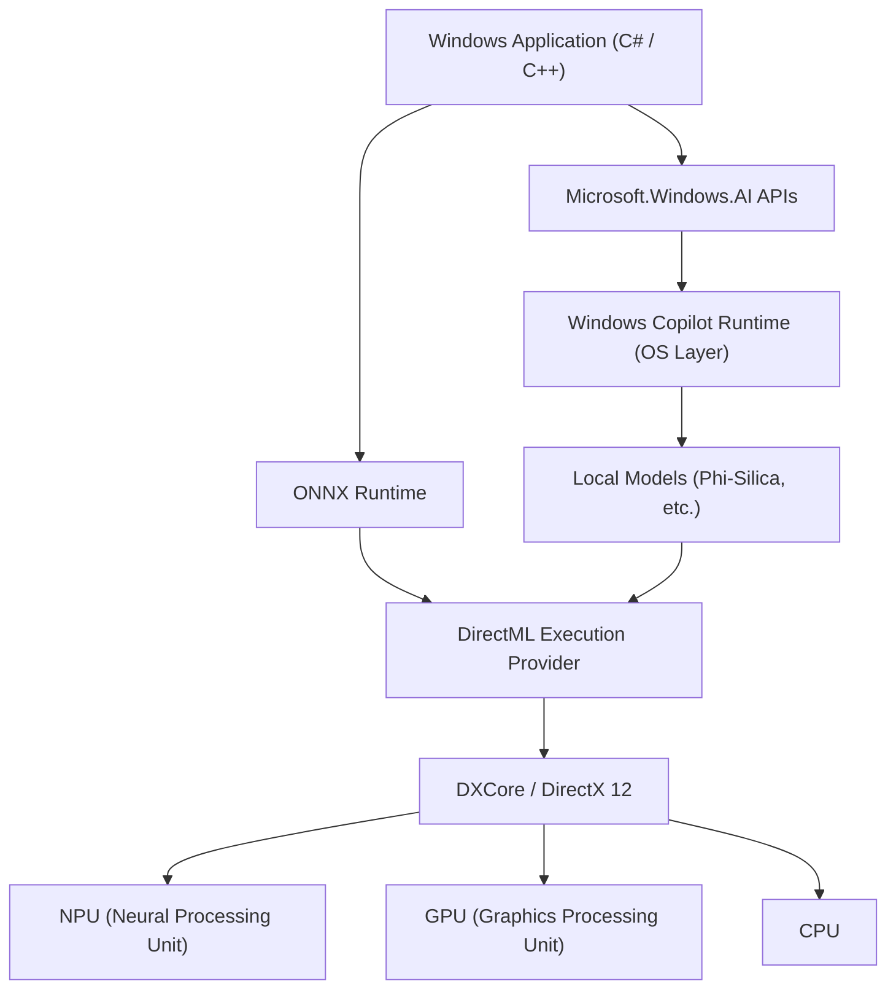
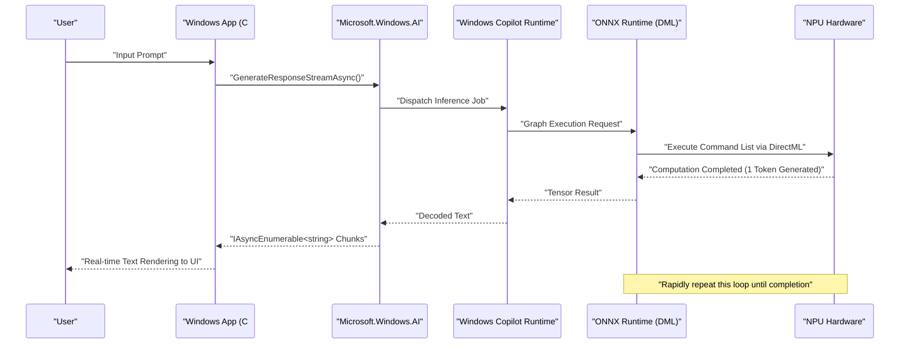

# Latest API Usage Examples and Sample Code for Microsoft.Windows.AI: Exploring the Depths of Windows Copilot Runtime

## 1. Introduction: A New Era of Windows with Natively Integrated AI

In recent years, AI technology has evolved remarkably, resulting in a rapid paradigm shift from the utilization of Large Language Models (LLMs) on the cloud to AI inference on edge devices (local PCs). At the core of this are the "Windows Copilot Runtime" provided by Microsoft for Windows 11, and the "Microsoft.Windows.AI" APIs designed to operate it.

Application development using cloud APIs (such as OpenAI and Azure OpenAI) is easy, but it comes with challenges such as latency, privacy, and continuous costs. On the other hand, running AI models locally allows for the realization of ultra-low latency applications that work even offline without letting sensitive data leave the device.

In this article, we will thoroughly explain in extreme detail the implementation methods for local AI features, which will be essential for future Windows application development, along with practical sample code in C# and C++. We will cover everything from architecture to performance tuning. We won't just hit the APIs, but will delve deep into the advanced technical details such as utilizing the underlying hardware (NPU and GPU) and integrating with DirectML.

## 2. Overall Architecture of Windows Copilot Runtime

Windows Copilot Runtime is a set of AI stacks designed so that developers can easily integrate AI models on Windows and extract maximum performance. This runtime abstracts hardware acceleration at the OS level and provides developers with a unified interface.



As the architecture diagram above shows, applications can directly access small language models built into the OS (SLMs: such as Phi-Silica) by utilizing the high-level `Microsoft.Windows.AI` APIs. Additionally, when using custom models, it is also possible to explicitly use hardware acceleration via ONNX Runtime and DirectML. Since the OS layer optimizes the distribution of workloads to the CPU, GPU, and NPU, developers can build high-performance AI apps without being deeply conscious of hardware differences.

## 3. Hardware Acceleration and Mathematical Evaluation of NPUs

The latest Copilot+ PCs are equipped with NPUs (Neural Processing Units), processors specialized for AI processing. The performance of an NPU is generally evaluated in TOPS (Tera Operations Per Second).

In AI model inference, the computational capability of GEMM (General Matrix Multiply) in particular determines the throughput. The theoretical peak performance $P_{\text{peak}}$ of hardware is estimated by the following formula:

$$
P_{\text{peak}} = f \times N_{\text{cores}} \times N_{\text{MACs/core}} \times 2
$$

Here,
- $f$ is the NPU clock frequency (Hz)
- $N_{\text{cores}}$ is the number of cores in the NPU
- $N_{\text{MACs/core}}$ is the number of MAC (Multiply-Accumulate) units per core
- The final $2$ is because one MAC operation counts as two operations (FLOPs/OPs): multiplication and addition.

For example, for an NPU with a frequency of 1.5GHz, 4 cores, and 4096 MACs per core:
$$
P_{\text{peak}} = 1.5 \times 10^9 \times 4 \times 4096 \times 2 \approx 49.15 \text{ TOPS}
$$
This mathematically demonstrates a performance that clears the 40 TOPS requirement for Windows 11 Copilot+ PCs.

Furthermore, AI model inference (the decode phase), especially for LLMs, tends to be **Memory-Bound**. The theoretical bandwidth $BW$ of system memory is calculated as follows:

$$
BW = f_{\text{mem}} \times W_{\text{bus}} \times \frac{2}{8}
$$

In the case of LPDDR5x-8533 memory ($f_{\text{mem}} = 8533 \text{ MT/s}$) and a 128-bit bus ($W_{\text{bus}} = 128$), the bandwidth is approximately $136 \text{ GB/s}$. In AI application optimization, how to conserve this bandwidth is crucial, and the model Quantization discussed later becomes essential.

## 4. Development Environment Setup

To use the latest Windows AI APIs, you need to prepare the following environment and toolchain:

1. **OS**: Windows 11 version 24H2 or later (strongly recommended to have an NPU-equipped device meeting the Copilot+ PC requirements)
2. **SDK**: Windows App SDK (v1.5 or later, AI extension supported version)
3. **Development Environment**: Visual Studio 2022 (v17.10 or later), with the "Desktop development with C++" and ".NET desktop development" workloads
4. **Packages**: Install `Microsoft.Windows.AI` and `Microsoft.ML.OnnxRuntime.DirectML` via NuGet

```xml
<!-- Example .csproj configuration -->
<ItemGroup>
  <PackageReference Include="Microsoft.Windows.AI" Version="1.0.0-preview1" />
  <PackageReference Include="Microsoft.WindowsAppSDK" Version="1.5.240311000" />
  <PackageReference Include="Microsoft.ML.OnnxRuntime.DirectML" Version="1.17.1" />
</ItemGroup>
```

## 5. [Deep Dive 1] Utilizing Local Language Models (Phi-Silica) with C#

Windows Copilot Runtime natively incorporates the highly efficient small language model "Phi-Silica" developed by Microsoft as a standard OS component. This enables advanced natural language processing (text summarization, code generation, chatbots) in offline environments without downloading gigabyte-sized models from the network.

Below is an advanced C# sample code to build an AI chatbot using the `Microsoft.Windows.AI.Generative` namespace. It supports streaming responses and generates text in real-time without blocking the UI thread.

```csharp
using System;
using System.Text;
using System.Threading;
using System.Threading.Tasks;
using Microsoft.Windows.AI.Generative;

namespace WindowsAI.Sample
{
    public class LocalLanguageModelService
    {
        private LanguageModel _languageModel;
        private bool _isInitialized = false;

        /// <summary>
        /// Initializes the language model. Checks NPU availability and loads the model onto the optimal device.
        /// </summary>
        public async Task InitializeAsync()
        {
            if (_isInitialized) return;

            Console.WriteLine("Checking system requirements and availability for the local AI model (Phi-Silica)...");
            
            // Check if the model is available on the system (if unsupported, a download might be prompted)
            var availability = await LanguageModel.CheckAvailabilityAsync();
            if (availability != LanguageModelAvailability.Available)
            {
                throw new InvalidOperationException($"Local AI model is currently unavailable. Status: {availability}");
            }

            // Create a model instance (mapping to memory space and NPU initialization happen at this time)
            _languageModel = await LanguageModel.CreateAsync();
            _isInitialized = true;
            
            Console.WriteLine("Language model initialization completed. Hardware acceleration via DirectML is active.");
        }

        /// <summary>
        /// Receives user prompt and generates response stream.
        /// </summary>
        public async Task GenerateResponseStreamAsync(string prompt, CancellationToken cancellationToken)
        {
            if (!_isInitialized) await InitializeAsync();

            Console.WriteLine($"\n[User Input]: {prompt}\n[AI Assistant]: ");

            // Set generation hyperparameters
            var options = new LanguageModelOptions
            {
                Temperature = 0.7f,
                TopP = 0.9f,
                MaxTokens = 2048,
                RepetitionPenalty = 1.1f
            };

            // Construct conversation context
            var context = new LanguageModelContext();
            context.AddSystemMessage("You are an advanced AI assistant running directly on a Windows local NPU. Think logically step-by-step and answer concisely.");
            context.AddUserMessage(prompt);

            try
            {
                // Call the streaming inference API
                var responseStream = _languageModel.GenerateResponseStreamAsync(context, options);

                // Asynchronously iterate over the chunks returned as IAsyncEnumerable
                await foreach (var chunk in responseStream.WithCancellation(cancellationToken))
                {
                    // Output generated tokens (chunks) to the console in real-time
                    // For UI apps, reflect this to a TextBox, etc. using DispatcherQueue here
                    Console.Write(chunk.Text);
                }
                Console.WriteLine();
            }
            catch (OperationCanceledException)
            {
                Console.WriteLine("\n[Generation was cancelled by the user or system]");
            }
            catch (Exception ex)
            {
                Console.WriteLine($"\n[A fatal error occurred: {ex.Message}]");
            }
        }
    }
}
```

### 5.1 Explanation of the C# Architecture
The core of this code lies in the pre-execution validation using `LanguageModel.CheckAvailabilityAsync()` and the asynchronous streaming via `GenerateResponseStreamAsync`. When the Copilot Runtime running in the OS background receives this API call, it internally launches the ONNX Runtime and selects the optimal Execution Provider (DirectML + NPU on many modern PCs) according to the system configuration.

Developers can integrate cutting-edge AI inference pipelines into their applications with just a few lines of C# code, without needing to be aware of the model's tensor shapes, tokenizer implementations, or memory management of KV caches at all.

## 6. [Deep Dive 2] High-Speed Custom Model Inference using C++ and DirectML

When dealing with specific domains (such as unique image segmentation, speech recognition, custom object detection models, etc.) that cannot be covered by the OS standard language models alone, developers need to directly operate ONNX Runtime and DirectML, which are located at a lower layer of `Microsoft.Windows.AI`.

By using C++, memory allocation can be optimized to the limit, bringing out the peak performance of the NPU/GPU. Below is a core implementation of an advanced initialization and inference pipeline for executing ONNX format custom models (e.g., YOLOv8) via DirectML in C++.

```cpp
#include <iostream>
#include <vector>
#include <string>
#include <stdexcept>
#include <onnxruntime_cxx_api.h>
#include <dml_provider_factory.h>

class CustomVisionAIProcessor {
private:
    Ort::Env env;
    Ort::Session session{nullptr};
    Ort::AllocatorWithDefaultOptions allocator;
    
public:
    CustomVisionAIProcessor(const std::wstring& modelPath) 
        : env(ORT_LOGGING_LEVEL_WARNING, "VisionAIProcessor") {
        
        Ort::SessionOptions sessionOptions;
        // Optimize the number of threads
        sessionOptions.SetIntraOpNumThreads(1);
        // Set graph optimization level to maximum
        sessionOptions.SetGraphOptimizationLevel(GraphOptimizationLevel::ORT_ENABLE_ALL);

        // 1. Add DirectML Execution Provider (DML EP)
        // device_id = 0 is the system's default recommended adapter (NPU or high-performance GPU)
        const OrtApi& ortApi = Ort::GetApi();
        OrtDmlApi* dmlApi = nullptr;
        OrtStatus* status = ortApi.GetExecutionProviderApi("DML", ORT_API_VERSION, reinterpret_cast<void**>(&dmlApi));
        
        if (status == nullptr && dmlApi != nullptr) {
            Ort::ThrowOnError(dmlApi->SessionOptionsAppendExecutionProvider_DML(sessionOptions, 0));
            std::cout << "[Info] Successfully attached DirectML Execution Provider." << std::endl;
        } else {
            std::cerr << "[Warning] Failed to retrieve DirectML API. Running in CPU fallback mode." << std::endl;
            if (status != nullptr) ortApi.ReleaseStatus(status);
        }

        // 2. Load model and create session
        try {
            session = Ort::Session(env, modelPath.c_str(), sessionOptions);
            std::cout << "[Info] ONNX model successfully loaded and computation graph compiled." << std::endl;
        } catch (const Ort::Exception& e) {
            std::cerr << "[Error] Failed to load model: " << e.what() << std::endl;
            throw;
        }
    }

    void RunInference(const std::vector<float>& imageTensor, const std::vector<int64_t>& inputShape) {
        // 3. Create input tensor buffer
        Ort::MemoryInfo memoryInfo = Ort::MemoryInfo::CreateCpu(OrtArenaAllocator, OrtMemTypeDefault);
        Ort::Value inputTensor = Ort::Value::CreateTensor<float>(
            memoryInfo, 
            const_cast<float*>(imageTensor.data()), 
            imageTensor.size(), 
            inputShape.data(), 
            inputShape.size()
        );

        // 4. Dynamically retrieve input/output node names
        auto inputNamePtr = session.GetInputNameAllocated(0, allocator);
        auto outputNamePtr = session.GetOutputNameAllocated(0, allocator);
        const char* inputNames[] = { inputNamePtr.get() };
        const char* outputNames[] = { outputNamePtr.get() };

        // 5. Execute inference (offloaded to NPU/GPU via DirectML)
        std::cout << "[Info] Starting inference engine execution..." << std::endl;
        auto startTime = std::chrono::high_resolution_clock::now();

        auto outputTensors = session.Run(Ort::RunOptions{nullptr}, inputNames, &inputTensor, 1, outputNames, 1);

        auto endTime = std::chrono::high_resolution_clock::now();
        auto duration = std::chrono::duration_cast<std::chrono::milliseconds>(endTime - startTime);

        // 6. Retrieve and analyze result tensor
        float* outputData = outputTensors.front().GetTensorMutableData<float>();
        size_t outputSize = outputTensors.front().GetTensorTypeAndShapeInfo().GetElementCount();
        
        std::cout << "[Result] Inference completed: " << duration.count() << " ms" << std::endl;
        std::cout << "[Result] Output tensor element count: " << outputSize << std::endl;
        // *After this, implement NMS (Non-Maximum Suppression) or bounding box drawing processing for the output tensor
    }
};

int main() {
    try {
        // ONNX model path to execute
        CustomVisionAIProcessor processor(L"models/yolov8n_quantized.onnx");
        
        // Dummy image data for inference (Batch size 1 x 3 channels x 640 x 640)
        std::vector<int64_t> inputShape = {1, 3, 640, 640};
        std::vector<float> dummyImage(1 * 3 * 640 * 640, 0.5f);
        
        processor.RunInference(dummyImage, inputShape);
    } catch (const std::exception& e) {
        std::cerr << "Program terminated abnormally: " << e.what() << std::endl;
        return -1;
    }
    return 0;
}
```

### 6.1 The Importance of Memory Management and Zero-Copy Inference in C++
The greatest advantage of using DirectML in C++ is that tight integration with DirectX 12 (DX12) is possible. The above code includes standard data copying from CPU memory for educational purposes, but in actual game engines and video processing applications, there are many cases where images (textures) are already held in the GPU or NPU memory space using DX12.

In this case, by utilizing the advanced binding features of `OrtDmlApi`, you can achieve "**Zero-Copy Inference**", which directly maps DX12 resources as ONNX Runtime tensors. By doing this, the data transfer overhead across the PCIe bus (consumption of the aforementioned bandwidth $BW$) completely vanishes, dramatically improving the frame rate in real-time video processing.

## 7. Performance Optimization and Best Practices

Below, we summarize essential optimization strategies for developing top-tier AI applications leveraging Windows AI APIs and DirectML.

### 7.1 Model Quantization and the Olive Toolkit
To unleash the true power of an NPU, it is an absolute requirement to **Quantize** the weights and activations of AI models from FP32 (single-precision floating-point) to INT8 or INT4. The NPU architecture is specialized for integer arithmetic, theoretically achieving 4x the throughput and massive power savings with INT8 compared to FP32.

By using the `Olive (ONNX Live)` toolchain provided by Microsoft, you can automatically optimize models like PyTorch for the Windows environment. Olive strongly supports specific attention optimizations for Transformer models and hardware-specific graph compilation.

### 7.2 The Trade-off: Batch Processing vs. Interactive Streaming
In API calls, by batching multiple inference requests together, you can increase NPU utilization (Compute Utilization). However, for interactive UIs like chatbots, the time until the first token is displayed (TTFT: Time To First Token) dictates the user experience (UX) more than throughput.
Therefore, for interactive UIs, the best practice is to set the batch size to 1 and design to prioritize streaming generation.

### 7.3 Integration with Background Tasks and the OS
Local AI inference consumes significant power and system resources. Integrating with the Windows `App Lifecycle API` is required to suspend or throttle the resource consumption of low-priority inference tasks when the application moves to the background.



This sequence diagram illustrates the beauty of asynchronous processing where data streams continuously from the lowest layer NPU hardware to the presentation layer of the application, without ever blocking the UI thread.

## 8. Future Outlook and Evolution of Windows AI

The `Microsoft.Windows.AI` APIs and Copilot Runtime are undergoing rapid evolution. Future updates for developers are expected to bring paradigm shifts such as the following:

- **OS Native Integration of Multimodal APIs**: Seamlessly process text, audio, images, and even live video feeds simultaneously, providing cross-modal AI inference natively at the OS level.
- **System-level Support for RAG (Retrieval-Augmented Generation)**: Connecting a personal collection of documents within a local PC or Windows Search indices with AI models within a secure OS sandbox, allowing the construction of ultra-advanced personal AI assistants while completely protecting user privacy.
- **Dynamic Resource Scaling of NPUs**: A mechanism where the Windows kernel scheduler dynamically switches the NPU execution context to guarantee QoS (Quality of Service) when multiple AI applications (e.g., background noise cancellation and foreground code generation) are running concurrently.

## 9. Conclusion: The Future of Applications Transformed by Local AI

The Windows 11 Copilot Runtime and `Microsoft.Windows.AI` APIs have brought an extremely powerful weapon called "Local AI" to all Windows developers. You no longer need to rely entirely on cloud APIs. It is possible to eliminate latency, firmly protect privacy, and deliver next-generation AI experiences to users that fully operate even offline.

By utilizing the knowledge of system standard language model integration using C#, mathematical performance evaluation, and extreme hardware optimization using C++ and DirectML explained in this article, please create next-generation "AI-native" Windows applications with your own hands. The boundless possibilities brought by AI stretch right out ahead of the code you write.

---
*※Note: This article is written based on the preview version APIs and the latest specifications as of September 2026. Because API specifications and hardware requirements may change due to Windows updates, always refer to the official Microsoft Learn documentation when implementing.*
