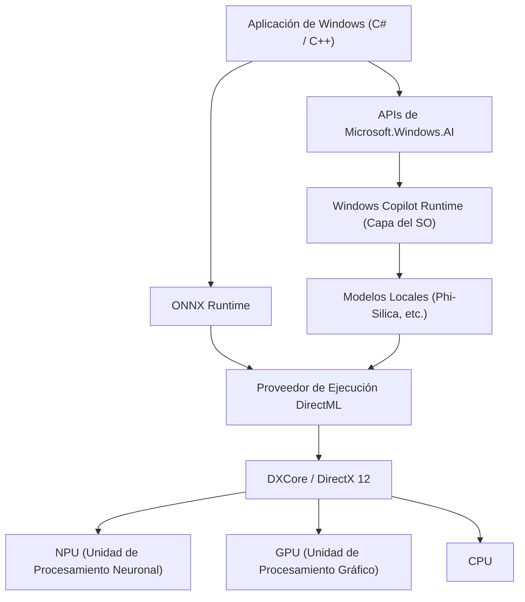
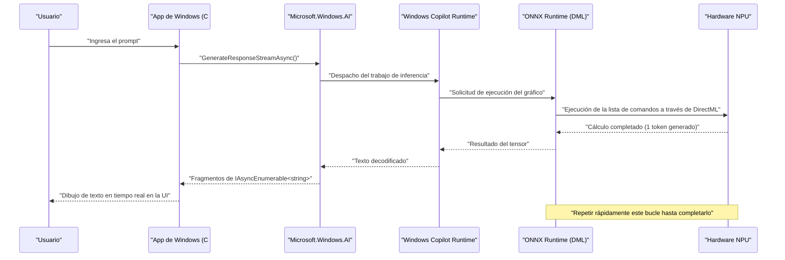

# Casos de uso y código de ejemplo de la API más reciente de Microsoft.Windows.AI: Explorando las profundidades de Windows Copilot Runtime

## 1. Introducción: La nueva era de Windows con IA integrada de forma nativa

En los últimos años, la evolución de la tecnología de IA ha sido notable, y se ha producido un rápido cambio de paradigma desde la utilización de grandes modelos de lenguaje (LLM) en la nube hasta la inferencia de IA en dispositivos de borde (PC locales). El núcleo de esto es "Windows Copilot Runtime" proporcionado por Microsoft para Windows 11 y la API "Microsoft.Windows.AI" para operarlo.

El desarrollo de aplicaciones utilizando APIs en la nube (como OpenAI y Azure OpenAI) es fácil, pero conlleva desafíos como la latencia, la privacidad y los costos continuos. Por otro lado, al ejecutar modelos de IA localmente, puede lograr aplicaciones de latencia ultrabaja que funcionan incluso sin conexión, sin que los datos confidenciales salgan del dispositivo.

En este artículo, explicaremos exhaustiva y detalladamente cómo implementar funciones de IA local, que serán esenciales en el desarrollo futuro de aplicaciones de Windows, utilizando ejemplos de código práctico en C# y C++, desde la arquitectura hasta el ajuste de rendimiento. No se trata solo de llamar a la API, sino de profundizar en los detalles técnicos avanzados, como la utilización del hardware subyacente (NPU y GPU) y la integración con DirectML.

## 2. Descripción general de la arquitectura y Windows Copilot Runtime

Windows Copilot Runtime es una serie de pilas de IA diseñadas para permitir a los desarrolladores integrar fácilmente modelos de IA en Windows y obtener el mejor rendimiento. Este tiempo de ejecución abstrae la aceleración de hardware a nivel del sistema operativo y proporciona una interfaz unificada a los desarrolladores.



Como muestra el diagrama de arquitectura anterior, las aplicaciones pueden acceder directamente a los modelos de lenguaje pequeños (SLM: Phi-Silica, etc.) integrados en el sistema operativo mediante el uso de la API de alto nivel `Microsoft.Windows.AI`. Además, cuando se utilizan modelos personalizados, es posible utilizar explícitamente la aceleración de hardware a través de ONNX Runtime y DirectML. Debido a que la capa del sistema operativo optimiza la distribución de las cargas de trabajo a la CPU, GPU y NPU, los desarrolladores pueden crear aplicaciones de IA de alto rendimiento sin tener que preocuparse profundamente por las diferencias de hardware.

## 3. Aceleración de hardware y evaluación matemática de la NPU

Los PC Copilot+ más recientes están equipados con una NPU (Unidad de Procesamiento Neuronal), un procesador especializado en el procesamiento de IA. El rendimiento de una NPU generalmente se evalúa en TOPS (Tera Operations Per Second).

En la inferencia de modelos de IA, especialmente la capacidad computacional de la multiplicación de matrices (GEMM: General Matrix Multiply) determina el rendimiento. El rendimiento máximo teórico del hardware $P_{\text{peak}}$ se aproxima mediante la siguiente fórmula.

$$
P_{\text{peak}} = f \times N_{\text{cores}} \times N_{\text{MACs/core}} \times 2
$$

Donde,
- $f$ es la frecuencia de reloj de la NPU (Hz)
- $N_{\text{cores}}$ es el número de núcleos en la NPU
- $N_{\text{MACs/core}}$ es el número de unidades MAC (Multiplicación-Acumulación) por núcleo
- El último $2$ se debe a que una sola operación MAC cuenta como dos operaciones (FLOPs/OPs) de multiplicación y suma.

Por ejemplo, para una NPU con una frecuencia de 1.5 GHz, 4 núcleos y cada núcleo con 4096 MACs,
$$
P_{\text{peak}} = 1.5 \times 10^9 \times 4 \times 4096 \times 2 \approx 49.15 \text{ TOPS}
$$
Queda demostrado matemáticamente que este rendimiento supera los 40 TOPS, que es el requisito para un PC Copilot+ con Windows 11.

Además, la inferencia de los modelos de IA, especialmente de los LLM (fase de decodificación), tiende a estar **limitada por la memoria (Memory-Bound)**. El ancho de banda teórico de la memoria del sistema $BW$ se calcula de la siguiente manera.

$$
BW = f_{\text{mem}} \times W_{\text{bus}} \times \frac{2}{8}
$$

En el caso de una memoria LPDDR5x-8533 ($f_{\text{mem}} = 8533 \text{ MT/s}$) y un bus de 128 bits ($W_{\text{bus}} = 128$), el ancho de banda es de aproximadamente $136 \text{ GB/s}$. En la optimización de aplicaciones de IA, es importante cómo ahorrar este ancho de banda, por lo que la cuantización (Quantization) del modelo, que se describe más adelante, es indispensable.

## 4. Configuración del entorno de desarrollo

Para utilizar la API de IA de Windows más reciente, debe preparar el siguiente entorno y cadena de herramientas.

1. **SO**: Windows 11 versión 24H2 o posterior (se recomienda encarecidamente un dispositivo equipado con NPU que cumpla con los requisitos del PC Copilot+)
2. **SDK**: Windows App SDK (versión v1.5 o posterior compatible con la extensión de IA)
3. **Entorno de desarrollo**: Visual Studio 2022 (v17.10 o posterior), con cargas de trabajo de desarrollo de escritorio con C++ y desarrollo de escritorio de .NET
4. **Paquetes**: Instale `Microsoft.Windows.AI` y `Microsoft.ML.OnnxRuntime.DirectML` a través de NuGet

```xml
<!-- Ejemplo de configuración de .csproj -->
<ItemGroup>
  <PackageReference Include="Microsoft.Windows.AI" Version="1.0.0-preview1" />
  <PackageReference Include="Microsoft.WindowsAppSDK" Version="1.5.240311000" />
  <PackageReference Include="Microsoft.ML.OnnxRuntime.DirectML" Version="1.17.1" />
</ItemGroup>
```

## 5. 【Deep Dive 1】Utilización de modelos de lenguaje locales (Phi-Silica) con C#

Windows Copilot Runtime incluye "Phi-Silica", un modelo de lenguaje pequeño y altamente eficiente desarrollado por Microsoft, como un componente estándar del sistema operativo. Esto permite el procesamiento avanzado del lenguaje natural (resumen de texto, generación de código, chatbots) en un entorno sin conexión, sin tener que descargar modelos del tamaño de gigabytes de la red.

A continuación, se muestra un código de ejemplo avanzado en C# para construir una IA de chat utilizando el espacio de nombres `Microsoft.Windows.AI.Generative`. Admite respuestas en streaming y genera texto en tiempo real sin bloquear el hilo de la interfaz de usuario (UI).

```csharp
using System;
using System.Text;
using System.Threading;
using System.Threading.Tasks;
using Microsoft.Windows.AI.Generative;

namespace WindowsAI.Sample
{
    public class LocalLanguageModelService
    {
        private LanguageModel _languageModel;
        private bool _isInitialized = false;

        /// <summary>
        /// Inicializa el modelo de lenguaje. Verifica la disponibilidad de la NPU y carga el modelo en el dispositivo óptimo.
        /// </summary>
        public async Task InitializeAsync()
        {
            if (_isInitialized) return;

            Console.WriteLine("Comprobando los requisitos del sistema y la disponibilidad del modelo de IA local (Phi-Silica)...");
            
            // Comprueba si el modelo está disponible en el sistema (si no es compatible, puede solicitar la descarga)
            var availability = await LanguageModel.CheckAvailabilityAsync();
            if (availability != LanguageModelAvailability.Available)
            {
                throw new InvalidOperationException($"El modelo de IA local no está disponible actualmente. Estado: {availability}");
            }

            // Crea una instancia del modelo (en este momento se realiza la asignación al espacio de memoria y la inicialización de la NPU)
            _languageModel = await LanguageModel.CreateAsync();
            _isInitialized = true;
            
            Console.WriteLine("Inicialización del modelo de lenguaje completada. La aceleración de hardware a través de DirectML está activa.");
        }

        /// <summary>
        /// Recibe el prompt del usuario y genera una respuesta en streaming.
        /// </summary>
        public async Task GenerateResponseStreamAsync(string prompt, CancellationToken cancellationToken)
        {
            if (!_isInitialized) await InitializeAsync();

            Console.WriteLine($"\n[Entrada del usuario]: {prompt}\n[Asistente de IA]: ");

            // Establece los hiperparámetros para la generación
            var options = new LanguageModelOptions
            {
                Temperature = 0.7f,
                TopP = 0.9f,
                MaxTokens = 2048,
                RepetitionPenalty = 1.1f
            };

            // Construye el contexto de la conversación
            var context = new LanguageModelContext();
            context.AddSystemMessage("Eres un asistente de IA avanzado que se ejecuta directamente en la NPU local de Windows. Piensa lógica y paso a paso, y responde de forma concisa.");
            context.AddUserMessage(prompt);

            try
            {
                // Llamada a la API de inferencia en streaming
                var responseStream = _languageModel.GenerateResponseStreamAsync(context, options);

                // Itera de forma asíncrona los fragmentos devueltos como IAsyncEnumerable
                await foreach (var chunk in responseStream.WithCancellation(cancellationToken))
                {
                    // Imprime el token generado (fragmento) en la consola en tiempo real
                    // En el caso de una aplicación de UI, refleje esto en un TextBox o similar usando DispatcherQueue aquí
                    Console.Write(chunk.Text);
                }
                Console.WriteLine();
            }
            catch (OperationCanceledException)
            {
                Console.WriteLine("\n[La generación fue cancelada por el usuario o el sistema]");
            }
            catch (Exception ex)
            {
                Console.WriteLine($"\n[Se produjo un error fatal: {ex.Message}]");
            }
        }
    }
}
```

### 5.1 Explicación de la arquitectura en la implementación de C#
El núcleo de este código es la validación previa a la ejecución mediante `LanguageModel.CheckAvailabilityAsync()` y el streaming asíncrono mediante `GenerateResponseStreamAsync`. Cuando Copilot Runtime, que se ejecuta en segundo plano en el sistema operativo, recibe esta llamada a la API, inicia internamente ONNX Runtime y selecciona el Proveedor de Ejecución óptimo (DirectML + NPU en muchas de las PC más nuevas) según la configuración del sistema.

Los desarrolladores pueden integrar tuberías de inferencia de IA de última generación en sus aplicaciones con unas pocas líneas de código C#, sin tener que preocuparse en absoluto por la forma del tensor del modelo, la implementación del tokenizador o la gestión de la memoria de la caché KV.

## 6. 【Deep Dive 2】Inferencia rápida de modelos personalizados con C++ y DirectML

Para manejar dominios específicos que no pueden ser cubiertos solo por el modelo de lenguaje estándar del sistema operativo (por ejemplo, segmentación de imágenes propia, reconocimiento de voz, modelos personalizados de detección de objetos, etc.), los desarrolladores deben operar directamente ONNX Runtime y DirectML, que se encuentran en la capa inferior de `Microsoft.Windows.AI`.

Al usar C++, es posible optimizar la asignación de memoria al límite y extraer el rendimiento máximo de la NPU/GPU. A continuación se muestra la implementación principal de una tubería avanzada de inicialización e inferencia para ejecutar un modelo personalizado en formato ONNX (por ejemplo, YOLOv8) utilizando DirectML en C++.

```cpp
#include <iostream>
#include <vector>
#include <string>
#include <stdexcept>
#include <onnxruntime_cxx_api.h>
#include <dml_provider_factory.h>

class CustomVisionAIProcessor {
private:
    Ort::Env env;
    Ort::Session session{nullptr};
    Ort::AllocatorWithDefaultOptions allocator;
    
public:
    CustomVisionAIProcessor(const std::wstring& modelPath) 
        : env(ORT_LOGGING_LEVEL_WARNING, "VisionAIProcessor") {
        
        Ort::SessionOptions sessionOptions;
        // Optimización del número de hilos
        sessionOptions.SetIntraOpNumThreads(1);
        // Establece el nivel de optimización del gráfico al máximo
        sessionOptions.SetGraphOptimizationLevel(GraphOptimizationLevel::ORT_ENABLE_ALL);

        // 1. Añadir el Proveedor de Ejecución DirectML (DML EP)
        // device_id = 0 es el adaptador recomendado predeterminado del sistema (NPU o GPU de alto rendimiento)
        const OrtApi& ortApi = Ort::GetApi();
        OrtDmlApi* dmlApi = nullptr;
        OrtStatus* status = ortApi.GetExecutionProviderApi("DML", ORT_API_VERSION, reinterpret_cast<void**>(&dmlApi));
        
        if (status == nullptr && dmlApi != nullptr) {
            Ort::ThrowOnError(dmlApi->SessionOptionsAppendExecutionProvider_DML(sessionOptions, 0));
            std::cout << "[Info] Proveedor de Ejecución DirectML conectado exitosamente." << std::endl;
        } else {
            std::cerr << "[Warning] Error al obtener la API de DirectML. Ejecutando en modo fallback de CPU." << std::endl;
            if (status != nullptr) ortApi.ReleaseStatus(status);
        }

        // 2. Cargar el modelo y crear la sesión
        try {
            session = Ort::Session(env, modelPath.c_str(), sessionOptions);
            std::cout << "[Info] Modelo ONNX cargado exitosamente y gráfico de cálculo compilado." << std::endl;
        } catch (const Ort::Exception& e) {
            std::cerr << "[Error] Fallo en la carga del modelo: " << e.what() << std::endl;
            throw;
        }
    }

    void RunInference(const std::vector<float>& imageTensor, const std::vector<int64_t>& inputShape) {
        // 3. Crear el búfer del tensor de entrada
        Ort::MemoryInfo memoryInfo = Ort::MemoryInfo::CreateCpu(OrtArenaAllocator, OrtMemTypeDefault);
        Ort::Value inputTensor = Ort::Value::CreateTensor<float>(
            memoryInfo, 
            const_cast<float*>(imageTensor.data()), 
            imageTensor.size(), 
            inputShape.data(), 
            inputShape.size()
        );

        // 4. Obtención dinámica de los nombres de los nodos de entrada y salida
        auto inputNamePtr = session.GetInputNameAllocated(0, allocator);
        auto outputNamePtr = session.GetOutputNameAllocated(0, allocator);
        const char* inputNames[] = { inputNamePtr.get() };
        const char* outputNames[] = { outputNamePtr.get() };

        // 5. Ejecución de la inferencia (se descarga a la NPU/GPU a través de DirectML)
        std::cout << "[Info] Iniciando la ejecución del motor de inferencia..." << std::endl;
        auto startTime = std::chrono::high_resolution_clock::now();

        auto outputTensors = session.Run(Ort::RunOptions{nullptr}, inputNames, &inputTensor, 1, outputNames, 1);

        auto endTime = std::chrono::high_resolution_clock::now();
        auto duration = std::chrono::duration_cast<std::chrono::milliseconds>(endTime - startTime);

        // 6. Obtener y analizar el tensor de resultados
        float* outputData = outputTensors.front().GetTensorMutableData<float>();
        size_t outputSize = outputTensors.front().GetTensorTypeAndShapeInfo().GetElementCount();
        
        std::cout << "[Result] Inferencia completada: " << duration.count() << " ms" << std::endl;
        std::cout << "[Result] Número de elementos en el tensor de salida: " << outputSize << std::endl;
        // *Después de esto, implemente el procesamiento para dibujar bounding boxes o NMS (Non-Maximum Suppression) para el tensor de salida
    }
};

int main() {
    try {
        // Ruta del modelo ONNX a ejecutar
        CustomVisionAIProcessor processor(L"models/yolov8n_quantized.onnx");
        
        // Datos de imagen de prueba para la inferencia (tamaño de lote 1 x 3 canales x 640 x 640)
        std::vector<int64_t> inputShape = {1, 3, 640, 640};
        std::vector<float> dummyImage(1 * 3 * 640 * 640, 0.5f);
        
        processor.RunInference(dummyImage, inputShape);
    } catch (const std::exception& e) {
        std::cerr << "El programa terminó de forma anormal: " << e.what() << std::endl;
        return -1;
    }
    return 0;
}
```

### 6.1 La importancia de la gestión de la memoria y la inferencia sin copia (Zero-Copy) en C++
La mayor ventaja de usar DirectML con C++ es que permite una estrecha integración con DirectX 12 (DX12). El código anterior incluye la copia de datos desde la memoria de la CPU estándar desde un punto de vista educativo, pero en los motores de juegos reales y las aplicaciones de procesamiento de video, hay muchos casos donde las imágenes (texturas) ya se mantienen en el espacio de memoria de la GPU o la NPU usando DX12.

En este caso, al utilizar la función de vinculación avanzada de `OrtDmlApi`, puede realizar "**Inferencia Sin Copia (Zero-Copy Inference)**", que mapea directamente los recursos de DX12 como tensores de ONNX Runtime. Como resultado, la sobrecarga de transferencia de datos entre el bus PCIe (el consumo del ancho de banda $BW$ descrito anteriormente) desaparece por completo, y la velocidad de fotogramas en el procesamiento de video en tiempo real mejora drásticamente.

## 7. Optimización del rendimiento y mejores prácticas

A continuación se resumen las estrategias de optimización esenciales al desarrollar aplicaciones de IA de primer nivel utilizando la API de IA de Windows y DirectML.

### 7.1 Cuantización de modelos (Quantization) y Olive Toolkit
Para liberar el verdadero poder de la NPU, es un requisito absoluto **cuantizar (Quantization)** los pesos y las activaciones del modelo de IA de FP32 (punto flotante de precisión simple) a INT8 o INT4. La arquitectura de la NPU está especializada en operaciones de enteros y, en comparación con FP32, INT8 logra teóricamente 4 veces el rendimiento y un ahorro de energía significativo.

Al utilizar la cadena de herramientas `Olive (ONNX Live)` proporcionada por Microsoft, los modelos como PyTorch se pueden optimizar automáticamente para entornos Windows. Olive brinda un fuerte soporte para la optimización de atención especial para modelos Transformer y la compilación de gráficos por hardware.

### 7.2 La compensación entre el procesamiento por lotes y el streaming interactivo
En las llamadas a la API, al agrupar múltiples solicitudes de inferencia (procesamiento por lotes), se puede aumentar la eficiencia de utilización (Compute Utilization) de la NPU. Sin embargo, en el caso de las interfaces de usuario interactivas, como los chatbots, el tiempo hasta que se muestra el primer token (TTFT: Time To First Token) determina la experiencia del usuario (UX) más que el rendimiento (throughput).
Por lo tanto, en la interfaz de usuario interactiva, la mejor práctica es establecer el tamaño del lote (batch size) en 1 y priorizar el diseño de generación en streaming.

### 7.3 Tareas en segundo plano y coordinación con el SO
La inferencia de IA consume una gran cantidad de energía local y recursos del sistema. Se requiere coordinar con la `App Lifecycle API` de Windows e implementar un mecanismo para suspender (Suspend) las tareas de inferencia de baja prioridad o reducir el consumo de recursos cuando la aplicación pasa a segundo plano.



Este diagrama de secuencia ilustra la belleza del procesamiento asíncrono, donde los datos se transmiten de manera fluida desde el hardware de la NPU en la capa más baja hasta la capa de presentación de la aplicación, sin bloquear en absoluto el hilo de la interfaz de usuario.

## 8. Perspectivas futuras y la evolución de Windows AI

La API `Microsoft.Windows.AI` y Copilot Runtime están experimentando una rápida evolución en curso. Se esperan los siguientes cambios de paradigma en futuras actualizaciones para desarrolladores:

- **Integración nativa del SO para API multimodales**: Procesamiento simultáneo y sin problemas no solo de texto, sino también de audio, imágenes e incluso transmisiones de video en vivo, ofreciendo inferencia de IA intermodal de forma estándar a nivel de SO.
- **Soporte a nivel de sistema para RAG (Retrieval-Augmented Generation)**: Vinculación de documentos personales en la PC local y el índice de Windows Search con el modelo de IA dentro de un entorno seguro del SO (sandbox), permitiendo la construcción de un asistente de IA personal súper avanzado con protección total de la privacidad del usuario.
- **Escalado dinámico de recursos de la NPU**: Cuando múltiples aplicaciones de IA operan simultáneamente (por ejemplo, cancelación de ruido en segundo plano y generación de código en primer plano), el programador del kernel de Windows cambiará dinámicamente el contexto de ejecución de la NPU para garantizar la QoS (Calidad de Servicio).

## 9. Conclusión: El futuro de las aplicaciones transformadas por la IA local

Copilot Runtime de Windows 11 y la API `Microsoft.Windows.AI` han aportado un arma extremadamente poderosa llamada "IA local" a todos los desarrolladores de Windows. Ya no es necesario depender completamente de las API en la nube. Es posible eliminar la latencia, proteger firmemente la privacidad y ofrecer a los usuarios una experiencia de IA de próxima generación que funcione completamente incluso sin conexión.

Aprovechando el conocimiento explicado en este artículo sobre la integración de modelos de lenguaje estándar del sistema utilizando C#, la evaluación matemática del rendimiento y la optimización extrema del hardware utilizando C++ y DirectML, cree usted mismo las aplicaciones de Windows "nativas de IA" de próxima generación. Las infinitas posibilidades que brinda la IA se extienden justo más allá del código que escriba.

---
*※ Nota: Este artículo ha sido escrito sobre la base de las versiones preliminares de la API y las especificaciones más recientes a partir de septiembre de 2026. Debido a las actualizaciones de Windows, las especificaciones de la API y los requisitos de hardware pueden cambiar, por lo que al momento de la implementación asegúrese de consultar también la documentación oficial de Microsoft Learn.*
