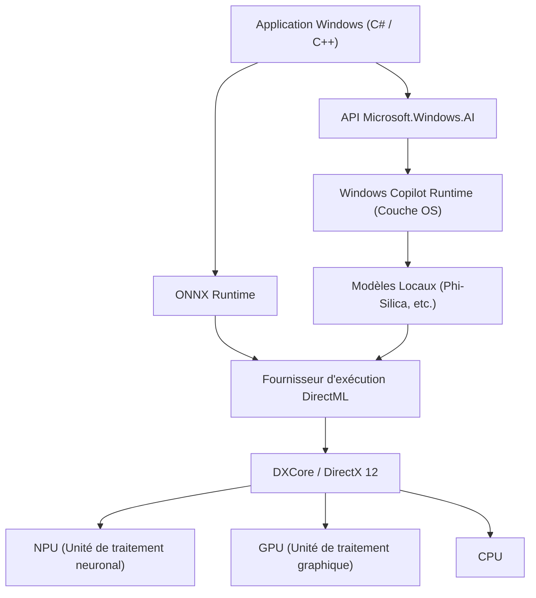
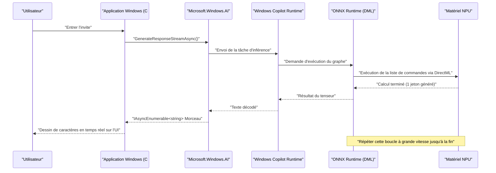

# Exemples d'utilisation des dernières API Microsoft.Windows.AI et code source : Explorer les profondeurs de Windows Copilot Runtime

## 1. Introduction : Une nouvelle ère où l'IA est intégrée nativement à Windows

Ces dernières années, l'évolution de la technologie de l'IA a été remarquable, avec un changement de paradigme rapide de l'utilisation de grands modèles de langage (LLM) dans le cloud vers l'inférence de l'IA sur des appareils en périphérie (PC locaux). Au cœur de cette évolution se trouvent le « Windows Copilot Runtime » fourni par Microsoft pour Windows 11, ainsi que l'API « Microsoft.Windows.AI » pour le manipuler.

Bien que le développement d'applications utilisant des API cloud (telles qu'OpenAI ou Azure OpenAI) soit facile, il s'accompagne de défis liés à la latence, à la confidentialité et aux coûts continus. D'autre part, en exécutant des modèles d'IA localement, vous pouvez créer des applications à latence ultra-faible qui fonctionnent même hors ligne, sans avoir à extraire de données confidentielles de l'appareil.

Dans cet article, nous fournirons une explication extrêmement détaillée de l'architecture jusqu'à l'optimisation des performances, en utilisant des exemples de code pratiques en C# et C++ concernant la méthode d'implémentation des fonctionnalités d'IA locale, qui deviendra indispensable dans le développement futur d'applications Windows. Nous irons bien au-delà de la simple invocation d'API pour plonger dans les détails techniques avancés, tels que l'utilisation du matériel sous-jacent (NPU et GPU) et l'intégration avec DirectML.

## 2. Windows Copilot Runtime et vue d'ensemble de l'architecture

Windows Copilot Runtime est une suite d'IA conçue pour permettre aux développeurs d'intégrer facilement des modèles d'IA sous Windows tout en tirant parti des meilleures performances. Ce runtime abstrait l'accélération matérielle au niveau du système d'exploitation (OS) et fournit une interface unifiée aux développeurs.



Comme le montre le diagramme d'architecture ci-dessus, les applications peuvent accéder directement aux petits modèles de langage (SLM : Phi-Silica, etc.) intégrés au système d'exploitation en utilisant l'API de haut niveau `Microsoft.Windows.AI`. De plus, lors de l'utilisation de modèles personnalisés, il est possible d'utiliser explicitement l'accélération matérielle via ONNX Runtime et DirectML. Étant donné que la couche OS optimise la distribution de la charge de travail vers le CPU, le GPU et le NPU, les développeurs peuvent créer des applications d'IA hautement performantes sans avoir à se soucier profondément des différences matérielles.

## 3. Accélération matérielle et évaluation mathématique du NPU

Les PC Copilot+ les plus récents sont équipés d'un NPU (Neural Processing Unit), un processeur spécialisé dans le traitement de l'IA. Les performances du NPU sont généralement évaluées en TOPS (Tera Operations Per Second).

Lors de l'inférence du modèle d'IA, la capacité de calcul, en particulier la multiplication de matrices (GEMM : General Matrix Multiply), détermine le débit. Les performances maximales théoriques du matériel $P_{\text{peak}}$ sont estimées par la formule mathématique suivante.

$$
P_{\text{peak}} = f \times N_{\text{cores}} \times N_{\text{MACs/core}} \times 2
$$

Où,
- $f$ est la fréquence d'horloge du NPU (Hz)
- $N_{\text{cores}}$ est le nombre de cœurs dans le NPU
- $N_{\text{MACs/core}}$ est le nombre d'unités MAC (Multiply-Accumulate) par cœur
- Le dernier $2$ est dû au fait qu'une opération MAC est comptée comme deux opérations (FLOPs/OPs) de multiplication et d'addition.

Par exemple, dans le cas d'un NPU avec une fréquence de 1,5 GHz, 4 cœurs et 4096 MACs par cœur,
$$
P_{\text{peak}} = 1.5 \times 10^9 \times 4 \times 4096 \times 2 \approx 49.15 \text{ TOPS}
$$
Il est mathématiquement démontré que ces performances dépassent les 40 TOPS requis pour un PC Copilot+ sous Windows 11.

De plus, l'inférence des modèles d'IA, en particulier des LLM (phase de décodage), a tendance à être **limitée par la mémoire (Memory-Bound)**. La bande passante théorique de la mémoire système $BW$ est calculée comme suit.

$$
BW = f_{\text{mem}} \times W_{\text{bus}} \times \frac{2}{8}
$$

Dans le cas d'une mémoire LPDDR5x-8533 ($f_{\text{mem}} = 8533 \text{ MT/s}$) et d'un bus de 128 bits ($W_{\text{bus}} = 128$), la bande passante est d'environ $136 \text{ GB/s}$. Dans l'optimisation des applications d'IA, il est crucial d'économiser cette bande passante, ce qui rend la quantification du modèle (Quantization), décrite plus loin, indispensable.

## 4. Configuration de l'environnement de développement

Pour utiliser les dernières API Windows AI, vous devez configurer l'environnement et la chaîne d'outils suivants.

1. **OS** : Windows 11 version 24H2 ou ultérieure (Appareil équipé d'un NPU répondant aux exigences des PC Copilot+ fortement recommandé)
2. **SDK** : Windows App SDK (version compatible avec l'extension AI v1.5 ou ultérieure)
3. **Environnement de développement** : Visual Studio 2022 (v17.10 ou ultérieure), charge de travail de développement natif en C++ et charge de travail de développement de bureau .NET
4. **Packages** : Installez `Microsoft.Windows.AI` et `Microsoft.ML.OnnxRuntime.DirectML` via NuGet

```xml
<!-- Exemple de configuration pour .csproj -->
<ItemGroup>
  <PackageReference Include="Microsoft.Windows.AI" Version="1.0.0-preview1" />
  <PackageReference Include="Microsoft.WindowsAppSDK" Version="1.5.240311000" />
  <PackageReference Include="Microsoft.ML.OnnxRuntime.DirectML" Version="1.17.1" />
</ItemGroup>
```

## 5. [Plongée en profondeur 1] Utilisation d'un modèle de langage local (Phi-Silica) avec C#

Windows Copilot Runtime intègre en tant que composant standard du système d'exploitation « Phi-Silica », un petit modèle de langage très efficace développé par Microsoft. Cela permet un traitement du langage naturel avancé (résumé de texte, génération de code, chatbot) dans un environnement hors ligne, sans avoir à télécharger des gigaoctets de modèles depuis le réseau.

Voici un exemple de code avancé pour créer une IA de chat en C# en utilisant l'espace de noms `Microsoft.Windows.AI.Generative`. Il prend en charge les réponses en streaming et génère du texte en temps réel sans bloquer le thread de l'interface utilisateur.

```csharp
using System;
using System.Text;
using System.Threading;
using System.Threading.Tasks;
using Microsoft.Windows.AI.Generative;

namespace WindowsAI.Sample
{
    public class LocalLanguageModelService
    {
        private LanguageModel _languageModel;
        private bool _isInitialized = false;

        /// <summary>
        /// Initialise le modèle de langage. Vérifie la disponibilité du NPU et charge le modèle sur le périphérique optimal.
        /// </summary>
        public async Task InitializeAsync()
        {
            if (_isInitialized) return;

            Console.WriteLine("Vérification de la configuration requise et de la disponibilité du modèle d'IA local (Phi-Silica)...");
            
            // Vérifie si le modèle est disponible sur le système (s'il n'est pas pris en charge, un téléchargement peut être invité)
            var availability = await LanguageModel.CheckAvailabilityAsync();
            if (availability != LanguageModelAvailability.Available)
            {
                throw new InvalidOperationException($"Le modèle d'IA local n'est actuellement pas disponible. État : {availability}");
            }

            // Crée une instance du modèle (à ce stade, le mappage dans l'espace mémoire et l'initialisation du NPU ont lieu)
            _languageModel = await LanguageModel.CreateAsync();
            _isInitialized = true;
            
            Console.WriteLine("L'initialisation du modèle de langage est terminée. L'accélération matérielle via DirectML est active.");
        }

        /// <summary>
        /// Reçoit l'invite de l'utilisateur et génère une réponse en streaming.
        /// </summary>
        public async Task GenerateResponseStreamAsync(string prompt, CancellationToken cancellationToken)
        {
            if (!_isInitialized) await InitializeAsync();

            Console.WriteLine($"\n[Entrée utilisateur] : {prompt}\n[Assistant IA] : ");

            // Définit les hyperparamètres lors de la génération
            var options = new LanguageModelOptions
            {
                Temperature = 0.7f,
                TopP = 0.9f,
                MaxTokens = 2048,
                RepetitionPenalty = 1.1f
            };

            // Construction du contexte de conversation
            var context = new LanguageModelContext();
            context.AddSystemMessage("Vous êtes un assistant IA avancé fonctionnant directement sur le NPU local de Windows. Pensez logiquement étape par étape et répondez de manière concise.");
            context.AddUserMessage(prompt);

            try
            {
                // Appel de l'API d'inférence en streaming
                var responseStream = _languageModel.GenerateResponseStreamAsync(context, options);

                // Itération asynchrone sur les morceaux (chunks) retournés sous forme de IAsyncEnumerable
                await foreach (var chunk in responseStream.WithCancellation(cancellationToken))
                {
                    // Affiche les jetons générés (morceaux) sur la console en temps réel
                    // Pour les applications d'interface utilisateur, utilisez DispatcherQueue ici pour refléter dans TextBox, etc.
                    Console.Write(chunk.Text);
                }
                Console.WriteLine();
            }
            catch (OperationCanceledException)
            {
                Console.WriteLine("\n[La génération a été annulée par l'utilisateur ou le système]");
            }
            catch (Exception ex)
            {
                Console.WriteLine($"\n[Une erreur fatale s'est produite : {ex.Message}]");
            }
        }
    }
}
```

### 5.1 Explication de l'architecture dans l'implémentation C#
Le cœur de ce code réside dans la validation avant exécution par `LanguageModel.CheckAvailabilityAsync()` et le streaming asynchrone par `GenerateResponseStreamAsync()`. Copilot Runtime, fonctionnant en arrière-plan du système d'exploitation, reçoit cet appel d'API, lance en interne ONNX Runtime et sélectionne le fournisseur d'exécution optimal (DirectML + NPU dans de nombreux PC récents) en fonction de la configuration du système.

Les développeurs peuvent intégrer un pipeline d'inférence d'IA de pointe dans leurs applications avec seulement quelques lignes de code C#, sans avoir à se soucier de la forme du tenseur du modèle, de l'implémentation du tokenizer ou de la gestion de la mémoire du cache KV.

## 6. [Plongée en profondeur 2] Inférence ultra-rapide de modèles personnalisés avec C++ et DirectML

Lors de la gestion de domaines spécifiques qui ne peuvent pas être couverts par le modèle de langage standard du système d'exploitation (tels que la segmentation d'images personnalisée, la reconnaissance vocale, les modèles de détection d'objets personnalisés, etc.), les développeurs doivent interagir directement avec ONNX Runtime et DirectML, situés dans la couche inférieure de `Microsoft.Windows.AI`.

L'utilisation de C++ permet d'optimiser à l'extrême l'allocation de la mémoire et de libérer les performances maximales du NPU/GPU. Voici une implémentation de base d'un pipeline d'initialisation et d'inférence avancé pour exécuter un modèle personnalisé au format ONNX (par exemple, YOLOv8) en C++ à l'aide de DirectML.

```cpp
#include <iostream>
#include <vector>
#include <string>
#include <stdexcept>
#include <onnxruntime_cxx_api.h>
#include <dml_provider_factory.h>

class CustomVisionAIProcessor {
private:
    Ort::Env env;
    Ort::Session session{nullptr};
    Ort::AllocatorWithDefaultOptions allocator;
    
public:
    CustomVisionAIProcessor(const std::wstring& modelPath) 
        : env(ORT_LOGGING_LEVEL_WARNING, "VisionAIProcessor") {
        
        Ort::SessionOptions sessionOptions;
        // Optimisation du nombre de threads
        sessionOptions.SetIntraOpNumThreads(1);
        // Définit le niveau d'optimisation du graphe au maximum
        sessionOptions.SetGraphOptimizationLevel(GraphOptimizationLevel::ORT_ENABLE_ALL);

        // 1. Ajout du fournisseur d'exécution DirectML (DML EP)
        // device_id = 0 est l'adaptateur par défaut recommandé par le système (NPU ou GPU hautes performances)
        const OrtApi& ortApi = Ort::GetApi();
        OrtDmlApi* dmlApi = nullptr;
        OrtStatus* status = ortApi.GetExecutionProviderApi("DML", ORT_API_VERSION, reinterpret_cast<void**>(&dmlApi));
        
        if (status == nullptr && dmlApi != nullptr) {
            Ort::ThrowOnError(dmlApi->SessionOptionsAppendExecutionProvider_DML(sessionOptions, 0));
            std::cout << "[Info] Le fournisseur d'exécution DirectML a été attaché avec succès." << std::endl;
        } else {
            std::cerr << "[Warning] Échec de l'obtention de l'API DirectML. Exécution en mode de secours CPU." << std::endl;
            if (status != nullptr) ortApi.ReleaseStatus(status);
        }

        // 2. Chargement du modèle et création de la session
        try {
            session = Ort::Session(env, modelPath.c_str(), sessionOptions);
            std::cout << "[Info] Le modèle ONNX a été chargé avec succès et le graphe de calcul a été compilé." << std::endl;
        } catch (const Ort::Exception& e) {
            std::cerr << "[Error] Échec du chargement du modèle : " << e.what() << std::endl;
            throw;
        }
    }

    void RunInference(const std::vector<float>& imageTensor, const std::vector<int64_t>& inputShape) {
        // 3. Création du tampon du tenseur d'entrée
        Ort::MemoryInfo memoryInfo = Ort::MemoryInfo::CreateCpu(OrtArenaAllocator, OrtMemTypeDefault);
        Ort::Value inputTensor = Ort::Value::CreateTensor<float>(
            memoryInfo, 
            const_cast<float*>(imageTensor.data()), 
            imageTensor.size(), 
            inputShape.data(), 
            inputShape.size()
        );

        // 4. Obtention dynamique des noms de nœuds d'entrée et de sortie
        auto inputNamePtr = session.GetInputNameAllocated(0, allocator);
        auto outputNamePtr = session.GetOutputNameAllocated(0, allocator);
        const char* inputNames[] = { inputNamePtr.get() };
        const char* outputNames[] = { outputNamePtr.get() };

        // 5. Exécution de l'inférence (Déchargée vers le NPU/GPU via DirectML)
        std::cout << "[Info] Démarrage de l'exécution du moteur d'inférence..." << std::endl;
        auto startTime = std::chrono::high_resolution_clock::now();

        auto outputTensors = session.Run(Ort::RunOptions{nullptr}, inputNames, &inputTensor, 1, outputNames, 1);

        auto endTime = std::chrono::high_resolution_clock::now();
        auto duration = std::chrono::duration_cast<std::chrono::milliseconds>(endTime - startTime);

        // 6. Obtention et analyse du tenseur de résultat
        float* outputData = outputTensors.front().GetTensorMutableData<float>();
        size_t outputSize = outputTensors.front().GetTensorTypeAndShapeInfo().GetElementCount();
        
        std::cout << "[Result] Inférence terminée : " << duration.count() << " ms" << std::endl;
        std::cout << "[Result] Nombre d'éléments du tenseur de sortie : " << outputSize << std::endl;
        // * Après cela, implémentez le processus de NMS (Non-Maximum Suppression) et le dessin de la boîte de délimitation pour le tenseur de sortie
    }
};

int main() {
    try {
        // Chemin du modèle ONNX à exécuter
        CustomVisionAIProcessor processor(L"models/yolov8n_quantized.onnx");
        
        // Données d'image factices pour l'inférence (taille de lot 1 x 3 canaux x 640 x 640)
        std::vector<int64_t> inputShape = {1, 3, 640, 640};
        std::vector<float> dummyImage(1 * 3 * 640 * 640, 0.5f);
        
        processor.RunInference(dummyImage, inputShape);
    } catch (const std::exception& e) {
        std::cerr << "Le programme s'est terminé de manière anormale : " << e.what() << std::endl;
        return -1;
    }
    return 0;
}
```

### 6.1 L'importance de la gestion de la mémoire et de l'inférence "zéro copie" en C++
Le principal avantage de l'utilisation de DirectML avec C++ est la possibilité d'une intégration étroite avec DirectX 12 (DX12). Bien que le code ci-dessus inclue une copie de données standard à partir de la mémoire du processeur à des fins éducatives, dans les moteurs de jeux réels et les applications de traitement vidéo, il existe de nombreux cas où les images (textures) sont déjà conservées dans l'espace mémoire du GPU ou du NPU à l'aide de DX12.

Dans ce cas, en utilisant la fonction de liaison (binding) avancée de `OrtDmlApi`, vous pouvez réaliser une « **Inférence Zéro Copie (Zero-Copy Inference)** », où les ressources DX12 sont mappées directement en tant que tenseurs ONNX Runtime. En conséquence, la surcharge de transfert de données sur le bus PCIe (la consommation de la bande passante $BW$ mentionnée ci-dessus) disparaît complètement, et la fréquence d'images dans le traitement vidéo en temps réel s'améliore de manière spectaculaire.

## 7. Optimisation des performances et bonnes pratiques

Les stratégies d'optimisation indispensables lors du développement d'applications d'IA de premier ordre utilisant l'API Windows AI et DirectML sont résumées ci-dessous.

### 7.1 Quantification de modèle (Quantization) et boîte à outils Olive
Pour libérer la véritable puissance du NPU, il est absolument indispensable de **quantifier (Quantization)** les poids et les activations du modèle d'IA de FP32 (virgule flottante simple précision) à INT8 ou INT4. L'architecture du NPU est spécialisée pour l'arithmétique entière, et comparée au FP32, l'INT8 permet théoriquement un débit 4 fois supérieur et des économies d'énergie significatives.

En utilisant la chaîne d'outils `Olive (ONNX Live)` fournie par Microsoft, les modèles tels que PyTorch peuvent être automatiquement optimisés pour les environnements Windows. Olive prend fortement en charge l'optimisation spéciale de l'attention pour les modèles Transformer et la compilation de graphes par matériel.

### 7.2 Traitement par lots vs Compromis du streaming interactif
Dans les appels d'API, en traitant par lots plusieurs requêtes d'inférence, vous pouvez augmenter l'efficacité d'utilisation du NPU (Compute Utilization). Cependant, dans le cas d'une interface utilisateur interactive comme un chatbot, le temps d'affichage du premier jeton (TTFT : Time To First Token) détermine l'expérience utilisateur (UX) plutôt que le débit.
Par conséquent, pour les interfaces utilisateur interactives, la meilleure pratique consiste à définir la taille du lot sur 1 et à concevoir une génération en streaming en priorité.

### 7.3 Tâches en arrière-plan et intégration du système d'exploitation
L'inférence de l'IA consomme une quantité massive d'énergie locale et de ressources système. Il est nécessaire de s'intégrer à l' `App Lifecycle API` de Windows pour implémenter une suspension temporaire (Suspend) des tâches d'inférence de faible priorité ou pour réduire la consommation de ressources lorsque l'application passe en arrière-plan.



Ce diagramme de séquence illustre la beauté du traitement asynchrone où les données circulent de la couche matérielle NPU la plus basse vers la couche de présentation de l'application, diffusées en continu sans bloquer le thread de l'interface utilisateur.

## 8. Perspectives d'avenir et évolution de Windows AI

L'API `Microsoft.Windows.AI` et Copilot Runtime évoluent rapidement en ce moment. Les mises à jour futures pour les développeurs devraient apporter les changements de paradigme suivants :

- **Intégration OS native des API multimodales** : Traitement simultané fluide non seulement du texte, mais aussi de la voix, des images et même des flux vidéo en direct, offrant une inférence d'IA intermodale en standard au niveau du système d'exploitation.
- **Prise en charge au niveau du système du RAG (Retrieval-Augmented Generation)** : Création d'assistants IA personnels ultra-avancés qui protègent entièrement la vie privée de l'utilisateur en reliant les documents personnels sur le PC local et l'index Windows Search aux modèles d'IA dans le bac à sable sécurisé du système d'exploitation.
- **Mise à l'échelle dynamique des ressources du NPU** : Lorsque plusieurs applications d'IA (par exemple, la suppression du bruit en arrière-plan et la génération de code au premier plan) fonctionnent en même temps, le planificateur du noyau (kernel scheduler) Windows bascule dynamiquement le contexte d'exécution du NPU, un mécanisme qui garantit la qualité de service (QoS).

## 9. Conclusion : L'avenir des applications transformé par l'IA locale

Windows Copilot Runtime et l'API `Microsoft.Windows.AI` de Windows 11 ont apporté une arme extrêmement puissante appelée « IA locale » à tous les développeurs Windows. Il n'est plus nécessaire de s'en remettre entièrement aux API du cloud. Il est possible d'offrir aux utilisateurs des expériences d'IA de nouvelle génération qui éliminent la latence, maintiennent fermement la confidentialité et fonctionnent parfaitement même hors ligne.

Utilisez les connaissances expliquées dans cet article concernant l'intégration du modèle de langage standard du système à l'aide de C#, l'évaluation mathématique des performances et l'optimisation matérielle extrême à l'aide de C++ et de DirectML pour créer vos propres applications Windows « IA natives » de nouvelle génération. Les possibilités infinies offertes par l'IA s'étendent juste au-delà du code que vous écrivez.

---
*Remarque : Cet article est basé sur l'API en version préliminaire et les dernières spécifications en date de septembre 2026. Les spécifications de l'API et les exigences matérielles étant susceptibles d'être modifiées avec les mises à jour de Windows, assurez-vous de toujours consulter la documentation officielle de Microsoft Learn lors de la mise en œuvre.*
