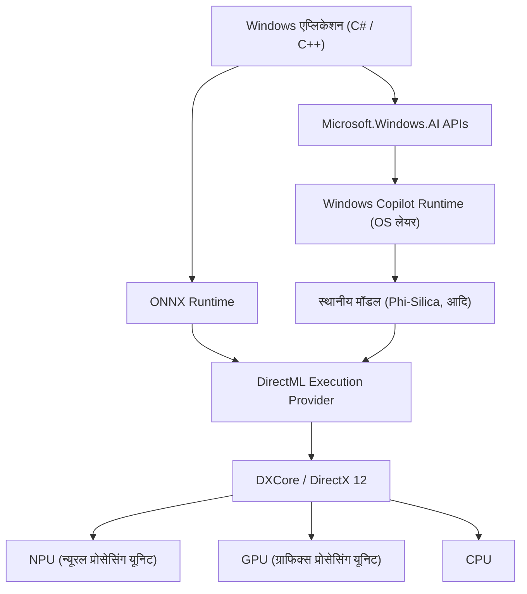
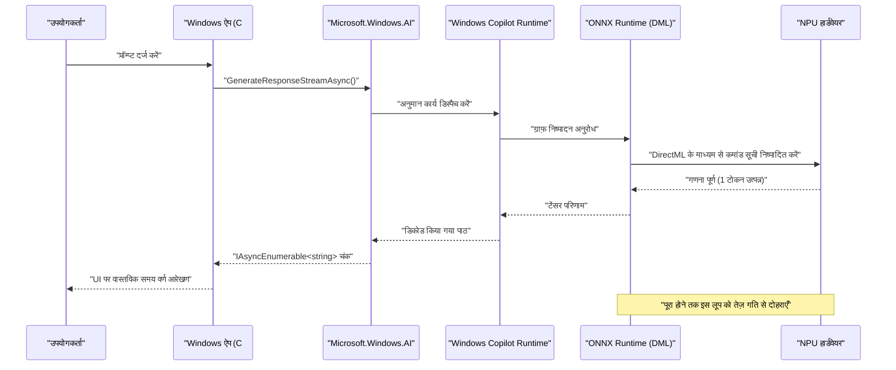

# Microsoft.Windows.AI के नवीनतम API उपयोग के उदाहरण और नमूना कोड: Windows Copilot Runtime की गहराई की खोज

## 1. परिचय: एक नए Windows युग की शुरुआत जहाँ AI मूल रूप से एकीकृत है

हाल ही के वर्षों में, AI तकनीक का विकास उल्लेखनीय रहा है, और क्लाउड पर बड़े भाषा मॉडल (LLM) के उपयोग से एज डिवाइस (स्थानीय पीसी) पर AI अनुमान (inference) की ओर तेज़ी से प्रतिमान बदलाव (paradigm shift) हो रहा है। इसके मूल में "Windows Copilot Runtime" है, जो Microsoft द्वारा Windows 11 के लिए प्रदान किया गया है, और इसे संचालित करने के लिए "Microsoft.Windows.AI" API है।

क्लाउड API (जैसे OpenAI या Azure OpenAI) का उपयोग करके एप्लिकेशन विकसित करना आसान है, लेकिन विलंबता (latency), गोपनीयता और निरंतर लागत जैसी चुनौतियाँ हमेशा बनी रहती हैं। दूसरी ओर, स्थानीय रूप से AI मॉडल चलाकर, आप बिना डिवाइस के बाहर गोपनीय डेटा भेजे, ऑफ़लाइन काम करने वाले अल्ट्रा-लो लेटेंसी एप्लिकेशन बना सकते हैं।

इस लेख में, हम C# और C++ के व्यावहारिक नमूना कोड के साथ आर्किटेक्चर से लेकर प्रदर्शन ट्यूनिंग तक, भविष्य के Windows एप्लिकेशन विकास के लिए आवश्यक स्थानीय AI सुविधाओं को लागू करने के तरीके के बारे में विस्तार से बताएंगे। हम केवल API को कॉल करने के अलावा, अंतर्निहित हार्डवेयर (NPU और GPU) के उपयोग और DirectML के साथ एकीकरण जैसे उन्नत तकनीकी विवरणों में गहराई से जाएंगे।

## 2. Windows Copilot Runtime और आर्किटेक्चर का समग्र दृश्य

Windows Copilot Runtime AI स्टैक का एक सेट है जिसे डेवलपर्स के लिए Windows पर AI मॉडल को आसानी से एकीकृत और अधिकतम प्रदर्शन निकालने के लिए डिज़ाइन किया गया है। यह रनटाइम OS स्तर पर हार्डवेयर त्वरण (hardware acceleration) को अमूर्त करता है और डेवलपर्स को एक एकीकृत इंटरफ़ेस प्रदान करता है।



जैसा कि ऊपर दिया गया आर्किटेक्चर आरेख दिखाता है, एप्लिकेशन उच्च-स्तरीय `Microsoft.Windows.AI` API का उपयोग करके OS में निर्मित छोटे भाषा मॉडल (SLM: जैसे Phi-Silica) तक सीधे पहुंच सकते हैं। कस्टम मॉडल का उपयोग करते समय, ONNX Runtime और DirectML के माध्यम से स्पष्ट रूप से हार्डवेयर त्वरण का उपयोग करना भी संभव है। चूँकि OS लेयर CPU, GPU और NPU में वर्कलोड के वितरण को अनुकूलित करती है, इसलिए डेवलपर्स हार्डवेयर के अंतर के बारे में गहराई से चिंता किए बिना उच्च-प्रदर्शन वाले AI ऐप्स बना सकते हैं।

## 3. हार्डवेयर त्वरण और NPU का गणितीय मूल्यांकन

नवीनतम Copilot+ PC में NPU (न्यूरल प्रोसेसिंग यूनिट) होता है, जो AI प्रोसेसिंग के लिए विशेष प्रोसेसर है। NPU के प्रदर्शन का मूल्यांकन आमतौर पर TOPS (Tera Operations Per Second) में किया जाता है।

AI मॉडल के अनुमान में, विशेष रूप से मैट्रिक्स गुणन (GEMM: General Matrix Multiply) की गणना क्षमता थ्रूपुट निर्धारित करती है। हार्डवेयर के सैद्धांतिक अधिकतम प्रदर्शन $P_{\text{peak}}$ का अनुमान निम्नलिखित सूत्र द्वारा लगाया जाता है:

$$
P_{\text{peak}} = f \times N_{\text{cores}} \times N_{\text{MACs/core}} \times 2
$$

यहाँ,
- $f$ NPU की क्लॉक फ्रीक्वेंसी (Hz) है
- $N_{\text{cores}}$ NPU में कोर की संख्या है
- $N_{\text{MACs/core}}$ प्रति कोर MAC (Multiply-Accumulate) यूनिट्स की संख्या है
- अंतिम $2$ इसलिए है क्योंकि एक MAC ऑपरेशन को दो ऑपरेशन (गुणा और जोड़) (FLOPs/OPs) के रूप में गिना जाता है।

उदाहरण के लिए, 1.5GHz फ्रीक्वेंसी, 4 कोर और प्रत्येक कोर में 4096 MACs वाले NPU के लिए:
$$
P_{\text{peak}} = 1.5 \times 10^9 \times 4 \times 4096 \times 2 \approx 49.15 \text{ TOPS}
$$
यह गणितीय रूप से प्रदर्शित करता है कि प्रदर्शन Windows 11 Copilot+ PC की 40 TOPS की आवश्यकता को पार कर जाता है।

साथ ही, AI मॉडल, विशेष रूप से LLM का अनुमान (डिकोड चरण), **मेमोरी-बाउंड (Memory-Bound)** होने की प्रवृत्ति रखता है। सिस्टम मेमोरी की सैद्धांतिक बैंडविड्थ $BW$ की गणना इस प्रकार की जाती है:

$$
BW = f_{\text{mem}} \times W_{\text{bus}} \times \frac{2}{8}
$$

LPDDR5x-8533 मेमोरी ($f_{\text{mem}} = 8533 \text{ MT/s}$) और 128-बिट बस ($W_{\text{bus}} = 128$) के मामले में, बैंडविड्थ लगभग $136 \text{ GB/s}$ है। AI एप्लिकेशन को अनुकूलित करते समय, यह महत्वपूर्ण है कि इस बैंडविड्थ को कैसे बचाया जाए, और बाद में वर्णित मॉडल क्वांटिज़ेशन (Quantization) आवश्यक हो जाता है।

## 4. विकास पर्यावरण सेटअप

नवीनतम Windows AI API का उपयोग करने के लिए, आपको निम्नलिखित पर्यावरण और टूलचेन सेट अप करने होंगे:

1. **OS**: Windows 11 संस्करण 24H2 या उच्चतर (Copilot+ PC आवश्यकताओं को पूरा करने वाले NPU-सज्जित उपकरणों की दृढ़ता से अनुशंसा की जाती है)
2. **SDK**: Windows App SDK (v1.5 या उच्चतर AI एक्सटेंशन सपोर्ट के साथ)
3. **विकास वातावरण**: Visual Studio 2022 (v17.10 या उच्चतर), C++ का उपयोग करके नेटिव डेवलपमेंट वर्कलोड और .NET डेस्कटॉप डेवलपमेंट वर्कलोड
4. **पैकेज**: NuGet के माध्यम से `Microsoft.Windows.AI` और `Microsoft.ML.OnnxRuntime.DirectML` स्थापित करें

```xml
<!-- .csproj कॉन्फ़िगरेशन का उदाहरण -->
<ItemGroup>
  <PackageReference Include="Microsoft.Windows.AI" Version="1.0.0-preview1" />
  <PackageReference Include="Microsoft.WindowsAppSDK" Version="1.5.240311000" />
  <PackageReference Include="Microsoft.ML.OnnxRuntime.DirectML" Version="1.17.1" />
</ItemGroup>
```

## 5. 【Deep Dive 1】 C# का उपयोग करके स्थानीय भाषा मॉडल (Phi-Silica) का उपयोग करना

Windows Copilot Runtime में Microsoft द्वारा विकसित एक अत्यधिक कुशल छोटा भाषा मॉडल "Phi-Silica" OS के मानक घटक के रूप में शामिल है। यह नेटवर्क से गीगाबाइट-आकार के मॉडल डाउनलोड किए बिना ऑफ़लाइन वातावरण में उन्नत प्राकृतिक भाषा प्रसंस्करण (पाठ सारांश, कोड जनरेशन, चैटबॉट) को सक्षम बनाता है।

नीचे `Microsoft.Windows.AI.Generative` नेमस्पेस का उपयोग करके C# में चैट AI बनाने के लिए एक उन्नत नमूना कोड दिया गया है। यह स्ट्रीमिंग प्रतिक्रियाओं का समर्थन करता है और UI थ्रेड को ब्लॉक किए बिना वास्तविक समय में टेक्स्ट उत्पन्न करता है।

```csharp
using System;
using System.Text;
using System.Threading;
using System.Threading.Tasks;
using Microsoft.Windows.AI.Generative;

namespace WindowsAI.Sample
{
    public class LocalLanguageModelService
    {
        private LanguageModel _languageModel;
        private bool _isInitialized = false;

        /// <summary>
        /// भाषा मॉडल को इनिशियलाइज़ करता है। NPU की उपलब्धता की जाँच करता है और मॉडल को इष्टतम डिवाइस पर लोड करता है।
        /// </summary>
        public async Task InitializeAsync()
        {
            if (_isInitialized) return;

            Console.WriteLine("स्थानीय AI मॉडल (Phi-Silica) के लिए सिस्टम आवश्यकताओं और उपलब्धता की जाँच की जा रही है...");
            
            // जाँच करें कि क्या मॉडल सिस्टम पर उपलब्ध है (यदि समर्थित नहीं है, तो डाउनलोड के लिए प्रेरित किया जा सकता है)
            var availability = await LanguageModel.CheckAvailabilityAsync();
            if (availability != LanguageModelAvailability.Available)
            {
                throw new InvalidOperationException($"स्थानीय AI मॉडल वर्तमान में उपलब्ध नहीं है। स्थिति: {availability}");
            }

            // मॉडल का एक उदाहरण बनाएँ (इस समय, मेमोरी स्पेस में मैपिंग और NPU इनिशियलाइज़ेशन किया जाता है)
            _languageModel = await LanguageModel.CreateAsync();
            _isInitialized = true;
            
            Console.WriteLine("भाषा मॉडल इनिशियलाइज़ेशन पूरा हुआ। DirectML के माध्यम से हार्डवेयर त्वरण सक्रिय है।");
        }

        /// <summary>
        /// उपयोगकर्ता का प्रॉम्प्ट प्राप्त करता है और स्ट्रीमिंग के रूप में प्रतिक्रिया उत्पन्न करता है।
        /// </summary>
        public async Task GenerateResponseStreamAsync(string prompt, CancellationToken cancellationToken)
        {
            if (!_isInitialized) await InitializeAsync();

            Console.WriteLine($"\n[उपयोगकर्ता इनपुट]: {prompt}\n[AI असिस्टेंट]: ");

            // जनरेशन के लिए हाइपरपैरामीटर सेट करें
            var options = new LanguageModelOptions
            {
                Temperature = 0.7f,
                TopP = 0.9f,
                MaxTokens = 2048,
                RepetitionPenalty = 1.1f
            };

            // वार्तालाप संदर्भ बनाएँ
            var context = new LanguageModelContext();
            context.AddSystemMessage("आप Windows के स्थानीय NPU पर सीधे चलने वाले एक उन्नत AI असिस्टेंट हैं। चरण दर चरण तार्किक रूप से सोचें और संक्षेप में उत्तर दें।");
            context.AddUserMessage(prompt);

            try
            {
                // स्ट्रीमिंग अनुमान API को कॉल करें
                var responseStream = _languageModel.GenerateResponseStreamAsync(context, options);

                // IAsyncEnumerable के रूप में लौटाए गए चंक्स को असिंक्रोनस रूप से पुनरावृत्त (iterate) करें
                await foreach (var chunk in responseStream.WithCancellation(cancellationToken))
                {
                    // उत्पन्न टोकन (चंक) को वास्तविक समय में कंसोल पर आउटपुट करें
                    // UI एप्लिकेशन के मामले में, इसे TextBox आदि में प्रतिबिंबित करने के लिए यहाँ DispatcherQueue का उपयोग करें
                    Console.Write(chunk.Text);
                }
                Console.WriteLine();
            }
            catch (OperationCanceledException)
            {
                Console.WriteLine("\n[उपयोगकर्ता या सिस्टम द्वारा जनरेशन रद्द कर दिया गया]");
            }
            catch (Exception ex)
            {
                Console.WriteLine($"\n[एक गंभीर त्रुटि हुई: {ex.Message}]");
            }
        }
    }
}
```

### 5.1 C# कार्यान्वयन में आर्किटेक्चर की व्याख्या
इस कोड का मूल `LanguageModel.CheckAvailabilityAsync()` के साथ निष्पादन-पूर्व सत्यापन (pre-execution validation) और `GenerateResponseStreamAsync` का उपयोग करके एसिंक्रोनस स्ट्रीमिंग है। जब OS के बैकग्राउंड में चलने वाला Copilot Runtime इस API कॉल को प्राप्त करता है, तो यह आंतरिक रूप से ONNX Runtime शुरू करता है और सिस्टम कॉन्फ़िगरेशन के आधार पर इष्टतम निष्पादन प्रदाता (Execution Provider) (कई आधुनिक PC में DirectML + NPU) का चयन करता है।

डेवलपर्स मॉडल के टेंसर आकार, टोकनाइज़र कार्यान्वयन, या KV कैश के मेमोरी प्रबंधन की चिंता किए बिना केवल C# कोड की कुछ पंक्तियों के साथ अपने एप्लिकेशनों में अत्याधुनिक AI अनुमान पाइपलाइनों को एकीकृत कर सकते हैं।

## 6. 【Deep Dive 2】 C++ और DirectML का उपयोग करके कस्टम मॉडल का उच्च गति अनुमान

जब उन विशिष्ट डोमेन से निपटा जाता है जिन्हें केवल OS के मानक भाषा मॉडल (जैसे कस्टम छवि विभाजन, वाक् पहचान, कस्टम ऑब्जेक्ट डिटेक्शन मॉडल आदि) द्वारा कवर नहीं किया जा सकता है, तो डेवलपर्स को सीधे ONNX Runtime और DirectML में हेरफेर करने की आवश्यकता होती है, जो `Microsoft.Windows.AI` की निचली परतों में स्थित हैं।

C++ का उपयोग करके, आप मेमोरी आवंटन को अत्यधिक अनुकूलित कर सकते हैं और NPU/GPU के चरम प्रदर्शन को प्राप्त कर सकते हैं। नीचे DirectML का उपयोग करके C++ में ONNX प्रारूप कस्टम मॉडल (जैसे YOLOv8) चलाने के लिए एक उन्नत इनिशियलाइज़ेशन और अनुमान पाइपलाइन का मुख्य कार्यान्वयन दिया गया है।

```cpp
#include <iostream>
#include <vector>
#include <string>
#include <stdexcept>
#include <onnxruntime_cxx_api.h>
#include <dml_provider_factory.h>

class CustomVisionAIProcessor {
private:
    Ort::Env env;
    Ort::Session session{nullptr};
    Ort::AllocatorWithDefaultOptions allocator;
    
public:
    CustomVisionAIProcessor(const std::wstring& modelPath) 
        : env(ORT_LOGGING_LEVEL_WARNING, "VisionAIProcessor") {
        
        Ort::SessionOptions sessionOptions;
        // थ्रेड की संख्या का अनुकूलन
        sessionOptions.SetIntraOpNumThreads(1);
        // ग्राफ़ अनुकूलन स्तर को अधिकतम पर सेट करें
        sessionOptions.SetGraphOptimizationLevel(GraphOptimizationLevel::ORT_ENABLE_ALL);

        // 1. DirectML Execution Provider (DML EP) जोड़ें
        // device_id = 0 सिस्टम का डिफ़ॉल्ट अनुशंसित एडेप्टर है (NPU या उच्च प्रदर्शन वाला GPU)
        const OrtApi& ortApi = Ort::GetApi();
        OrtDmlApi* dmlApi = nullptr;
        OrtStatus* status = ortApi.GetExecutionProviderApi("DML", ORT_API_VERSION, reinterpret_cast<void**>(&dmlApi));
        
        if (status == nullptr && dmlApi != nullptr) {
            Ort::ThrowOnError(dmlApi->SessionOptionsAppendExecutionProvider_DML(sessionOptions, 0));
            std::cout << "[Info] DirectML Execution Provider को सफलतापूर्वक संलग्न किया गया।" << std::endl;
        } else {
            std::cerr << "[Warning] DirectML API प्राप्त करने में विफल। CPU फॉलबैक मोड में चल रहा है।" << std::endl;
            if (status != nullptr) ortApi.ReleaseStatus(status);
        }

        // 2. मॉडल लोड करें और सत्र बनाएँ
        try {
            session = Ort::Session(env, modelPath.c_str(), sessionOptions);
            std::cout << "[Info] ONNX मॉडल को सफलतापूर्वक लोड किया गया और गणना ग्राफ़ संकलित किया गया।" << std::endl;
        } catch (const Ort::Exception& e) {
            std::cerr << "[Error] मॉडल लोड विफल: " << e.what() << std::endl;
            throw;
        }
    }

    void RunInference(const std::vector<float>& imageTensor, const std::vector<int64_t>& inputShape) {
        // 3. इनपुट टेंसर के लिए बफर बनाएँ
        Ort::MemoryInfo memoryInfo = Ort::MemoryInfo::CreateCpu(OrtArenaAllocator, OrtMemTypeDefault);
        Ort::Value inputTensor = Ort::Value::CreateTensor<float>(
            memoryInfo, 
            const_cast<float*>(imageTensor.data()), 
            imageTensor.size(), 
            inputShape.data(), 
            inputShape.size()
        );

        // 4. इनपुट और आउटपुट नोड के नाम गतिशील रूप से प्राप्त करें
        auto inputNamePtr = session.GetInputNameAllocated(0, allocator);
        auto outputNamePtr = session.GetOutputNameAllocated(0, allocator);
        const char* inputNames[] = { inputNamePtr.get() };
        const char* outputNames[] = { outputNamePtr.get() };

        // 5. अनुमान निष्पादित करें (DirectML के माध्यम से NPU/GPU पर ऑफलोड किया गया)
        std::cout << "[Info] अनुमान इंजन का निष्पादन शुरू हो रहा है..." << std::endl;
        auto startTime = std::chrono::high_resolution_clock::now();

        auto outputTensors = session.Run(Ort::RunOptions{nullptr}, inputNames, &inputTensor, 1, outputNames, 1);

        auto endTime = std::chrono::high_resolution_clock::now();
        auto duration = std::chrono::duration_cast<std::chrono::milliseconds>(endTime - startTime);

        // 6. परिणाम टेंसर प्राप्त करें और पार्स करें
        float* outputData = outputTensors.front().GetTensorMutableData<float>();
        size_t outputSize = outputTensors.front().GetTensorTypeAndShapeInfo().GetElementCount();
        
        std::cout << "[Result] अनुमान पूर्ण: " << duration.count() << " ms" << std::endl;
        std::cout << "[Result] आउटपुट टेंसर के तत्वों की संख्या: " << outputSize << std::endl;
        // * इसके बाद, आउटपुट टेंसर पर NMS (Non-Maximum Suppression) और बाउंडिंग बॉक्स ड्राइंग प्रोसेसिंग लागू करें
    }
};

int main() {
    try {
        // निष्पादित किए जाने वाले ONNX मॉडल का पथ
        CustomVisionAIProcessor processor(L"models/yolov8n_quantized.onnx");
        
        // अनुमान के लिए डमी छवि डेटा (बैच आकार 1 x 3 चैनल x 640 x 640)
        std::vector<int64_t> inputShape = {1, 3, 640, 640};
        std::vector<float> dummyImage(1 * 3 * 640 * 640, 0.5f);
        
        processor.RunInference(dummyImage, inputShape);
    } catch (const std::exception& e) {
        std::cerr << "प्रोग्राम असामान्य रूप से समाप्त हुआ: " << e.what() << std::endl;
        return -1;
    }
    return 0;
}
```

### 6.1 C++ में मेमोरी प्रबंधन और शून्य-कॉपी अनुमान का महत्व
C++ के साथ DirectML का उपयोग करने का सबसे बड़ा लाभ DirectX 12 (DX12) के साथ घनिष्ठ एकीकरण की क्षमता है। उपरोक्त कोड में शैक्षिक दृष्टिकोण से मानक CPU मेमोरी से डेटा कॉपी करना शामिल है, लेकिन वास्तविक गेम इंजन और वीडियो प्रोसेसिंग एप्लिकेशन में, कई मामले ऐसे होते हैं जहाँ DX12 का उपयोग करके छवियों (टेक्सचर) को GPU या NPU के मेमोरी स्पेस में पहले ही रखा जाता है।

इस मामले में, आप `OrtDmlApi` के उन्नत बाइंडिंग सुविधाओं का उपयोग करके **"शून्य-कॉपी अनुमान (Zero-Copy Inference)"** प्राप्त कर सकते हैं, जो DX12 संसाधनों को सीधे ONNX Runtime टेंसर के रूप में मैप करता है। यह PCIe बस में डेटा ट्रांसफर ओवरहेड (ऊपर उल्लिखित बैंडविड्थ $BW$ की खपत) को पूरी तरह से समाप्त कर देता है, जिससे वास्तविक समय के वीडियो प्रोसेसिंग में फ्रेम दर में नाटकीय रूप से सुधार होता है।

## 7. प्रदर्शन अनुकूलन और सर्वोत्तम अभ्यास

Windows AI API और DirectML का उपयोग करके प्रथम श्रेणी के AI एप्लिकेशन विकसित करने के लिए कुछ आवश्यक अनुकूलन रणनीतियाँ नीचे दी गई हैं।

### 7.1 मॉडल क्वांटिज़ेशन (Quantization) और Olive टूलकिट
NPU की वास्तविक शक्ति को उजागर करने के लिए, यह एक पूर्ण आवश्यकता है कि AI मॉडल के वज़न और सक्रियण (activations) को FP32 (सिंगल प्रिसिजन फ्लोटिंग पॉइंट) से INT8 या INT4 में **क्वांटाइज़ (Quantize)** किया जाए। NPU का आर्किटेक्चर पूर्णांक अंकगणित (integer arithmetic) के लिए विशिष्ट है, और FP32 की तुलना में, INT8 सैद्धांतिक रूप से 4 गुना थ्रूपुट और महत्वपूर्ण बिजली बचत प्राप्त करता है।

Microsoft द्वारा प्रदान की गई `Olive (ONNX Live)` टूलचेन का उपयोग करके, आप Windows वातावरण के लिए PyTorch आदि जैसे मॉडल को स्वचालित रूप से अनुकूलित कर सकते हैं। Olive ट्रांसफार्मर मॉडल के लिए विशेष अटेंशन (attention) अनुकूलन और प्रति-हार्डवेयर ग्राफ़ संकलन का दृढ़ता से समर्थन करता है।

### 7.2 बैच प्रोसेसिंग बनाम इंटरैक्टिव स्ट्रीमिंग का ट्रेड-ऑफ़
API कॉल्स में, आप कई अनुमान अनुरोधों को एक साथ बैच करके NPU के उपयोग (Compute Utilization) को बढ़ा सकते हैं। हालाँकि, चैटबॉट जैसे इंटरैक्टिव UI के मामले में, थ्रूपुट के बजाय पहले टोकन के प्रदर्शित होने तक का समय (TTFT: Time To First Token) उपयोगकर्ता अनुभव (UX) निर्धारित करता है।
इसलिए, इंटरैक्टिव UI के लिए सर्वोत्तम अभ्यास बैच आकार को 1 पर सेट करना और स्ट्रीमिंग जनरेशन को प्राथमिकता देना है।

### 7.3 बैकग्राउंड कार्य और OS के साथ एकीकरण
AI अनुमान बहुत अधिक स्थानीय शक्ति और सिस्टम संसाधनों की खपत करता है। Windows के `App Lifecycle API` के साथ एकीकरण करके, आपको एप्लिकेशन के बैकग्राउंड में जाने पर कम प्राथमिकता वाले अनुमान कार्यों को निलंबित (Suspend) करने या संसाधन की खपत को कम करने वाली कार्यक्षमता लागू करने की आवश्यकता होती है।



यह अनुक्रम आरेख (sequence diagram) UI थ्रेड को बिल्कुल ब्लॉक किए बिना एसिंक्रोनस प्रोसेसिंग की सुंदरता को दर्शाता है, जहाँ डेटा निम्नतम स्तर के NPU हार्डवेयर से एप्लिकेशन की प्रेजेंटेशन लेयर तक स्ट्रीमिंग की तरह बहता है।

## 8. भविष्य की संभावनाएँ और Windows AI का विकास

`Microsoft.Windows.AI` API और Copilot Runtime वर्तमान में तेज़ गति से विकसित हो रहे हैं। भविष्य के डेवलपर अपडेट्स में निम्नलिखित प्रतिमान बदलावों (paradigm shifts) की उम्मीद है:

- **मल्टीमॉडल API का OS-नेटिव एकीकरण**: टेक्स्ट ही नहीं, बल्कि वॉयस, इमेज और यहाँ तक कि लाइव वीडियो फ़ीड को भी निर्बाध रूप से एक साथ प्रोसेस करना, जो OS स्तर पर क्रॉस-मॉडल AI अनुमान को मानक के रूप में प्रदान करेगा।
- **RAG (Retrieval-Augmented Generation) के लिए सिस्टम-स्तर का समर्थन**: स्थानीय PC के भीतर व्यक्तिगत दस्तावेज़ों और Windows Search इंडेक्स को OS के सुरक्षित सैंडबॉक्स में AI मॉडल से जोड़ना, जिससे उपयोगकर्ता की गोपनीयता को पूरी तरह से सुरक्षित रखते हुए एक अति-उन्नत व्यक्तिगत AI असिस्टेंट का निर्माण हो सके।
- **NPU का डायनेमिक रिसोर्स स्केलिंग**: जब कई AI एप्लिकेशन एक साथ चल रहे हों (उदाहरण के लिए, बैकग्राउंड में शोर रद्दीकरण (noise cancellation) और फोरग्राउंड में कोड जनरेशन), तो Windows कर्नेल शेड्यूलर QoS (Quality of Service) की गारंटी देने के लिए NPU के निष्पादन संदर्भ को गतिशील रूप से स्विच करने में सक्षम होगा।

## 9. निष्कर्ष: भविष्य के एप्लिकेशन जिन्हें स्थानीय AI बदल देगा

Windows 11 के Copilot Runtime और `Microsoft.Windows.AI` API सभी Windows डेवलपर्स के लिए "स्थानीय AI" का एक अत्यंत शक्तिशाली हथियार लेकर आए हैं। अब क्लाउड API पर पूरी तरह निर्भर रहने की कोई आवश्यकता नहीं है। विलंबता को समाप्त करते हुए और गोपनीयता बनाए रखते हुए उपयोगकर्ताओं को अगली पीढ़ी का AI अनुभव प्रदान करना संभव है जो पूरी तरह से ऑफ़लाइन भी काम करता है।

सिस्टम-मानक भाषा मॉडलों के एकीकरण का उपयोग करें जो इस लेख में C# का उपयोग करके समझाए गए हैं, गणितीय प्रदर्शन मूल्यांकन, और C++ और DirectML का उपयोग करके अत्यधिक हार्डवेयर अनुकूलन के ज्ञान का उपयोग करके अपने स्वयं के हाथों से अगली पीढ़ी के "AI-नेटिव" Windows एप्लिकेशन बनाएँ। AI द्वारा लाई गई अनंत संभावनाएँ उस कोड के ठीक आगे फैली हुई हैं जो आप लिखते हैं।

---
*※नोट: यह लेख सितंबर 2026 तक पूर्वावलोकन API और नवीनतम विशिष्टताओं (specifications) के आधार पर लिखा गया है। चूँकि Windows अपडेट के कारण API विशिष्टताएँ और हार्डवेयर आवश्यकताएँ बदल सकती हैं, इसलिए लागू करते समय कृपया हमेशा आधिकारिक Microsoft Learn दस्तावेज़ देखें।*
