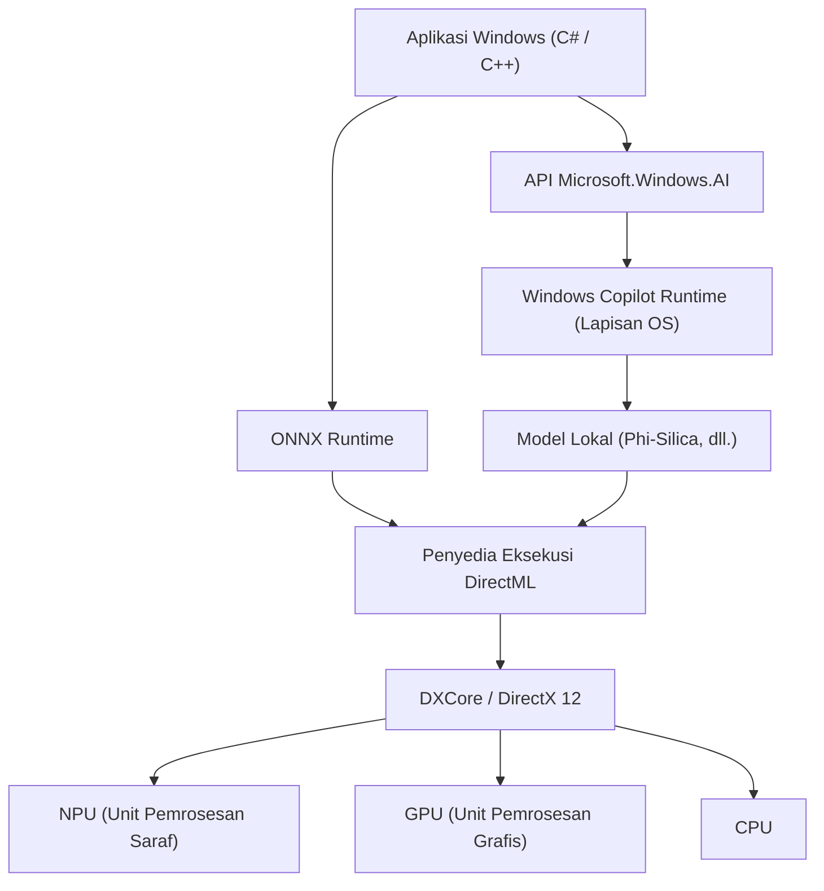
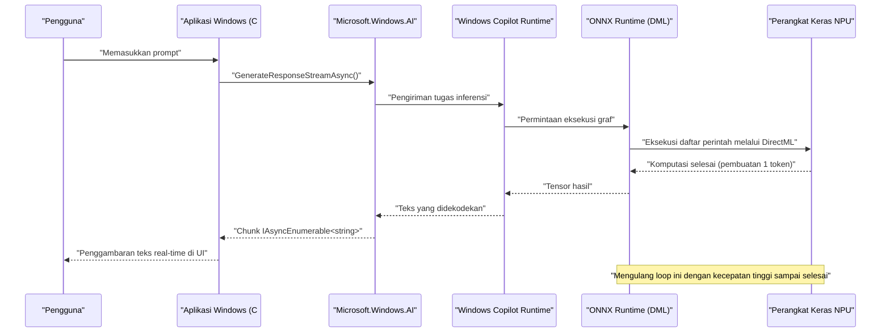

# Contoh Penggunaan API Terbaru dan Kode Sampel Microsoft.Windows.AI: Menyelami Kedalaman Windows Copilot Runtime

## 1. Pendahuluan: Era Baru Windows di Mana AI Terintegrasi Secara Asli

Dalam beberapa tahun terakhir, evolusi teknologi AI sangat luar biasa, dan telah terjadi pergeseran paradigma yang cepat dari pemanfaatan model bahasa besar (LLM) di cloud menuju inferensi AI pada perangkat *edge* (PC lokal). Inti dari hal ini adalah "Windows Copilot Runtime" yang disediakan oleh Microsoft untuk Windows 11, dan API "Microsoft.Windows.AI" untuk mengoperasikannya.

Pengembangan aplikasi menggunakan API cloud (seperti OpenAI atau Azure OpenAI) memang mudah, namun selalu diiringi dengan tantangan terkait latensi, privasi, dan biaya yang berkelanjutan. Di sisi lain, dengan menjalankan model AI secara lokal, Anda dapat mewujudkan aplikasi dengan latensi yang sangat rendah yang berfungsi bahkan saat offline, tanpa perlu mengirimkan data sensitif keluar dari perangkat.

Artikel ini memberikan panduan yang sangat mendetail mengenai metode implementasi fitur AI lokal, yang akan menjadi keharusan dalam pengembangan aplikasi Windows di masa depan, lengkap dengan contoh kode praktis dalam C# dan C++, mulai dari arsitektur hingga penyesuaian performa. Kami tidak hanya sekadar memanggil API, tetapi juga akan mendalami detail teknis tingkat lanjut seperti pemanfaatan perangkat keras di baliknya (NPU dan GPU), serta integrasinya dengan DirectML.

## 2. Gambaran Umum Arsitektur dan Windows Copilot Runtime

Windows Copilot Runtime adalah serangkaian tumpukan AI yang dirancang agar pengembang dapat dengan mudah mengintegrasikan model AI pada Windows, sekaligus mendapatkan performa terbaik. Runtime ini mengabstraksi akselerasi perangkat keras pada tingkat OS dan menyediakan antarmuka terpadu bagi para pengembang.



Seperti yang ditunjukkan pada diagram arsitektur di atas, aplikasi dapat mengakses secara langsung model bahasa berskala kecil (SLM: seperti Phi-Silica) yang tertanam dalam OS dengan menggunakan API `Microsoft.Windows.AI` tingkat tinggi. Selain itu, saat menggunakan model kustom, dimungkinkan juga untuk secara eksplisit memanfaatkan akselerasi perangkat keras melalui ONNX Runtime dan DirectML. Karena lapisan OS mengoptimalkan distribusi beban kerja ke CPU, GPU, dan NPU, pengembang dapat membangun aplikasi AI berkinerja tinggi tanpa perlu terlalu menyadari perbedaan perangkat keras.

## 3. Evaluasi Matematis Akselerasi Perangkat Keras dan NPU

PC Copilot+ terbaru dilengkapi dengan NPU (Neural Processing Unit), yaitu prosesor yang dikhususkan untuk pemrosesan AI. Performa NPU umumnya dievaluasi dalam TOPS (Tera Operations Per Second).

Dalam inferensi model AI, khususnya kemampuan komputasi Perkalian Matriks Umum (GEMM: General Matrix Multiply) sangat menentukan *throughput*. Performa puncak teoritis dari perangkat keras $P_{\text{peak}}$ diperkirakan dengan rumus berikut:

$$
P_{\text{peak}} = f \times N_{\text{cores}} \times N_{\text{MACs/core}} \times 2
$$

Di mana:
- $f$ adalah frekuensi *clock* NPU (Hz)
- $N_{\text{cores}}$ adalah jumlah *core* di dalam NPU
- $N_{\text{MACs/core}}$ adalah jumlah unit MAC (Multiply-Accumulate) per *core*
- Angka $2$ di bagian akhir dikarenakan satu operasi MAC dihitung sebagai dua operasi (FLOPs/OPs) yaitu perkalian dan penjumlahan.

Sebagai contoh, untuk NPU dengan frekuensi 1.5GHz, 4 *core*, dan masing-masing *core* memiliki 4096 MACs,
$$
P_{\text{peak}} = 1.5 \times 10^9 \times 4 \times 4096 \times 2 \approx 49.15 \text{ TOPS}
$$

Secara matematis telah ditunjukkan bahwa performa ini memenuhi persyaratan PC Copilot+ Windows 11 yaitu 40 TOPS.

Selain itu, inferensi model AI, terutama untuk LLM (fase dekode), cenderung mengalami **keterbatasan memori (Memory-Bound)**. *Bandwidth* teoritis memori sistem $BW$ dihitung sebagai berikut:

$$
BW = f_{\text{mem}} \times W_{\text{bus}} \times \frac{2}{8}
$$

Untuk memori LPDDR5x-8533 ($f_{\text{mem}} = 8533 \text{ MT/s}$) dan bus 128-bit ($W_{\text{bus}} = 128$), *bandwidth*-nya adalah sekitar $136 \text{ GB/s}$. Dalam pengoptimalan aplikasi AI, cara menghemat *bandwidth* ini sangatlah penting, sehingga Kuantisasi (*Quantization*) model yang akan dijelaskan nanti menjadi hal yang sangat krusial.

## 4. Pengaturan Lingkungan Pengembangan

Untuk menggunakan API Windows AI terbaru, Anda perlu menyiapkan lingkungan dan rantai alat (*toolchain*) berikut.

1. **OS**: Windows 11 versi 24H2 atau yang lebih baru (Sangat disarankan perangkat yang dilengkapi NPU dan memenuhi persyaratan PC Copilot+)
2. **SDK**: Windows App SDK (versi yang mendukung ekstensi AI, v1.5 atau yang lebih baru)
3. **Lingkungan Pengembangan**: Visual Studio 2022 (v17.10 atau yang lebih baru), dengan beban kerja pengembangan asli C++ dan pengembangan desktop .NET
4. **Paket**: Instal `Microsoft.Windows.AI` dan `Microsoft.ML.OnnxRuntime.DirectML` melalui NuGet

```xml
<!-- Contoh pengaturan .csproj -->
<ItemGroup>
  <PackageReference Include="Microsoft.Windows.AI" Version="1.0.0-preview1" />
  <PackageReference Include="Microsoft.WindowsAppSDK" Version="1.5.240311000" />
  <PackageReference Include="Microsoft.ML.OnnxRuntime.DirectML" Version="1.17.1" />
</ItemGroup>
```

## 5. [Deep Dive 1] Memanfaatkan Model Bahasa Lokal (Phi-Silica) Menggunakan C#

Windows Copilot Runtime mencakup "Phi-Silica", sebuah model bahasa skala kecil dengan efisiensi tinggi yang dikembangkan oleh Microsoft, sebagai komponen standar OS. Hal ini memungkinkan pemrosesan bahasa alami tingkat lanjut (peringkasan teks, pembuatan kode, chatbot) dalam lingkungan offline tanpa harus mengunduh model berukuran gigabyte dari jaringan.

Berikut ini adalah contoh kode tingkat lanjut untuk membangun AI obrolan menggunakan C# dengan memanfaatkan *namespace* `Microsoft.Windows.AI.Generative`. Kode ini mendukung respons *streaming* dan menghasilkan teks secara *real-time* tanpa memblokir utas (*thread*) UI.

```csharp
using System;
using System.Text;
using System.Threading;
using System.Threading.Tasks;
using Microsoft.Windows.AI.Generative;

namespace WindowsAI.Sample
{
    public class LocalLanguageModelService
    {
        private LanguageModel _languageModel;
        private bool _isInitialized = false;

        /// <summary>
        /// Melakukan inisialisasi model bahasa. Memeriksa ketersediaan NPU dan memuat model ke perangkat yang optimal.
        /// </summary>
        public async Task InitializeAsync()
        {
            if (_isInitialized) return;

            Console.WriteLine("Memeriksa persyaratan sistem dan ketersediaan model AI lokal (Phi-Silica)...");
            
            // Memeriksa apakah model tersedia di sistem (jika tidak didukung, unduhan mungkin akan diminta)
            var availability = await LanguageModel.CheckAvailabilityAsync();
            if (availability != LanguageModelAvailability.Available)
            {
                throw new InvalidOperationException($"Model AI lokal saat ini tidak tersedia. Status: {availability}");
            }

            // Membuat instans model (pada titik ini, pemetaan ke ruang memori dan inisialisasi NPU akan dilakukan)
            _languageModel = await LanguageModel.CreateAsync();
            _isInitialized = true;
            
            Console.WriteLine("Inisialisasi model bahasa telah selesai. Akselerasi perangkat keras melalui DirectML aktif.");
        }

        /// <summary>
        /// Menerima prompt pengguna dan menghasilkan respons secara streaming.
        /// </summary>
        public async Task GenerateResponseStreamAsync(string prompt, CancellationToken cancellationToken)
        {
            if (!_isInitialized) await InitializeAsync();

            Console.WriteLine($"\n[Input Pengguna]: {prompt}\n[Asisten AI]: ");

            // Mengatur hyperparameter saat inferensi
            var options = new LanguageModelOptions
            {
                Temperature = 0.7f,
                TopP = 0.9f,
                MaxTokens = 2048,
                RepetitionPenalty = 1.1f
            };

            // Membangun konteks percakapan
            var context = new LanguageModelContext();
            context.AddSystemMessage("Anda adalah asisten AI tingkat lanjut yang berjalan langsung di NPU lokal Windows. Berpikirlah secara logis selangkah demi selangkah, dan jawablah dengan singkat.");
            context.AddUserMessage(prompt);

            try
            {
                // Pemanggilan API inferensi streaming
                var responseStream = _languageModel.GenerateResponseStreamAsync(context, options);

                // Memproses potongan-potongan (chunk) yang dikembalikan sebagai IAsyncEnumerable secara asinkron
                await foreach (var chunk in responseStream.WithCancellation(cancellationToken))
                {
                    // Menampilkan token (chunk) yang dihasilkan ke konsol secara real-time
                    // Untuk aplikasi UI, gunakan DispatcherQueue di sini untuk menerapkannya ke TextBox, dll.
                    Console.Write(chunk.Text);
                }
                Console.WriteLine();
            }
            catch (OperationCanceledException)
            {
                Console.WriteLine("\n[Pembuatan dibatalkan oleh pengguna atau sistem]");
            }
            catch (Exception ex)
            {
                Console.WriteLine($"\n[Terjadi kesalahan fatal: {ex.Message}]");
            }
        }
    }
}
```

### 5.1 Penjelasan Arsitektur pada Implementasi C#
Inti dari kode ini adalah verifikasi prapelaksanaan oleh `LanguageModel.CheckAvailabilityAsync()` dan pembuatan *streaming* asinkron oleh `GenerateResponseStreamAsync`. Saat Copilot Runtime yang berjalan di latar belakang OS menerima panggilan API ini, ia secara internal meluncurkan ONNX Runtime dan memilih *Execution Provider* yang optimal (untuk banyak PC terbaru, DirectML + NPU) berdasarkan konfigurasi sistem.

Pengembang tidak perlu memikirkan bentuk tensor model, implementasi *tokenizer*, atau manajemen memori *KV cache* sama sekali, dan dapat mengintegrasikan alur inferensi AI mutakhir ke dalam aplikasi hanya dengan beberapa baris kode C#.

## 6. [Deep Dive 2] Inferensi Berkecepatan Tinggi dari Model Kustom Menggunakan C++ dan DirectML

Saat menangani domain tertentu (seperti segmentasi gambar eksklusif, pengenalan suara, model deteksi objek kustom, dll.) yang tidak dapat dicakup hanya oleh model bahasa standar OS, pengembang perlu berinteraksi langsung dengan ONNX Runtime dan DirectML yang berada di lapisan bawah `Microsoft.Windows.AI`.

Dengan menggunakan C++, manajemen memori dapat dioptimalkan secara ekstrem untuk mendapatkan performa puncak dari NPU/GPU. Berikut adalah implementasi inti dari inisialisasi tingkat lanjut dan alur inferensi untuk mengeksekusi model kustom format ONNX (misalnya: YOLOv8) dalam C++ menggunakan DirectML.

```cpp
#include <iostream>
#include <vector>
#include <string>
#include <stdexcept>
#include <onnxruntime_cxx_api.h>
#include <dml_provider_factory.h>

class CustomVisionAIProcessor {
private:
    Ort::Env env;
    Ort::Session session{nullptr};
    Ort::AllocatorWithDefaultOptions allocator;
    
public:
    CustomVisionAIProcessor(const std::wstring& modelPath) 
        : env(ORT_LOGGING_LEVEL_WARNING, "VisionAIProcessor") {
        
        Ort::SessionOptions sessionOptions;
        // Optimasi jumlah thread
        sessionOptions.SetIntraOpNumThreads(1);
        // Mengatur tingkat optimasi graf secara maksimum
        sessionOptions.SetGraphOptimizationLevel(GraphOptimizationLevel::ORT_ENABLE_ALL);

        // 1. Penambahan DirectML Execution Provider (DML EP)
        // device_id = 0 adalah adaptor yang disarankan default sistem (NPU atau GPU berkinerja tinggi)
        const OrtApi& ortApi = Ort::GetApi();
        OrtDmlApi* dmlApi = nullptr;
        OrtStatus* status = ortApi.GetExecutionProviderApi("DML", ORT_API_VERSION, reinterpret_cast<void**>(&dmlApi));
        
        if (status == nullptr && dmlApi != nullptr) {
            Ort::ThrowOnError(dmlApi->SessionOptionsAppendExecutionProvider_DML(sessionOptions, 0));
            std::cout << "[Info] DirectML Execution Provider berhasil dilampirkan." << std::endl;
        } else {
            std::cerr << "[Peringatan] Gagal mendapatkan DirectML API. Berjalan dalam mode fallback CPU." << std::endl;
            if (status != nullptr) ortApi.ReleaseStatus(status);
        }

        // 2. Memuat model dan membuat sesi
        try {
            session = Ort::Session(env, modelPath.c_str(), sessionOptions);
            std::cout << "[Info] Berhasil memuat model ONNX dan graf komputasi telah dikompilasi." << std::endl;
        } catch (const Ort::Exception& e) {
            std::cerr << "[Error] Gagal memuat model: " << e.what() << std::endl;
            throw;
        }
    }

    void RunInference(const std::vector<float>& imageTensor, const std::vector<int64_t>& inputShape) {
        // 3. Pembuatan buffer untuk tensor input
        Ort::MemoryInfo memoryInfo = Ort::MemoryInfo::CreateCpu(OrtArenaAllocator, OrtMemTypeDefault);
        Ort::Value inputTensor = Ort::Value::CreateTensor<float>(
            memoryInfo, 
            const_cast<float*>(imageTensor.data()), 
            imageTensor.size(), 
            inputShape.data(), 
            inputShape.size()
        );

        // 4. Pengambilan nama node input/output secara dinamis
        auto inputNamePtr = session.GetInputNameAllocated(0, allocator);
        auto outputNamePtr = session.GetOutputNameAllocated(0, allocator);
        const char* inputNames[] = { inputNamePtr.get() };
        const char* outputNames[] = { outputNamePtr.get() };

        // 5. Eksekusi inferensi (di-offload ke NPU/GPU melalui DirectML)
        std::cout << "[Info] Memulai eksekusi mesin inferensi..." << std::endl;
        auto startTime = std::chrono::high_resolution_clock::now();

        auto outputTensors = session.Run(Ort::RunOptions{nullptr}, inputNames, &inputTensor, 1, outputNames, 1);

        auto endTime = std::chrono::high_resolution_clock::now();
        auto duration = std::chrono::duration_cast<std::chrono::milliseconds>(endTime - startTime);

        // 6. Pengambilan dan analisis tensor hasil
        float* outputData = outputTensors.front().GetTensorMutableData<float>();
        size_t outputSize = outputTensors.front().GetTensorTypeAndShapeInfo().GetElementCount();
        
        std::cout << "[Hasil] Inferensi selesai: " << duration.count() << " md" << std::endl;
        std::cout << "[Hasil] Jumlah elemen dari tensor output: " << outputSize << std::endl;
        // ※Setelah ini, menerapkan pemrosesan NMS (Non-Maximum Suppression) dan penggambaran kotak pembatas (bounding box) untuk tensor output
    }
};

int main() {
    try {
        // Jalur model ONNX yang akan dieksekusi
        CustomVisionAIProcessor processor(L"models/yolov8n_quantized.onnx");
        
        // Data gambar buatan untuk inferensi (Batch Size 1 x 3 Channels x 640 x 640)
        std::vector<int64_t> inputShape = {1, 3, 640, 640};
        std::vector<float> dummyImage(1 * 3 * 640 * 640, 0.5f);
        
        processor.RunInference(dummyImage, inputShape);
    } catch (const std::exception& e) {
        std::cerr << "Program ditutup secara tidak normal: " << e.what() << std::endl;
        return -1;
    }
    return 0;
}
```

### 6.1 Pentingnya Manajemen Memori dan Inferensi *Zero-Copy* dalam C++
Keuntungan terbesar menggunakan DirectML di C++ adalah kemampuannya untuk berintegrasi secara erat dengan DirectX 12 (DX12). Kode di atas menyertakan penyalinan data dari memori CPU standar untuk tujuan edukasi, tetapi dalam aplikasi mesin game atau pemrosesan video yang sebenarnya, ada banyak kasus di mana gambar (*texture*) sudah disimpan dalam ruang memori GPU atau NPU menggunakan DX12.

Dalam hal ini, Anda dapat memanfaatkan fungsionalitas *binding* tingkat lanjut dari `OrtDmlApi` untuk secara langsung memetakan sumber daya DX12 sebagai tensor ONNX Runtime guna mewujudkan "**Inferensi *Zero-Copy***". Hal ini sepenuhnya mengeliminasi biaya tambahan transfer data antar *bus* PCIe (konsumsi *bandwidth* $BW$ yang telah disebutkan sebelumnya), dan secara dramatis meningkatkan *frame rate* dalam pemrosesan video *real-time*.

## 7. Optimasi Performa dan Praktik Terbaik

Berikut ini adalah ringkasan strategi pengoptimalan yang sangat penting ketika mengembangkan aplikasi AI kelas atas dengan memanfaatkan Windows AI API dan DirectML.

### 7.1 Kuantisasi Model (*Quantization*) dan *Olive Toolkit*
Untuk mengeluarkan kekuatan sejati NPU, sebuah keharusan mutlak untuk **mengkuantisasi** bobot dan aktivasi model AI dari FP32 (presisi tunggal *floating-point*) ke INT8 atau INT4. Arsitektur NPU sangat dioptimalkan untuk operasi bilangan bulat, dan bila dibandingkan dengan FP32, INT8 secara teoritis dapat memberikan *throughput* 4 kali lebih besar dengan efisiensi daya yang jauh lebih tinggi.

Dengan menggunakan *toolchain* `Olive (ONNX Live)` yang disediakan oleh Microsoft, Anda dapat mengoptimalkan model seperti PyTorch secara otomatis untuk lingkungan Windows. Olive sangat mendukung pengoptimalan atensi (*attention*) khusus untuk model Transformer serta kompilasi graf per perangkat keras.

### 7.2 *Trade-off* antara Pemrosesan *Batch* vs *Streaming* Interaktif
Dalam pemanggilan API, menggabungkan beberapa permintaan inferensi untuk pemrosesan *batch* dapat meningkatkan efisiensi komputasi NPU. Namun, dalam antarmuka pengguna interaktif seperti *chatbot*, waktu hingga token pertama ditampilkan (TTFT: Time To First Token) lebih menentukan pengalaman pengguna (UX) dibandingkan dengan *throughput*.
Oleh karena itu, dalam desain UI interaktif, pengaturan ukuran *batch* ke 1 dan memprioritaskan pembuatan *streaming* adalah praktik terbaik.

### 7.3 Sinkronisasi dengan Tugas Latar Belakang dan OS
Inferensi AI menghabiskan banyak daya lokal dan sumber daya sistem. Dengan berintegrasi bersama `App Lifecycle API` Windows, aplikasi diharuskan untuk menunda (*Suspend*) tugas inferensi berprioritas rendah atau membatasi konsumsi sumber daya saat berjalan di latar belakang.



Diagram sekuensial ini menunjukkan keindahan pemrosesan asinkron, di mana data mengalir tanpa henti dari perangkat keras NPU paling bawah ke lapisan presentasi aplikasi, tanpa memblokir utas (*thread*) UI sama sekali.

## 8. Prospek Masa Depan dan Evolusi AI Windows

API `Microsoft.Windows.AI` dan Copilot Runtime terus berkembang pesat secara progresif. Pergeseran paradigma berikut ini diharapkan dalam pembaruan masa depan untuk pengembang:

- **Integrasi OS asali untuk API multimoda**: Memproses secara sinkron dan tanpa hambatan bukan hanya teks, tetapi juga audio, gambar, dan bahkan siaran video langsung, untuk menyediakan inferensi AI lintas moda secara standar di tingkat OS.
- **Dukungan tingkat sistem untuk RAG (Retrieval-Augmented Generation)**: Menghubungkan kumpulan dokumen pribadi dalam PC lokal atau indeks Pencarian Windows (Windows Search) dengan model AI di dalam kotak pasir OS yang aman, untuk membangun asisten AI pribadi yang sangat mutakhir dengan perlindungan privasi yang sempurna.
- **Penskalaan sumber daya NPU yang dinamis**: Ketika beberapa aplikasi AI berjalan secara bersamaan (misalnya, pembatalan kebisingan di latar belakang dan pembuatan kode di latar depan), penjadwal *kernel* Windows akan mengganti konteks eksekusi NPU secara dinamis untuk menjamin *Quality of Service* (QoS).

## 9. Kesimpulan: Masa Depan Aplikasi yang Diubah oleh AI Lokal

Copilot Runtime Windows 11 dan API `Microsoft.Windows.AI` telah membawa senjata "AI Lokal" yang sangat tangguh bagi semua pengembang Windows. Anda tidak lagi harus bergantung sepenuhnya pada API cloud. Sangat mungkin untuk menawarkan kepada pengguna sebuah pengalaman AI generasi mendatang yang menghilangkan latensi dan sangat melindungi privasi, sekaligus mampu beroperasi penuh bahkan tanpa koneksi internet (offline).

Dengan menerapkan pengintegrasian model bahasa standar sistem menggunakan C#, evaluasi performa matematis, serta pengetahuan tentang pengoptimalan perangkat keras ekstrem menggunakan C++ dan DirectML yang dijelaskan dalam artikel ini, Anda dapat menciptakan aplikasi Windows "Asli AI" (AI-native) generasi berikutnya dengan tangan Anda sendiri. Potensi tak terbatas yang ditawarkan oleh AI menanti tepat di balik kode yang Anda tulis.

---
*※Catatan: Artikel ini ditulis berdasarkan versi pratinjau API dan spesifikasi terbaru pada bulan September 2026. Karena spesifikasi API dan persyaratan perangkat keras dapat berubah melalui pembaruan Windows, pastikan untuk selalu mengacu pada dokumentasi resmi Microsoft Learn saat melakukan implementasi.*
