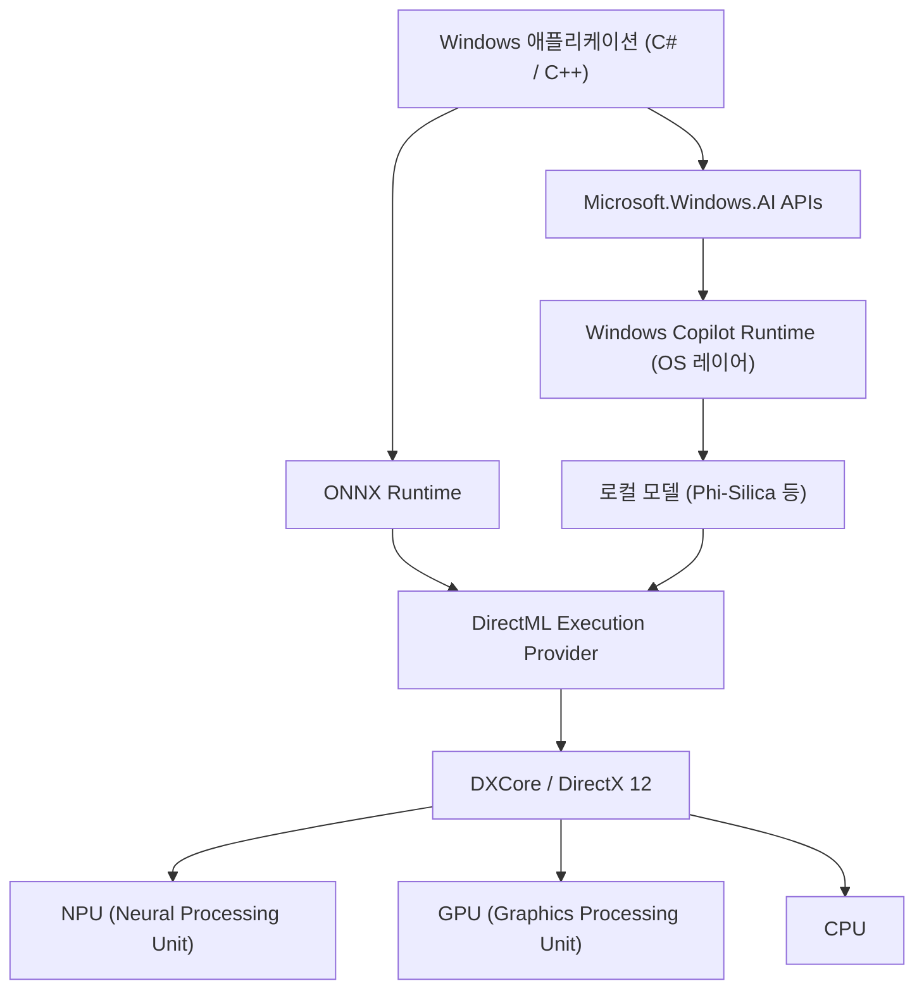
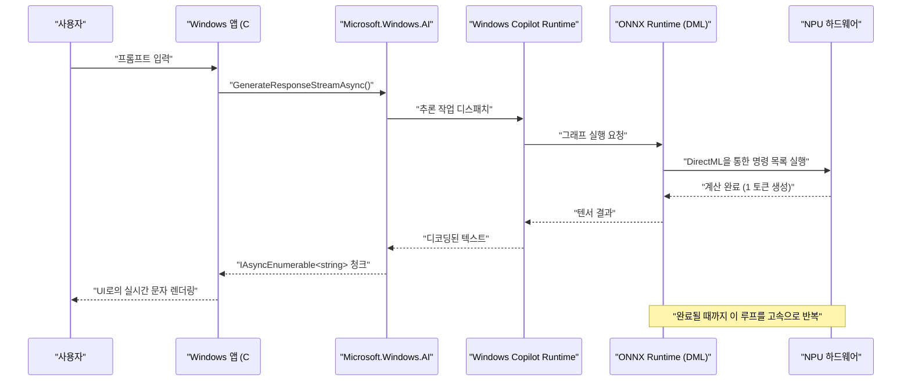

# Microsoft.Windows.AI의 최신 API 활용 사례 및 샘플 코드: Windows Copilot Runtime의 심연을 탐구하다

## 1. 시작하며: AI가 네이티브로 내장되는 Windows의 새로운 시대

최근 AI 기술의 진화는 눈부시며, 클라우드 상에서의 대규모 언어 모델(LLM) 활용에서 엣지 디바이스(로컬 PC)에서의 AI 추론으로 급속히 패러다임 전환이 일어나고 있습니다. 그 핵심을 담당하는 것이 Microsoft가 Windows 11용으로 제공하는 "Windows Copilot Runtime"과 이를 제어하기 위한 "Microsoft.Windows.AI" API입니다.

클라우드 API(OpenAI나 Azure OpenAI 등)를 이용한 애플리케이션 개발은 쉽지만, 지연 시간(레이턴시), 프라이버시, 그리고 지속적인 비용이라는 과제가 따라다닙니다. 반면, 로컬에서 AI 모델을 구동함으로써 기밀 데이터를 디바이스 밖으로 내보내지 않고 오프라인에서도 작동하는 초저지연 애플리케이션을 구현할 수 있습니다.

본 기사에서는 앞으로의 Windows 애플리케이션 개발에서 필수가 될 로컬 AI 기능의 구현 방법에 대해 C# 및 C++의 실용적인 샘플 코드를 곁들여 아키텍처부터 성능 튜닝까지 아주 상세하게 철저히 해설합니다. 단순히 API를 호출하는 것에 그치지 않고, 그 이면에 있는 하드웨어(NPU 및 GPU)의 활용, DirectML과의 연동 등 고도의 기술적 세부 사항까지 깊이 파고듭니다.

## 2. Windows Copilot Runtime과 아키텍처의 전체상

Windows Copilot Runtime은 개발자가 Windows 상에서 AI 모델을 쉽게 통합하고 최고의 성능을 끌어낼 수 있도록 설계된 일련의 AI 스택입니다. 이 런타임은 OS 레벨에서 하드웨어 가속을 추상화하여 개발자에게 통일된 인터페이스를 제공합니다.



위의 아키텍처 다이어그램이 보여주듯이, 애플리케이션은 고수준의 `Microsoft.Windows.AI` API를 이용함으로써 OS에 내장된 소규모 언어 모델(SLM: Phi-Silica 등)에 직접 접근할 수 있습니다. 또한, 커스텀 모델을 사용할 경우에는 ONNX Runtime과 DirectML을 통해 하드웨어 가속을 명시적으로 이용하는 것도 가능합니다. OS 레이어가 CPU, GPU, NPU로의 워크로드 분산을 최적화하므로, 개발자는 하드웨어의 차이를 깊이 의식하지 않고도 고성능 AI 앱을 구축할 수 있습니다.

## 3. 하드웨어 가속과 NPU의 수리적 평가

최신 Copilot+ PC에는 AI 처리에 특화된 프로세서인 NPU(Neural Processing Unit)가 탑재되어 있습니다. NPU의 성능은 일반적으로 TOPS(Tera Operations Per Second)로 평가됩니다.

AI 모델의 추론에 있어서, 특히 행렬 곱셈(GEMM: General Matrix Multiply)의 계산 능력이 처리량(Throughput)을 결정짓습니다. 하드웨어의 이론상 최대 성능 $P_{\text{peak}}$ 은 다음 수식으로 개략적으로 계산됩니다.

$$
P_{\text{peak}} = f \times N_{\text{cores}} \times N_{\text{MACs/core}} \times 2
$$

여기서,
- $f$ 는 NPU의 클럭 주파수(Hz)
- $N_{\text{cores}}$ 는 NPU 내의 코어 수
- $N_{\text{MACs/core}}$ 는 1코어당 MAC(Multiply-Accumulate) 유닛 수
- 마지막의 $2$ 는, 1회의 MAC 연산이 곱셈과 덧셈의 2개 오퍼레이션(FLOPs/OPs)으로 계산되기 때문입니다.

예를 들어, 주파수 1.5GHz, 4코어, 각 코어가 4096MACs를 가진 NPU의 경우,
$$
P_{\text{peak}} = 1.5 \times 10^9 \times 4 \times 4096 \times 2 \approx 49.15 \text{ TOPS}
$$
가 됩니다. Windows 11의 Copilot+ PC 요건인 40 TOPS를 만족하는 성능임이 수학적으로 증명됩니다.

또한, AI 모델, 특히 LLM의 추론(디코드 페이즈)은 **메모리 바운드(Memory-Bound)**가 되기 쉽습니다. 시스템 메모리의 이론적 대역폭 $BW$ 는 다음과 같이 계산됩니다.

$$
BW = f_{\text{mem}} \times W_{\text{bus}} \times \frac{2}{8}
$$

LPDDR5x-8533 메모리($f_{\text{mem}} = 8533 \text{ MT/s}$), 128비트 버스($W_{\text{bus}} = 128$)의 경우, 대역폭은 약 $136 \text{ GB/s}$ 가 됩니다. AI 애플리케이션의 최적화에서는 이 대역폭을 어떻게 절약할지가 중요하며, 후술할 모델의 양자화(Quantization)가 필수적입니다.

## 4. 개발 환경 설정

최신 Windows AI API를 이용하려면, 다음의 환경과 툴체인을 갖추어야 합니다.

1. **OS**: Windows 11 버전 24H2 이상 (Copilot+ PC 요건을 만족하는 NPU 탑재 디바이스를 강력히 권장)
2. **SDK**: Windows App SDK (v1.5 이후의 AI 확장 대응 버전)
3. **개발 환경**: Visual Studio 2022 (v17.10 이상), C++를 사용한 네이티브 개발 워크로드 및 .NET 데스크톱 개발 워크로드
4. **패키지**: NuGet을 통해 `Microsoft.Windows.AI` 및 `Microsoft.ML.OnnxRuntime.DirectML` 설치

```xml
<!-- .csproj 설정 예시 -->
<ItemGroup>
  <PackageReference Include="Microsoft.Windows.AI" Version="1.0.0-preview1" />
  <PackageReference Include="Microsoft.WindowsAppSDK" Version="1.5.240311000" />
  <PackageReference Include="Microsoft.ML.OnnxRuntime.DirectML" Version="1.17.1" />
</ItemGroup>
```

## 5. 【Deep Dive 1】 C#을 이용한 로컬 언어 모델(Phi-Silica) 활용

Windows Copilot Runtime에는 Microsoft가 개발한 고효율 소규모 언어 모델인 "Phi-Silica"가 OS 표준 컴포넌트로 내장되어 있습니다. 이를 통해 GB 단위의 모델을 네트워크에서 다운로드할 필요 없이, 오프라인 환경에서 고도의 자연어 처리(문서 요약, 코드 생성, 챗봇)가 가능해집니다.

다음은 `Microsoft.Windows.AI.Generative` 네임스페이스를 사용하여 C#으로 채팅 AI를 구축하는 고급 샘플 코드입니다. 스트리밍 응답을 지원하며, UI 스레드를 차단하지 않고 실시간으로 텍스트를 생성합니다.

```csharp
using System;
using System.Text;
using System.Threading;
using System.Threading.Tasks;
using Microsoft.Windows.AI.Generative;

namespace WindowsAI.Sample
{
    public class LocalLanguageModelService
    {
        private LanguageModel _languageModel;
        private bool _isInitialized = false;

        /// <summary>
        /// 언어 모델의 초기화를 수행합니다. NPU 사용 가능 여부를 확인하고 최적의 디바이스에 모델을 로드합니다.
        /// </summary>
        public async Task InitializeAsync()
        {
            if (_isInitialized) return;

            Console.WriteLine("로컬 AI 모델(Phi-Silica)의 시스템 요구 사항 및 가용성을 확인하고 있습니다...");
            
            // 모델이 시스템에서 사용 가능한지 확인 (미지원일 경우 다운로드가 촉구될 수 있음)
            var availability = await LanguageModel.CheckAvailabilityAsync();
            if (availability != LanguageModelAvailability.Available)
            {
                throw new InvalidOperationException($"로컬 AI 모델을 현재 사용할 수 없습니다. 상태: {availability}");
            }

            // 모델 인스턴스 생성 (이 타이밍에 메모리 공간으로의 매핑과 NPU 초기화가 수행됨)
            _languageModel = await LanguageModel.CreateAsync();
            _isInitialized = true;
            
            Console.WriteLine("언어 모델의 초기화가 완료되었습니다. DirectML을 통한 하드웨어 가속이 활성화되었습니다.");
        }

        /// <summary>
        /// 사용자의 프롬프트를 받아 스트리밍으로 응답을 생성합니다.
        /// </summary>
        public async Task GenerateResponseStreamAsync(string prompt, CancellationToken cancellationToken)
        {
            if (!_isInitialized) await InitializeAsync();

            Console.WriteLine($"\n[사용자 입력]: {prompt}\n[AI 어시스턴트]: ");

            // 생성 시 하이퍼파라미터 설정
            var options = new LanguageModelOptions
            {
                Temperature = 0.7f,
                TopP = 0.9f,
                MaxTokens = 2048,
                RepetitionPenalty = 1.1f
            };

            // 대화 컨텍스트 구축
            var context = new LanguageModelContext();
            context.AddSystemMessage("당신은 Windows의 로컬 NPU 상에서 직접 동작하는 고도의 AI 어시스턴트입니다. 단계별로 논리적으로 생각하고 간결하게 답변해 주세요.");
            context.AddUserMessage(prompt);

            try
            {
                // 스트리밍 추론 API 호출
                var responseStream = _languageModel.GenerateResponseStreamAsync(context, options);

                // IAsyncEnumerable로 반환되는 청크를 비동기로 반복 처리
                await foreach (var chunk in responseStream.WithCancellation(cancellationToken))
                {
                    // 생성된 토큰(청크)을 실시간으로 콘솔에 출력
                    // UI 애플리케이션의 경우, 여기서 DispatcherQueue를 사용하여 TextBox 등에 반영합니다
                    Console.Write(chunk.Text);
                }
                Console.WriteLine();
            }
            catch (OperationCanceledException)
            {
                Console.WriteLine("\n[사용자 또는 시스템에 의해 생성이 취소되었습니다]");
            }
            catch (Exception ex)
            {
                Console.WriteLine($"\n[치명적인 오류가 발생했습니다: {ex.Message}]");
            }
        }
    }
}
```

### 5.1 C# 구현에서의 아키텍처 해설
이 코드의 핵심은 `LanguageModel.CheckAvailabilityAsync()` 에 의한 실행 전 검증과 `GenerateResponseStreamAsync` 에 의한 비동기 스트리밍입니다. OS 백그라운드에서 동작하는 Copilot Runtime은 이 API 호출을 받으면 내부적으로 ONNX Runtime을 기동하고, 시스템의 구성에 따라 최적의 Execution Provider(대부분의 최신 PC에서는 DirectML + NPU)를 선택합니다.

개발자는 모델의 텐서 형태, 토크나이저 구현, KV 캐시의 메모리 관리 등을 전혀 의식하지 않고, 단 몇 줄의 C# 코드로 최첨단 AI 추론 파이프라인을 애플리케이션에 통합할 수 있습니다.

## 6. 【Deep Dive 2】 C++와 DirectML을 이용한 커스텀 모델의 고속 추론

OS 표준 언어 모델만으로는 커버할 수 없는 특정 도메인(독자적인 이미지 세그멘테이션, 음성 인식, 커스텀 객체 탐지 모델 등)을 다룰 경우, 개발자는 `Microsoft.Windows.AI` 의 하위 레이어에 위치하는 ONNX Runtime과 DirectML을 직접 제어해야 합니다.

C++를 사용함으로써 메모리 할당을 극한까지 최적화하고 NPU/GPU의 최대 성능을 끌어낼 수 있습니다. 다음은 ONNX 형식의 커스텀 모델(예: YOLOv8)을 DirectML을 사용하여 C++로 실행하기 위한, 고급 초기화 및 추론 파이프라인의 핵심 구현입니다.

```cpp
#include <iostream>
#include <vector>
#include <string>
#include <stdexcept>
#include <onnxruntime_cxx_api.h>
#include <dml_provider_factory.h>

class CustomVisionAIProcessor {
private:
    Ort::Env env;
    Ort::Session session{nullptr};
    Ort::AllocatorWithDefaultOptions allocator;
    
public:
    CustomVisionAIProcessor(const std::wstring& modelPath) 
        : env(ORT_LOGGING_LEVEL_WARNING, "VisionAIProcessor") {
        
        Ort::SessionOptions sessionOptions;
        // 스레드 수 최적화
        sessionOptions.SetIntraOpNumThreads(1);
        // 그래프 최적화 레벨을 최대로 설정
        sessionOptions.SetGraphOptimizationLevel(GraphOptimizationLevel::ORT_ENABLE_ALL);

        // 1. DirectML Execution Provider (DML EP) 추가
        // device_id = 0 은 시스템의 기본 권장 어댑터(NPU 또는 고성능 GPU)
        const OrtApi& ortApi = Ort::GetApi();
        OrtDmlApi* dmlApi = nullptr;
        OrtStatus* status = ortApi.GetExecutionProviderApi("DML", ORT_API_VERSION, reinterpret_cast<void**>(&dmlApi));
        
        if (status == nullptr && dmlApi != nullptr) {
            Ort::ThrowOnError(dmlApi->SessionOptionsAppendExecutionProvider_DML(sessionOptions, 0));
            std::cout << "[Info] DirectML Execution Provider를 정상적으로 연결했습니다." << std::endl;
        } else {
            std::cerr << "[Warning] DirectML API 가져오기에 실패했습니다. CPU 폴백 모드로 실행합니다." << std::endl;
            if (status != nullptr) ortApi.ReleaseStatus(status);
        }

        // 2. 모델 로드 및 세션 생성
        try {
            session = Ort::Session(env, modelPath.c_str(), sessionOptions);
            std::cout << "[Info] ONNX 모델 로드에 성공하고 연산 그래프가 컴파일되었습니다." << std::endl;
        } catch (const Ort::Exception& e) {
            std::cerr << "[Error] 모델 로드 실패: " << e.what() << std::endl;
            throw;
        }
    }

    void RunInference(const std::vector<float>& imageTensor, const std::vector<int64_t>& inputShape) {
        // 3. 입력 텐서 버퍼 생성
        Ort::MemoryInfo memoryInfo = Ort::MemoryInfo::CreateCpu(OrtArenaAllocator, OrtMemTypeDefault);
        Ort::Value inputTensor = Ort::Value::CreateTensor<float>(
            memoryInfo, 
            const_cast<float*>(imageTensor.data()), 
            imageTensor.size(), 
            inputShape.data(), 
            inputShape.size()
        );

        // 4. 입출력 노드 이름 동적 획득
        auto inputNamePtr = session.GetInputNameAllocated(0, allocator);
        auto outputNamePtr = session.GetOutputNameAllocated(0, allocator);
        const char* inputNames[] = { inputNamePtr.get() };
        const char* outputNames[] = { outputNamePtr.get() };

        // 5. 추론 실행 (DirectML을 통해 NPU/GPU로 오프로드됨)
        std::cout << "[Info] 추론 엔진 실행을 시작합니다..." << std::endl;
        auto startTime = std::chrono::high_resolution_clock::now();

        auto outputTensors = session.Run(Ort::RunOptions{nullptr}, inputNames, &inputTensor, 1, outputNames, 1);

        auto endTime = std::chrono::high_resolution_clock::now();
        auto duration = std::chrono::duration_cast<std::chrono::milliseconds>(endTime - startTime);

        // 6. 결과 텐서 획득 및 분석
        float* outputData = outputTensors.front().GetTensorMutableData<float>();
        size_t outputSize = outputTensors.front().GetTensorTypeAndShapeInfo().GetElementCount();
        
        std::cout << "[Result] 추론 완료: " << duration.count() << " ms" << std::endl;
        std::cout << "[Result] 출력 텐서의 요소 수: " << outputSize << std::endl;
        // ※ 이 후, 출력 텐서에 대해 NMS(Non-Maximum Suppression)나 바운딩 박스 그리기 처리를 구현합니다
    }
};

int main() {
    try {
        // 실행할 ONNX 모델의 경로
        CustomVisionAIProcessor processor(L"models/yolov8n_quantized.onnx");
        
        // 추론용 더미 이미지 데이터 (배치 크기 1 x 3 채널 x 640 x 640)
        std::vector<int64_t> inputShape = {1, 3, 640, 640};
        std::vector<float> dummyImage(1 * 3 * 640 * 640, 0.5f);
        
        processor.RunInference(dummyImage, inputShape);
    } catch (const std::exception& e) {
        std::cerr << "프로그램이 비정상 종료되었습니다: " << e.what() << std::endl;
        return -1;
    }
    return 0;
}
```

### 6.1 C++에서의 메모리 관리와 제로 카피 추론의 중요성
C++에서 DirectML을 사용하는 최대의 장점은 DirectX 12(DX12)와의 긴밀한 통합이 가능하다는 점입니다. 위의 코드는 교육적 관점에서 표준적인 CPU 메모리로부터의 데이터 복사를 포함하고 있지만, 실제 게임 엔진이나 영상 처리 애플리케이션에서는 DX12를 사용하여 이미지(텍스처)를 이미 GPU나 NPU의 메모리 공간에 유지하고 있는 경우가 많습니다.

이 경우, `OrtDmlApi` 의 고급 바인딩 기능을 이용하여 DX12의 리소스를 직접 ONNX Runtime의 텐서로 매핑하는 "**제로 카피 추론(Zero-Copy Inference)**"을 구현할 수 있습니다. 이를 통해 PCIe 버스 간의 데이터 전송 오버헤드(앞서 언급한 대역폭 $BW$ 의 소비)가 완전히 사라져, 실시간 동영상 처리에서의 프레임 속도가 극적으로 향상됩니다.

## 7. 성능 최적화와 모범 사례

Windows AI API나 DirectML을 활용하여 최상급의 AI 애플리케이션을 개발할 때의 필수적인 최적화 전략을 아래에 정리합니다.

### 7.1 모델 양자화(Quantization)와 Olive Toolkit
NPU의 진정한 힘을 발휘시키려면, AI 모델의 가중치와 활성화 값을 FP32(단정밀도 부동소수점)에서 INT8 또는 INT4로 **양자화(Quantization)**하는 것이 절대적인 조건입니다. NPU의 아키텍처는 정수 연산에 특화되어 있어, FP32와 비교해 INT8에서는 이론상 4배의 처리량과 대폭적인 전력 절감을 실현합니다.

Microsoft가 제공하는 `Olive (ONNX Live)` 툴체인을 사용하면 PyTorch 등의 모델을 Windows 환경에 맞게 자동 최적화할 수 있습니다. Olive는 Transformer 모델에 대한 특수한 어텐션 최적화나 하드웨어별 그래프 컴파일을 강력하게 지원합니다.

### 7.2 배치 처리 vs 대화형 스트리밍의 트레이드오프
API 호출에 있어 여러 추론 요청을 묶어서 배치(Batch) 처리함으로써 NPU의 사용 효율(Compute Utilization)을 높일 수 있습니다. 그러나 챗봇과 같은 대화형 UI의 경우, 처리량보다도 첫 번째 토큰이 표시될 때까지의 시간(TTFT: Time To First Token)이 사용자 경험(UX)을 결정짓습니다.
따라서 대화형 UI에서는 배치 크기를 1로 설정하고, 스트리밍 생성을 우선하는 설계가 모범 사례가 됩니다.

### 7.3 백그라운드 작업과 OS의 연동
AI 추론은 로컬 전력과 시스템 리소스를 대량으로 소비합니다. Windows의 `App Lifecycle API` 와 연동하여, 애플리케이션이 백그라운드로 전환될 때는 우선순위가 낮은 추론 작업을 일시 중단(Suspend)하거나 리소스 소비를 줄이는 구현이 요구됩니다.



이 시퀀스 다이어그램은 UI 스레드를 전혀 차단하지 않고, 최하층의 NPU 하드웨어에서 애플리케이션의 프레젠테이션 계층까지 데이터가 흐르듯이 스트리밍되는 비동기 처리의 아름다움을 보여줍니다.

## 8. 향후 전망과 Windows AI의 진화

`Microsoft.Windows.AI` API와 Copilot Runtime은 현재 진행형으로 급속한 진화를 거듭하고 있습니다. 향후 개발자 대상 업데이트에서는 다음과 같은 패러다임 전환이 기대됩니다.

- **멀티모달 API의 OS 네이티브 통합**: 텍스트뿐만 아니라 음성, 이미지, 나아가 라이브 비디오 피드를 매끄럽게 동시 처리하여 크로스모달 AI 추론을 OS 수준에서 기본 제공.
- **RAG(Retrieval-Augmented Generation) 시스템 수준 지원**: 로컬 PC 내의 개인 문서들이나 Windows Search의 인덱스와 AI 모델을 OS의 안전한 샌드박스 내에서 연동시켜, 사용자의 프라이버시를 완벽히 보호한 상태에서의 초고도 개인 AI 어시스턴트 구축.
- **NPU의 동적 리소스 스케일링**: 여러 AI 애플리케이션(예를 들어, 백그라운드에서의 노이즈 캔슬링과 포그라운드에서의 코드 생성)이 동시에 가동될 때, Windows 커널 스케줄러가 NPU의 실행 컨텍스트를 동적으로 전환하여 QoS(Quality of Service)를 보장하는 메커니즘.

## 9. 결론: 로컬 AI가 바꾸는 애플리케이션의 미래

Windows 11의 Copilot Runtime과 `Microsoft.Windows.AI` API는 모든 Windows 개발자에게 '로컬 AI'라는 극히 강력한 무기를 가져다주었습니다. 이제 클라우드 API에 전적으로 의존할 필요가 없습니다. 지연 시간을 없애고 프라이버시를 굳건히 지키면서도, 오프라인에서 완벽하게 작동하는 차세대 AI 경험을 사용자에게 제공하는 것이 가능해졌습니다.

본 기사에서 해설한 C#을 이용한 시스템 표준 언어 모델의 통합, 수리적인 성능 평가, 그리고 C++와 DirectML을 이용한 극한의 하드웨어 최적화 지식을 활용하여, 여러분의 손으로 차세대 "AI 네이티브" Windows 애플리케이션을 창조해 보세요. AI가 가져올 무한한 가능성은 여러분이 작성하는 코드의 바로 앞에 펼쳐져 있습니다.

---
*※ 주의사항: 이 기사는 2026년 9월 현재의 프리뷰 버전 API 및 최신 사양을 바탕으로 작성되었습니다. Windows 업데이트에 따라 API 사양이나 하드웨어 요구 사항이 변경될 수 있으므로, 구현 시에는 반드시 Microsoft Learn의 공식 문서를 함께 참조해 주시기 바랍니다.*
