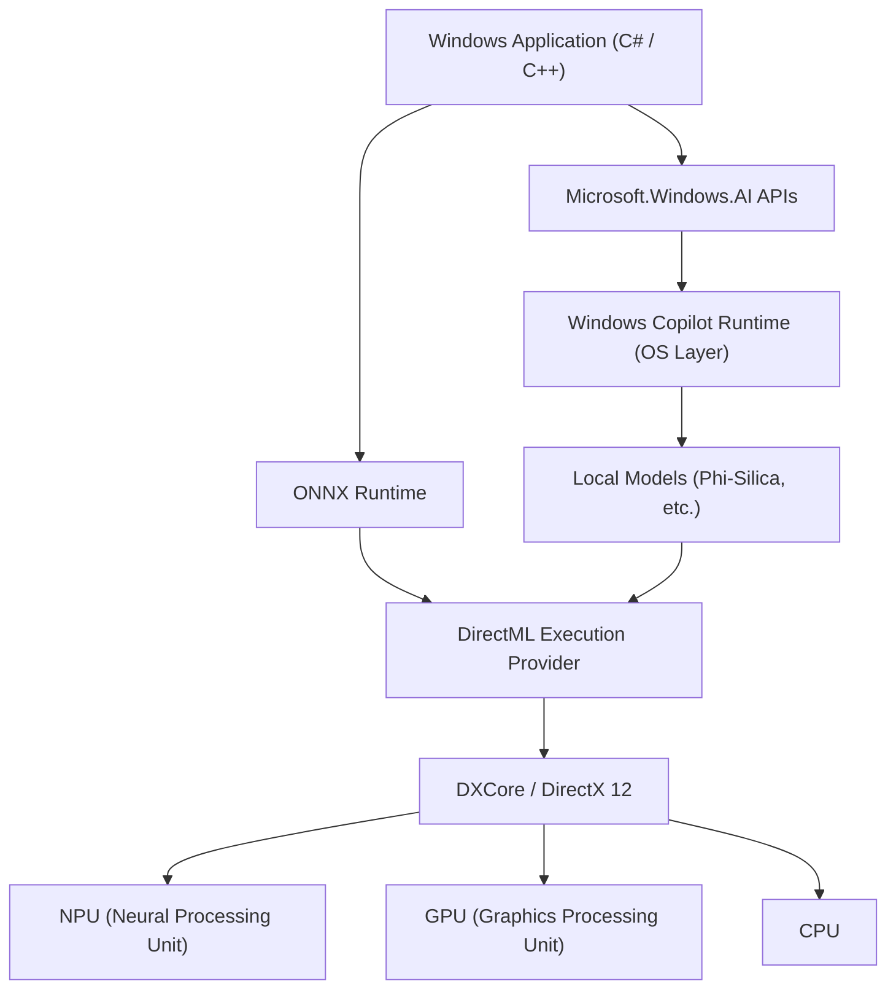
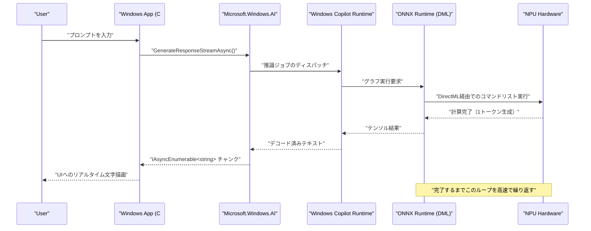

# Microsoft.Windows.AIの最新API活用事例とサンプルコード：Windows Copilot Runtimeの深淵を探る

## 1. はじめに：AIがネイティブに組み込まれるWindowsの新時代

近年、AI技術の進化は目覚ましく、クラウド上での大規模言語モデル（LLM）の活用から、エッジデバイス（ローカルPC）でのAI推論へと急速にパラダイムシフトが起きています。その中核を担うのが、MicrosoftがWindows 11向けに提供している「Windows Copilot Runtime」と、それを操作するための「Microsoft.Windows.AI」APIです。

クラウドAPI（OpenAIやAzure OpenAIなど）を利用したアプリケーション開発は容易ですが、レイテンシ、プライバシー、そして継続的なコストという課題がつきまといます。一方、ローカルでAIモデルを動かすことで、機密データをデバイス外に出すことなく、オフラインでも機能する超低遅延なアプリケーションを実現できます。

本記事では、これからのWindowsアプリケーション開発において必須となるローカルAI機能の実装方法について、C#およびC++の実践的なサンプルコードを交えながら、アーキテクチャからパフォーマンスチューニングまで極めて詳細に徹底解説します。単にAPIを叩くだけではなく、背後にあるハードウェア（NPUやGPU）の活用、DirectMLとの連携など、高度な技術的詳細にまで踏み込みます。

## 2. Windows Copilot Runtimeとアーキテクチャの全体像

Windows Copilot Runtimeは、開発者がWindows上でAIモデルを簡単に統合し、かつ最高のパフォーマンスを引き出せるように設計された一連のAIスタックです。このランタイムは、OSレベルでハードウェアアクセラレーションを抽象化し、開発者に統一されたインターフェースを提供します。



上記のアーキテクチャ図が示すように、アプリケーションは高レベルの `Microsoft.Windows.AI` APIを利用することで、OSに組み込まれた小規模言語モデル（SLM：Phi-Silicaなど）に直接アクセスできます。また、カスタムモデルを使用する場合は、ONNX RuntimeとDirectMLを介してハードウェアアクセラレーションを明示的に利用することも可能です。OSレイヤーがCPU、GPU、NPUへのワークロードの分散を最適化するため、開発者はハードウェアの差異を深く意識することなく、高パフォーマンスなAIアプリを構築できます。

## 3. ハードウェアアクセラレーションとNPUの数理的評価

最新のCopilot+ PCには、AI処理に特化したプロセッサであるNPU（Neural Processing Unit）が搭載されています。NPUのパフォーマンスは一般にTOPS（Tera Operations Per Second）で評価されます。

AIモデルの推論において、特に行列積（GEMM: General Matrix Multiply）の計算能力がスループットを決定づけます。ハードウェアの理論上の最大性能 $P_{\text{peak}}$ は、以下の数式で概算されます。

$$
P_{\text{peak}} = f \times N_{\text{cores}} \times N_{\text{MACs/core}} \times 2
$$

ここで、
- $f$ はNPUのクロック周波数（Hz）
- $N_{\text{cores}}$ はNPU内のコア数
- $N_{\text{MACs/core}}$ は1コアあたりのMAC（Multiply-Accumulate）ユニット数
- 最後の $2$ は、1回のMAC演算が乗算と加算の2つのオペレーション（FLOPs/OPs）としてカウントされるためです。

例えば、周波数1.5GHz、4コア、各コアが4096MACsを持つNPUの場合、
$$
P_{\text{peak}} = 1.5 \times 10^9 \times 4 \times 4096 \times 2 \approx 49.15 \text{ TOPS}
$$
となります。Windows 11のCopilot+ PC要件である40 TOPSをクリアする性能であることが数学的に示されます。

また、AIモデル、特にLLMの推論（デコードフェーズ）は**メモリ律速（Memory-Bound）**になりがちです。システムメモリの理論帯域幅 $BW$ は次のように計算されます。

$$
BW = f_{\text{mem}} \times W_{\text{bus}} \times \frac{2}{8}
$$

LPDDR5x-8533メモリ（$f_{\text{mem}} = 8533 \text{ MT/s}$）、128ビットバス（$W_{\text{bus}} = 128$）の場合、帯域幅は約 $136 \text{ GB/s}$ となります。AIアプリケーションの最適化では、この帯域幅をいかに節約するかが重要であり、後述するモデルの量子化（Quantization）が不可欠となります。

## 4. 開発環境のセットアップ

最新のWindows AI APIを利用するには、以下の環境とツールチェーンを整える必要があります。

1. **OS**: Windows 11 バージョン 24H2 以降（Copilot+ PC要件を満たすNPU搭載デバイスを強く推奨）
2. **SDK**: Windows App SDK (v1.5以降のAI拡張対応版)
3. **開発環境**: Visual Studio 2022 (v17.10以降)、C++によるネイティブ開発ワークロードおよび.NETデスクトップ開発ワークロード
4. **パッケージ**: NuGet経由で `Microsoft.Windows.AI` および `Microsoft.ML.OnnxRuntime.DirectML` をインストール

```xml
<!-- .csproj の設定例 -->
<ItemGroup>
  <PackageReference Include="Microsoft.Windows.AI" Version="1.0.0-preview1" />
  <PackageReference Include="Microsoft.WindowsAppSDK" Version="1.5.240311000" />
  <PackageReference Include="Microsoft.ML.OnnxRuntime.DirectML" Version="1.17.1" />
</ItemGroup>
```

## 5. 【Deep Dive 1】C#を用いたローカル言語モデル（Phi-Silica）の活用

Windows Copilot Runtimeには、Microsoftが開発した高効率な小規模言語モデル「Phi-Silica」がOS標準コンポーネントとして組み込まれています。これにより、GB単位のモデルをネットワークからダウンロードすることなく、オフライン環境で高度な自然言語処理（文章要約、コード生成、チャットボット）が可能になります。

以下は、`Microsoft.Windows.AI.Generative` 名前空間を使用して、C#でチャットAIを構築する高度なサンプルコードです。ストリーミングレスポンスに対応し、UIスレッドをブロックせずにリアルタイムにテキストを生成します。

```csharp
using System;
using System.Text;
using System.Threading;
using System.Threading.Tasks;
using Microsoft.Windows.AI.Generative;

namespace WindowsAI.Sample
{
    public class LocalLanguageModelService
    {
        private LanguageModel _languageModel;
        private bool _isInitialized = false;

        /// <summary>
        /// 言語モデルの初期化を行います。NPUの利用可能性をチェックし、最適なデバイスにモデルをロードします。
        /// </summary>
        public async Task InitializeAsync()
        {
            if (_isInitialized) return;

            Console.WriteLine("ローカルAIモデル（Phi-Silica）のシステム要件と可用性を確認しています...");
            
            // モデルがシステムで利用可能かチェック (非対応の場合はダウンロードが促される場合あり)
            var availability = await LanguageModel.CheckAvailabilityAsync();
            if (availability != LanguageModelAvailability.Available)
            {
                throw new InvalidOperationException($"ローカルAIモデルが現在利用できません。状態: {availability}");
            }

            // モデルのインスタンスを作成（このタイミングでメモリ空間へのマッピングとNPUの初期化が行われる）
            _languageModel = await LanguageModel.CreateAsync();
            _isInitialized = true;
            
            Console.WriteLine("言語モデルの初期化が完了しました。DirectMLを介したハードウェアアクセラレーションがアクティブです。");
        }

        /// <summary>
        /// ユーザーのプロンプトを受け取り、ストリーミングで応答を生成します。
        /// </summary>
        public async Task GenerateResponseStreamAsync(string prompt, CancellationToken cancellationToken)
        {
            if (!_isInitialized) await InitializeAsync();

            Console.WriteLine($"\n[ユーザー入力]: {prompt}\n[AIアシスタント]: ");

            // 生成時のハイパーパラメータを設定
            var options = new LanguageModelOptions
            {
                Temperature = 0.7f,
                TopP = 0.9f,
                MaxTokens = 2048,
                RepetitionPenalty = 1.1f
            };

            // 会話コンテキストの構築
            var context = new LanguageModelContext();
            context.AddSystemMessage("あなたはWindowsのローカルNPU上で直接動作している高度なAIアシスタントです。ステップバイステップで論理的に思考し、簡潔に回答してください。");
            context.AddUserMessage(prompt);

            try
            {
                // ストリーミング推論APIの呼び出し
                var responseStream = _languageModel.GenerateResponseStreamAsync(context, options);

                // IAsyncEnumerableとして返されるチャンクを非同期で反復処理
                await foreach (var chunk in responseStream.WithCancellation(cancellationToken))
                {
                    // 生成されたトークン（チャンク）をリアルタイムにコンソールへ出力
                    // UIアプリケーションの場合は、ここでDispatcherQueueを用いてTextBox等に反映する
                    Console.Write(chunk.Text);
                }
                Console.WriteLine();
            }
            catch (OperationCanceledException)
            {
                Console.WriteLine("\n[ユーザーまたはシステムによって生成がキャンセルされました]");
            }
            catch (Exception ex)
            {
                Console.WriteLine($"\n[致命的なエラーが発生しました: {ex.Message}]");
            }
        }
    }
}
```

### 5.1 C#実装におけるアーキテクチャの解説
このコードの核心は、`LanguageModel.CheckAvailabilityAsync()` による実行前検証と、`GenerateResponseStreamAsync` による非同期ストリーミングです。OSのバックグラウンドで動作するCopilot Runtimeは、このAPI呼び出しを受け取ると、内部的にONNX Runtimeを起動し、システムの構成に応じて最適なExecution Provider（多くの最新PCではDirectML + NPU）を選択します。

開発者は、モデルのテンソル形状、トークナイザーの実装、KVキャッシュのメモリ管理などを一切意識することなく、数行のC#コードで最先端のAI推論パイプラインをアプリケーションに統合できます。

## 6. 【Deep Dive 2】C++とDirectMLによるカスタムモデルの高速推論

OS標準の言語モデルだけではカバーできない特定のドメイン（独自の画像セグメンテーション、音声認識、カスタムの物体検出モデルなど）を扱う場合、開発者は `Microsoft.Windows.AI` の低レイヤーに位置するONNX RuntimeとDirectMLを直接操作する必要があります。

C++を用いることで、メモリの割り当てを極限まで最適化し、NPU/GPUのピークパフォーマンスを引き出すことができます。以下は、ONNX形式のカスタムモデル（例：YOLOv8）をDirectMLを用いてC++で実行するための、高度な初期化および推論パイプラインのコア実装です。

```cpp
#include <iostream>
#include <vector>
#include <string>
#include <stdexcept>
#include <onnxruntime_cxx_api.h>
#include <dml_provider_factory.h>

class CustomVisionAIProcessor {
private:
    Ort::Env env;
    Ort::Session session{nullptr};
    Ort::AllocatorWithDefaultOptions allocator;
    
public:
    CustomVisionAIProcessor(const std::wstring& modelPath) 
        : env(ORT_LOGGING_LEVEL_WARNING, "VisionAIProcessor") {
        
        Ort::SessionOptions sessionOptions;
        // スレッド数の最適化
        sessionOptions.SetIntraOpNumThreads(1);
        // グラフの最適化レベルを最大に設定
        sessionOptions.SetGraphOptimizationLevel(GraphOptimizationLevel::ORT_ENABLE_ALL);

        // 1. DirectML Execution Provider (DML EP) の追加
        // device_id = 0 はシステムのデフォルト推奨アダプタ（NPUまたは高性能GPU）
        const OrtApi& ortApi = Ort::GetApi();
        OrtDmlApi* dmlApi = nullptr;
        OrtStatus* status = ortApi.GetExecutionProviderApi("DML", ORT_API_VERSION, reinterpret_cast<void**>(&dmlApi));
        
        if (status == nullptr && dmlApi != nullptr) {
            Ort::ThrowOnError(dmlApi->SessionOptionsAppendExecutionProvider_DML(sessionOptions, 0));
            std::cout << "[Info] DirectML Execution Provider を正常にアタッチしました。" << std::endl;
        } else {
            std::cerr << "[Warning] DirectML API の取得に失敗しました。CPUフォールバックモードで実行します。" << std::endl;
            if (status != nullptr) ortApi.ReleaseStatus(status);
        }

        // 2. モデルのロードとセッションの作成
        try {
            session = Ort::Session(env, modelPath.c_str(), sessionOptions);
            std::cout << "[Info] ONNXモデルのロードに成功し、計算グラフがコンパイルされました。" << std::endl;
        } catch (const Ort::Exception& e) {
            std::cerr << "[Error] モデルロード失敗: " << e.what() << std::endl;
            throw;
        }
    }

    void RunInference(const std::vector<float>& imageTensor, const std::vector<int64_t>& inputShape) {
        // 3. 入力テンソルのバッファ作成
        Ort::MemoryInfo memoryInfo = Ort::MemoryInfo::CreateCpu(OrtArenaAllocator, OrtMemTypeDefault);
        Ort::Value inputTensor = Ort::Value::CreateTensor<float>(
            memoryInfo, 
            const_cast<float*>(imageTensor.data()), 
            imageTensor.size(), 
            inputShape.data(), 
            inputShape.size()
        );

        // 4. 入出力ノード名の動的取得
        auto inputNamePtr = session.GetInputNameAllocated(0, allocator);
        auto outputNamePtr = session.GetOutputNameAllocated(0, allocator);
        const char* inputNames[] = { inputNamePtr.get() };
        const char* outputNames[] = { outputNamePtr.get() };

        // 5. 推論の実行 (DirectMLを介してNPU/GPUにオフロードされる)
        std::cout << "[Info] 推論エンジンの実行を開始します..." << std::endl;
        auto startTime = std::chrono::high_resolution_clock::now();

        auto outputTensors = session.Run(Ort::RunOptions{nullptr}, inputNames, &inputTensor, 1, outputNames, 1);

        auto endTime = std::chrono::high_resolution_clock::now();
        auto duration = std::chrono::duration_cast<std::chrono::milliseconds>(endTime - startTime);

        // 6. 結果テンソルの取得と解析
        float* outputData = outputTensors.front().GetTensorMutableData<float>();
        size_t outputSize = outputTensors.front().GetTensorTypeAndShapeInfo().GetElementCount();
        
        std::cout << "[Result] 推論完了: " << duration.count() << " ms" << std::endl;
        std::cout << "[Result] 出力テンソルの要素数: " << outputSize << std::endl;
        // ※この後、出力テンソルに対してNMS（Non-Maximum Suppression）やバウンディングボックスの描画処理を実装する
    }
};

int main() {
    try {
        // 実行するONNXモデルのパス
        CustomVisionAIProcessor processor(L"models/yolov8n_quantized.onnx");
        
        // 推論用のダミー画像データ (バッチサイズ1 x 3チャンネル x 640 x 640)
        std::vector<int64_t> inputShape = {1, 3, 640, 640};
        std::vector<float> dummyImage(1 * 3 * 640 * 640, 0.5f);
        
        processor.RunInference(dummyImage, inputShape);
    } catch (const std::exception& e) {
        std::cerr << "プログラムが異常終了しました: " << e.what() << std::endl;
        return -1;
    }
    return 0;
}
```

### 6.1 C++におけるメモリ管理とゼロコピー推論の重要性
C++でDirectMLを使用する最大の利点は、DirectX 12 (DX12) との緊密な統合が可能である点です。上記のコードは教育的観点から標準的なCPUメモリからのデータコピーを含んでいますが、実際のゲームエンジンや映像処理アプリケーションでは、DX12を用いて画像（テクスチャ）を既にGPUやNPUのメモリ空間上に保持しているケースが多々あります。

この場合、`OrtDmlApi` の高度なバインディング機能を利用して、DX12のリソースを直接ONNX Runtimeのテンソルとしてマッピングする「**ゼロコピー推論 (Zero-Copy Inference)**」を実現できます。これにより、PCIeバス間のデータ転送オーバーヘッド（上述した帯域幅 $BW$ の消費）が完全に消失し、リアルタイム動画処理におけるフレームレートが劇的に向上します。

## 7. パフォーマンス最適化とベストプラクティス

Windows AI APIやDirectMLを活用して最上級のAIアプリケーションを開発する際の、不可欠な最適化戦略を以下にまとめます。

### 7.1 モデルの量子化 (Quantization) と Olive Toolkit
NPUの真の力を発揮させるには、AIモデルの重みとアクティベーションをFP32（単精度浮動小数点）からINT8またはINT4へと**量子化（Quantization）**することが絶対条件です。NPUのアーキテクチャは整数演算に特化しており、FP32と比較してINT8では理論上4倍のスループットと大幅な省電力を実現します。

Microsoftが提供する `Olive (ONNX Live)` ツールチェーンを使用することで、PyTorch等のモデルをWindows環境向けに自動最適化できます。Oliveは、Transformerモデルに対する特殊なアテンション最適化や、ハードウェアごとのグラフコンパイルを強力に支援します。

### 7.2 バッチ処理 vs 対話型ストリーミングのトレードオフ
API呼び出しにおいて、複数の推論リクエストをまとめてバッチ処理することで、NPUの利用効率（Compute Utilization）を高めることができます。しかし、チャットボットのような対話型UIの場合、スループットよりも最初のトークンが表示されるまでの時間（TTFT: Time To First Token）がユーザー体験（UX）を決定づけます。
したがって、対話型UIではバッチサイズを1に設定し、ストリーミング生成を優先する設計がベストプラクティスとなります。

### 7.3 バックグラウンドタスクとOSとの連携
AI推論はローカルの電力とシステムリソースを大量に消費します。Windowsの `App Lifecycle API` と連携し、アプリケーションがバックグラウンドに回った際は、優先度の低い推論タスクを一時停止（Suspend）するか、リソース消費を絞る実装が求められます。



このシーケンス図は、UIスレッドを一切ブロックすることなく、最下層のNPUハードウェアからアプリケーションのプレゼンテーション層まで、データが流れるようにストリーミングされる非同期処理の美しさを示しています。

## 8. 将来の展望とWindows AIの進化

`Microsoft.Windows.AI` APIとCopilot Runtimeは、現在進行形で急速な進化を遂げています。将来の開発者向けアップデートでは、以下のようなパラダイムシフトが期待されています。

- **マルチモーダルAPIのOSネイティブ統合**: テキストだけでなく、音声、画像、さらにはライブビデオフィードをシームレスに同時処理し、クロスモーダルなAI推論をOSレベルで標準提供。
- **RAG（Retrieval-Augmented Generation）のシステムレベル対応**: ローカルPC内のパーソナルなドキュメント群やWindows SearchのインデックスとAIモデルをOSの安全なサンドボックス内で連携させ、ユーザーのプライバシーを完全に保護した状態での超高度なパーソナルAIアシスタントの構築。
- **NPUの動的リソーススケーリング**: 複数のAIアプリケーション（例えば、バックグラウンドでのノイズキャンセリングと、フォアグラウンドでのコード生成）が同時に稼働する際、WindowsのカーネルスケジューラがNPUの実行コンテキストを動的に切り替え、QoS（Quality of Service）を保証する仕組み。

## 9. 結論：ローカルAIが変えるアプリケーションの未来

Windows 11のCopilot Runtimeと `Microsoft.Windows.AI` APIは、すべてのWindows開発者に「ローカルAI」という極めて強力な武器をもたらしました。もはやクラウドAPIに完全に依存する必要はありません。レイテンシを排除し、プライバシーを堅守しつつ、オフラインでも完全に動作する次世代のAI体験をユーザーに提供することが可能です。

本記事で解説したC#を用いたシステム標準言語モデルの統合、数理的なパフォーマンス評価、そしてC++とDirectMLを用いた極限のハードウェア最適化の知識を活用し、あなたの手で次世代の「AIネイティブ」なWindowsアプリケーションを創造してください。AIがもたらす無限の可能性は、あなたの書くコードのすぐ先に広がっています。

---
*※注意事項：この記事は2026年9月現在のプレビュー版APIおよび最新の仕様に基づいて執筆されています。WindowsのアップデートによりAPI仕様やハードウェア要件が変更される可能性があるため、実装の際は必ずMicrosoft Learnの公式ドキュメントを併せて参照してください。*
