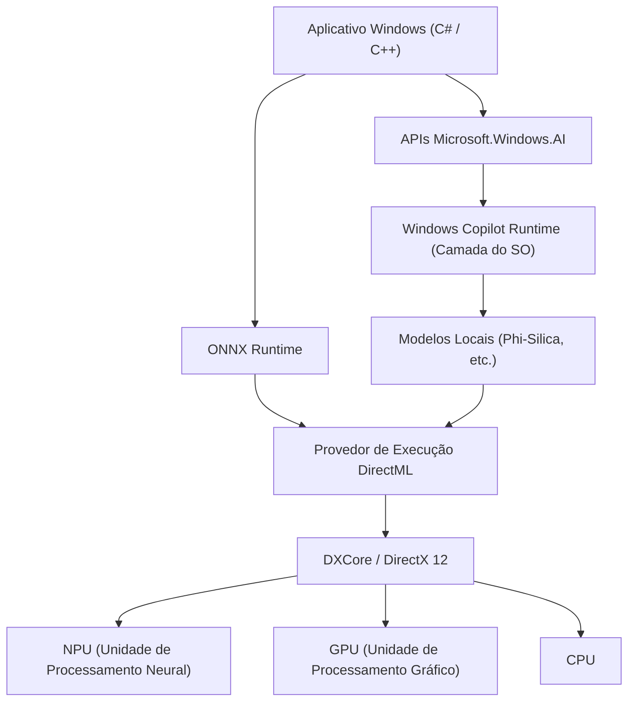
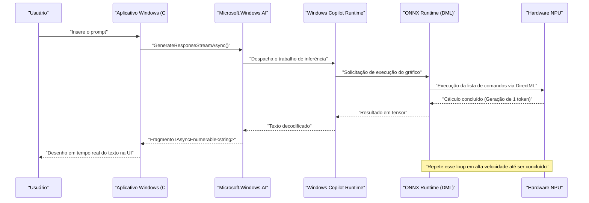

# Casos de Uso da API Recente e Códigos de Exemplo do Microsoft.Windows.AI: Explorando as Profundezas do Windows Copilot Runtime

## 1. Introdução: A Nova Era do Windows com IA Integrada Nativamente

Nos últimos anos, a evolução da tecnologia de IA tem sido notável, com uma rápida mudança de paradigma do uso de Grandes Modelos de Linguagem (LLM) na nuvem para a inferência de IA em dispositivos edge (PCs locais). O núcleo disso é o "Windows Copilot Runtime" fornecido pela Microsoft para o Windows 11 e a API "Microsoft.Windows.AI" para controlá-lo.

O desenvolvimento de aplicativos usando APIs em nuvem (como OpenAI ou Azure OpenAI) é fácil, mas traz desafios como latência, privacidade e custos contínuos. Por outro lado, a execução de modelos de IA localmente permite obter aplicativos de latência ultrabaixa que funcionam offline sem enviar dados confidenciais para fora do dispositivo.

Neste artigo, explicaremos detalhadamente e de forma abrangente, da arquitetura ao ajuste de desempenho, os métodos de implementação de recursos de IA local, que serão essenciais no desenvolvimento de aplicativos para Windows, juntamente com exemplos de código prático em C# e C++. Além de simplesmente chamar a API, nos aprofundaremos em detalhes técnicos avançados, como a utilização de hardware subjacente (NPU e GPU) e a integração com o DirectML.

## 2. Windows Copilot Runtime e a Visão Geral da Arquitetura

O Windows Copilot Runtime é uma pilha de IA projetada para permitir que os desenvolvedores integrem facilmente modelos de IA no Windows e extraiam o melhor desempenho. Este runtime abstrai a aceleração de hardware no nível do sistema operacional e fornece uma interface unificada para os desenvolvedores.



Como o diagrama de arquitetura acima mostra, ao usar a API de alto nível `Microsoft.Windows.AI`, o aplicativo pode acessar diretamente Pequenos Modelos de Linguagem (SLM: como o Phi-Silica) integrados ao sistema operacional. Além disso, ao usar um modelo personalizado, a aceleração de hardware pode ser explicitamente utilizada via ONNX Runtime e DirectML. Como a camada do sistema operacional otimiza a distribuição da carga de trabalho para CPU, GPU e NPU, os desenvolvedores podem construir aplicativos de IA de alto desempenho sem se preocupar profundamente com as diferenças de hardware.

## 3. Aceleração de Hardware e Avaliação Matemática da NPU

Os mais recentes Copilot+ PCs são equipados com a NPU (Unidade de Processamento Neural), um processador especializado em processamento de IA. O desempenho da NPU é geralmente avaliado em TOPS (Tera Operations Per Second).

Na inferência de modelos de IA, a capacidade de cálculo, especialmente de multiplicação de matrizes (GEMM: General Matrix Multiply), determina a taxa de transferência (throughput). O desempenho máximo teórico do hardware $P_{\text{peak}}$ é estimado pela seguinte fórmula:

$$
P_{\text{peak}} = f \times N_{\text{cores}} \times N_{\text{MACs/core}} \times 2
$$

Onde:
- $f$ é a frequência de clock da NPU (Hz)
- $N_{\text{cores}}$ é o número de núcleos dentro da NPU
- $N_{\text{MACs/core}}$ é o número de unidades MAC (Multiply-Accumulate) por núcleo
- O último $2$ ocorre porque uma única operação MAC é contada como duas operações (FLOPs/OPs) de multiplicação e adição.

Por exemplo, para uma NPU com frequência de 1,5 GHz, 4 núcleos e cada núcleo tendo 4096 MACs:
$$
P_{\text{peak}} = 1.5 \times 10^9 \times 4 \times 4096 \times 2 \approx 49.15 \text{ TOPS}
$$

Isso demonstra matematicamente que atende ao requisito de 40 TOPS para os Copilot+ PCs com Windows 11.

Além disso, a inferência (fase de decodificação) de modelos de IA, especialmente LLMs, tende a ser **limitada pela memória (Memory-Bound)**. A largura de banda teórica $BW$ da memória do sistema é calculada da seguinte forma:

$$
BW = f_{\text{mem}} \times W_{\text{bus}} \times \frac{2}{8}
$$

Para memória LPDDR5x-8533 ($f_{\text{mem}} = 8533 \text{ MT/s}$) e um barramento de 128 bits ($W_{\text{bus}} = 128$), a largura de banda é de aproximadamente $136 \text{ GB/s}$. Na otimização de aplicativos de IA, a forma de economizar essa largura de banda é muito importante, tornando a quantização (Quantization) de modelos, que será discutida mais adiante, essencial.

## 4. Configuração do Ambiente de Desenvolvimento

Para usar a API de IA mais recente do Windows, é necessário configurar o seguinte ambiente e conjunto de ferramentas:

1. **SO**: Windows 11 Versão 24H2 ou posterior (Altamente recomendado um dispositivo equipado com NPU que atenda aos requisitos do Copilot+ PC)
2. **SDK**: Windows App SDK (versão compatível com a extensão de IA, v1.5 ou posterior)
3. **Ambiente de Desenvolvimento**: Visual Studio 2022 (v17.10 ou posterior), carga de trabalho de desenvolvimento nativo com C++ e carga de trabalho de desenvolvimento para desktop .NET
4. **Pacotes**: Instalar `Microsoft.Windows.AI` e `Microsoft.ML.OnnxRuntime.DirectML` via NuGet

```xml
<!-- Exemplo de configuração do .csproj -->
<ItemGroup>
  <PackageReference Include="Microsoft.Windows.AI" Version="1.0.0-preview1" />
  <PackageReference Include="Microsoft.WindowsAppSDK" Version="1.5.240311000" />
  <PackageReference Include="Microsoft.ML.OnnxRuntime.DirectML" Version="1.17.1" />
</ItemGroup>
```

## 5. [Deep Dive 1] Utilizando o Modelo de Linguagem Local (Phi-Silica) com C#

O Windows Copilot Runtime inclui o "Phi-Silica", um modelo de linguagem de pequena escala e alta eficiência desenvolvido pela Microsoft, como um componente padrão do sistema operacional. Isso permite o processamento avançado de linguagem natural (resumo de textos, geração de código, chatbots) em um ambiente offline, sem precisar baixar modelos do tamanho de GB pela rede.

Abaixo está um exemplo de código avançado para construir uma IA de bate-papo em C# usando o namespace `Microsoft.Windows.AI.Generative`. Ele suporta respostas em streaming e gera texto em tempo real sem bloquear a thread da UI.

```csharp
using System;
using System.Text;
using System.Threading;
using System.Threading.Tasks;
using Microsoft.Windows.AI.Generative;

namespace WindowsAI.Sample
{
    public class LocalLanguageModelService
    {
        private LanguageModel _languageModel;
        private bool _isInitialized = false;

        /// <summary>
        /// Inicializa o modelo de linguagem. Verifica a disponibilidade da NPU e carrega o modelo no dispositivo ideal.
        /// </summary>
        public async Task InitializeAsync()
        {
            if (_isInitialized) return;

            Console.WriteLine("Verificando os requisitos do sistema e a disponibilidade do modelo de IA local (Phi-Silica)...");
            
            // Verifica se o modelo está disponível no sistema (pode solicitar o download caso não seja suportado)
            var availability = await LanguageModel.CheckAvailabilityAsync();
            if (availability != LanguageModelAvailability.Available)
            {
                throw new InvalidOperationException($"O modelo de IA local não está disponível no momento. Estado: {availability}");
            }

            // Cria a instância do modelo (neste momento, o mapeamento para o espaço de memória e a inicialização da NPU ocorrem)
            _languageModel = await LanguageModel.CreateAsync();
            _isInitialized = true;
            
            Console.WriteLine("Inicialização do modelo de linguagem concluída. A aceleração de hardware via DirectML está ativa.");
        }

        /// <summary>
        /// Recebe o prompt do usuário e gera uma resposta em streaming.
        /// </summary>
        public async Task GenerateResponseStreamAsync(string prompt, CancellationToken cancellationToken)
        {
            if (!_isInitialized) await InitializeAsync();

            Console.WriteLine($"\n[Entrada do Usuário]: {prompt}\n[Assistente de IA]: ");

            // Configura os hiperparâmetros de geração
            var options = new LanguageModelOptions
            {
                Temperature = 0.7f,
                TopP = 0.9f,
                MaxTokens = 2048,
                RepetitionPenalty = 1.1f
            };

            // Constrói o contexto da conversa
            var context = new LanguageModelContext();
            context.AddSystemMessage("Você é um assistente de IA avançado que funciona diretamente na NPU local do Windows. Pense logicamente passo a passo e responda de forma concisa.");
            context.AddUserMessage(prompt);

            try
            {
                // Chama a API de inferência em streaming
                var responseStream = _languageModel.GenerateResponseStreamAsync(context, options);

                // Itera de forma assíncrona sobre os fragmentos (chunks) retornados como IAsyncEnumerable
                await foreach (var chunk in responseStream.WithCancellation(cancellationToken))
                {
                    // Exibe os tokens gerados (chunks) no console em tempo real
                    // Em um aplicativo de UI, o DispatcherQueue seria usado aqui para refletir em um TextBox, etc.
                    Console.Write(chunk.Text);
                }
                Console.WriteLine();
            }
            catch (OperationCanceledException)
            {
                Console.WriteLine("\n[A geração foi cancelada pelo usuário ou pelo sistema]");
            }
            catch (Exception ex)
            {
                Console.WriteLine($"\n[Ocorreu um erro fatal: {ex.Message}]");
            }
        }
    }
}
```

### 5.1 Explicação da Arquitetura na Implementação em C#
O núcleo deste código é a validação pré-execução usando `LanguageModel.CheckAvailabilityAsync()` e o streaming assíncrono através do `GenerateResponseStreamAsync`. Quando o Copilot Runtime operando em segundo plano no sistema operacional recebe essa chamada de API, ele invoca internamente o ONNX Runtime e seleciona o Provedor de Execução ideal (DirectML + NPU em muitos dos PCs mais recentes) dependendo da configuração do sistema.

Os desenvolvedores podem integrar pipelines de inferência de IA de última geração em seus aplicativos com apenas algumas linhas de código em C#, sem a necessidade de se preocuparem com o formato dos tensores do modelo, a implementação do tokenizador ou a gestão da memória de cache KV.

## 6. [Deep Dive 2] Inferência de Alta Velocidade de Modelos Personalizados com C++ e DirectML

Ao lidar com domínios específicos (segmentação de imagens própria, reconhecimento de fala, modelos personalizados de detecção de objetos, etc.) que não podem ser cobertos apenas pelo modelo de linguagem padrão do sistema operacional, os desenvolvedores precisarão manipular diretamente o ONNX Runtime e o DirectML, que estão nas camadas inferiores do `Microsoft.Windows.AI`.

O uso de C++ permite otimizar a alocação de memória ao máximo e extrair o pico de desempenho da NPU/GPU. Abaixo está a implementação principal de um pipeline avançado de inicialização e inferência para executar um modelo personalizado no formato ONNX (ex: YOLOv8) em C++ usando DirectML.

```cpp
#include <iostream>
#include <vector>
#include <string>
#include <stdexcept>
#include <onnxruntime_cxx_api.h>
#include <dml_provider_factory.h>

class CustomVisionAIProcessor {
private:
    Ort::Env env;
    Ort::Session session{nullptr};
    Ort::AllocatorWithDefaultOptions allocator;
    
public:
    CustomVisionAIProcessor(const std::wstring& modelPath) 
        : env(ORT_LOGGING_LEVEL_WARNING, "VisionAIProcessor") {
        
        Ort::SessionOptions sessionOptions;
        // Otimização do número de threads
        sessionOptions.SetIntraOpNumThreads(1);
        // Define o nível de otimização do gráfico para o máximo
        sessionOptions.SetGraphOptimizationLevel(GraphOptimizationLevel::ORT_ENABLE_ALL);

        // 1. Adição do Provedor de Execução DirectML (DML EP)
        // device_id = 0 é o adaptador padrão recomendado pelo sistema (NPU ou GPU de alto desempenho)
        const OrtApi& ortApi = Ort::GetApi();
        OrtDmlApi* dmlApi = nullptr;
        OrtStatus* status = ortApi.GetExecutionProviderApi("DML", ORT_API_VERSION, reinterpret_cast<void**>(&dmlApi));
        
        if (status == nullptr && dmlApi != nullptr) {
            Ort::ThrowOnError(dmlApi->SessionOptionsAppendExecutionProvider_DML(sessionOptions, 0));
            std::cout << "[Info] O Provedor de Execução DirectML foi anexado com sucesso." << std::endl;
        } else {
            std::cerr << "[Warning] Falha ao obter a API do DirectML. Executando no modo de fallback da CPU." << std::endl;
            if (status != nullptr) ortApi.ReleaseStatus(status);
        }

        // 2. Carregamento do modelo e criação da sessão
        try {
            session = Ort::Session(env, modelPath.c_str(), sessionOptions);
            std::cout << "[Info] Modelo ONNX carregado com sucesso e o gráfico de computação foi compilado." << std::endl;
        } catch (const Ort::Exception& e) {
            std::cerr << "[Error] Falha ao carregar o modelo: " << e.what() << std::endl;
            throw;
        }
    }

    void RunInference(const std::vector<float>& imageTensor, const std::vector<int64_t>& inputShape) {
        // 3. Criação do buffer para o tensor de entrada
        Ort::MemoryInfo memoryInfo = Ort::MemoryInfo::CreateCpu(OrtArenaAllocator, OrtMemTypeDefault);
        Ort::Value inputTensor = Ort::Value::CreateTensor<float>(
            memoryInfo, 
            const_cast<float*>(imageTensor.data()), 
            imageTensor.size(), 
            inputShape.data(), 
            inputShape.size()
        );

        // 4. Obtenção dinâmica dos nomes dos nós de entrada e saída
        auto inputNamePtr = session.GetInputNameAllocated(0, allocator);
        auto outputNamePtr = session.GetOutputNameAllocated(0, allocator);
        const char* inputNames[] = { inputNamePtr.get() };
        const char* outputNames[] = { outputNamePtr.get() };

        // 5. Execução da inferência (descarregada para NPU/GPU via DirectML)
        std::cout << "[Info] Iniciando a execução do motor de inferência..." << std::endl;
        auto startTime = std::chrono::high_resolution_clock::now();

        auto outputTensors = session.Run(Ort::RunOptions{nullptr}, inputNames, &inputTensor, 1, outputNames, 1);

        auto endTime = std::chrono::high_resolution_clock::now();
        auto duration = std::chrono::duration_cast<std::chrono::milliseconds>(endTime - startTime);

        // 6. Recuperação e análise dos tensores de resultado
        float* outputData = outputTensors.front().GetTensorMutableData<float>();
        size_t outputSize = outputTensors.front().GetTensorTypeAndShapeInfo().GetElementCount();
        
        std::cout << "[Result] Inferência concluída: " << duration.count() << " ms" << std::endl;
        std::cout << "[Result] Número de elementos no tensor de saída: " << outputSize << std::endl;
        // *Após isso, a implementação do processamento NMS (Non-Maximum Suppression) e o desenho das caixas delimitadoras (bounding boxes) devem ser feitos no tensor de saída
    }
};

int main() {
    try {
        // Caminho do modelo ONNX a ser executado
        CustomVisionAIProcessor processor(L"models/yolov8n_quantized.onnx");
        
        // Dados de imagem fictícios para inferência (Tamanho do lote 1 x 3 canais x 640 x 640)
        std::vector<int64_t> inputShape = {1, 3, 640, 640};
        std::vector<float> dummyImage(1 * 3 * 640 * 640, 0.5f);
        
        processor.RunInference(dummyImage, inputShape);
    } catch (const std::exception& e) {
        std::cerr << "O programa foi encerrado de forma anormal: " << e.what() << std::endl;
        return -1;
    }
    return 0;
}
```

### 6.1 A Importância da Gestão de Memória e Inferência Zero-Copy em C++
A maior vantagem de usar o DirectML com C++ é a forte integração com o DirectX 12 (DX12) que isso possibilita. O código acima inclui a cópia de dados da memória da CPU padrão por uma questão didática, mas em aplicações de processamento de vídeo e motores de jogos reais, muitas vezes já existem imagens (texturas) mantidas no espaço de memória da GPU ou NPU via DX12.

Neste caso, usando as características avançadas de vinculação da API `OrtDmlApi`, você pode alcançar a "**Inferência Zero-Copy (Zero-Copy Inference)**", onde recursos DX12 são mapeados diretamente como tensores para o ONNX Runtime. Com isso, o custo indireto de transferência de dados do barramento PCIe (o consumo da largura de banda $BW$ descrito acima) desaparece completamente, resultando em uma melhoria drástica nas taxas de quadros para o processamento de vídeo em tempo real.

## 7. Otimização de Desempenho e Melhores Práticas

Abaixo estão as estratégias de otimização essenciais para o desenvolvimento de aplicativos de IA de ponta usando a API de IA do Windows e o DirectML.

### 7.1 Quantização de Modelos (Quantization) e Toolkit Olive
Para extrair o verdadeiro poder da NPU, é uma condição absoluta **quantizar (Quantization)** os pesos e ativações do modelo de IA de FP32 (ponto flutuante de precisão simples) para INT8 ou INT4. A arquitetura da NPU é especializada em operações com inteiros, o que permite atingir taxas de transferência teoricamente quatro vezes maiores e reduzir drasticamente o consumo de energia em INT8 em comparação com o FP32.

Ao usar a cadeia de ferramentas `Olive (ONNX Live)` oferecida pela Microsoft, os modelos de IA, como os do PyTorch, podem ser automaticamente otimizados para ambientes Windows. A ferramenta Olive fornece forte suporte para otimizações de atenção especializadas para modelos baseados em Transformers e compilação de gráficos por hardware.

### 7.2 Trade-off Entre Processamento em Lote e Streaming Interativo
Nas chamadas de API, a utilização da NPU (Compute Utilization) pode ser aumentada combinando múltiplas solicitações de inferência num processamento em lote. No entanto, no caso de IUs interativas, como chatbots, não é a taxa de transferência, mas sim o tempo até que o primeiro token seja gerado (TTFT: Time To First Token) que determina a experiência do usuário (UX).
Portanto, as melhores práticas ditam projetar o tamanho de lote (batch size) como 1 em IUs interativas, priorizando a geração de streaming.

### 7.3 Tarefas em Segundo Plano e Integração com o SO
A inferência de IA consome localmente grandes quantidades de energia e recursos do sistema. Ao cooperar com a `App Lifecycle API` do Windows, há a necessidade de uma implementação que suspenda (Suspend) as tarefas de inferência de baixa prioridade ou restrinja o consumo de recursos quando o aplicativo for movido para o segundo plano.



Este diagrama de sequência ilustra a beleza do processamento assíncrono, através do qual os dados fluem em streaming da camada de hardware mais profunda da NPU para a camada de apresentação do aplicativo de forma contínua, sem bloquear a thread de UI de forma alguma.

## 8. Perspectivas Futuras e a Evolução da IA do Windows

As APIs `Microsoft.Windows.AI` e o Copilot Runtime estão passando por uma rápida evolução neste exato momento. Nas futuras atualizações para os desenvolvedores, são esperadas as seguintes mudanças de paradigma:

- **Integração Nativa da API Multimodal no SO**: Em vez de apenas texto, a capacidade de processar simultaneamente e de forma contínua áudio, imagens e até transmissões de vídeo ao vivo, fornecendo inferência transversal de IA como um padrão ao nível do SO.
- **RAG (Retrieval-Augmented Generation) a Nível de Sistema**: Uma IA pessoal super avançada construída através da colaboração de um modelo de IA com grupos de documentos pessoais locais e o índice do Windows Search, operando dentro de uma sandbox segura do SO e protegendo completamente a privacidade do usuário.
- **Dimensionamento Dinâmico de Recursos da NPU**: Quando vários aplicativos de IA funcionam simultaneamente (por exemplo, cancelamento de ruído em segundo plano e geração de código em primeiro plano), o escalonador do kernel do Windows alterna os contextos de execução da NPU de forma dinâmica para garantir a Qualidade de Serviço (QoS).

## 9. Conclusão: O Futuro dos Aplicativos Transformados pela IA Local

O Copilot Runtime do Windows 11 e a API `Microsoft.Windows.AI` trouxeram uma arma extremamente poderosa chamada "IA Local" para todos os desenvolvedores do Windows. Não há mais a necessidade de depender completamente de APIs em nuvem. É possível eliminar a latência e oferecer uma experiência de IA de última geração que funciona totalmente offline aos usuários, protegendo rigorosamente a sua privacidade.

Pedimos que você utilize os conhecimentos abordados neste artigo sobre a integração do modelo de linguagem padrão do sistema via C#, a avaliação matemática de desempenho e a otimização extrema de hardware usando C++ e DirectML, para criar, com as suas próprias mãos, os próximos aplicativos de Windows "Nativos de IA". As possibilidades infinitas que a IA traz estão à sua espera, através do código que você escrever.

---
*Aviso Legal: Note que este artigo foi escrito com base nas versões de pré-lançamento da API e especificações mais recentes disponíveis em Setembro de 2026. Como as especificações da API e os requisitos de hardware podem mudar devido às atualizações do Windows, certifique-se de consultar as documentações oficiais da Microsoft Learn ao implementar.*
