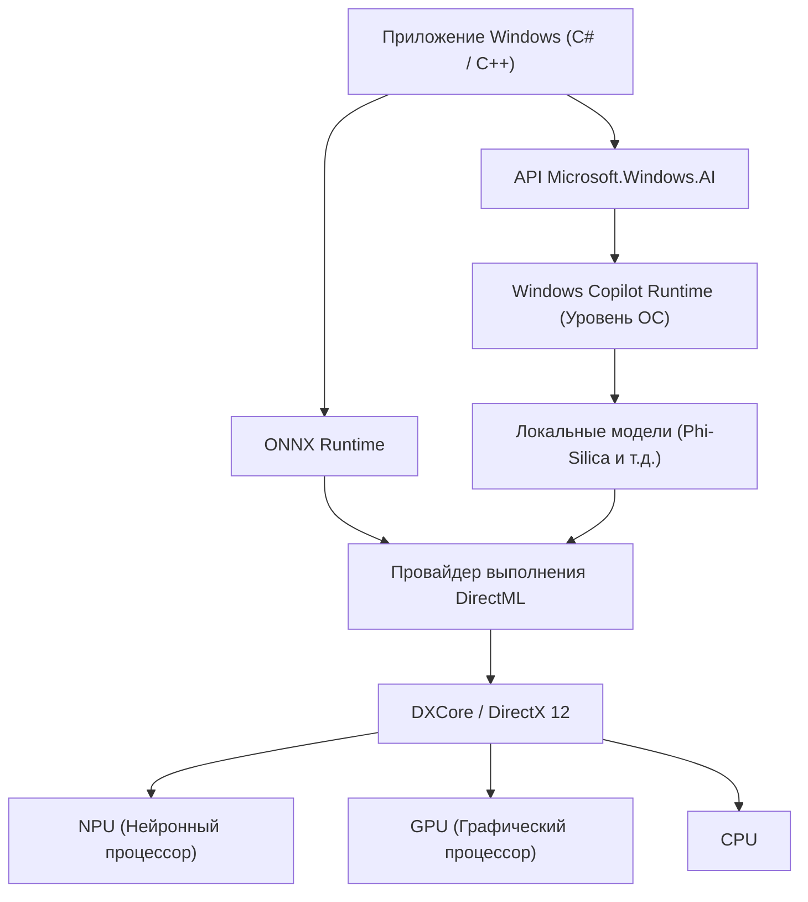
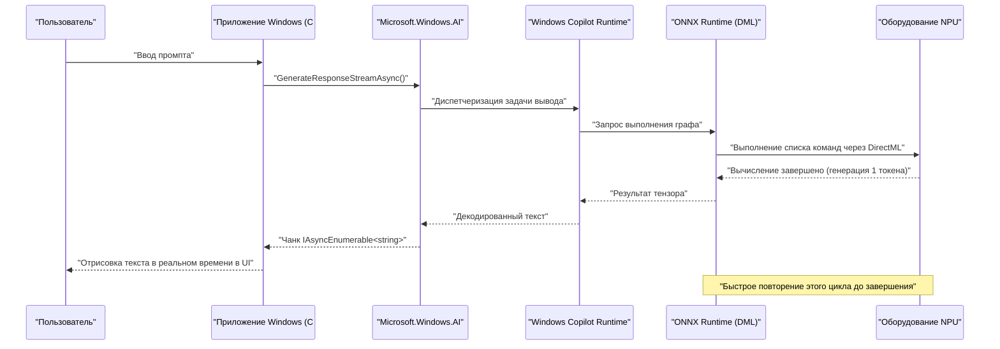

# Практические примеры и примеры кода использования новейшего API Microsoft.Windows.AI: Исследование глубин Windows Copilot Runtime

## 1. Введение: Новая эра Windows с нативной интеграцией ИИ

В последние годы эволюция технологий ИИ была поразительной, и происходит быстрый сдвиг парадигмы от использования больших языковых моделей (LLM) в облаке к выводу ИИ на граничных устройствах (локальных ПК). Центральную роль в этом играют «Windows Copilot Runtime», предоставляемый Microsoft для Windows 11, и API «Microsoft.Windows.AI» для управления им.

Разработка приложений с использованием облачных API (например, OpenAI или Azure OpenAI) проста, но сопровождается такими проблемами, как задержка, конфиденциальность и постоянные затраты. С другой стороны, запуск моделей ИИ локально позволяет создавать приложения со сверхнизкой задержкой, которые работают даже в автономном режиме, не выводя конфиденциальные данные за пределы устройства.

В этой статье мы подробно и досконально рассмотрим, как реализовать локальные функции ИИ, которые станут необходимыми для разработки приложений Windows в будущем, от архитектуры до настройки производительности, с практическими примерами кода на C# и C++. Мы не только рассмотрим вызов API, но и углубимся в сложные технические детали, такие как использование базового оборудования (NPU и GPU) и интеграцию с DirectML.

## 2. Windows Copilot Runtime и общий обзор архитектуры

Windows Copilot Runtime — это стек ИИ, разработанный для того, чтобы разработчики могли легко интегрировать модели ИИ в Windows и извлекать максимальную производительность. Эта среда выполнения абстрагирует аппаратное ускорение на уровне ОС и предоставляет разработчикам унифицированный интерфейс.



Как показано на архитектурной диаграмме выше, приложения могут напрямую обращаться к малым языковым моделям (SLM: таким как Phi-Silica), встроенным в ОС, используя высокоуровневый API `Microsoft.Windows.AI`. Кроме того, при использовании пользовательских моделей можно явно использовать аппаратное ускорение через ONNX Runtime и DirectML. Поскольку уровень ОС оптимизирует распределение рабочих нагрузок между CPU, GPU и NPU, разработчики могут создавать высокопроизводительные приложения ИИ, не задумываясь о различиях в оборудовании.

## 3. Математическая оценка аппаратного ускорения и NPU

Современные ПК Copilot+ оснащены NPU (нейронным процессором), процессором, специально предназначенным для обработки задач ИИ. Производительность NPU обычно оценивается в TOPS (тера-операциях в секунду - Tera Operations Per Second).

При выводе моделей ИИ вычислительная мощность матричного умножения (GEMM: General Matrix Multiply) в первую очередь определяет пропускную способность. Теоретическая пиковая производительность оборудования $P_{\text{peak}}$ оценивается по следующей формуле:

$$
P_{\text{peak}} = f \times N_{\text{cores}} \times N_{\text{MACs/core}} \times 2
$$

Где:
- $f$ — тактовая частота NPU (Гц)
- $N_{\text{cores}}$ — количество ядер в NPU
- $N_{\text{MACs/core}}$ — количество блоков MAC (Multiply-Accumulate) на ядро
- Последняя цифра $2$ связана с тем, что одна операция MAC считается как две операции (FLOPs/OPs) — умножение и сложение.

Например, для NPU с частотой 1.5 ГГц, 4 ядрами и 4096 MAC в каждом ядре:
$$
P_{\text{peak}} = 1.5 \times 10^9 \times 4 \times 4096 \times 2 \approx 49.15 \text{ TOPS}
$$
Математически показано, что эта производительность превышает требование в 40 TOPS для ПК Copilot+ с Windows 11.

Кроме того, вывод моделей ИИ, особенно LLM (фаза декодирования), часто **ограничен памятью (Memory-Bound)**. Теоретическая пропускная способность системной памяти $BW$ рассчитывается следующим образом:

$$
BW = f_{\text{mem}} \times W_{\text{bus}} \times \frac{2}{8}
$$

Для памяти LPDDR5x-8533 ($f_{\text{mem}} = 8533 \text{ MT/s}$) и 128-битной шины ($W_{\text{bus}} = 128$) пропускная способность составит около $136 \text{ GB/s}$. При оптимизации ИИ-приложений важно, как экономится эта пропускная способность, что делает необходимым квантование (Quantization) моделей, которое будет описано позже.

## 4. Настройка среды разработки

Чтобы использовать новейший API Windows AI, необходимо подготовить следующую среду и цепочку инструментов:

1. **ОС**: Windows 11 версии 24H2 или новее (настоятельно рекомендуется устройство с NPU, соответствующее требованиям Copilot+ PC)
2. **SDK**: Windows App SDK (версия 1.5 или новее с поддержкой расширений ИИ)
3. **Среда разработки**: Visual Studio 2022 (версия 17.10 или новее), рабочие нагрузки для нативной разработки на C++ и разработки классических приложений .NET
4. **Пакеты**: Установите `Microsoft.Windows.AI` и `Microsoft.ML.OnnxRuntime.DirectML` через NuGet

```xml
<!-- Пример настройки .csproj -->
<ItemGroup>
  <PackageReference Include="Microsoft.Windows.AI" Version="1.0.0-preview1" />
  <PackageReference Include="Microsoft.WindowsAppSDK" Version="1.5.240311000" />
  <PackageReference Include="Microsoft.ML.OnnxRuntime.DirectML" Version="1.17.1" />
</ItemGroup>
```

## 5. [Deep Dive 1] Использование локальной языковой модели (Phi-Silica) с C#

Windows Copilot Runtime включает высокоэффективную малую языковую модель «Phi-Silica», разработанную Microsoft, в качестве стандартного компонента ОС. Это обеспечивает расширенную обработку естественного языка (краткое изложение текста, генерация кода, чат-боты) в автономной среде без необходимости загрузки гигабайтных моделей из сети.

Ниже приведен продвинутый пример кода для создания ИИ-чата на C# с использованием пространства имен `Microsoft.Windows.AI.Generative`. Он поддерживает потоковые ответы и генерирует текст в реальном времени, не блокируя поток пользовательского интерфейса.

```csharp
using System;
using System.Text;
using System.Threading;
using System.Threading.Tasks;
using Microsoft.Windows.AI.Generative;

namespace WindowsAI.Sample
{
    public class LocalLanguageModelService
    {
        private LanguageModel _languageModel;
        private bool _isInitialized = false;

        /// <summary>
        /// Инициализирует языковую модель. Проверяет доступность NPU и загружает модель на оптимальное устройство.
        /// </summary>
        public async Task InitializeAsync()
        {
            if (_isInitialized) return;

            Console.WriteLine("Проверка системных требований и доступности локальной ИИ-модели (Phi-Silica)...");
            
            // Проверка доступности модели в системе (если не поддерживается, может быть предложено скачивание)
            var availability = await LanguageModel.CheckAvailabilityAsync();
            if (availability != LanguageModelAvailability.Available)
            {
                throw new InvalidOperationException($"Локальная ИИ-модель в настоящее время недоступна. Состояние: {availability}");
            }

            // Создание экземпляра модели (на этом этапе происходит маппинг в адресное пространство памяти и инициализация NPU)
            _languageModel = await LanguageModel.CreateAsync();
            _isInitialized = true;
            
            Console.WriteLine("Инициализация языковой модели завершена. Аппаратное ускорение через DirectML активно.");
        }

        /// <summary>
        /// Принимает промпт пользователя и генерирует ответ в виде потока.
        /// </summary>
        public async Task GenerateResponseStreamAsync(string prompt, CancellationToken cancellationToken)
        {
            if (!_isInitialized) await InitializeAsync();

            Console.WriteLine($"\n[Ввод пользователя]: {prompt}\n[ИИ-ассистент]: ");

            // Настройка гиперпараметров для генерации
            var options = new LanguageModelOptions
            {
                Temperature = 0.7f,
                TopP = 0.9f,
                MaxTokens = 2048,
                RepetitionPenalty = 1.1f
            };

            // Построение контекста разговора
            var context = new LanguageModelContext();
            context.AddSystemMessage("Вы — продвинутый ИИ-ассистент, работающий напрямую на локальном NPU Windows. Рассуждайте логически шаг за шагом и отвечайте лаконично.");
            context.AddUserMessage(prompt);

            try
            {
                // Вызов API потокового вывода
                var responseStream = _languageModel.GenerateResponseStreamAsync(context, options);

                // Асинхронная итерация чанков, возвращаемых как IAsyncEnumerable
                await foreach (var chunk in responseStream.WithCancellation(cancellationToken))
                {
                    // Вывод сгенерированных токенов (чанков) в консоль в реальном времени
                    // В случае UI-приложения здесь следует использовать DispatcherQueue для обновления TextBox и т.д.
                    Console.Write(chunk.Text);
                }
                Console.WriteLine();
            }
            catch (OperationCanceledException)
            {
                Console.WriteLine("\n[Генерация была отменена пользователем или системой]");
            }
            catch (Exception ex)
            {
                Console.WriteLine($"\n[Произошла критическая ошибка: {ex.Message}]");
            }
        }
    }
}
```

### 5.1 Пояснение архитектуры реализации на C#
Ядром этого кода является проверка перед выполнением с помощью `LanguageModel.CheckAvailabilityAsync()` и асинхронная потоковая передача с помощью `GenerateResponseStreamAsync`. Copilot Runtime, работающий в фоновом режиме ОС, получает этот вызов API, внутренне запускает ONNX Runtime и выбирает оптимальный провайдер выполнения (Execution Provider) (DirectML + NPU на многих современных ПК) в соответствии с конфигурацией системы.

Разработчики могут интегрировать передовой конвейер логического вывода ИИ в свои приложения всего несколькими строками кода на C#, не заботясь о форме тензоров модели, реализации токенизатора или управлении памятью кэша KV.

## 6. [Deep Dive 2] Высокоскоростной вывод пользовательских моделей с использованием C++ и DirectML

При работе с конкретными доменами, которые не могут быть охвачены стандартной языковой моделью ОС (например, собственная сегментация изображений, распознавание речи, пользовательские модели обнаружения объектов), разработчикам необходимо напрямую взаимодействовать с низкоуровневыми компонентами `Microsoft.Windows.AI` — ONNX Runtime и DirectML.

Использование C++ позволяет максимально оптимизировать распределение памяти и извлечь пиковую производительность из NPU/GPU. Ниже приведена базовая реализация конвейера инициализации и расширенного вывода для выполнения пользовательской модели в формате ONNX (например, YOLOv8) на C++ с использованием DirectML.

```cpp
#include <iostream>
#include <vector>
#include <string>
#include <stdexcept>
#include <onnxruntime_cxx_api.h>
#include <dml_provider_factory.h>

class CustomVisionAIProcessor {
private:
    Ort::Env env;
    Ort::Session session{nullptr};
    Ort::AllocatorWithDefaultOptions allocator;
    
public:
    CustomVisionAIProcessor(const std::wstring& modelPath) 
        : env(ORT_LOGGING_LEVEL_WARNING, "VisionAIProcessor") {
        
        Ort::SessionOptions sessionOptions;
        // Оптимизация количества потоков
        sessionOptions.SetIntraOpNumThreads(1);
        // Установка максимального уровня оптимизации графа
        sessionOptions.SetGraphOptimizationLevel(GraphOptimizationLevel::ORT_ENABLE_ALL);

        // 1. Добавление провайдера выполнения DirectML (DML EP)
        // device_id = 0 — это рекомендуемый по умолчанию адаптер системы (NPU или высокопроизводительный GPU)
        const OrtApi& ortApi = Ort::GetApi();
        OrtDmlApi* dmlApi = nullptr;
        OrtStatus* status = ortApi.GetExecutionProviderApi("DML", ORT_API_VERSION, reinterpret_cast<void**>(&dmlApi));
        
        if (status == nullptr && dmlApi != nullptr) {
            Ort::ThrowOnError(dmlApi->SessionOptionsAppendExecutionProvider_DML(sessionOptions, 0));
            std::cout << "[Info] Провайдер выполнения DirectML успешно подключен." << std::endl;
        } else {
            std::cerr << "[Warning] Не удалось получить API DirectML. Выполнение в режиме резервного копирования на CPU." << std::endl;
            if (status != nullptr) ortApi.ReleaseStatus(status);
        }

        // 2. Загрузка модели и создание сессии
        try {
            session = Ort::Session(env, modelPath.c_str(), sessionOptions);
            std::cout << "[Info] Модель ONNX успешно загружена, вычислительный граф скомпилирован." << std::endl;
        } catch (const Ort::Exception& e) {
            std::cerr << "[Error] Ошибка загрузки модели: " << e.what() << std::endl;
            throw;
        }
    }

    void RunInference(const std::vector<float>& imageTensor, const std::vector<int64_t>& inputShape) {
        // 3. Создание буфера для входного тензора
        Ort::MemoryInfo memoryInfo = Ort::MemoryInfo::CreateCpu(OrtArenaAllocator, OrtMemTypeDefault);
        Ort::Value inputTensor = Ort::Value::CreateTensor<float>(
            memoryInfo, 
            const_cast<float*>(imageTensor.data()), 
            imageTensor.size(), 
            inputShape.data(), 
            inputShape.size()
        );

        // 4. Динамическое получение имен входных и выходных узлов
        auto inputNamePtr = session.GetInputNameAllocated(0, allocator);
        auto outputNamePtr = session.GetOutputNameAllocated(0, allocator);
        const char* inputNames[] = { inputNamePtr.get() };
        const char* outputNames[] = { outputNamePtr.get() };

        // 5. Выполнение вывода (переносится на NPU/GPU через DirectML)
        std::cout << "[Info] Запуск механизма логического вывода..." << std::endl;
        auto startTime = std::chrono::high_resolution_clock::now();

        auto outputTensors = session.Run(Ort::RunOptions{nullptr}, inputNames, &inputTensor, 1, outputNames, 1);

        auto endTime = std::chrono::high_resolution_clock::now();
        auto duration = std::chrono::duration_cast<std::chrono::milliseconds>(endTime - startTime);

        // 6. Получение и анализ результирующего тензора
        float* outputData = outputTensors.front().GetTensorMutableData<float>();
        size_t outputSize = outputTensors.front().GetTensorTypeAndShapeInfo().GetElementCount();
        
        std::cout << "[Result] Вывод завершен: " << duration.count() << " мс" << std::endl;
        std::cout << "[Result] Количество элементов выходного тензора: " << outputSize << std::endl;
        // *После этого реализуется постобработка, например, NMS (Non-Maximum Suppression) и отрисовка ограничивающих рамок для выходного тензора.
    }
};

int main() {
    try {
        // Путь к исполняемой модели ONNX
        CustomVisionAIProcessor processor(L"models/yolov8n_quantized.onnx");
        
        // Фиктивные данные изображения для вывода (размер пакета 1 x 3 канала x 640 x 640)
        std::vector<int64_t> inputShape = {1, 3, 640, 640};
        std::vector<float> dummyImage(1 * 3 * 640 * 640, 0.5f);
        
        processor.RunInference(dummyImage, inputShape);
    } catch (const std::exception& e) {
        std::cerr << "Программа завершилась с ошибкой: " << e.what() << std::endl;
        return -1;
    }
    return 0;
}
```

### 6.1 Важность управления памятью и вывода с нулевым копированием (Zero-Copy) в C++
Самое большое преимущество использования DirectML в C++ заключается в возможности тесной интеграции с DirectX 12 (DX12). В приведенном выше коде в образовательных целях включено стандартное копирование данных из памяти CPU, но в реальных игровых движках или приложениях для обработки видео часто изображения (текстуры) уже хранятся в памяти GPU или NPU с использованием DX12.

В этом случае вы можете использовать расширенные функции привязки `OrtDmlApi` для сопоставления ресурсов DX12 непосредственно с тензорами ONNX Runtime, достигая «**вывода с нулевым копированием (Zero-Copy Inference)**». Это полностью устраняет накладные расходы на передачу данных по шине PCIe (потребление упомянутой выше пропускной способности $BW$) и значительно повышает частоту кадров при обработке видео в реальном времени.

## 7. Оптимизация производительности и лучшие практики

Ниже приведены основные стратегии оптимизации для разработки первоклассных приложений ИИ с использованием API Windows AI и DirectML.

### 7.1 Квантование модели (Quantization) и Olive Toolkit
Чтобы раскрыть истинную мощь NPU, обязательным условием является **квантование (Quantization)** весов и активаций моделей ИИ с FP32 (одинарная точность с плавающей запятой) до INT8 или INT4. Архитектура NPU оптимизирована для целочисленной арифметики и теоретически достигает четырехкратной пропускной способности и значительной экономии энергии с INT8 по сравнению с FP32.

Используя набор инструментов `Olive (ONNX Live)`, предоставляемый Microsoft, вы можете автоматически оптимизировать модели, такие как PyTorch, для сред Windows. Olive обеспечивает мощную поддержку специализированной оптимизации внимания для моделей Transformer и компиляции графов для конкретного оборудования.

### 7.2 Компромисс между пакетной обработкой и интерактивной потоковой передачей
В вызовах API пакетная обработка нескольких запросов вывода может повысить эффективность использования NPU (Compute Utilization). Однако для интерактивного пользовательского интерфейса, такого как чат-бот, время до отображения первого токена (TTFT: Time To First Token) определяет пользовательский опыт (UX) в большей степени, чем пропускная способность.
Следовательно, для интерактивных пользовательских интерфейсов лучшей практикой является установка размера пакета равным 1 и приоритизация потоковой генерации.

### 7.3 Фоновые задачи и интеграция с ОС
Вывод ИИ потребляет значительное количество локальной энергии и системных ресурсов. Требуется интеграция с `App Lifecycle API` Windows: когда приложение переходит в фоновый режим, задачи логического вывода с низким приоритетом должны приостанавливаться (Suspend) или ограничивать потребление ресурсов.



Эта диаграмма последовательности иллюстрирует красоту асинхронной обработки, при которой данные передаются потоком с самого нижнего уровня аппаратного обеспечения NPU на уровень представления приложения, совершенно не блокируя поток пользовательского интерфейса.

## 8. Перспективы на будущее и эволюция Windows AI

API `Microsoft.Windows.AI` и Copilot Runtime в настоящее время быстро развиваются. В будущих обновлениях для разработчиков ожидаются следующие сдвиги парадигмы:

- **Нативная интеграция мультимодальных API в ОС**: Плавная одновременная обработка не только текста, но также голоса, изображений и даже живых видеопотоков, обеспечивающая стандартный кросс-модальный вывод ИИ на уровне ОС.
- **Поддержка RAG (Retrieval-Augmented Generation) на системном уровне**: Создание сверхпродвинутого персонального ИИ-ассистента путем связи личных документов на локальном ПК и индексов Windows Search с моделями ИИ в безопасной песочнице ОС, с полной защитой конфиденциальности пользователя.
- **Динамическое масштабирование ресурсов NPU**: Когда одновременно работают несколько приложений ИИ (например, шумоподавление в фоновом режиме и генерация кода на переднем плане), планировщик ядра Windows динамически переключает контекст выполнения NPU, чтобы гарантировать качество обслуживания (QoS).

## 9. Заключение: Как локальный ИИ меняет будущее приложений

Copilot Runtime в Windows 11 и API `Microsoft.Windows.AI` дали всем разработчикам Windows чрезвычайно мощное оружие: «локальный ИИ». Больше нет необходимости полностью полагаться на облачные API. Можно устранить задержки, строго соблюдать конфиденциальность и предоставить пользователям возможности ИИ нового поколения, которые полностью работают даже в автономном режиме.

Используйте знания об интеграции стандартных языковых моделей ОС с помощью C#, математической оценке производительности и экстремальной оптимизации аппаратного обеспечения с помощью C++ и DirectML, описанные в этой статье, чтобы своими руками создать следующее поколение «AI-нативных» приложений Windows. Бесконечные возможности, открываемые ИИ, лежат прямо за пределами кода, который вы пишете.

---
*Примечание: Эта статья написана на основе предварительной версии API и последних спецификаций по состоянию на сентябрь 2026 года. Поскольку спецификации API и требования к оборудованию могут изменяться с обновлениями Windows, при реализации обязательно сверяйтесь с официальной документацией Microsoft Learn.*
