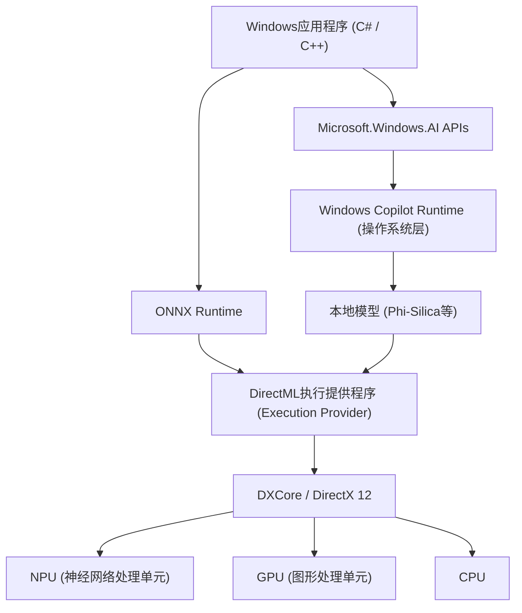
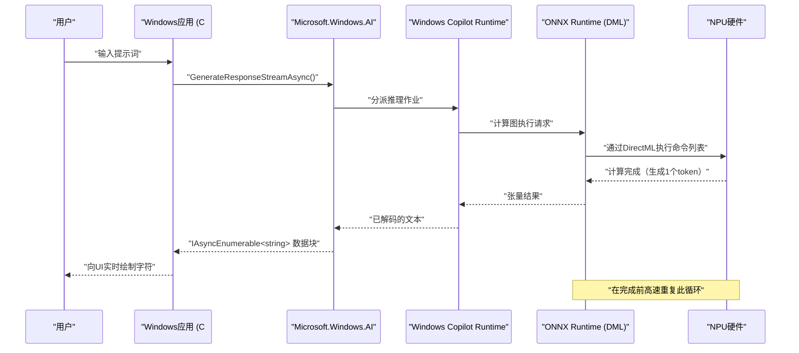

# Microsoft.Windows.AI最新API应用案例与示例代码：探索Windows Copilot Runtime的深渊

## 1. 引言：AI原生融入Windows的新时代

近年来，AI技术的发展日新月异，正从基于云端的大型语言模型（LLM）应用，快速向边缘设备（本地PC）上的AI推演发生范式转变。在这一过程中起核心作用的，正是Microsoft为Windows 11提供的“Windows Copilot Runtime”以及用于操作它的“Microsoft.Windows.AI”API。

利用云端API（如OpenAI或Azure OpenAI等）开发应用程序虽然容易，但始终伴随着延迟、隐私以及持续性成本等问题。另一方面，通过在本地运行AI模型，数据无需离开设备即可确保机密性，并能实现离线可用的超低延迟应用。

本文将针对未来Windows应用开发中必不可少的本地AI功能实现方法，结合C#和C++的实战示例代码，从架构到性能调优进行极为详细的全面解析。我们不仅停留在简单调用API的层面，还会深入探讨背后硬件（NPU或GPU）的利用、与DirectML的协同等高级技术细节。

## 2. Windows Copilot Runtime与架构全貌

Windows Copilot Runtime是一套AI技术栈，旨在让开发者能够轻松在Windows上集成AI模型，并发挥出最高性能。该运行时在操作系统层面抽象了硬件加速，并为开发者提供了统一的接口。



如上述架构图所示，应用程序通过使用高级的 `Microsoft.Windows.AI` API，可以直接访问内置于操作系统的较小规模语言模型（SLM：如Phi-Silica等）。此外，如果使用自定义模型，也可以通过ONNX Runtime和DirectML显式地利用硬件加速。操作系统层会优化工作负载在CPU、GPU和NPU之间的分配，因此开发者无需深入关注硬件差异，即可构建高性能的AI应用。

## 3. 硬件加速与NPU的数学评估

最新的Copilot+ PC搭载了专为AI处理而设计的处理器——NPU（Neural Processing Unit）。NPU的性能通常以TOPS（Tera Operations Per Second，每秒万亿次运算）来评估。

在AI模型推理中，特别是矩阵乘法（GEMM: General Matrix Multiply）的计算能力决定了吞吐量。硬件的理论最大性能 $P_{\text{peak}}$ 可以通过以下公式估算。

$$
P_{\text{peak}} = f \times N_{\text{cores}} \times N_{\text{MACs/core}} \times 2
$$

这里：
- $f$ 是NPU的时钟频率（Hz）
- $N_{\text{cores}}$ 是NPU内的核心数
- $N_{\text{MACs/core}}$ 是每核心的MAC（Multiply-Accumulate，乘加）单元数
- 最后的 $2$ 是因为1次MAC运算包含了乘法和加法两个操作（FLOPs/OPs）。

例如，对于频率为1.5GHz、4核心、每核拥有4096个MACs的NPU，
$$
P_{\text{peak}} = 1.5 \times 10^9 \times 4 \times 4096 \times 2 \approx 49.15 \text{ TOPS}
$$
这就从数学上证明了其性能足以满足Windows 11对于Copilot+ PC的40 TOPS的要求。

此外，AI模型尤其是LLM的推理（解码阶段）往往会受限于**内存带宽（Memory-Bound）**。系统内存的理论带宽 $BW$ 计算如下。

$$
BW = f_{\text{mem}} \times W_{\text{bus}} \times \frac{2}{8}
$$

如果是LPDDR5x-8533内存（$f_{\text{mem}} = 8533 \text{ MT/s}$）、128位总线（$W_{\text{bus}} = 128$），其带宽约为 $136 \text{ GB/s}$。在AI应用的优化中，如何节约这些带宽是至关重要的，这也是后文将提到的模型量化（Quantization）不可或缺的原因。

## 4. 开发环境搭建

要使用最新的Windows AI API，必须配置以下环境与工具链。

1. **操作系统**: Windows 11 版本 24H2 或更高版本（强烈推荐满足Copilot+ PC要求、搭载NPU的设备）
2. **SDK**: Windows App SDK (v1.5或以上，支持AI扩展版本)
3. **开发环境**: Visual Studio 2022 (v17.10或更高)，安装C++桌面开发工作负载与.NET桌面开发工作负载
4. **包管理**: 通过NuGet安装 `Microsoft.Windows.AI` 和 `Microsoft.ML.OnnxRuntime.DirectML`

```xml
<!-- .csproj 配置示例 -->
<ItemGroup>
  <PackageReference Include="Microsoft.Windows.AI" Version="1.0.0-preview1" />
  <PackageReference Include="Microsoft.WindowsAppSDK" Version="1.5.240311000" />
  <PackageReference Include="Microsoft.ML.OnnxRuntime.DirectML" Version="1.17.1" />
</ItemGroup>
```

## 5. 【深度解析 1】使用C#调用本地语言模型（Phi-Silica）

Windows Copilot Runtime内置了由Microsoft开发的高效小规模语言模型“Phi-Silica”作为操作系统的标准组件。借此，无需从网络下载以GB计的模型，即可在离线环境下实现高级的自然语言处理（文章摘要、代码生成、聊天机器人）。

以下是使用 `Microsoft.Windows.AI.Generative` 命名空间在C#中构建聊天AI的高级示例代码。该代码支持流式响应（Streaming Response），可以在不阻塞UI线程的情况下实时生成文本。

```csharp
using System;
using System.Text;
using System.Threading;
using System.Threading.Tasks;
using Microsoft.Windows.AI.Generative;

namespace WindowsAI.Sample
{
    public class LocalLanguageModelService
    {
        private LanguageModel _languageModel;
        private bool _isInitialized = false;

        /// <summary>
        /// 执行语言模型的初始化。检查NPU的可用性，并将模型加载到最优设备上。
        /// </summary>
        public async Task InitializeAsync()
        {
            if (_isInitialized) return;

            Console.WriteLine("正在检查本地AI模型（Phi-Silica）的系统要求与可用性...");
            
            // 检查模型在系统上是否可用 (如果不兼容可能会提示下载)
            var availability = await LanguageModel.CheckAvailabilityAsync();
            if (availability != LanguageModelAvailability.Available)
            {
                throw new InvalidOperationException($"当前无法使用本地AI模型。状态: {availability}");
            }

            // 创建模型实例（此时将映射到内存空间并初始化NPU）
            _languageModel = await LanguageModel.CreateAsync();
            _isInitialized = true;
            
            Console.WriteLine("语言模型初始化完成。已激活通过DirectML的硬件加速。");
        }

        /// <summary>
        /// 接收用户提示词，并以流式生成响应。
        /// </summary>
        public async Task GenerateResponseStreamAsync(string prompt, CancellationToken cancellationToken)
        {
            if (!_isInitialized) await InitializeAsync();

            Console.WriteLine($"\n[用户输入]: {prompt}\n[AI助手]: ");

            // 设置生成时的超参数
            var options = new LanguageModelOptions
            {
                Temperature = 0.7f,
                TopP = 0.9f,
                MaxTokens = 2048,
                RepetitionPenalty = 1.1f
            };

            // 构建对话上下文
            var context = new LanguageModelContext();
            context.AddSystemMessage("你是一个直接运行在Windows本地NPU上的高级AI助手。请逐步进行逻辑思考，并简明扼要地回答。");
            context.AddUserMessage(prompt);

            try
            {
                // 调用流式推理API
                var responseStream = _languageModel.GenerateResponseStreamAsync(context, options);

                // 异步迭代作为IAsyncEnumerable返回的块(chunk)
                await foreach (var chunk in responseStream.WithCancellation(cancellationToken))
                {
                    // 将生成的token（块）实时输出到控制台
                    // 如果是UI应用，可在此使用DispatcherQueue将其反映到TextBox等控件中
                    Console.Write(chunk.Text);
                }
                Console.WriteLine();
            }
            catch (OperationCanceledException)
            {
                Console.WriteLine("\n[用户或系统已取消生成]");
            }
            catch (Exception ex)
            {
                Console.WriteLine($"\n[发生致命错误: {ex.Message}]");
            }
        }
    }
}
```

### 5.1 C#实现中的架构解析
这段代码的核心在于通过 `LanguageModel.CheckAvailabilityAsync()` 进行执行前验证，以及通过 `GenerateResponseStreamAsync` 实现异步流式处理。在操作系统后台运行的Copilot Runtime接收到此API调用后，会在内部启动ONNX Runtime，并根据系统配置选择最优的执行提供程序（Execution Provider，在许多最新的PC上是DirectML + NPU）。

开发者完全不需要考虑模型的张量形状、分词器（Tokenizer）实现、KV Cache的内存管理等问题，仅用几行C#代码就能将最前沿的AI推理流水线集成到应用程序中。

## 6. 【深度解析 2】通过C++与DirectML实现自定义模型的高速推理

当处理操作系统标准语言模型无法覆盖的特定领域（如自定义的图像分割、语音识别、自定义目标检测模型等）时，开发者需要直接操作位于 `Microsoft.Windows.AI` 底层的ONNX Runtime和DirectML。

使用C++可以将内存分配优化到极限，并激发NPU/GPU的峰值性能。以下是使用DirectML在C++中执行ONNX格式自定义模型（例如：YOLOv8）的高级初始化与推理流水线的核心实现。

```cpp
#include <iostream>
#include <vector>
#include <string>
#include <stdexcept>
#include <onnxruntime_cxx_api.h>
#include <dml_provider_factory.h>

class CustomVisionAIProcessor {
private:
    Ort::Env env;
    Ort::Session session{nullptr};
    Ort::AllocatorWithDefaultOptions allocator;
    
public:
    CustomVisionAIProcessor(const std::wstring& modelPath) 
        : env(ORT_LOGGING_LEVEL_WARNING, "VisionAIProcessor") {
        
        Ort::SessionOptions sessionOptions;
        // 线程数优化
        sessionOptions.SetIntraOpNumThreads(1);
        // 将图优化级别设为最大
        sessionOptions.SetGraphOptimizationLevel(GraphOptimizationLevel::ORT_ENABLE_ALL);

        // 1. 添加 DirectML Execution Provider (DML EP)
        // device_id = 0 是系统默认推荐适配器（NPU或高性能GPU）
        const OrtApi& ortApi = Ort::GetApi();
        OrtDmlApi* dmlApi = nullptr;
        OrtStatus* status = ortApi.GetExecutionProviderApi("DML", ORT_API_VERSION, reinterpret_cast<void**>(&dmlApi));
        
        if (status == nullptr && dmlApi != nullptr) {
            Ort::ThrowOnError(dmlApi->SessionOptionsAppendExecutionProvider_DML(sessionOptions, 0));
            std::cout << "[Info] 已成功附加 DirectML Execution Provider。" << std::endl;
        } else {
            std::cerr << "[Warning] 获取 DirectML API 失败。将以 CPU 回退模式运行。" << std::endl;
            if (status != nullptr) ortApi.ReleaseStatus(status);
        }

        // 2. 加载模型并创建会话
        try {
            session = Ort::Session(env, modelPath.c_str(), sessionOptions);
            std::cout << "[Info] 成功加载ONNX模型，并编译了计算图。" << std::endl;
        } catch (const Ort::Exception& e) {
            std::cerr << "[Error] 模型加载失败: " << e.what() << std::endl;
            throw;
        }
    }

    void RunInference(const std::vector<float>& imageTensor, const std::vector<int64_t>& inputShape) {
        // 3. 创建输入张量的缓冲区
        Ort::MemoryInfo memoryInfo = Ort::MemoryInfo::CreateCpu(OrtArenaAllocator, OrtMemTypeDefault);
        Ort::Value inputTensor = Ort::Value::CreateTensor<float>(
            memoryInfo, 
            const_cast<float*>(imageTensor.data()), 
            imageTensor.size(), 
            inputShape.data(), 
            inputShape.size()
        );

        // 4. 动态获取输入输出节点名称
        auto inputNamePtr = session.GetInputNameAllocated(0, allocator);
        auto outputNamePtr = session.GetOutputNameAllocated(0, allocator);
        const char* inputNames[] = { inputNamePtr.get() };
        const char* outputNames[] = { outputNamePtr.get() };

        // 5. 执行推理 (将通过DirectML卸载到NPU/GPU)
        std::cout << "[Info] 开始执行推理引擎..." << std::endl;
        auto startTime = std::chrono::high_resolution_clock::now();

        auto outputTensors = session.Run(Ort::RunOptions{nullptr}, inputNames, &inputTensor, 1, outputNames, 1);

        auto endTime = std::chrono::high_resolution_clock::now();
        auto duration = std::chrono::duration_cast<std::chrono::milliseconds>(endTime - startTime);

        // 6. 获取并解析结果张量
        float* outputData = outputTensors.front().GetTensorMutableData<float>();
        size_t outputSize = outputTensors.front().GetTensorTypeAndShapeInfo().GetElementCount();
        
        std::cout << "[Result] 推理完成: " << duration.count() << " ms" << std::endl;
        std::cout << "[Result] 输出张量的元素数量: " << outputSize << std::endl;
        // ※此后将对输出张量实现NMS（非极大值抑制）及绘制边界框等处理
    }
};

int main() {
    try {
        // 要执行的ONNX模型路径
        CustomVisionAIProcessor processor(L"models/yolov8n_quantized.onnx");
        
        // 推理用的虚拟图像数据 (批大小1 x 3通道 x 640 x 640)
        std::vector<int64_t> inputShape = {1, 3, 640, 640};
        std::vector<float> dummyImage(1 * 3 * 640 * 640, 0.5f);
        
        processor.RunInference(dummyImage, inputShape);
    } catch (const std::exception& e) {
        std::cerr << "程序异常终止: " << e.what() << std::endl;
        return -1;
    }
    return 0;
}
```

### 6.1 C++中的内存管理与零拷贝（Zero-Copy）推理的重要性
在C++中使用DirectML的最大优势在于能够与DirectX 12 (DX12) 进行紧密集成。上述代码出于教学目的，包含了标准CPU内存的数据拷贝，但在实际的游戏引擎或视频处理应用中，很多时候我们已经通过DX12将图像（纹理）保留在GPU或NPU的内存空间上了。

在这种情况下，可以利用 `OrtDmlApi` 的高级绑定功能，将DX12资源直接映射为ONNX Runtime的张量，从而实现“**零拷贝推理 (Zero-Copy Inference)**”。这彻底消除了PCIe总线间的数据传输开销（即消耗前文提到的带宽 $BW$），能够极大提升实时视频处理的帧率。

## 7. 性能优化与最佳实践

在使用Windows AI API和DirectML开发顶级AI应用时，以下是必不可少的优化策略总结。

### 7.1 模型量化 (Quantization) 与 Olive Toolkit
要发挥NPU的真正实力，将AI模型的权重和激活从FP32（单精度浮点数）**量化（Quantize）**为INT8或INT4是绝对前提。NPU的架构专为整数运算优化，与FP32相比，INT8理论上能实现4倍的吞吐量，并大幅节省功耗。

使用Microsoft提供的 `Olive (ONNX Live)` 工具链，可以将PyTorch等模型针对Windows环境进行自动优化。Olive强力支持对Transformer模型的特殊注意力优化以及针对不同硬件的图编译。

### 7.2 批处理 vs 交互式流的权衡
在API调用中，将多个推理请求汇总进行批处理，可以提高NPU的利用率（Compute Utilization）。然而，在聊天机器人等交互式UI中，影响用户体验（UX）的决定性因素往往不是吞吐量，而是显示第一个token所需的时间（TTFT: Time To First Token）。
因此，对于交互式UI，最佳实践是将批量大小设置为1，并优先考虑流式生成设计。

### 7.3 与后台任务及操作系统的协同
AI推理会大量消耗本地电力和系统资源。应用应与Windows的 `App Lifecycle API` 协同，当应用程序转入后台时，需实现暂停（Suspend）低优先级的推理任务或限制资源消耗的机制。



该序列图展示了在毫不阻塞UI线程的情况下，数据从最底层的NPU硬件如流水般传输至应用的展示层，呈现了异步处理的美感。

## 8. 未来展望与Windows AI的进化

`Microsoft.Windows.AI` API与Copilot Runtime目前正处于快速演进之中。在面向开发者的未来更新中，预计将出现以下范式转变：

- **多模态API的系统原生集成**：不仅是文本，还将在操作系统级别原生提供对语音、图像乃至实时视频流的无缝同步处理及跨模态AI推理。
- **系统级RAG（检索增强生成）支持**：在操作系统安全沙盒内，将本地PC中的个人文档和Windows Search索引与AI模型协同，构建在完全保护用户隐私下的超高级个人AI助手。
- **NPU资源动态伸缩**：当多个AI应用（例如后台运行的降噪和前台运行的代码生成）同时运行时，Windows内核调度程序将动态切换NPU的执行上下文，以保证服务质量（QoS）。

## 9. 结论：本地AI正在改变应用的未来

Windows 11的Copilot Runtime和 `Microsoft.Windows.AI` API为所有Windows开发者带来了一件极为强大的武器——“本地AI”。我们再也不必完全依赖云端API了。现在可以消除延迟，坚守隐私，为用户提供哪怕在离线状态下也能完美运行的下一代AI体验。

请活用本文所讲解的利用C#集成系统标准语言模型的知识、数学层面的性能评估，以及通过C++与DirectML进行的极限硬件优化，亲手创造次世代的“AI原生”Windows应用。AI带来的无限可能，就在你编写的代码的前方。

---
*※注意事项：本文是基于2026年9月当前的预览版API及最新规范撰写。由于Windows更新可能会更改API规范或硬件要求，在实际应用时，请务必参考Microsoft Learn的官方文档。*
