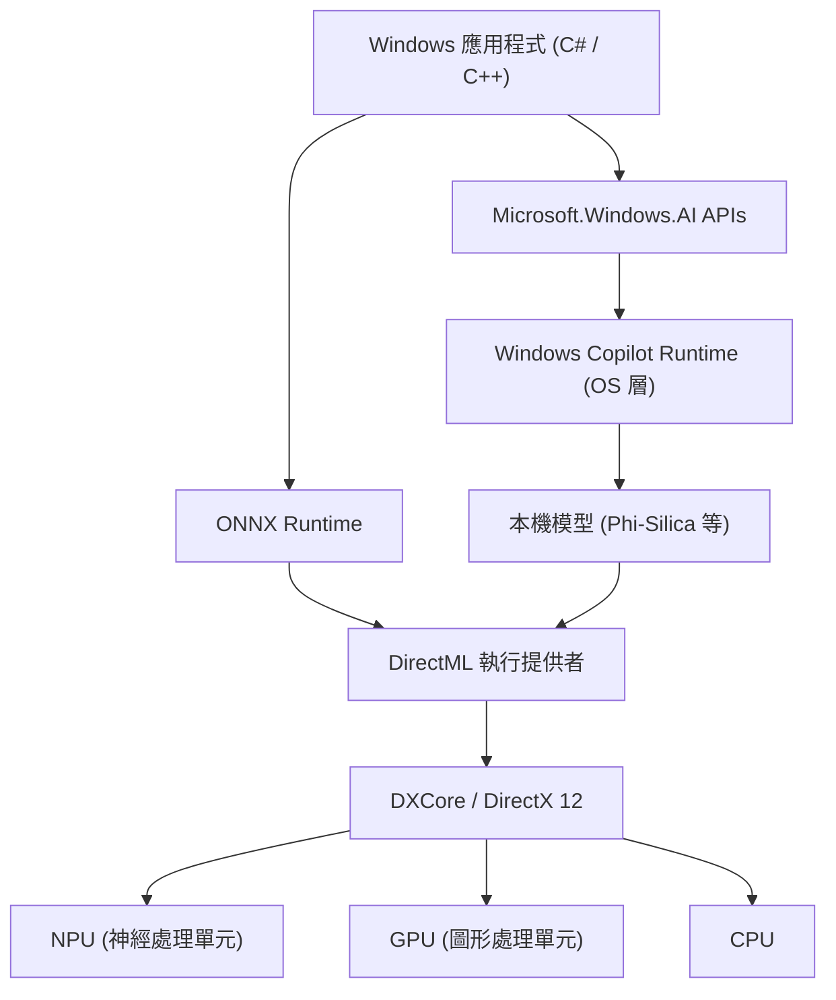
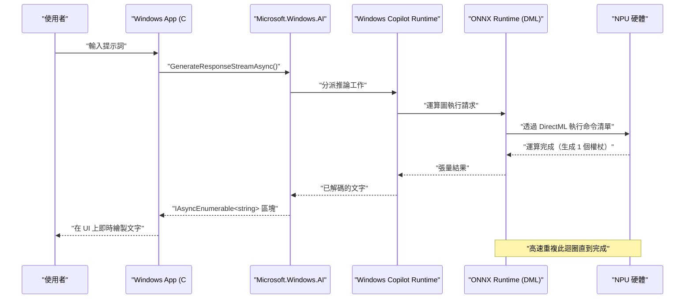

# Microsoft.Windows.AI 的最新 API 應用案例與範例程式碼：探索 Windows Copilot Runtime 的深淵

## 1. 前言：AI 原生內建於 Windows 的新時代

近年來，AI 技術的發展日新月異，正迅速從雲端上的大型語言模型（LLM）應用，典範轉移至邊緣裝置（本機 PC）上的 AI 推論。其中扮演核心角色的，正是 Microsoft 為 Windows 11 提供的「Windows Copilot Runtime」以及用於操作它的「Microsoft.Windows.AI」API。

使用雲端 API（如 OpenAI 或 Azure OpenAI 等）開發應用程式雖然容易，但總是伴隨著延遲、隱私和持續成本的挑戰。另一方面，透過在本機執行 AI 模型，我們可以在機密資料不離開裝置的情況下，實現即使在離線狀態也能運作的超低延遲應用程式。

本文將針對未來 Windows 應用程式開發中不可或缺的本機 AI 功能實作方法，搭配 C# 與 C++ 的實用範例程式碼，從架構到效能調校進行極為詳細且徹底的解說。不僅僅是呼叫 API，我們還會深入探討背後硬體（NPU 與 GPU）的運用、與 DirectML 的整合等進階技術細節。

## 2. Windows Copilot Runtime 與架構全貌

Windows Copilot Runtime 是一套 AI 堆疊，專為讓開發者能輕鬆將 AI 模型整合至 Windows 上，並發揮最高效能而設計。此執行階段在 OS 層級將硬體加速抽象化，為開發者提供統一的介面。



如上述架構圖所示，應用程式可以透過使用高階的 `Microsoft.Windows.AI` API，直接存取內建於 OS 中的小型語言模型（SLM：如 Phi-Silica 等）。此外，若使用自訂模型，也可以透過 ONNX Runtime 與 DirectML 明確地利用硬體加速。由於 OS 層會最佳化分配給 CPU、GPU 與 NPU 的工作負載，開發者無需深入了解硬體差異，即可建構高效能的 AI 應用程式。

## 3. 硬體加速與 NPU 的數學評估

最新的 Copilot+ PC 搭載了專門處理 AI 運算的處理器，即 NPU（神經處理單元）。NPU 的效能通常以 TOPS（Tera Operations Per Second，每秒兆次運算）來評估。

在 AI 模型的推論中，矩陣乘法（GEMM: General Matrix Multiply）的運算能力尤其決定了吞吐量。硬體的理論最大效能 $P_{\text{peak}}$ 可以用以下公式估算：

$$
P_{\text{peak}} = f \times N_{\text{cores}} \times N_{\text{MACs/core}} \times 2
$$

其中：
- $f$ 是 NPU 的時脈頻率（Hz）
- $N_{\text{cores}}$ 是 NPU 內的核心數量
- $N_{\text{MACs/core}}$ 是每個核心的 MAC（乘積累加）單元數量
- 最後的 $2$ 是因為一次 MAC 運算包含乘法與加法兩個操作（FLOPs/OPs）。

例如，若 NPU 頻率為 1.5GHz、4 個核心、每個核心有 4096 個 MACs：
$$
P_{\text{peak}} = 1.5 \times 10^9 \times 4 \times 4096 \times 2 \approx 49.15 \text{ TOPS}
$$
在數學上證明了此效能足以跨越 Windows 11 的 Copilot+ PC 要求（40 TOPS）。

此外，AI 模型，尤其是 LLM 的推論（解碼階段）往往受限於**記憶體頻寬（Memory-Bound）**。系統記憶體的理論頻寬 $BW$ 計算方式如下：

$$
BW = f_{\text{mem}} \times W_{\text{bus}} \times \frac{2}{8}
$$

若使用 LPDDR5x-8533 記憶體（$f_{\text{mem}} = 8533 \text{ MT/s}$）、128 位元匯流排（$W_{\text{bus}} = 128$），頻寬約為 $136 \text{ GB/s}$。在最佳化 AI 應用程式時，如何節省此頻寬至關重要，因此後文將提到的模型量化（Quantization）變得不可或缺。

## 4. 開發環境設定

要使用最新的 Windows AI API，需要準備以下環境與工具鏈：

1. **OS**: Windows 11 版本 24H2 或更新版本（強烈建議使用搭載符合 Copilot+ PC 要求之 NPU 的裝置）
2. **SDK**: Windows App SDK (v1.5 或以上，支援 AI 擴充功能的版本)
3. **開發環境**: Visual Studio 2022 (v17.10 或以上)，具備 C++ 桌面開發與 .NET 桌面開發工作負載
4. **套件**: 透過 NuGet 安裝 `Microsoft.Windows.AI` 與 `Microsoft.ML.OnnxRuntime.DirectML`

```xml
<!-- .csproj 設定範例 -->
<ItemGroup>
  <PackageReference Include="Microsoft.Windows.AI" Version="1.0.0-preview1" />
  <PackageReference Include="Microsoft.WindowsAppSDK" Version="1.5.240311000" />
  <PackageReference Include="Microsoft.ML.OnnxRuntime.DirectML" Version="1.17.1" />
</ItemGroup>
```

## 5. 【Deep Dive 1】使用 C# 活用本機語言模型（Phi-Silica）

Windows Copilot Runtime 中內建了由 Microsoft 開發的高效小型語言模型「Phi-Silica」作為 OS 標準元件。這使得我們無需從網路下載 GB 級別的模型，即可在離線環境下進行進階的自然語言處理（文章摘要、程式碼生成、聊天機器人）。

以下是使用 `Microsoft.Windows.AI.Generative` 命名空間，在 C# 中建構聊天 AI 的進階範例程式碼。支援串流回應，並能即時生成文字而不阻塞 UI 執行緒。

```csharp
using System;
using System.Text;
using System.Threading;
using System.Threading.Tasks;
using Microsoft.Windows.AI.Generative;

namespace WindowsAI.Sample
{
    public class LocalLanguageModelService
    {
        private LanguageModel _languageModel;
        private bool _isInitialized = false;

        /// <summary>
        /// 進行語言模型的初始化。檢查 NPU 的可用性，並將模型載入至最佳裝置。
        /// </summary>
        public async Task InitializeAsync()
        {
            if (_isInitialized) return;

            Console.WriteLine("正在檢查本機 AI 模型（Phi-Silica）的系統需求與可用性...");
            
            // 檢查模型在系統上是否可用 (不支援時可能會提示下載)
            var availability = await LanguageModel.CheckAvailabilityAsync();
            if (availability != LanguageModelAvailability.Available)
            {
                throw new InvalidOperationException($"目前無法使用本機 AI 模型。狀態: {availability}");
            }

            // 建立模型執行個體（此時會進行記憶體空間對應與 NPU 初始化）
            _languageModel = await LanguageModel.CreateAsync();
            _isInitialized = true;
            
            Console.WriteLine("語言模型初始化完成。透過 DirectML 的硬體加速已啟用。");
        }

        /// <summary>
        /// 接收使用者的提示詞，並以串流方式生成回應。
        /// </summary>
        public async Task GenerateResponseStreamAsync(string prompt, CancellationToken cancellationToken)
        {
            if (!_isInitialized) await InitializeAsync();

            Console.WriteLine($"\n[使用者輸入]: {prompt}\n[AI 助理]: ");

            // 設定生成時的超參數
            var options = new LanguageModelOptions
            {
                Temperature = 0.7f,
                TopP = 0.9f,
                MaxTokens = 2048,
                RepetitionPenalty = 1.1f
            };

            // 建立對話上下文
            var context = new LanguageModelContext();
            context.AddSystemMessage("你是一個直接在 Windows 本機 NPU 上運行的高階 AI 助理。請逐步且合乎邏輯地思考，並簡潔地回答。");
            context.AddUserMessage(prompt);

            try
            {
                // 呼叫串流推論 API
                var responseStream = _languageModel.GenerateResponseStreamAsync(context, options);

                // 以非同步方式反覆處理作為 IAsyncEnumerable 傳回的區塊
                await foreach (var chunk in responseStream.WithCancellation(cancellationToken))
                {
                    // 將生成的權杖（區塊）即時輸出至主控台
                    // 若為 UI 應用程式，可在此處使用 DispatcherQueue 反映至 TextBox 等元件
                    Console.Write(chunk.Text);
                }
                Console.WriteLine();
            }
            catch (OperationCanceledException)
            {
                Console.WriteLine("\n[生成已由使用者或系統取消]");
            }
            catch (Exception ex)
            {
                Console.WriteLine($"\n[發生致命錯誤: {ex.Message}]");
            }
        }
    }
}
```

### 5.1 C# 實作中的架構解說
這段程式碼的核心在於透過 `LanguageModel.CheckAvailabilityAsync()` 進行執行前驗證，以及透過 `GenerateResponseStreamAsync` 進行非同步串流。在 OS 背景運作的 Copilot Runtime 接收到此 API 呼叫後，會在內部啟動 ONNX Runtime，並根據系統設定選擇最佳的執行提供者（Execution Provider，在許多最新 PC 上為 DirectML + NPU）。

開發者完全無需考慮模型的張量形狀、分詞器實作、KV 快取的記憶體管理等細節，只需幾行 C# 程式碼即可將最先進的 AI 推論管線整合到應用程式中。

## 6. 【Deep Dive 2】透過 C++ 與 DirectML 進行自訂模型的高速推論

當處理 OS 標準語言模型無法涵蓋的特定領域（例如：專有影像分割、語音辨識、自訂物件偵測模型等）時，開發者需要直接操作位於 `Microsoft.Windows.AI` 底層的 ONNX Runtime 與 DirectML。

使用 C++，您可以將記憶體配置最佳化至極限，並發揮 NPU/GPU 的峰值效能。以下是使用 DirectML 在 C++ 中執行 ONNX 格式自訂模型（例：YOLOv8）的進階初始化與推論管線核心實作。

```cpp
#include <iostream>
#include <vector>
#include <string>
#include <stdexcept>
#include <onnxruntime_cxx_api.h>
#include <dml_provider_factory.h>

class CustomVisionAIProcessor {
private:
    Ort::Env env;
    Ort::Session session{nullptr};
    Ort::AllocatorWithDefaultOptions allocator;
    
public:
    CustomVisionAIProcessor(const std::wstring& modelPath) 
        : env(ORT_LOGGING_LEVEL_WARNING, "VisionAIProcessor") {
        
        Ort::SessionOptions sessionOptions;
        // 執行緒數量最佳化
        sessionOptions.SetIntraOpNumThreads(1);
        // 將圖形最佳化層級設為最大
        sessionOptions.SetGraphOptimizationLevel(GraphOptimizationLevel::ORT_ENABLE_ALL);

        // 1. 新增 DirectML 執行提供者 (DML EP)
        // device_id = 0 是系統預設推薦的介面卡（NPU 或高效能 GPU）
        const OrtApi& ortApi = Ort::GetApi();
        OrtDmlApi* dmlApi = nullptr;
        OrtStatus* status = ortApi.GetExecutionProviderApi("DML", ORT_API_VERSION, reinterpret_cast<void**>(&dmlApi));
        
        if (status == nullptr && dmlApi != nullptr) {
            Ort::ThrowOnError(dmlApi->SessionOptionsAppendExecutionProvider_DML(sessionOptions, 0));
            std::cout << "[Info] 已成功附加 DirectML 執行提供者。" << std::endl;
        } else {
            std::cerr << "[Warning] 無法取得 DirectML API。將以 CPU 降級模式執行。" << std::endl;
            if (status != nullptr) ortApi.ReleaseStatus(status);
        }

        // 2. 載入模型並建立工作階段
        try {
            session = Ort::Session(env, modelPath.c_str(), sessionOptions);
            std::cout << "[Info] 成功載入 ONNX 模型，且已編譯運算圖。" << std::endl;
        } catch (const Ort::Exception& e) {
            std::cerr << "[Error] 模型載入失敗: " << e.what() << std::endl;
            throw;
        }
    }

    void RunInference(const std::vector<float>& imageTensor, const std::vector<int64_t>& inputShape) {
        // 3. 建立輸入張量緩衝區
        Ort::MemoryInfo memoryInfo = Ort::MemoryInfo::CreateCpu(OrtArenaAllocator, OrtMemTypeDefault);
        Ort::Value inputTensor = Ort::Value::CreateTensor<float>(
            memoryInfo, 
            const_cast<float*>(imageTensor.data()), 
            imageTensor.size(), 
            inputShape.data(), 
            inputShape.size()
        );

        // 4. 動態取得輸入與輸出節點名稱
        auto inputNamePtr = session.GetInputNameAllocated(0, allocator);
        auto outputNamePtr = session.GetOutputNameAllocated(0, allocator);
        const char* inputNames[] = { inputNamePtr.get() };
        const char* outputNames[] = { outputNamePtr.get() };

        // 5. 執行推論 (透過 DirectML 卸載至 NPU/GPU)
        std::cout << "[Info] 開始執行推論引擎..." << std::endl;
        auto startTime = std::chrono::high_resolution_clock::now();

        auto outputTensors = session.Run(Ort::RunOptions{nullptr}, inputNames, &inputTensor, 1, outputNames, 1);

        auto endTime = std::chrono::high_resolution_clock::now();
        auto duration = std::chrono::duration_cast<std::chrono::milliseconds>(endTime - startTime);

        // 6. 取得並解析結果張量
        float* outputData = outputTensors.front().GetTensorMutableData<float>();
        size_t outputSize = outputTensors.front().GetTensorTypeAndShapeInfo().GetElementCount();
        
        std::cout << "[Result] 推論完成: " << duration.count() << " ms" << std::endl;
        std::cout << "[Result] 輸出張量的元素數量: " << outputSize << std::endl;
        // ※此後，將對輸出張量實作 NMS（非極大值抑制）或繪製邊界方塊的處理
    }
};

int main() {
    try {
        // 要執行的 ONNX 模型路徑
        CustomVisionAIProcessor processor(L"models/yolov8n_quantized.onnx");
        
        // 用於推論的假影像資料 (批次大小 1 x 3 頻道 x 640 x 640)
        std::vector<int64_t> inputShape = {1, 3, 640, 640};
        std::vector<float> dummyImage(1 * 3 * 640 * 640, 0.5f);
        
        processor.RunInference(dummyImage, inputShape);
    } catch (const std::exception& e) {
        std::cerr << "程式異常終止: " << e.what() << std::endl;
        return -1;
    }
    return 0;
}
```

### 6.1 C++ 中記憶體管理與零拷貝推論的重要性
在 C++ 中使用 DirectML 的最大優勢，在於能與 DirectX 12 (DX12) 進行緊密整合。上述程式碼出於教學目的，包含了從標準 CPU 記憶體複製資料的過程，但在實際的遊戲引擎或影像處理應用程式中，經常會使用 DX12 將影像（紋理）保留在 GPU 或 NPU 的記憶體空間中。

在這種情況下，可以利用 `OrtDmlApi` 的進階繫結功能，直接將 DX12 資源對應為 ONNX Runtime 的張量，實現「**零拷貝推論 (Zero-Copy Inference)**」。如此一來，PCIe 匯流排之間的資料傳輸開銷（即前述頻寬 $BW$ 的消耗）將完全消失，進而大幅提升即時影片處理的畫面更新率。

## 7. 效能最佳化與最佳實務

在使用 Windows AI API 或 DirectML 開發頂級 AI 應用程式時，不可或缺的最佳化策略彙整如下：

### 7.1 模型量化 (Quantization) 與 Olive 工具組
要發揮 NPU 的真正實力，將 AI 模型的權重與激勵值從 FP32（單精度浮點數）**量化（Quantization）**至 INT8 或 INT4 絕對是必要條件。NPU 的架構專為整數運算而設計，相較於 FP32，INT8 在理論上能達到 4 倍的吞吐量，並大幅節省耗電。

透過使用 Microsoft 提供的 `Olive (ONNX Live)` 工具鏈，可以將 PyTorch 等模型自動針對 Windows 環境進行最佳化。Olive 能強力支援對 Transformer 模型的特殊注意力最佳化，以及針對各種硬體的運算圖編譯。

### 7.2 批次處理 vs 互動式串流的權衡
在 API 呼叫中，將多個推論請求合併進行批次處理，可以提高 NPU 的利用率（Compute Utilization）。然而，在如聊天機器人這類互動式 UI 的情況下，決定使用者體驗（UX）的並非吞吐量，而是顯示第一個權杖所需的時間（TTFT: Time To First Token）。
因此，在互動式 UI 中，最佳實務是將批次大小設為 1，並優先採用串流生成設計。

### 7.3 背景工作與 OS 的整合
AI 推論會大量消耗本機的電力與系統資源。必須與 Windows 的 `App Lifecycle API` 整合，當應用程式轉入背景執行時，實作暫停（Suspend）優先度較低的推論工作或限制資源消耗的機制。



此循序圖展示了非同步處理之美：在完全不阻塞 UI 執行緒的情況下，資料如同水流般從最底層的 NPU 硬體，一路串流至應用程式的呈現層。

## 8. 未來展望與 Windows AI 的進化

`Microsoft.Windows.AI` API 與 Copilot Runtime 目前正處於快速進化階段。在未來的開發者更新中，可望出現以下典範轉移：

- **多模態 API 內建於 OS**: 不僅限於文字，還能無縫同時處理語音、影像，甚至是即時視訊來源，在 OS 層級標準提供跨模態的 AI 推論。
- **RAG (檢索增強生成) 的系統層級支援**: 在 OS 安全的沙盒中，將本機 PC 內的個人文件庫或 Windows Search 索引與 AI 模型結合，在完全保護使用者隱私的狀態下建構超高階的個人 AI 助理。
- **NPU 的動態資源擴展**: 當多個 AI 應用程式（例如，背景中的降噪功能與前景的程式碼生成）同時運作時，Windows 核心排程器會動態切換 NPU 的執行上下文，以保證服務品質（QoS）的機制。

## 9. 結論：本機 AI 將改變應用程式的未來

Windows 11 的 Copilot Runtime 與 `Microsoft.Windows.AI` API，為所有 Windows 開發者帶來了名為「本機 AI」的極強大武器。我們不再需要完全依賴雲端 API。我們能消除延遲、堅守隱私，同時為使用者提供即使在離線狀態下也能完美運作的次世代 AI 體驗。

請活用本文所解說的知識，包括使用 C# 整合系統標準語言模型、數學效能評估，以及使用 C++ 與 DirectML 進行極限硬體最佳化，親手創造次世代的「AI 原生」Windows 應用程式。AI 帶來的無限可能，正展現在您所撰寫的程式碼前方。

---
*※注意事項：本文是根據 2026 年 9 月時的預覽版 API 及最新規格所撰寫。由於 Windows 更新可能會改變 API 規格或硬體需求，因此在實作時請務必參閱 Microsoft Learn 的官方文件。*
