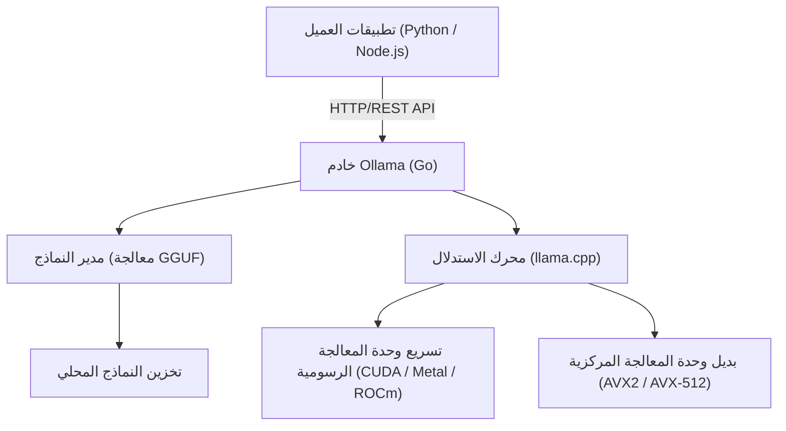
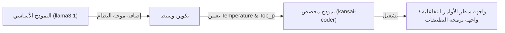

# مقدمة: لماذا نحتاج إلى LLM المحلي؟

مع ظهور النماذج اللغوية الكبيرة (LLM)، شهدت حياتنا وأساليب تطويرنا تغييرات جذرية. تستمر خدمات الذكاء الاصطناعي القوية المستندة إلى السحابة مثل ChatGPT و Claude و Gemini في التطور يومًا بعد يوم، وتقدم قدرات استنتاج متقدمة للغاية. ومع ذلك، فإن النماذج اللغوية الكبيرة السحابية ليست دائمًا الحل الأمثل لجميع حالات الاستخدام. تواجه نماذج LLM السحابية التحديات التالية:

1. **مشكلات الخصوصية والأمان**: في العديد من الحالات، لا يُسمح بإرسال البيانات التي تحتوي على معلومات سرية أو شخصية إلى خوادم خارجية من منظور الامتثال المؤسسي والأمان.
2. **عدم اليقين في التكلفة**: نظرًا لأن رسوم استخدام واجهة برمجة التطبيقات تعتمد على عدد الرموز (Tokens)، فإن الأنظمة التي تعالج كميات كبيرة من البيانات أو تجري طلبات متكررة تواجه خطر التكاليف التشغيلية المفتوحة.
3. **زمن الوصول والاعتماد على الشبكة**: بالنسبة للاستخدام في البيئات غير المتصلة بالإنترنت أو التشغيل على أجهزة الحافة التي تتطلب زمن وصول منخفضًا للغاية، يصبح اتصال الشبكة عنق الزجاجة.
4. **تقييد المورد (Vendor Lock-in)**: الاعتماد على نموذج مزود معين قد يجعلك عرضة للتغييرات غير المقصودة في السلوك بسبب إغلاق الخدمة في المستقبل، أو التغييرات في شروط الخدمة، أو تحديثات النموذج.

"LLM المحلي" يجذب الانتباه كوسيلة لحل هذه التحديات. من خلال تشغيل النموذج على أجهزتك الخاصة، يمكنك الاستفادة من الذكاء الاصطناعي بحرية دون إرسال أي بيانات إلى الخارج ودون القلق بشأن التكاليف الشهرية.

في هذه المقالة، سنشرح بالتفصيل "**Ollama**"، وهي أداة تسمح لك بإدخال نماذج LLM المحلية وإدارتها وربطها بواجهات برمجة التطبيقات بسهولة مذهلة، من أساسياتها وبنيتها الداخلية، إلى تكامل API المتقدم باستخدام Python و Node.js، وحتى صيغ حساب ضبط الأداء.

---

# ما هو Ollama؟ بنيته الداخلية

Ollama هي منصة تتيح التنفيذ والإدارة السهلة للنماذج اللغوية الكبيرة مفتوحة المصدر (مثل Llama 3 و Phi-3 و Mistral و Gemma) في بيئتك المحلية. في الماضي، كان إعداد بيئة LLM محلية يتطلب خطوات معقدة للغاية مثل إعداد بيئة Python، وتثبيت أدوات CUDA، وحل تبعيات PyTorch، وتنزيل ملفات النماذج الضخمة من Hugging Face وتحويل تنسيقها (مثل من Safetensors إلى GGUF).

يقوم Ollama بإخفاء هذه التعقيدات ويتيح لك التعامل مع نماذج LLM بسهولة مماثلة لـ Docker. باستخدام أمر واحد، يمكنك تنزيل النموذج (`pull`)، وتشغيله (`run`)، وإطلاقه كخادم HTTP.

## التكنولوجيا الأساسية: غلاف (Wrapper) لـ llama.cpp

يعمل كمحرك استدلال خلفي لـ Ollama مكتبة "**llama.cpp**"، وهي مكتبة استدلال LLM سريعة مكتوبة بلغة C/C++. تتمتع llama.cpp بالقدرة على تنفيذ النماذج عن طريق الاستفادة القصوى من أداء الأجهزة، سواء كان ذلك على Apple Silicon (Metal) أو NVIDIA GPU (CUDA) أو AMD GPU (ROCm) أو حتى في البيئات التي تعتمد على وحدة المعالجة المركزية (CPU) فقط.

يتضمن Ollama نظام llama.cpp بداخله، ويتبنى بنية حيث توفر عملية الخادم المكتوبة بلغة Go واجهة برمجة تطبيقات REST، وتستدعي محرك استدلال llama.cpp في الخلفية.

يوضح مخطط Mermaid التالي البنية العامة لـ Ollama.



تسمح هذه البنية للمطورين بالوصول إلى قدرات الاستدلال المتقدمة من خلال طلبات HTTP القياسية دون الحاجة إلى القلق بشأن بناء C++ أو الإعدادات الدقيقة لبرامج تشغيل وحدة المعالجة الرسومية (GPU).

---

# تثبيت Ollama والإعداد الأولي

تثبيت Ollama بسيط للغاية. يتم توفير ملفات تنفيذية محسنة لكل نظام تشغيل.

## macOS / Windows

كل ما عليك فعله هو تنزيل المثبت من الموقع الرسمي (https://ollama.com/) وتشغيله. يتعرف إصدار macOS تلقائيًا على واجهة برمجة تطبيقات Metal لـ Apple Silicon، ويتعرف إصدار Windows على NVIDIA GPU (CUDA)، ويقوم بتمكين تسريع الأجهزة إذا كان متاحًا.

## Linux

في بيئات Linux (مثل Ubuntu)، سيؤدي تنفيذ أمر السطر الواحد التالي إلى تثبيت المكونات الضرورية وبدء خادم Ollama كخدمة systemd.

```bash
curl -fsSL https://ollama.com/install.sh | sh
```

بمجرد اكتمال التثبيت، دعنا نتحقق من الإصدار في الجهاز الطرفي (Terminal).

```bash
ollama --version
```
إذا تم عرض معلومات الإصدار، فقد تم التثبيت بنجاح.

## التشغيل باستخدام Docker

إذا كنت لا ترغب في تلويث بيئتك الحالية أو كنت ترغب في دمجه في بنية أساسية قائمة على الحاويات، يمكنك أيضًا استخدام صورة Docker الرسمية. إذا كنت تستخدم وحدة معالجة رسومية (GPU)، فستحتاج إلى تثبيت NVIDIA Container Toolkit.

```bash
# للتشغيل باستخدام وحدة المعالجة المركزية (CPU) فقط
docker run -d -v ollama:/root/.ollama -p 11434:11434 --name ollama ollama/ollama

# لاستخدام NVIDIA GPU
docker run -d --gpus=all -v ollama:/root/.ollama -p 11434:11434 --name ollama ollama/ollama
```

بشكل افتراضي، يستمع خادم Ollama على الرابط `http://localhost:11434`.

---

# إدارة النماذج وأوامر CLI الأساسية

أكبر جاذبية لـ Ollama هي أن إدارة النماذج بديهية للغاية. يمكنك تجربة نماذج مختلفة بنفس الشعور بالتعامل مع صور Docker.

## 1. تشغيل النموذج (`run`)

هذا هو الأمر الأكثر استخدامًا. إذا لم يكن النموذج المحدد موجودًا، فسيتم تنزيله تلقائيًا (`pull`)، ثم سيتم تشغيل موجه (prompt) تفاعلي.

```bash
ollama run llama3.1
```

سيؤدي تشغيل الأمر أعلاه إلى بدء تشغيل أحدث طراز من Meta وهو Llama 3.1 (إصدار 8B Parameters). عند إدخال رسالة في الموجه، سيتم عرض رد النموذج في شكل دفق (Streaming). للخروج، اكتب `/bye` أو اضغط على `Ctrl+D`.

## 2. تنزيل النماذج (`pull`)

استخدم الأمر `pull` إذا كنت تريد تنزيل النموذج في الخلفية مسبقًا.

```bash
ollama pull phi3:instruct
ollama pull mistral:v0.3
```

في مكتبة نماذج Ollama، يمكنك تحديد الإصدار ومستوى التكميم (Quantization) بتنسيق `ModelName:Tag`. إذا حذفت العلامة، فسيتم تطبيق `latest`، ولكن يمكنك أيضًا تحديد نموذج تكميم معين بشكل صريح (مثل: `llama3:8b-instruct-q4_0`).

### ما هو التكميم (Quantization)؟

لنتطرق قليلاً إلى التكميم هنا. عادةً ما يحتفظ LLM بمعلمة وزن (weight parameter) واحدة كفاصلة عائمة بحجم 16 بت (FP16). في حالة نموذج يحتوي على 8 مليار (8B) معلمة، ستستهلك الأوزان وحدها حوالي 16 غيغابايت من VRAM. التكميم هو تقنية لضغط هذا إلى أنواع أعداد صحيحة 4 بت (Q4) أو 8 بت (Q8).

يتيح لك التكميم تقليل متطلبات الذاكرة وعرض النطاق الترددي للذاكرة بشكل كبير مع تقليل تدهور دقة النموذج. يتم توزيع النماذج في Ollama بشكل افتراضي بتنسيق GGUF مع التكميم الأمثل (غالبًا 4 بت).

## 3. عرض قائمة النماذج (`list`)

يعرض قائمة بالنماذج التي تم تنزيلها محليًا وأحجامها.

```bash
ollama list
```
مثال على الإخراج:
```text
NAME            ID              SIZE      MODIFIED
llama3.1:latest 43f7a214e532    4.7 GB    2 hours ago
phi3:instruct   a2c89ceaed85    2.3 GB    3 days ago
```

## 4. حذف النماذج (`rm`)

احذف النماذج التي لم تعد هناك حاجة إليها لتحرير مساحة القرص.

```bash
ollama rm phi3:instruct
```

---

# تخصيص النماذج باستخدام Modelfile

في Ollama، يمكنك إنشاء نماذجك المخصصة عن طريق حقن مطالبات النظام (System Prompts) وضبط المعلمات الفائقة (Hyperparameters) للنماذج الحالية باستخدام آلية تسمى "**Modelfile**". هذا المفهوم مطابق تمامًا لـ Dockerfile في Docker.

يوضح المخطط التالي كيف يُشتق النموذج المخصص من النموذج الأساسي.



كمثال، دعنا ننشئ نموذج مساعد برمجة يجيب بلهجة منطقة كانساي (Kansai) في اليابان.

قم بإنشاء ملف نصي يسمى `Modelfile` في دليل العمل الخاص بك واكتب ما يلي:

```text
# تحديد النموذج الأساسي
FROM llama3.1

# تعيين المعلمات الفائقة مثل الإبداع (temperature)
PARAMETER temperature 0.7
PARAMETER top_p 0.9
PARAMETER repeat_penalty 1.1
PARAMETER num_ctx 4096

# تعيين موجه النظام
SYSTEM """
أنت مهندس برمجيات متقدم على مستوى عالمي.
يرجى الإجابة دائمًا على أسئلة المستخدمين التقنية بلهجة "كانساي" الودودة.
عند تقديم أمثلة التعليمات البرمجية، قم بتوفير تعليمات برمجية حديثة تتبع أفضل الممارسات.
"""
```

قم ببناء (إنشاء) نموذج جديد من هذا الملف Modelfile.

```bash
ollama create kansai-coder -f Modelfile
```

بمجرد اكتمال الإنشاء، قم بتشغيله لاختباره.

```bash
ollama run kansai-coder
>>> Pythonでリストをソートするにはどうすればええの？
```
سيُظهر بعد ذلك سلوكًا مخصصًا مثل "هذا سهل، يمكنك فقط استخدام دالة `sorted()` أو دالة `sort()` في Python!". يتيح لك هذا إنشاء وإدارة عدد لا يحصى من الوكلاء (Agents) المتخصصين لحالات الاستخدام المختلفة محليًا.

---

# شرح تفصيلي لـ Ollama REST API

في حين أن التفاعل عبر CLI مناسب، فإن القيمة الحقيقية لـ Ollama في تطوير التطبيقات الفعلية تكمن في واجهة برمجة تطبيقات REST القوية الخاصة بها. عن طريق إرسال طلبات HTTP إلى عملية الخادم (افتراضيًا `http://localhost:11434`)، يمكنك الحصول على نتائج الاستدلال.

النقاط النهائية (Endpoints) الرئيسية الثلاث هي:
1. `/api/generate`: توليد نص من موجه (prompt) واحد
2. `/api/chat`: توليد دردشة (محادثة) بتنسيق مشابه لـ OpenAI API
3. `/api/embeddings`: توليد تضمينات المتجهات (Embeddings)

## توليد النص باستخدام /api/generate

هذه هي نقطة نهاية التوليد الأساسية. دعنا نرسل طلبًا باستخدام cURL.

```bash
curl -X POST http://localhost:11434/api/generate -d '{
  "model": "llama3.1",
  "prompt": "Explain the concept of quantum entanglement in simple terms.",
  "stream": false
}'
```

من خلال تحديد `"stream": false`، سيتم إرجاع ملف JSON مرة واحدة بعد اكتمال التوليد بأكمله. في حالة الافتراضي (`true`)، يتم إرسال الرموز (Tokens) التي تم إنشاؤها بشكل متتابع بتنسيق JSON Lines، وهو مناسب لتنفيذ واجهات مستخدم متدفقة (Streaming UI).

مثال على الاستجابة (تم حذف بعض الأجزاء):
```json
{
  "model": "llama3.1",
  "created_at": "2026-09-11T10:00:00.000Z",
  "response": "Quantum entanglement is like having a pair of magical dice...",
  "done": true,
  "context": [128006, 882, 128007, 271, 10445],
  "total_duration": 4567890000,
  "load_duration": 1234000,
  "prompt_eval_count": 14,
  "eval_count": 256,
  "eval_duration": 4321000000
}
```
يتم تشفير حالة المحادثة السابقة في مصفوفة `context`، ومن خلال تضمين ذلك في الطلب التالي، يمكنك الحفاظ على السياق. ومع ذلك، لإدارة سجل المحادثة بسهولة أكبر، يتم استخدام نقطة النهاية التالية `/api/chat`.

## توليد محادثة باستخدام /api/chat

نظرًا لأن نماذج LLM الحديثة يتم ضبطها (fine-tuned) بتنسيق الدردشة، يوصى باستخدام `/api/chat` في تطوير التطبيقات.

```bash
curl -X POST http://localhost:11434/api/chat -d '{
  "model": "llama3.1",
  "messages": [
    { "role": "system", "content": "You are a helpful AI assistant." },
    { "role": "user", "content": "What is the capital of France?" },
    { "role": "assistant", "content": "The capital of France is Paris." },
    { "role": "user", "content": "What is its famous tower?" }
  ],
  "stream": false
}'
```
من خلال تمرير مصفوفة من كائنات الرسائل التي لها دور `role` (النظام، المستخدم، المساعد)، يمكنك بسهولة التعامل مع سياقات المحادثة المعقدة.

---

# التكامل مع تطبيقات Python

Python هي اللغة القياسية لتطوير الذكاء الاصطناعي. هناك عدة طرق لاستخدام Ollama من Python، ولكن استخدام حزمة `ollama-python` الرسمية هي الطريقة الأسهل والأكثر موثوقية.

## التثبيت

```bash
pip install ollama
```

## استخدام واجهة برمجة التطبيقات المتزامنة (Synchronous API)

هذا هو الكود الأساسي لإنشاء محادثة.

```python
import ollama

# قائمة للاحتفاظ بسجل المحادثة
messages = [
    {'role': 'system', 'content': 'أنت مساعد ممتاز.'}
]

def chat_with_ollama(user_input):
    messages.append({'role': 'user', 'content': user_input})
    
    # استدعاء Ollama API
    response = ollama.chat(
        model='llama3.1',
        messages=messages
    )
    
    assistant_reply = response['message']['content']
    messages.append({'role': 'assistant', 'content': assistant_reply})
    
    return assistant_reply

print(chat_with_ollama("يرجى شرح المناهج الثلاثة الرئيسية في التعلم الآلي."))
```

## استخدام البث غير المتزامن (Async Streaming)

عند تطوير تطبيقات ويب (مثل FastAPI أو Starlette) أو روبوتات Discord / Slack، من المهم استخدام واجهات برمجة التطبيقات غير المتزامنة والبث لتجنب الحظر (Blocking).

```python
import asyncio
from ollama import AsyncClient

async def generate_stream():
    client = AsyncClient()
    
    # تحديد stream=True يرجع مولدًا غير متزامن
    async for chunk in await client.chat(
        model='llama3.1',
        messages=[{'role': 'user', 'content': 'اشرح مصممي الديكور (Decorators) في Python بالتفصيل.'}],
        stream=True
    ):
        # عرض كل قطعة (chunk) تدريجيًا على الإخراج القياسي
        print(chunk['message']['content'], end='', flush=True)
        
    print() # سطر جديد في النهاية

# تشغيل الدالة غير المتزامنة
asyncio.run(generate_stream())
```
من خلال كتابة الكود بهذه الطريقة، يمكنك بسهولة تنفيذ تجربة مستخدم (UX) حيث تظهر الشخصيات تباعًا، على غرار واجهة مستخدم ChatGPT.

## التكامل مع LangChain و LlamaIndex

يتم دعم Ollama أصلاً في LangChain و LlamaIndex، والتي تُستخدم غالبًا عند بناء أنظمة RAG (التوليد المعزز بالاسترجاع).

مثال مع LangChain:
```python
from langchain_community.llms import Ollama

llm = Ollama(model="llama3.1")
response = llm.invoke("Explain dark matter.")
print(response)
```
يمكنك تشغيل سلاسل LangChain القوية وميزات الوكلاء (Agents) محليًا دون الحاجة إلى تكوين أي مفاتيح API خارجية.

---

# التكامل مع تطبيقات Node.js

بالنسبة لمهندسي الواجهة الأمامية والمطورين المتكاملين (Full-stack)، تعد القدرة على استدعاء LLMs المحلية من بيئة TypeScript/Node.js ميزة كبيرة. سنستخدم حزمة NPM الرسمية `ollama`.

## التثبيت

```bash
npm install ollama
```

## مثال على تنفيذ روبوت محادثة (Chatbot) باستخدام TypeScript

```typescript
import ollama, { Message } from 'ollama';

async function runChatbot() {
  const messages: Message[] = [
    { role: 'system', content: 'You are a concise expert.' },
    { role: 'user', content: 'Explain RESTful APIs.' }
  ];

  try {
    const response = await ollama.chat({
      model: 'llama3.1',
      messages: messages,
      stream: false,
    });
    
    console.log("Assistant:", response.message.content);
  } catch (error) {
    console.error("Error communicating with Ollama:", error);
  }
}

runChatbot();
```

## بناء خادم Express يدعم البث (Streaming)

هذا مثال على تنفيذ واجهة برمجة تطبيقات خلفية ترجع استجابة متدفقة إلى واجهة الويب الأمامية. يتم إرسال القطع (Chunks) باستخدام SSE (الأحداث المرسلة من الخادم) أو البث العادي عبر HTTP.

```javascript
import express from 'express';
import { Ollama } from 'ollama';

const app = express();
app.use(express.json());
const ollama = new Ollama({ host: 'http://127.0.0.1:11434' });

app.post('/api/stream-chat', async (req, res) => {
  const { prompt } = req.body;

  // إعداد رأس استجابة HTTP (النقل المجزأ - Chunked)
  res.setHeader('Content-Type', 'text/plain; charset=utf-8');
  res.setHeader('Transfer-Encoding', 'chunked');

  try {
    const stream = await ollama.generate({
      model: 'llama3.1',
      prompt: prompt,
      stream: true,
    });

    for await (const chunk of stream) {
      res.write(chunk.response);
    }
    res.end();
  } catch (err) {
    res.status(500).write("Error generating response.");
    res.end();
  }
});

app.listen(3000, () => {
  console.log('Server is running on port 3000');
});
```

---

# مقاييس الأداء والتحليل الرياضي

من أجل توفير نماذج LLM المحلية على مستوى يمكن أن يتحمل العمليات الفعلية، من الضروري تحليل زمن الوصول (Latency) والإنتاجية (Throughput). تتضمن استجابات Ollama API مقاييس مفصلة تتعلق بالأداء.

## نموذج حساب سرعة توليد الرموز (Tokens)

يمكن تقسيم وقت استجابة LLM، الذي يرتبط ارتباطًا مباشرًا بتجربة المستخدم، إلى قسمين رئيسيين: "**الوقت حتى الرمز الأول (TTFT - Time To First Token)**" و "**الوقت لكل رمز إخراج (TPOT - Time Per Output Token)**".

يتم صياغة إجمالي وقت التوليد $T_{total}$، بافتراض أن عدد الرموز المولدة هو $N$، على النحو التالي:

$$
T_{total} = t_{ttft} + \sum_{i=1}^{N-1} t_{tpot}^{(i)}
$$

هنا، بتقريب متوسط الوقت المستغرق لتوليد كل رمز كـ $\bar{t}_{tpot}$، يمكن تبسيط المعادلة:

$$
T_{total} \approx t_{ttft} + (N - 1) \times \bar{t}_{tpot}
$$

المراسلات مع حقول الاستجابة في Ollama API هي كما يلي:
- `prompt_eval_duration`: هذا يتوافق تقريبًا مع $t_{ttft}$ (وقت تقييم الموجه). يتم إرجاعه بوحدة النانو ثانية.
- `eval_duration`: الوقت المستغرق لعملية التوليد بأكملها.
- `eval_count`: عدد الرموز التي تم إنشاؤها $N$.

لذلك، يمكن حساب سرعة توليد الرموز في الثانية (TPS - Tokens Per Second) بالصيغة التالية:

$$
TPS = \frac{eval\_count}{(eval\_duration / 10^9)} \quad [\text{tokens/sec}]
$$

على سبيل المثال، في حالة `eval_count: 256` و `eval_duration: 4321000000` (حوالي 4.32 ثانية):
$$
TPS = \frac{256}{4.321} \approx 59.24 \text{ tokens/sec}
$$
إذا تجاوزت السرعة 50 رمزًا / ثانية في بيئة محلية، فهي أسرع بكثير من سرعة القراءة البشرية، لذلك يمكن القول إنها توفر تجربة استجابة مريحة للغاية.

## معادلة تقدير سعة VRAM المطلوبة

عند تشغيل نموذج محليًا، فإن ما إذا كان النموذج يتناسب مع VRAM لوحدة المعالجة الرسومية يحمل المفتاح للأداء. إذا لم يتسع لـ VRAM وتم الرجوع (Fallback) إلى الذاكرة الرئيسية للنظام (RAM)، فإن سرعة التوليد ستنخفض بشكل كبير.

الصيغة البسيطة لتقدير سعة الذاكرة المطلوبة $M$ (بالغيغابايت) هي كما يلي:

$$
M \approx \frac{P \times Q}{8 \times 1024} + C
$$

- $P$: عدد معلمات النموذج (مثل: 8B = $8000 \times 10^6$)
- $Q$: عدد بتات التكميم (مثل: 4-bit, 8-bit, 16-bit)
- $C$: ذاكرة إضافية لنافذة السياق (مثل ذاكرة التخزين المؤقت KV. تعتمد على النموذج والإعدادات، ولكن توقع بشكل عام حوالي 1 إلى 2 غيغابايت)

**مثال حسابي**: عند تشغيل Llama 3 (8B معلمات) بتكميم 4 بت:
$$
M_{model} = \frac{8,000 \times 4}{8 \times 1024} = \frac{32,000}{8192} \approx 3.9 \text{ GB}
$$
بإضافة ذاكرة السياق إلى هذا، نجد أنه إذا كان لديك حوالي 5 إلى 6 غيغابايت من VRAM، فيمكنك إلغاء تحميل (Full Offload) النموذج بالكامل على وحدة المعالجة الرسومية. حتى مع وحدات المعالجة الرسومية من الفئة المتوسطة في السنوات الأخيرة المزودة بـ 8 غيغابايت من ذاكرة VRAM (مثل RTX 4060)، يمكن تشغيل نماذج LLM قوية بما يكفي.

---

# حالات الاستخدام المتقدمة والملخص

من خلال كشف Ollama كواجهة برمجة تطبيقات (API) داخل شبكتك المحلية، ستصبح العديد من التطبيقات التي تتجاوز مجرد روبوت محادثة (Chatbot) ممكنة.

### 1. بناء نظام RAG (التوليد المعزز بالاسترجاع) محلي
من خلال الجمع بين قواعد بيانات المتجهات المحلية مثل ChromaDB أو Qdrant ونقطة النهاية `/api/embeddings` الخاصة بـ Ollama (باستخدام نماذج تضمين مثل `nomic-embed-text`)، يمكنك بناء نظام RAG آمن وغير متصل بالإنترنت تمامًا يسمح لك بتحميل مستندات الشركة السرية للإجابة على الأسئلة.

### 2. مساعد الذكاء الاصطناعي لبيئات التطوير المتكاملة (IDE) والمحررين
من خلال تعيين Ollama كخلفية (backend) لإضافات VS Code (مثل Continue.dev) أو المكونات الإضافية لـ Neovim، يمكنك الحصول على إكمال التعليمات البرمجية وتفسير التعليمات البرمجية مثل GitHub Copilot مجانًا باستخدام النماذج المحلية (مثل `codellama` أو `deepseek-coder`).

### 3. التضمين في البرامج النصية للأتمتة (Automation Scripts)
من خلال دمج طلبات Ollama API في نصوص Python النصية (Scripts) أو نصوص Shell النصية، يمكنك ضخ قوة الذكاء الاصطناعي في كل جزء من سير عملك اليومي، مثل التلخيص التلقائي للسجلات، والتوليد التلقائي لرسائل الالتزام (Commit messages) في Git، ومهام تصنيف الجمل النمطية.

## الخاتمة

مع ظهور Ollama، انخفض حاجز الاعتماد على نماذج LLM المحلية بشكل كبير. إن المزيج بين نظام الأوامر البسيط (يشبه التعامل مع حاويات Docker) وواجهة برمجة تطبيقات REST التي يمكن استخدامها بسهولة من التطبيقات الخارجية هو المعيار الواقعي الحالي في تطوير الذكاء الاصطناعي المحلي.

إذا كنت مطورًا يعاني من قيود التكلفة أو الأمان لـ LLM السحابي، فيرجى الرجوع إلى الخطوات المقدمة في هذه المقالة، وإعداد بيئة LLM محلية باستخدام Ollama، ومحاولة دمجها في تطبيقاتك. من المؤكد أنك ستتمكن من الشعور بإمكانيات الذكاء الاصطناعي بحرية وقرب أكبر.

