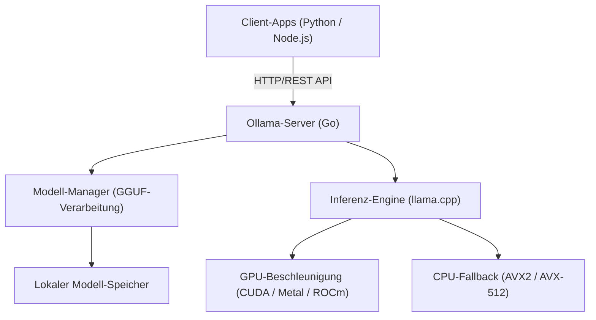
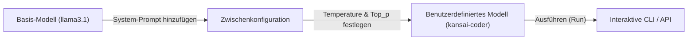

# Einführung: Warum benötigen wir lokale LLMs?

Mit dem Aufstieg von Large Language Models (LLMs) haben sich unser Leben und unsere Entwicklungsmethoden dramatisch verändert. Leistungsstarke Cloud-basierte KI-Dienste wie ChatGPT, Claude und Gemini entwickeln sich täglich weiter und bieten hoch entwickelte Schlussfolgerungsfähigkeiten. Dennoch sind Cloud-LLMs nicht für jeden Anwendungsfall optimal. Bei Cloud-LLMs bestehen folgende Herausforderungen:

1. **Datenschutz- und Sicherheitsprobleme**: Das Senden von Daten mit vertraulichen oder persönlichen Informationen an externe Server ist aus Compliance- und Sicherheitssicht für Unternehmen oft inakzeptabel.
2. **Kostenunsicherheit**: Da die API-Nutzungsgebühren von der Anzahl der Token abhängen, besteht bei Systemen, die große Datenmengen verarbeiten oder häufige Anfragen stellen, das Risiko unbegrenzt steigender laufender Kosten.
3. **Latenz und Netzwerkabhängigkeit**: Die Netzwerkkommunikation wird bei der Nutzung in Offline-Umgebungen oder bei der Ausführung auf Edge-Geräten, die eine extrem niedrige Latenz erfordern, zum Flaschenhals.
4. **Vendor Lock-in**: Die Abhängigkeit vom Modell eines bestimmten Anbieters kann dazu führen, dass man durch zukünftige Diensteinstellungen, Änderungen der Nutzungsbedingungen oder unbeabsichtigte Verhaltensänderungen aufgrund von Modell-Updates beeinträchtigt wird.

Als Lösung für diese Herausforderungen gewinnen "lokale LLMs" zunehmend an Aufmerksamkeit. Indem man Modelle auf der eigenen Hardware ausführt, sendet man keinerlei Daten nach außen, muss sich keine Sorgen um monatliche Kosten machen und kann KI frei nutzen.

In diesem Artikel werden wir das Tool "**Ollama**", mit dem sich lokale LLMs erstaunlich einfach einführen, verwalten und über eine API integrieren lassen, von den Grundlagen über die interne Architektur und die fortgeschrittene API-Integration mit Python und Node.js bis hin zu den Berechnungsformeln für das Performance-Tuning umfassend erläutern.

---

# Was ist Ollama? Die interne Architektur

Ollama ist eine Plattform zur einfachen Ausführung und Verwaltung von quelloffenen Large Language Models (wie Llama 3, Phi-3, Mistral, Gemma usw.) in einer lokalen Umgebung. Um eine lokale LLM-Umgebung aufzubauen, waren bisher sehr komplizierte Schritte erforderlich: die Einrichtung einer Python-Umgebung, die Installation des CUDA-Toolkits, das Auflösen von PyTorch-Abhängigkeiten, das Herunterladen riesiger Modelldateien von Hugging Face und die Formatkonvertierung (z. B. von Safetensors nach GGUF).

Ollama verbirgt diese Komplexität und ermöglicht den Umgang mit LLMs mit einer Benutzerfreundlichkeit, die an Docker erinnert. Mit einem einzigen Befehl können Modelle heruntergeladen (`pull`), ausgeführt (`run`) und als HTTP-Server gestartet werden.

## Die Kerntechnologie: Ein Wrapper für llama.cpp

Als Backend der Inferenz-Engine von Ollama fungiert "**llama.cpp**", eine in C/C++ geschriebene, schnelle LLM-Inferenzbibliothek. llama.cpp besitzt die Fähigkeit, Modelle durch maximale Ausnutzung der Hardwareleistung auszuführen – unabhängig davon, ob es sich um Apple Silicon (Metal), NVIDIA GPUs (CUDA), AMD GPUs (ROCm) oder sogar um reine CPU-Umgebungen handelt.

Ollama integriert llama.cpp und verwendet eine Architektur, bei der ein in Go geschriebener Serverprozess eine REST-API bereitstellt und im Hintergrund die llama.cpp-Inferenz-Engine aufruft.

Das folgende Mermaid-Diagramm zeigt die Gesamtarchitektur von Ollama:



Durch diese Architektur können Entwickler fortgeschrittene Inferenzfähigkeiten über standardmäßige HTTP-Anfragen nutzen, ohne sich um C++-Builds oder detaillierte GPU-Treiber-Einstellungen kümmern zu müssen.

---

# Installation und Ersteinrichtung von Ollama

Die Installation von Ollama ist sehr einfach. Für jedes Betriebssystem werden optimierte Binärdateien bereitgestellt.

## macOS / Windows

Laden Sie einfach den Installer von der offiziellen Website (https://ollama.com/) herunter und führen Sie ihn aus. Die macOS-Version erkennt automatisch die Metal-API von Apple Silicon, die Windows-Version NVIDIA-GPUs (CUDA) und aktiviert, falls verfügbar, die Hardwarebeschleunigung.

## Linux

In Linux-Umgebungen (wie Ubuntu) reicht die Ausführung des folgenden Einzeilers aus, um die erforderlichen Komponenten zu installieren und den Ollama-Server als systemd-Dienst zu starten.

```bash
curl -fsSL https://ollama.com/install.sh | sh
```

Überprüfen Sie nach Abschluss der Installation die Version im Terminal.

```bash
ollama --version
```
Wenn die Versionsinformationen angezeigt werden, war die Installation erfolgreich.

## Ausführung mit Docker

Wenn Sie Ihre bestehende Umgebung nicht beeinträchtigen oder Ollama in eine containerbasierte Infrastruktur integrieren möchten, können Sie auch das offizielle Docker-Image verwenden. Wenn Sie eine GPU nutzen, ist die Installation des NVIDIA Container Toolkits erforderlich.

```bash
# Für die Ausführung nur mit CPU
docker run -d -v ollama:/root/.ollama -p 11434:11434 --name ollama ollama/ollama

# Für die Nutzung einer NVIDIA GPU
docker run -d --gpus=all -v ollama:/root/.ollama -p 11434:11434 --name ollama ollama/ollama
```

Standardmäßig lauscht der Ollama-Server auf `http://localhost:11434`.

---

# Modellverwaltung und grundlegende CLI-Befehle

Der größte Reiz von Ollama liegt in der äußerst intuitiven Verwaltung von Modellen. Sie können verschiedene Modelle ausprobieren, ähnlich wie beim Umgang mit Docker-Images.

## 1. Ausführen eines Modells (`run`)

Dies ist der am häufigsten verwendete Befehl. Wenn das angegebene Modell nicht existiert, wird es automatisch heruntergeladen (`pull`), und danach öffnet sich ein interaktiver Prompt.

```bash
ollama run llama3.1
```

Wenn Sie den obigen Befehl ausführen, startet Metas neuestes Modell Llama 3.1 (in der 8B-Parameter-Version). Sobald Sie eine Nachricht im Prompt eingeben, wird die Antwort des Modells als Stream angezeigt. Zum Beenden geben Sie `/bye` ein oder drücken `Ctrl+D`.

## 2. Herunterladen eines Modells (`pull`)

Verwenden Sie den Befehl `pull`, wenn Sie ein Modell vorab im Hintergrund herunterladen möchten.

```bash
ollama pull phi3:instruct
ollama pull mistral:v0.3
```

In der Modellbibliothek von Ollama können Sie die Version und das Quantisierungsniveau im Format `Modellname:Tag` angeben. Wenn Sie das Tag weglassen, wird `latest` angewendet. Es ist aber auch möglich, explizit ein bestimmtes quantisiertes Modell (z. B. `llama3:8b-instruct-q4_0`) anzugeben.

### Was ist Quantisierung (Quantization)?

Lassen Sie uns hier kurz auf die Quantisierung eingehen. Ein gewöhnliches LLM speichert einen Gewichtsparameter als 16-Bit-Gleitkommazahl (FP16). Bei einem Modell mit 8 Milliarden (8B) Parametern verbrauchen allein die Gewichte etwa 16 GB VRAM. Die Quantisierung ist eine Technik, die diese Werte in 4-Bit (Q4) oder 8-Bit (Q8) Integer komprimiert.

Durch Quantisierung lassen sich der erforderliche Speicherplatz und die Speicherbandbreite drastisch reduzieren, während die Genauigkeitsverluste des Modells minimiert werden. Die von Ollama bereitgestellten Modelle liegen standardmäßig im GGUF-Format vor, bei dem eine optimale Quantisierung (meistens 4-Bit) bereits angewendet wurde.

## 3. Anzeigen von Modellen (`list`)

Dieser Befehl zeigt eine Liste der lokal heruntergeladenen Modelle und deren Größen an.

```bash
ollama list
```
Beispielausgabe:
```text
NAME            ID              SIZE      MODIFIED
llama3.1:latest 43f7a214e532    4.7 GB    2 hours ago
phi3:instruct   a2c89ceaed85    2.3 GB    3 days ago
```

## 4. Löschen eines Modells (`rm`)

Löschen Sie Modelle, die Sie nicht mehr benötigen, um Speicherplatz freizugeben.

```bash
ollama rm phi3:instruct
```

---

# Modellanpassung mit dem Modelfile

Mit Ollama können Sie durch ein "Modelfile" System-Prompts injizieren und Hyperparameter für bestehende Modelle anpassen, um eigene benutzerdefinierte Modelle zu erstellen. Dies entspricht genau dem Konzept eines Dockerfiles bei Docker.

Das folgende Diagramm zeigt, wie ein benutzerdefiniertes Modell von einem Basismodell abgeleitet wird.



Lassen Sie uns als Beispiel ein Modell für einen Programmierassistenten erstellen, der im Kansai-Dialekt (japanischer Dialekt) antwortet.

Erstellen Sie in Ihrem Arbeitsverzeichnis eine Textdatei mit dem Namen `Modelfile` und fügen Sie Folgendes ein:

```text
# Das Basismodell angeben
FROM llama3.1

# Hyperparameter wie Kreativität (temperature) festlegen
PARAMETER temperature 0.7
PARAMETER top_p 0.9
PARAMETER repeat_penalty 1.1
PARAMETER num_ctx 4096

# Den System-Prompt festlegen
SYSTEM """
Du bist ein erstklassiger Senior Software Engineer.
Bitte antworte auf technische Fragen der Benutzer immer freundlich und im "Kansai-Dialekt".
Wenn du Code-Beispiele zeigst, liefere modernen Code, der den Best Practices entspricht.
"""
```

Aus diesem Modelfile wird nun ein neues Modell gebaut (erstellt).

```bash
ollama create kansai-coder -f Modelfile
```

Sobald der Build abgeschlossen ist, können Sie es ausführen und testen.

```bash
ollama run kansai-coder
>>> Pythonでリストをソートするにはどうすればええの？
```
Das Modell wird dann ein angepasstes Verhalten zeigen und etwa mit "Das geht ganz einfach, nutze einfach die `sorted()`-Funktion oder die `sort()`-Methode in Python!" (im entsprechenden Dialekt) antworten. Auf diese Weise können Sie lokal unzählige Agenten erstellen und verwalten, die auf spezielle Anwendungsfälle zugeschnitten sind.

---

# Umfassende Erläuterung der Ollama REST-API

Interaktionen über die CLI sind zwar praktisch, doch die wahre Stärke von Ollama für die Entwicklung echter Anwendungen liegt in der leistungsstarken REST-API. Durch das Senden von HTTP-Anfragen an den Serverprozess (standardmäßig `http://localhost:11434`) können Sie Inferenz-Ergebnisse abrufen.

Die 3 wichtigsten Endpunkte sind:
1. `/api/generate`: Textgenerierung basierend auf einem einzelnen Prompt
2. `/api/chat`: Chat-(Dialog-)Generierung in einem Format ähnlich der OpenAI API
3. `/api/embeddings`: Generierung von Vektor-Einbettungen (Embeddings)

## Textgenerierung mit /api/generate

Dies ist der grundlegendste Generierungsendpunkt. Senden wir eine Anfrage mit cURL.

```bash
curl -X POST http://localhost:11434/api/generate -d '{
  "model": "llama3.1",
  "prompt": "Explain the concept of quantum entanglement in simple terms.",
  "stream": false
}'
```

Durch die Angabe von `"stream": false` wird das JSON auf einmal zurückgegeben, nachdem die gesamte Generierung abgeschlossen ist. Beim Standardwert (`true`) werden die generierten Tokens nacheinander im JSON Lines-Format gesendet, was sich ideal für die Implementierung einer Streaming-UI eignet.

Beispiel für eine Antwort (gekürzt):
```json
{
  "model": "llama3.1",
  "created_at": "2026-09-11T10:00:00.000Z",
  "response": "Quantum entanglement is like having a pair of magical dice...",
  "done": true,
  "context": [128006, 882, 128007, 271, 10445],
  "total_duration": 4567890000,
  "load_duration": 1234000,
  "prompt_eval_count": 14,
  "eval_count": 256,
  "eval_duration": 4321000000
}
```
Das Array `context` enthält den kodierten vergangenen Konversationsstatus. Wenn Sie dies in Ihre nächste Anfrage aufnehmen, bleibt der Kontext erhalten. Für eine einfachere Verwaltung des Gesprächsverlaufs sollten Sie jedoch `/api/chat` verwenden.

## Dialoggenerierung mit /api/chat

Da aktuelle LLMs für Chat-Formate feingetunt sind, wird `/api/chat` für die Anwendungsentwicklung empfohlen.

```bash
curl -X POST http://localhost:11434/api/chat -d '{
  "model": "llama3.1",
  "messages": [
    { "role": "system", "content": "You are a helpful AI assistant." },
    { "role": "user", "content": "What is the capital of France?" },
    { "role": "assistant", "content": "The capital of France is Paris." },
    { "role": "user", "content": "What is its famous tower?" }
  ],
  "stream": false
}'
```
Durch die Übergabe eines Arrays von Nachrichtenobjekten mit einer `role` (system, user, assistant) können komplexe Dialogkontexte problemlos verarbeitet werden.

---

# Integration in Python-Anwendungen

Python ist die Standard-Sprache für die KI-Entwicklung. Es gibt mehrere Möglichkeiten, Ollama aus Python heraus zu nutzen, aber die Verwendung des offiziellen `ollama-python`-Pakets ist am einfachsten und zuverlässigsten.

## Installation

```bash
pip install ollama
```

## Nutzung der synchronen (Synchronous) API

Hier ist der grundlegende Code zur Erstellung eines Chats.

```python
import ollama

# Liste, um den Chatverlauf zu speichern
messages = [
    {'role': 'system', 'content': 'Du bist ein hervorragender Assistent.'}
]

def chat_with_ollama(user_input):
    messages.append({'role': 'user', 'content': user_input})
    
    # Ollama API aufrufen
    response = ollama.chat(
        model='llama3.1',
        messages=messages
    )
    
    assistant_reply = response['message']['content']
    messages.append({'role': 'assistant', 'content': assistant_reply})
    
    return assistant_reply

print(chat_with_ollama("Erkläre mir die drei Hauptansätze des maschinellen Lernens."))
```

## Nutzung von asynchronem Streaming (Async Streaming)

Bei der Entwicklung von Webanwendungen (wie FastAPI oder Starlette) oder Bots für Discord / Slack ist es wichtig, asynchrone APIs und Streaming zu verwenden, um das Blockieren von Threads zu vermeiden.

```python
import asyncio
from ollama import AsyncClient

async def generate_stream():
    client = AsyncClient()
    
    # Durch stream=True wird ein asynchroner Generator zurückgegeben
    async for chunk in await client.chat(
        model='llama3.1',
        messages=[{'role': 'user', 'content': 'Erkläre Dekoratoren in Python im Detail.'}],
        stream=True
    ):
        # Jeden Chunk nacheinander in die Standardausgabe schreiben
        print(chunk['message']['content'], end='', flush=True)
        
    print() # Abschließender Zeilenumbruch

# Asynchrone Funktion ausführen
asyncio.run(generate_stream())
```
Mit diesem Ansatz lässt sich ganz einfach eine UX implementieren, bei der der Text nach und nach auf dem Bildschirm erscheint, ähnlich wie bei der ChatGPT-UI.

## Integration mit LangChain und LlamaIndex

Ollama wird auch nativ von LangChain und LlamaIndex unterstützt, die häufig beim Aufbau von RAG-Systemen (Retrieval-Augmented Generation) verwendet werden.

Beispiel für LangChain:
```python
from langchain_community.llms import Ollama

llm = Ollama(model="llama3.1")
response = llm.invoke("Explain dark matter.")
print(response)
```
Damit ist es möglich, die leistungsstarken Ketten (Chains) und Agentenfunktionen von LangChain lokal auszuführen, ohne externe API-Schlüssel konfigurieren zu müssen.

---

# Integration in Node.js-Anwendungen

Für Frontend- und Full-Stack-Entwickler ist die Möglichkeit, lokale LLMs aus einer TypeScript/Node.js-Umgebung aufzurufen, ein großer Vorteil. Dazu wird das offizielle `ollama` NPM-Paket verwendet.

## Installation

```bash
npm install ollama
```

## Implementierungsbeispiel eines Chatbots mit TypeScript

```typescript
import ollama, { Message } from 'ollama';

async function runChatbot() {
  const messages: Message[] = [
    { role: 'system', content: 'You are a concise expert.' },
    { role: 'user', content: 'Explain RESTful APIs.' }
  ];

  try {
    const response = await ollama.chat({
      model: 'llama3.1',
      messages: messages,
      stream: false,
    });
    
    console.log("Assistant:", response.message.content);
  } catch (error) {
    console.error("Error communicating with Ollama:", error);
  }
}

runChatbot();
```

## Aufbau eines Express-Servers mit Streaming-Unterstützung

Hier ist ein Beispiel für die Implementierung einer Backend-API, die Antworten als Stream an ein Web-Frontend zurückgibt. Hierbei werden Chunks über SSE (Server-Sent Events) oder reguläres HTTP-Streaming gesendet.

```javascript
import express from 'express';
import { Ollama } from 'ollama';

const app = express();
app.use(express.json());
const ollama = new Ollama({ host: 'http://127.0.0.1:11434' });

app.post('/api/stream-chat', async (req, res) => {
  const { prompt } = req.body;

  // HTTP-Response-Header konfigurieren (Chunked Transfer)
  res.setHeader('Content-Type', 'text/plain; charset=utf-8');
  res.setHeader('Transfer-Encoding', 'chunked');

  try {
    const stream = await ollama.generate({
      model: 'llama3.1',
      prompt: prompt,
      stream: true,
    });

    for await (const chunk of stream) {
      res.write(chunk.response);
    }
    res.end();
  } catch (err) {
    res.status(500).write("Error generating response.");
    res.end();
  }
});

app.listen(3000, () => {
  console.log('Server is running on port 3000');
});
```

---

# Leistungsmetriken und mathematische Analyse

Um lokale LLMs in Produktionsqualität bereitzustellen, ist eine Analyse von Latenz und Durchsatz unerlässlich. Die API-Antworten von Ollama enthalten detaillierte Leistungskennzahlen.

## Berechnungsmodell der Token-Generierungsgeschwindigkeit

Die Reaktionszeit eines LLMs, die sich direkt auf die Benutzererfahrung auswirkt, kann grob in die "**Time To First Token (TTFT)**" (Zeit bis zum ersten Token) und die "**Time Per Output Token (TPOT)**" (Zeit pro ausgegebenem Token) unterteilt werden.

Die gesamte Generierungszeit $T_{total}$ bei einer Anzahl von $N$ generierten Token lässt sich wie folgt formulieren:

$$
T_{total} = t_{ttft} + \sum_{i=1}^{N-1} t_{tpot}^{(i)}
$$

Wenn wir die durchschnittliche Zeit zur Generierung eines Tokens durch $\bar{t}_{tpot}$ approximieren, vereinfacht sich die Gleichung:

$$
T_{total} \approx t_{ttft} + (N - 1) \times \bar{t}_{tpot}
$$

Die Zuordnung zu den Feldern der Ollama API-Antwort sieht wie folgt aus:
- `prompt_eval_duration`: Dies entspricht in etwa $t_{ttft}$ (Evaluierungszeit des Prompts) und wird in Nanosekunden zurückgegeben.
- `eval_duration`: Die gesamte Zeit, die der Generierungsprozess in Anspruch genommen hat.
- `eval_count`: Die Anzahl der generierten Token $N$.

Die Token-Generierungsgeschwindigkeit pro Sekunde (Tokens Per Second: TPS) lässt sich folglich mit dieser Formel berechnen:

$$
TPS = \frac{eval\_count}{(eval\_duration / 10^9)} \quad [\text{tokens/sec}]
$$

Ein Beispiel: Bei `eval_count: 256` und `eval_duration: 4321000000` (etwa 4,32 Sekunden) ergibt sich:
$$
TPS = \frac{256}{4.321} \approx 59.24 \text{ tokens/sec}
$$
Wenn die Geschwindigkeit in einer lokalen Umgebung 50 Token/Sekunde überschreitet, übertrifft dies die menschliche Lesegeschwindigkeit bei Weitem, was bedeutet, dass eine sehr komfortable Reaktionszeit erreicht wird.

## Schätzformel für die benötigte VRAM-Kapazität

Wenn Sie Modelle lokal ausführen, ist es für die Leistung entscheidend, ob das Modell in den VRAM der GPU passt. Wenn der VRAM nicht ausreicht und auf den Hauptspeicher (RAM) des Systems ausgewichen werden muss (Fallback), sinkt die Generierungsgeschwindigkeit erheblich.

Eine einfache Formel zur Schätzung der benötigten Speicherkapazität $M$ (in Gigabyte) sieht folgendermaßen aus:

$$
M \approx \frac{P \times Q}{8 \times 1024} + C
$$

- $P$: Anzahl der Parameter des Modells (z. B. 8B = $8000 \times 10^6$)
- $Q$: Quantisierung in Bit (z. B. 4-bit, 8-bit, 16-bit)
- $C$: Zusätzlicher Speicher für das Kontextfenster (wie der KV-Cache; hängt vom Modell und den Einstellungen ab, jedoch rechnet man im Allgemeinen mit etwa 1 bis 2 GB)

**Berechnungsbeispiel**: Bei der Ausführung von Llama 3 (8B Parameter) mit einer 4-Bit-Quantisierung
$$
M_{model} = \frac{8,000 \times 4}{8 \times 1024} = \frac{32,000}{8192} \approx 3.9 \text{ GB}
$$
Wenn man den Speicher für den Kontext addiert, erkennt man, dass das Modell bei etwa 5 GB bis 6 GB VRAM vollständig auf der GPU abgelegt (Full Offload) werden kann. Selbst eine Mittelklasse-GPU aus heutiger Zeit mit 8 GB VRAM (wie eine RTX 4060) reicht also völlig aus, um ein leistungsstarkes LLM zu betreiben.

---

# Fortgeschrittene Anwendungsfälle und Fazit

Wenn man Ollama als API in einem lokalen Netzwerk bereitstellt, ergeben sich vielfältige Anwendungsmöglichkeiten, die weit über einen bloßen Chatbot hinausgehen.

### 1. Aufbau eines lokalen RAG (Retrieval-Augmented Generation)
Durch die Kombination einer lokalen Vektordatenbank wie ChromaDB oder Qdrant mit dem Ollama-Endpunkt `/api/embeddings` (unter Nutzung von Embedding-Modellen wie `nomic-embed-text`) kann ein sicheres, komplett offline funktionierendes RAG-System aufgebaut werden, in dem interne, vertrauliche Dokumente eingelesen und Fragen dazu beantwortet werden können.

### 2. KI-Assistent für IDEs und Editoren
Indem man Ollama als Backend für VS Code-Erweiterungen (wie Continue.dev) oder Neovim-Plugins festlegt, können Code-Vervollständigung und Code-Erklärungen im Stil von GitHub Copilot lokal (z. B. mit Modellen wie `codellama` oder `deepseek-coder`) und vollkommen kostenlos durchgeführt werden.

### 3. Integration in Automatisierungsskripte
Durch die Einbindung von Ollama-API-Anfragen in Python- oder Shell-Skripte lässt sich die KI in zahlreiche alltägliche Arbeitsabläufe integrieren – von der automatischen Zusammenfassung von Protokollen über die automatische Erstellung von Git-Commit-Nachrichten bis hin zur Klassifizierung von Standardtexten.

## Fazit

Mit dem Erscheinen von Ollama ist die Einstiegshürde für lokale LLMs dramatisch gesunken. Die Kombination aus einem einfachen Befehlssystem, das an die Bedienung von Docker-Containern erinnert, und einer REST-API, die sich leicht aus externen Anwendungen heraus nutzen lässt, ist heute de facto der Standard für die Entwicklung lokaler KI-Lösungen.

Entwickler, die mit den Kosten und Sicherheitsbeschränkungen von Cloud-LLMs kämpfen, sollten unbedingt die in diesem Artikel vorgestellten Schritte nutzen, um eine lokale LLM-Umgebung mit Ollama aufzubauen und in ihre Anwendungen zu integrieren. Auf diese Weise können Sie die Potenziale der KI noch freier und greifbarer erleben.

