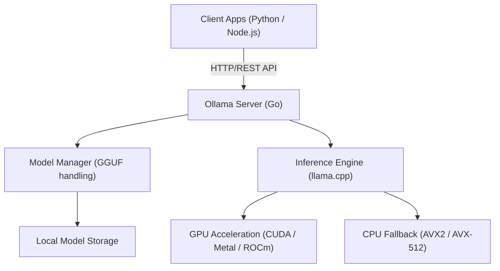
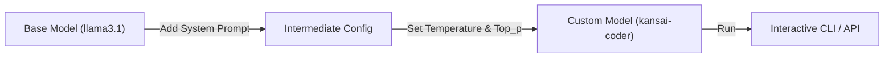

# Introduction: Why do we need local LLMs?

The rise of Large Language Models (LLMs) has brought about dramatic changes to our lives and development methodologies. Powerful cloud-based AI services like ChatGPT, Claude, and Gemini continue to evolve daily, offering highly advanced reasoning capabilities. However, cloud-based LLMs are not always the best fit for every use case. Cloud LLMs have the following challenges:

1. **Privacy and Security Issues**: Sending data containing confidential or personal information to external servers is often unacceptable from a corporate compliance and security perspective.
2. **Cost Uncertainty**: Since API usage fees depend on the number of tokens, there is a risk of running costs skyrocketing in systems that process large amounts of data or make frequent requests.
3. **Latency and Network Dependency**: Network communication becomes a bottleneck for use in offline environments or for execution on edge devices requiring extremely low latency.
4. **Vendor Lock-in**: Relying on models from a specific provider makes you susceptible to future service terminations, terms of service changes, and unintended behavioral changes due to model updates.

"Local LLMs" are attracting attention as a means to solve these challenges. By running models on your own hardware, you can freely utilize AI without sending any data externally and without worrying about monthly costs.

In this article, we will thoroughly explain "**Ollama**", a tool that makes it surprisingly easy to introduce, manage, and API-integrate local LLMs, covering everything from its basics and internal architecture to advanced API integration using Python and Node.js, and even calculation formulas for performance tuning.

---

# What is Ollama? Its Internal Architecture

Ollama is a platform for easily running and managing open-source Large Language Models (such as Llama 3, Phi-3, Mistral, Gemma, etc.) in a local environment. Until now, building a local LLM environment required highly complicated steps, such as setting up a Python environment, installing the CUDA Toolkit, resolving PyTorch dependencies, and downloading and formatting massive model files from Hugging Face (e.g., converting from Safetensors to GGUF).

Ollama hides these complexities and allows you to handle LLMs with a usability similar to Docker. With a single command, you can download (`pull`), execute (`run`), and start a model as an HTTP server.

## Core Technology: Wrapper for llama.cpp

Functioning as the backend of Ollama's inference engine is "**llama.cpp**", a high-speed LLM inference library implemented in C/C++. llama.cpp has the capability to maximize hardware performance to run models, whether it's an Apple Silicon (Metal), NVIDIA GPU (CUDA), AMD GPU (ROCm), or even a CPU-only environment.

Ollama incorporates llama.cpp and adopts an architecture where a server process written in Go provides a REST API and calls the llama.cpp inference engine in the background.

The following Mermaid diagram shows the overall architecture of Ollama.



Thanks to this architecture, developers can utilize advanced inference capabilities through standard HTTP requests without having to worry about C++ builds or detailed GPU driver settings.

---

# Installing and Initializing Ollama

Installing Ollama is very simple. Optimized binaries are provided for each OS.

## macOS / Windows

Simply download the installer from the official website (https://ollama.com/) and run it. The macOS version automatically recognizes Apple Silicon's Metal API, and the Windows version recognizes NVIDIA GPUs (CUDA), enabling hardware acceleration if available.

## Linux

In Linux environments (such as Ubuntu), running the following one-liner command installs the necessary components and starts the Ollama server as a systemd service.

```bash
curl -fsSL https://ollama.com/install.sh | sh
```

Once the installation is complete, check the version in the terminal.

```bash
ollama --version
```
If the version information is displayed, it has been installed successfully.

## Running with Docker

If you don't want to pollute your existing environment or want to integrate it into a container-based infrastructure, you can use the official Docker image. If you are using a GPU, you will need to install the NVIDIA Container Toolkit.

```bash
# To run on CPU only
docker run -d -v ollama:/root/.ollama -p 11434:11434 --name ollama ollama/ollama

# To use an NVIDIA GPU
docker run -d --gpus=all -v ollama:/root/.ollama -p 11434:11434 --name ollama ollama/ollama
```

By default, the Ollama server listens on `http://localhost:11434`.

---

# Model Management and Basic CLI Commands

The greatest appeal of Ollama is that model management is incredibly intuitive. You can try various models as if you were handling Docker images.

## 1. Running a Model (`run`)

This is the most frequently used command. If the specified model does not exist, it is automatically downloaded (`pull`), and then an interactive prompt launches.

```bash
ollama run llama3.1
```

When you run the above command, Meta's latest model, Llama 3.1 (8B parameter version), will start. When you enter a message into the prompt, the model's reply is displayed via streaming. To exit, type `/bye` or `Ctrl+D`.

## 2. Downloading a Model (`pull`)

If you want to download a model in the background in advance, use the `pull` command.

```bash
ollama pull phi3:instruct
ollama pull mistral:v0.3
```

In the Ollama model library, you can specify the version or quantization level in the format `model_name:tag`. If the tag is omitted, `latest` is applied, but you can also explicitly specify a particular quantized model (e.g., `llama3:8b-instruct-q4_0`).

### What is Quantization?

Let's briefly touch upon quantization here. A normal LLM holds a single weight parameter in 16-bit floating-point (FP16), etc. In the case of an 8 billion (8B) parameter model, the weights alone would consume about 16GB of VRAM. Quantization is the technology that compresses this into 4-bit (Q4) or 8-bit (Q8) integer types.

By quantizing, you can drastically reduce the required memory capacity and memory bandwidth while minimizing model accuracy degradation. Models distributed by Ollama are, by default, in the GGUF format with optimal quantization applied (often 4-bit).

## 3. Listing Models (`list`)

Displays a list of locally downloaded models and their sizes.

```bash
ollama list
```
Example output:
```text
NAME            ID              SIZE      MODIFIED
llama3.1:latest 43f7a214e532    4.7 GB    2 hours ago
phi3:instruct   a2c89ceaed85    2.3 GB    3 days ago
```

## 4. Deleting a Model (`rm`)

Deletes unneeded models to free up disk space.

```bash
ollama rm phi3:instruct
```

---

# Customizing Models with Modelfile

Ollama allows you to create your own custom models by injecting system prompts or adjusting hyperparameters into existing models using a mechanism called a "**Modelfile**". This is exactly the same concept as Docker's Dockerfile.

The diagram below shows how a custom model is derived from a base model.



As an example, let's create a programming assistant model that responds in the Kansai dialect.

Create a text file named `Modelfile` in your working directory and write the following:

```text
# Specify the base model
FROM llama3.1

# Set hyperparameters like creativity (temperature)
PARAMETER temperature 0.7
PARAMETER top_p 0.9
PARAMETER repeat_penalty 1.1
PARAMETER num_ctx 4096

# Set the system prompt
SYSTEM """
You are a world-class senior software engineer.
Always respond to technical questions from users in a friendly manner using the 'Kansai dialect'.
When providing code examples, provide modern code that follows best practices.
"""
```

Build (create) a new model from this Modelfile.

```bash
ollama create kansai-coder -f Modelfile
```

Once the build is complete, let's run it and test it.

```bash
ollama run kansai-coder
>>> How can I sort a list in Python?
```
It will then show customized behavior, answering something like "Well, you just use Python's `sorted()` function or `sort()` method!" This makes it possible to locally create and manage countless agents specialized for your use cases.

---

# Thorough Explanation of the Ollama REST API

While interacting via the CLI is convenient, the true value of Ollama in actual application development lies in its powerful REST API. By sending HTTP requests to the server process (default is `http://localhost:11434`), you can retrieve inference results.

The three main endpoints are:
1. `/api/generate`: Text generation from a single prompt
2. `/api/chat`: Chat (conversation) generation similar to the OpenAI API format
3. `/api/embeddings`: Generation of vector embeddings

## Text Generation Using /api/generate

This is the most basic generation endpoint. Let's try sending a request using cURL.

```bash
curl -X POST http://localhost:11434/api/generate -d '{
  "model": "llama3.1",
  "prompt": "Explain the concept of quantum entanglement in simple terms.",
  "stream": false
}'
```

By specifying `"stream": false`, the JSON is returned all at once after all generation is complete. In the case of the default (`true`), generated tokens are sent sequentially in JSON Lines format, making it suitable for implementing streaming UIs.

Example response (partially omitted):
```json
{
  "model": "llama3.1",
  "created_at": "2026-09-12T10:00:00.000Z",
  "response": "Quantum entanglement is like having a pair of magical dice...",
  "done": true,
  "context": [128006, 882, 128007, 271, 10445],
  "total_duration": 4567890000,
  "load_duration": 1234000,
  "prompt_eval_count": 14,
  "eval_count": 256,
  "eval_duration": 4321000000
}
```
The past conversation state is encoded in the `context` array, and you can maintain the context by including this in the next request. However, to manage chat history more easily, use the next `/api/chat`.

## Chat Generation Using /api/chat

Since recent LLMs are fine-tuned for chat formats, `/api/chat` is recommended for application development.

```bash
curl -X POST http://localhost:11434/api/chat -d '{
  "model": "llama3.1",
  "messages": [
    { "role": "system", "content": "You are a helpful AI assistant." },
    { "role": "user", "content": "What is the capital of France?" },
    { "role": "assistant", "content": "The capital of France is Paris." },
    { "role": "user", "content": "What is its famous tower?" }
  ],
  "stream": false
}'
```
By passing an array of message objects with `role` (system, user, assistant) in this way, complex conversational contexts can be easily handled.

---

# Integration with Python Applications

Python is the most standard language in AI development. There are several ways to use Ollama from Python, but using the officially provided `ollama-python` package is the easiest and most reliable.

## Installation

```bash
pip install ollama
```

## Using the Synchronous API

This is the basic code to generate a chat.

```python
import ollama

# List to hold chat history
messages = [
    {'role': 'system', 'content': 'You are an excellent assistant.'}
]

def chat_with_ollama(user_input):
    messages.append({'role': 'user', 'content': user_input})
    
    # Call the Ollama API
    response = ollama.chat(
        model='llama3.1',
        messages=messages
    )
    
    assistant_reply = response['message']['content']
    messages.append({'role': 'assistant', 'content': assistant_reply})
    
    return assistant_reply

print(chat_with_ollama("Please explain the three main approaches of machine learning."))
```

## Using Asynchronous Streaming

When developing web applications (FastAPI or Starlette) or Discord/Slack bots, it's important to use the asynchronous API and streaming to avoid blocking.

```python
import asyncio
from ollama import AsyncClient

async def generate_stream():
    client = AsyncClient()
    
    # Specifying stream=True returns an asynchronous generator
    async for chunk in await client.chat(
        model='llama3.1',
        messages=[{'role': 'user', 'content': 'Please explain Python decorators in detail.'}],
        stream=True
    ):
        # Sequentially display each chunk to standard output
        print(chunk['message']['content'], end='', flush=True)
        
    print() # Newline at the end

# Run the asynchronous function
asyncio.run(generate_stream())
```
By writing it like this, you can easily implement a UX where text appears character by character, similar to the ChatGPT UI.

## Integration with LangChain and LlamaIndex

Ollama is also natively supported in LangChain and LlamaIndex, which are commonly used when building RAG (Retrieval-Augmented Generation) systems.

Example in LangChain:
```python
from langchain_community.llms import Ollama

llm = Ollama(model="llama3.1")
response = llm.invoke("Explain dark matter.")
print(response)
```
You can run LangChain's powerful chain and agent features locally without configuring any external API keys.

---

# Integration with Node.js Applications

For front-end engineers or full-stack developers, being able to call a local LLM from a TypeScript/Node.js environment is a major advantage. You use the official `ollama` NPM package.

## Installation

```bash
npm install ollama
```

## Chatbot Implementation Example using TypeScript

```typescript
import ollama, { Message } from 'ollama';

async function runChatbot() {
  const messages: Message[] = [
    { role: 'system', content: 'You are a concise expert.' },
    { role: 'user', content: 'Explain RESTful APIs.' }
  ];

  try {
    const response = await ollama.chat({
      model: 'llama3.1',
      messages: messages,
      stream: false,
    });
    
    console.log("Assistant:", response.message.content);
  } catch (error) {
    console.error("Error communicating with Ollama:", error);
  }
}

runChatbot();
```

## Building a Streaming-Compatible Express Server

This is an implementation example of a backend API that returns responses via streaming to a web frontend. It uses SSE (Server-Sent Events) or regular HTTP streaming to send chunks.

```javascript
import express from 'express';
import { Ollama } from 'ollama';

const app = express();
app.use(express.json());
const ollama = new Ollama({ host: 'http://127.0.0.1:11434' });

app.post('/api/stream-chat', async (req, res) => {
  const { prompt } = req.body;

  // Setting HTTP response headers (chunked transfer)
  res.setHeader('Content-Type', 'text/plain; charset=utf-8');
  res.setHeader('Transfer-Encoding', 'chunked');

  try {
    const stream = await ollama.generate({
      model: 'llama3.1',
      prompt: prompt,
      stream: true,
    });

    for await (const chunk of stream) {
      res.write(chunk.response);
    }
    res.end();
  } catch (err) {
    res.status(500).write("Error generating response.");
    res.end();
  }
});

app.listen(3000, () => {
  console.log('Server is running on port 3000');
});
```

---

# Performance Metrics and Mathematical Analysis

To provide local LLMs at a level that can withstand actual production use, an analysis of latency and throughput is essential. The Ollama API response includes detailed metrics regarding performance.

## Mathematical Model of Token Generation Speed

The response time of an LLM, which directly affects the user experience, can be broadly broken down into "**Time To First Token (TTFT)**" and "**Time Per Output Token (TPOT)**".

The total generation time $T_{total}$, assuming the number of generated tokens is $N$, is formulated as follows:

$$
T_{total} = t_{ttft} + \sum_{i=1}^{N-1} t_{tpot}^{(i)}
$$

Here, if we approximate the average time taken to generate each token as $\bar{t}_{tpot}$, the formula is simplified.

$$
T_{total} \approx t_{ttft} + (N - 1) \times \bar{t}_{tpot}
$$

The correspondence with Ollama's API response fields is as follows:
- `prompt_eval_duration`: This roughly corresponds to $t_{ttft}$ (prompt evaluation time). It is returned in nanoseconds.
- `eval_duration`: The time taken for the entire generation process.
- `eval_count`: The number of generated tokens $N$.

Therefore, the token generation speed per second (Tokens Per Second: TPS) can be calculated with the following formula:

$$
TPS = \frac{eval\_count}{(eval\_duration / 10^9)} \quad [\text{tokens/sec}]
$$

For example, if `eval_count: 256` and `eval_duration: 4321000000` (approx. 4.32 seconds):
$$
TPS = \frac{256}{4.321} \approx 59.24 \text{ tokens/sec}
$$
If it exceeds 50 tokens/sec in a local environment, it far surpasses human reading speed, so it can be said that a very comfortable response experience is provided.

## Estimation Formula for Required VRAM Capacity

When running models locally, whether the model fits into the GPU's VRAM is key to performance. If it does not fit in VRAM and falls back to the system's main memory (RAM), the generation speed will drop significantly.

A simplified formula to estimate the required memory capacity $M$ (in gigabytes) is as follows:

$$
M \approx \frac{P \times Q}{8 \times 1024} + C
$$

- $P$: Number of parameters of the model (e.g., 8B = $8000 \times 10^6$)
- $Q$: Number of quantization bits (e.g., 4-bit, 8-bit, 16-bit)
- $C$: Additional memory for the context window (KV cache, etc. Depends on the model and settings, but generally estimated around 1 to 2 GB)

**Calculation Example**: When running Llama 3 (8B parameters) with 4-bit quantization
$$
M_{model} = \frac{8,000 \times 4}{8 \times 1024} = \frac{32,000}{8192} \approx 3.9 \text{ GB}
$$
Adding the memory for context to this shows that if you have about 5GB to 6GB of VRAM, you can fully deploy the model onto the GPU (Full Offload). Even mid-class GPUs from recent years with 8GB VRAM (like the RTX 4060) can sufficiently run powerful LLMs.

---

# Advanced Use Cases and Conclusion

By exposing Ollama as an API on your local network, various applications beyond a simple chatbot become possible.

### 1. Building Local RAG (Retrieval-Augmented Generation)
By combining a local vector database like ChromaDB or Qdrant with Ollama's `/api/embeddings` endpoint (using embedding models like `nomic-embed-text`), you can build a secure RAG system entirely offline that loads internal confidential documents for question answering.

### 2. AI Assistant for IDEs and Editors
By specifying Ollama as the backend for VS Code extensions (like Continue.dev) or Neovim plugins, you can get code completion and code explanations similar to GitHub Copilot for free, using local models (e.g., `codellama` or `deepseek-coder`).

### 3. Integration into Automation Scripts
By embedding Ollama API requests into Python or shell scripts, you can inject the power of AI everywhere in your daily workflow, such as automatic log summarization, automatic generation of Git commit messages, and boilerplate classification tasks.

## Conclusion

With the advent of Ollama, the hurdle for introducing local LLMs has dropped dramatically. The combination of a simple command structure resembling Docker container operations and a REST API that can be easily utilized from external applications is no exaggeration to say is the current de facto standard in local AI development.

For developers troubled by the costs and security constraints of cloud LLMs, please build a local LLM environment using Ollama by referring to the steps introduced in this article, and try integrating it into your own applications. You should be able to feel the potential of AI more freely and closer to home.
