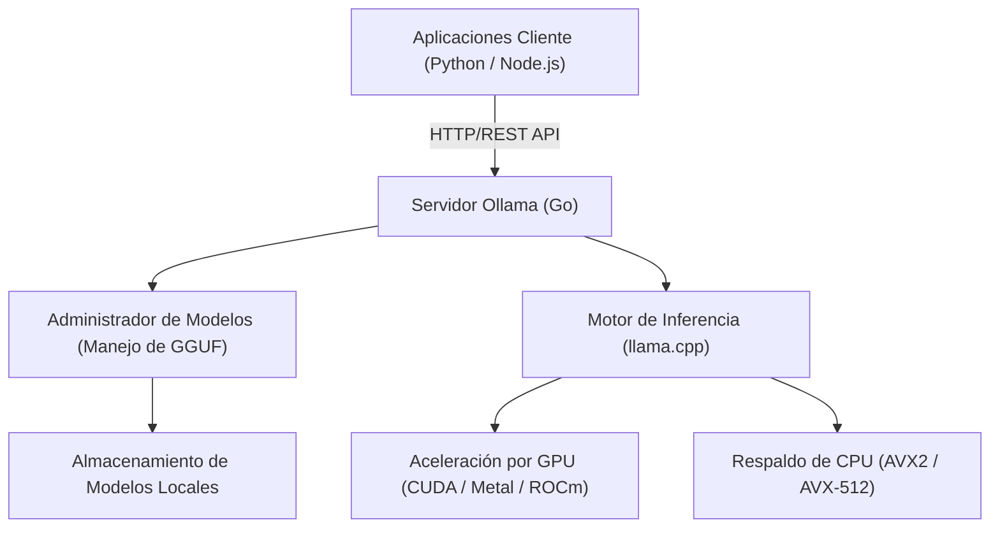
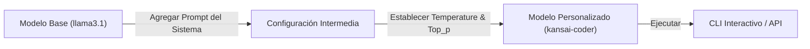

# Introducción: ¿Por qué necesitamos un LLM local?

El auge de los Modelos de Lenguaje Grande (LLM) ha transformado drásticamente nuestra vida y los métodos de desarrollo. Servicios de IA potentes basados en la nube como ChatGPT, Claude y Gemini evolucionan a diario, ofreciendo capacidades de razonamiento muy avanzadas. Sin embargo, un LLM en la nube no siempre es la mejor opción para todos los casos de uso. Los LLM en la nube presentan los siguientes desafíos:

1. **Problemas de privacidad y seguridad**: Enviar datos que contienen información confidencial o personal a servidores externos suele ser inaceptable desde la perspectiva del cumplimiento corporativo y la seguridad.
2. **Incertidumbre en los costos**: Dado que las tarifas de uso de API dependen de la cantidad de tokens, existe el riesgo de que los costos operativos se disparen sin límite en sistemas que realizan un procesamiento masivo de datos o solicitudes frecuentes.
3. **Dependencia de la red y latencia**: Las comunicaciones de red se convierten en un cuello de botella para el uso en entornos sin conexión o la ejecución en dispositivos perimetrales (edge) que requieren una latencia extremadamente baja.
4. **Dependencia del proveedor (Vendor Lock-in)**: Al depender del modelo de un proveedor específico, uno puede verse afectado por una futura finalización del servicio, cambios en los términos o alteraciones inesperadas en el comportamiento debido a actualizaciones del modelo.

Como medio para resolver estos problemas, los "LLM locales" están ganando atención. Al ejecutar los modelos en su propio hardware, puede aprovechar la IA libremente sin enviar ningún dato externamente y sin preocuparse por los costos mensuales.

En este artículo, explicaremos exhaustivamente "**Ollama**", una herramienta que le permite implementar, gestionar e integrar LLMs locales con APIs de manera sorprendentemente sencilla. Cubriremos desde los conceptos básicos hasta la arquitectura interna, la integración avanzada de API con Python y Node.js, e incluso fórmulas para calcular el ajuste de rendimiento.

---

# ¿Qué es Ollama? Su arquitectura interna

Ollama es una plataforma que facilita la ejecución y gestión de grandes modelos de lenguaje de código abierto (Llama 3, Phi-3, Mistral, Gemma, etc.) en entornos locales. Anteriormente, para configurar un entorno de LLM local, se requerían pasos muy tediosos: configurar el entorno de Python, instalar el kit de herramientas CUDA, resolver las dependencias de PyTorch, descargar archivos de modelos enormes de Hugging Face y convertir formatos (por ejemplo, de Safetensors a GGUF).

Ollama oculta estas complejidades, permitiéndole manejar LLMs con una usabilidad similar a Docker. Con un solo comando, puede descargar (`pull`), ejecutar (`run`) e iniciar un modelo como un servidor HTTP.

## Tecnología central: Envoltorio (wrapper) de llama.cpp

Actuando como el backend del motor de inferencia de Ollama se encuentra "**llama.cpp**", una biblioteca de inferencia de LLM de alta velocidad implementada en C/C++. Incluso en entornos con Apple Silicon (Metal), NVIDIA GPU (CUDA), AMD GPU (ROCm) o simplemente CPU, llama.cpp tiene la capacidad de maximizar el rendimiento del hardware para ejecutar modelos.

Ollama incluye llama.cpp y adopta una arquitectura donde un proceso de servidor escrito en lenguaje Go proporciona una API REST, llamando al motor de inferencia llama.cpp en segundo plano.

El siguiente diagrama de Mermaid muestra la arquitectura general de Ollama.



Gracias a esta arquitectura, los desarrolladores pueden aprovechar capacidades de inferencia avanzadas a través de solicitudes HTTP estándar, sin tener que preocuparse por compilaciones en C++ o configuraciones detalladas de controladores de GPU.

---

# Instalación de Ollama y configuración inicial

La instalación de Ollama es muy sencilla. Se proporcionan binarios optimizados para cada sistema operativo.

## macOS / Windows

Simplemente descargue el instalador desde el sitio web oficial (https://ollama.com/) y ejecútelo. La versión de macOS reconoce automáticamente la API Metal de Apple Silicon, y la versión de Windows reconoce la GPU NVIDIA (CUDA), habilitando la aceleración por hardware si está disponible.

## Linux

En entornos Linux (como Ubuntu), simplemente ejecutar el siguiente comando en una sola línea instalará los componentes necesarios y lanzará el servidor Ollama como un servicio systemd.

```bash
curl -fsSL https://ollama.com/install.sh | sh
```

Una vez completada la instalación, verifique la versión en la terminal.

```bash
ollama --version
```
Si se muestra la información de la versión, se ha instalado correctamente.

## Ejecución usando Docker

Si no desea alterar su entorno existente o desea integrarlo en una infraestructura basada en contenedores, también es posible utilizar la imagen oficial de Docker. Si utiliza una GPU, es necesario instalar NVIDIA Container Toolkit.

```bash
# Para ejecutar solo con CPU
docker run -d -v ollama:/root/.ollama -p 11434:11434 --name ollama ollama/ollama

# Para usar una GPU NVIDIA
docker run -d --gpus=all -v ollama:/root/.ollama -p 11434:11434 --name ollama ollama/ollama
```

Por defecto, el servidor Ollama escucha en `http://localhost:11434`.

---

# Gestión de modelos y comandos CLI básicos

El mayor atractivo de Ollama es que la gestión de modelos es muy intuitiva. Puede probar varios modelos con la misma sensación de manejar imágenes de Docker.

## 1. Ejecutar un modelo (`run`)

Este es el comando que se usa con más frecuencia. Si el modelo especificado no existe, se descarga automáticamente (`pull`), y luego se inicia un prompt interactivo.

```bash
ollama run llama3.1
```

Al ejecutar el comando anterior, se iniciará el modelo más reciente de Meta, Llama 3.1 (versión de 8B de parámetros). Si ingresa un mensaje en el prompt, la respuesta del modelo se mostrará de forma continua (streaming). Para salir, ingrese `/bye` o `Ctrl+D`.

## 2. Descargar un modelo (`pull`)

Si desea descargar un modelo en segundo plano con anticipación, use el comando `pull`.

```bash
ollama pull phi3:instruct
ollama pull mistral:v0.3
```

En la biblioteca de modelos de Ollama, puede especificar la versión y el nivel de cuantización en el formato `nombre_modelo:etiqueta`. Si omite la etiqueta, se aplicará `latest`, pero también es posible especificar explícitamente un modelo cuantizado particular (por ejemplo: `llama3:8b-instruct-q4_0`).

### ¿Qué es la cuantización (Quantization)?

Hablemos un poco sobre la cuantización aquí. Un LLM normal almacena un parámetro de peso en punto flotante de 16 bits (FP16) o similar. Para un modelo de 8 mil millones (8B) de parámetros, solo los pesos consumirán alrededor de 16 GB de VRAM. La tecnología que comprime esto en tipos enteros de 4 bits (Q4) u 8 bits (Q8) es la cuantización.

Mediante la cuantización, la cantidad de memoria y el ancho de banda de memoria necesarios se pueden reducir drásticamente mientras se minimiza la degradación de la precisión del modelo. Los modelos distribuidos en Ollama están por defecto en formato GGUF con la cuantización óptima aplicada (a menudo de 4 bits).

## 3. Listar modelos (`list`)

Muestra una lista de modelos descargados localmente y su tamaño.

```bash
ollama list
```
Ejemplo de salida:
```text
NAME            ID              SIZE      MODIFIED
llama3.1:latest 43f7a214e532    4.7 GB    2 hours ago
phi3:instruct   a2c89ceaed85    2.3 GB    3 days ago
```

## 4. Eliminar modelos (`rm`)

Elimine los modelos que ya no necesite para liberar espacio en el disco.

```bash
ollama rm phi3:instruct
```

---

# Personalización de modelos con Modelfile

En Ollama, puede usar un mecanismo llamado "**Modelfile**" para inyectar un prompt del sistema o ajustar hiperparámetros en un modelo existente para crear su propio modelo personalizado. Este concepto es exactamente el mismo que el Dockerfile en Docker.

El siguiente diagrama muestra cómo un modelo personalizado se deriva de un modelo base.



Como ejemplo, intentemos crear un modelo de asistente de programación que responda en el dialecto de Kansai.

Cree un archivo de texto llamado `Modelfile` en su directorio de trabajo y escriba lo siguiente:

```text
# Especificar el modelo base
FROM llama3.1

# Establecer hiperparámetros como la creatividad (temperature)
PARAMETER temperature 0.7
PARAMETER top_p 0.9
PARAMETER repeat_penalty 1.1
PARAMETER num_ctx 4096

# Establecer el prompt del sistema
SYSTEM """
Eres un ingeniero de software senior de clase mundial.
Siempre debes responder a las preguntas técnicas de los usuarios de una manera amigable y coloquial, utilizando el "dialecto de Kansai".
Cuando muestres ejemplos de código, proporciona código moderno que siga las mejores prácticas.
"""
```

Compile (cree) un nuevo modelo a partir de este Modelfile.

```bash
ollama create kansai-coder -f Modelfile
```

Una vez completada la compilación, ejecútelo y pruébelo.

```bash
ollama run kansai-coder
>>> ¿Cómo puedo ordenar una lista en Python?
```
Entonces, mostrará un comportamiento personalizado como: "¡Pues mira, puedes usar la función `sorted()` o el método `sort()` de Python, hombre!". De esta manera, es posible crear y gestionar innumerables agentes especializados para casos de uso específicos de forma local.

---

# Explicación exhaustiva de la API REST de Ollama

Aunque la interacción en la CLI es útil, el verdadero valor de Ollama en el desarrollo de aplicaciones reales reside en su potente API REST. Al enviar una solicitud HTTP al proceso del servidor (por defecto, `http://localhost:11434`), puede obtener los resultados de la inferencia.

Los tres endpoints principales son los siguientes:
1. `/api/generate`: Generación de texto a partir de un solo prompt
2. `/api/chat`: Generación de chat (diálogo) en un formato similar a la API de OpenAI
3. `/api/embeddings`: Generación de incrustaciones vectoriales (Embeddings)

## Generación de texto usando /api/generate

Este es el endpoint de generación más básico. Enviemos una solicitud utilizando cURL.

```bash
curl -X POST http://localhost:11434/api/generate -d '{
  "model": "llama3.1",
  "prompt": "Explain the concept of quantum entanglement in simple terms.",
  "stream": false
}'
```

Al especificar `"stream": false`, el JSON se devuelve de una vez después de que se completa toda la generación. En el caso predeterminado (`true`), los tokens generados se envían secuencialmente en formato JSON Lines, lo que es adecuado para implementar una interfaz de usuario de streaming.

Ejemplo de respuesta (parcialmente omitido):
```json
{
  "model": "llama3.1",
  "created_at": "2026-09-12T10:00:00.000Z",
  "response": "Quantum entanglement is like having a pair of magical dice...",
  "done": true,
  "context": [128006, 882, 128007, 271, 10445],
  "total_duration": 4567890000,
  "load_duration": 1234000,
  "prompt_eval_count": 14,
  "eval_count": 256,
  "eval_duration": 4321000000
}
```
El array `context` codifica el estado de la conversación pasada, y al incluirlo en la siguiente solicitud, se puede mantener el contexto. Sin embargo, para gestionar el historial de conversación de forma más sencilla, se utiliza el siguiente `/api/chat`.

## Generación de diálogo usando /api/chat

Dado que los LLMs recientes están ajustados (fine-tuned) para formatos de chat, se recomienda `/api/chat` en el desarrollo de aplicaciones.

```bash
curl -X POST http://localhost:11434/api/chat -d '{
  "model": "llama3.1",
  "messages": [
    { "role": "system", "content": "You are a helpful AI assistant." },
    { "role": "user", "content": "What is the capital of France?" },
    { "role": "assistant", "content": "The capital of France is Paris." },
    { "role": "user", "content": "What is its famous tower?" }
  ],
  "stream": false
}'
```
De esta manera, pasando un array de objetos de mensaje con un `role` (system, user, assistant), puede manejar fácilmente contextos de diálogo complejos.

---

# Integración con aplicaciones Python

Python es el lenguaje más estándar en el desarrollo de IA. Hay varias formas de utilizar Ollama desde Python, pero usar el paquete oficial `ollama-python` es la forma más fácil y confiable.

## Instalación

```bash
pip install ollama
```

## Uso de la API Síncrona (Synchronous)

Este es el código básico para realizar la generación de chat.

```python
import ollama

# Lista para mantener el historial del chat
messages = [
    {'role': 'system', 'content': 'Eres un excelente asistente.'}
]

def chat_with_ollama(user_input):
    messages.append({'role': 'user', 'content': user_input})
    
    # Llamar a la API de Ollama
    response = ollama.chat(
        model='llama3.1',
        messages=messages
    )
    
    assistant_reply = response['message']['content']
    messages.append({'role': 'assistant', 'content': assistant_reply})
    
    return assistant_reply

print(chat_with_ollama("Por favor, explica los 3 enfoques principales del aprendizaje automático."))
```

## Uso de la API de Streaming Asíncrona (Async Streaming)

Al desarrollar aplicaciones web (FastAPI, Starlette) o bots para Discord / Slack, es importante utilizar la API asíncrona y el streaming para evitar bloqueos.

```python
import asyncio
from ollama import AsyncClient

async def generate_stream():
    client = AsyncClient()
    
    # Al especificar stream=True, se devuelve un generador asíncrono
    async for chunk in await client.chat(
        model='llama3.1',
        messages=[{'role': 'user', 'content': 'Explica en detalle los decoradores en Python.'}],
        stream=True
    ):
        # Muestra cada fragmento (chunk) secuencialmente en la salida estándar
        print(chunk['message']['content'], end='', flush=True)
        
    print() # Nueva línea al final

# Ejecutar la función asíncrona
asyncio.run(generate_stream())
```
Al escribir de esta manera, puede implementar fácilmente una UX en la que los caracteres aparecen uno por uno, como en la interfaz de usuario de ChatGPT.

## Integración con LangChain y LlamaIndex

Ollama también cuenta con soporte nativo en LangChain y LlamaIndex, que a menudo se utilizan al construir sistemas RAG (Retrieval-Augmented Generation).

Ejemplo con LangChain:
```python
from langchain_community.llms import Ollama

llm = Ollama(model="llama3.1")
response = llm.invoke("Explain dark matter.")
print(response)
```
Es posible ejecutar potentes cadenas (chains) y agentes de LangChain localmente, sin configurar ninguna clave API externa.

---

# Integración con aplicaciones Node.js

Para los ingenieros de frontend y desarrolladores full-stack, poder llamar a LLMs locales desde un entorno TypeScript/Node.js es una gran ventaja. Se utiliza el paquete NPM oficial `ollama`.

## Instalación

```bash
npm install ollama
```

## Ejemplo de implementación de un chatbot usando TypeScript

```typescript
import ollama, { Message } from 'ollama';

async function runChatbot() {
  const messages: Message[] = [
    { role: 'system', content: 'You are a concise expert.' },
    { role: 'user', content: 'Explain RESTful APIs.' }
  ];

  try {
    const response = await ollama.chat({
      model: 'llama3.1',
      messages: messages,
      stream: false,
    });
    
    console.log("Assistant:", response.message.content);
  } catch (error) {
    console.error("Error communicating with Ollama:", error);
  }
}

runChatbot();
```

## Creación de un servidor Express compatible con streaming

Este es un ejemplo de implementación de una API backend que devuelve respuestas en streaming a un frontend web. Utiliza SSE (Server-Sent Events) o streaming HTTP normal para enviar fragmentos (chunks).

```javascript
import express from 'express';
import { Ollama } from 'ollama';

const app = express();
app.use(express.json());
const ollama = new Ollama({ host: 'http://127.0.0.1:11434' });

app.post('/api/stream-chat', async (req, res) => {
  const { prompt } = req.body;

  // Configuración de las cabeceras de respuesta HTTP (Transferencia fragmentada - chunked)
  res.setHeader('Content-Type', 'text/plain; charset=utf-8');
  res.setHeader('Transfer-Encoding', 'chunked');

  try {
    const stream = await ollama.generate({
      model: 'llama3.1',
      prompt: prompt,
      stream: true,
    });

    for await (const chunk of stream) {
      res.write(chunk.response);
    }
    res.end();
  } catch (err) {
    res.status(500).write("Error generating response.");
    res.end();
  }
});

app.listen(3000, () => {
  console.log('Server is running on port 3000');
});
```

---

# Métricas de rendimiento y análisis matemático

Para proporcionar un LLM local a un nivel que soporte el uso en producción, el análisis de la latencia y el rendimiento (throughput) es esencial. Las respuestas de la API de Ollama incluyen métricas detalladas sobre el rendimiento.

## Modelo de cálculo para la velocidad de generación de tokens

El tiempo de respuesta de un LLM, que afecta directamente a la experiencia del usuario, se puede desglosar principalmente en "**Time To First Token (TTFT)**" (Tiempo hasta el primer token) y "**Time Per Output Token (TPOT)**" (Tiempo por token de salida).

El tiempo total de generación $T_{total}$, asumiendo que el número de tokens generados es $N$, se formula de la siguiente manera:

$$
T_{total} = t_{ttft} + \sum_{i=1}^{N-1} t_{tpot}^{(i)}
$$

Aquí, si aproximamos el tiempo promedio para generar cada token como $\bar{t}_{tpot}$, la fórmula se simplifica:

$$
T_{total} \approx t_{ttft} + (N - 1) \times \bar{t}_{tpot}
$$

La correspondencia con los campos de respuesta de la API de Ollama es la siguiente:
- `prompt_eval_duration`: Esto corresponde aproximadamente a $t_{ttft}$ (tiempo de evaluación del prompt). Se devuelve en nanosegundos.
- `eval_duration`: El tiempo tomado para todo el proceso de generación.
- `eval_count`: El número de tokens generados $N$.

Por lo tanto, la velocidad de generación de tokens por segundo (Tokens Per Second: TPS) se puede calcular con la siguiente fórmula:

$$
TPS = \frac{eval\_count}{(eval\_duration / 10^9)} \quad [\text{tokens/sec}]
$$

Por ejemplo, en el caso de `eval_count: 256` y `eval_duration: 4321000000` (aproximadamente 4.32 segundos):
$$
TPS = \frac{256}{4.321} \approx 59.24 \text{ tokens/sec}
$$
Si supera los 50 tokens/segundo en un entorno local, supera con creces la velocidad de lectura humana, por lo que se puede decir que proporciona una experiencia de respuesta muy cómoda.

## Fórmula de estimación para la capacidad de VRAM requerida

Al ejecutar un modelo localmente, la clave del rendimiento es si el modelo cabe en la VRAM de la GPU. Si no cabe en la VRAM y recurre (fallback) a la memoria principal del sistema (RAM), la velocidad de generación disminuirá significativamente.

Una fórmula sencilla para estimar la capacidad de memoria requerida $M$ (gigabytes) es la siguiente:

$$
M \approx \frac{P \times Q}{8 \times 1024} + C
$$

- $P$: Número de parámetros del modelo (Ejemplo: 8B = $8000 \times 10^6$)
- $Q$: Número de bits de cuantización (Ejemplo: 4-bit, 8-bit, 16-bit)
- $C$: Memoria adicional para la ventana de contexto (como la caché KV. Depende del modelo y la configuración, pero generalmente se estima entre 1 y 2 GB)

**Ejemplo de cálculo**: Cuando se ejecuta Llama 3 (8B parámetros) con cuantización de 4 bits
$$
M_{model} = \frac{8,000 \times 4}{8 \times 1024} = \frac{32,000}{8192} \approx 3.9 \text{ GB}
$$
Al sumar la memoria de contexto a esto, podemos ver que si tenemos alrededor de 5GB a 6GB de VRAM, el modelo se puede cargar completamente (Full Offload) en la GPU. Incluso con una GPU de clase media reciente equipada con 8GB de VRAM (como la RTX 4060), es posible ejecutar un LLM suficientemente potente.

---

# Casos de uso avanzados y resumen

Al exponer Ollama como una API en una red local, se hacen posibles varias aplicaciones más allá de un simple chatbot.

### 1. Construcción de RAG Local (Retrieval-Augmented Generation)
Combinando bases de datos vectoriales locales como ChromaDB o Qdrant con el endpoint `/api/embeddings` de Ollama (utilizando modelos de incrustación como `nomic-embed-text`), puede construir un sistema RAG seguro completamente fuera de línea, cargando documentos confidenciales de la empresa para responder preguntas.

### 2. Asistente de IA para IDEs y Editores
Al especificar Ollama como backend para extensiones de VS Code (como Continue.dev) o plugins de Neovim, puede habilitar la autocompleción y la explicación de código, similares a GitHub Copilot, utilizando modelos locales (por ejemplo, `codellama` o `deepseek-coder`) de forma gratuita.

### 3. Integración en scripts de automatización
Al incorporar solicitudes API de Ollama en scripts de Python o Shell, puede inyectar el poder de la IA en todo su flujo de trabajo diario, como la sumarización automática de registros, la generación automática de mensajes de commit para Git y las tareas de clasificación de texto estándar.

## Conclusión

Con la llegada de Ollama, el obstáculo para introducir LLMs locales ha disminuido drásticamente. No es una exageración decir que la combinación de su sistema de comandos simple (similar al manejo de contenedores Docker) y una API REST que puede usarse fácilmente desde aplicaciones externas, es el estándar de facto actual en el desarrollo de IA local.

A los desarrolladores que luchan con las restricciones de costos y seguridad de los LLMs en la nube, los invito a configurar un entorno de LLM local usando Ollama y a integrarlo en sus propias aplicaciones, utilizando los pasos presentados en este artículo. Sin duda, podrá sentir el potencial de la IA de una manera más libre y accesible.
